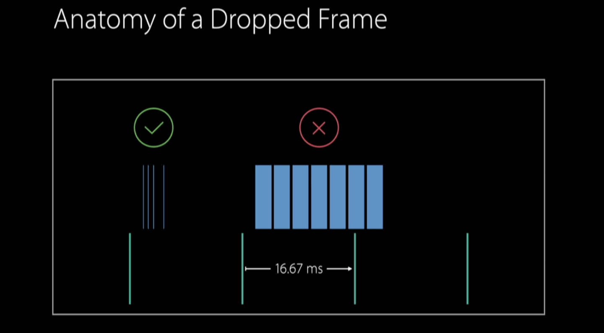
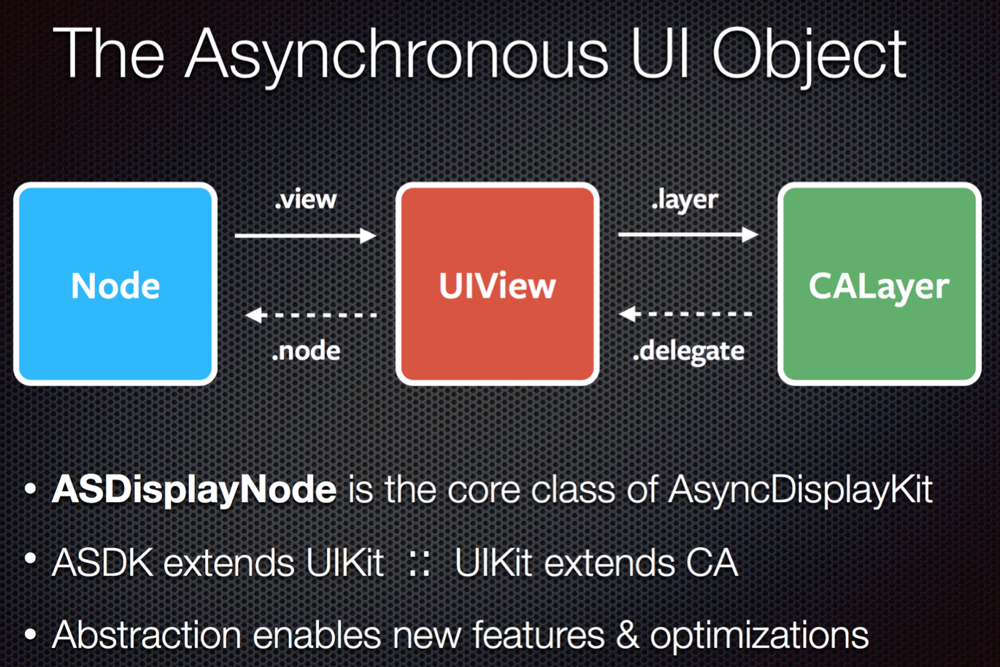

# AsyncDisplayKit介绍（一）原理和思路

对于iOS开发而言，UITableView/UICollectionView的优化一直是iOS应用性能优化重要的一块。即使是iOS10+iPhone7这样的最新软硬件配置，在系统的信息app中滚动，仔细观察的话仍然能感到一定的掉帧现象。对于UI要求苛刻的苹果，竟然在如此简单的tableView上无法达到60fps的帧率，可见优化滚动性能的背后并不简单。

## 为什么？

理想状态下，iOS的帧率应该保持在60fps。然而很多情况下用户操作时会感觉到掉帧或者『不跟手』。原因可能有很多，这里只简单列举几个，网上可以找到许多相应分析：

1. **CPU(主要是主线程)/GPU负担过重或者不均衡** （诸如mask/cornerRadius/drawRect/opaque带来offscreen rendering/blending等等）。由于所有的UIView都是由CALayer来负责显示，因此对Core Animation的了解就变得尤为重要。这里推荐Nick Lockwood的**Core Animation: Advanced Techniques**一书，其中有对Core Animation的性能有着非常详尽的梳理和剖析。
2. **Autolayout布局性能瓶颈** ，约束计算时间会随着数量呈指数级增长，并且必须在主线程执行。具体分析可以参考这篇文章： [Auto Layout Performance on iOS](https://link.zhihu.com/?target=http%3A//floriankugler.com/2013/04/22/auto-layout-performance-on-ios/) 。这也是为何ASDK抛弃了Autolayout而设计了自己的布局系统的重要原因之一( [auto layout · Issue #196 · facebook/AsyncDisplayKit · GitHub](https://link.zhihu.com/?target=https%3A//github.com/facebook/AsyncDisplayKit/issues/196) )。Autolayout在单个View开发时能带来很多便利，而在一些需要高性能的场景下需要谨慎使用。

3. 尽管从iPhone4S(A5)开始CPU已经采用多核，然而 **对于大多数app来说，多线程协作并没有被充分利用。** 换句话说，在app卡顿（主线程所占用的核心满负荷）时，往往CPU的其他核心几乎无事可做。一般情况下，由于主线程承担了绝大部分的工作，如果能把主线程的任务转移一部给其他线程进行异步处理，就可以马上享受到并发带来的性能提升。这应该也是AsyncDisplayKit得名的原因之一。

UIKit的单线程设计也有一定的历史原因。早在十年前iOS SDK刚问世的时候，mobile SDK还是一个非常新的概念，更没有移动多核CPU的存在，因此当时的重点是简单可靠，大多数API都没有支持相对复杂的异步操作。时至今日，如果要完全重构UIKit使之支持异步绘制和布局，对于兼容已有海量的app，难度可想而知。在iOS10中虽然对UICollectionView/UITableView做了一定的预加载优化（WWDC2016 Session219），然而并没有从根本上解决主线程布局和渲染的问题。

## 优化思路

我们知道，当用户开始滚动或点击一个View，所有的事件都会被送到主线程等待处理。此时主线程能否抽出足够充裕的时间来处理变得极为重要，尤其是在连续操作（如UIGestureRecognizer）时，每次touchMoved事件处理都会占用主线程一定的时间（如新的UIImageView进入视图，主线程开始处理布局或者图片解码，而这些需要连续占用大量CPU时间）。如果一个操作耗时超过16ms(1000ms/60fps)，那就意味着下一帧无法及时得到处理，引起丢帧。



（图片截取自WWDC2016 session219）

因此如何能将主线程的压力尽可能减轻成为优化的首要目标。

对列表滚动卡顿的常用解决方案有：

1. 针对Autolayout性能优化：提前计算并缓存cell的layout: [forkingdog/UITableView-FDTemplateLayoutCell: Template auto layout cell for automatically UITableViewCell height calculating](https://github.com/forkingdog/UITableView-FDTemplateLayoutCell)
2. 省去中间滑动过程中的计算，直接计算目标区域cell: [VVebo剥离的TableView绘制](https://link.zhihu.com/?target=https%3A//github.com/johnil/VVeboTableViewDemo)
3. 弃用Autolayout，采用手动布局计算。这样虽然可以换来最高的性能，但是代价是编写和维护的不便，对于经常改动或者性能要求不高的场景并不一定值得。
4. 自行异步渲染Layer，如：[ibireme/YYAsyncLayer: iOS utility classes for asynchronous rendering and display](https://link.zhihu.com/?target=https%3A//github.com/ibireme/YYAsyncLayer).
iOS10列表的prefetch API，只是并没有解决Autolayout的性能问题，同时也受到系统版本限制。


推荐Yaoyuan的博客，也有比较深入的介绍: [iOS 保持界面流畅的技巧 | Garan no dou](https://link.zhihu.com/?target=http%3A//blog.ibireme.com/2015/11/12/smooth_user_interfaces_for_ios/) 

## ASDK的基本思路：异步

对于一般的开发者，自己重新实现一整套异步布局和渲染机制是非常困难的。幸运的是，ASDK做到了。

AsyncDisplayKit(ASDK)是2012年由Facebook开始着手开发，并于2014年出品的高性能显示类库，主要作者是Scott Goodson。Scott(github: [appleguy · GitHub](https://link.zhihu.com/?target=https%3A//github.com/appleguy) )曾经参与了多个iOS版本系统的开发，包括UIKit以及一些系统原生app，后来加入Facebook并参与了ASDK的开发并应用到Paper，因此该库有机会从相对底层的角度来进行一系列的优化。

现在最新的版本是2.0，除了拥有1.0系列版本核心的异步布局渲染功能，还增加了类似ComponentKit的基于flexbox的布局功能。源文件一共近300个，3万多行代码，是一个非常庞大而精密的显示和布局系统。使用上 **如果不考虑工程成本，完全可以在一定程度上代替UIKit的大部分功能。** 同时由于和Instagram同处于FB家族，因此也迅速在最近的更新中加入了IGListKit的支持。

在Scott介绍ASDK的视频中，总结了一下三点占用大量CPU时间的『元凶』（虽然仍然可能有以上提到的其他原因，但ASDK最主要集中于这三点进行优化）：

1. **渲染** ，对于大量图片，或者大量文字（尤其是CJK字符）混合在一起时。而文字区域的大小和布局，恰恰依赖着渲染的结果。ASDK尽可能后台线程进行渲染，完成后再同步回主线程相应的UIView。

2. **布局** 。ASDK完全弃用了Autolayout，另辟蹊径实现了自己的布局和缓存机制。关于布局的问题会在下一篇讲到。

3. 系统objects的 **创建与销毁** 。由于UIKit封装了CALayer以支持触摸等显示以外的操作，耗时也相应增加。而这些同样也需要在主线程上操作。ASDK基于Node的设计，突破了UIKit线程的限制。

既然同步就意味着阻塞，那就异步放到其他线程去做，在需要主线程时再同步回来。


我们知道对于一般UIView和CALayer来说，因为他们不是线程安全的，任何相关操作都需要在主线程进行。正如UIView可以弥补CALayer无法处理用户事件的不足一样，ASDK引入了Node的概念来解决UIView/CALayer只能在主线程上操作的限制（不由让人想起『Abstract layer can solve many problems, except problem of having too many abstract layers.』）。

## ASDisplayNode主要特点：

1. 每个Node对应相应的UIView或者CALayer，从开发者的角度而言，只需要将初始化UIView的代码稍作修改，替换为创建ASDisplayNode即可。在不需要接受用户操作的Node上可以开启isLayerBacked，直接使用CALayer进一步降低开销。根据Scott的研究UIView的开销大约是CALayer的5倍。

2. Node **默认是异步布局/渲染** ，只有在需要将frame/contents等同步到UIView上才会回到主线程，使其空出更多的时间处理其他事件。

3. ASDK只有在认为需要的时候才会异步地为Node加载相应的View，因此创建Node的开销变得非常低。同时Node是 **线程安全** 的，可以在任意queue上创建和设置属性。

4. ASDK不仅有与UIView对应的大部分控件（如ASButtonNode、ASTextNode、ASImageNode、ASTableNode等等），同时也bridge了大多数UIView的方法和属性，可以非常方便的操作frame/backgroundColor/addSubnode等，因此一般情况下只要对Node进行操作，ASDK就会在适当的时候同步到其View。如果需要的话，当相应的View加载之后（或访问node.view手动触发加载），也可以通过node.view的方式直接访问，回到我们熟悉的UIKit。

5. 当实现自定义View的时候，ASDisplayNode提供了一个初始化方法initWithViewBlock/initWithLayerBlock，就可以将任意UIView/CALayer用Node包裹起来（被包裹的view可以使用autolayout），从而与ASDK的其他组件相结合。虽然这样创建的Node与一般view在布局和渲染上的差异不大，但是由于Node管理着何时何地加载view，我们仍然能得到一定的性能提升。

举例来说，当使用UIKit创建一个UIImageView：

```
_imageView = [[UIImageView alloc] init];
    _imageView.image = [UIImage imageNamed:@"hello"];
    _imageView.frame = CGRectMake(10.0f, 10.0f, 40.0f, 40.0f);
    [self.view addSubview:_imageView];
```

使用ASDK后只要稍加改动：

```
_imageNode = [[ASImageNode alloc] init]; _imageNode.image = [UIImage imageNamed:@"hello"]; _imageNode.frame = CGRectMake(10.0f, 10.0f, 40.0f, 40.0f); [self.view addSubview:_imageNode.view];
```

虽然只是简单的把View替换成了Node，然而和UIImageView不同的是，此时ASDK已经在悄悄使用另一个线程进行图片解码，从而大大降低新的用户操作到来时主线程被阻塞的概率，使每一个回调都能得到及时的处理。实践中将会有更加复杂的情况，有兴趣的话可以参考项目中的Example目录，有20多个不同场景下的示例项目。

## 一些细节

1. 在ASDisplayNode.h中有相当多的注释，其中displaysAsynchronously属性大致描述了异步渲染的步骤：

```
> * Asynchronous rendering proceeds as follows:
> * When the view is initially added to the hierarchy, it has -needsDisplay true.
> * After layout, Core Animation will call -display on the _ASDisplayLayer
> * -display enqueues a rendering operation on the displayQueue
> * When the render block executes, it calls the delegate display method
> (-drawRect:… or -display)
> * The delegate provides contents via this method and an operation is added to
> the asyncdisplaykit_async_transaction
> * Once all rendering is complete for the current
> asyncdisplaykit_async_transaction,
> * the completion for the block sets the contents on all of the layers in the
> same frame
```

从中我们可以看到，所有异步渲染操作是先被同一加入asyncdisplaykit_async_transaction，然后一起提交的。在_ASAsyncTransactionGroup.m源文件中，可以看到ASDK是在主线程的runloop（关于runloop可以参考Yaoyuan的 [深入理解RunLoop | Garan no dou](https://link.zhihu.com/?target=http%3A//blog.ibireme.com/2015/05/18/runloop/) 和sunny的 [iOS线下分享《RunLoop》by 孙源@sunnyxx](https://link.zhihu.com/?target=http%3A//v.youku.com/v_show/id_XODgxODkzODI0.html) ）中注册了observer，在kCFRunLoopBeforeWaiting和kCFRunLoopExit两个activity的回调中将之前异步完成的工作同步到主线程中去。

2. ASDisplayNode还有一个属性shouldRasterizeDescendants。

```
> /**
> * @abstract Whether to draw all descendant nodes’ layers/views into this node’s
> layer/view’s backing store.
> * @discussion
> * When set to YES, causes all descendant nodes’ layers/views to be drawn
> directly into this node’s layer/view’s backing
> * store. Defaults to NO.
> * If a node’s descendants are static (never animated or never change attributes
> after creation) then that node is a
> * good candidate for rasterization. Rasterizing descendants has two main
> benefits:
> * 1) Backing stores for descendant layers are not created. Instead the layers
> are drawn directly into the rasterized
> * container. This can save a great deal of memory.
> * 2) Since the entire subtree is drawn into one backing store, compositing and
> blending are eliminated in that subtree
> * which can help improve animation/scrolling/etc performance.
> * Rasterization does not currently support descendants with transform,
> sublayerTransform, or alpha. Those properties
> * will be ignored when rasterizing descendants.
> * Note: this has nothing to do with -[CALayer shouldRasterize], which doesn’t
> work with ASDisplayNode’s asynchronous
> * rendering model.
> */
```

当我们不需要分别关注单个CALayer，也不需要对他们进行操作时，就可以将所有的子node都合并到父node的backing store一并绘制，从而达到节省内存和提高性能的目的。

## 注意事项

1. ASDK不支持Storyboard和Autolayout，但是可以与使用Autolayout的view兼容共存。同样React native和Component Kit等其他Facebook出品的iOS库也不支持Storyboard。

2. 由于Node的异步渲染，很有可能在其View到达屏幕之后，内容仍然在渲染过程中。此时需要额外考虑每个Node的placeholder状态，使用户不至于看到一片空白。

3. 在使用ASDisplayNode初始化initWithViewBlock时，由于Node需要在适当的时候调用该block来创建view，因此并不会立即调用block（block可能capture其他变量，例如self），而是存在一个ivar当中。如果该view始终没被创建，而此时拥有该node的父元素被销毁，容易造成retain cycle导致memory leak。

## Best Practice

由于ASDK的基本理念是在需要创建UIView时替换成对应的Node来获取性能提升，因此对于现有代码改动较大，侵入性较高，同时由于大量原本熟悉的操作变成了异步的，对于一个团队来说学习曲线也较为陡峭。

从我们在实际项目中的经验，结合Scott的建议来看，不需要也不可能将所有UIView都替换成其Node版本。将注意力集中在可能造成主线程阻塞的地方，如tableView/collectionView、复杂布局的View、使用连续手势的操作等等。找到合适的切入点将一部分性能需求较高的代码替换成ASDK，会是一个较好的选择。

对于优化以后的效果，可以尝试我们的应用： [即刻 - 期待每一次推送](https://link.zhihu.com/?target=http%3A//jike.ruguoapp.com/) ，其中消息盒子部分应用了ASDK进行了大量调优工作，从而在拥有大量图片和gif/不定长度文字共存的情况下，仍然能达到60fps的流畅体验。在我们将近两年的实践中，尽管也碰到过一些坑，但是带来的提升也是非常明显的，使在构建更复杂的界面同时保持高性能成为可能。

## 推荐阅读

[AsyncDisplayKit Getting Started](https://link.zhihu.com/?target=http%3A//asyncdisplaykit.org/guide/)

[AsyncDisplayKit Tutorial: Node Hierarchies](https://link.zhihu.com/?target=http%3A//www.raywenderlich.com/107310/asyncdisplaykit-tutorial-node-hierarchies)

[NSLondon — Scott Goodson — Behind AsyncDisplayKit](https://link.zhihu.com/?target=https%3A//www.youtube.com/watch%3Fv%3D-IPMNWqA638)

[MCE 2015 — Scott Goodson — Effortless Responsiveness with AsyncDisplayKit](https://link.zhihu.com/?target=https%3A//www.youtube.com/watch%3Fv%3DZPL4Nse76oY)

[AsyncDisplayKit 2.0: Intelligent User Interfaces — NSSpain 2015](https://link.zhihu.com/?target=https%3A//www.youtube.com/watch%3Fv%3DRY_X7l1g79Q)

[AsyncDisplayKit介绍（一）原理和思路](https://zhuanlan.zhihu.com/p/25371361)