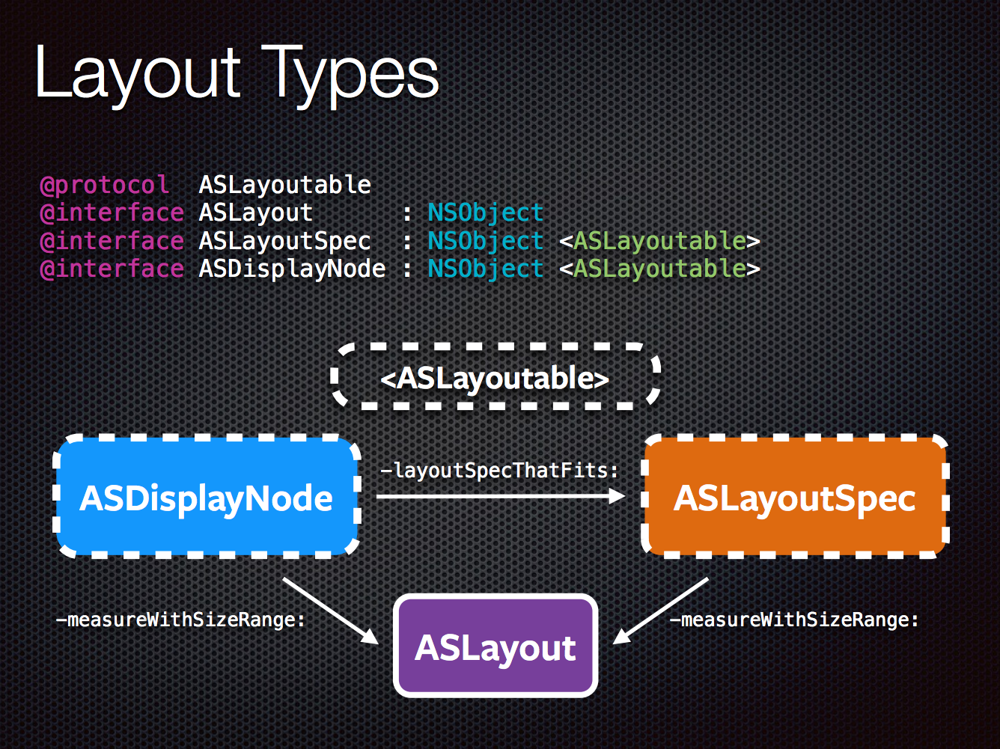
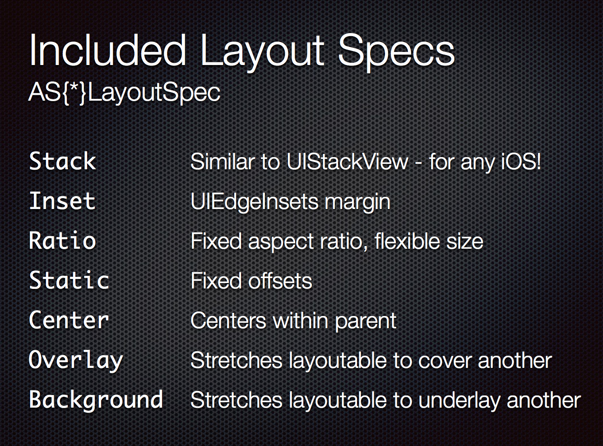
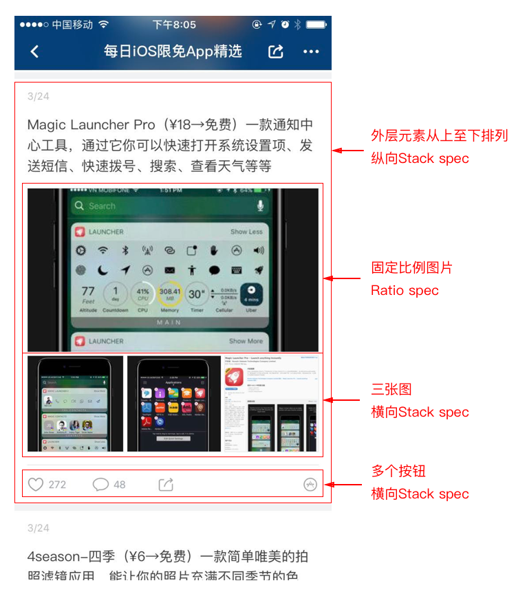

# AsyncDisplayKit介绍（二）布局系统

在上一篇介绍中我们曾经讨论过Autolayout的性能问题。然而在iOS中，除了Autolayout，能选择的只有autoresizingMask，或者纯手动布局。在写了无数view.frame = CGRect(…)之后，我们才发现，一个在HTML中非常简单的流式布局，到iOS9才有相应的UIStackView予以支持（如果用UICollectionView则需要将view包装成CollectionViewCell）。尽管你可以使用 [FDStackView](https://link.zhihu.com/?target=https%3A//github.com/forkingdog/FDStackView) 将系统要求降低到iOS6，对于复杂的布局仍然需要多层View嵌套来实现——其实对于实现stack布局的时候，并不需要一个真正的UIView实例来承载所有的元素，而只是需要它的布局功能而已（就好比UICollectionViewFlowLayout，只负责控制若干个元素的布局规则而不真正负责布局）。

做过Web开发的朋友已经习惯了高效的css布局：声明式、易于调试，boxModel结构化清晰等等优点，特别是使用自动化工具之后，只需要保存文件就可以立即在浏览器中看到更新后的效果；而这一切在iOS中就变得遥不可及：命令式赋值、编译后（Objc速度尚可，而swift编译速度较慢）才能看到结果、Autolayout闭源、视图调试复杂、xcode经常crash等等。如果要实现一个高性能的tableView/collectionView，手写布局几乎是唯一选择。

## Layout的本质

在决定使用哪种布局方式之前，先看看设计师是怎么思考布局的：


1. 每个元素的大小（size）


2. 兄弟元素之间的位置关系：对齐（alignment）和间距（spacing）；父子元素之间的容纳关系：子元素的边距（insets）

设计师确定的，是一个布局规则。

设计稿到了工程师这边以后，我们绝大多数时间都在做以下两件事：

1. 确定UIView自身的大小（覆盖sizeThatFits方法），与parent view无关

1. 根据规则，将subview放在父parent内的指定位置（对应layoutSubviews），由parent view决定

这样自底向上层层递归，最终完成整个屏幕内所有子元素的布局。工程师完成的，是一个基于布局规则的具体实现，关注的对象是单个view或者是两个相邻view之间的关系。

也就是说， **手动布局或者通过约束（Autolayout）其实是在『实现』布局规则，而不是『声明』布局规则** 。抽象层级下降了，随之而来的是多到令人头疼的frame、size、origin计算，可读性、可维护性都非常差。那能不能提高抽象层级，用一个数据结构来表示布局规则，从而摆脱繁重又容易出错的数值计算，让布局系统根据规则自动地、异步地计算呢？

## AsyncDisplayKit的三种布局方式

**1. 手动布局**

这是最基础的一种布局方式。在ASDK中的手动布局与UIKit的手动布局类似，只是方法名从sizeThatFits变成了calculatedSizeThatFits，layoutSubviews方法变成了layout方法。略微不同的是ASDK会将布局结果预先在后台线程进行计算，并缓存下来以提升性能，这点对于tableView滚动流畅性有非常大的帮助。

然而，跟普通手动布局类似，最大的缺点是可读性和可维护性差。由于自身的大小常常和子元素的布局相关联，这两个方法中的代码容易重复；同时由于布局针对自身subView，很难将其代码与其他View进行复用。

**2. Unified layout**

这也是在ASDK中新出现的概念。先介绍一下ASLayout：


一个ASLayout对象包含以下元素：

- 它所代表的布局元素

- 元素的尺寸

- 元素的位置

- 它所包含的sublayouts


可以看出，当一个node具备了确定的ASLayout对象时，它自身的布局也就随之确定了。为了生成ASLayout，ASDisplayNode为subclass提供了如下覆盖点：

```
- (ASLayout *)calculateLayoutThatFits:(ASSizeRange)constrainedSize
```

只要Node能够计算出自己的ASLayout，父元素就可以完成对其的布局。这种方法将sizeThatFits和layoutSubviews结合在一起，一定程度上避免了相似代码的尴尬，但是计算上仍然是手动布局，不够简便。

**3. Automatic Layout(不是系统的Autolayout)**

有了ASLayout这一层抽象，如何通过声明规则而不是通过计算得到它，是问题的核心。

Facebook将React的概念延伸到native，同时也把声明式的语法带到了iOS，产生了 [ComponentKit](https://link.zhihu.com/?target=https%3A//github.com/facebook/componentkit) 框架。早在ASDK1.0的年代大家纷纷表示希望能将其与ComponentKit相融合，幸运的是，在2.0版本中实现了。我选用了作者Scott Goodson在NSSpain的 [演讲pdf](https://link.zhihu.com/?target=https%3A//github-cloud.s3.amazonaws.com/assets/repositories/21265042/15788%3FX-Amz-Algorithm%3DAWS4-HMAC-SHA256%26X-Amz-Credential%3DAKIAISTNZFOVBIJMK3TQ/20160204/us-east-1/s3/aws4_request%26X-Amz-Date%3D20160204T100616Z%26X-Amz-Expires%3D300%26X-Amz-Signature%3D50d624c30b9b31a059b1bf299a615bd72418c420e35d3730cc0017e0b3bfcf73%26X-Amz-SignedHeaders%3Dhost%26actor_id%3D3334458%26response-content-disposition%3Dattachment%3Bfilename%3DAsyncDisplayKit.2.0.Beta.-.October.2015.Slides.pdf%26response-content-type%3Dapplication/pdf) 作为插图，方便大家了解新的布局系统。

Automatic Layout是ASDK最推荐也是最为高效的布局方式。它引入了ASLayoutSpec的概念，来描述抽象的布局规则（并不需要创建对应node或者view来装载子元素）。一旦确定布局规则，它就能依照规则对其负责的子元素进行布局计算，得到每个布局元素的ASLayout对象。

我们先来看一下它们之间的关系：



可以看到ASLayoutSpec和ASDisplayNode都实现了ASLayoutable接口，因此他们都具备生成ASLayout的能力，这样就能唯一确定自身的大小。

* 对于以上提到的Unified布局，当我们实现了calculateLayoutThatFits，ASDK会在布局过程中调用measureWithSizeRange(如果没有缓存过再调用calculateLayoutThatFits)来算出ASLayout。

* 如果ASDisplayNode选择实现layoutSpecThatFits，由更为抽象的ASLayoutSpec来负责指定布局规则，由于ASLayoutSpec也实现了ASLayoutable接口，同样也可以通过调用measureWithSizeRange来获得ASLayout。

由于 **ASLayoutSpec只负责指定布局规则，而不关心其布局的ASLayoutable具体是Node还是其他ASLayoutSpec** ，我们可以轻松地将ASLayoutSpec生成逻辑独立出来，达到复用的目的。

## 挑大梁的ASStackLayoutSpec

ASLayoutSpec主要有以下几种：


通过它们的命名就可以了解其大致作用。其中用途最广泛的无疑是ASStackLayoutSpec，与UIStackView有异曲同工之妙。

ASStackLayoutSpec大量借鉴了CSS的flexbox概念，写过Web代码的同学应该能一眼认出许多熟悉的属性：justifyContent/flexDirection/alignSelf/alignItems/flexBasis等等。不熟悉的朋友也可以通过一个有趣的游戏来学习flexbox： [Flexbox Froggy](https://link.zhihu.com/?target=http%3A//flexboxfroggy.com/)

## 示例

(图中的Huy Nguyen也是ASDK布局的主要贡献者之一)


图中左边是一个imageNode，右边是由两个textNode组成的一个vertical

stack，再和imageNode组合成一个横向的stack，最后加上边缘inset完成整个布局。

事实上，与css类似，绝大多数的布局都可以通过stack和inset的组合来完成；而和UIStackView不同的是，layout spec只是一个存在于内存之中的数据结构，并不需要额外创建view容器来承载子元素，大大节约了复杂布局带来的开销；同时因为它的轻量级和独立性，因此能够将布局规则放到后台线程独立计算，并缓存在node之中，对于大量tableView/collectionView的CellNode快速布局有相当大的帮助。

Huy Nguyen也为ASLayoutSpec写了一个寓教于乐的 [小游戏](https://link.zhihu.com/?target=http%3A//nguyenhuy.github.io/froggy-asdk-layout/) ，只是将上面提到的的针对css的小游戏版本改成了Objc，方便大家快速学习。

在最近的版本中，ASDK也同时支持 [Yoga](https://link.zhihu.com/?target=https%3A//github.com/facebook/yoga) （一个跨平台的flexbox引擎，使用C语言实现）来计算基于flexbox的布局，与ASDK本身实现的flexbox概念类似。

## 即刻的实践

即刻在多个消息页面使用了ASDK新的布局系统，例如：


从我们的实践经验来看有以下优缺点：

## 优点

* 实现一个layout的视角从专注view之间的距离和约束，转变成划分和制定不同view子区域的布局规则，抽象层级变高，可读性、可维护性大大增强。

* 由于ASDisplayNode的显示是异步的，因此无论布局是否依赖于显示结果，都可以在主线程以外进行，并且有缓存，性能有很大提升。

* 借用CSS成熟的flexbox布局模型，有大量现成资料和案例来学习，避免了新造轮子的尴尬。

* 布局规则可以脱离实际布局对象进行独立声明，容易复用。

## 缺点

* 由于与iOS原生布局方式完全不同，学习适应需要一定时间（如果将来flexbox渐渐成为前端标准，花一些时间了解也是完全值得的。）

* 对于ASDK依赖非常重。如果你想对已有的view改造成用flexbox进行布局，需要重新使用ASDisplayNode来实现该view。如果不方便重新写，只能选用类似Yoga的独立框架来实现功能。

* 虽然是声明式布局，然而相对css而言仍较为繁琐。去年参加WWDC时我曾经到Pinterest与Scott有过一些当面交流，也尝试说服他们做一些DSL来简化布局声明。他们的回答是，由于ASDK的复杂性和基础性（类似UIKit），他们仍然将大部分时间放在优化异步渲染和布局性能，并没有太多精力在layout的语法上做出进一步突破。可能当布局系统生长成为独立框架以后分开来做比较合适。

尽管即刻没有在整个项目都采用新的的布局方式，然而ASDK带来的启发是深远的：声明式、异步布局、flexbox、缓存等等。我们也看到有一些其他布局库做了许多声明式的尝试，如 [Brickkit](https://link.zhihu.com/?target=https%3A//github.com/wayfair/brickkit-ios), [Layoutkit](https://link.zhihu.com/?target=https%3A//github.com/linkedin/LayoutKit) 等等，从而加快我们平时的开发和维护效率。


[AsyncDisplayKit介绍（二）布局系统](https://zhuanlan.zhihu.com/p/26283742)