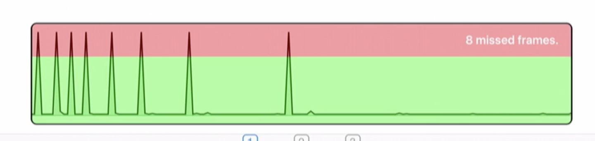
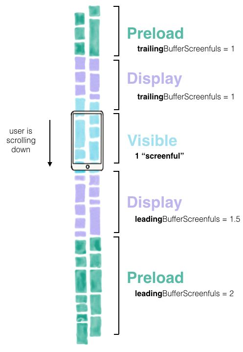

# AsyncDisplayKit介绍（三）深度优化列表性能

（ASDK已改名Texture）

说到视图性能，不能不提到UITableView，对于它的滚动性能的讨论和优化从未停止。在我们的探索过程中，尝试过以下一些措施：

* cell reuse，Apple原生支持，每个人都会用到
* estimated cell height，iOS8开始原生支持
* 手动将计算完成的height缓存(或使用FDTemplateLayoutCell等框架自动计算)
* prefetch API，iOS10开始原生支持
* 异步加载cell内容，文字图片等

还有一些诸如圆角、opaque等普通UIView可能遇到的性能瓶颈已经在 [第一篇](https://link.zhihu.com/?target=https%3A//github.com/yxztj/TechBlogs/blob/master/asdk-1.md) 中讨论了一些，这里不再赘述。

然而我们会想，cell的异步布局、图片和文字渲染是否还可以优化，预加载是否可以更完善更智能？仍然有许多问题等待被解决。

## UITableView加载Cell的过程

我们先看一下一般UITableView加载Cell的过程：

1. cellForRowAtIndexPath，读取model
2. 从reuse池中dequeue一个cell，调用prepareForReuse重置其状态
3. 将model装配到UITableViewCell当中去
4. 布局（耗时且无法缓存的Autolayout），渲染（文字和图片都很耗时），显示

这些操作都在cell将要进入屏幕的一刹那发生，不难理解，在短短的16ms里（60fps）是很难完成这些任务的，尤其是当用户快速滚动的时候，大量任务堆积在主线程runloop，情况变得雪上加霜。如果将滚动中的CPU占用情况用图表显示出来，大概是这样的（WWDC16 session 219）：

这其中每当一个cell将要进入屏幕，一个尖峰就会产生。而在其他相对空闲的时候，cpu的负载相当的低。

自然我们会想到，如果把任务平均分配到一个时间段内，而不是集中在某一个点，是否就可以避免这样的情况发生？如果我们能够 **预测** 一个cell很快将要进入屏幕，而此时cpu空闲，是否可以未雨绸缪，提前做一些布局和渲染的工作？那样一来，在cell真正需要显示的时候，由于布局和渲染结果backing store已经是现成的了，只需要将它送给真正负责显示的view就可以，也就可以避免产生剧烈的性能波动。

## ASTableNode/ASCollectionNode开辟的新航路

首先的好消息是，作为ASDK的一员，ASTableNode以及其cellNode已经具备了异步布局和异步渲染的能力，即使没有做额外优化，仅仅利用ASDK通用的异步机制将耗时操作延后，相对于一般UITableView已经有了显著的提升。虽然性能锯齿仍然存在，但是将其转移到了后台线程以后，用户感受到的卡顿就已经不会那么明显了。

然而这些似乎还不够，在进入屏幕之后才开始渲染，会有短暂的白屏现象（等待渲染完成）再显示内容。 **既然渲染工作可以在显示之后再进行，那么类似的，也可以在显示之前的一段时间，把布局和渲染的工作预先完成** 。

要达到这些目的，首先介绍一些相关的类：

* ASTableNode/ASCollectionNode，可以认为是UITableView/UICollectionView的异步版本，内部包装了原来的UIKit的对应版本，并扩展了一系列功能使他们能够实现异步布局及渲染。
* ASInterfaceState，表示一个node不同的显示状态。其实每个ASDisplayNode都具备interfaceState属性，它主要的用武之地还是在tableNode/collectionNode之中。对于一个UITableViewCell来说，布局和渲染一般都是在cellForRowAtIndexpath同时完成，然而当需要精细处理任务时就需要把每一个不同的状态分开，降低某一瞬间由于CPU负载高导致卡顿的可能性。ASInterfaceState递进地分为5种状态:
* None，该node在一段时间内不会进入屏幕
* MeasureLayout，可能会在一段时间后进入屏幕，应该准备layout和size计算
* Preload，加载所需要的数据，如下载图片，缓存读取等等
* Display，马上将要进入屏幕，开始进行渲染操作，显示包含的文字或者图片
* Visible，该node（所对应的view）至少有1个像素已经在屏幕内，正在显示

对于每一个cell而言，原本需要在同一时间点进行的所有初始化/加载/布局/渲染等工作，现在被均匀分配到了不同的状态进行预处理。随着用户滚动列表，根据cell离屏幕的距离不同，设置相应的interfaceState并触发不同阶段的工作，达到均匀分配的目的。同时，由于不需要在主线程上进行，多个cell的工作可以通过共享后台线程来大幅提高并行效率。

* ASDataController，与ASTableNode一一对应，负责代替ASTableNode管理delegate和dataSource的一系列方法，诸如初始化，插入，删除和一些代理方法等。
* ASRangeController，同样与ASTableNode一一对应，并且可以根据设备性能自定义布局、加载、渲染的工作indexPath区间，在滚动时动态高效地调整各cell的interfaceState来层层触发不同显示阶段的工作，对于流畅滚动起到了至关重要的作用。

* ASScrollDirection，定义了列表滚动的方向（上下左右）。在ASRangeController调整各阶段的工作区间时，一般在用户滚动的方向上需要多加载一些，而滚出屏幕的cell在一定时间内回到屏幕的概率较低，因此其分配到的资源也就相应少一些。

在ASDK1.x的时代，由于彼时还没有ASRangeController的存在，cell的渲染只会在进入屏幕以后进行，也就是说，虽然性能能够达到60fps，但是滚动较快时，渲染跟不上，『白屏』现象就出现了。到了2.x有了ASRangeController之后，虽然在滚动极快的情况下仍然会因为资源不足而产生白屏现象，但是在一般情况下，因为资源分配更加合理，这个问题得到了显著的改善。

## 一些细节

## 多线程

当同时layout多个node时，如何均匀分配工作到各个线程，同时单次不占用过多cpu时间？

ASDK是这么做的：

1. 获取当前设备上cpu的数量，并乘以每个cpu的工作量，如4 * 5 = 20，即同一批最多对20个node进行布局。（尽管没有找到严格的文档来说明这样的计算方式会带来最高的效率，但是应该要比不分批次处理更优，使占用的cpu时间片可控）
2. 调用dispatch_apply，对同一批次20个node进行并行布局计算
3. 每一批处理20个，直到所有都处理完

## 监听状态变化

不光ASDisplayNode本身会根据不同的state进行相应的工作，它同时也提供了一系列的方法供子类override，如didEnterPreloadState/didExitVisibleState等等。在实际应用中，由于子类通常会持有一些自己管理的资源（如图片），需要控制在显示/离开屏幕之际进行资源的分配/回收。由于每个时间点分的比较细，只要将工作均匀、合理地分配到相应的方法中，就可以实现非常精确高效的资源调度。

## 内存管理

ASRangeController经常需要管理屏幕外的node（可能同时有好几屏的内容同时进行布局计算和显示），通过预处理来减轻将来的工作量，是一个典型的『空间换时间』的办法，对于内存的压力自然就会上升。

为此，ASRangeController提供了一些参数，让开发者可以自行决定每个stage所囊括的范围，达到控制内存的：

* ASLayoutRangeModeFull，此时用到的资源较多，同时用户体验也是最好的
* ASLayoutRangeMinimum，比上一种类型节省一些资源
* ASLayoutRangeModeVisibleOnly，在app退到后台的时候自动设置，将屏幕外的node所占用的资源释放，降低app在系统中被杀的概率
* ASLayoutRangeModeLowMemory，比上一种更省内存，对于app退到后台，并且目前没有在屏幕上（可能在navigation stack里）的rangeController适用，最大程度释放资源

我们可以通过调用setTuningParameters的方式，对于每一种mode中的每一种layoutRangeType做出精细调整。同时，ASDK会自动根据此时node在屏幕上的情况，自动在以上几种mode中来回切换，并根据指定的参数范围来加载/释放资源，达到资源和性能的平衡。

ASDK中还自带了一个显示rangeController工作情况的小工具：

即刻在热门页面有4个tab，相应的右下角的debug view显示的分别是4个页面不同的working range。箭头表示当前的滚动方向，由于我们配置了在滚动方向上加载的距离比反方向要更长，因此可以看到在滚动方向上的色块会更长一些。

## 即刻的实践

即刻iOS在最初时也曾苦苦找寻列表性能优化方案。在阅读了Ray Wenderlich的 [一篇文章](https://link.zhihu.com/?target=https%3A//www.raywenderlich.com/124311/asyncdisplaykit-2-0-tutorial-getting-started) 之后，惊艳其出色的性能，开始接触ASDK。最开始尝试在消息页面使用，后来在长期实践中，发现其确实能够解决tableView的行高计算和性能问题，才渐渐在其他页面使用。

就如同在本系列第一篇提到的，对于先进的框架虽然不能重度依赖，我们也愿意勇于拥抱其先进之处。站在ASDK的角度看UITableView，就能有更大的空间来重新审视列表滚动的本质，将性能和资源分配效率提升到一个新的高度；即使将来脱离ASDK，仍然有一些想法值得我们进一步思考。

想体验即刻的朋友可以下载看一下，最近又增加了不少新玩法 :)

[AsyncDisplayKit介绍（三）深度优化列表性能](https://zhuanlan.zhihu.com/p/29537687)