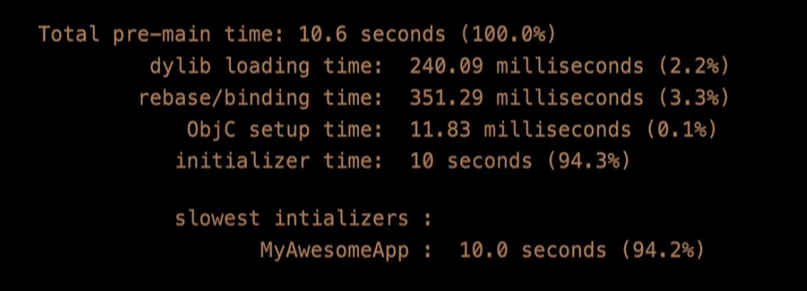
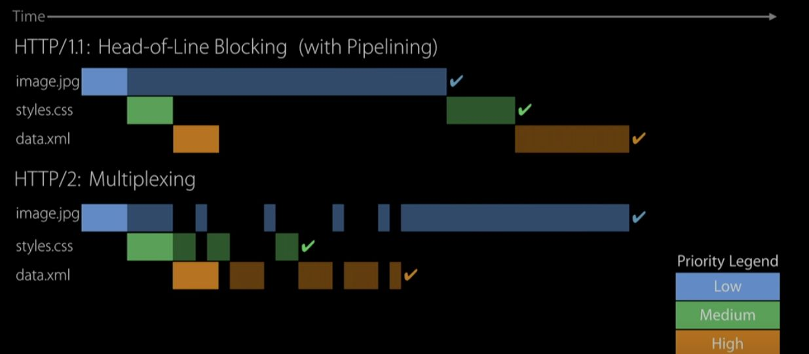

# iOS app启动速度研究实践

对于一个用户每天打开多次的app来说，用户会重复经历这样一个过程：

1. 找到app图标并点击
2. 系统启动动画（从icon放大到全屏）
3. [Launch Screen](https://link.zhihu.com/?target=https%3A//developer.apple.com/design/human-interface-guidelines/ios/icons-and-images/launch-screen/) 停留一段时间
4. （有些app会展示自己的广告页，看3~5秒广告）
5. 进入主界面，开始加载动画
6. 网络加载完成，开始渲染界面
7. 加载返回数据中的图片

以上是用户看到的加载过程，一定程度上决定了用户对app是否responsive的印象。

从技术上来说，app可以掌控并且优化的，可以按顺序分为四个主要部分：

1. 应用本身被系统加载到内存
2. 应用执行启动代码
3. 第一屏内容的网络请求
4. 布局计算和文字图形渲染

在即刻，我们通过持续的分析、监控和优化， **将整个流程所需要的时间压缩到1秒左右** ，使用户几乎感觉不到app重启的过程。接下来我们会一一讨论，如何把每个环节都压缩到极限。

## 应用被系统加载

虽然app代码是“被加载”的，开发者能控制的部分很有限，但是我们可以把代码组织成“最适合被系统加载”的形式，以降低系统的负担，达到加快加载速度的目的。

这部分所涉及到的所有原理、方法、测量工具，大多数都在WWDC16–406和WWDC17–413中有比较详细的解释，这里不再重复。网上也有一些中文翻译可以参考。苹果本身也一直在优化Swift和dyld，并在iOS 11中加入了dyld 3，对每次模块加载过程进行cache，大大加快了加载速度。

简而言之，除去系统已经帮我们做的优化，我们可以做的部分主要是：

* 减少动态库的数量。动态库的解耦特点和分模块的文件组织形式，对，但是在启动时变成了一个负担，因为dyld需要分别从文件系统中加载每一个framework，执行一系列的初始化操作，对于磁盘IO和CPU都是不小的开销。即刻在去年9月份Swift支持静态库之后第一时间进行了研究，具体内容可以参考我们的知乎专栏文章： [即刻Swift静态库实践](https://zhuanlan.zhihu.com/p/32178522) ，事实证明这是app被系统加载过程中，我们能做的最大的一块优化。

打开DYLD_PRINT_STATISTICS以后可以看到加载各阶段所花费的时间

* 类初始化。最著名的全局初始化可能就是Objc的+load（即刻是一个纯Swift项目，所以不存在这方面的问题）。同时适当减少类的数量和全局静态成员也会有一定的帮助。
* 不要自己使用dlopen方法，让系统来处理模块加载

## 应用执行启动代码

我们注意到绝大多数的启动逻辑，诸如初始化app各类基础服务，加载第三方库，都是在AppDelegate.didFinishLaunchWithOptions方法中执行的，而这个方法是在主线程上，会阻塞用户操作。可以注意的点有：

* 除了用户看到的第一屏内容所依赖的初始化方法（UI和基础服务），尽量以异步，甚至是后台线程的方式来做初始化。
* 即刻的各模块是以Service的方式组织。除了启动必须调用的服务，其他服务的初始化通常都会等到真正需要调用的时候才被执行。
* Swift的全局变量和静态变量都是 [以lazy方式加载](https://link.zhihu.com/?target=https%3A//docs.swift.org/swift-book/LanguageGuide/Properties.html%23//apple_ref/doc/uid/TP40014097-CH14-ID254) ，不需要担心不必要的工作量，因此尽量使用Swift。
* 对于第三方库，虽然每个sdk都建议在didFinishLaunchWithOptions中做初始化，但其实大多都没有这么紧急，稍微延后一些也是完全可以接受的，这样就大大减轻了启动代码的工作量。

对于这一块的性能调试，也在上面提到的两个WWDC session中有详细解释。

## 第一屏内容的网络请求

通常来说，一个app启动时需要做若干网络请求，包括数据上报、获取配置、拉取首屏内容、加载图片等等，而绝大多数app都是采用HTTP请求的方式来执行的（有些超级大厂如微信会开发自己的协议，这里不做讨论），那么HTTP的性能就不得不关注。

先来回顾一下整个连接的建立过程：

1. 首先是dns查询，需要一个RTT(Round Trip Time)。
2. 其次是https连接过程：

tcp握手和tls握手

从图上我们可以看到，tcp握手需要一个RTT，而TLS握手需要两个RTT。

假如网络情况ping需要100ms，那么在请求真正发起之前，dns+tcp+TLS就已经用掉了400ms（ **4个RTT** ），在这之后才能真正的发起请求（这些还需要一个RTT加上服务端的响应时间）。可以想象，如果每个网络请求都需要先经历这个过程，那样的速度是无法接受的。

幸运的是我们有以下的一些机制可以利用：

* 一般服务器会将dns的ttl设置为60秒，因此在启动过程中只需要查询一次，60秒内其他请求可以复用第一个请求的dns查询结果。同时WWDC中苹果提到，iOS接下来会优化dns查询过程，原理是虽然dns查询结果每60秒就会过期（防止ip突然切换），但事实上ip很少会变化，绝大多数dns查询都是多余的。这样一来在实际执行中，即使系统dns缓存超过了ttl的时间，绝大多数情况下也可以直接用这个ip进行请求，同时并行发起dns查询。一般来说结果会跟上次结果一样，那么就能够省下了一个RTT；万一结果不一致，再重新进行连接

>TTL值全称是“生存时间（Time To Live)”，简单的说它表示DNS记录在DNS服务器上的缓存时间。

* HTTP/1.1支持keep-alive，在一个请求结束后，tcp连接不会马上关闭，那么下一个请求可以复用该连接，直接省去4个RTT
* HTTP/2支持多路复用，不但每个请求复用都可以复用同一个连接，在第一个请求发出去后等待返回的时间里，可以直接发送后面的请求，避免网络资源闲置。同时请求返回时也不需要等第一个response返回完成，可以交替传输，使带宽利用率达到最大。具体对比如图：

只有一个连接，并且带宽一直是占满的

* HTTP/2的header部分使用 [HPACK](https://link.zhihu.com/?target=https%3A//http2.github.io/http2-spec/compression.html) 进行压缩，原理比较简单：因为大多数请求的header字段高度重合，因此每个header的键值对只需要传一次（有些更通用的字段甚至是系统预制的）并给它指定一个code，下次请求只需要传这个code就足够了。这样一来http请求的开销大大降低，再加上链接复用，已经接近了websocket的水平。
* TLS1.3中优化了握手过程，在Client Hello阶段也一并发送密码协议（原本这是在第二个RTT交换的数据），省去一个RTT（iOS今年下半年会支持）。一个需要注意的是，TLS1.3的连接恢复过程只需要0-RTT，那么就会面临跟tcp Fast Open一样的问题—— [无法抗重放攻击](https://link.zhihu.com/?target=https%3A//security.stackexchange.com/questions/166156/understanding-a-tls-1-3-0-rtt-replay-attack) 。此时客户端需要保证此请求是幂等的（如HTTP GET）。

在实践中，即刻的服务端的api和cdn已经全面支持了HTTP/2，因此除了第一个请求，其他绝大多数请求所需要的时间只需要一个RTT+服务端的处理时间，这对于大量的图片加载尤其重要。从Wireshark抓包可以发现，客户端和每个域名仅保持一个tcp连接，退到后台会自动断开；下一次从后台返回时，重新进行tcp和tls握手（此时TLS处于恢复连接状态，会比建立连接时省一个RTT）。

每年的WWDC都会有网络相关的session，如WWDC14–707/WWDC15–719/WWDC15–711/WWDC16–714/WWDC17–707/WWDC17–709/WWDC18–714，数量比较多，值得花时间深入研究。苹果在网络协议上的推进也是不遗余力，从IPv6到ECN到TFO，从SPDY到HTTP/2再到TLS1.3，系统几乎都是在第一时间支持。

## 布局计算和文字图形渲染

即刻对于布局渲染方面的性能一直持续投入了大量的精力，应该是国内Texture应用最广泛的app，至今已有三年多的时间。对于图片和文字的布局渲染分析可以参考我们的知乎专栏，一共有 [三篇文章](https://zhuanlan.zhihu.com/p/25371361) 。

近年来iOS也着重优化了UICollectionView的预加载，推出了prefetch api。另外，关于图形渲染可以参考WWDC14–419/WWDC18–220等session。

此外值得一提的是，在布局计算方面，早在15年初我们已经意识到Autolayout性能堪忧，在layout复杂的情况下（尤其是列表）时间开销会呈指数级增长，这也是当初我们决心投入Texture的一大原因。但是在WWDC18中苹果突然发现，在Autolayout面世整整六年后，复杂度也可以是线性的！

为什么早点不优化！

看到这里我们都吃惊不小，毕竟一个算法的最优解从指数级一下子下降到线性，只有两种可能：要么是苹果创造了重大的技术突破。要么是这些年来的时候就没有认真研究……不过虽然性能问题解决了很多，Texture在布局方面仍然具有非常大的不同，如异步布局、缓存、flexbox等等，值得我们深入研究。

## 其他一些值得注意的点

* 在苹果的Human Interface Guideline中特别提到，app启动的launch screen尽量和应用首屏保持一致，给用户带来流畅的启动体验。国外的app如Facebook、Instagram都是这么做的，即刻也一样。但是国内app几乎都会加一个带有logo的闪屏页，有些还有长达3~5秒的广告，体验非常不好（如果有了额外的3~5秒在后面偷偷加载，那么以上这些优化都变得可有可无了）。
* 定期清理无用代码和资源，保持精简。做加法大家都会，但是当一个app变得臃肿，加载速度一定会很成问题。定期重构清理，使app保持轻量，那么加载速度自然会有所提升。
* 如果需要用xcode或instruments来测试启动速度，应该尽量使用release build；最后真正体验加载速度需要用线上的版本，而不是Testflight。原因是tf版本启动时会同步访问苹果的ocsp服务，校验测试证书是否仍然有效，在国内会比较缓慢。

[iOS app启动速度研究实践](https://zhuanlan.zhihu.com/p/38183046)