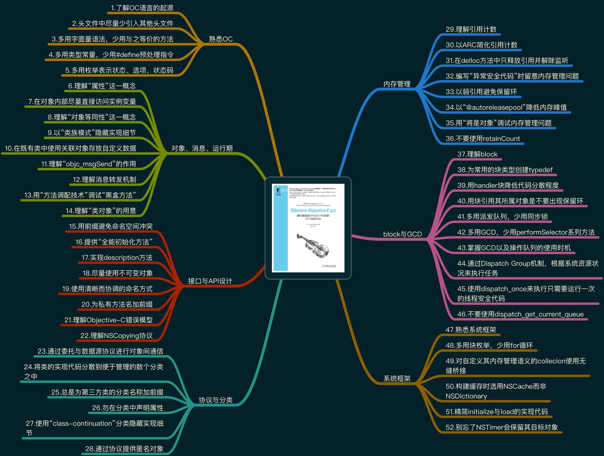
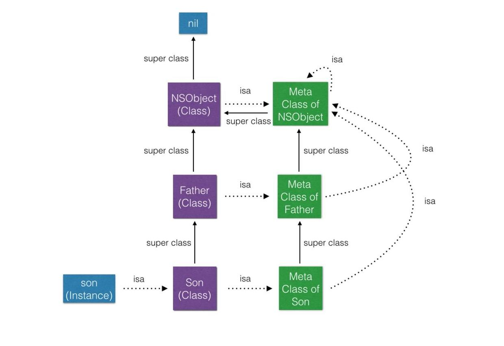
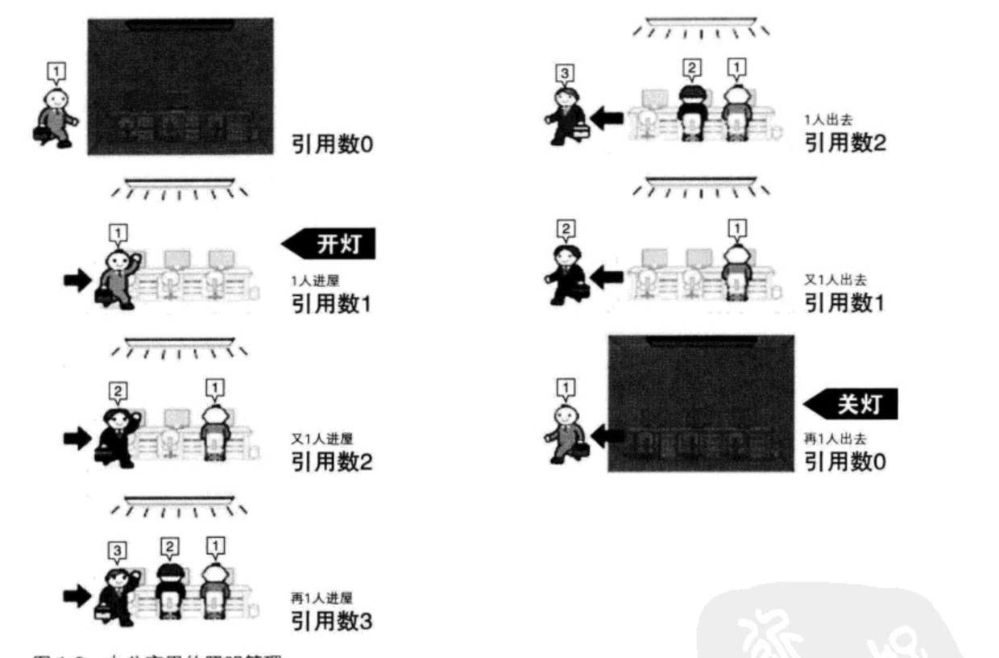

   

  
# Effective Objective-C 2.0 编写高质量iOS与OS X代码的52个有效方法

> 最近在重温这本OC经典之作《Effective Objective-C 2.0编写高质量iOS与OS X代码的52个有效方法》，这篇文章算是重温之后的产物吧，读完这篇文章你将快速读完这本书，由于个人能力有限，难免有一些遗漏或者错误，请各位看官不吝赐教  


上面就是这本书的目录，可以 [点击这里下载](https://pan.baidu.com/s/1bpCj0i7) PDF版

## 第一章：熟悉Objective-C

### 第一条：了解Objective-C语言的起源

1. `Objective-C` 从Smalltalk语言是从 `Smalltalk` 语言演化而来， `Smalltalk` 是消息语言的鼻祖。
2. `Objective-C` 是 `C语言` 的超集，在 `C语言` 基础上添加了面向对象等特性，可能一开始接触时你会觉得语法有点奇怪，那是因为 `Objective-C` 使用了动态绑定的 `消息结构` ，而 `Java` ， `C++` 等等语言使用的是函数调用。
3. `消息结构` 与 `函数调用` 的关键区别在于：函数调用的语言，在编译阶段由 `编译器` 生成一些 `虚方法表` ，在运行时从这个表找到所要执行的方法去执行。而使用了动态绑定的 `消息结构` 在运行时接到一条消息，接下来要执行什么代码是运行期决定的，而不是编译器。

### 第二条： 在类的文件中尽量少引用其他头文件

1. 如果需要引用一个类文件时，只是需要使用类名，不需要知道其中细节，可以用 `@class xx.h` ，这样做的好处会减少一定的编译时间。如果是用的 `#import` 全部导入的话，会出现 `a.h` import了 `b.h`,当 `c.h` 又import `a.h` 时，把 `b.h` 也都导入了，如果只是用到类名，真的比较浪费，也不够优雅
2. 有时候无法使用 `@class` 向前声明，比如某个类要遵循一项协议，这个协议在另外一个类中声明的，可以将协议这部分单独放在一个头文件，或者放在分类当中，以降低引用成本。

### 第三条：多用字面量语法，少用与之等价的方法

1.多使用字面量语法来创建字符串，数组，字典等。 

**传统创建数组方法:**

```
NSArray *languages = [NSArray arrayWithObjects:@"PHP", @"Objective-C", someObject, @"Swift", @"Python", nil];
NSString *Swift = [languages objectAtIndex:2];
NSDictionary *dict = [NSDictionary dictionaryWithObjectsAndKeys:@"key", @"value", nil];
NSString *value = [languages objectForKey:@"key"];
复制代码
```

**字面量:**

```
NSArray *languages = @[@"PHP", @"Objective-C", someObject, @"Swift", @"Python"];
NSString *Swift = languages[2];
NSDictionary *dict = @{@"key" : @"value"};
NSString *value = languages[@"key"];

复制代码
```

这样做的好处：使代码更简洁，易读，也会避免nil问题。比如languages数据中 someObject 如果为nil时，字面量语法就会抛出异常，而使用传统方法创建的languages数组值确是 `@[@"PHP", @"Objective-C"];` 因为字面量语法其实是一种语法糖，效果是先创建了一个数组，然后再把括号中的对象都加到数组中来。 不过字面量语法有一个小缺点就是创建的数组，字符串等等对象都是不可变的，如果想要可变的对象需要自己多执行一步 `mutableCopy` ，例如

```
NSMutableArray *languages = [@[@"PHP", @"Objective-C", @"Swift", @"Python"] mutableCopy];
复制代码
```

### 第四条：多用类型常量，少用#define预处理指令

[第4条第5条看这里](http://www.jianshu.com/p/064b5b82a3a2)

### 第五条：多用枚举表示状态、选项、状态码

[第4条第5条看这里](http://www.jianshu.com/p/064b5b82a3a2)

- - - -

## 第二章：对象、消息、运行期

### 第六条：理解“属性”这一概念

这一条讲的是属性的基本概念，以及属性的各种修饰符，这些就不多啰嗦了，这里强调一下:

1. 定义对外开放的属性时候尽量做到暴露权限最小化，不希望被修改的属性要加上 `readonly` 。
2. `atomic` 并不能保证多线程安全，例如一个线程连续多次读取某个属性的值，而同时还有别的线程在修改这个属性值得时候，也还是一样会读到不同的值。atomic 的原理只是在 setter and getter 方法中加了一个 `@synchronized(self)` ，所以iOS开发中属性都要声明为 `nonatomic`,因为atomic严重影响了性能，但是在Mac OSX上开发却通常不存在这个性能问题
3. 说一下下面的哪个属性声明有问题

```
@property (nonatomic, strong) NSArray *arrayOfStrong;
@property (nonatomic, copy) NSArray *arrayOfCopy;
@property (nonatomic, strong) NSMutableArray *mutableArrayOfStrong;
@property (nonatomic, copy) NSMutableArray *mutableArrayOfCopy;
复制代码
```

[具体运行示例点击查看](https://github.com/maligh/ML-Objective-C-Demo/tree/master/Copy-Strong-Array-MutableArray) 答案是正常应该这样声明

```
@property (nonatomic, copy) NSArray *arrayOfCopy;
@property (nonatomic, strong) NSMutableArray *mutableArrayOfStrong;
复制代码
```

### 第七条：在对象内部尽量直接访问实例变量

1. 在类内读取属性的数据时，应该通过直接实例变量来读，这样不经过Objecit-C的方法派发，编译器编译后的代码结果是直接访问存实例变量的那块内存中的值，而不会生成走方法派发的代码，这样的速度会更快。
2. 给属性写入数据时，应该通过属性的方式来写入，这样会调用setter 方法。但是在某种情况下初始化方法以及dealloc方法中，总是应该直接通过实例变量来读写数据，这样做是为了避免子类复写了setter方法造成的异常。
3. 使用了懒加载的属性，应该一直保持用属性的方式来读取写入数据。

### 第八条：理解“对象等同性”这一概念

思考下面输出什么？

```
NSString *aString = @"iphone 8";
    NSString *bString = [NSString stringWithFormat:@"iphone %i", 8];
    NSLog(@"%d", [aString isEqual:bString]);
    NSLog(@"%d", [aString isEqualToString:bString]);
    NSLog(@"%d", aString == bString);
复制代码
```

答案是110 `==` 操作符只是比较了两个指针，而不是指针所指的对象

### 第九条：以“类族模式”隐藏实现细节

为什么下面这段if 永远为false

```
id maybeAnArray = @[];
    if ([maybeAnArray class] == [NSArray class]) {
         //Code will never be executed
    }
复制代码
```

因为[maybeAnArray class] 的返回永远不会是NSArray，NSArray是一个类族，返回的值一直都是NSArray的实体子类。大部分collection类都是某个类族中的’抽象基类’ 所以上面的if想要有机会执行的话要改成

```
id maybeAnArray = @[];
    if ([maybeAnArray isKindOfClass [NSArray class]) {
         //Code probably be executed
    }
复制代码
```

这样判断的意思是，maybeAnArray这个对象是否是NSArray类族中的一员 ** 使用类族的好处：可以把实现细节隐藏再一套简单的公共接口后面 **

### 第十条：在既有类中使用关联对象存放自定义数据

这条讲的是 `objc_setAssociatedObject` 和 `objc_getAssociatedObject`,如何使用在这里就不多说了。值得强调的一点是，用关联对象可能会引入难于查找的bug，毕竟是在runtime阶段，所以可能要看情况谨慎选择

### 第十一条：理解“objc_msgSend”的作用

之前在 `了解Objective-C语言的起源` 有提到过，Objective-C是用的 `消息结构` 。这条就是让你理解一下怎么传递的消息。

1. 在Objective-C中，如果向某个对象传递消息，那就会在运行时使用动态绑定（dynamic binding）机制来决定需要调用的方法。但是到了底层具体实现，却是普通的C语言函数实现的。这个实现的函数就是 `objc_msgSend`,该函数定义如下：

```
void objc_msgSend(id self, SEL cmd, ...) 
复制代码
```

这是一个参数个数可变的函数，第一参数代表 `接收者` ，第二个参数代表 `选择子` （OC函数名），后续的参数就是消息（OC函数调用）中的那些参数 2. 举例来说：

```
id return = [git commit:parameter];
复制代码
```

上面的Objective-C方法在运行时会转换成如下函数：

```
id return = objc_msgSend(git, @selector(commit), parameter);
复制代码
```

objc_msgSend函数会在接收者所属的类中搜寻其 `方法列表` ，如果能找到这个跟选择子名称相同的方法，就跳转到其实现代码，往下执行。若是当前类没找到，那就沿着继承体系继续向上查找，等找到合适方法之后再跳转 ，如果最终还是找不到，那就进入 `消息转发` 的流程去进行处理了。 3. 说过了OC的函数调用实现，你会觉得消息转发要处理很多，尤其是在搜索上，幸运的是objc_msgSend在搜索这块是有做缓存的，每个OC的类都有一块这样的缓存，objc_msgSend会将匹配结果缓存在 `快速映射表` (fast map)中，这样以来这个类一些频繁调用的方法会出现在fast map 中，不用再去一遍一遍的在 `方法列表` 中搜索了。 4. 还有一个有趣的点，就是在底层处理发送消息的时候，有用到 `尾调用优化` ，大概原理就是在函数末尾调用某个不含返回值函数时，编译器会自动的不在栈空间上重新进行分配内存，而是直接释放所有调用函数内部的局部变量，然后直接进入被调用函数的地址。

### 第十二条：理解消息转发机制

关于这条这看看这篇文章： [iOS理解Objective-C中消息转发机制附Demo](http://www.jianshu.com/p/f9bd98ad5b05)

### 第十三条：用“方法调配技术”调试“黑盒方法”

这条讲的主要内容就是 Method Swizzling，通过运行时的一些操作可以用另外一份实现来替换掉原有的方法实现，往往被应用在向原有实现中添加新功能，比如扩展UIViewController，在viewDidLoad里面增加打印信息等。具体例子 [可以点击我查看](https://github.com/maligh/ML-OC-Catagory/tree/master/UIViewController%2BHookForLog)

### 第十四条：理解“类对象”的用意

Objective-C类是由Class类型来表示的，它实际上是一个指向objc_class结构体的指针。它的定义如下:

```
typedef struct objc_class *Class;
复制代码
```

在<objc/runtime.h>中能看到他的实现：

```
struct objc_class {
    Class isa  OBJC_ISA_AVAILABILITY;    ///< 指向metaClass(元类)

#if !__OBJC2__
        Class super_class                       OBJC2_UNAVAILABLE;  ///< 父类
        const char *name                        OBJC2_UNAVAILABLE;  ///< 类名
        long version                            OBJC2_UNAVAILABLE;  ///< 类的版本信息，默认为0
        long info                               OBJC2_UNAVAILABLE;  ///< 类信息，供运行期使用的一些位标识
        long instance_size                      OBJC2_UNAVAILABLE;  ///< 该类的实例变量大小
        struct objc_ivar_list *ivars            OBJC2_UNAVAILABLE;  ///< 该类的成员变量链表
        struct objc_method_list **methodLists   OBJC2_UNAVAILABLE;  ///< 方法定义的链表
        struct objc_cache *cache                OBJC2_UNAVAILABLE;  ///< 方法缓存
        struct objc_protocol_list *protocols    OBJC2_UNAVAILABLE;  ///< 协议链表
#endif

} OBJC2_UNAVAILABLE;
复制代码
```

此结构体存放的是类的“元数据”（metadata)，例如类的实例实现了几个方法，具备多少实例变量等信息。 这里的isa指针指向的是另外一个类叫做元类（metaClass)。那什么是元类呢？元类是类对象的类。也可以换一种容易理解的说法：

1. 当你给对象发送消息时，runtime处理时是在这个对象的类的方法列表中寻找
2. 当你给类发消息时，runtime处理时是在这个类的元类的方法列表中寻找

我们来看一个很经典的图来加深理解：


可以总结为下：

1. 每一个 `Class` 都有一个 `isa指针` 指向一个唯一的 `Meta Class`
2. 每一个 `Meta Class` 的 `isa指针` 都指向最上层的 `Meta Class` ，这个 `Meta Class` 是 `NSObject的Meta Class` 。(包括 `NSObject的Meta Class` 的 `isa指针` 也是指向的 `NSObject的Meta Class` ，也就是自己，这里形成了个闭环)
3. 每一个 `Meta Class` 的 `super class` 指针指向它 `原本Class` 的 `Super Class的Meta Class` (这里最上层的 `NSObject的Meta Class` 的 `super class` 指针还是指向自己)
4. 最上层的 `NSObject Class的super class` 指向 nil

## 第三章：接口与API设计

### 第十五条：用前缀避免命名空间冲突

Objective-C没有类似其他语言那样的命名空间机制(namespace)，比如说PHP中的

```
<?php
namespace Root\Sub\subnamespace;
复制代码
```

这就会导致当你不小心实现了两个相同名字的类，或者把两个相对独立的库导入项目时而他们又恰好有重名的类的时候该类所对应的符号和Meta Class符号定义了两次。所以很容易产生这种命名冲突，让程序的链接过程中出现出现重复的符号造成报错。 为了避免这种情况，我们要尽量在类名，以及分类和分类方法上增加前缀，还有一些宏定义等等根据自己项目来定吧

### 第十六条：提供“全能初始化方法”

如果创建类的实例的方式不止一种，那么这个类就会有多个初始化方法，这样做很好，不过还是要在其中选定一个方法作为全能初始化方法，剩下的其余的初始化方法都要调用它，这样做的好处是以后如果初始化的逻辑更改了只需更改一处即可，或者是交给子类覆写的时候也只覆写这一个方法即可~ 举个例子来说:可以看一下NSDate的实现在NSDate.h中NSDate类中定义了一个全能初始化方法：

```
- (instancetype)initWithTimeIntervalSinceReferenceDate:(NSTimeInterval)ti NS_DESIGNATED_INITIALIZER;
复制代码
```

其余的类似初始化方式定义在NSDate (NSDateCreation) 分类中

```
- (instancetype)initWithTimeIntervalSinceNow:(NSTimeInterval)secs;
- (instancetype)initWithTimeIntervalSince1970:(NSTimeInterval)secs;
- (instancetype)initWithTimeInterval:(NSTimeInterval)secsToBeAdded sinceDate:(NSDate *)date;
复制代码
```

在NSDate文档中有一条： `If you want to subclass NSDate to obtain behavior different than that provided by the private or public subclasses, you must do these things:` 然后其中要做的有一步就是

```
Override [initWithTimeIntervalSinceReferenceDate:
](apple-reference-documentation://hcslylvSCo), one of the designated initializer methods`
复制代码
```

**这个是我们组织代码过程中应该学习的地方！**

### 第十七条：实现description方法

这条讲的是可以通过覆写description方法或者debugDescription方法来在NSLog打印时或者LLDB打印时输出更多的自定义信息。(数据和字典的可以通过覆写 `descriptionWithLocale:` 方法) 友情提示：不要在description中使用 `NSLog("%@",self);` ，不然会掉进无底深渊啊 这里我有一个有趣的想法，不过还没完全实现，就是想通过覆写description能把任何一个对象的属性值名称，属性值都一一完整的记录下来， [可以点击查看](https://github.com/maligh/ML-Objective-C-Demo/tree/master/MLDescription)

### 第十八条：尽量使用不可变对象

这条主要讲尽量使用不可变的对象，也就是在对外属性声明的时候要尽量加上readonly修饰，默认是readwrite，这样一来，在外部就只能读取该数据，而不能修改它，使得这个类的实例所持有的数据更加安全。如果外部想要修改，可以提供方法来进行修改。 不要把可变的collection作为属性公开，而应提供相关方法，以此修改对象中的可变collection(这条个人感觉一般在常用、重要的类才有必要，毕竟也增加了不少代码量) 比如例子：

```
//Language.h
@property (nonatomic, strong) NSSet *set;
复制代码
```

应该改为

```
//Language.h
@property (nonatomic, strong, readonly) NSSet *languages;
- (void)addLanguage:(NSString *)language;
- (void)removeLanguage:(NSString *)language;
//**.m
@implementation Language {
    NSMutableSet *mutableLanguages;
}
- (NSSet *)languages {
    return [_mutableLanguages copy];
}
- (void)addLanguage:(NSString *)language {
    [_mutableLanguages addObject:language];
}
- (void)removeLanguage:(NSString *)language {
     [_mutableLanguages removeObject:language];
}
复制代码
```

### 第十九条：使用清晰而协调的命名方式

这条不用太强调了，具体也可以参照一下我之前拟的 [Objective-C编程规范及建议](http://www.jianshu.com/p/bbb0b57eb168) ，后续可能会不断补充更新

### 第二十条：为私有方法名加前缀

这条讲的是应该为类内的私有方法增加前缀，以便区分，这个感觉因人而异吧，感觉只要你不随便把私有方法暴露在.h文件都能接受，曾遇到过这样的同事，感觉其不太适合写程序吧。

### 第二十一条：理解Objective-C错误模型

很多语言都有异常处理机制，Objective-C也不例外，Objective-C也有类似的@throw，不过在OC中使用@throw可能会导致内存泄漏，可能是它被设计的使用场景的问题。建议@throw只用来处理严重错误，也可以理解为致命错误(fatal error)，那么处理一般错误的时候（nonfatal error）时可以使用NSError。

### 第二十二条：理解NSCopying协议

在OC开发中，使用对象时经常需要拷贝它，我们会通过 `copy/mutbleCopy` 来完成。如果想让自己的类支持拷贝，那必须要实现 `NSCopying` 协议，只需要实现一个方法：

```
- (id)copyWithZone:(NSZone*)zone
复制代码
```

当然如果要求返回对象是可变的类型就要用到 `NSMutableCopying` 协议，相应方法

```
- (id)mutableCopyWithZone:(NSZone *)zone
复制代码
```

在拷贝对象时，需要注意拷贝执行的是浅拷贝还是深拷贝。深拷贝在拷贝对象时，会将对象的底层数据也进行了拷贝。浅拷贝是创建了一个新的对象指向要拷贝的内容。一般情况应该尽量执行浅拷贝。

- - - -

## 第四章：协议与分类

### 第二十三条：通过委托与数据源协议进行对象间通信

这条讲的也比较基础，就是基本的delegate，protocal使用。 有一点稍微说一下：当某对象需要从另外一个对象中获取数据时，可以使用委托模式，这种用法经常被称为“数据源协议”（Data source Protocal）类似 `UITableview` 的 `UITableViewDataSource` 另外在Swift中有一个很重要的思想就是面向协议编程。当然OC中也可以用协议来降低代码耦合性，必要的时候也可以替代继承，因为遵循同一个协议的类可以是任何，不必是同一个继承体系下。

### 第二十四条：将类的实现代码分散到便于管理的数个分类之中

这条主要说的是通过分类机制，可以把类分成很多歌易于管理的小块。也是有一些前提的吧，可能是这个类业务比较复杂，需要瘦身，需要解耦等等。作者还推荐把私有方法统一放在Private分类中，以隐藏实现细节。这个个人觉得视情况而定吧。

### 第二十五条：总是为第三方类的分类名称加前缀

向第三方类的分类名称加上你专用的前缀，这点不必多说，😜

### 第二十六条：勿在分类中声明属性

不要在分类中声明属性，除了“class-continuation”分类中。那什么是“class-continuation”分类呢，其实就是我们经常在.m文件中用到的，例如：

```
//Swift.m 
@interface Swift () 
//这个就是“class-continuation”分类
@end
@implementation Swift
@end
复制代码
```

### 第二十七条：使用“class-continuation”分类隐藏实现细节

这条跟之前的也有点重复，最终目的还是要尽量在公共接口中向外暴露的内容最小化，隐藏实现细节，只告诉怎么调用，怎么使用即可。具体实现以及属性的可修改权限尽可能的隐藏掉。

### 第二十八条：通过协议提供匿名对象

1. 协议可以在某种程度上提供匿名对象，例如 `id<someProtocal> object` 。object对象的类型不限，只要能遵从这个协议即可，在这个协议里面定义了这个对象所应该实现的方法。
2. 如果具体类型不重要，重要的是对象能否处理好一些特定的方法，那么就可以使用这种协议匿名对象来完成。

- - - -

## 第五章：内存管理

### 第二十九条：理解引用计数

1. 理解引用计数这个可以通过《Objective-C 高级编程》这本书中的例子来理解，比较直观，大概如下：


对照明设备所做的工作 对OC对象所做的动作     开灯 生成对象   需要照明 持有   不需要照明 释放   关灯 废弃       内存管理的思考方式 对应OC方法     自己生成的对象，自己所持有 alloc/new/copy/mutableCopy等   非自己生成的对象(比如[NSArray array])，自己也能持有 retain   不再需要自己持有的对象时释放 release   当对象不被任何其他对象持有时废弃 dealloc

1. 自动释放池: 可以看到在我们程序中入口文件main.m中main函数中就包裹了一层autoreleasepool

```
int main(int argc, char * argv[]) {
    @autoreleasepool {
        return UIApplicationMain(argc, argv, nil, NSStringFromClass([HSAppDelegate class]));
    }
}
复制代码
```

autoreleasepool可以延长对象的生命期，使其在跨越方法调用边界后依然可以存活一段时间，通常是在下一次“时间循环”（event loop）时释放，不过也可能会执行的早一点。 3. 保留环: 也称retain cycle，就是循环引用。形成原因就是对象之间相互用强引用指向对方，会使得全部都无法得以释放。解决方案通常是使用弱引用（weak reference)

### 第三十条：以ARC简化引用计数

使用ARC，可以省略对于引用计数的操作，所以在ARC下调用对象的retain，release，autorelease，dealloc方法时系统会报错。 这里要注意CoreFoundation 对象不归ARC管理，开发中如果有用到还是要谁创建谁释放，适时调用CFRetain/CFRelease。

### 第三十一条：在delloc方法中只释放引用并解除监听

不要在delloc方法中调用其他方法，尤其是需要异步执行某些任务又要回调的方法，这样的很危险的行为，很可能异步执行完回调的时候该对象已经被销毁了，这样就没得玩了，crash了。 在delloc方法里应该制作一些释放相关的事情，包括不限于一些KVO取消订阅，remove 通知等。

### 第三十二条：编写“异常安全代码”时留意内存管理问题

这条有点重复，之前已经说过了，OC中抛出异常的时候可能会引起内存泄漏，注意一下使用的时机，或者注意在@try捕获异常中清理干净。

### 第三十三条：以弱引用避免保留环

这条比较简单，内容主旨就是标题：以弱引用避免保留环(Retain Cycle)

### 第三十四条：以“@autoreleasepool”降低内存峰值

在遍历处理一些大数组或者大字典的时候，可以使用自动释放池来降低内存峰值，例如：

```
NSArray *people = /*一个很大的数组*/
NSMutableArray *employeesArray = [NSMutableArray new];
for (NSStirng *name in people) {
    @autoreleasepool {
        MLEmployee *employee = [MLEmployee alloc] initWithName:name];
        [employeesArray addObject:employee];
    }
}
复制代码
```

### 第三十五条：用“僵尸对象”调试内存管理问题


如上图，勾选这里可以开启僵尸对象设置。开启之后，系统在回收对象时，不将其真正的回收，而是把它的isa指针指向特殊的僵尸类，变成僵尸对象。僵尸类能够响应所有的选择子，响应方式为：打印一条包含消息内容以及其接收者的消息，然后终止应用程序

### 第三十六条：不要使用retainCount

在苹果引入ARC之后retainCount已经正式废弃，任何时候都不要调用这个retainCount方法来查看引用计数了，因为这个值实际上已经没有准确性了。但是在MRC下还是可以正常使用

- - - -

## 第六章：Block与GCD

### 第三十七条：理解block

根据block在内存中的位置，block被分成三种类型：

1. NSGlobalBlock 全局块: 这种块运行时无需获取外界任何状态，块所使用的内存区域在编译器就可以完全确定，所以该块声明在全局内存中。如果全局块执行copy会是一个空操作，相当于什么都没做。全局块例如：

```
void (^block)() = ^{
    NSLog(@"I am a NSGlobalBlock");
}
复制代码
```

1. NSStackBlock 栈块: 栈块保存于栈区，超出变量作用域，栈上的block以及__block变量都会被销毁。例如：

```
NSString *name = @"PHP";
void (^block)() = ^{
    NSLog(@"世界上最好的编程语言是%@", name);
};
NSLog(@"%@", block);
复制代码
```

运行下你会发现控制台打印的是:

```
<__NSStackBlock__: 0x7fff5480fa18>
复制代码
```

什么，你说什么，你打印出来的是 `__ NSMallocBlock __`? 那是因为你在ARC下编译的，ARC下编译器编译时会帮你优化自动帮你加上了copy操作，你可以用 `-fno-objc-arc` 关闭ARC再看一下 3. NSMallocBlock 堆块: *NSMallocBlock内心独白：我已经被暴露了，为什么要最后才介绍我！！* 堆block内存保存于堆区，在变量作用域结束时不受影响。通过之前在ARC下的输出已经看到了__ NSMallocBlock __.所以我们在定义block类型的属性时常常加上copy修饰，这个修饰其实是多余的，系统在ARC的时候已经帮我们做了copy，但是还是建议写上copy。

### 第三十八条：为常用的块类型创建typedef

这条主要是为了代码更易读，也比较重要。

```
- (void)getDataWithHost:(NSString *)host success:(void (^)(id responseDic))success;
//以上要改成下面这种
typedef void (^SuccessBlock)(id responseDic);
- (void)getDataWithHost:(NSString *)host success:(SuccessBlock)success;
复制代码
```

### 第三十九条：用handler块降低代码分散程度

在iOS开发中，我们经常需要异步执行一些任务，然后等待任务执行结束之后通知相关方法。实现此需求的做法很多，比如说有些人可能会选择用委托协议。那么在这种异步执行一些任务，然后等待执行结束之后调用代理的时候，可能代码就会比较分散。当多个任务都需要异步，等等就显得比较不那么合理了。 所以我们可以考虑使用block的方式设计，这样业务相关的代码会比较紧凑，不会显得那么凌乱。

### 第四十条：用块引用其所属对象是不要出现保留环

这点比较基础了，但是要稍微说一下，不是一定得在block中使用weakself，比如下面：

```
[YTKNetwork requestBlock:^(id responsObject) {
      NSLog(@"%@",self.name);
  }];
复制代码
```

block 不是被self所持有的，在block中就可以使用self

### 第四十一条：多用派发队列，少用同步锁

在iOS开发中，如果有多个线程要执行同一份代码，我们可能需要加锁来实现某种同步机制。有人可能第一印象想到的就是 `@synchronized(self)` ，例如：

```
- (NSString*)someString {
    @synchronized(self) {
        return _someString;
    }
}
- (void)setSomeString:(NSString*)someString {
     @synchronized(self) {
        _someString = someString;
    }
}
复制代码
```

这样写法效率很低，而且也不能保证线程中觉得的安全。如果有很多属性，那么每个属性的同步块都要等其他同步块执行完毕才能执行。 应该用GCD来替换：

```
_syncQueue = dispatch_queue_create("syncQueue", DISPATCH_QUEUE_CONCURRENT);

//读取字符串
- (NSString*)someString {
    __block NSString *localSomeString;
     dispatch_sync(_syncQueue, ^{
        localSomeString = _someString;
    });
     return localSomeString;
}
- (void)setSomeString:(NSString*)someString {
     dispatch_barrier_async(_syncQueue, ^{
        _someString = someString;
    });
}
复制代码
```

### 第四十二条：多用GCD，少用performSelector系列方法

Objective-C本质上是一门分厂动态的语言，开发者在开发中可以指定任何一个方法去调用，也可以延迟调用一些方法，或者指定运行方法的线程。一般我们会想到 `performSelector` ，但是在GCD出来之后基本就没那么需要 `performSelector` 了， `performSelector` 也有很多缺点：

1. 内存管理问题：在ARC下使用 `performSelector` 我们经常会看到编译器发出如下警告： `warning: performSelector may cause a leak because its selector is unknown [-Warc-performSelector-leaks]`
2. `performSelector` 的返回值只能是void或对象类型。
3. `performSelector` 无法处理带有多个参数的选择子，最多只能处理两个参数。 为了改变这些，我们可以用下面这种方式

```
dispatch_async(dispatch_get_main_queue(), ^{
        [self doSomething];
});
复制代码
```

替换掉

```
[self performSelectorOnMainThread:@selector(doSomething) 
                       withObject:nil 
                    waitUntilDone:NO];
复制代码
```

然后还可以用

```
dispatch_time_t time = dispatch_time(DISPATCH_TIME_NOW, 
                                (int64_t)(5.0 * NSEC_PER_SEC));
dispatch_after(time, dispatch_get_main_queue(), ^(void){
    [self doSomething];
});
复制代码
```

替换

```
[self performSelector:@selector(doSomething) 
           withObject:nil 
           afterDelay:5.0];
复制代码
```

### 第四十三条：掌握GCD以及操作队列的使用时机

GCD技术确实很棒，但是也有一些局限性，或者说有一些场景并不适合。比如过想取消队列中的某个操作，或者需要后台执行任务。还有一种技术叫 `NSOperationQueue` ，其实 `NSOperationQueue` 跟GCD有很多相像之处。 `NSOperationQueue` 在GCD之前就已经有了，GCD就是在其某些原理上构建的。GCD是C层次的API，而 `NSOperation` 是重量级的Objective-C对象。 使用 `NSOperation` 和 `NSOperationQueue` 的优点：

1. 支持取消某个操作：在运行任务前，可以在NSOperation对象上调用 `cancel方法` ，用以表明此任务不需要执行。不过已经启动的任务无法取消。GCD队列是无法取消的，GCD是“安排好之后就不管了（fire and forget）”。
2. 支持指定操作间的依赖关系：一个操作可以依赖其他多个操作，例如从服务器下载并处理文件的动作可以用操作来表示，而在处理其他文件之前必须先下载“清单文件”。而后续的下载工作，都要依赖于先下载的清单文件这一操作。这时如果操作队列允许并发执行的话，后续的下载操作就可以在他依赖的 `下载清单文件操作` 执行完毕之后开始同时执行。
3. 支持通过KVO监控NSOperation对象的属性：可以通过isCancelled属性来判断任务是否已取消，通过isFinished属性来判断任务是否已经完成等等。
4. 支持指定操作的优先级：操作的优先级表示此操作与队列中其他操作之间的优先关系，优先级搞的操作先执行，优先级低的后执行。GCD的队列也有优先级，不过不是针对整个队列的。
5. 重用NSOperation对象。在开发中你可以使用NSOperation的子类或者自己创建NSOperation对象来保存一些信息，可以在类中定义方法，使得代码能够多次使用。不必重复自己。

### 第四十四条：通过Dispatch Group机制，根据系统资源状况来执行任务

这条主要是介绍dispatch group，任务分组的功能。他可以把任务分组，然后等待这组任务执行完毕时会有通知，开发者可以拿到结果然后继续下一步操作。 另外通过dispatch group在并发队列上同时执行多项任务的时候，GCD会根据系统资源状态来帮忙调度这些并发执行的任务。

### 第四十五条：使用dispatch_once来执行只需要运行一次的线程安全代码

这条讲的是常用的dispatch_once

```
+ (id)sharedInstance {
     static EOCClass *sharedInstance = nil;
     static dispatch_once_t onceToken;
     dispatch_once(&onceToken, ^{
             sharedInstance = [[self alloc] init];
    });
     return sharedInstance;
}
复制代码
```

dispatch_once比较高效，没有重量级的同步机制。

### 第四十六条：不要使用dispatch_get_current_queue

1. dispatch_get_current_queue 函数的行为常常与开发者所预期的不同，此函数已经废弃，只应做调试之用。
2. 由于GCD是按层级来组织的，所以无法单用某个队列对象来描述"当前队列"这一概念。
3. dispatch_get_current_queue 函数用于解决由不可以重入的代码所引发的死锁，然后能用此函数解决的问题，通常也可以用"队列特定数据"来解决。

- - - -

## 第七章：系统框架

### 第四十七条：熟悉系统框架

在Objective-C中除了Foundation 与CoreFoundation之外还有很多系统库，其中包括但不限于下面列出的这些：

1. CFNetwork:此框架提供了C语言级别的网络通信能力，它将BSD socket抽象成了易于使用的网络接口。而Foundation则将该框架里的部分内容封装为Objective-C接口，以便进行网络通信。
2. CoreAudio:此框架所提供的C语言API可以用来操作设备上的音频硬件。
3. AVFoundation:此框架所提供的Objective-C对象可用来回访并录制音频及视频，比如能够在UI视图类里播放视频。
4. CoreData:此框架所提供的Objective-C接口可以将对象放入数据库，将数据持久化。
5. CoreText:此框架提供的C语言接口可以高效执行文字排版以及渲染操作。
6. SpriteKit :游戏框架
7. CoreLocation、MapKit :定位地图相关框架
8. Address Book框架:需要使用通讯录时才使用该框架
9. Music Libraries框架:音乐库相关框架
10. HealthKit框架：健康相关框架
11. HomeKit框架：为智能化硬件提供的框架
12. CloudKit : iCloud相关的框架
13. Passbook、PassKit框架：为了在应用中用户可以很容易的访问他们之前购买的活动门票、旅行车票、优惠券等等提供的框架

### 第四十八条：多用块枚举，少用for循环

1. 遍历collection中的元素有四种方式，最基本的办法就是for循环，其次是NSEnumerator遍历法，还有快速遍历法（for in），以及块枚举法。块枚举是最新，最先进的方式。
2. 块枚举法是通过GCD来并发执行遍历操作
3. 若提前知道待遍历的collection含有何种对象，则应修改块签名，指出对象的具体类型。

### 第四十九条：对自定义其内存管理语义的collecion使用无缝桥接

通过无缝桥接技术，可以在定义于Foundation框架中的类和CoreFoundation框架中的C语言数据结构之间来回转换。 下面代码展示了简单的无缝桥接：

```
NSArray *anNSArray = @[@1, @2, @3, @4, @5];
CFArrayRef aCFArray = (__bridge CFArrayRef)anNSArray;
NSLog(@"Size of array = %li", CFArrayGetCount(aCFArray));
//Output: Size of array = 5
复制代码
```

转换操作中的 `__bridge` 告诉ARC如何传力转换所涉及的OC对象，也就是ARC仍然具备这个OC对象的所有权。 `__bridge_retained` 与之相反。这里要注意用完了数组要自己释放，使用 `CFRelease(aCFArray)` 前面有提到过的。

### 第五十条：构建缓存时选用NSCache而非NSDictionary

在构建缓存时应该尽量选用NSCache而非NSDictionary，NSCache会在系统资源将要耗尽时自动删减缓存，而使用NSDictionary只能通过系统低内存警告方法去手动处理。此外NSCache还会看情况删减最久未使用的对象，而且是线程安全的。

### 第五十一条：精简initialize与load的实现代码

1. load与initialize 方法都应该实现的精简一点，这样有助于保持应用程序的响应能力，也可以减少引入依赖环的几率
2. 无法在编译器设定的全局常量，可以放在initialize方法里面初始化。 另外没搞清楚load 与 initialize的可以看这里， 我之前有出过一道有点脑残有点绕的题（别拍砖，😆）， [可以点击这里查看](http://www.jianshu.com/p/ffdefa76e4a2)

### 第五十二条：别忘了NSTimer会保留其目标对象

在iOS开发中经常会用到定时器:NSTimer，由于NSTimer会生成指向其使用者的引用，而其使用者如果也引用了NSTimer，那就形成了该死的循环引用，比如下面这个例子：

```
#import <Foundation/Foundation.h>

@interface EOCClass : NSObject
- (void)startPolling;
- (void)stopPolling;
@end
@implementation EOCClass {
     NSTimer *_pollTimer;
}
- (id)init {
     return [super init];
}
- (void)dealloc {
    [_pollTimer invalidate];
}
- (void)stopPolling {

    [_pollTimer invalidate];
    _pollTimer = nil;
}
- (void)startPolling {
   _pollTimer = [NSTimer scheduledTimerWithTimeInterval:5.0
                                                 target:self
                                               selector:@selector(p_doPoll)
                                               userInfo:nil
                                                repeats:YES];
}
- (void)p_doPoll {
    // Poll the resource
}
@end
复制代码
```

如果创建了本类的实例，并调用其startPolling方法开始定时器，由于目标对象是self，所以要保留此实例，因为定时器是用成员变量存放的，所以self也保留了计时器，所以此时存在保留环。此时要么调用 `stopPolling` ，要么令系统将此实例回收，只有这样才能打破保留环。 这是一个很常见的内存泄漏，那么怎么解决呢？这个问题可以通过block来解决。可以添加这样的一个分类：

```
#import <Foundation/Foundation.h>
//.h
@interface NSTimer (EOCBlocksSupport)

+ (NSTimer*)eoc_scheduledTimerWithTimeInterval:(NSTimeInterval)interval
                                         block:(void(^)())block
                                         repeats:(BOOL)repeats;
@end
//.m
@implementation NSTimer (EOCBlocksSupport)

+ (NSTimer*)eoc_scheduledTimerWithTimeInterval:(NSTimeInterval)interval
                                         block:(void(^)())block
                                        repeats:(BOOL)repeats
{
             return [self scheduledTimerWithTimeInterval:interval
                                                  target:self
                                                selector:@selector(eoc_blockInvoke:)
                                                userInfo:[block copy]
                                                 repeats:repeats];

}
+ (void)eoc_blockInvoke:(NSTimer*)timer {
     void (^block)() = timer.userInfo;
         if (block) {
             block();
        }
}
@end
复制代码
```
