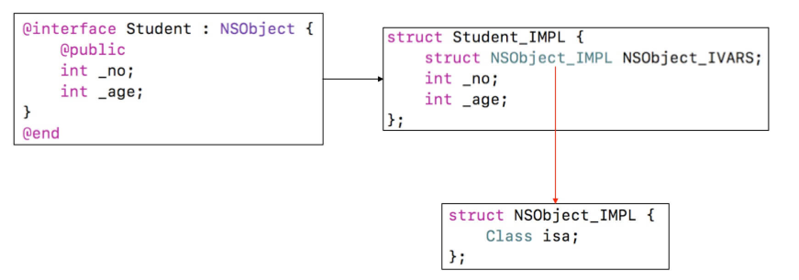
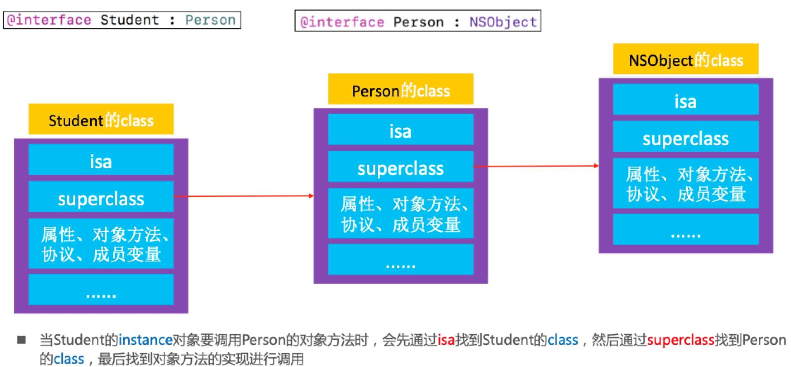
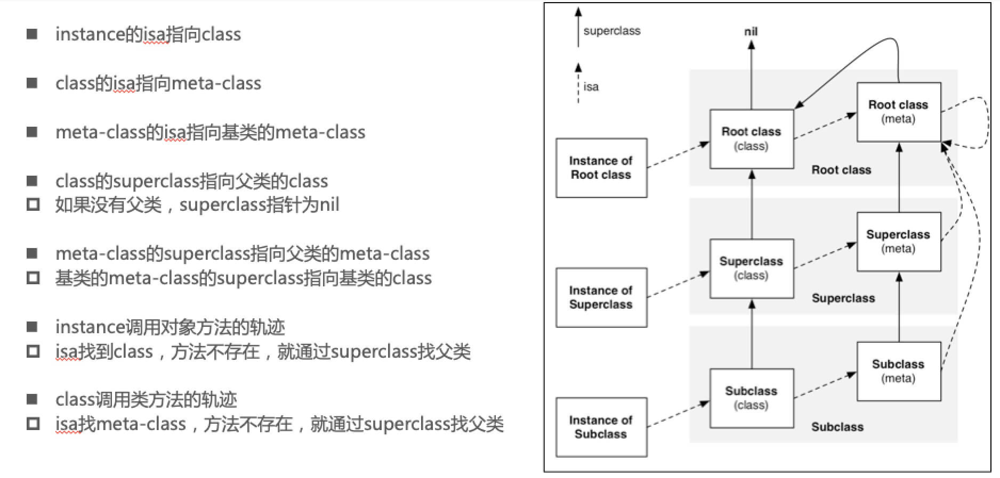
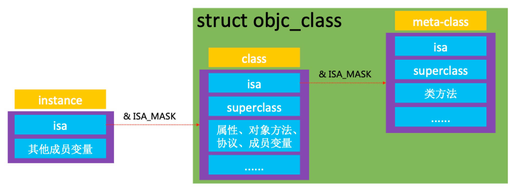

# 1、OC对象的本质

## 1.1 OC底层实现

我们平时编写的Objective-C代码，底层实现其实都是C\C++代码。Objective-C的对象、类主要是基于C\C++的结构体实现。


## 1.2 将Objective-C代码转换为C\C++代码

>xcrun  -sdk  iphoneos  clang  -arch  arm64  -rewrite-objc  OC源文件  -o  输出的CPP文件。	
>如果需要链接其他框架，使用-framework参数。比如-framework UIKit

## 1.3 NSObject的底层实现





## 1.4 实时查看内存数据

### 1.4.1 ViewMemory


### 1.4.2 LLDB指令

>print、p：打印
>po：打印对象
>
>读取内存
>memory read/数量格式字节数  内存地址
>x/数量格式字节数  内存地址
>x/3xw  0x10010
>
>格式
>x是16进制
>f是浮点
>d是10进制
>
>字节大小
>b：byte 1字节
>h：half word 2字节
>w：word 4字节
>g：giant word 8字节
>
>修改内存中的值
>memory  write  内存地址  数值
>memory  write  0x0000010  10

## 1.5 结构体内存分配

[结构体大小计算](http://www.cnblogs.com/xieyajie/p/8094788.html)

## 1.6 sizeof注意点

sizeof是编译器特性，在编译的时候直接进行常理替换，并不是函数。class_getInstanceSize需要在运行时确定大小。

## 面试题

* 1.1一个NSObject对象占用多少内存？

```
 NSObject *obj = [[NSObject alloc] init];
// 16个字节
    
// 获得NSObject实例对象的成员变量所占用的大小 =8
NSLog(@"%zd", class_getInstanceSize([NSObject class]));//8
    
// 系统分配了16个字节给NSObject对象
//CF requires all objects be at least 16 bytes
NSLog(@"%zd", malloc_size((__bridge const void *)obj));//16

苹果系统分配内存源码
https://opensource.apple.com/tarballs/libmalloc/
malloc.c/calloc  Buckets sized {16,32,64,80,96,112,...}
操作系统分配内存也有对齐，16的整数倍

创建一个实例对象，至少需要多少内存？//结构体内存对齐
#import <objc/runtime.h>
class_getInstanceSize([NSObject class]);

建一个实例对象，实际上分配了多少内存？//操作系统分配内存也会对齐，16的整数倍
#import <malloc/malloc.h>
malloc_size((__bridge const void *)obj);

sizeof()也能计算出大小

gnu（glibc/malloc/MALLOC_ALIGNMENT=16 c语言源码）是一个开源组织也提供了相关源码

```

# 2、OC对象的分类
## 2.1 Objective-C中的对象，简称OC对象，主要可以分为3种

* instance对象（实例对象）
* class对象（类对象）
* meta-class对象（元类对象） 

### 2.1.1 instance

### 2.1.2 class

### 2.1.3 meta-class


### 2.1.4 注意


### 2.1.5 查看Class是否为meta-class


## 2.2 object_getClass内部实现
https://opensource.apple.com/tarballs/	
objc4/objc-runtime.mm

```
/*
 1.Class objc_getClass(const char *aClassName)
 1> 传入字符串类名
 2> 返回对应的类对象
 
 2.Class object_getClass(id obj)
 1> 传入的obj可能是instance对象、class对象、meta-class对象
 2> 返回值
 a) 如果是instance对象，返回class对象
 b) 如果是class对象，返回meta-class对象
 c) 如果是meta-class对象，返回NSObject（基类）的meta-class对象
 
 3.- (Class)class、+ (Class)class
 1> 返回的就是类对象
 
 - (Class) {
     return self->isa;
 }
 
 + (Class) {
     return self;
 }
 */
```
## 2.3 isa指针


## 2.4 class对象的superclass指针

## 2.5 meta-class对象的superclass指

## 2.6 isa、superclass总结

## 2.7 class结构体
### 2.7.1 isa指针


```
struct mj_objc_class {
    Class isa;
    Class superclass;
};

        // MJPerson类对象的地址：0x00000001000014c8
        // isa & ISA_MASK：0x00000001000014c8
        
        // MJPerson实例对象的isa：0x001d8001000014c9
        
        struct mj_objc_class *personClass = (__bridge struct mj_objc_class *)([MJPerson class]);
        
        struct mj_objc_class *studentClass = (__bridge struct mj_objc_class *)([MJStudent class]);
        
        NSLog(@"1111");
        
//        MJPerson *person = [[MJPerson alloc] init];
//
        
//        Class personClass = [MJPerson class];
        
//        struct mj_objc_class *personClass2 = (__bridge struct mj_objc_class *)(personClass);
//
//        Class personMetaClass = object_getClass(personClass);
//
//        NSLog(@"%p %p %p", person, personClass, personMetaClass);
//        MJStudent *student = [[MJStudent alloc] init];

```
```
64bit之前isa = 对象地址，从64bit开始，isa需要进行一次位运算，才能计算出真实地址	
p/x (long)person->isa
输出
0x001d8001000014c9

p/x persionClass 
输出
0x00000001000014c8

p/x 0x001d8001000014c9 & 0x00007ffffffffff8（x86下ISA_MASK）
输出
0x00000001000014c8

```
### 2.7.2 objc4源码下载
* https://opensource.apple.com/tarballs/objc4/

* class、meta-class对象的本质结构都是struct objc_class

### 2.7.3 窥探struct objc_class的结构


## 面试题 

* 对象的isa指针指向哪里？

```
instance对象的isa指向class对象
class对象的isa指向meta-class对象
meta-class对象的isa指向基类的meta-class对象
```

* OC的类信息存放在哪里？
  
```
对象方法、属性、成员变量、协议信息，存放在class对象中
类方法，存放在meta-class对象中
成员变量的具体值，存放在instance对象

```


