# Public/Privatepodspec
**1、注册Trunk**

trunk需要CocoaPods 0.33版本以上，用pod --version

命令查看版本


CocoaPods版本

```
sudo gen install cocoapods pod setup
```

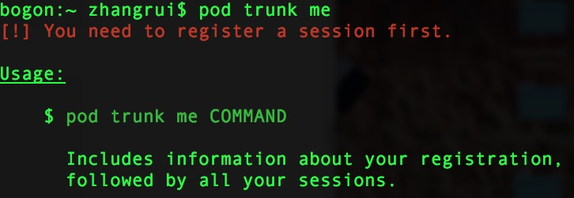
没有注册过

```
// 加上--verbose可以输出详细debug信息，方便出错时查看。 pod trunk register zhangyqyx@163.com "zhangyqyx" --verbose "zhangyqyx" 里面代表你的用户名，最好起一个好的名字 zhangyqyx@163.com 代表你的邮箱
```

注册完成之后会给你的邮箱发个邮件,进入邮箱邮件里面有个链接,需要点击确认一下

* 注册成功后可以再查看一下个人信息pod trunk me

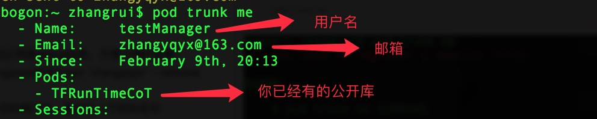
查看注册信息

修改注册信息。在终端上输入以下命名，会显示login和password。

```
grep -A2 ‘trunk.cocoapods.org’ ~/.netrc
```

然后调用下面的命令，这里的<MY CURRENT TOKEN>就是上一个命令获取的password，修改email、name和description为正确的信息，之后会收到cocoapods的确认邮件，点击链接确认后就修改成功了。
```
curl -v -H “Authorization: Token <MY CURRENT TOKEN>” -H “Content-Type: application/json” -X POST -d ‘{“email”:”<MY EMAIL>”,”name”:”<MY NEW NAME>”,”description”:”<My DESCRIPTION>”}’ https://trunk.cocoapods.org/api/v1/sessions 
```

查看信息是否修改。

```
pod trunk me
```

**2、创建一个项目**

1、github上创建一个项目

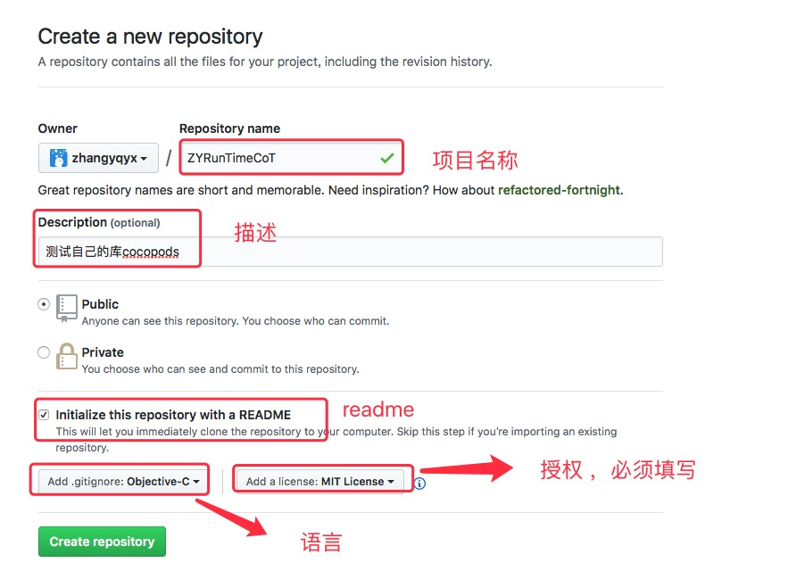
创建项目

2、将项目克隆下来,并添加公开库文件

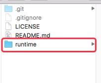
添加后的项目目录

**3、创建.podspec**

```
1、cd 到你的项目下 // 注 ZYRunTimeCoT 这个是你框架的名称 2、pod spec create ZYRunTimeCoT
```

**4、编辑.podspec文件**

```
Pod::Spec.new do |s| s.name = "ZYRunTimeCoT" s.version = "0.0.1" s.ios.deployment_target = '8.0' s.summary = "简介" s.homepage = "https://github.com/zhangyqyx/ZYRunTimeCoT" s.social_media_url = 'https://www.baidu.com' s.license = "MIT" # s.license = { :type => "MIT", :file => "FILE_LICENSE" } s.author = { "zyq" => "zhangyqyx@163.com" } s.source = { :git => 'https://github.com/zhangyqyx/ZYRunTimeCoT.git', :tag => s.version} s.requires_arc = true s.source_files = 'runtime/*' #s.public_header_files = 'runtime/TFRuntimeManager.h' end
```

接下来讲解一下每行代码的含义

> s.name：名称，pod search 搜索的关键词,注意这里一定要和.podspec的名称一样,否则报错  

> s.version：版本号  

> s.ios.deployment_target:支持的pod最低版本  

> s.summary: 简介  

> s.homepage:项目主页地址  

> s.social_media_url:社交网址,这里我写的微博默认是百度,如果你写的是你自己的博客的话,你的podspec发布成功后会@你  

> s.license:许可证  

> s.author:作者  

> s.source:项目的地址  

> s.requires_arc: 是否支持ARC  

> s.source_files:需要包含的源文件  

> s.public_header_files:公开的头文件  

> //其他  

> s.resources: 资源文件  

> s.dependency：依赖库，不能依赖未发布的库，可以写多个依赖库  

常见的写法：

1、dependency:写法

```
s.dependency = 'AFNetworking' , 'SDWebImage'
```

2、source_files: 写法

```
'runtime/*' 'runtime/runtime/*.{h,m}' 'runtime/**/*.h'
```

* '*'表示匹配所有文件

* '*.{h,m}' 表示匹配所有以.h和.m结尾的文件

* '**' 表示匹配所有子目录

3、source: 常见写法

```
s.source = { :git => "https://github.com/zhangyqyx/ZYRunTimeCoT.git", :commit => "68defea" } s.source = { :git => "https://github.com/zhangyqyx/ZYRunTimeCoT.git", :commit => "68defea", :tag => 1.0.0 } s.source = { :git => "https://github.com/zhangyqyx/ZYRunTimeCoT.git", :tag =>#{s.version}}
```

* commit => "68defea" 表示将这个Pod版本与Git仓库中某个commit绑定

* tag => 1.0.0 表示将这个Pod版本与Git仓库中某个版本的comit绑定

* tag => s.version 表示将这个Pod版本与Git仓库中相同版本的comit绑定

**5、如果前面没有选择创建这个LICENSE文件， 创建LICENSE(许可证/授权)文件,此文件必须要有**

创建一个文件名字命名为LICENSE,内容为:只需要把前面的版权改一下就行了,后面的都一样

> Copyright (c) 2013-2015 ZYRunTimeCoT (https://github.com/zhangyqyx/ZYRunTimeCoT)  

> Permission is hereby granted, free of charge, to any person obtaining a copy  

> of this software and associated documentation files (the "Software"), to deal  

> in the Software without restriction, including without limitation the rights  

> to use, copy, modify, merge, publish, distribute, sublicense, and/or sell  

> copies of the Software, and to permit persons to whom the Software is  

> furnished to do so, subject to the following conditions:  

> The above copyright notice and this permission notice shall be included in  

> all copies or substantial portions of the Software.  

> THE SOFTWARE IS PROVIDED "AS IS", WITHOUT WARRANTY OF ANY KIND, EXPRESS OR  

> IMPLIED, INCLUDING BUT NOT LIMITED TO THE WARRANTIES OF MERCHANTABILITY,  

> FITNESS FOR A PARTICULAR PURPOSE AND NONINFRINGEMENT. IN NO EVENT SHALL THE  

> AUTHORS OR COPYRIGHT HOLDERS BE LIABLE FOR ANY CLAIM, DAMAGES OR OTHER  

> LIABILITY, WHETHER IN AN ACTION OF CONTRACT, TORT OR OTHERWISE, ARISING FROM,  

> OUT OF OR IN CONNECTION WITH THE SOFTWARE OR THE USE OR OTHER DEALINGS IN  

> THE SOFTWARE.  

**6、上传到Git**

将包含配置好的 .podspec, LICENSE 的项目提交 Git

**7、打tag**

** 给项目打标签, 标签号要与`podspec` 文件里面的一致**

```
//为git打tag, 第一次需要在前面加一个v git tag "v0.0.1" // 如果出现错误，试一下不加v的情况 //git tag -a 1.0.0 -m '标签说明' //将tag推送到远程仓库
git push --tags
```

*如果我们的tag打错了，没有用的话，我们应该怎么删除呢？*

**1、查看tags**

git tag 就会罗列出我们所有的tags

**2、删除本地tags**

git tag -d + 分支名称就会删除本地的分支

**3、删除远程分支**

git push origin :refs/tags/分支名称 就删除了远程分支

如图

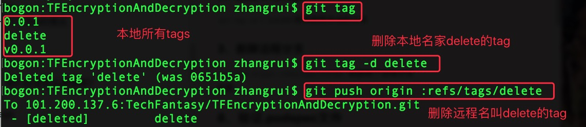
删除tag

**8、验证.podspec文件**

```
// --verbose 如果验证失败会报错误信息
pod spec lint ZYRunTimeCoT.podspec --verbose
```

如果出现这种警告性的问题

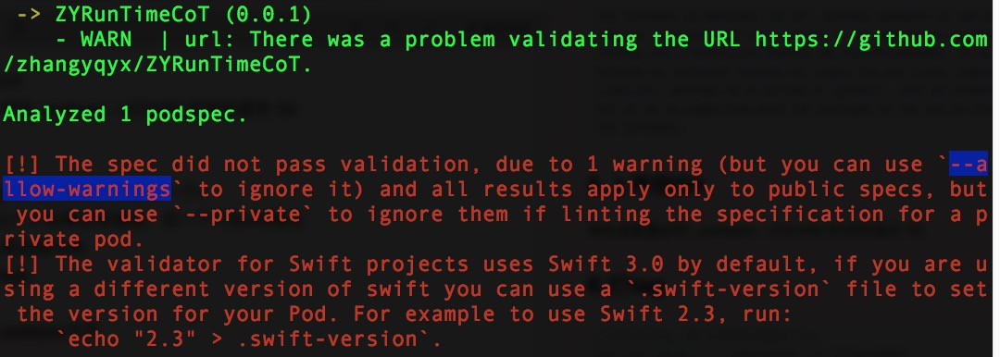
 项目可能同时依赖了本地的 `framework` 与 `.a` 这个时候要在校验 `spec` 文件的时候加参数  --allow-warnings

```
pod lib lint --allow-warnings
```

出现这种情况就说明我们通过了验证

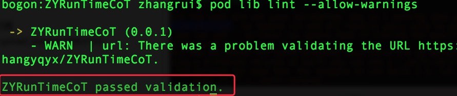
通过验证

如果出现这种情况，可能是你的那个版本找不到这个文件，

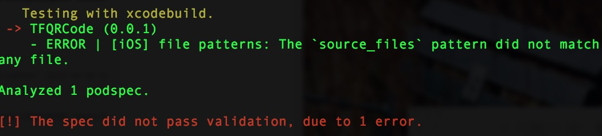
找不到文件

你可以尝试 s.source 添加一句 :commit => "68defea"  68defea是你的版本号，如图


添加版本号

**9 、发布**

发布时会验证 Pod 的有效性，如果你在手动验证 Pod 时使用了 --use-libraries 或 --allow-warnings 等修饰符，那么发布的时候也应该使用相同的字段修饰，否则出现相同的报错。

```
// --use-libraries --allow-warnings
pod trunk push ZYRunTimeCoT.podspec
```

出现这种情况就说明你发布成功了，等待人家审核就行了

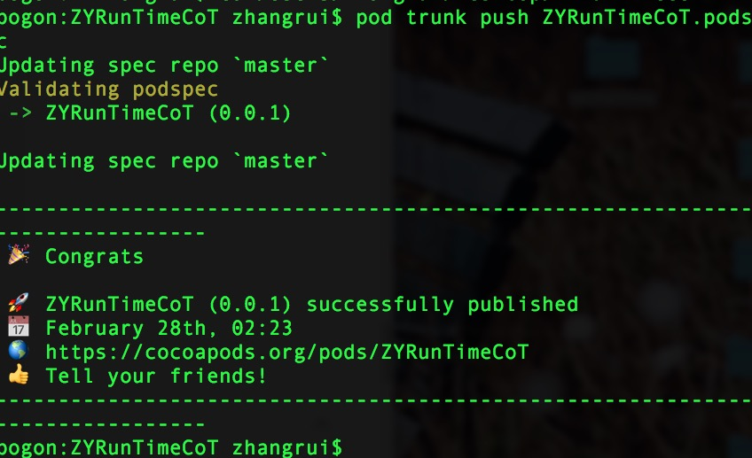
发布成功

**10、验证仓库**

你可能会出现这种情况错误

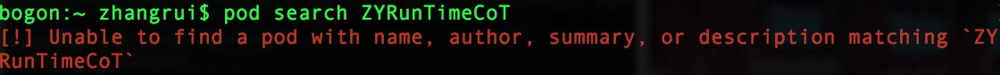
解决 ，删除文件路径，重新生成

```
rm ~/Library/Caches/CocoaPods/search_index.json pod setup
```

如果还是不行，估计是在你的项目还在审核中，你可以通过其他辅助手段去验证；

1、执行 pod trunk me 命令,看看有没有你的库

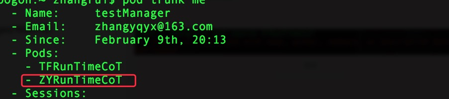
查看库信息

2、在 [CocoaPod管理所有第三方库](https://link.jianshu.com/?t=https://cocoapods.org/) (CocoaPod管理的库)中所搜一下（这个也有延时，如果搜索到就出现这样的结果,展示的是上一个集成库的搜索结果）

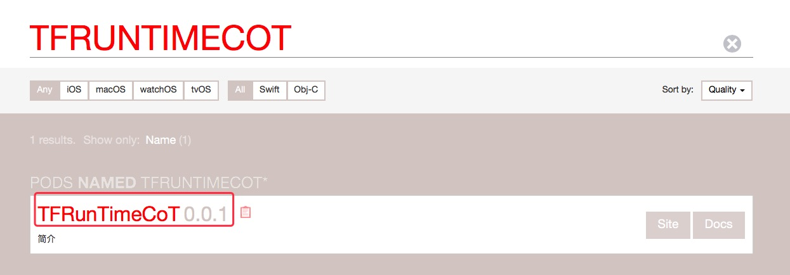
搜索结果

共有库的创建这里就结束了。

## 创建私有库 （私有库不需要**注册Trunk** ）

**1、创建一个私有的项目（可以是公司自己的git管理工具、也可以是码云上的），创建方法同公共库的第二步**

**2、创建.podspec**

方法同公共库创建的第三步

**3、编辑.podspec文件**

方法同公共库创建的第四步

**4、上传到Git**

方法同公共库创建的第六步

**5、打tag**

方法同公共库创建的第七步

**6、验证.podspec文件**

方法同公共库创建的第八步

**7、添加一个私有库并和项目地址做绑定 (MyRepo用来 存放所有私有库 各个版本的描述文件)**

```
pod repo add MyRepo https://github.com/zhangyqyx/ZYRunTimeCoT.git
```

```
//查看在 Finder 目录cd ~/.cocoapods/repos， 可以发现增加了一个 MyRepo 的储存库
```

**8、向私有的库里添加podspec文件(将我们的代码仓库的描述信息，push 到我们的版本仓库中)**

**先更新下我们的版本库** pod repo update MyRepo  （要不然会报错）

```
pod repo push MyRepo xxxx.podspec
```

**9、新建一个项目进行验证**

xcode新建项目 **在podfile中添加**

pod 'ZYRunTimeCoT', '~> 0.0.1'

```
//如果提示 'unable to find a specification for'//需要在podfile文件中添加源地址（私人pod库指明你的版本库地址） source 'https://git.oschina.net/baiyingqiu/MyRepo.git' //**注意**是版本库的地址，而不是代码库的地址， //若有还使用了公有的pod库，需要把公有库地址也带上 source 'https://github.com/CocoaPods/Specs.git
```

最后的Podflie文件变成这个样子

```
source ‘https://github.com/CocoaPods/Specs.git’ source ‘https://git.oschina.net/baiyingqiu/MyRepo.git’ platform :ios, '8.0' target ‘MyPodTest’ do use_frameworks! pod “AFNetWorking” #公有库 pod ‘ZYRunTimeCoT’ #我们的私有库
end
```

执行 pod install 命令时:

* 会拉取远程  `Podflie`  中 `source` 标记 版本库 到本地的 `repos`  文件夹中
* 在 版本库 中搜索我们 ``pod ‘ZYRunTimeCoT`` **`’` 的 ZYRunTimeCoT** **`.podspec` 文件。**
* 根据 ZYRunTimeCoT `.podspec`  文件中描述的源码地址下载并整合到项目中

## reference

[Cocoapods 创建自己的公开库、私有库 - 俊华的博客 - 博客园](https://www.cnblogs.com/junhuawang/p/9087836.html)