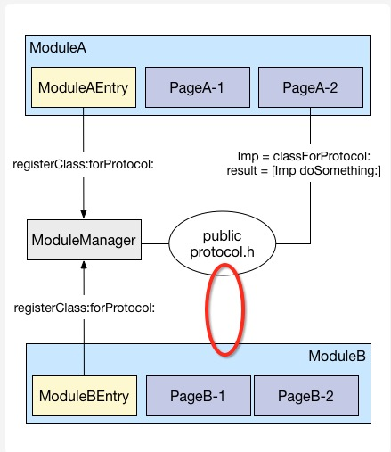

# iOS应用架构谈 组件化方案
 
[iOS应用架构谈 开篇](https://casatwy.com/iosying-yong-jia-gou-tan-kai-pian.html)    
[iOS应用架构谈 view层的组织和调用方案](https://casatwy.com/iosying-yong-jia-gou-tan-viewceng-de-zu-zhi-he-diao-yong-fang-an.html)     
[iOS应用架构谈 网络层设计方案](https://casatwy.com/iosying-yong-jia-gou-tan-wang-luo-ceng-she-ji-fang-an.html)     
[iOS应用架构谈 本地持久化方案及动态部署](https://casatwy.com/iosying-yong-jia-gou-tan-ben-di-chi-jiu-hua-fang-an-ji-dong-tai-bu-shu.html)      
[iOS应用架构谈 组件化方案](https://casatwy.com/iOS-Modulization.html)    

## 简述

前几天的一个晚上在infoQ的微信群里，来自蘑菇街的Limboy做了一个分享，讲了蘑菇街的组件化之路。我不认为这条组件化之路蘑菇街走对了。分享后我私聊了Limboy，Limboy似乎也明白了问题所在，我答应他我会把我的方案写成文章，于是这篇文章就出来了。

另外，按道理说组件化方案也属于iOS应用架构谈的一部分，但是当初构思架构谈时，我没打算写组件化方案，因为我忘了还有这回事儿。。。后来写到view的时候才想起来，所以在view的那篇文章最后补了一点内容。而且觉得这个组件化方案太简单，包括实现组件化方案的组件也很简单，代码算上注释也才100行，我就偷懒放过了，毕竟写一篇文章好累的啊。

> 本文的组件化方案demo在这里   [https://github.com/casatwy/CTMediator 拉下来后记得pod install 拉下来后记得pod install 拉下来后记得pod install](https://github.com/casatwy/CTMediator) ，这个Demo对业务敏感的边界情况处理比较简单，这需要根据不同App的特性和不同产品的需求才能做，所以只是为了说明组件化架构用的。如果要应用在实际场景中的话，可以根据代码里给出的注释稍加修改，就能用了。  

蘑菇街的原文地址在这里： [《蘑菇街 App 的组件化之路》](http://limboy.me/ios/2016/03/10/mgj-components.html) ，没有耐心看完原文的朋友，我在这里简要介绍一下蘑菇街的组件化是怎么做的：

1. App启动时实例化各组件模块，然后这些组件向ModuleManager注册Url，有些时候不需要实例化，使用class注册。
2. 当组件A需要调用组件B时，向ModuleManager传递URL，参数跟随URL以GET方式传递，类似openURL。然后由ModuleManager负责调度组件B，最后完成任务。

> 这里的两步中，每一步都存在问题。  

第一步的问题在于，在组件化的过程中，注册URL并不是充分必要条件，组件是不需要向组件管理器注册Url的。而且注册了Url之后，会造成不必要的内存常驻，如果只是注册Class，内存常驻量就小一点，如果是注册实例，内存常驻量就大了。至于蘑菇街注册的是Class还是实例，Limboy分享时没有说，文章里我也没看出来，也有可能是我看漏了。不过这还并不能算是致命错误，只能算是小缺陷。

真正的致命错误在第二步。在iOS领域里，一定是组件化的中间件为openUrl提供服务，而不是openUrl方式为组件化提供服务。

什么意思呢？

也就是说，一个App的组件化方案一定不是建立在URL上的，openURL的跨App调用是可以建立在组件化方案上的。当然，如果App还没有组件化，openURL方式也是可以建立的，就是丑陋一点而已。

> 为什么这么说？  

因为组件化方案的实施过程中，需要处理的问题的复杂度，以及拆解、调度业务的过程的复杂度比较大，单纯以openURL的方式是无法胜任让一个App去实施组件化架构的。如果在给App实施组件化方案的过程中是基于openURL的方案的话，有一个致命缺陷：非常规对象无法参与本地组件间调度。关于 `非常规对象` 我会在详细讲解组件化方案时有一个辨析。

实际App场景下，如果本地组件间采用GET方式的URL调用，就会产生两个问题：

比如你要调用一个图片编辑模块，不能传递UIImage到对应的模块上去的话，这是一个很悲催的事情。 当然，这可以通过给方法新开一个参数，然后传递过去来解决。比如原来是:

```
[a openUrl:"http://casa.com/detail?id=123&type=0"];
```

同时就也要提供这样的方法：

```
[a openUrl:"http://casa.com/detail" params:@{ 
  @"id":"123", 
  @"type":"0", 
  @"image":[UIImage imageNamed:@"test"]
}];
```

如果不像上面这么做，复杂参数和非常规参数就无法传递。如果这么做了，那么事实上这就是拆分远程调用和本地调用的入口了，这就变成了我文章中提倡的做法，也是蘑菇街方案没有做到的地方。

另外，在本地调用中使用URL的方式其实是不必要的，如果业务工程师在本地间调度时需要给出URL，那么就不可避免要提供params，在调用时要提供哪些params是业务工程师很容易懵逼的地方。。。在文章下半部分给出的demo代码样例已经说明了业务工程师在本地间调用时，是不需要知道URL的，而且demo代码样例也阐释了如何解决业务工程师遇到传params容易懵逼的问题。

* `URL注册对于实施组件化方案是完全不必要的，且通过URL注册的方式形成的组件化方案，拓展性和可维护性都会被打折`

注册URL的目的其实是一个服务发现的过程，在iOS领域中，服务发现的方式是不需要通过主动注册的，使用runtime就可以了。另外，注册部分的代码的维护是一个相对麻烦的事情，每一次支持新调用时，都要去维护一次注册列表。如果有调用被弃用了，是经常会忘记删项目的。runtime由于不存在注册过程，那就也不会产生维护的操作，维护成本就降低了。

由于通过runtime做到了服务的自动发现，拓展调用接口的任务就仅在于各自的模块，任何一次新接口添加，新业务添加，都不必去主工程做操作，十分透明。

## 小总结

蘑菇街采用了openURL的方式来进行App的组件化是一个错误的做法，使用注册的方式发现服务是一个不必要的做法。而且这方案还有其它问题，随着下文对组件化方案介绍的展开，相信各位自然心里有数。

## 正确的组件化方案

先来看一下方案的架构图

```
             --------------------------------------
             | [CTMediator sharedInstance]        |
             |                                    |
             |                openUrl:       <<<<<<<<<  (AppDelegate)  <<<<  Call From Other App With URL
             |                                    |
             |                   |                |
             |                   |                |
             |                   |/               |
             |                                    |
             |                parseUrl            |
             |                                    |
             |                   |                |
             |                   |                |
.................................|...............................
             |                   |                |
             |                   |                |
             |                   |/               |
             |                                    |
             |  performTarget:action:params: <<<<<<<<<<<<<<<<<<<<<<<<<<<<<<  Call From Native Module
             |                                    |
             |                   |                |
             |                   |                |
             |                   |                |
             |                   |/               |
             |                                    |
             |             -------------          |
             |             |           |          |
             |             |  runtime  |          |
             |             |           |          |
             |             -------------          |
             |               .       .            |
             ---------------.---------.------------
                           .           .
                          .             .
                         .               .
                        .                 .
                       .                   .
                      .                     .
                     .                       .
                    .                         .
-------------------.-----------      ----------.---------------------
|                 .           |      |          .                   |
|                .            |      |           .                  |
|               .             |      |            .                 |
|              .              |      |             .                |
|                             |      |                              |
|           Target            |      |           Target             |
|                             |      |                              |
|         /   |   \           |      |         /   |   \            |
|        /    |    \          |      |        /    |    \           |
|                             |      |                              |
|   Action Action Action ...  |      |   Action Action Action ...   |
|                             |      |                              |
|                             |      |                              |
|                             |      |                              |
|Business A                   |      | Business B                   |
-------------------------------      --------------------------------
```

这幅图是组件化方案的一个简化版架构描述，主要是基于Mediator模式和Target-Action模式，中间采用了runtime来完成调用。这套组件化方案将远程应用调用和本地应用调用做了拆分，而且是由本地应用调用为远程应用调用提供服务，与蘑菇街方案正好相反。

> 调用方式  

先说本地应用调用，本地组件A在某处调用 `[[CTMediator sharedInstance] performTarget:targetName action:actionName params:@{...}]` 向 `CTMediator` 发起跨组件调用， `CTMediator` 根据获得的target和action信息，通过objective-C的runtime转化生成target实例以及对应的action选择子，然后最终调用到目标业务提供的逻辑，完成需求。

在远程应用调用中，远程应用通过openURL的方式，由iOS系统根据info.plist里的scheme配置找到可以响应URL的应用（在当前我们讨论的上下文中，这就是你自己的应用），应用通过 `AppDelegate` 接收到URL之后，调用 `CTMediator` 的 `openUrl:` 方法将接收到的URL信息传入。当然， `CTMediator` 也可以用 `openUrl:options:` 的方式顺便把随之而来的option也接收，这取决于你本地业务执行逻辑时的充要条件是否包含option数据。传入URL之后， `CTMediator` 通过解析URL，将请求路由到对应的target和action，随后的过程就变成了上面说过的本地应用调用的过程了，最终完成响应。

针对请求的路由操作很少会采用本地文件记录路由表的方式，服务端经常处理这种业务，在服务端领域基本上都是通过正则表达式来做路由解析。App中做路由解析可以做得简单点，制定URL规范就也能完成，最简单的方式就是 `scheme://target/action` 这种，简单做个字符串处理就能把target和action信息从URL中提取出来了。

> 组件仅通过Action暴露可调用接口  

所有组件都通过组件自带的Target-Action来响应，也就是说，模块与模块之间的接口被固化在了Target-Action这一层，避免了实施组件化的改造过程中，对Business的侵入，同时也提高了组件化接口的可维护性。

```

            --------------------------------
            |                              |
            |           Business A         |
            |                              |
            ---  ----------  ----------  ---
              |  |        |  |        |  |
              |  |        |  |        |  |
   ...........|  |........|  |........|  |...........
   .          |  |        |  |        |  |          .
   .          |  |        |  |        |  |          .
   .        ---  ---    ---  ---    ---  ---        .
   .        |      |    |      |    |      |        .
   .        |action|    |action|    |action|        .
   .        |      |    |      |    |      |        .
   .        ---|----    -----|--    --|-----        .
   .           |             |        |             .
   .           |             |        |             .
   .       ----|------     --|--------|--           .
   .       |         |     |            |           .
   .       |Target_A1|     |  Target_A2 |           .
   .       |         |     |            |           .
   .       -----------     --------------           .
   .                                                .
   .                                                .
   ..................................................

```

大家可以看到，虚线圈起来的地方就是用于跨组件调用的target和action，这种方式避免了由BusinessA直接提供组件间调用会增加的复杂度，而且任何组件如果想要对外提供调用服务，直接挂上target和action就可以了，业务本身在大多数场景下去进行组件化改造时，是基本不用动的。

> 复杂参数和非常规参数，以及组件化相关设计思路  

这里我们需要针对术语做一个理解上的统一：

`复杂参数` 是指由 `普通类型` 的数据组成的多层级参数。在本文中，我们定义只要是能够被json解析的类型就都是 `普通类型` ，包括NSNumber， NSString， NSArray， NSDictionary，以及相关衍生类型，比如来自系统的NSMutableArray或者你自己定义的都算。

总结一下就是：在本文讨论的场景中，复杂参数的定义是由普通类型组成的具有复杂结构的参数。普通类型的定义就是指能够被json解析的类型。

`非常规参数` 是指由 `普通类型` 以外的类型组成的参数，例如UIImage等这些不能够被json解析的类型。然后这些类型组成的参数在文中就被定义为 `非常规参数` 。

总结一下就是： `非常规参数` 是包含非常规类型的参数。 `非常规类型` 的定义就是不能被json解析的类型都叫非常规类型。

边界情况：

* 假设多层级参数中有存在任何一个内容是非常规参数，本文中这种参数就也被认为是非常规参数。

* 如果某个类型当前不能够被json解析，但通过某种转化方式能够转化成json，那么这种类型在场景上下文中，我们也称为普通类型。

举个例子就是通过json描述的自定义view。如果这个view能够通过某个组件被转化成json，那么即使这个view本身并不是普通类型，在具有转化器的上下文场景中，我们依旧认为它是普通类型。

* 如果上下文场景中没有转化器，这个view就是非常规类型了。

* 假设转化出的json不能够被还原成view，比如组件A有转化器，组件B中没有转化器，因此在组件间调用过程中json在B组件里不能被还原成view。在这种调用方向中，只要调用者能将非常规类型转化成json的，我们就依然认为这个view是普通类型。如果调用者是组件A，转化器在组件B中，A传递view参数时是没办法转化成json的，那么这个view就被认为是非常规类型，哪怕它在组件B中能够被转化成json。

> 然后我来解释一下为什么应该由本地组件间调用来支持远程应用调用：  

在远程App调用时，远程App是不可能通过URL来提供非常规参数的，最多只能以json string的方式经过URLEncode之后再通过GET来提供复杂参数，然后再在本地组件中解析json，最终完成调用。在组件间调用时，通过 `performTarget:action:params:` 是能够提供非常规参数的，于是我们可以知道， `远程App调用` 时的上下文环境以及功能 `是本地组件间调用` 时上下文环境以及功能 `的子集` 。

因此这个逻辑注定了必须由本地组件间调用来为远程App调用来提供服务，只有符合这个逻辑的设计思路才是正确的组件化方案的设计思路，其他跟这个不一致的思路一定就是错的。因为逻辑上子集为父集提供服务说不通，所以强行这么做的话，用一个成语来总结就叫做倒行逆施。

另外，远程App调用和本地组件间调用必须要拆分开，远程App调用只能走 `CTMediator` 提供的专用远程的方法，本地组件间调用只能走 `CTMediator` 提供的专用本地的方法，两者不能通过同一个接口来调用。

这里有两个原因：

* 远程App调用处理入参的过程比本地多了一个URL解析的过程，这是远程App调用特有的过程。这一点我前面说过，这里我就不细说了。

* 架构师没有充要条件条件可以认为远程App调用对于无响应请求的处理方式和本地组件间调用无响应请求的处理方式在未来产品的演进过程中是一致的

在远程App调用中，用户通过url进入app，当app无法为这个url提供服务时，常见的办法是展示一个所谓的404界面，告诉用户"当前没有相对应的内容，不过你可以在app里别的地方再逛逛"。这个场景多见于用户使用的App版本不一致。比如有一个URL只有1.1版本的app能完整响应，1.0版本的app虽然能被唤起，但是无法完成整个响应过程，那么1.0的app就要展示一个404了。

在组件间调用中，如果遇到了无法响应的请求，就要分两种场景考虑了。

> 场景1  

如果这种无法响应的请求发生场景是在开发过程中，比如两个组件同时在开发，组件A调用组件B时，组件B还处于旧版本没有发布新版本，因此响应不了，那么这时候的处理方式可以相对随意，只要能体现B模块是旧版本就行了，最后在RC阶段统测时是一定能够发现的，只要App没发版，怎么处理都来得及。

> 场景2  

如果这种无法响应的请求发生场景是在已发布的App中，有可能展示个404就结束了，那这就跟远程App调用时的404处理场景一样。但也有可能需要为此做一些额外的事情，有可能因为做了额外的事情，就不展示404了，展示别的页面了，这一切取决于产品经理。

`那么这种场景是如何发生的呢？`

我举一个例子：当用户在1.0版本时收藏了一个东西，然后用户升级App到1.1版本。1.0版本的收藏项目在本地持久层存入的数据有可能是会跟1.1版本收藏时存入的数据是不一致的。此时用户在1.1版本的app中对1.0版本收藏的东西做了一些操作，触发了本地组件间调用，这个本地间调用又与收藏项目本身的数据相关，那么这时这个调用就是有可能变成无响应调用，此时的处理方式就不见得跟以前一样展示个404页面就结束了，因为用户已经看到了收藏了的东西，结果你还告诉他找不到，用户立刻懵逼。。。这时候的处理方式就会用很多种，至于产品经理会选择哪种，你作为架构师是没有办法预测的。如果产品经理提的需求落实到架构上，对调用入口产生要求然而你的架构又没有拆分调用入口，对于你的选择就只有两个：要么打回产品需求，要么加个班去拆分调用入口。

当然，架构师可以选择打回产品经理的需求，最终挑选一个自己的架构能够承载的需求。但是，如果这种是因为你早期设计架构时挖的坑而打回的产品需求，你不觉得丢脸么？

> 鉴于远程app调用和本地组件间调用下的无响应请求处理方式不同，以及未来不可知的产品演进，拆分远程app调用入口和本地组件间调用入口是功在当代利在千秋的事情。  

> 组件化方案中的去model设计  

组件间调用时，是需要针对参数做去model化的。如果组件间调用不对参数做去model化的设计，就会导致 `业务形式上被组件化了，实质上依然没有被独立` 。

假设模块A和模块B之间采用model化的方案去调用，那么调用方法时传递的参数就会是一个对象。

如果对象不是一个面向接口的通用对象，那么mediator的参数处理就会非常复杂，因为要区分不同的对象类型。如果mediator不处理参数，直接将对象以范型的方式转交给模块B，那么模块B必然要包含对象类型的声明。假设对象声明放在模块A，那么B和A之间的组件化只是个形式主义。如果对象类型声明放在mediator，那么对于B而言，就不得不依赖mediator。但是，大家可以从上面的架构图中看到，对于响应请求的模块而言，依赖mediator并不是必要条件，因此这种依赖是完全不需要的，这种依赖的存在对于架构整体而言，是一种污染。

如果参数是一个面向接口的对象，那么mediator对于这种参数的处理其实就没必要了，更多的是直接转给响应方的模块。而且接口的定义就不可能放在发起方的模块中了，只能放在mediator中。响应方如果要完成响应，就也必须要依赖mediator，然而前面我已经说过，响应方对于mediator的依赖是不必要的，因此参数其实也并不适合以面向接口的对象的方式去传递。

`因此，使用对象化的参数无论是否面向接口，带来的结果就是业务模块形式上是被组件化了，但实质上依然没有被独立。`

在这种跨模块场景中，参数最好还是以去model化的方式去传递，在iOS的开发中，就是以字典的方式去传递。这样就能够做到只有调用方依赖mediator，而响应方不需要依赖mediator。然而在去model化的实践中，由于这种方式自由度太大，我们至少需要保证调用方生成的参数能够被响应方理解，然而在组件化场景中，限制去model化方案的自由度的手段，相比于网络层和持久层更加容易得多。

因为组件化天然具备了限制手段：参数不对就无法调用！无法调用时直接debug就能很快找到原因。所以接下来要解决的去model化方案的另一个问题就是：如何提高开发效率。

在去model的组件化方案中，影响效率的点有两个：调用方如何知道接收方需要哪些key的参数？调用方如何知道有哪些target可以被调用？其实后面的那个问题不管是不是去model的方案，都会遇到。为什么放在一起说，因为我接下来要说的解决方案可以把这两个问题一起解决。

> 解决方案就是使用category  

mediator这个repo维护了若干个针对mediator的category，每一个对应一个target，每个category里的方法对应了这个target下所有可能的调用场景，这样调用者在包含mediator的时候，自动获得了所有可用的target-action，无论是调用还是参数传递，都非常方便。接下来我要解释一下为什么是category而不是其他：

* category本身就是一种组合模式，根据不同的分类提供不同的方法，此时每一个组件就是一个分类，因此把每个组件可以支持的调用用category封装是很合理的。

* 在category的方法中可以做到参数的验证，在架构中对于保证参数安全是很有必要的。当参数不对时，category就提供了补救的入口。

* category可以很轻松地做请求转发，如果不采用category，请求转发逻辑就非常难做了。

* category统一了所有的组件间调用入口，因此无论是在调试还是源码阅读上，都为工程师提供了极大的方便。

* 由于category统一了所有的调用入口，使得在跨模块调用时，对于param的hardcode在整个App中的作用域仅存在于category中，在这种场景下的hardcode就已经变成和调用宏或者调用声明没有任何区别了，因此是可以接受的。

这里是业务方使用category调用时的场景，大家可以看到非常方便，不用去记URL也不用纠结到底应该传哪些参数。

```
if (indexPath.row == 0) { 
  UIViewController *viewController = [[CTMediator sharedInstance] CTMediator_viewControllerForDetail]; 
  // 获得view controller之后，在这种场景下，到底push还是present，其实是要由使用者决定的，mediator只要给出view controller的实例就好了
  [self presentViewController:viewController animated:YES completion:nil]; 
} 

if (indexPath.row == 1) { 
  UIViewController *viewController = [[CTMediator sharedInstance] CTMediator_viewControllerForDetail]; 
  [self.navigationController pushViewController:viewController animated:YES]; 
} 

if (indexPath.row == 2) { 
  // 这种场景下，很明显是需要被present的，所以不必返回实例，mediator直接present了 
  [[CTMediator sharedInstance] CTMediator_presentImage:[UIImage imageNamed:@"image"]]; 
} 

if (indexPath.row == 3) { 
  // 这种场景下，参数有问题，因此需要在流程中做好处理 
  [[CTMediator sharedInstance] CTMediator_presentImage:nil]; 
} 

if (indexPath.row == 4) { 
  [[CTMediator sharedInstance] CTMediator_showAlertWithMessage:@"casa" cancelAction:nil confirmAction:^(NSDictionary *info) { 
    // 做你想做的事 
    NSLog(@"%@", info); 
  }]; 
}
```

本文对应的 [demo](https://github.com/casatwy/CTMediator) 展示了如何使用category来实现去model的组件调用。上面的代码片段也是摘自这个demo。

## 基于其他考虑还要再做的一些额外措施

> 基于安全考虑  

我们需要防止黑客通过URL的方式调用本属于native的组件，比如支付宝的个人财产页面。如果在调用层级上没有区分好，没有做好安全措施，黑客就有通过safari查看任何人的个人财产的可能。

安全措施其实有很多，大部分取决于App本身以及产品的要求。在架构层面要做的最基础的一点就是区分调用是来自于远程App还是本地组件，我在demo中的安全措施是采用给action添加 `native` 前缀去做的，凡是带有native前缀的就都只允许本地组件调用，如果在url阶段发现调用了前缀为native的方法，那就可以采取响应措施了。这也是将远程app调用入口和本地组件调用入口区分开来的重要原因之一。

当然，为了确保安全的做法有很多，但只要拆出远程调用和本地调用，各种做法就都有施展的空间了。

> 基于动态调度考虑  

动态调度的意思就是，今天我可能这个跳转是要展示A页面，但是明天可能同样的跳转就要去展示B页面了。这个跳转有可能是来自于本地组件间跳转也有可能是来自于远程app。

做这个事情的切点在本文架构中，有很多个：

1. 以url parse为切点
2. 以实例化target时为切点
3. 以category调度方法为切点
4. 以target下的action为切点

如果 `以url parse为切点` 的话，那么这个动态调度就只能够对远程App跳转产生影响，失去了动态调度本地跳转的能力，因此是不适合的。

如果 `以实例化target时为切点` 的话，就需要在代码中针对所有target都做一次审查，看是否要被调度，这是没必要的。假设10个调用请求中，只有1个要被动态调度，那么就必须要审查10次，只有那1次审查通过了，才走动态调度，这是一种相对比较粗暴的方法。

如果 `以category调度方法为切点` 的话，那动态调度就只能影响到本地件组件的跳转，因为category是只有本地才用的，所以也不适合。

`以target下的action为切点` 是最适合的，因为动态调度在一般场景下都是有范围的，大多数是活动页需要动态调度，今天这个活动明天那个活动，或者今天活动正在进行明天活动就结束了，所以产生动态调度的需求。我们在可能产生动态调度的action中审查当前action是否需要被动态调度，在常规调度中就没必要审查了，例如个人主页的跳转，商品详情的跳转等，这样效率就能比较高。

大家会发现，如果要做类似这种效率更高的动态调度，target-action层被抽象出来就是必不可少的，然而蘑菇街并没有抽象出target-action层，这也是其中的一个问题。

当然，如果你的产品要求所有页面都是存在动态调度需求的，那就还是以 `实例化target时为切点` 去调度了，这样能做到审查每一次调度请求，从而实现动态调度。

说完了调度切点，接下来要说的就是如何完成审查流程。完整的审查流程有几种，我每个都列举一下：

1. App启动时下载调度列表，或者定期下载调度列表。然后审查时检查当前action是否存在要被动态调度跳转的action，如果存在，则跳转到另一个action
2. 每一次到达新的action时，以action为参数调用API获知是否需要被跳转，如果需要被跳转，则API告知要跳转的action，然后再跳转到API指定的action

这两种做法其实都可以，如果产品对即时性的要求比较高，那么采用第二种方案，如果产品对即时性要求不那么高，第一种方案就可以了。由于本文的方案是没有URL注册列表的，因此服务器只要给出原始target-action和对应跳转的target-action就可以了，整个流程不是只有注册URL列表才能达成的，而且这种方案比注册URL列表要更易于维护一些。

另外，说采用url rewrite的手段来进行动态调度，也不是不可以。但是这里我需要辨析的是，URL的必要性仅仅体现在远程App调度中，是没必要蔓延到本地组件间调用的。这样，当我们做远程App的URL路由时（目前的demo没有提供URL路由功能，但是提供了URL路由操作的接入点，可以根据业务需求插入这个功能），要关心的事情就能少很多，可以比较干净。在这种场景下，单纯以URL rewrite的方式其实就与上文提到的 `以url parse为切点` 没有区别了。

## 相比之下，蘑菇街的组件化方案有以下缺陷

* 蘑菇街没有拆分远程调用和本地间调用

不拆分远程调用和本地间调用，就使得后续很多手段难以实施，这个我在前文中都已经有论述了。另外再补充一下，这里的拆分不是针对来源做拆分。比如通过URL来区分是远程App调用还是本地调用，这只是区分了调用者的来源。

这里说的区分是指：远程调用走远程调用路径，也就是 `openUrl` -> `urlParse` -> `perform` -> `target-action` 。本地组件间调用就走本地组件间调用路径： `perform` -> `target-action` 。这两个是一定要作区分的，蘑菇街方案并没有对此做好区分。

* 蘑菇街以远程调用的方式为本地间调用提供服务

这是本末倒置的做法，倒行逆施导致的是未来架构难以为业务发展提供支撑。因为前面已经论述过，在iOS场景下，远程调用的实现是本地调用实现的子集，只有大的为小提供服务，也就是本地调用为远程调用提供服务，如果反过来就是倒行逆施了。

* 蘑菇街的本地间调用无法传递非常规参数，复杂参数的传递方式非常丑陋

注意这里 `复杂参数` 和 `非常规参数` 的辨析。

由于采用远程调用的方式执行本地调用，在前面已经论述过两者功能集的关系，因此这种做法无法满足传递非常规参数的需求。而且如果基于这种方式不变的话，复杂参数的传递也只能依靠经过urlencode的json string进行，这种方式非常丑陋，而且也不便于调试。

*  蘑菇街必须要在app启动时注册URL响应者

这个条件在组件化方案中是不必要条件，demo也已经证实了这一点。这个不必要的操作会导致不必要的维护成本，如果单纯从 `只要完成业务就好` 的角度出发，这倒不是什么大问题。这就看架构师对自己是不是要求严格了。

* 新增组件化的调用路径时，蘑菇街的操作相对复杂

在本文给出的组件化方案中，响应者唯一要做的事情就是提供Target和Action，并不需要再做其它的事情。蘑菇街除此之外还要再做很多额外不必要措施，才能保证调用成功。

* 蘑菇街没有针对target层做封装

这种做法使得所有的跨组件调用请求直接hit到业务模块，业务模块必然因此变得臃肿难以维护，属于侵入式架构。应该将原本属于调用相应的部分拿出来放在target-action中，才能尽可能保证不将无关代码侵入到原有业务组件中，才能保证业务组件未来的迁移和修改不受组件调用的影响，以及降低为项目的组件化实施而带来的时间成本。

## 总结

本文提供的组件化方案是采用Mediator模式和苹果体系下的Target-Action模式设计的。

然而这款方案有一个很小的缺陷在于对param的key的hardcode，这是为了达到最大限度的解耦和灵活度而做的权衡。在我的网络层架构和持久层架构中，都没有hardcode的场景，这也从另一个侧面说明了组件化架构的特殊性。

权衡时，考虑到这部分hardcode的影响域 `仅仅存在于mediator的category中` 。在这种情况下，hardcode对于调用者的调用是完全透明的。对于响应者而言，处理方式等价于对API返回的参数的处理方式，且响应者的处理方式也被 `限制在了Action中` 。

因此这部分的hardcode的存在虽然确实有点不干净，但是相比于这些不干净而带来的其他好处而言，在权衡时是可以接受的，如果不采用hardcode，那势必就会导致请求响应方 `也需要依赖mediator` ，然而这在逻辑上是 `不必要` 的。另外，在我的各个项目的实际使用过程中，这部分hardcode是没有影响的。

另外要谈的是，之所以会在组件化方案中出现harcode，而网络层和持久层的去model化都没有发生hardcode情况，是因为组件化调用的所有接受者和调用者都在同一片上下文里。网络层有一方在服务端，持久层有一方在数据库。再加上设计时针对hardcode部分的改进手段其实已经超出了语言本身的限制。也就是说，harcode受限于语言本身。objective-C也好，swift也好，它们的接口设计哲学是存在缺陷的。如果我们假设在golang的背景下，是完全可以用golang的接口体系去做一个最优美的架构方案出来的。不过这已经不属于本文的讨论范围了，有兴趣的同学可以去了解一下相关知识。架构设计有时就是这么无奈。

组件化方案在App业务稳定，且规模（业务规模和开发团队规模）增长初期去实施非常重要，它助于将复杂App分而治之，也有助于多人大型团队的协同开发。但 `组件化方案` 不适合在业务不稳定的情况下过早实施，至少要等产品已经经过MVP阶段时才适合实施组件化。因为业务不稳定意味着链路不稳定，在不稳定的链路上实施组件化会导致将来主业务产生变化时，全局性模块调度和重构会变得相对复杂。

当决定要实施组件化方案时，对于组件化方案的架构设计优劣直接影响到架构体系能否长远地支持未来业务的发展，对App的组件化 `不只是仅仅的拆代码和跨业务调页面` ，还要考虑复杂和非常规业务参数参与的调度，非页面的跨组件功能调度，组件调度安全保障，组件间解耦，新旧业务的调用接口修改等问题。

蘑菇街的组件化方案只实现了跨业务页面调用的需求，本质上只实现了我在view层架构的文章中跨业务页面调用的内容，这还没有到成为 `组件化方案` 的程度，且蘑菇街的组件化方案距离真正的App组件化的要求还是差了一段距离的，且存在设计逻辑缺陷，希望蘑菇街能够加紧重构，打造真正的组件化方案。

## 2016-03-14 20:26 补

没想到limboy如此迅速地发文回应了。文章地址在这里： [蘑菇街 App 的组件化之路 续](http://limboy.me/ios/2016/03/14/mgj-components-continued.html) 。然后我花了一些时间重新看了limboy的 [第一篇文章](http://limboy.me/ios/2016/03/10/mgj-components.html) 。我觉得在本文开头我对蘑菇街的组件化方案描述过于简略了，而且我还忽略了原来是有 `ModuleManager` 的，所以在这里我重新描述一番。

## 蘑菇街是以两种方式来做跨组件操作的

> 第一种是通过 `MGJRouter` 的 `registerURLPattern:toHandler:` 进行注册，将URL和block绑定。这个方法前面一个参数传递的是URL，例如 `mgj://detail?id=:id` 这种，后面的 `toHandler:` 传递的是一个 `^(NSDictionary *routerParameters){// 此处可以做任何事}` 的block。  

当组件执行 `[MGJRouter openURL:@"mgj://detail?id=404"]` 时，根据之前 `registerURLPattern:toHandler:` 的信息，找到之前通过 `toHandler:` 收集的block，然后将URL中带的GET参数，此处是 `id=404` ，传入block中执行。如果在block中执行 `NSLog(routerParameters)` 的话，就会看到 `@{@"id":@"404"}` ，因此block中的业务就能够得到执行。

然后为了业务方能够不生写URL，蘑菇街列出了一系列宏或者字符串常量（具体是宏还是字符串我就不是很确定，没看过源码，但limboy文章中有提到通过一个后台系统生成一个装满URL的源码文件）来表征URL。在 `openURL` 时，无论是远程应用调用还是本地组件间调用，只要传递的参数不复杂，就都会采用 `openURL` 的方式去唤起页面，因为复杂的参数和非常规参数这种调用方式就无法支持了。

缺陷在于：这种注册的方式其实是不必要的，而且还白白使用 `URL` 和 `block` 占用了内存。另外还有一个问题就是，即便是简单参数的传递，如果参数比较多，业务工程师不看原始URL字符串是无法知道要传递哪些参数的。

蘑菇街之所以采用 `id=:id` 的方式，我猜是为了怕业务工程师传递多个参数顺序不同会导致问题，而使用的占位符。这种做法在持久层生成sql字符串时比较常见。不过这个功能我没在limboy的文章中看到有写，不知道实现了没有。

在本文提供的组件化方案中，因为没有注册，所以就没有内存的问题。因为通过category提供接口调用，就没有参数的问题。对于蘑菇街来说，这种做法其实并没有做到拆分远程应用调用和本地组件间调用的目的，而不拆分会导致的问题我在文章中已经论述过了，这里就不多说了。

> 由于前面openURL的方式不能够传递非常规参数，因此有了第二种注册方式：新开了一个对象叫做 `ModuleManager` ，提供了一个 `registerClass:forProtocol:` 的方法，在应用启动时，各组件都会有一个专门的 `ModuleEntry` 被唤起，然后 `ModuleEntry` 将 `@protocol` 和 `Class` 进行配对。因此 `ModuleManager` 中就有了一个字典来记录这个配对。  

当有涉及非常规参数的调用时，业务方就不会去使用 `[MGJRouter openURL:@"mgj://detail?id=404"]` 的方案了，转而采用 `ModuleManager` 的 `classForProtocol:` 方法。业务传入一个 `@protocol` 给 `ModuleManager` ，然后 `ModuleManager` 通过之前注册过的字典查找到对应的 `Class` 返回给业务方，然后业务方再自己执行 `alloc` 和 `init` 方法得到一个符合刚才传入 `@protocol` 的对象，然后再执行相应的逻辑。

这里的 `ModuleManager` 其实跟之前的 `MGJRouter` 一样，是没有任何必要去注册协议和类名的。而且无论是服务提供者调用 `registerClass:forProtocol:` 也好，服务的调用者调用 `classForProtocol:` ，都必须依赖于同一个protocol。蘑菇街把所有的protocol放入了一个publicProtocol.h的文件中，因此调用方和响应方都必须依赖于同一个文件。这个我在文章中也论述过：响应方在提供服务的时候，是不需要依赖任何人的。

## 所以针对蘑菇街的 [这篇文章](http://limboy.me/ios/2016/03/14/mgj-components-continued.html) 我是这么回应的：

* 蘑菇街所谓分开了远程应用调用和本地组件调用是不成立的，蘑菇街分开的只是 `普通参数调用` 和 `非常规参数调用` 。不去区分远程应用调用和本地组件间调用的缺陷我在文中已经论述过了，这里不多说。

* 蘑菇街确实不只有 `openURL` 方式，还提供了 `ModuleManager` 方式，然而所谓的 `我们其实是分为「组件间调用」和「页面间跳转」两个维度，只要 app 响应某个 URL，无论是 app 内还是 app 外都可以，而「组件间」调用走的完全是另一条路，所以也不会有安全上的问题。` 其实也是不成立的，因为 `openURL` 方式也出现在了本地组件间调用中，这在他第一篇文章里的 `组件间通信` 小节中就已经说了采用 `openURL` 方式调用了，这是有可能产生安全问题的。而且这段话也承认了 `openURL` 方式被用于本地组件间调用，又印证了我刚才说的第一点。

* 根据上面两点，蘑菇街在 `openURL` 场景下，还是出现了 `以远程调用的方式为本地间调用提供服务` 的问题，这个问题我也已经在文中论述过了。

* 蘑菇街在本地间调用同时采用了 `openURL` 方案和 `protocol - class` 方案，所以其实之前我指出蘑菇街本地间调用不能传递非常规参数和复杂参数是 `不对的` ，应该是蘑菇街在本地间调用时如果是普通参数，那就采用 `openURL` ，如果是非常规参数，那就采用 `protocol - class` 了，这个做法对于本地间调用的管理和维护，显而易见是不利的。。。

* limboy说 `必须要在 app 启动时注册 URL 响应者` 这步不可避免，但没有说原因。我的demo已经证实了注册是不必要的，所以我想听听limboy如何解释原因。

* 你的架构图画错了


按照你的方案来看， `红圈的地方是不可能没有依赖的。。。`

## 另外，limboy也对本文方案提出了一些看法：

> 认为 `category` 在某种意义上也是一个注册过程。  

蘑菇街的注册和我这里的category其实是两回事，而且我无论如何也无法理解把category和注册URL等价联系的逻辑😂

一个很简单的事实就可以证明两者完全不等价了：我的方案如果没有category，照样可以跑，就是业务方调用丑陋一点。蘑菇街如果不注册URL，整个流程就跑不起来了～

> 认为openURL的好处是 `可以更少地关心业务逻辑` ，本文方案的好处是 `可以很方便地完成参数传递。`  

我没觉得本文方案关心的业务逻辑比 `openURL` 更多，因为两者比较起来，都是传参数发调用请求，在 `关心业务逻辑` 的条件下，两者完全一样。唯一的不同就是，我能传非常规参数而 `openURL` 不能。本文方案的整个过程中，在调用者这一方是完全没有涉及到任何属于响应者的业务逻辑的。

> 认为 `protocol/URL注册` 和 `将target-action抽象出调用接口` 是等价的  

这其实只是效果等价了，两者真正的区别在于：protocol对业务产生了侵入，且不符合黑盒模型。

* 我来解释一下protocol侵入业务的原因

由于业务中的某个对象需要被调用，因此必须要符合某个可被调用的protocol，然而这个protocol又不存在于当前业务领域，于是当前业务就不得不依赖publicProtocol。这对于将来的业务迁移是有非常大的影响的。

* 另外再解释一下为什么不符合黑盒模型

蘑菇街的protocol方式使对象要在调用者处使用，由于调用者并不包含对象原本所处的业务领域，当完成任务需要多个这样的对象的时候，就需要多次通过protocol获得class来实例化多个对象，最终才能完成需求。

但是 `target-action` 模式保证了在执行组件间调用的响应时，执行的上下文处于响应者环境中，这跟蘑菇街的protocol方案相比就是最大的差别。因为从黑盒理论上讲，调用者只管发起请求，请求的执行应该由响应者来负责，因此执行逻辑必须存在于响应者的上下文内，而不能存在于调用者的上下文内。

举个具体一点的例子就是，当你发起了一个网页请求，后端取好数据渲染好页面，无论获取数据涉及多少渠道，获取数据的逻辑都在服务端完成，然后再返回给浏览器展示。这个是正确的做法，target-action模式也是这么做的。

但是蘑菇街的方案就变成了这样：你发起了一个网络请求，后端返回的不是数据，返回的竟然是一个数据获取对象(DAO)，然后你再通过DAO去取数据，去渲染页面，如果渲染页面的过程涉及多个DAO，那么你还要再发起更多请求，拿到的还是DAO，然后再拿这个DAO去获取数据，然后渲染页面。这是一种非常诡异的做法。。。

如果说这么做是为了应对执行业务的过程中，需要根据中间阶段的返回值来决定接下来的逻辑走向的话，那也应该是多次调用获得数据，然后决定接下来的业务走向，而不是每次拿到的都是DAO啊。。。使用target-action方式来应对这种场景其实也很自然啊～

> 所以综上所述，蘑菇街的方案是存在很大问题的，希望蘑菇街继续改正  

[iOS应用架构谈 组件化方案](https://casatwy.com/iOS-Modulization.html)
