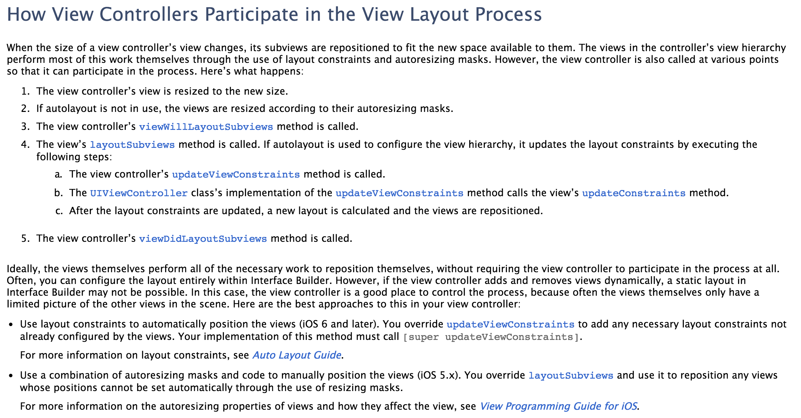

# iOS应用架构谈 view层的组织和调用方案

[iOS应用架构谈 开篇](https://casatwy.com/iosying-yong-jia-gou-tan-kai-pian.html) 
[iOS应用架构谈 view层的组织和调用方案](https://casatwy.com/iosying-yong-jia-gou-tan-viewceng-de-zu-zhi-he-diao-yong-fang-an.html) 
[iOS应用架构谈 网络层设计方案](https://casatwy.com/iosying-yong-jia-gou-tan-wang-luo-ceng-she-ji-fang-an.html) 
[iOS应用架构谈 本地持久化方案及动态部署](https://casatwy.com/iosying-yong-jia-gou-tan-ben-di-chi-jiu-hua-fang-an-ji-dong-tai-bu-shu.html) 
[iOS应用架构谈 组件化方案](https://casatwy.com/iOS-Modulization.html)

## 前言

《 [iOS应用架构谈 开篇](https://casatwy.com/iosying-yong-jia-gou-tan-kai-pian.html) 》出来之后，很多人来催我赶紧出第二篇。这一篇文章出得相当艰难，因为公司里的破事儿特别多，我自己又有点私事儿，以至于能用来写博客的时间不够充分。

现在好啦，第二篇出来了。

当我们开始设计View层的架构时，往往是这个App还没有开始开发，或者这个App已经发过几个版本了，然后此时需要做非常彻底的重构。

一般也就是这两种时机会去做View层架构，基于这个时机的特殊性，我们在这时候必须清楚认识到：View层的架构一旦实现或定型，在App发版后可修改的余地就已经非常之小了。因为它跟业务关联最为紧密，所以哪怕稍微动一点点，它所引发的蝴蝶效应都不见得是业务方能够hold住的。这样的情况，就要求我们在实现这个架构时，代码必须得改得勤快，不能偷懒。也必须抱着充分的自我怀疑态度，做决策时要拿捏好尺度。

View层的架构非常之重要，在我看来，这部分架构是这系列文章涉及4个方面最重要的一部分，没有之一。为什么这么说？

> View层架构是影响业务方迭代周期的因素之一  

产品经理产生需求的速度会非常快，尤其是公司此时仍处于创业初期，在规模稍大的公司里面，产品经理也喜欢挖大坑来在leader面前刷存在感，比如阿里。这就导致业务工程师任务非常繁重。正常情况下让产品经理砍需求是不太可能的，因此作为架构师，在架构里有一些可做可不做的事情，最好还是能做就做掉，不要偷懒。这可以帮业务方减负，编写代码的时候也能更加关注业务。

我跟一些朋友交流的时候，他们都会或多或少地抱怨自己的团队迭代速度不够快，或者说，迭代速度不合理地慢。我认为迭代速度不是想提就能提的，迭代速度的影响因素有很多，一期PRD里的任务量和任务复杂度都会影响迭代周期能达到什么样的程度。抛开这些外在的不谈，从内在可能导致迭代周期达不到合理的速度的原因来看，其中有一个原因很有可能就是View层架构没有做好，让业务工程师完成一个不算复杂的需求时，需要处理太多额外的事情。当然，开会多，工程师水平烂也属于迭代速度提不上去的内部原因，但这个不属于本文讨论范围。还有， `加班不是优化迭代周期的正确方式` ，嗯。

一般来说，一个不够好的View层架构，主要原因有以下五种：

1. 代码混乱不规范
2. 过多继承导致的复杂依赖关系
3. 模块化程度不够高，组件粒度不够细
4. 横向依赖
5. 架构设计失去传承

这五个地方会影响业务工程师实现需求的效率，进而拖慢迭代周期。View架构的其他缺陷也会或多或少地产生影响，但在我看来这里五个是比较重要的影响因素。如果大家觉得还有什么因素比这四个更高的，可以在评论区提出来我补上去。

对于第五点我想做一下强调：架构的设计是一定需要有传承的，有传承的架构从整体上看会非常协调。但实际情况有可能是一个人走了，另一个顶上，即便任务交接得再完整，都不可避免不同的人有不同的架构思路，从而导致整个架构的流畅程度受到影响。要解决这个问题，一方面要尽量避免单点问题，让架构师做架构的时候再带一个人。另一方面，架构要设计得尽量简单，平缓接手人的学习曲线。我离开安居客的时候，做过保证： `凡是从我手里出来的代码，终身保修` 。所以不要想着离职了就什么事儿都不管了，这不光是职业素养问题，还有一个是你对你的代码是否足够自信的问题。传承性对于View层架构非常重要，因为它距离业务最近，改动余地最小。

所以当各位CTO、技术总监、TeamLeader们觉得迭代周期不够快时，你可以先不忙着急吼吼地去招新人，《人月神话》早就说过加人不能完全解决问题。这时候如果你可以回过头来看一下是不是View层架构不合理，把这个弄好也是优化迭代周期的手段之一。

嗯，至于本系列其他三项的架构方案对于迭代周期的影响程度，我认为都不如View层架构方案对迭代周期的影响高，所以这是我认为View层架构是最重要的其中一个理由。

> View层架构是最贴近业务的底层架构  

View层架构虽然也算底层，但还没那么底层，它跟业务的对接面最广，影响业务层代码的程度也最深。在所有的底层都牵一发的时候，在View架构上牵一发导致业务层动全身的面积最大。

所以View架构在所有架构中一旦定型，可修改的空间就最小，我们在一开始考虑View相关架构时，不光要实现功能，还要考虑更多规范上的东西。制定规范的目的一方面是防止业务工程师的代码腐蚀View架构，另一方面也是为了能够有所传承。按照规范来，总还是不那么容易出差池的。

还有就是，架构师一开始考虑的东西也会有很多，不可能在第一版就把它们全部实现，对于一个尚未发版的App来说，第一版架构往往是最小完整功能集，那么在第二版第三版的发展过程中，架构的迭代任务就很有可能不只是你一个人的事情了，相信你一个人也不见得能搞定全部。所以你要跟你的合作者们有所约定。另外，第一版出去之后，业务工程师在使用过程中也会产生很多修改意见，哪些意见是合理的，哪些意见是不合理的，也要通过事先约定的规范来进行筛选，最终决定如何采纳。

规范也不是一成不变的，什么时候枪毙意见，什么时候改规范，这就要靠各位的技术和经验了。

以上就是前言。

## 这篇文章讲什么？

* View代码结构的规定

* 关于view的布局

* 何时使用storyboard，何时使用nib，何时使用代码写View

* 是否有必要让业务方统一派生ViewController？

* 方便View布局的小工具

* MVC、MVVM、MVCS、VIPER

* 本门心法

* 跨业务时View的处理

* 留给评论区各种补

* 总结

## View代码结构的规定

架构师不是写SDK出来交付业务方使用就没事儿了的，每家公司一定都有一套代码规范，架构师的职责也包括定义代码规范。按照道理来讲，定代码规范应该是属于通识，放在这里讲的原因只是因为我这边需要为View添加一个规范。

制定代码规范严格来讲不属于View层架构的事情，但它对View层架构未来的影响会比较大，也是属于架构师在设计View层架构时需要考虑的事情。制定View层规范的重要性在于：

1. 提高业务方View层的可读性可维护性
2. 防止业务代码对架构产生腐蚀
3. 确保传承
4. 保持架构发展的方向不轻易被不合理的意见所左右

在这一节里面我不打算从头开始定义一套规范，苹果有一套 [Coding Guidelines](https://developer.apple.com/library/mac/documentation/Cocoa/Conceptual/CodingGuidelines/CodingGuidelines.html) ，当我们定代码结构或规范的时候，首先一定要符合这个规范。

然后，相信大家各自公司里面也都有一套自己的规范，具体怎么个规范法其实也是根据各位架构师的经验而定，我这边只是建议各位在各自规范的基础上再加上下面这一点。

viewController的代码应该差不多是这样：


要点如下：

> 所有的属性都使用getter和setter  

不要在viewDidLoad里面初始化你的view然后再add，这样代码就很难看。在viewDidload里面只做addSubview的事情，然后在viewWillAppear里面做布局的事情（ `勘误1` ），最后在viewDidAppear里面做Notification的监听之类的事情。至于属性的初始化，则交给getter去做。

比如这样：

```
#pragma mark - life cycle
- (void)viewDidLoad
{ 
    [super viewDidLoad]; 
    self.view.backgroundColor = [UIColor whiteColor]; 
    [self.view addSubview:self.firstTableView]; 
    [self.view addSubview:self.secondTableView]; 
    [self.view addSubview:self.firstFilterLabel]; 
    [self.view addSubview:self.secondFilterLabel]; 
    [self.view addSubview:self.cleanButton]; 
    [self.view addSubview:self.originImageView]; 
    [self.view addSubview:self.processedImageView]; 
    [self.view addSubview:self.activityIndicator]; 
    [self.view addSubview:self.takeImageButton];
} 
- (void)viewWillAppear:(BOOL)animated
{ 
    [super viewWillAppear:animated]; 
    CGFloat width = (self.view.width - 30) / 2.0f; 
    self.originImageView.size = CGSizeMake(width, width); [self.originImageView topInContainer:70 shouldResize:NO]; [self.originImageView leftInContainer:10 shouldResize:NO]; self.processedImageView.size = CGSizeMake(width, width); [self.processedImageView right:10 FromView:self.originImageView]; 
    [self.processedImageView topEqualToView:self.originImageView]; 
    CGFloat labelWidth = self.view.width - 100; self.firstFilterLabel.size = CGSizeMake(labelWidth, 20); 
    [self.firstFilterLabel leftInContainer:10 shouldResize:NO]; 
    [self.firstFilterLabel top:10 FromView:self.originImageView]; 
    ... ...
}
```

这样即便在属性非常多的情况下，还是能够保持代码整齐，view的初始化都交给getter去做了。总之就是尽量不要出现以下的情况：

```
- (void)viewDidLoad
{ 
    [super viewDidLoad]; 
    self.textLabel = [[UILabel alloc] init]; 
    self.textLabel.textColor = [UIColor blackColor]; 
    self.textLabel ... ... 
    self.textLabel ... ... 
    self.textLabel ... ... 
    [self.view addSubview:self.textLabel];
}
```

这种做法就不够干净，都扔到getter里面去就好了。关于这个做法，在唐巧的技术博客里面有 [一篇文章](http://blog.devtang.com/blog/2015/03/15/ios-dev-controversy-1/) 和我所提倡的做法不同，这个我会放在后面详细论述。

> getter和setter全部都放在最后  

因为一个ViewController很有可能会有非常多的view，就像上面给出的代码样例一样，如果getter和setter写在前面，就会把主要逻辑扯到后面去，其他人看的时候就要先划过一长串getter和setter，这样不太好。然后要求业务工程师写代码的时候按照顺序来分配代码块的位置，先是 `life cycle` ，然后是 `Delegate方法实现` ，然后是 `event response` ，然后才是 `getters and setters` 。这样后来者阅读代码时就能省力很多。

> 每一个delegate都把对应的protocol名字带上，delegate方法不要到处乱写，写到一块区域里面去  

比如UITableViewDelegate的方法集就老老实实写上 `#pragma mark - UITableViewDelegate` 。这样有个好处就是，当其他人阅读一个他并不熟悉的Delegate实现方法时，他只要按住command然后去点这个protocol名字，Xcode就能够立刻跳转到对应这个Delegate的protocol定义的那部分代码去，就省得他到处找了。

> event response专门开一个代码区域  

所有button、gestureRecognizer的响应事件都放在这个区域里面，不要到处乱放。

> 关于private methods，正常情况下ViewController里面不应该写  

不是delegate方法的，不是event response方法的，不是life cycle方法的，就是private method了。对的，正常情况下ViewController里面一般是不会存在private methods的，这个private methods一般是用于日期换算、图片裁剪啥的这种小功能。这种小功能要么把它写成一个category，要么把他做成一个模块，哪怕这个模块只有一个函数也行。

ViewController基本上是大部分业务的载体，本身代码已经相当复杂，所以跟业务关联不大的东西能不放在ViewController里面就不要放。另外一点，这个private method的功能这时候只是你用得到，但是将来说不定别的地方也会用到，一开始就独立出来，有利于将来的代码复用。

> 为什么要这样要求？  

我见过无数ViewController，代码布局乱得一塌糊涂，这里一个delegate那里一个getter，然后ViewController的代码一般都死长死长的，看了就让人头疼。

定义好这个规范，就能使得ViewController条理清晰，业务方程序员很能够区分哪些放在ViewController里面比较合适，哪些不合适。另外，也可以提高代码的可维护性和可读性。

## 关于View的布局

业务工程师在写View的时候一定逃不掉的就是这个命题。用Frame也好用Autolayout也好，如果没有精心设计过，布局部分一定惨不忍睹。

直接使用CGRectMake的话可读性很差，光看那几个数字，也无法知道view和view之间的位置关系。用Autolayout可读性稍微好点儿，但生成Constraint的长度实在太长，代码观感不太好。

Autolayout这边可以考虑使用Masonry，代码的可读性就能好很多。如果还有使用Frame的，可以考虑一下使用 [这个项目](https://github.com/casatwy/HandyAutoLayout) 。

这个项目里面提供了Frame相关的方便方法( `UIView+LayoutMethods` )，里面的方法也基本涵盖了所有布局的需求，可读性非常好，使用它之后基本可以和CGRectMake说再见了。因为天猫在最近才切换到支持iOS6，所以之前天猫都是用Frame布局的，在天猫App中，首页，范儿部分页面的布局就使用了这些方法。使用这些方便方法能起到事半功倍的效果。

这个项目也提供了Autolayout方案下生产Constraints的方便方法( `UIView+AEBHandyAutoLayout` )，可读性比原生好很多。我当时在写这系列方法的时候还不知道有Masonry。知道有Masonry之后我特地去看了一下，发现Masonry功能果然强大。不过这系列方法虽然没有Masonry那么强大，但是也够用了。当时安居客iPad版App全部都是Autolayout来做的View布局，就是使用的这个项目里面的方法。可读性很好。

让业务工程师使用良好的工具来做View的布局，能提高他们的工作效率，也能减少bug发生的几率。架构师不光要关心那些高大上的内容，也要多给业务工程师提供方便易用的小工具，才能发挥架构师的价值。

## 何时使用storyboard，何时使用nib，何时使用代码写View

这个问题唐巧的博客里 [这篇文章](http://blog.devtang.com/blog/2015/03/22/ios-dev-controversy-2/) 也提到过，我的意见和他是基本一致的。

在这里我还想补充一些内容：

具有一定规模的团队化iOS开发（10人以上）有以下几个特点：

1. 同一份代码文件的作者会有很多，不同作者同时修改同一份代码的情况也不少见。因此，使用Git进行代码版本管理时出现Conflict的几率也比较大。
2. 需求变化非常频繁，产品经理一时一个主意，为了完成需求而针对现有代码进行微调的情况，以及针对现有代码的 `部分复用` 的情况也比较多。
3. 复杂界面元素、复杂动画场景的开发任务比较多。

如果这三个特点你一看就明白了，下面的解释就可以不用看了。如果你针对我的倾向愿意进一步讨论的，可以先看我下面的解释，看完再说。

> 同一份代码文件的作者会有很多，不同作者同时修改同一份代码的情况也不少见。因此，使用Git进行代码版本管理时出现Conflict的几率也比较大。  

iOS开发过程中，会遇到最蛋疼的两种Conflict一个是 `project.pbxproj` ，另外一个就是 `StoryBoard` 或 `XIB` 。因为这些文件的内容的可读性非常差，虽然苹果在XCode5（现在我有点不确定是不是这个版本了）中对StoryBoard的文件描述方式做了一定的优化，但只是把可读性从 `非常差` 提升为 `很差` 。

然而在StoryBoard中往往包含了多个页面，这些页面基本上不太可能都由一个人去完成，如果另一个人在做StoryBoard的操作的时候，出于某些目的动了一下不属于他的那个页面，比如为了美观调整了一下位置。然后另外一个人也因为要添加一个页面，而在Storyboard中调整了一下某个其他页面的位置。那么针对这个情况我除了说个 `呵呵` 以外，我就只能说： `祝你好运。` 看清楚哦，这还没动具体的页页面内容呢。

但如果使用代码绘制View，Conflict一样会发生，但是这种Conflict就好解很多了，你懂的。

> 需求变化非常频繁，产品经理一时一个主意，为了完成需求而针对现有代码进行微调的情况，以及针对现有代码的 `部分复用` 的情况也比较多。  

我觉得产品经理一时一个主意不是他的错，他说不定也是被逼的，比如谁都会来掺和一下产品的设计，公司里的所有人，上至CEO，下至基层员工都有可能对产品设计评头论足，只要他个人有个地方用得不爽（极大可能是个人喜好）然后又正好跟产品经理比较熟悉能够搭得上话，都会提出各种意见。产品经理躲不起也惹不起，有时也是没办法，嗯。

但落实到工程师这边来，这种情况就很蛋疼。因为这种改变有时候不光是UI，UI所对应的逻辑也有要改的可能，工程师就会两边文件都改，你原来link的那个view现在不link了，然后你的outlet对应也要删掉，这两部分只要有一个没做，编译通过之后跑一下App，一会儿就crash了。看起来这不是什么大事儿，但很影响心情。

另外，如果出现部分的代码复用，比如说某页面下某个View也希望放在另外一个页面里，相关的操作就不是复制粘贴这么简单了，你还得重新link一遍。也很影响心情。

> 复杂界面元素，复杂动画交互场景的开发任务比较多。  

要是想在基于StoryBoard的项目中做一个动画，很烦。做几个复杂界面元素，也很烦。有的时候我们挂Custom View上去，其实在StoryBoard里面看来就是一个空白View。然后另外一点就是，当你的layout出现问题需要调整的时候，还是挺难找到问题所在的，尤其是在复杂界面元素的情况下。

所以在针对View层这边的要求时，我也是建议不要用StoryBoard。实现简单的东西，用Code一样简单，实现复杂的东西，Code比StoryBoard更简单。所以我更加提倡用code去画view而不是storyboard。

## 是否有必要让业务方统一派生ViewController

有的时候我们出于记录用户操作行为数据的需要，或者统一配置页面的目的，会从UIViewController里面派生一个自己的ViewController，来执行一些通用逻辑。比如天猫客户端要求所有的ViewController都要继承自TMViewController。这个统一的父类里面针对一个ViewController的所有生命周期都做了一些设置，至于这里都有哪些设置对于本篇文章来说并不重要。在这里我想讨论的是，在设计View架构时，如果为了能够达到统一设置或执行统一逻辑的目的，使用派生的手段是有必要的吗？

我觉得没有必要，为什么没有必要？

1. 使用派生比不使用派生更容易增加业务方的使用成本
2. 不使用派生手段一样也能达到统一设置的目的

这两条原因是我认为没有必要使用派生手段的理由，如果两条理由你都心领神会，那么下面的就可以不用看了。如果你还有点疑惑，请看下面我来详细讲一下原因。

> 为什么使用了派生，业务方的使用成本会提升？  

其实不光是业务方的使用成本，架构的维护成本也会上升。那么具体的成本都来自于哪里呢？

* 集成成本

这里讲的集成成本是这样的：如果业务方自己开了一个独立demo，快速完成了某个独立流程，现在他想把这个现有流程集合进去。那么问题就来了，他需要把所有独立的UIViewController改变成TMViewController。那为什么不是一开始就立刻使用TMViewController呢？因为要想引入TMViewController，就要引入整个天猫App所有的业务线，所有的基础库，因为这个父类里面涉及很多天猫环境才有的内容，所谓拔出萝卜带出泥，你要是想简单继承一下就能搞定的事情，搭环境就要搞半天，然后这个小Demo才能跑得起来。

对于业务层存在的所有父类来说，它们是很容易跟项目中的其他代码纠缠不清的，这使得业务方开发时遇到一个两难问题： `要么把所有依赖全部搞定，然后基于App环境（比如天猫）下开发Demo` ， `要么就是自己Demo写好之后，按照环境要求改代码` 。这里的两难问题都会带来成本，都会影响业务方的迭代进度。

我不确定各位所在公司是否会有这样的情况，但我可以在这里给大家举一个我在阿里的真实的例子：我最近在开发某滤镜Demo和相关页面流程，最终是要合并到天猫这个App里面去的。使用天猫环境进行开发的话，pod install完所有依赖差不多需要10分钟，然后打开workspace之后，差不多要再等待1分钟让xcode做好索引，然后才能正式开始工作。在这里要感谢一下则平，因为他在此基础上做了很多优化，使得这个1分钟已经比原来的时间短很多了。但如果天猫环境有更新，你就要再重复一次上面的流程，否则 就很有可能编译不过。

拜托，我只是想做个Demo而已，不想搞那么复杂。

* 上手接受成本

新来的业务工程师有的时候不见得都记得每一个ViewController都必须要派生自TMViewController而不是直接的UIViewController。新来的工程师他不能直接按照苹果原生的做法去做事情，他需要额外学习，比如说：所有的ViewController都必须继承自TMViewController。

* 架构的维护难度

尽可能少地使用继承能提高项目的可维护性，具体内容我在《 [跳出面向对象思想（一） 继承](http://casatwy.com/tiao-chu-mian-xiang-dui-xiang-si-xiang-yi-ji-cheng.html) 》里面说了，在这里我想偷懒不想把那篇文章里说过的东西再说一遍。

其实对于业务方来说，主要还是第一个集成成本比较蛋疼，因为这是长痛，每次要做点什么事情都会遇到。第二点倒还好，短痛。第三点跟业务工程师没啥关系。

> 那么如果不使用派生，我们应该使用什么手段？  

我的建议是使用AOP。

在架构师实现具体的方案之前，必须要想清楚几个问题，然后才能决定采用哪种方案。是哪几个问题？

1. 方案的效果，和最终要达到的目的是什么？
2. 在自己的知识体系里面，是否具备实现这个方案的能力？
3. 在业界已有的开源组件里面，是否有可以直接拿来用的轮子？

这三个问题按照顺序一一解答之后，具体方案就能出来了。

> 我们先看第一个问题： `方案的效果，和最终要达到的目的是什么？`  

方案的效果应该是：

1. 业务方可以不用通过继承的方法，然后框架能够做到对ViewController的统一配置。
2. 业务方即使脱离框架环境，不需要修改任何代码也能够跑完代码。业务方的ViewController一旦丢入框架环境，不需要修改任何代码，框架就能够起到它应该起的作用。

其实就是要实现 `不通过业务代码上对框架的主动迎合，使得业务能够被框架感知` 这样的功能。细化下来就是两个问题，框架要能够拦截到ViewController的生命周期，另一个问题就是，拦截的定义时机。

对于方法拦截，很容易想到 `Method Swizzling` ，那么我们可以写一个实例，在App启动的时候添加针对UIViewController的方法拦截，这是一种做法。还有另一种做法就是，使用NSObject的load函数，在应用启动时自动监听。使用后者的好处在于，这个模块只要被项目包含，就能够发挥作用，不需要在项目里面添加任何代码。

然后另外一个要考虑的事情就是，原有的TMViewController（所谓的父类）也是会提供额外方法方便子类使用的， `Method Swizzling` 只支持针对现有方法的操作，拓展方法的话，嗯，当然是用 `Category` 啦。

我本人不赞成Category的过度使用，但鉴于Category是最典型的化继承为组合的手段，在这个场景下还是适合使用的。还有的就是，关于 `Method Swizzling` 手段实现方法拦截，业界也已经有了现成的开源库： [Aspects](https://github.com/steipete/Aspects) ，我们可以直接拿来使用。

我这边有个非常非常小的Demo可以放出来给大家，这个 [Demo](https://github.com/Jowyer/iOSViewArchDemo) 只是一个点睛之笔，有一些话我也写在这个Demo里面了，各位架构师们你们可以基于各自公司App的需求去拓展。

这个Demo不包含Category，毕竟Category还是得你们自己去写啊～然后这套方案能够完成原来通过派生手段所有可以完成的任务，但同时又允许业务方不必添加任何代码，直接使用原生的UIViewController。

然后另外要提醒的是，这方案的目的是消除不必要的继承，虽然不限定于UIViewController，但它也是有适用范围的，在适用继承的地方，还是要老老实实使用继承。比如你有一个数据模型，是由基本模型派生出的一整套模型，那么这个时候还是老老实实使用继承。至于拿捏何时使用继承，相信各位架构师一定能够处理好，或者你也可以参考我前面提到的 [那篇文章](http://casatwy.com/tiao-chu-mian-xiang-dui-xiang-si-xiang-yi-ji-cheng.html) 来控制拿捏的尺度。

## 关于MVC、MVVM等一大堆思想

其实这些都是相对通用的思想，万变不离其宗的还是在开篇里面我提到的那三个角色： `数据管理者` ， `数据加工者` ， `数据展示者` 。这些五花八门的思想，不外乎就是制订了一个规范，规定了这三个角色应当如何进行数据交换。但同时这些也是争议最多的话题，所以我在这里来把几个主流思想做一个梳理，当你在做View层架构时，能够有个比较好的参考。

## MVC

MVC（Model-View-Controller）是最老牌的的思想，老牌到4人帮的书里把它归成了一种模式，其中 `Model` 就是作为 `数据管理者` ， `View` 作为 `数据展示者` ， `Controller` 作为 `数据加工者` ， `Model` 和 `View` 又都是由 `Controller` 来根据业务需求调配，所以 `Controller` 还负担了一个数据流调配的功能。正在我写这篇文章的时候，我看到InfoQ发了 [这篇文章](http://www.infoq.com/cn/news/2015/04/symposium-web-mvc) ，里面提到了一个移动开发中的痛点是： `对MVC架构划分的理解` 。我当时没能够去参加这个座谈会，也没办法发表个人意见，所以就只能在这里写写了。

> 在iOS开发领域，我们应当如何进行MVC的划分？  

这里面其实有两个问题：

1. 为什么我们会纠结于iOS开发领域中MVC的划分问题？
2. 在iOS开发领域中，怎样才算是划分的正确姿势？

> 为什么我们会纠结于iOS开发领域中MVC的划分问题？  

关于这个，每个人纠结的点可能不太一样，我也不知道当时座谈会上大家的观点。但请允许我猜一下： `是不是因为UIViewController中自带了一个View，且控制了View的整个生命周期（viewDidLoad,viewWillAppear...），而在常识中我们都知道Controller不应该和View有如此紧密的联系，所以才导致大家对划分产生困惑？` ，下面我会针对这个猜测来给出我的意见。

在服务端开发领域，Controller和View的交互方式一般都是这样，比如Yii：

```
/*
 ...
 数据库取数据
 ...
 处理数据
 ...
 */  // 此处$this就是Controller
 $this->render("plan",array(
 'planList' => $planList,
 'plan_id' => $_GET['id'],
 ));
```

这里Controller和View之间区分得非常明显，Controller做完自己的事情之后，就把所有关于View的工作交给了页面渲染引擎去做，Controller不会去做任何关于View的事情，包括生成View，这些都由渲染引擎代劳了。这是一个区别，但其实服务端View的概念和Native应用View的概念，真正的区别在于： `从概念上严格划分的话，服务端其实根本没有View，拜HTTP协议所赐，我们平时所讨论的View只是用于描述View的字符串（更实质的应该称之为数据），真正的View是浏览器。` 。

所以服务端只管生成对View的描述，至于对View的长相，UI事件监听和处理，都是浏览器负责生成和维护的。但是在Native这边来看，原本属于浏览器的任务也逃不掉要自己做。那么这件事情由谁来做最合适？苹果给出的答案是： **UIViewController** 。

鉴于苹果在这一层做了很多艰苦卓绝的努力，让iOS工程师们不必亲自去实现这些内容。而且，它把所有的功能都放在了UIView上，并且把UIView做成不光可以展示UI，还可以作为容器的一个对象。

看到这儿你明白了吗？UIView的另一个身份其实是容器！UIViewController中自带的那个view，它的主要任务就是作为一个容器。如果它所有的相关命名都改成 `ViewContainer` ，那么代码就会变成这样：

```
- (void)viewContainerDidLoad
{ [self.viewContainer addSubview:self.label]; [self.viewContainer addSubview:self.tableView]; [self.viewContainer addSubview:self.button]; [self.viewContainer addSubview:self.textField];
} ... ...
```

仅仅改了个名字，现在是不是感觉清晰了很多？如果再要说详细一点，我们平常所认为的服务端MVC是这样划分的：

```
---------------------------
               | C                       |
               |        Controller       |
               |                         |
               ---------------------------
              /                           \
             /                             \
            /                               \
------------                                 ---------------------
| M        |                                 | V                 |
|   Model  |                                 |    Render Engine  |
|          |                                 |          +        |
------------                                 |      HTML Files   |
                                             ---------------------
```

但事实上，整套流程的MVC划分是这样：

```
---------------------------
               | C                       |
               |   Controller            |
               |           \             |
               |           Render Engine |
               |                 +       |
               |             HTML Files  |
               ---------------------------
              /                           \
             /                             \ HTML String
            /                               \
------------                                 ---------------
| M        |                                 | V           |
|   Model  |                                 |    Browser  |
|          |                                 |             |
------------                                 ---------------
```

由图中可以看出，我们服务端开发在这个概念下，其实只涉及M和C的开发工作，浏览器作为View的容器，负责View的展示和事件的监听。那么对应到iOS客户端的MVC划分上面来，就是这样：

```
----------------------------
               | C                        |
               |   Controller             |
               |           \              |
               |           View Container |
               ----------------------------
              /                            \
             /                              \
            /                                \
------------                                  ----------------------
| M        |                                  | V                  |
|   Model  |                                  |    UITableView     |
|          |                                  |    YourCustomView  |
------------                                  |         ...        |
                                              ----------------------
```

唯一区别在于，View的容器在服务端，是由Browser负责，在整个网站的流程中，这个容器放在Browser是非常合理的。在iOS客户端，View的容器是由UIViewController中的view负责，我也觉得苹果做的这个选择是非常正确明智的。

因为浏览器和服务端之间的关系非常松散，而且他们分属于两个不同阵营，服务端将对View的描述生成之后，交给浏览器去负责展示，然而一旦view上有什么事件产生，基本上是很少传递到服务器（也就是所谓的Controller）的（要传也可以：AJAX），都是在浏览器这边把事情都做掉，所以在这种情况下，View容器就适合放在浏览器（V）这边。

但是在iOS开发领域，虽然也有让View去监听事件的做法，但这种做法非常少，都是把事件回传给Controller，然后Controller再另行调度。所以这时候，View的容器放在Controller就非常合适。Controller可以因为不同事件的产生去很方便地更改容器内容，比如加载失败时，把容器内容换成失败页面的View，无网络时，把容器页面换成无网络的View等等。

> 在iOS开发领域中，怎样才算是MVC划分的正确姿势？  

这个问题其实在上面已经解答掉一部分了，那么这个问题的答案就当是对上面问题的一个总结吧。

M应该做的事：

1. 给ViewController提供数据
2. 给ViewController存储数据提供接口
3. 提供经过抽象的业务基本组件，供Controller调度

C应该做的事：

1. 管理View Container的生命周期
2. 负责生成所有的View实例，并放入View Container
3. 监听来自View与业务有关的事件，通过与Model的合作，来完成对应事件的业务。

V应该做的事：

1. 响应与业务无关的事件，并因此引发动画效果，点击反馈（如果合适的话，尽量还是放在View去做）等。
2. 界面元素表达

我通过与服务端MVC划分的对比来回答了这两个问题，之所以这么做，是因为我知道有很多iOS工程师之前是从服务端转过来的。我也是这样，在进安居客之前，我也是做服务端开发的，在学习iOS的过程中，我也曾经对iOS领域的MVC划分问题产生过疑惑，我疑惑的点就是前面开篇我猜测的点。如果有人问我iOS中应该怎么做MVC的划分，我就会像上面这么回答。

## MVCS

苹果自身就采用的是这种架构思路，从名字也能看出，也是基于MVC衍生出来的一套架构。从概念上来说，它拆分的部分是Model部分，拆出来一个Store。这个Store专门负责数据存取。但从实际操作的角度上讲，它拆开的是Controller。

这算是瘦Model的一种方案，瘦Model只是专门用于表达数据，然后存储、数据处理都交给外面的来做。MVCS使用的前提是，它假设了你是瘦Model，同时数据的存储和处理都在Controller去做。所以对应到MVCS，它在一开始就是拆分的Controller。因为Controller做了数据存储的事情，就会变得非常庞大，那么就把Controller专门负责存取数据的那部分抽离出来，交给另一个对象去做，这个对象就是Store。这么调整之后，整个结构也就变成了真正意义上的MVCS。

> 关于胖Model和瘦Model  

我在面试和跟别人聊天时，发现知道胖Model和瘦Model的概念的人不是很多。大约两三年前国外业界曾经对此有过非常激烈的讨论，主题就是 `Fat model, skinny controller` 。现在关于这方面的讨论已经不多了，然而直到今天胖Model和瘦Model哪个更好，业界也还没有定论，所以这算是目前业界悬而未解的一个争议。我很少看到国内有讨论这个的资料，所以在这里我打算补充一下什么叫胖Model什么叫瘦Model。以及他们的争论来源于何处。

* 什么叫胖Model？

`胖Model包含了部分弱业务逻辑` 。胖Model要达到的目的是， `Controller从胖Model这里拿到数据之后，不用额外做操作或者只要做非常少的操作，就能够将数据直接应用在View上` 。举个例子：

```
Raw Data: 
    timestamp:1234567 

FatModel: 
    @property (nonatomic, assign) CGFloat timestamp; 
    - (NSString *)ymdDateString; // 2015-04-20 15:16 
    - (NSString *)gapString; // 3分钟前、1小时前、一天前、2015-3-13 12:34 
Controller: 
    self.dateLabel.text = [FatModel ymdDateString]; 
    self.gapLabel.text = [FatModel gapString];
```

把timestamp转换成具体业务上所需要的字符串，这属于业务代码，算是弱业务。FatModel做了这些弱业务之后，Controller就能变得非常skinny，Controller只需要关注强业务代码就行了。众所周知，强业务变动的可能性要比弱业务大得多，弱业务相对稳定，所以弱业务塞进Model里面是没问题的。另一方面，弱业务重复出现的频率要大于强业务，对复用性的要求更高，如果这部分业务写在Controller，类似的代码会洒得到处都是，一旦弱业务有修改（弱业务修改频率低不代表就没有修改），这个事情就是一个灾难。如果塞到Model里面去，改一处很多地方就能跟着改，就能避免这场灾难。

然而其缺点就在于，胖Model相对比较难移植，虽然只是包含弱业务，但好歹也是业务，迁移的时候很容易拔出萝卜带出泥。另外一点，MVC的架构思想更加倾向于Model是一个Layer，而不是一个Object，不应该把一个Layer应该做的事情交给一个Object去做。最后一点，软件是会成长的，FatModel很有可能随着软件的成长越来越Fat，最终难以维护。

* 什么叫瘦Model？

`瘦Model只负责业务数据的表达，所有业务无论强弱一律扔到Controller` 。瘦Model要达到的目的是， `尽一切可能去编写细粒度Model，然后配套各种helper类或方法来对弱业务做抽象，强业务依旧交给Controller` 。举个例子：

```
Raw Data:
{ 
    "name":"casa", 
    "sex":"male",
} 

SlimModel: 
    @property (nonatomic, strong) NSString *name; 
    @property (nonatomic, strong) NSString *sex; 

Helper: 
    #define Male 1; 
    #define Female 0; 
    + (BOOL)sexWithString:(NSString *)sex; 

Controller: 
    if ([Helper sexWithString:SlimModel.sex] == Male) { 
        ... 
    }
```

由于SlimModel跟业务完全无关，它的数据可以交给任何一个能处理它数据的Helper或其他的对象，来完成业务。在代码迁移的时候独立性很强，很少会出现拔出萝卜带出泥的情况。另外，由于SlimModel只是数据表达，对它进行维护基本上是0成本，软件膨胀得再厉害，SlimModel也不会大到哪儿去。

缺点就在于，Helper这种做法也不见得很好，这里有一篇 [文章](http://nicksda.apotomo.de/2011/10/rails-misapprehensions-helpers-are-shit/) 批判了这个事情。另外，由于Model的操作会出现在各种地方，SlimModel在一定程度上违背了DRY（Don't Repeat Yourself）的思路，Controller仍然不可避免在一定程度上出现代码膨胀。

我的态度？嗯，我会在 `本门心法` 这一节里面说。

说回来，MVCS是基于瘦Model的一种架构思路，把原本Model要做的很多事情中的其中一部分关于数据存储的代码抽象成了Store，在一定程度上降低了Controller的压力。

## MVVM

MVVM去年在业界讨论得非常多，无论国内还是国外都讨论得非常热烈，尤其是在ReactiveCocoa这个库成熟之后，ViewModel和View的信号机制在iOS下终于有了一个相对优雅的实现。MVVM本质上也是从MVC中派生出来的思想，MVVM着重想要解决的问题是尽可能地减少Controller的任务。不管MVVM也好，MVCS也好，他们的共识都是 `Controller会随着软件的成长，变很大很难维护很难测试` 。只不过两种架构思路的前提不同，MVCS是认为Controller做了一部分Model的事情，要把它拆出来变成Store，MVVM是认为Controller做了太多数据加工的事情，所以MVVM把 `数据加工` 的任务从 `Controller` 中解放了出来，使得 `Controller` 只需要专注于数据调配的工作， `ViewModel` 则去负责数据加工并通过通知机制让View响应ViewModel的改变。

MVVM是 `基于胖Model的架构思路建立的，然后在胖Model中拆出两部分：Model和ViewModel` 。关于这个观点我要做一个额外解释：胖Model做的事情是先为Controller减负，然后由于Model变胖，再在此基础上拆出ViewModel，跟业界普遍认知的 `MVVM本质上是为Controller减负` 这个说法并不矛盾，因为胖Model做的事情也是为Controller减负。

另外，我前面说 `MVVM把数据加工的任务从Controller中解放出来` ，跟 `MVVM拆分的是胖Model` 也不矛盾。要做到解放Controller，首先你得有个胖Model，然后再把这个胖Model拆成Model和ViewModel。

> 那么MVVM究竟应该如何实现？  

这很有可能是大多数人纠结的问题，我打算凭我的个人经验试图在这里回答这个问题，欢迎大家在评论区交流。

在iOS领域大部分MVVM架构都会使用ReactiveCocoa，但是使用ReactiveCocoa的iOS应用就是基于MVVM架构的吗？那当然不是，我觉得很多人都存在这个误区，我面试过的一些人提到了ReactiveCocoa也提到了MVVM，但他们对此的理解肤浅得让我忍俊不禁。嗯，在网络层架构我会举出不使用ReactiveCocoa的例子，现在举我感觉有点儿早。

> MVVM的关键是要有View Model！而不是ReactiveCocoa( `勘误2` )  

ViewModel做什么事情？就是把RawData变成直接能被View使用的对象的一种Model。举个例子：

```
Raw Data:
        {
            (
                (123, 456),
                (234, 567),
                (345, 678)
            )
        }
```

这里的RawData我们假设是经纬度，数字我随便写的不要太在意。然后你有一个模块是地图模块，把经纬度数组全部都转变成MKAnnotation或其派生类对于Controller来说是弱业务，（记住，胖Model就是用来做弱业务的），因此我们用ViewModel直接把它转变成MKAnnotation的NSArray，交给Controller之后Controller直接就可以用了。

嗯，这就是ViewModel要做的事情，是不是觉得很简单，看不出优越性？

安居客Pad应用也有一个地图模块，在这里我设计了一个对象叫做reformer（其实就是ViewModel），专门用来干这个事情。那么这么做的优越性体现在哪儿呢？

安居客分三大业务：租房、二手房、新房。这三个业务对应移动开发团队有三个API开发团队，他们各自为政，这就造成了一个结果：三个API团队回馈给移动客户端的数据内容虽然一致，但是数据格式是不一致的，也就是相同value对应的key是不一致的。但展示地图的ViewController不可能写三个，所以肯定少不了要有一个API数据兼容的逻辑，这个逻辑我就放在reformer里面去做了，于是业务流程就变成了这样：

```
              用户进入地图页发起地图API请求
                          |
                          |
                          |
      -----------------------------------------
      |                   |                   |
      |                   |                   |
   新房API            二手房API            租房API
      |                   |                   |
      |                   |                   |
      -----------------------------------------
                          |
                          |
                          |
                   获得原始地图数据
                          |
                          |
                          |
     [APIManager fetchDataWithReformer:reformer]
                          |
                          |
                          |
                  MKAnnotationList
                          |
                          |
                          |
                     Controller
```

这么一来，原本复杂的MKAnnotation组装逻辑就从Controller里面拆分了出来，Controller可以直接拿着Reformer返回的数据进行展示。APIManager就属于Model，reformer就属于ViewModel。具体关于reformer的东西我会放在网络层架构来详细解释。Reformer此时扮演的ViewModel角色能够很好地给Controller减负，同时，维护成本也大大降低，经过reformer产出的永远都是MKAnnotation，Controller可以直接拿来使用。

然后另外一点，还有一个业务需求是取附近的房源，地图API请求是能够hold住这个需求的，那么其他地方都不用变，在fetchDataWithReformer的时候换一个reformer就可以了，其他的事情都交给reformer。

> 那么ReactiveCocoa应该扮演什么角色？  

不用ReactiveCocoa也能MVVM，用ReactiveCocoa能更好地体现MVVM的精髓。前面我举到的例子只是数据从API到View的方向，View的操作也会产生"数据"，只不过这里的"数据"更多的是体现在表达用户的操作上，比如输入了什么内容，那么数据就是text、选择了哪个cell，那么数据就是indexPath。那么在数据从view走向API或者Controller的方向上，就是ReactiveCocoa发挥的地方。

我们知道，ViewModel本质上算是Model层（因为是胖Model里面分出来的一部分），所以View并不适合直接持有ViewModel，那么View一旦产生数据了怎么办？扔信号扔给ViewModel，用谁扔？ReactiveCocoa。

在MVVM中使用ReactiveCocoa的第一个目的就是如上所说，View并不适合直接持有ViewModel。第二个目的就在于，ViewModel有可能并不是只服务于特定的一个View，使用更加松散的绑定关系能够降低ViewModel和View之间的耦合度。

> 那么在MVVM中，Controller扮演什么角色？  

大部分国内外资料阐述MVVM的时候都是这样排布的： `View <-> ViewModel <-> Model` ，造成了MVVM不需要Controller的错觉，现在似乎发展成业界开始出现 `MVVM是不需要Controller的。` 的声音了。其实MVVM是一定需要Controller的参与的，虽然MVVM在一定程度上弱化了Controller的存在感，并且给Controller做了减负瘦身（这也是MVVM的主要目的）。但是，这并不代表MVVM中不需要Controller，MMVC和MVVM他们之间的关系应该是这样：


(来源：http://www.sprynthesis.com/2014/12/06/reactivecocoa-mvvm-introduction/)

`View <-> C <-> ViewModel <-> Model` ，所以 `使用MVVM之后，就不需要Controller` 的说法是不正确的。严格来说 `MVVM` 其实是 `MVCVM` 。从图中可以得知，Controller夹在View和ViewModel之间做的其中一个主要事情就是将View和ViewModel进行绑定。在逻辑上，Controller知道应当展示哪个View，Controller也知道应当使用哪个ViewModel，然而View和ViewModel它们之间是互相不知道的，所以Controller就负责控制他们的绑定关系，所以叫 `Controller/控制器` 就是这个原因。

前面扯了那么多，其实归根结底就是一句话： `在MVC的基础上，把C拆出一个ViewModel专门负责数据处理的事情，就是MVVM。` 然后，为了让View和ViewModel之间能够有比较松散的绑定关系，于是我们使用ReactiveCocoa，因为苹果本身并没有提供一个比较适合这种情况的绑定方法。iOS领域里KVO，Notification，block，delegate和target-action都可以用来做数据通信，从而来实现绑定，但都不如ReactiveCocoa提供的RACSignal来的优雅，如果不用ReactiveCocoa，绑定关系可能就做不到那么松散那么好，但并不影响它还是MVVM。

在实际iOS应用架构中，MVVM应该出现在了大部分创业公司或者老牌公司新App的iOS应用架构图中，据我所知易宝支付旗下的某个iOS应用就整体采用了MVVM架构，他们抽出了一个Action层来装各种ViewModel，也是属于相对合理的结构。

所以Controller在MVVM中，一方面负责View和ViewModel之间的绑定，另一方面也负责常规的UI逻辑处理。

## VIPER

[VIPER](http://mutualmobile.github.io/blog/2013/12/04/viper-introduction/) （View，Interactor，Presenter，Entity，Routing）。VIPER我并没有实际使用过，我是在 [objc.io上第13期](http://www.objc.io/issue-13/viper.html) 看到的。

但凡出现一个新架构或者我之前并不熟悉的新架构，有一点我能够非常肯定，这货一定又是把MVC的哪个部分给拆开了（坏笑，做这种判断的理论依据在 [第一篇文章](http://casatwy.com/iosying-yong-jia-gou-tan-kai-pian.html) 里面我已经讲过了）。事实情况是VIPER确实拆了很多很多，除了View没拆，其它的都拆了。

我提到的这两篇文章关于VIPER都讲得很详细，一看就懂。但具体在使用VIPER的时候会有什么坑或者会有哪些争议我不是很清楚，硬要写这一节的话我只能靠YY，所以我想想还是算了。如果各位读者有谁在实际App中采用VIPER架构的或者对VIPER很有兴趣的，可以评论区里面提出来，我们交流一下。

## 本门心法

> 重剑无锋，大巧不工。 ---- 《神雕侠侣》  

这是杨过在挑剑时，玄铁重剑旁边写的一段话。对此我深表认同。提到这段话的目的是想告诉大家，在具体做View层架构的设计时，不需要拘泥于MVC、MVVM、VIPER等规矩。 `这些都是招式，告诉你你就知道了，然后怎么玩都可以` 。但是心法不是这样的，心法是大巧，说出来很简单，但是能不能在实际架构设计时牢记心法，并且按照规矩办事，就都看个人了。

## 拆分的心法

> 天下功夫出少林，天下架构出MVC。 ---- Casa Taloyum  

MVC其实是非常高Level的抽象，意思也就是，在MVC体系下还可以再衍生无数的架构方式，但万变不离其宗的是，它一定符合MVC的规范。这句话不是我说的，是我在某个英文资料上看到的，但时过境迁，我已经找不到出处了，我很赞同这句话。我采用的架构严格来说也是MVC，但也做了很多的拆分。根据前面几节的洗礼，相信各位也明白了这样的道理： `拆分方式的不同诞生了各种不同的衍生架构方案` （MVCS拆胖Controller，MVVM拆胖Model，VIPER什么都拆），但即便拆分方式再怎么多样，那都只是招式。而拆分的规范，就是心法。这一节我就讲讲我在做View架构时，做拆分的心法。

* 第一心法：保留最重要的任务，拆分其它不重要的任务

在iOS开发领域内，UIViewController承载了非常多的事情，比如View的初始化，业务逻辑，事件响应，数据加工等等，当然还有更多我现在也列举不出来，但是我们知道有一件事情Controller肯定逃不掉要做：协调V和M。也就是说，不管怎么拆，协调工作是拆不掉的。

那么剩下的事情我们就可以拆了，比如UITableView的DataSource。唐巧的博客有一篇 [文章](http://blog.devtang.com/blog/2015/03/15/ios-dev-controversy-1/) 提到他和另一个工程师关于是否要拆分DataSource争论了好久。拆分DataSource这个做法应该也算是通用做法，在不复杂的应用里面，它可能确实看上去只是一个数组而已，但在复杂的情况下，它背后可能涉及了文件内容读取，数据同步等等复杂逻辑， [这篇文章](http://www.objc.io/issue-1/lighter-view-controllers.html) 的第一节就提倡了这个做法，我其实也蛮提倡的。

前面的文章里面也提了很多能拆的东西，我就不搬运了，大家可以进去看看。除了这篇文章提到的内容以外，任何比较大的，放在ViewController里面比较脏的，只要不是Controller的核心逻辑，都可以考虑拆出去，然后在架构的时候作为一个独立模块去定义，以及设计实现。

* 第二心法：拆分后的模块要尽可能提高可复用性，尽量做到DRY

根据第一心法拆开来的东西，很有可能还是强业务相关的，这种情况有的时候无法避免。但我们拆也要拆得好看，拆出来的部分最好能够归成某一类对象，然后最好能够抽象出一个通用逻辑出来，使他能够复用。即使不能抽出通用逻辑，那也尽量抽象出一个protocol，来实现IOP。这里有篇 [关于IOP的文章](http://casatwy.com/tiao-chu-mian-xiang-dui-xiang-si-xiang-er-duo-tai.html) ，大家看了就明白优越性了。

* 第三心法：要尽可能提高拆分模块后的抽象度

也就是说，拆分的粒度要尽可能大一点，封装得要透明一些。唐巧说 `一切隐藏都是对代码复杂性的增加，除非它带来了好处` ，这在一定程度上有点道理，没有好处的隐藏确实都不好（笑）。提高抽象度事实上就是增加封装的力度，将一个负责的业务抽象成只需要很少的输入就能完成，就是高度抽象。嗯，继承很多层，这种做法虽然也提高了抽象程度，但我不建议这么玩。我不确定唐巧在这里说的隐藏跟我说的封装是不是同一个概念，但我在这里想提倡的是尽可能提高抽象程度。

提高抽象程度的好处在于，对于业务方来说，他只需要收集很少的信息（最小充要条件），做很少的调度（Controller负责大模块调度，大模块里面再去做小模块的调度），就能够完成任务，这才是给Controller减负的正确姿势。

如果拆分出来的模块抽象程度不够，模块对外界要求的参数比较多，那么在Controller里面，关于收集参数的代码就会多了很多。如果一部分参数的收集逻辑能够由模块来完成，那也可以做到帮Controller减轻负担。否则就感觉拆得不太干净，因为Controller里面还是多了一些不必要的参数收集逻辑。

如果拆分出来的粒度太小，Controller在完成任务的时候调度代码要写很多，那也不太好。导致拆分粒度小的首要因素就是业务可能本身就比较复杂， `拆分粒度小并不是不好，能大就大一点` ，如果小了，那也没问题。针对这种情况的处理，就需要采用strategy模式。

针对拆分粒度小的情况，我来举个实际例子，这个例子来源于我的一个朋友他在做聊天应用的消息发送模块。当消息是文字时，直接发送。当消息是图片时，需要先向服务器申请上传资源，获得资源ID之后再上传图片，上传图片完成之后拿到图片URL，后面带着URL再把信息发送出去。

这时候我们拆模块，可以拆成：数据发送（叫A模块），上传资源申请（叫B模块），内容上传（叫C模块）。那么要发送文字消息，Controller调度A就可以了。如果要发送图片消息，Controller调度 `B->C->A` ，假设将来还有上传别的类型消息的任务，他们又要依赖D/E/F模块，那这个事情就很蛋疼，因为逻辑复杂了，Controller要调度的东西要区分的情况就多了，Controller就膨胀了。

那么怎么处理呢？可以采用Strategy模式。我们再来分析一下，Controller要完成任务，它初始情况下所具有的条件是什么？它有这条消息的所有数据，也知道这个消息的类型。那么它最终需要的是什么呢？消息发送的结果：发送成功或失败。

```

                    send msg
    Controller ------------------> MessageSender
        ^                                |
        |                                |
        |                                |
        ----------------------------------
                 success / fail
```

上面就是我们要实现的最终结果，Controller只要把消息丢给MessageSender，然后让MessageSender去做事情，做完了告诉Controller就好了。那么MessageSender里面怎么去调度逻辑？MessageSender里面可以有一个StrategyList，里面存放了表达各种逻辑的Block或者Invocation（Target－Action）。那么我们先定义一个Enum，里面规定了每种任务所需要的调度逻辑。

```
typedef NS_ENUM (NSUInteger, MessageSendStrategy)
{
    MessageSendStrategyText = 0,
    MessageSendStrategyImage = 1,
    MessageSendStrategyVoice = 2,
    MessageSendStrategyVideo = 3
}
```

然后在MessageSender里面的StrategyList是这样：

```
@property (nonatomic, strong) NSArray *strategyList; 

self.strategyList = @[TextSenderInvocation, ImageSenderInvocation, VoiceSenderInvocation, VideoSenderInvocation]; 

// 然后对外提供一个这样的接口，同时有一个delegate用来回调 

- (void)sendMessage:(BaseMessage *)message withStrategy:(MessageSendStrategy)strategy; 

@property (nonatomic, weak) id<MessageSenderDelegate> delegate; 

@protocol MessageSenderDelegate<NSObject> 

@required 

- (void)messageSender:(MessageSender *)messageSender didSuccessSendMessage:(BaseMessage *)message strategy:(MessageSendStrategy)strategy;

- (void)messageSender:(MessageSender *)messageSender didFailSendMessage:(BaseMessage *)message strategy:(MessageSendStrategy)strategy error:(NSError *)error;
@end
```

Controller里面是这样使用的：

```
[self.messageSender sendMessage:message withStrategy:MessageSendStrategyText];
```

MessageSender里面是这样的：

```
[self.strategyList[strategy] invoke];
```

然后在某个Invocation里面，就是这样的：

```
[A invoke]; 
[B invoke]; 
[C invoke];
```

这样就好啦，即便拆分粒度因为客观原因无法细化，那也能把复杂的判断逻辑和调度逻辑从Controller中抽出来，真正为Controller做到了减负。总之能够做到大粒度就尽量大粒度，实在做不到那也行，用Strategy把它hold住。这个例子是小粒度的情况，大粒度的情况太简单，我就不举了。

## 设计心法

针对View层的架构不光是看重如何合理地拆分MVC来给UIViewController减负，另外一点也要照顾到业务方的使用成本。最好的情况是业务方什么都不知道，然后他把代码放进去就能跑，同时还能获得框架提供的种种功能。

> 比如天安门广场上的观众看台，就是我觉得最好的设计，因为没人会注意到它。  

* 第一心法：尽可能减少继承层级，涉及苹果原生对象的尽量不要继承

继承是罪恶，尽量不要继承。就我目前了解到的情况看，除了安居客的Pad App没有在框架级针对UIViewController有继承的设计以外，其它公司或多或少都针对UIViewController有继承，包括安居客iPhone app（那时候我已经对此无能为力，可见View的架构在一开始就设计好有多么重要）。甚至有的还对UITableView有继承，这是一件多么令人发指，多么惨绝人寰，多么丧心病狂的事情啊。虽然不可避免的是有些情况我们不得不从苹果原生对象中继承，比如UITableViewCell。但我还是建议尽量不要通过继承的方案来给原生对象添加功能，前面提到的Aspect方案和Category方案都可以使用。用Aspect＋load来实现重载函数，用Category来实现添加函数，当然，耍点手段用Category来添加property也是没问题的。这些方案已经覆盖了继承的全部功能，而且非常好维护，对于业务方也更加透明，何乐而不为呢。

不用继承可能在思路上不会那么直观，但是对于不使用继承带来的好处是足够顶得上使用继承的坏处的。顺便在此我要给Category正一下名：业界对于Category的态度比较暧昧，在多种场合（讲座、资料文档）都宣扬过尽可能不要使用Category。它们说的都有一定道理，但我认为Category是苹果提供的最好的使用集合代替继承的方案，但针对Category的设计对架构师的要求也很高，请合理使用。而且苹果也在很多场合使用Category，来把一个原本可能很大的对象，根据不同场景拆分成不同的Category，从而提高可维护性。

不使用继承的好处我在 [这里](http://casatwy.com/tiao-chu-mian-xiang-dui-xiang-si-xiang-yi-ji-cheng.html) 已经说了，放到iOS应用架构来看，还能再多额外两个好处：1. 在业务方做业务开发或者做Demo时，可以脱离App环境，或花更少的时间搭建环境。2. 对业务方来说功能更加透明，也符合业务方在开发时的第一直觉。

* 第二心法：做好代码规范，规定好代码在文件中的布局，尤其是ViewController

这主要是为了提高可维护性。在一个文件非常大的对象中，尤其要限制好不同类型的代码在文件中的布局。比如在写ViewController时，我之前给团队制定的规范就是前面一段全部是getter setter，然后接下来一段是life cycle，viewDidLoad之类的方法都在这里。然后下面一段是各种要实现的Delegate，再下面一段就是event response，Button的或者GestureRecognizer的都在这里。然后后面是private method。一般情况下，如果做好拆分，ViewController的private method那一段是没有方法的。后来随着时间的推移，我发现开头放getter和setter太影响阅读了，所以后面改成全放在ViewController的最后。

* 第三心法：能不放在Controller做的事情就尽量不要放在Controller里面去做

Controller会变得庞大的原因，一方面是因为Controller承载了业务逻辑，MVC的总结者（在正式提出MVC之前，或多或少都有人这么设计，所以说MVC的设计者不太准确）对Controller下的定义也是承载业务逻辑，所以Controller就是用来干这事儿的，天经地义。另一方面是因为在MVC中，关于Model和View的定义都非常明确，很少有人会把一个属于M或V的东西放到其他地方。然后除了Model和View以外，还会剩下很多模棱两可的东西，这些东西从概念上讲都算Controller，而且由于M和V定义得那么明确，所以直觉上看，这些东西放在M或V是不合适的，于是就往Controller里面塞咯。

正是由于上述两方面原因导致了Controller的膨胀。我们再细细思考一下，Model膨胀和View膨胀，要针对它们来做拆分其实都是相对容易的，Controller膨胀之后，拆分就显得艰难无比。所以如果能够在一开始就尽量把能不放在Controller做的事情放到别的地方去做，这样在第一时间就可以让你的那部分将来可能会被拆分的代码远离业务逻辑。所以我们要稍微转变一下思路： `模棱两可的模块，就不要塞到Controller去了，塞到V或者塞到M或者其他什么地方都比塞进Controller好，便于将来拆分` 。

所以关于前面我按下不表的关于胖Model和瘦Model的选择，我的态度是更倾向于胖Model。客观地说，业务膨胀之后，代码规模肯定少不了的，不管你技术再好，经验再丰富，代码量最多只能优化，该膨胀还是要膨胀的，而且优化之后代码往往也比较难看，使用各种奇技淫巧也是有代价的。所以，针对代码量优化的结果，往往要么就是牺牲可读性，要么就是牺牲可移植性（通用性）， `Every magic always needs a pay, you have to make a trade-off.` 。

那么既然膨胀出来的代码，或者将来有可能膨胀的代码，不管放在MVC中的哪一个部分，最后都是要拆分的，既然迟早要拆分，那不如放Model里面，这样将来拆分胖Model也能比拆分胖Cotroller更加容易。在我还在安居客的时候，安居客Pad app承载最复杂业务的ViewController才不到600行，其他多数Controller都是在300-400行之间，这就为后面接手的人降低了非常多的上手难度和维护复杂度。拆分出来的东西都是可以直接迁移给iPhone app使用的。现在看天猫的ViewControler，动不动就几千行，看不了多久头就晕了，问了一下，大家都表示很习惯这样的代码长度，摊手。

* 第四心法：架构师是为业务工程师服务的，而不是去使唤业务工程师的

架构师在公司里的职级和地位往往都是要高于业务工程师的，架构师的技术实力和经验往往也都是高于业务工程师的。所以你值得在公司里获得较高的地位，但是 `在公司里的地位高不代表在软件工程里面的角色地位也高` 。架构师是要为业务工程师服务的， `是他们使唤你而不是你使唤他们` 。另外，制定规范一方面是起到约束业务工程师的代码，但更重要的一点是，这其实是利用你的能力帮助业务工程师避免他无法预见的危机，所以地位高有一定的好处，毕竟夏虫不可语冰，有的时候不见得能够解释得通，因此高地位随之而来的就是说服力会比较强。但在软件工程里，一定要保持谦卑，一定要多为业务工程师考虑。

一个不懂这个道理的架构师，设计出来的东西往往复杂难用，因为他只愿意做核心的东西，周边不愿意做的都期望交给业务工程师去做，甚至有的时候就只做了个Demo，然后就交给业务工程师了，业务工程师变成给他打工的了。但是一个懂得这个道理的架构师，设计出来的东西会非常好用，业务方只需要扔很少的参数然后拿结果就好了，这样的架构才叫好的架构。

举一个保存图片到本地的例子，一种做法是提供这样的接口： `- (NSString *)saveImageWithData:(NSData *)imageData` ，另一种是 `- (NSString *)saveImage:(UIImage *)image` 。后者更好，原因自己想。

你的态度越谦卑，就越能设计出好的架构，这是我设计心法里的最后一条，也是最重要的一条。即使你现在技术实力不是业界大牛级别的，但只要保持这个心态去做架构，去做设计，就已经是合格的架构师了，要成为业界大牛也会非常快。

## 小总结

其实针对View层的架构设计，还是要做好三点： `代码规范` ， `架构模式` ， `工具集` 。

代码规范对于View层来说意义重大，毕竟View层非常重业务，如果代码布局混乱，后来者很难接手，也很难维护。

架构模式具体如何选择，完全取决于业务复杂度。如果业务相当相当复杂，那就可以使用VIPER，如果相对简单，那就直接MVC稍微改改就好了。每一种已经成为定式的架构模式不见得都适合各自公司对应的业务，所以需要各位架构师根据情况去做一些拆分或者改变。拆分一般都不会出现问题，改变的时候，只要别把MVC三个角色搞混就好了，M该做啥做啥，C该做啥做啥，V该做啥做啥，不要乱来。关于大部分的架构模式应该是什么样子，这篇文章里都已经说过了，不过我认为最重要的还是后面的心法，模式只是招术，熟悉了心法才能 `大巧不工` 。

View层的工具集主要还是集中在如何对View进行布局，以及一些特定的View，比如带搜索提示的搜索框这种。这篇文章只提到了View布局的工具集，其它的工具集相对而言是更加取决于各自公司的业务的，各自实现或者使用CocoaPods里现成的都不是很难。

对于小规模或者中等规模iOS开发团队来说，做好以上三点就足够了。在大规模团队中，有一个额外问题要考虑，就是跨业务页面调用方案的设计。

## 跨业务页面调用方案的设计

跨业务页面调用是指，当一个App中存在A业务，B业务等多个业务时，B业务有可能会需要展示A业务的某个页面，A业务也有可能会调用其他业务的某个页面。在小规模的App中，我们直接import其他业务的某个ViewController然后或者push或者present，是不会产生特别大的问题的。但是如果App的规模非常大，涉及业务数量非常多，再这么直接import就会出现问题。

```
--------------             --------------             --------------
    |            |  page call  |            |  page call  |            |
    | Buisness A | <---------> | Buisness B | <---------> | Buisness C |
    |            |             |            |             |            |
    --------------             --------------             --------------
                  \                   |                  /
                   \                  |                 /
                    \                 |                /
                     \                |               /
                      \               |              /
                      --------------------------------
                      |                              |
                      |              App             |
                      |                              |
                      --------------------------------
```

可以看出，跨业务的页面调用在多业务组成的App中会导致横向依赖。那么像这样的横向依赖，如果不去设法解决，会导致什么样的结果？

1. 当一个需求需要多业务合作开发时，如果直接依赖，会导致某些依赖层上端的业务工程师在前期空转，依赖层下端的工程师任务繁重，而整个需求完成的速度会变慢，影响的是团队开发迭代速度。

2. 当要开辟一个新业务时，如果已有各业务间直接依赖，新业务又依赖某个旧业务，就导致新业务的开发环境搭建困难，因为必须要把所有相关业务都塞入开发环境，新业务才能进行开发。影响的是新业务的响应速度。

3. 当某一个被其他业务依赖的页面有所修改时，比如改名，涉及到的修改面就会特别大。影响的是造成任务量和维护成本都上升的结果。

当然，如果App规模特别小，这三点带来的影响也会特别小，但是在阿里这样大规模的团队中，像天猫／淘宝这样大规模的App，一旦遇上这里面哪怕其中一件事情，就特么很坑爹。

## 那么应该怎样处理这个问题？

让依赖关系下沉。

怎么让依赖关系下沉？引入Mediator模式。

所谓引入Mediator模式来让依赖关系下沉，实质上就是每次呼唤页面的时候，通过一个中间人来召唤另外一个页面，这样只要每个业务依赖这个中间人就可以了，中间人的角色就可以放在业务层的下面一层，这就是依赖关系下沉。

```
--------------             --------------             --------------
    |            |             |            |             |            |
    | Buisness A |             | Buisness B |             | Buisness C |
    |            |             |            |             |            |
    --------------             --------------             --------------
                  \                   |                  /
                   \                  |                 /
                    \                 |                /  通过Mediater来召唤页面
                     \                |               /
                      \               |              /
                      --------------------------------
                      |                              |
                      |            Mediater          |
                      |                              |
                      --------------------------------
                                      |
                                      |
                                      |
                                      |
                                      |
                      --------------------------------
                      |                              |
                      |              App             |
                      |                              |
                      --------------------------------
```

当A业务需要调用B业务的某个页面的时候，将请求交给Mediater，然后由Mediater通过某种手段获取到B业务页面的实例，交还给A就行了。在具体实现这个机制的过程中，有以下几个问题需要解决：

1. 设计一套通用的请求机制，请求机制需要跟业务剥离，使得不同业务的页面请求都能够被Mediater处理
2. 设计Mediater根据请求如何获取其他业务的机制，Mediater需要知道如何处理请求，上哪儿去找到需要的页面

这个看起来就非常像我们web开发时候的URL机制，发送一个Get或Post请求，CGI调用脚本把请求分发给某个Controller下的某个Action，然后返回HTML字符串到浏览器去解析。苹果本身也实现了一套跨App调用机制，它也是基于URL机制来运转的，只不过它想要解决的问题是跨App的数据交流和页面调用，我们想要解决的问题是降低各业务的耦合度。

不过我们还不能直接使用苹果原生的这套机制，因为这套机制不能够返回对象实例。而我们希望能够拿到对象实例，这样不光可以做跨业务页面调用，也可以做跨业务的功能调用。另外，我们又希望我们的Mediater也能够跟苹果原生的跨App调用兼容，这样就又能帮业务方省掉一部分开发量。

就我目前所知道的情况，AutoCad旗下某款iOS应用（时间有点久我不记得是哪款应用了，如果你是AutoCad的iOS开发，可以在评论区补充一下。）就采用了这种页面调用方式。天猫里面目前也在使用这套机制，只是这一块由于历史原因存在新老版本混用的情况，因此暂时还没能够很好地发挥应有的作用。

嗯，想问我要Demo的同学，我可以很大方地告诉你，没有。不过我打算抽时间写一个出来，现在除了已经想好名字叫Summon以外，其它什么都没做，哈哈。

## 关于Getter和Setter？

我比较习惯一个对象的"私有"属性写在extension里面，然后这些属性的初始化全部放在getter里面做，在init和dealloc之外，是不会出现任何类似 `_property` 这样的写法的。就是这样：

```
@interface CustomObject()
@property (nonatomic, strong) UILabel *label;
@end 
@implement 

#pragma mark - life cycle 

- (void)viewDidLoad
{ 
    [super viewDidLoad]; 
    [self.view addSubview:self.label];
} 

- (void)viewWillAppear:(BOOL)animated
{ 
    [super viewWillAppear:animated]; 
    self.label.frame = CGRectMake(1, 2, 3, 4);
} 

#pragma mark - getters and setters 

- (UILabel *)label
{ 
    if (_label == nil) { 
        _label = [[UILabel alloc] init]; 
        _label.text = @"1234"; 
        _label.font = [UIFont systemFontOfSize:12]; 
        ... ... 
    } 
    return _label;
}
@end
```

唐巧说他喜欢的做法是用 `_property` 这种，然后关于 `_property` 的初始化通过 `[self setupProperty]` 这种做法去做。从刚才上面的代码来看，就是要在viewDidLoad里面多调用一个setup方法而已，然后我推荐的方法就是不用多调一个setup方法，直接走getter。

嗯，怎么说呢，其实两种做法都能完成需求。但是从另一个角度看，苹果之所以选择让 `[self getProperty]` 和 `self.property` 可以互相通用，这种做法已经很明显地表达了苹果的倾向： `希望每个property都是通过getter方法来获得` 。

早在2003年，Allen Holub就发了篇文章《 [Why getter and setter methods are evil](http://www.javaworld.com/article/2073723/core-java/why-getter-and-setter-methods-are-evil.html) 》，自此之后，业界就对此产生了各种争议，虽然是从Java开始说的，但是发展到后面各种语言也参与了进来。然后虽然现在关于这个问题讨论得少了，但是依旧属于没有定论的状态。setter的情况比较复杂，也不是我这一节的重点，我这边还是主要说getter。我们从objc的设计来看，苹果的设计者更加倾向于 `getter is not evil` 。

认为 `getter is evil` 的原因有非常之多，或大或小，随着争论的进行，大家慢慢就聚焦到这样的一个原因： `Getter和Setter提供了一个能让外部修改对象内部数据的方式，这是evil的，正常情况下，一个对象自己私有的变量应该是只有自己关心` 。

然后我们回到iOS领域来，objc也同样面临了这样的问题，甚至更加严重： `objc并没有像Java那么严格的私有概念` 。但在实际工作中，我们不太会去操作头文件里面没有的变量，这是从规范上就被禁止的。

认为 `getter is not evil` 的原因也可以聚焦到一个： `高度的封装性` 。getter事实上是工厂方法，有了getter之后，业务逻辑可以更加专注于调用，而不必担心当前变量是否可用。我们可以想一下，假设一个ViewController有20个subview要加入view中，这20个subview的初始化代码是肯定逃不掉的，放在哪里比较好？放在哪里都比放在addsubview的地方好，我个人认为最好的地方还是放在getter里面，结合单例模式之后，代码会非常整齐，生产的地方和使用的地方得到了很好的区分。

所以放到iOS来说，我还是觉得使用getter会比较好，因为evil的地方在iOS这边基本都避免了，not evil的地方都能享受到，还是不错的。

## 总结

要做一个View层架构，主要就是从以下三方面入手：

1. 制定良好的规范
2. 选择好合适的模式（MVC、MVCS、MVVM、VIPER）
3. 根据业务情况针对ViewController做好拆分，提供一些小工具方便开发

当然，你还会遇到其他的很多问题，这时候你可以参考这篇文章里提出的心法，在后面提到的跨业务页面调用方案的设计中，你也能够看到我的一些心法的影子。

对于iOS客户端来说，它并不像其他语言诸如Python、PHP他们有那么多的非官方通用框架。客观原因在于，苹果已经为我们做了非常多的事情，做了很多的努力。在苹果已经做了这么多事情的基础上，架构师要做针对View层的方案时，最好还是尽量遵守苹果已有的规范和设计思想，然后根据自己过去开发iOS时的经验，尽可能给业务方在开发业务时减负，提高业务代码的可维护性，就是View层架构方案的最大目标。

## 2015-04-28 09:28补：关于AOP

AOP（Aspect Oriented Programming），面向切片编程，这也是 `面向XX编程` 系列术语之一哈，但它跟我们熟知的 `面向对象编程` 没什么关系。

> 什么是切片？  

程序要完成一件事情，一定会有一些步骤，1，2，3，4这样。这里分解出来的每一个步骤我们可以认为是一个切片。

> 什么是面向切片编程？  

你针对每一个切片的间隙，塞一些代码进去，在程序正常进行1，2，3，4步的间隙可以跑到你塞进去的代码，那么你写这些代码就是面向切片编程。

> 为什么会出现面向切片编程？  

你要想做到在每一个步骤中间做你自己的事情，不用AOP也一样可以达到目的，直接往步骤之间塞代码就好了。但是事实情况往往很复杂，直接把代码塞进去，主要问题就在于： `塞进去的代码很有可能是跟原业务无关的代码，在同一份代码文件里面掺杂多种业务，这会带来业务间耦合` 。为了降低这种耦合度，我们引入了AOP。

> 如何实现AOP？  

AOP一般都是需要有一个拦截器，然后在每一个切片运行之前和运行之后（或者任何你希望的地方），通过调用拦截器的方法来把这个jointpoint扔到外面，在外面获得这个jointpoint的时候，执行相应的代码。

在iOS开发领域，objective-C的runtime有提供了一系列的方法，能够让我们拦截到某个方法的调用，来实现拦截器的功能，这种手段我们称为Method Swizzling。 [Aspects](https://github.com/steipete/Aspects) 通过这个手段实现了针对某个类和某个实例中方法的拦截。

另外，也可以使用protocol的方式来实现拦截器的功能，具体实现方案就是这样：

```
@protocol RTAPIManagerInterceptor <NSObject> @optional
- (void)manager:(RTAPIBaseManager *)manager beforePerformSuccessWithResponse:(AIFURLResponse *)response;
- (void)manager:(RTAPIBaseManager *)manager afterPerformSuccessWithResponse:(AIFURLResponse *)response; - (void)manager:(RTAPIBaseManager *)manager beforePerformFailWithResponse:(AIFURLResponse *)response;
- (void)manager:(RTAPIBaseManager *)manager afterPerformFailWithResponse:(AIFURLResponse *)response; - (BOOL)manager:(RTAPIBaseManager *)manager shouldCallAPIWithParams:(NSDictionary *)params;
- (void)manager:(RTAPIBaseManager *)manager afterCallingAPIWithParams:(NSDictionary *)params; @end @interface RTAPIBaseManager : NSObject @property (nonatomic, weak) id<RTAPIManagerInterceptor> interceptor; @end
```

这么做对比Method Swizzling有个额外好处就是，你可以通过拦截器来给拦截器的实现者提供更多的信息，便于外部实现更加了解当前切片的情况。另外，你还可以更精细地对切片进行划分。Method Swizzling的切片粒度是函数粒度的，自己实现的拦截器的切片粒度可以比函数更小，更加精细。

缺点就是，你得自己在每一个插入点把调用拦截器方法的代码写上（笑），通过Aspects（本质上就是Mehtod Swizzling）来实现的AOP，就能轻松一些。

## 2015-4-29 14:25 补：关于在哪儿写Constraints？

文章发出来之后，很多人针对 `勘误1` 有很多看法，以至于我觉得很有必要在这里做一份补。期间过程很多很复杂，这篇文章也已经很长了，我就直接说结果了哈。


苹果在文档中指出， `updateViewConstraints` 是用来做add constraints的地方。

但是在 [这里](http://stackoverflow.com/questions/17497002/when-will-or-wont-updateviewconstraints-be-called-on-my-view-controller-for-m) 有一个回答者说 `updateViewConstraints` 并不适合做添加Constraints的事情。

综合我自己和评论区各位关心这个问题的兄弟们的各种测试和各种文档，我现在觉得还是在 `viewDidLoad` 里面开一个layoutPageSubviews的方法，然后在这个里面创建Constraints并添加，会比较好。就是像下面这样：

```
- (void)viewDidLoad
{ 
    [super viewDidLoad]; 
    [self.view addSubview:self.firstView]; 
    [self.view addSubview:self.secondView]; 
    [self.view addSubview:self.thirdView]; 

    [self layoutPageSubviews];
} 

- (void)layoutPageSubviews
{ 
    [self.view addConstraints:xxxConstraints]; 
    [self.view addConstraints:yyyConstraints]; 
    [self.view addConstraints:zzzConstraints];
}
```

最后，要感谢评论区各位关心这个问题，并提出自己意见，甚至是自己亲自测试然后告诉我结果的各位兄弟：@fly2never，@Wythe，@wtlucky，@lcddhr，@李新星，@Meigan Fang，@匿名，@Xiao Moch。

这个做法是目前我自己觉得可能比较合适的做法，当然也欢迎其他同学继续拿出自己的看法，我们来讨论。

## 勘误

我的前同事 [@ddaajing](mailto:ddaajing@gmail.com) 看了这篇文章之后，给我提出了以下两个勘误，和很多行文上的问题。在这里我对他表示非常感谢：

`勘误1` ：其实在viewWillAppear这里改变UI元素不是很可靠，Autolayout发生在viewWillAppear之后，严格来说这里通常不做视图位置的修改，而用来更新Form数据。改变位置可以放在viewWilllayoutSubview或者didLayoutSubview里，而且在viewDidLayoutSubview确定UI位置关系之后设置autoLayout比较稳妥。另外，viewWillAppear在每次页面即将显示都会调用，viewWillLayoutSubviews虽然在lifeCycle里调用顺序在viewWillAppear之后，但是只有在页面元素需要调整时才会调用，避免了Constraints的重复添加。

`勘误2` ：MVVM要有ViewModel，以及ReactiveCocoa带来的信号通知效果，在ReactiveCocoa里就是RAC等相关宏来实现。另外，使用ReactiveCocoa能够比较优雅地实现MVVM模式，就是因为有RAC等相关宏的存在。就像它的名字一样Reactive-响应式，这也是区分MVVM的VM和MVC的C和MVP的P的一个重要方面。

[iOS应用架构谈 view层的组织和调用方案](https://casatwy.com/iosying-yong-jia-gou-tan-viewceng-de-zu-zhi-he-diao-yong-fang-an.html)