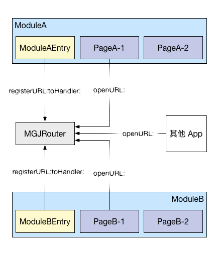
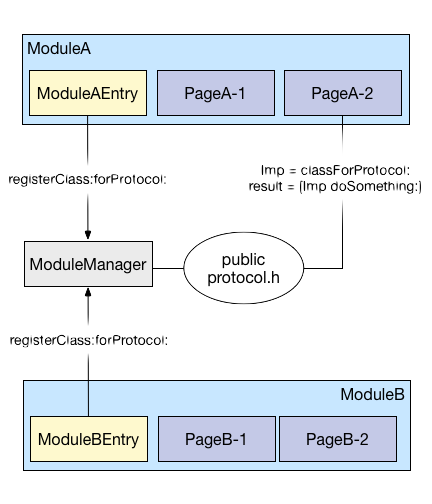
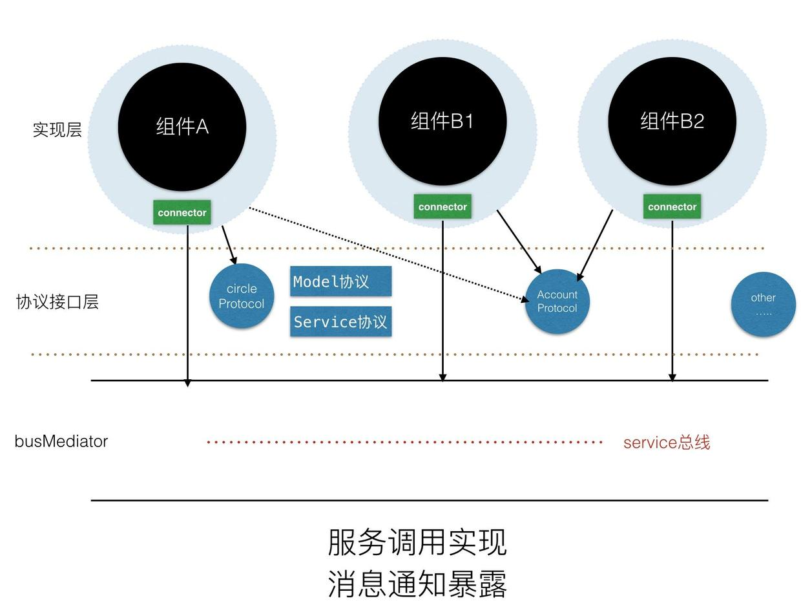
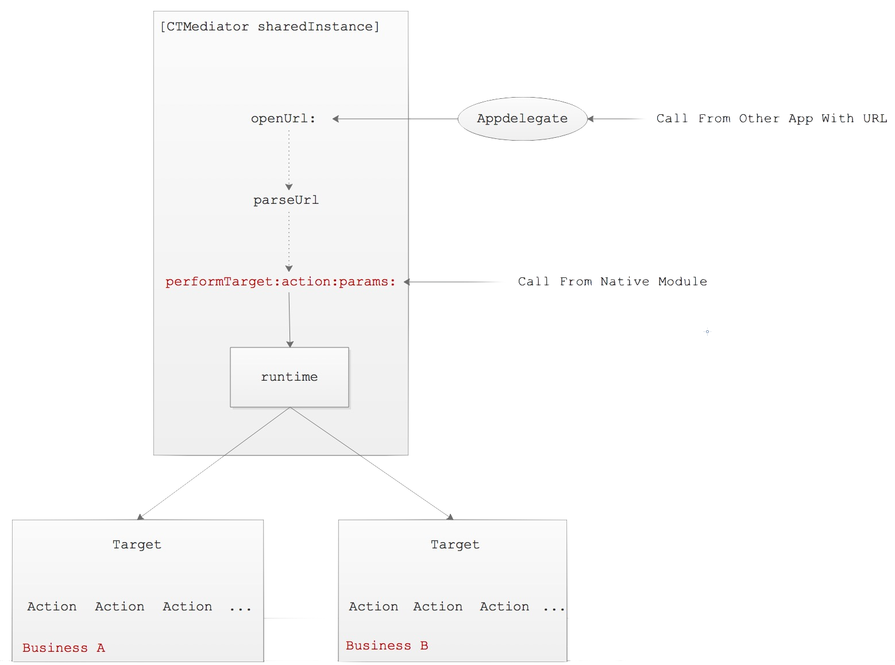

# iOS 组件化方案 
> 将一个工程分解成各个组件，然后按照某种方式任意组织成为一个拥有完整业务逻辑的工程。  

大致讨论组件化的三种方案：url-block、protocol-class（和 url-controller 类似)、target-action，以及应用这三种组件化方案的时机、步骤、利弊等。

## 一、为什么需要组件化

随着公司业务的不断发展，项目的功能越来越复杂，各个业务代码耦合越来越多，代码量急剧增加，传统的 MVC 或者 MVVM 架构已经无法高效的管理工程代码，因此需要用一种技术来更好地管理工程，而组件化是一种能够解决代码耦合的技术。项目经过组件化的拆分，不仅可以解决代码耦合的问题，还可以增强代码的复用性，工程的易管理性等。

## 二、什么时候做组件开发

* 项目管理：项目的业务线超过 2 条以上，需要独立拆分。随着业务的拆分，对应的业务组件也就很自然的独立出来。

* 人员管理：过多人对同一块代码的进行修改，产生 bug 的可能性上升，所以需要重新分配人员和其维护的功能。

* 测试维度：随着项目的业务量增大，很难做单元测试。每个小功能修改，都需要对 App 进行测试，严重增加测试工作量。

当 App 业务之间交叉耦合，bug 率难以下降，测试每天做大量重复工作。开发人员之间修改相互影响时，你需要考虑进行组件化。

组件化是项目架构层面的技术，不是所有项目都适合组件化，组件化一般针对的是大中型的项目，并且是多人开发。如果，项目比较小，开发人员比较少，确实不太适合组件化，因为这时的组件化可能带来的不是便捷，而是增加了开发的工作量。另外，组件化过程也要考虑团队的情况，总之，根据目前项目的情况作出最合适的技术选型。

## 三、组件化的过程

#### 3.1 url-block

这是蘑菇街中使用的一种页面间调用的方式，通过在启动时注册组件提供的服务，把调用组件使用的 url 和组件提供的服务 block 对应起来，保存到内存中。在使用组件的服务时，通过 url 找到对应的 block，然后获取服务。

url-block 的架构图：



注册：

```
[MGJRouter registerURLPattern:@"mgj://detail?id=:id" 
                    toHandler:^(NSDictionary * routerParameters) {
    NSNumber *id = routerParameters[@"id"];
    // create view controller with id. push view controller
}];
```

调用：

```
[MGJRouter openURL:@"mgj://detail?id=404"]
```

蘑菇街为了统一 iOS 和 Android 的平台差异性，专门用后台来管理 url，然后针对不同的平台生成不同类型的文件。

使用 url-block 的方案的确可以组件间解耦，但是还是存在其它明显的问题，比如：

1. 需要在内存中维护 url-block 的表，组件多了可能会有内存问题；
2. url 的参数传递受到限制，只能传递常规的字符串参数，无法传递非常规参数，如 UIImage、NSData 等类型；
3. 没有区分本地调用和远程调用的情况，尤其是远程调用会因为 url 参数受限，导致一些功能受限；
4. 组件本身依赖了中间件，且分散注册使的耦合较多

#### 3.2 protocol-class

针对方案 1 的问题，蘑菇街又提出了另一种组件化的方案，就是通过 protocol 定义服务接口，组件通过实现该接口来提供接口定义的服务，具体实现就是把 protocol 和 class 做一个映射，同时在内存中保存一张映射表，使用的时就通过 protocol 找到对应的 class 来获取需要的服务。

protocol-class 的架构图：



注册：

```
[ModuleManager registerClass:ClassA forProtocol:ProtocolA]
```

调用：

```
[ModuleManager classForProtocol:ProtocolA]
```

蘑菇街的这种方案确实解决了方案 1 中无法传递非常规参数的问题，使得组件间的调用更为方便，但是它依然没有解决组件依赖中间件、内存中维护映射表、组件的分散调用的问题。设计思想和方案 1 类似，都是通过给组件加了一层 wrapper，然后给使用者调用。

#### 3.3 url-controller

这是 [LDBusMediator](https://github.com/Lede-Inc/LDBusMediator.git) 的组件化方案。它是通过组件实现公共协议的接口，来对外提供服务。

具体就是通过单例来维护 url-controller 的映射关系表，根据调用者的 url，以及提供的参数（字典类型，所以参数类型不受约束）来返回对应的 controller 来提供服务；同时，为了增强组件提供服务的多样性，又通过服务协议定义了其它的服务。整体来看，LDBusMediator 解决了蘑菇街的这两种组件化方案的不足，比如：通过注册封装件 connector 而不是 block 来降低了内存占用；通过字典传递参数，解决了 url 参数的限制性。但是，由于使用了 connector 来提供服务而不是组件本身，把 connector 作为组件的一部分，依然有组件依赖中间件的问题。

LDBusMediator 的架构图：



#### 3.4 target-action

target-action 的方案是通过给组件包装一层 wrapper 来给外界提供服务，然后调用者通过依赖中间件来使用服务；其中，中间件是通过 runtime 来调用组件的服务，是真正意义上的解耦，也是该方案最核心的地方。具体实施过程是给组件封装一层 target 对象来对外提供服务，不会对原来组件造成入侵；然后，通过实现中间件的 category 来提供服务给调用者，这样使用者只需要依赖中间件，而组件则不需要依赖中间件。

target-action 的架构图：



```
- (UIViewController *)CTMediator_viewControllerForDetail
{
    return [self performTarget:kCTMediatorTargetA 
                        action:kCTMediatorActionNativFetchDetailViewController 
                        params:@{ @"key" : @"value" }
             shouldCacheTarget:NO];
}
```

但是 target-action 方案有个问题就是在中间件的 category 里有 hardcode，casa 的解释是在组件间调用时，最好是去 model 化，所以不可避免的引入了 hardcode，并且所有的 hardcode 只存在于分类中。

针对这个问题，有人提议把所有的 model 做成组件化下沉，然后让所有的组件都可以自由的访问 model。这种方案虽然解决了组件间传递 model 的依赖问题，但是为了解决这个问题，直接把整个 model 层组件化后暴露给所有组件，容易造成数据泄露，付出的代价有点大。

针对这个问题，经过和网友讨论，一致觉得组件间调用时用字典传递数据，组件内调用时用 model 传递数据，这样既减少组件间数据对 model 的耦合，又方便了组件内使用 model 传递数据的便捷性。

```
- (UIViewController *)CTMediator_viewControllerForDetail:(NSDictionary *)dict
{
    return [self performTarget:kCTMediatorTargetA                         
                        action:kCTMediatorActionNativFetchDetailViewController
                        params:dict
             shouldCacheTarget:NO];
}
```

hardCode

1. 官方解释：将可变变量用一个固定值来代替的方法。用这种方法编译后，如果以后需要更改此变量就非常困难了。

2. hard code 是指“硬编码”，即将数据直接写在代码中。也就是，在程序中直接给变量赋值。指的是在软件实现上，把输出或输入的相关参数（例如：路径、输出的形式、格式）直接硬编码在源代码中，而非在运行时期由外界指定的设置、资源、数据、或者格式做出适当回应。

3. hard code 的双重性：

3. a. 直接将数据填写在源代码中，数据发生变化时，并不利于数据的修改，会造成程序的质量降低；

3. b. 保护一些数据，直接赋值，避免其发生变化。

## 四、组件化实施的方式

组件化可以利用 git 的源代码管理工具的便利性来实施，具体就是建立一个项目工程的私有化仓库，然后把各个组件的 podspec 上传到私有仓库，在需要用到组件时，直接从仓库里面取。

1. 壳工程

	* main
	* AppDelegate
	* 工程配置
	* Debug 页面

2. 封装公共库和基础 UI 库

2. 在具体的项目开发过程中，我们常会用到三方库和自己封装的 UI 库，我们可以把这些库封装成组件，然后在项目里用 pod 进行管理。其中，针对三方库，最好再封装一层，使我们的项目部直接依赖三方库，方便后续开发过程中的更换。

3. 独立业务模块化

3. 在开发过程中，对一些独立的模块，如：登录模块、账户模块等等，也可以封装成组件，因为这些组件是项目强依赖的，调用的频次比较多。另外，在拆分组件化的过程中，拆分的粒度要合适，尽量做到组件的独立性。同时，组件化是一个渐进的过程，不可能把一个完整的工程一下子全部组件化，要分步进行，通过不停的迭代，来最终实现项目的组件化。

4. 服务接口最小化

4. 在前两步都完成的情况下，我们可以根据组件被调用的需求来抽象出组件对外的最小化接口。这时，就可以选择具体应用哪种组件化方案来实施组件化了。

4. 公共组件：

	* 埋点组件
	* Common 组件（聚合工具类）
	* 启动组件
	* 性能监控组件
	* 定位组件
	* 图片处理组件
	* UIKit 封装和扩展组件
	* 业务生命周期及通信组件
网络组件：

	* 基于 AFNetworking 进行封装，提供 JSON 转 Model、缓存功能
	* DNS 加速组件
持久化组件

第三方业务组件

基础业务组件

## reference

[iOS 组件化方案的几种实现](https://www.cnblogs.com/fishbay/p/7216084.html)
[iOS 的组件化开发](https://my.oschina.net/u/2448717/blog/2222711)

[iOS 组件化方案 - 和风细羽 - 博客园](https://www.cnblogs.com/dins/p/ios-zu-jian-hua-fang-an.html)