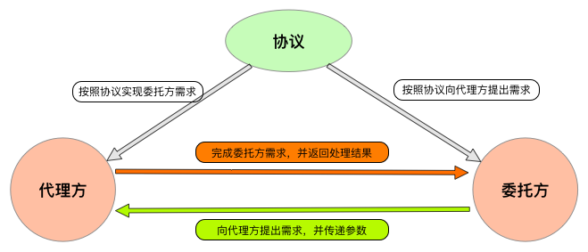
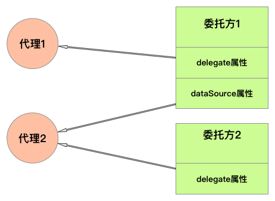
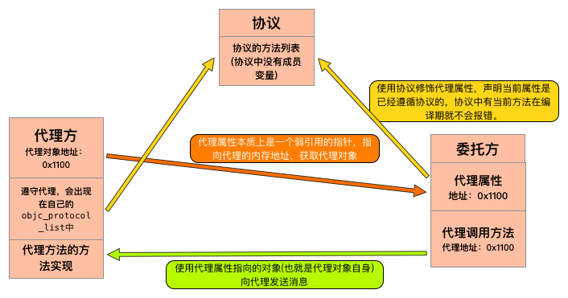
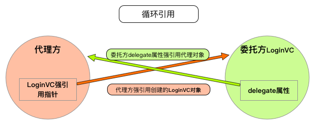
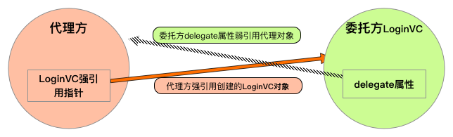
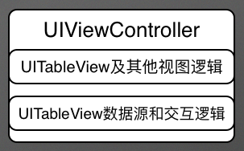
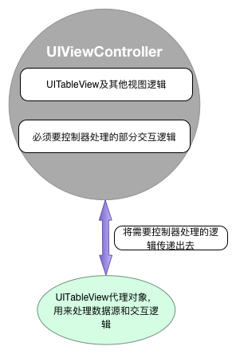
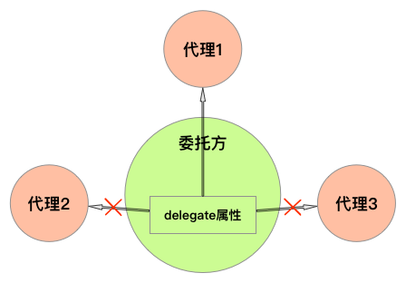

# 你真的了解iOS代理设计模式吗？

[<简书 — 刘小壮>](https://www.jianshu.com/p/2113ffe54b30)

> 在项目中我们经常会用到代理的设计模式，这是iOS中一种消息传递的方式，也可以通过这种方式来传递一些参数。  
> 这篇文章会涵盖代理的使用技巧和原理，以及代理的内存管理等方面的知识。我会通过这些方面的知识，带大家真正领略代理的奥妙。写的有点多，但都是干货，我能写下去，不知道你有没有耐心看下去。  
> 本人能力有限，如果文章中有什么问题或没有讲到的点，请帮忙指出，十分感谢！  


## iOS中消息传递方式

在iOS中有很多种消息传递方式，这里先简单介绍一下各种消息传递方式。

* 通知：在iOS中由通知中心进行消息接收和消息广播，是一种一对多的消息传递方式。
* 代理：是一种通用的设计模式，iOS中对代理支持的很好，由代理对象、委托者、协议三部分组成。
* block：iOS4.0中引入的一种回调方法，可以将回调处理代码直接写在 `block` 代码块中，看起来逻辑清晰代码整齐。
* target action：通过将对象传递到另一个类中，在另一个类中将该对象当做 `target` 的方式，来调用该对象方法，从内存角度来说和代理类似。
* KVO： `NSObject` 的 `Category` － `NSKeyValueObserving` ，通过属性监听的方式来监测某个值的变化，当值发生变化时调用 `KVO` 的回调方法。

.....当然还有其他回调方式，这里只是简单的列举。

## 代理的基本使用

代理是一种通用的设计模式，在 `iOS` 中对代理设计模式支持的很好，有特定的语法来实现代理模式， **OC** 语言可以通过 `@Protocol` 实现协议。

代理主要由三部分组成：

* 协议：用来指定代理双方可以做什么，必须做什么。
* 代理：根据指定的协议，完成委托方需要实现的功能。
* 委托：根据指定的协议，指定代理去完成什么功能。

这里用一张图来阐述一下三方之间的关系：



##### Protocol－协议的概念

从上图中我们可以看到三方之间的关系，在实际应用中通过协议来规定代理双方的行为，协议中的内容一般都是方法列表，当然也可以定义属性，我会在后续文章中顺带讲一下协议中定义属性。

协议是公共的定义，如果只是某个类使用，我们常做的就是写在某个类中。如果是多个类都是用同一个协议，建议创建一个 `Protocol` 文件，在这个文件中定义协议。遵循的协议可以被继承，例如我们常用的 `UITableView` ，由于继承自 `UIScrollView` 的缘故，所以也将 `UIScrollViewDelegate` 继承了过来，我们可以通过代理方法获取 `UITableView` 偏移量等状态参数。

协议只能定义公用的一套接口，类似于一个约束代理双方的作用。但不能提供具体的实现方法，实现方法需要代理对象去实现。协议可以继承其他协议，并且可以继承多个协议，在 `iOS` 中对象是不支持多继承的，而协议可以多继承。

```
// 当前协议继承了三个协议，这样其他三个协议中的方法列表都会被继承过来
@protocol LoginProtocol <UITableViewDataSource, UITableViewDelegate, UITextFieldDelegate>
- (void)userLoginWithUsername:(NSString *)username password:(NSString *)password;
@end
```

协议有两个修饰符 `@optional` 和 `@required` ，创建一个协议如果没有声明，默认是 `@required` 状态的。这两个修饰符只是约定代理是否强制需要遵守协议，如果 `@required` 状态的方法代理没有遵守，会报一个黄色的警告，只是起一个约束的作用，没有其他功能。

无论是 `@optional` 还是 `@required` ，在委托方调用代理方法时都需要做一个判断，判断代理是否实现当前方法，否则会导致崩溃。

示例：

```
// 判断代理对象是否实现这个方法，没有实现会导致崩溃
if ([self.delegate respondsToSelector:@selector(userLoginWithUsername:password:)]) {
    [self.delegate userLoginWithUsername:self.username.text password:self.password.text];
}
```

##### 下面我们将用一个小例子来讲解一下这个问题：

> 示例：假设我在公司正在敲代码，敲的正开心呢，突然口渴了，想喝一瓶红茶。这时我就可以拿起手机去外卖app上定一个红茶，然后外卖app就会下单给店铺并让店铺给我送过来。  

这个过程中，外卖app就是我的代理，我就是委托方，我买了一瓶红茶并付给外卖app钱，这就是购买协议。我只需要从外卖app上购买就可以，具体的操作都由外卖app去处理，我只需要最后接收这瓶红茶就可以。我付的钱就是参数，最后送过来的红茶就是处理结果。

但是我买红茶的同时，我还想吃一份必胜客披萨，我需要另外向必胜客app去订餐，上面的外卖app并没有这个功能。我又向必胜客购买了一份披萨，必胜客当做我的代理去为我做这份披萨，并最后送到我手里。这就是多个代理对象，我就是委托方。



在 `iOS` 中一个代理可以有多个委托方，而一个委托方也可以有多个代理。我指定了外卖app和必胜客两个代理，也可以再指定麦当劳等多个代理，委托方也可以为多个代理服务。

代理对象在很多情况下其实是可以复用的，可以创建多个代理对象为多个委托方服务，在下面将会通过一个小例子介绍一下控制器代理的复用。

##### 下面是一个简单的代理：

首先定义一个协议类，来定义公共协议

```
#import <Foundation/Foundation.h>
@protocol LoginProtocol <NSObject>
@optional
- (void)userLoginWithUsername:(NSString *)username password:(NSString *)password;
@end
```

定义委托类，这里简单实现了一个用户登录功能，将用户登录后的账号密码传递出去，有代理来处理具体登录细节。

```
#import <UIKit/UIKit.h>
#import "LoginProtocol.h"
/**
 *  当前类是委托类。用户登录后，让代理对象去实现登录的具体细节，委托类不需要知道其中实现的具体细节。
 */
@interface LoginViewController : UIViewController
// 通过属性来设置代理对象
@property (nonatomic, weak) id<LoginProtocol> delegate;
@end

实现部分：

@implementation LoginViewController
- (void)loginButtonClick:(UIButton *)button {
  // 判断代理对象是否实现这个方法，没有实现会导致崩溃
  if ([self.delegate respondsToSelector:@selector(userLoginWithUsername:password:)]) {
      // 调用代理对象的登录方法，代理对象去实现登录方法
      [self.delegate userLoginWithUsername:self.username.text password:self.password.text];
  }
}
```

代理方，实现具体的登录流程，委托方不需要知道实现细节。

```
// 遵守登录协议
@interface ViewController () <LoginProtocol> 
@end

@implementation ViewController
- (void)viewDidLoad {
    [super viewDidLoad];

    LoginViewController *loginVC = [[LoginViewController alloc] init];
    loginVC.delegate = self;
    [self.navigationController pushViewController:loginVC animated:YES];
}

/**
 *  代理方实现具体登录细节
 */
- (void)userLoginWithUsername:(NSString *)username password:(NSString *)password {
    NSLog(@"username : %@, password : %@", username, password);
}
```

## 代理使用原理

##### 代理实现流程

在 `iOS` 中代理的本质就是代理对象内存的传递和操作，我们在委托类设置代理对象后，实际上只是用一个 `id` 类型的指针将代理对象进行了一个弱引用。委托方让代理方执行操作，实际上是在委托类中向这个 `id` 类型指针指向的对象发送消息，而这个 `id` 类型指针指向的对象，就是代理对象。



通过上面这张图我们发现，其实委托方的代理属性本质上就是代理对象自身，设置委托代理就是代理属性指针指向代理对象，相当于代理对象只是在委托方中调用自己的方法，如果方法没有实现就会导致崩溃。从崩溃的信息上来看，就可以看出来是代理方没有实现协议中的方法导致的崩溃。

而协议只是一种语法，是声明委托方中的代理属性可以调用协议中声明的方法，而协议中方法的实现还是有代理方完成，而协议方和委托方都不知道代理方有没有完成，也不需要知道怎么完成。

##### 代理内存管理

**为什么我们设置代理属性都使用weak呢？**

我们定义的指针默认都是 `__strong` 类型的，而属性本质上也是一个成员变量和 `set`、`get` 方法构成的， `strong` 类型的指针会造成强引用，必定会影响一个对象的生命周期，这也就会形成循环引用。



上图中，由于代理对象使用强引用指针，引用创建的委托方 `LoginVC` 对象，并且成为 `LoginVC` 的代理。这就会导致 `LoginVC` 的 `delegate` 属性强引用代理对象，导致循环引用的问题，最终两个对象都无法正常释放。



我们将 `LoginVC` 对象的 `delegate` 属性，设置为弱引用属性。这样在代理对象生命周期存在时，可以正常为我们工作，如果代理对象被释放，委托方和代理对象都不会因为内存释放导致的 **Crash** 。

##### 但是，这样还有点问题，真的不会崩溃吗？

下面两种方式都是弱引用代理对象，但是第一种在代理对象被释放后不会导致崩溃，而第二种会导致崩溃。

```
@property (nonatomic, weak) id<LoginProtocol> delegate;
@property (nonatomic, assign) id<LoginProtocol> delegate;
```

`weak` 和 `assign` 是一种“非拥有关系”的指针，通过这两种修饰符修饰的指针变量，都不会改变被引用对象的引用计数。但是在一个对象被释放后， `weak` 会自动将指针指向 `nil` ，而 `assign` 则不会。在 `iOS` 中，向 `nil` 发送消息时不会导致崩溃的，所以 `assign` 就会导致野指针的错误 `unrecognized selector sent to instance` 。

所以我们如果修饰代理属性，还是用 `weak` 修饰吧，比较安全。

## 控制器瘦身－代理对象

##### 为什么要使用代理对象？

随着项目越来越复杂，控制器也随着业务的增加而变得越来越臃肿。对于这种情况，很多人都想到了最近比较火的 **MVVM** 设计模式。但是这种模式学习曲线很大不好掌握，对于新项目来说可以使用，对于一个已经很复杂的大中型项目，就不太好动框架这层的东西了。

在项目中用到比较多的控件应该就有 `UITableView` 了，有的页面往往 `UITableView` 的处理逻辑很多，这就是导致控制器臃肿的一个很大的原因。对于这种问题，我们可以考虑给控制器瘦身，通过代理对象的方式给控制器瘦身。

##### 什么是代理对象

这是平常控制器使用 `UITableView` (图画的难看，主要是意思理解就行)



这是我们优化之后的控制器构成



从上面两张图可以看出，我们将 `UITableView` 的 `delegate` 和 `DataSource` 单独拿出来，由一个代理对象类进行控制，只将必须控制器处理的逻辑传递给控制器处理。

`UITableView` 的数据处理、展示逻辑和简单的逻辑交互都由代理对象去处理，和控制器相关的逻辑处理传递出来，交由控制器来处理，这样控制器的工作少了很多，而且耦合度也大大降低了。这样一来，我们只需要将需要处理的工作交由代理对象处理，并传入一些参数即可。

##### 下面我们用一段代码来实现一个简单的代理对象

代理对象.h文件的声明

```
#import <Foundation/Foundation.h>
#import <UIKit/UIKit.h>

typedef void (^selectCell) (NSIndexPath *indexPath);
//  代理对象(UITableView的协议需要声明在.h文件中，不然外界在使用的时候会报黄色警告，看起来不太舒服)
@interface TableViewDelegateObj : NSObject <UITableViewDelegate, UITableViewDataSource>

/**
 *  创建代理对象实例，并将数据列表传进去
 *  代理对象将消息传递出去，是通过block的方式向外传递消息的
 *  @return 返回实例对象
 */
+ (instancetype)createTableViewDelegateWithDataList:(NSArray *)dataList
                                        selectBlock:(selectCell)selectBlock;
@end
```

代理对象.m文件中的实现
＃import "TableViewDelegateObj.h"

```
@interface TableViewDelegateObj () 
@property (nonatomic, strong) NSArray   *dataList;
@property (nonatomic, copy)   selectCell selectBlock;
@end

@implementation TableViewDelegateObj
+ (instancetype)createTableViewDelegateWithDataList:(NSArray *)dataList
                                        selectBlock:(selectCell)selectBlock {
    return [[[self class] alloc] initTableViewDelegateWithDataList:dataList
                                                       selectBlock:selectBlock];
}

- (instancetype)initTableViewDelegateWithDataList:(NSArray *)dataList selectBlock:(selectCell)selectBlock {
    self = [super init];
    if (self) {
        self.dataList = dataList;
        self.selectBlock = selectBlock;
    }
    return self;
}

- (UITableViewCell *)tableView:(UITableView *)tableView cellForRowAtIndexPath:(NSIndexPath *)indexPath {
    static NSString *identifier = @"cell";
    UITableViewCell *cell = [tableView dequeueReusableCellWithIdentifier:identifier];
    if (!cell) {
        cell = [[UITableViewCell alloc] initWithStyle:UITableViewCellStyleDefault reuseIdentifier:identifier];
    }
    cell.textLabel.text = self.dataList[indexPath.row];
    return cell;
}

- (NSInteger)tableView:(UITableView *)tableView numberOfRowsInSection:(NSInteger)section {
    return self.dataList.count;
}

- (void)tableView:(UITableView *)tableView didSelectRowAtIndexPath:(NSIndexPath *)indexPath {
    [tableView deselectRowAtIndexPath:indexPath animated:NO];
    // 将点击事件通过block的方式传递出去
    self.selectBlock(indexPath);
}
@end
```

外界控制器的调用非常简单，几行代码就搞定了。

```
self.tableDelegate = [TableViewDelegateObj createTableViewDelegateWithDataList:self.dataList 
                                                                   selectBlock:^(NSIndexPath *indexPath) {
    NSLog(@"点击了%ld行cell", (long)indexPath.row);
}];
self.tableView.delegate = self.tableDelegate;
self.tableView.dataSource = self.tableDelegate;
```

在控制器中只需要创建一个代理对象类，并将 `UITableView` 的 `delegate` 和 `dataSource` 都交给代理对象去处理，让代理对象成为 `UITableView` 的代理，解决了控制器臃肿以及和 `UITableView` 的解藕。

上面的代码只是简单的实现了点击 `cell` 的功能，如果有其他需求大多也都可以在代理对象中进行处理。使用代理对象类还有一个好处，就是如果多个 `UITableView` 逻辑一样或类似，代理对象是可以复用的。

## 非正式协议

##### 简介

在 `iOS2.0` 之前还没有引入 `@Protocol` 正式协议之前，实现协议的功能主要是通过给 `NSObject` 添加 `Category` 的方式。这种通过 `Category` 的方式，相对于 `iOS2.0` 之后引入的 `@Protocol` ，就叫做非正式协议。

正如上面所说的，非正式协议一般都是以 `NSObject` 的 `Category` 的方式存在的。由于是对 `NSObject` 进行的 `Category` ，所以所有基于 `NSObject` 的子类，都接受了所定义的非正式协议。对于 `@Protocol` 来说编译器会在编译期检查语法错误，而非正式协议则不会检查是否实现。

非正式协议中没有 `@Protocol` 的 `@optional` 和 `@required` 之分，和 `@Protocol` 一样在调用的时候，需要进行判断方法是否实现。

```
// 由于是使用的Category，所以需要用self来判断方法是否实现
if ([self respondsToSelector:@selector(userLoginWithUsername:password:)]) {
    [self userLoginWithUsername:self.username.text password:self.password.text];
}
```

##### 非正式协议示例

在 `iOS` 早期也使用了大量非正式协议，例如 `CALayerDelegate` 就是非正式协议的一种实现，非正式协议本质上就是 `Category` 。

```
@interface NSObject (CALayerDelegate)
- (void)displayLayer:(CALayer *)layer;
- (void)drawLayer:(CALayer *)layer inContext:(CGContextRef)ctx;
- (void)layoutSublayersOfLayer:(CALayer *)layer;
- (nullable id<CAAction>)actionForLayer:(CALayer *)layer forKey:(NSString *)event;
@end
```

## 代理和block的选择

在 `iOS` 中的回调方法有很多，而代理和 `block` 功能更加相似，都是直接进行回调，那我们应该用哪个呢，或者说哪个更好呢？

其实这两种消息传递的方式，没有哪个更好、哪个不好直说....我们应该区分的是在什么情况下应该用什么，用什么更合适！下面我将会简单的介绍一下在不同情况下代理和 `block` 的选择：

* 多个消息传递，应该使用 `delegate` 。
* 在有多个消息传递时，用 `delegate` 实现更合适，看起来也更清晰。 `block` 就不太好了，这个时候 `block` 反而不便于维护，而且看起来非常臃肿，很别扭。
* 例如 `UIKit` 的 `UITableView` 中有很多代理如果都换成 `block` 实现，我们脑海里想一下这个场景，这里就不用代码写例子了.....那简直看起来不能忍受。

* 一个委托对象的代理属性只能有一个代理对象，如果想要委托对象回调多个代理对象应该用 `block` 。(这里主要是针对于对象内部属性不会对 `block` 进行引用的情况下，否则再调用同一个方法也会造成重新赋值问题)



上面图中代理1可以被设置，代理2和代理3设置的时候被划了叉，是因为这个步骤是错误的操作。我们上面说过， `delegate` 只是一个保存某个代理对象的地址，如果设置多个代理相当于重新赋值，只有最后一个设置的代理才会被真正赋值。

这里的 `block` 不是应用于声明在 `.h` 文件中属性回调的，主要是应用于方法回调的。例如现在有如下情况需要回调，用 `block` 可以但是用设置 `delegate` 的方式就不行了：“假设有 `block` 回调对象 `downloadImage` 类，同一个 `downloadImage` 对象带有 `block` 回调的方法，在多个类或多个地方进行回调，这种情况就更佳适合用 `block` 的方式了。“每调用一次方法就可以在 `block` 回调代码块中，进行自己的操作，比代理的方式更佳强大。

* 单例对象最好不要用 `delegate` 。
* 单例对象由于始终都只是同一个对象，如果使用 `delegate` ，就会造成我们上面说的 `delegate` 属性被重新赋值的问题，最终只能有一个对象可以正常响应代理方法。

这种情况我们可以使用 `block` 的方式，在主线程的多个对象中使用 `block` 都是没问题的，下面我们将用一个循环暴力测试一下 `block` 到底有没有问题。

```
NSOperationQueue *queue = [[NSOperationQueue alloc] init];
queue.maxConcurrentOperationCount = 10;
for (int i = 0; i < 100; i++) {
    [queue addOperationWithBlock:^{
        [[LoginViewController shareInstance] userLoginWithSuccess:^(NSString *username) {
            NSLog(@"TestTableViewController : %d", i);
        }];
    }];
}
```

上面用 `NSOperationQueue` 创建了一个新的队列，并且将最大并发数设置为10，然后创建一个100次的循环。我们在多线程情况下测试单例在block的情况下能否正常使用，答案是可以的。
但是我们还是需要注意一点，在多线程情况下因为是单例对象，我们对 `block` 中必要的地方加锁，防止资源抢夺的问题发生。

* 代理是可选的，而block在方法调用的时候只能通过将某个参数传递一个 `nil` 进去，只不过这并不是什么大问题，没有代码洁癖的可以忽略。

```
[self downloadTaskWithResumeData:resumeData
                  sessionManager:manager
                        savePath:savePath
                   progressBlock:nil
                    successBlock:successBlock
                    failureBlock:failureBlock];
```

* 代理更加面相过程，block则更面向结果。
* 从设计模式的角度来说，代理更佳面向过程，而 `block` 更佳面向结果。例如我们使用 `NSXMLParserDelegate` 代理进行XML解析， `NSXMLParserDelegate` 中有很多代理方法， `NSXMLParser` 会不间断调用这些方法将一些转换的参数传递出来，这就是 `NSXMLParser` 解析流程，这些通过代理来展现比较合适。而例如一个网络请求回来，就通过 `success`、`failure` 代码块来展示就比较好。

* 从性能上来说， `block` 的性能消耗要略大于 `delegate` ，因为 `block` 会涉及到栈区向堆区拷贝等操作，时间和空间上的消耗都大于代理。而代理只是定义了一个方法列表，在遵守协议对象的 `objc_protocol_list` 中添加一个节点，在运行时向遵守协议的对象发送消息即可。
* 这篇文章并不是讲 `block` 的，所以不对此做过多叙述。唐巧有一篇文章介绍过 `block` ，非常推荐这篇文章去深入学习 `block` 。 [文章地址](https://links.jianshu.com/go?to=http%3A%2F%2Fblog.devtang.com%2F2013%2F07%2F28%2Fa-look-inside-blocks%2F)

文章中举了代理对象的例子，可以通过创建代理对象将代码封装到一个类中，我对这个代理对象的例子写了一个简单的 `Demo` 。

`Demo` 只是来辅助读者更好的理解文章中的内容， **应该博客结合`Demo` 一起学习，只看 `Demo` 还是不能理解更深层的原理** 。 `Demo` 中代码都会有注释，各位可以打断点跟着 `Demo` 执行流程走一遍，看看各个阶段变量的值。

**Demo地址** ： [刘小壮的Github](https://links.jianshu.com/go?to=https%3A%2F%2Fgithub.com%2FDeveloperErenLiu%2FBlogDemo-Delegate)

[你真的了解iOS代理设计模式吗？](https://www.jianshu.com/p/2113ffe54b30)