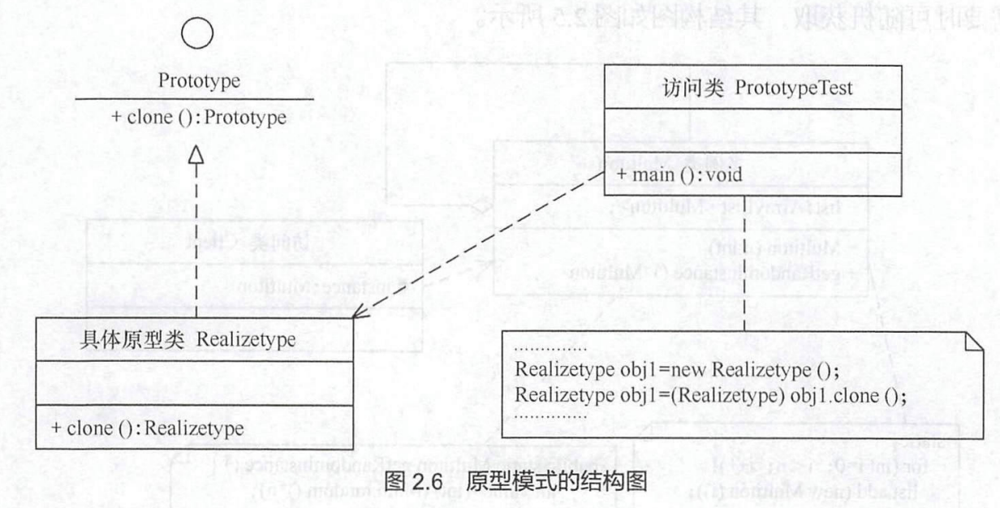

- [1. 设计模式基础](#1-设计模式基础)
  - [1.1 软件设计模式的概念](#11-软件设计模式的概念)
  - [1.2 学习设计模式的意义](#12-学习设计模式的意义)
  - [1.3 23种设计模式简介](#13-23种设计模式简介)
    - [1.3.1 根据目的来分](#131-根据目的来分)
    - [1.3.2. 根据作用范围来分](#132-根据作用范围来分)
    - [1.3.3 GoF的23种设计模式的功能](#133-gof的23种设计模式的功能)
  - [1.2 UML 中的类图](#12-uml-中的类图)
  - [1.3 面向对象的设计原则](#13-面向对象的设计原则)
    - [1.3.1 开闭原则](#131-开闭原则)
    - [1.3.2 里氏蔷躁原则](#132-里氏蔷躁原则)
    - [1.3.3 依赖倒置原则](#133-依赖倒置原则)
    - [1.3.4 单一职责原则](#134-单一职责原则)
    - [1.3.5 口隔离原则](#135-口隔离原则)
    - [1.3.6 迪米特法则](#136-迪米特法则)
    - [1.3.7 合成复用原则](#137-合成复用原则)
    - [1.3.8 种设计原则的要点](#138-种设计原则的要点)
- [第二章 创建型模式（上）](#第二章-创建型模式上)
  - [2.1 创建型模式概述](#21-创建型模式概述)
  - [2.2 单例模式](#22-单例模式)
    - [2.2.1 攘式的定义与特点](#221-攘式的定义与特点)
    - [2.2.4 模式的应用场景](#224-模式的应用场景)
  - [2.3 原型模式](#23-原型模式)
    - [2.3.1 模式的定义与特点](#231-模式的定义与特点)
    - [2.3.2 模式的结构与实现](#232-模式的结构与实现)
    - [2.3.4 模式的应用场景](#234-模式的应用场景)
    - [2.3.5 模式的扩展](#235-模式的扩展)
- [第3章 创建型模式（下）](#第3章-创建型模式下)
  - [3.1 工厂方法模式](#31-工厂方法模式)
    - [3.1.1 模式的定义与特点](#311-模式的定义与特点)
    - [3.1.2 模式的结构与实现](#312-模式的结构与实现)
    - [3.1.4 模式的应用场景](#314-模式的应用场景)
  - [3.2 抽象工厂模式](#32-抽象工厂模式)
    - [3.2.1 模式的定义与特点](#321-模式的定义与特点)
    - [3.2.2 模式的结构与实现](#322-模式的结构与实现)
    - [3.2.4 模式的应用场景](#324-模式的应用场景)
  - [3.3 建造者模式](#33-建造者模式)
    - [3.3.1 模式的定义与特点](#331-模式的定义与特点)
    - [3.3.2 模式的结构与实现](#332-模式的结构与实现)
- [第4章 结构型模式（上）](#第4章-结构型模式上)
  - [4.1 结构型模式概述](#41-结构型模式概述)
  - [4.2 代理模式](#42-代理模式)
    - [4.2.1 模式的定义与特点](#421-模式的定义与特点)
    - [4.2.2 模式的结构与实现](#422-模式的结构与实现)
    - [4.2.4 模式的应用场景](#424-模式的应用场景)
  - [4.3 适配器模式](#43-适配器模式)
    - [4.3.1 模式的定义与特点](#431-模式的定义与特点)
    - [4.3.2 模式的结构与实现](#432-模式的结构与实现)
    - [4.3.4 模式的应用场景](#434-模式的应用场景)
  - [4.4 桥接模式](#44-桥接模式)
    - [4.4.1 模式的定义与特点](#441-模式的定义与特点)
    - [4.4.2 模式的结构与实现](#442-模式的结构与实现)
## 1. 设计模式基础

### 1.1 软件设计模式的概念

软件设计模式（Soware Design Pattern）， 又称设计模式，是一套被反复使用、多数人知晓的、经过分类编目的、代码设计经验的总结。它描述了在软件设计过程中的一些不断重复发生的问题，以及该问题的解决方案。也就是说，它是解决特定问题的一系列套路，是前辈们的代码设计经验的总结，具有一定的普遍性，可以反复使用。其目的是为了提高代码的可重用性、代码的可读性和代码的可靠性。

### 1.2 学习设计模式的意义

设计模式的本质是面向对象设计原则的实际运用，是对类的封装性、继承性和多态性以及类的关联关系和组合关系的充分理解正确使用设计模式具有以下优点:

1. 可以提高程序员的思维能力、编程能力和设计能力。
2. 使程序设计更加标准化、代码编制更加工程化，使软件开发效率大大提高从而缩短软件的开发周期。
3. 使设计的代码可重用性高、可读性强、可靠性高、灵活性好、可维护性强。

### 1.3 23种设计模式简介

设计模式有两种分类方法，即根据模式的目的来分和根据模式的作用的范围来分。

#### 1.3.1 根据目的来分

根据模式是用来完成什么工作来划分，这种方式可分为**创建型模式**、**结构型模式**和**行为型模**。

**（1）创建型模式：** 用于描述“怎样创建对象”，它的主要特点是“将对象的创建与使用分离。GoF中提供了单例、原型、工厂方法、抽象工厂、建造者等5种创建型模式。

**（2）结构型模式：** 用于描述如何将类或对象按某种布局组成更大的结构， GoF 中提供了代理、适配器、桥接、装饰、外观、享元、组合等7种结构型模式。

**（3）行为型模式：** 用于描述类或对象之间怎样相互协作共同完成单个对象都无法单独完成的任务，以及怎样分配职责。GoF 中提供了模板方法、策略、命令、职责链、状态、观察者、中介者、迭代器、访问者、备忘录、解释器等11种行为型模式。

#### 1.3.2. 根据作用范围来分

根据模式是主要用于类上还是主要用于对象上来分，这种方式可分为类模式和对象模式两种。

**（1）类模式：** 用于处理类与子类之间的关系 ，这些关系通过继承来建立，是静态的，在编译时刻便确定下来了。 GoF 中的工厂方法、（类）适配器、模板方法、解释器属于该模式。

**（2）对象模式：** 用于处理对象之间的关系 ，这些关系可以通过组合或聚合来实现，在运行时刻是可以变化的，更具动态性。 GoF 中除了以上4种，其他的都是对象模式。

#### 1.3.3 GoF的23种设计模式的功能

**（1）单例（Singleton）模式：** 某个类只能生成一个实例，该类提供了一个全局访问点供外部获取该实例，其拓展是有限多例模式。
**（2）原型（Prototype）模式：** 将一个对象作为原型，通过对其进行复制而克隆出多个和原型类似
的新实例。
**（3）工厂方法（Factory Method）模式：** 定义一个用于创建产品的接口，由子类决定生产什么产品。
**（4）抽象工厂（Abstract Factory）模式：** 提供一个创建产品族的接口，其每个子类可以生产一系列相关的产品。
**（5）建造者（Builder）模式：** 将一个复杂对象分解成多个相对简单的部分，然后根据不同需要分别创建它们，最后构建成该复杂对象。
**（6）代理（Proxy）模式：** 为某对象提供一种代理以控制对该对象的访问。即客户端通过代理间接地访问该对象，从而限制、增强或修改该对象的一些特性。
**（7）适配器（Adapter）模式：** 将一个类的接口转换成客户希望的另外一个接口，使得原本由于接口不兼容而不能一起工作的那些类能一起工作。
**（8）桥接（Bridge）模式：** 将抽象与实现分离 ，使它们可以独立变化。它是用组合关系代替继承关系来实现，从而降低了抽象和实现这两个可变维度的相合度。
**（9）装饰（Decorator）模式：** 动态的给对象增加一些职责，即增加其额外的功能。
**（10）外观（Facade）模式：** 为多个复杂的子系统提供一个一致的接口，使这些子系统更加容易被访问。
**（11）享元（Flyweight）模式：** 运用共享技术来有效地支持大量细粒度对象的复用。
**（12）组合（Composite）模式：** 将对象组合成树状层次结构，使用户对单个对象和组合对象具有一致的访问性。
**（13）模板方法（Templat Method）模式：** 定义一个操作中的算法骨架，而将算法的一些步骤延迟到子类中，使得子类可以不改变该算法结构的情况下重定义该算法的某些特定步骤。
**（14）策略（Strategy）模式：** 定义了一系列算法，并将每个算法封装起来，使它们可以相互替换，且算法的改变不会影响使用算法的客户。
**（15）命令（Command）模式：** 将一个请求封装为一个对象，使发出请求的责任和执行请求的责任分割开。
**（16）职责链（Chain of Responsibility）模式：** 把请求从链中的一个对象传到下一个对象，直到请求被响应为止。通过这种方式去除对象之间的精合。
**（17）状态（State）模式：** 允许一个对象在其内部状态发生改变时改变其行为能力。
**（18）观察者（Observer）模式：** 多个对象间存在－对多关系，当一个对象发生改变时，把这种改变通知给其他多个对象，从而影响其他对象的行为。
**（19）中介者（Mediator）模式：** 定义一个中介对象来简化原有对象之间的交互关系，降低系统中对象间的相合度，使原有对象之间不必相互了解。
**（20）迭代器（Iterator）模式：** 提供一种方法来顺序访问聚合对象中的一系列数据，而不暴露聚合对象的内部表示。
**（21）访问者（Visitor）模式：** 在不改变集合元素的前提下，为一个集合中的每个元素提供多种访问方式，即每个元素有多个访问者对象访问。
**（22）备忘录（Memento）模式：** 在不破坏封装性的前提下，获取并保存一个对象的内部状态，以便以后恢复它。
**（23）解释器（Interpreter）模式：** 提供如 定义语言的文法，以及对语言句子的解释方法，即解
释器。

必须指出，这23种设计模式不是孤立存在的，很多模式之间存在一定的关联关系，在大的系统开发中常常同时使用多种设计模式，希望读者认真学好它们。

### 1.2 UML 中的类图

### 1.3 面向对象的设计原则

#### 1.3.1 开闭原则

**1.开闭原则的定义**

开闭原则（ Open Closed Principle, OCP）由勃兰特·梅耶（ Bertrand Meyer ）提出，他在1988年的著作《面向对象软件构造》（ Object Oriented Sofeware Construction ）中提出：**软件实体应当对扩展开放，对修改关闭（ Sofeware entities should be open for extension,but closed for modification ）**， 这就是开闭原则的经典定义。

这里的软件实体包括以下几个部分 ①项目中划分出的模块 ②类与接口 ③方法。开闭原则的含义是：**当应用的需求改变时，在不修改软件实体的源代码或者二进制代码的前提下，可以扩展模块的功能，使其满足新的需求。**

**2.开闭原则的作用**

开闭原则是面向对象程序设计的终极目标，它使软件实体拥有一定的适应性和灵活性的同时具备稳定性和延续性。

**3.开闭原则的实现方法**

可以通过“抽象约束、封装变化”来实现开闭原则，即通过接口或者抽象类为软件实体定义一个相对稳定的抽象层，而将相同的可变因素封装在相同的具体实现类中。因为抽象灵活性好，适应性广，只要抽象的合理，可以基本保持软件架构的稳定。而软件中易变的细节可以从抽象派生来的实现类来进行扩展，当软件需要发生变化时，只需要根据需求重新派生一个实现类来扩展就可以了。


#### 1.3.2 里氏蔷躁原则

**1. 里氏替换原则的定义**

里氏替换原则（ Liskov Substitution Principle, LSP ）由麻省理工学院计算机科学实验室的里斯科夫（ Liskov ) 女士在 1987 年的“面向对象技术的高峰会议”（ OOPSLA ）上发表的一篇文章《数据抽象和层次》（ Data Abs action and Hierarchy ）里提出来的，她提出：继承必须确保超类所拥有的性质在子类中仍然成立 （ Inheritance should ensure that any property proved about supe pe objects also holds 
for subtype objects ）。

里氏替换原则主要阐述了有关继承的一些原则，也就是什么时候应该使用继承，什么时候不应该使用继承，以及其中蕴含的原理。里氏替换原是继承复用的基础，它反映了基类与子类之间的关系，是对开闭原则的补充，是对实现抽象化的具体步骤的规范。

**2. 里氏替换原则的作用**

(1) 里氏替换原则是实现开闭原则的重要方式之一。
(2) 它克服了继承中重写父类造成的可复用性变差的缺点。
(3) 它是动作正确性的保证。即类的扩展不会给已有的系统引入新的错误，降低了代码出错的可能性。

**3. 里氏替换原则的实现方法**

里氏替换原则通俗来讲就是：**子类可以扩展父类的功能，但不能改变父类原有的功能**。也就是说：子类继承父类时，除添加新的方法完成新增功能外，尽量不要重写父类的方法。如果通过重写父类的方法来完成新的功能，这样写起来虽然简单，但是整个继承体系的可复用性会比较差，特别是运用多态比较频繁时，程序运行出锚的概率会非常大。

如果程序违背了里氏替换原则，则继承类的对象在基类出现的地方会出现运行错误。这时其修正方法是：取消原来的继承关系，重新设计它们之间的关系。

关于里氏替换原则的例子，最有名的是“正方形不是长方形”。

#### 1.3.3 依赖倒置原则

**1. 依赖倒置原则的定义**

依赖倒置原则（ Dependence Inversion Principle , DIP ）是 Object Mentor 公司总裁罗伯特·马丁( Robert C. Martin ）于 1996 年在 C++ Report 上发表的文章。其原始定义是：**高层模块不应该依赖低层模块，两者都应该依赖其抽象；抽象不应该依赖细节，细节应该依赖抽象**（ High level modules should not depend upon low level modules. Both should depend upon abstractions. Abstractions should not depend upon details. Details should depend upon abstractions ）。其核心思想是：**要面向接口编程，不要面向实现编程**。

依赖倒置原则是实现开闭原则的重要途径之一，它降低了客户与实现模块之间的稠合。

**2. 依赖倒置原则的作用**

(1) 依赖倒置原则可以降低类间的精合性。
(2) 依赖倒置原则可以提高系统的稳定性
(3) 依赖倒置原则可以减少并行开发引起的风险。
(4) 依赖倒置原则可以提高代码的可读性和可维护性。

**3. 依赖倒置原则的实现方法**

依赖倒置原则的目的是通过要面向接口的编程来降低类间的精合性，所以我们在实际编程中只要遵循以下4点，就能在项目中满足这个规则。
(1) 每个类尽量提供接口或抽象类，或者两者都具备
(2) 变量的声明类型尽量是接口或者是抽象类。
(3）任何类都不应该从具体类派生。
(4）使用继承时尽量遵循里氏替换原则。

#### 1.3.4 单一职责原则

**1. 单一职责原则的定义**

单一职责原则（ Single Responsibility Principle, SRP）又称单一功能原则，由罗伯特·C.马丁（ Robert C. Martin ）于《敏捷软件开发：原则、模式和实践》一书中提出的。这里的职责是指类变化的原因，单一职责原则规定一个类应该有且仅有一个引起它变化的原因，否则类应该被拆分（ There should 
never be more than one reason for a class to change）。

该原则提出对象不应该承担太多职责，如果一个对象承担了太多的职责，至少存在以下两个缺点：①一个职责的变化可能会削弱或者抑制这个类实现其他职责的能力；②当客户端需要该对象的某一个职责时，不得不将其他不需要的职责全都包含进来，从而造成冗余代码或代码的浪费。

**2. 单一职责原则的优点**
单一职责原则的核心就是控制类的粒度大小、将对象解耦、提高其内聚性。如果遵循单一职责原则将有以下优点。
(1) 降低类的复杂度。一个类只负责一项职责，其逻辑肯定要比负责多项职责简单得多。
(2) 提高类的可读性。复杂性降低，自然其可读性会提高。
(3) 提高系统的可维护性。可读性提高，那自然更容易维护了。
(4) 变更引起的风险降低。变更是必然的，如果单一职责原则遵守得好，当修改一个功能时，可以显著降低对其他功能的影响。

**3. 单一职责原则的实现现方**

单一职责原则是最简单但又最难运用的原则，需要设计人员发现类的不同职责并将其分离，封装到不同的类或模块 。而发现类的多重职责需要设计人员具有较强的分析设计能力和相关重构经验。

#### 1.3.5 口隔离原则

**1. 接口隔离原则的定义**

接口隔离原则（ Interface Segregation Principle , ISP ）要求程序员尽量将臃肿庞大的接口拆分成更小的和更具体的接口，让接口只包含客户感兴趣的方法。 2002 年罗伯特·c. 马丁给“接口隔离原
则”的定义是：**客户端不应该被迫依赖于它不使用的方法**（ Clients should not be forced to depend on methods they do not use ）。该原则还有另外一个定义：**一个类对另一个类的依赖应该建立在最小的接口上**（ The dependency of one class to another one should depend on the smallest possible interface ）。

接口隔离原则和单一职责都是为了提高类的内聚性、降低它们之间的耦合性，体现了封装的思想，但两者是不同的是：①单一职责原则注重的是职责，而接口隔离原则注重的是对接口依赖的隔离；②单一职责原则主要是约束类，它针对的是程序中的实现和细节；接口隔离原则主要约束接口，要针对抽象和程序整体框架的构建。

**2. 接口隔离原则的优点**

接口隔离原则是为了约束接口、降低类对接口的依赖性，遵循接口隔离原则有以下5个优点。
(1) 将臃肿庞大的接口分解为多个粒度小的接口，可以预防外来变更的扩散，提高系统的灵活性和可维护性。
(2) 接口隔离提高了系统的内聚性，减少了对外交互，降低了系统的藕合性。
(3) 如果接口的粒度大小定义合理,能够保证系统的稳定性；但是，如果定义过小，则会造成接口数量过多，使设计复杂化；如果定义太大，灵活性降低，无法提供定制服务，给整体项目带来无法预料的风险。
(4) 使用多个专门的接口还能够体现对象的层次，因为可以通过接口的继承，实现对总接口的定义。
(5）能减少项目工程中的代码冗余。过大的大接口里面通常放置许多不用的方法，当实现这个接口的时候，被迫设计冗余的代码。

**3. 接口隔离原则的实现方法**

在具体应用接口隔离原则时，应该根据以下几个规则来衡量。
(1) 接口尽量小，但是要有限度。一个接口只服务于一个子模块或业务逻辑。
(2）为依赖接口的类定制服务。只提供调用者需要的方法，屏蔽不需要的方法。
(3）了解环境，拒绝盲从。每个项目或产品都有选定的环境因素，环境不同，接口拆分的标准就不同，深入了解业务逻辑。
(4）提高内聚，减少对外交互。使接口用最少的方法去完成最多的事情。

#### 1.3.6 迪米特法则

**1. 迪米特法则的定义**

迪米特法则（ Law of Demeter， LoD ）又叫作最少知识原则 （ Least Knowledge Principle, LKP ) , 产生于 1987 年美国东北大学（ North astern University ）的一个名为迪米特（Demeter ）的研究项目，由伊恩·荷兰（ Ian Holland ）提出，被 UML 创始者之一的布奇（ Booch ）普及，后来又因为在经典著作《程序员修炼之道》（ The Pragmatic Programmer ）提及而广为人知。

**2. 迪米特法则的优点**

迪米特法则要求限制软件实体之间通信的宽度和深度，正确使用迪米特法则将有以下两个点。
(1）降低了类之间的耦合度，提高了模块的相对独立性
(2) 由于耦合度降低，从而提高了类的可复用率和系统的扩展性。

但是，过度使用迪米特法则会使系统产生大量的中介类，从而增加系统的复杂性，使模块之间的通信效率降低。所以，在采用迪米特法则时需要反复权衡，确保高内聚和低相合的同时，保证系统的结构清晰。

**3. 迪米特法则的实现方法**

从迪米特法则的定义和特点可知，它强调以下两点：
- 从依赖者的角度来说，只依赖应该依赖的对象
- 从被依赖者的角度说，只暴露应该暴露的方法
所以，在运用迪米特法则时要注意以下6点。
(1）在类的划分上，应该创建弱稠合的类。类与类之间的相合越弱，就越有利于实现可复用的目标。
(2）在类的结构设计上，尽量降低类成员的访问权限。
(3）在类的设计上，优先考虑将一个类设置成不变类。
(4）在对其他类的引用上，将引用其他对象的次数降到最低。
(5）不暴露类的属性成员，而应该提供相应的访问器（ set和get方法）。
(6）谨慎使用序列化（ Serializable ）功能。

#### 1.3.7 合成复用原则

**1. 合成复用原则的定义**

合成复用原则（ Compos Reuse Principle , CRP ）又叫组合／聚合复用原则（ omposition/Aggregate Reuse P1inciple, CARP)。**它要求在软件复用时，要尽量先使用组合或者聚合等关联关系来实现，其次才考虑使用继承关系来实现**。如果要使用继承关系，则必须严格遵循里氏代换原则。合成复用原则同里氏代换原则相辅相成的，两者都是开闭原则的具体实现规范。

**2. 合成复用原则的重要性**

(1）通常类的复用分为继承复用和合成复用两种，继承复用虽然有简单和易实现的优点，但它也存在以下缺点：
①继承复用破坏了类的封装性。因为继承会将父类的实现细节暴露给子类，父类对子类是透明的，所以这种复用又称为“白箱”复用。
②子类与父类的耦合度高。父类的实现的任何改变都会导致子类的实现发生变化，这不利于类的扩展与维护。
③它限制了复用的灵活性。从父类继承而来的实现是静态的，在编译时已经定义，所以在运行时不可能发生变化。

(2) 采用组合或聚合复用时，可以将已有对象纳入新对象中,使之成为新对象的一部分，新对象可以调用已有对象的功能，它有以下优点。
①它维持了类的封装性。因为成分对象的内部细节是新对象看不见的，这种复用又称为“黑箱”复用。
②新旧类之间的调合度低。这种复用所需的依赖较少，新对象存取成分对象的唯一方法是通过成分对象的接口。
③复用的灵活性高。这种复用可以在运行时动态进行，新对象可以动态地引用与成分对象类型相同的对象。

**3。 合成复用原则的实现方法**

合成复用原则是通过将已有的对象纳入新对象中，作为新对象的成员对象来实现的，新对象可以调用己有对象的功能，从而达到复用。

#### 1.3.8 种设计原则的要点

以上介绍了7种设计原则，它们是软件设计模式必须尽量遵循的原则，各种原则要求的侧重点不同。其中，开闭原则是总纲，它告诉我们要对扩展开放，对修改关闭；里氏替换原则告诉我们不要破坏继承体系；依赖倒置原则告诉我们要面向接口编程；单一职责原则告诉我们实现类要职责单一；接口隔离原则告诉我们在设计接口的时候要精简；迪米特法则告诉我们要降低搞合度；成复用原则告诉我们要优先使用组合或者聚合关系复用，少用继承关系复用。

## 第二章 创建型模式（上）

### 2.1 创建型模式概述

创建型模式的主要关注点是“怎样创建对象？ ”，它的主要特点是“将对象的创建与使用分离”。这样可以降低系统的稿合度，使用者不需要关注对象的创建细节，对象的创建由相关的工厂来完成。就像我们去商场购买商品时 不需要知道商品是怎么生产出来一样，因为它们由专门的厂商生产。

创建型模式分为以下几种：

(1）单例（Singleton）模式：某个类只能生成一个实例，该类提供了一个全局访问点供外部获取该实例，其拓展是有限多例模式。
(2) 原型（Prototype）模式：将一个对象作为原型，通过对其进行复制而克隆出多个和原型类似的新实例。
(3）工厂方法（Factory Method）模式：定义一个用于创建产品的接口，由子类决定生产什么产品。
(4）抽象工厂（Abstract Factory）模式：提供一个创建产品族的接口，其每个子类可以生产一系列相关的产品。
(5) 建造者（Builder）模式：将一个复杂对象分解成多个相对简单的部分，然后根据不同需要分别创建它们，最后构建成该复杂对象。
以上5种创建型模式，除了工厂方法模式属于类创建型模式，其他的全部属于对象创建型模式，下面分别用两章来详细介绍它们的特点、结构与应用。

### 2.2 单例模式

#### 2.2.1 攘式的定义与特点

单例（Singleton）模式的定义：指一个类只有一个实例，且该类能自行创建这个实例的一种模式。

单例模式有3个特点：①单例类只有一个实例对象；②该单例对象必须由单例类自行创建；③单例类对外提供一个访问该单例的全局访问点。

1. 模式的结构
单例模式的主要角色如下。
(1）单例类：包含一个实例且能自行创建这个实例的类。
(2）访问类：使用单例的类。
其结构如下图：


**2. 模式的实现**

Singleton 模式通常有两种实现形式。

(1）第1种：懒汉式单例

该模式的特点是类加载时没有生成单例，只有当第一次调用`getInstance`方法时才去创建这个单例。
代码如下：
```java
public class LazySingleton {
	private static volatile LazySingleton instance = null;//保证 instance 在所有线程中同步
	private LazySingleton() {}  //private 避免类在外部被实例化
	public static synchronized LazySingleton getInstance() {//getinstance 方法前加同步
		if (instance == null) {
			instance = new LazySingleton();
		}
		return instance;
	}
}
```

> **注意：** 如果编写的是多线程程序，则不要删除上例代码中的关键字`volatile`和`synchronized`，否则将存在线程安全问题。但每次访问时都要同步，会影响性能，且消耗更多的资源，这是懒汉式单例的缺点。

(2）第2种：饿汉式单例。

该模式的特点是类一旦加载就创建一个单例，保证在调用`getlnstance`方法之前单例已经存在了。

```java
public class HungrySingleton {
	private static final HungrySingleton instance = new HungrySingleton();
	private HungrySingleton() { }
	public static HungrySingleton getInstance() { 
		return instance ;
	}
}
```

饿汉式单例在类创建的同时就已经创建好一个静态的对象供系统使用，以后不再改变，所以是线程安全的，可以直接用于多线程而不会出现问题。

#### 2.2.4 模式的应用场景

前面分析了单例模式的结构与特点，以下是它通常适用的场景的特点。
(1）在应用场景中，某类只要求生成一个对象的时候，如一个班中的班长、每个人的身份证等。
(2) 当对象需要被共享的场合。由于单例模式只允许创建一个对象，共享该对象可以节省内存，加快对象访问速度。如Web中的配置对象、数据库的连接池等。
(3）当某类需要频繁实例化，而创建的对象又频繁被销毁的时候，如多线程的线程池、网络连接池等。

### 2.3 原型模式

#### 2.3.1 模式的定义与特点

原型（Prototype）模式的定义如下：用一个已经创建的实例作为原型，通过复制该原型对象来创建一个和原型相同或相似的新对象。在这里，原型实例指定了要创建的对象的种类。用这种方式创建对象非常高效，根本无须知道对象创建的细节。

#### 2.3.2 模式的结构与实现

由于Java提供了对象的clone() ，所以用Java实现原型模式很简单。

1. 模式的结构
原型模式包含以下主要角色。
(1) 抽象原型类：规定了具体原型对象必须实现的接口。
(2）具体原型类：实现抽象原型类的`clone()`方法，它是可被复制的对象。
(3）访问类：使用具体原型类中的`clone()`方法来复制新的对象。

如下图所示：



2. 模式的实现

原型模式的克隆分为浅克隆和深克隆，`Java`中的 `Object`类提供了浅克隆的`clone()`方法，具体原
型类只要实现`Cloneable`接口就可实现对象的浅克隆，这里的`Cloneable`接口就是抽象原型类。其代码如下：

```java
//具体原型类
class Realizetype implements Cloneable {
	Realizetype() {
		System.out.println("具体原型创建成功！");
	}
	
	public Object clone() throws CloneNotSupportedException {
		System.out.println("具体原型复制成功！");
		return (Realizetype)super.clone();
	}
}

// 原型模式的测试类
public class PrototypeTest {
	public static void main(String[] args) throws CloneNotSupportedException {
		Realizetype obj1 = new Realizetype();
		Realizetype obj2 = (Realizetype)obj1.clone();
		System.out.println("obj1 == obj2 ?" + (obj1 == obj2));
	}
}

//程序的运行结果如下
//具体原型创建成功！
//具体原型创建成功！
//objl==obj2 ?false
```

#### 2.3.4 模式的应用场景

原型模式通常适用于以下场景。
(1）对象之间相同或相似，即只是个别的几个属性不同的时候。
(2）对象的创建过程比较麻烦，但复制比较简单的时候。

#### 2.3.5 模式的扩展

原型模式可扩展为带原型管理器的原型模式，它在原型模式的基础上增加了一个原型管理器`PrototypeManager`类。该类用`HashMap`保存多个复制的原型，`Client`类可以通过管理器的`get(String id)`方法从中获取复制的原型。其结构图如图 2.10 所示。


## 第3章 创建型模式（下）

### 3.1 工厂方法模式

#### 3.1.1 模式的定义与特点

工厂方法（Factory Method）模式的定义：**定义一个创建产品对象的工厂接口，将产品对象的实际创建工作推迟到具体子工厂类当中**。这满足创建型模式中所要求的“**创建与使用相分离**”的特点。我们把被创建的对象称为“产品”， 把创建产品的对象称为“工厂”。如果要创建的产品不多，只要一个工厂类就可以完成，这种模式叫“简单工厂模式”，它不属于GoF的23种经典设计模式，它的缺点是增加新产品时会违背“开闭原则”。本节介绍的“工厂方法模式”是对简单工厂模式的进－步抽象化 ，其好处是可以使系统在不修改原来代码的情况下引进新的产品，即满足开闭原则。

工厂方法模式的主要优点有：①用户只需要知道具体工厂的名称就可得到所要的产品，无须知道产品的具体创建过程；②在系统增加新的产品时只需要添加具体产品类和对应的具体工厂类，无须对原工厂进行任何修改，满足开闭
原则。

其缺点是：每增加一个产品就要增加一个具体产品类和一个对应的具体工厂类，这增加了系统的复杂度。

#### 3.1.2 模式的结构与实现

工厂方法模式由抽象工厂、具体工厂、抽象产品和具体产品等4个要素构成。本节来分析其基本结构和实现方法。

1. 模式的结构

工厂方法模式的主要角色如下：
(1) 抽象工厂（Abstract Factorγ）：提供了创建产品的接口，调用者通过它访问具体工厂的工厂方法 `newProduct()`来创建产品。
(2) 具体工厂（Concrete Factory）：主要是实现抽象工厂中的抽象方法，完成具体产品的创建。
(3) 抽象产品（Product）：定义了产品的规范，描述了产品的主要特性和功能。
(4) 具体产品（Concrete Product）：实现了抽象产品角色所定义的接口，由具体工厂来创建，它同具体工厂之间一一对应。

其结构图如图 3.1 所示。


2. 模式的实现

```java
enum ProductType {
	ProductTypeOne,
	ProductTypeTwo
}

public class FactoryMethond {
	public static void main(String[] args) {
		var type = ProductType.ProductTypeOne;
		
		Product product;
		AbstractFactory factory;
		if (type == ProductType.ProductTypeOne) {
			factory = new ConcreteFactory1();
		} else {
			factory = new ConcreteFactory2();
		}
		
		product = factory.newProduct();
		product.show();
	}
}

//抽象产品 提供了产品的接口
interface Product {
	public void show();
}

//具体产品1：实现抽象产品中的抽象方法
class ConcreteProduct1 implements Product {
	public void show() {
		System.out.println("具体产品1显示。。。");
	}
}

//具体产品2:实现抽象产品中的抽象方法
class ConcreteProduct2 implements Product {
	public void show() {
		System.out.println("具体产品2显示。。。");
	}
}

//抽象工厂：提供了产品的生成方法
interface AbstractFactory {
	public Product newProduct();
}

//具体工厂1：实现了产品的生成方法
class ConcreteFactory1 implements AbstractFactory {
	public Product newProduct() {
		System.out.println("具体工厂1生成 --〉具体产品1...”");
		return new ConcreteProduct1();
	}
}

//具体工厂2：实现了产品的生成方法
class ConcreteFactory2 implements AbstractFactory {
	public Product newProduct() {
		System.out.println("具体工厂2生成 --〉具体产品2...”");
		return new ConcreteProduct2();
	}
}
```

#### 3.1.4 模式的应用场景

工厂方法模式通常适用于以下场景：
(1）客户只知道创建产品的工厂名，而不知道具体的产品名。如TCL电视工厂、海信电视工厂等。
(2）创建对象的任务由多个具体子工厂中的某一个完成，而抽象工厂只提供创建产品的接口
(3）客户不关心创建产品的细节，只关心产品的品牌。

### 3.2 抽象工厂模式

#### 3.2.1 模式的定义与特点

抽象工厂（Abstract Factory）模式的定义：**是一种为访问类提供一个创建一组相关或相互依赖对象的接口，且访问类无须指定所要产品的具体类就能得到同族的不同等级的产品的模式结构**。抽象工厂模式是工厂方法模式的升级版本，工厂方法模式只生产一个等级的产品，而抽象工厂模式可生产多个等级的产品。

使用抽象工厂模式一般要满足以下条件。
①系统中有多个产品族，每个具体工厂创建同一族但属于不同等级结构的产品。
②系统一次只可能消费其中某一族产品，即同族的产品一起使用。

抽象工厂模式除了具有工厂方法模式的优点外，其他主要优点如下。
①可以在类的内部对产品族中相关联的多等级产品共同管理，而不必专门引入多个新的类来进行管理。
②当增加一个新的产品族时不需要修改原代码，满足开闭原则。

其缺点是：当产品族 需要增加一个新的产品时，所有的工厂类都需要进行修改。

#### 3.2.2 模式的结构与实现

抽象工厂模式同工厂方法模式一样，也是由抽象工厂、具体工厂、抽象产品和具体产品等4个要素构成，但抽象工厂中方法个数不同，抽象产品的个数也不同。现在我们来分析其基本结构和实现方法。

1. 模式的结构

抽象工厂模式的主要角色如下。
(1）抽象工厂（Abstract Factory）：提供了创建产品的接口，它包含多个创建产品的方法`new Product()`，可以创建多个不同等级的产品。
(2) 具体工厂（Concrete Factory）：主要是实现抽象工厂中的多个抽象方法，完成具体产品的创建。
(3) 抽象产品（Product）：定义了产品的规范，描述了产品的主要特性和功能，抽象工厂模式有多个抽象产品。
(4) 具体产品（Concrete Product）：实现了抽象产品角色所定义的接口，由具体工厂来创建，它同具体工厂之间是多对一的关系。

抽象工厂模式的结构图如图 3.6 所示。


2. 模式的实现

从图 3.6 可以看出抽象工厂模式的结构同工厂方法模式的结构相似，不同的是其产品的种类不止一个，所以创建产品的方法也不止一个。下面给出抽象工厂和具体工厂的代码。

```java
//( 1 ）抽象工厂：提供了产品的生成方法
interface AbstractFactory { 
    public Productl newProductl(); 
    public Product2 newProduct2() ;
}

//(2) 具体工厂：实现了产品的生成方法。
class ConcreteFactoryl implements AbstractFactory {
    public Product1 newProductl () {
        System out.println("具体工厂1生成 --〉具体产品 11 ..."); 
        return new ConcreteProduct11(); 
    }

    public Product2 newProductl () {
        System out.println("具体工厂1生成 --〉具体产品 21 ..."); 
        return new ConcreteProduct21(); 
    }
}
```

#### 3.2.4 模式的应用场景

抽象工厂模式最早的应用是用于创建属于不同操作系统的视窗构件。如`Java`的`AWT`中的`Button`和`Text`等构件在`Windows`和`UNIX`中的本地实现是不同的。抽象工厂模式通常适用于以下场景。

(1) 当需要创建的对象是一系列相互关联或相互依赖的产品族时，如电器工厂中的电视机、洗衣机、空调等。
(2) 系统中有多个产品族，但每次只使用其中的某一族产品。如有人只喜欢穿某一个品牌的衣服和鞋。
(3）系统中提供了产品的类库，且所有产品的接口相同，客户端不依赖产品实例的创建细节和内部结构。

### 3.3 建造者模式

#### 3.3.1 模式的定义与特点

建造者（Build）模式的定义：**指将一个复杂对象的构造与它的表示分离，使同样的构建过程可以创建不同的表示，这样的设计模式被称为建造者模式**。 它是将一个复杂的对象分解为多个简单的对象，然后一步一步构建而成。它将变与不变相分离，即产品的组成部分是不变的，但每一部分是可以灵活选择的。

该模式的主要优点如下。

①各个具体的建造者相互独立，有利于系统的扩展。
②客户端不必知道产品内部组成的细节，便于控制细节风险。

其缺点如下。
①产品的组成部分必须相同，这限制了其使用范围。
②如果产品的内部变化复杂，该模式会增加很多的建造者类。

建造者模式和工厂模式的关注点不同：建造者模式注重零部件的组装过程，而工厂方法模式更注重零部件的创建过程，但两者可以结合使用。

#### 3.3.2 模式的结构与实现

建造者模式由产品、抽象建造者、具体建造者、指挥者等4个要素构成，现在我们来分析其基本结构和实现方法。

1. 模式的结构

建造者模式的主要角色如下。
(1）产品角色（ Product）：它是包含多个组成部件的复杂对象，由具体建主者来创建其各个组成部件。
(2）抽象建造者（ Builder ）：它是一个包含创建产品各个子部件的抽象方法的接口，通常还包含一个返回复杂产品的方法`getResult()`。
(3) 具体建造者（Concrete Builder）： 实现Bulider接口，完成复杂产品的各个部件的具体创建方法。
(4) 指挥者（Director）： 它调用建造者对象中的部件构造与装配方法完成复杂对象的创建，在指挥者中不涉及具体产品的信息。
其结构图如图 3.9 所示。


2. 模式的实现

图3.9给出了建造者模式的主要结构，其相关类的代码如下。

```java
//(1) 产品角色：包含多个组成部件的复杂对象。
class Product {
	private String partA;
	private String partB;
	private String partC;
	
	public void setPartA(String partA) {
		this.partA = partA;
	}
	
	public void setPartB(String partB) {
		this.partA = partB;
	}
	
	public void setPartC(String partC) {
		this.partA = partC;
	}
	
	public void show() {
		//显示产品的特性
		System.out.println("产品是由：" + this.partA + this.partB + this.partC + "构成。");
	}
}

//(2）抽象建造者：包含创建产品各个子部件的抽象方法。
abstract class Builder {
	//创建产品对象
	protected Product product = new Product();
	public abstract void buildPartA();
	public abstract void buildPartB();
	public abstract void buildPartC();
	
	//返回产品对象
	public Product getResult() { 
		return product;
	}
}

//(3）具体建造者：实现了抽象建造者接口。 
class ConcreteBuilder extends Builder {

	@Override
	public void buildPartA() {
		product.setPartA("建造 PartA");
	}

	@Override
	public void buildPartB() {
		product.setPartA("建造 PartB");
	}

	@Override
	public void buildPartC() {
		product.setPartA("建造 PartC");
	}
	
}

// (4) 指挥者：调用建造者中的方法完成复杂对象的创建
class Director {
	private Builder builder;
	
	public Director(Builder builder) {
		this.builder = builder;
	}
	
	//产品构建与组装方法
	public Product construct() {
		builder.buildPartA();
		builder.buildPartB();
		builder.buildPartC();
		
		return builder.getResult();
	}
}

//(5) 客户类
public class Client {
	public static void main(String[] args) {
		Builder builder = new ConcreteBuilder();
		Director director = new Director(builder);
		Product product = director.construct();
		product.show();
	}
}
```

## 第4章 结构型模式（上）

### 4.1 结构型模式概述

结构型模式描述如何将类或对象按某种布局组成更大的结构。它分为类结构型模式和对象结构型模式，前者采用继承机制来组织接口和类，后者采用组合或聚合来组合对象。由于组合关系或聚合关系比继承关系耦合度低，满足“合成复用原则”，所以对象结构型模式 类结构型模式具有更大的灵活性。

结构型模式分为以下7种。

(1）代理（ Proxy ）模式 ：为某对象提供一种代理以控制对该对象的访问。即客户端通过代理间接地访问该对象，从而限制、增强或修改该对象的一些特性。
(2) 适配器（ Adapter ）模式：将一个类的接口转换成客户希望的另外一个接口，使得原本由于接口不兼容而不能一起工作的那些类能一起工作。
(3）桥接（ Bridge ）模式：将抽象与实现分离，使它们可以独立变化。它是用组合关系代替继承关系来实现的，从而降低了抽象和实现这两个可变维度的耦合度。
(4) 装饰（ Decorator ）模式：动态地给对象增加一些职责，即增加其额外的功能。
(5) 外观（ Facade ）模式：为多个复杂的子系统提供一个一致的接口，使这些子系统更加容易被访问。
(6) 享元（ Flyweight ）模式：运用共享技术来有效地支持大量细粒度对象的复用。
(7）组合（ Composite ）模式：将对象组合成树状层次结构，使用户对单个对象和组合对象具有一致的访问性。

### 4.2 代理模式

#### 4.2.1 模式的定义与特点

代理模式的定义：**由于某些原因需要给某对象提供一个代理以控制对该对象的访问**。这时，访问对象不适合或者不能直接引用目标对象，代理对象作为访问对象和目标对象之间的中介。

代理模式的主要优点有：①代理模式在客户端与目标对象之间起到一个中介作用和保护目标对象的作用 ②代理对象可以扩展目标对象的功能 ③代理模式能将客户端与目标对象分离，在一定程度上降低了系统的相合度。

其主要缺点是：①在客户端和目标对象之间增加一个代理对象，会造成请求处理速度变慢；②增加了系统的复杂度。

#### 4.2.2 模式的结构与实现

1. 模式的结构

代理模式的主要角色如下。
( 1 ) 抽象主题（ Subject ）类：通过接口或抽象类声明真实主题和代理对象实现的业务方法。
( 2 ）真实主题（ Real Subject ）类：实现了抽象主题中的具体业务，是代理对象所代表的真实对象，是最终要引用的对象。
( 3 ）代理（ Proxy ）类：提供了与真实主题相同的接口，其内部含有对真实主题的引用，它可以访问、控制或扩展真实主题的功能。
其结构图如图4.1所示。


2. 模式的实现

代理模式的实现代码如下：

```java
public class ProxyTest {
	public static void main(String[] args) {
		Proxy proxy = new Proxy();
		proxy.Request();
	}
}

//抽象主题
interface Subject {
	void Request();
}

//真实主题
class RealSubject implements Subject {
	public void Request() {
		System.out.println("访问真实主题方法...");
	}
}

//代理
class Proxy implements Subject {
	private RealSubject realSubject;
	
	public void Request() {
		if (realSubject == null) {
			realSubject = new RealSubject();
		}
		preRequest();
		realSubject.Request();
		postRequest();
	}
	
	public void preRequest() {	
		System.out.println("访问真实主题之前的预处理。");
	}
	
	public void postRequest() {
		System.out.println("访问真实主题之后的后续处理。");
	}
}

//print
//访问真实主题之前的预处理。
//访问真实主题方法 ．．．
//访问真实主题之后的后续处理。
```

#### 4.2.4 模式的应用场景

前面分析了代理模式的结构与特点，现在来分析以下的应用场景。
( 1 ) 远程代理，这种方式通常是为了隐藏目标对象存在于不同地址之间的事实，方便客户端访问。例如，用户申请某些网盘空间，会在用户的文件系统中建立一个虚拟的硬盘，用户访问虚拟硬盘时实际访问的是网盘空间。
( 2 ) 虚拟代理，这种方式通常用于要创建的目标对象开销很大时。例如，下载一幅很大的图像需要很长时间 ，因某种计算比较复杂而短时间无法完成，这时可以先用小比例的虚拟代理替换真实的对象，消除用户对服务器慢的感觉。
( 3 ) 安全代理，这种方式通常用于控制不同种类客户对真实对象的访问权限。
( 4 ）智能指引，主要用于调用目标对象时，代理附加一些额外的处理功能。例如，增加计算真实对象的引用次数的功能，这样当该对象没有被引用时，就可以自动释放它。
( 5 ）延迟加载，指为了提高系统的性能，延迟对目标的加载。例如，Hibernate中就存在属性的延迟加载和关联表的延时加载。

### 4.3 适配器模式

#### 4.3.1 模式的定义与特点

适配器模式（ Adapter ）的定义如下：将一个类的接口转换成客户希望的另外一个接口，使得原本由于接口不兼容而不能－起工作的那些类能一起工作。适配器模式分为类结构型模式和对象结构型模式两种，前者类之间的稠合度比后者高 ，且要求程序员了解现有组件库中的相关组件的内部结构，所以应用相对较少些。

该模式的主要优点如下。

( 1 ）客户端通过适配器可以透明地调用目标接口。
( 2 ）复用了现存的类，程序员不需要修改原有代码而重用现有的适配者类。
( 3 ) 将目标类和适配者类解桐 解决了目标类和 配者类接口不一致的问题。

其缺点是：对类适配器来说，更换适配器的实现过程比较复杂。

#### 4.3.2 模式的结构与实现

类适配器模式可采用多重继承方式实现，如`C++`可定义一个适配器类来同时继承当前系统的业务接口和现有组件库中已经存在的组件接；`Java`不支持多继承，但可以定义一个适配器类来实现当前系统的业务接口，同时又继承现有组件库中已经存在的组件。对象适配器模式可采用将现有组件库中已经实现的组件引入适配器类中，该类同时实现当前系统的业务接口。现在来介绍它们的基本结构。

1. 模式的结构

适配器模式包含以下主要角色。
( 1 ）目标（ Target ） 接口：当前系统业务所期待的接口，它可以是抽象类或接口。
( 2 ）适配者（ Adaptee ）类：它是被访问和适配的现存组件库中的组件接口。
( 3 ）适配器（ Adapter ）类：它是一个转换器，通过继承或引用适配者的对象，把适配者接口转换成目标接口，让客户按目标接口的格式访问适配者。

①类适配器模式的结构图如图4.5所示。


②对象适配器模式的结构图如图4.6所示。


2. 模式的实现

( 1 ）类适配器模式的代码如下。

```java
//目标接口
interface Target {
	public void request();
}

//适配者类
class Adaptee {
	public void specificRequest() {
		System.out.println("适配者中的业务代码被调用 ！");
	}
}

//类适配器
class ClassAdapter extends Adaptee implements Target {
	public void request() {
		specificRequest();
	}
}

public class ClassAdapterTest {
	public static void main(String[] args) {
		System.out.println("类适配器模式测试：");
		Target target = new ClassAdapter();
		target.request();
	}
}

//print
//类适配器模式测试：
//适配者中的业务代码被调用！
```

( 2 ）对象适配器模式的代码如下。
说明：对象适配器模式中的“目标接口”和“适配者类”的代码同类适配器模式一样，只要修改适配器类和客户端的代码即可。

```java
//对象适配器类
class ObjectAdapter implements Target {
	private Adaptee adaptee;
	
	public ObjectAdapter(Adaptee adaptee) {
		this.adaptee = adaptee;
	}
	
	public void request() {
		adaptee.specificRequest();
	}
}

//客户端代码
public class ObjectAdapterTest {
	public static void main(String[] args) {
		System.out.println("对象适配器模式测试：");
		Adaptee adaptee = new Adaptee();
		Target target = new ObjectAdapter(adaptee);
		target.request();
	}
}
```

#### 4.3.4 模式的应用场景

适配器模式通常适用于以下场景。
( 1 ）以前开发的系统存在满足新系统功需求的类，但其接口同新系统的接口不一致。
( 2 ) 使用第三方提供的组件，但组件接口定义和自己要求的接口定义不同。

### 4.4 桥接模式

#### 4.4.1 模式的定义与特点

桥接（ Bridge ）模式的定义如下：抽象与实现分离，使它们可以独立变化。它是用组合关系代替继承关系来实现，从而降低了抽象和实现这两个可变维度的耦合度。

其优点是： 
①由于抽象与实现分离，所以扩展能力强；
②其实现细节对客户透明。

缺点是：由于聚合关系建立在抽象层，要求开发者针对抽象化进行设计与编程，这增加了系统的理解与设计难度。

#### 4.4.2 模式的结构与实现

可以将抽象化部分与实现化部分分开，取消二者的继承关系，改用组合关系。

1. 模式的结构

桥接模式包含以下主要角色。
( 1 ）抽象化（ Abstraction）角色：定义抽象类，并包含一个对实现化对象的引用。
( 2 ）扩展抽象化（ Refined Abstraction）角色：是抽象化角色的子类，实现父类中的业务方法，并通过组合关系调用实现化角色中的业务方法。
( 3 ）实现化（ Implementor ）角色：定义实现化角色的接口，供扩展抽象化角色调用。
( 4 ) 具体实现化（ Concrete Implementor ）角色：给出实现化角色接口的具体实现。

其结构图如图 4.9 所示。