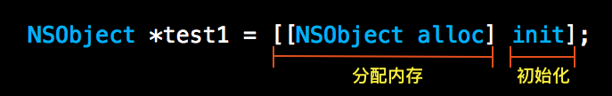
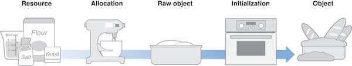
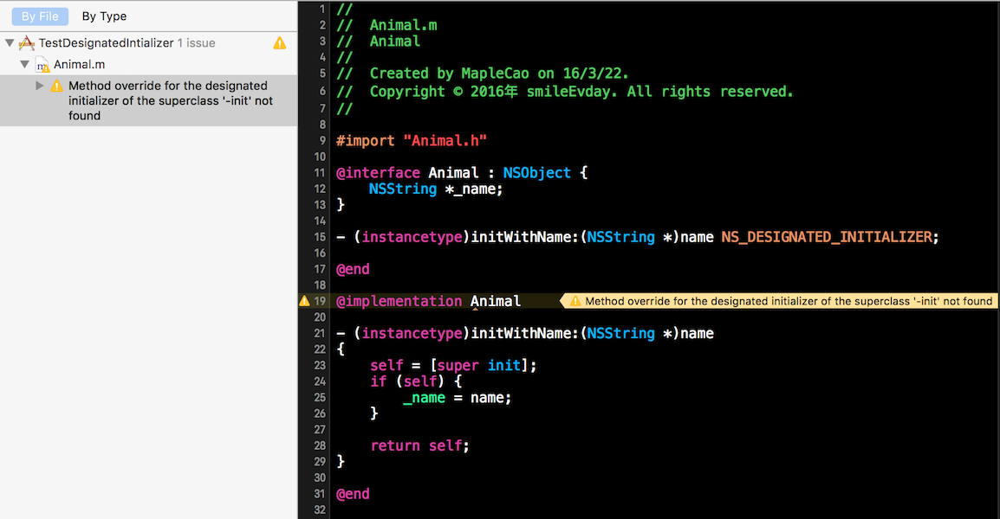
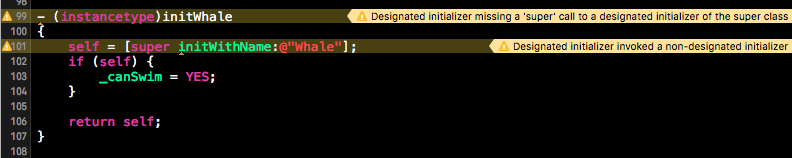
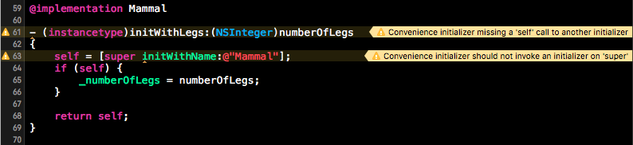
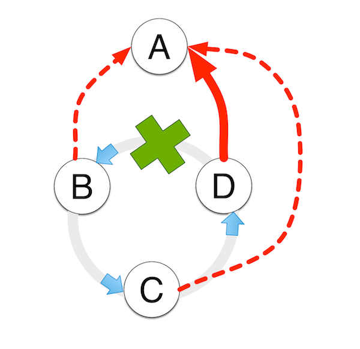
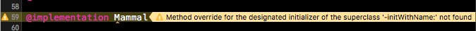
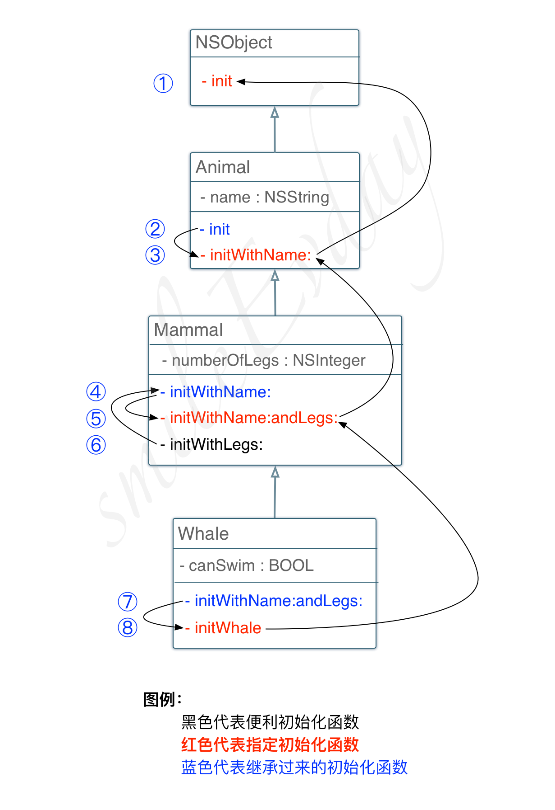

#   聊聊 Designated Initializer（指定初始化函数）

## 一、iOS的对象创建和初始化

iOS 中对象创建是分两步完成：

* 分配内存
* 初始化对象的成员变量

我们最熟悉的创建NSObject对象的过程：


苹果官方有一副图片更生动的描述了这个过程：


对象的初始化是一个很重要的过程，通常在初始化的时候我们会支持成员变量的初始状态，创建关联的对象等。例如对于如下对象：

```
1 @interface ViewController : UIViewController
 2  3 @end
 4  5  6 @interface ViewController () {
 7 XXService *_service;
 8 }
 9 10 @end
11 12 @implementation ViewController
13 14 - (instancetype)initWithNibName:(NSString *)nibNameOrNil bundle:(NSBundle *)nibBundleOrNil
15 {
16 self = [super initWithNibName:nibNameOrNil bundle:nibBundleOrNil];
17 if (self) {
18 _service = [[XXService alloc] init];
19  }
20 21 return self;
22 }
23 24 - (void)viewWillAppear:(BOOL)animated
25 {
26  [super viewWillAppear:animated];
27 28  [_service doRequest];
29 }
30 31 ...
32 33 @end
```

上面的VC中有一个成员变量XXService，在viewWillAppear的时候发起网络请求获取数据填充VC。

> **大家觉得上面的代码有没有什么问题?**  

带着这个问题我们继续往下看，上面只有VC的实现代码，VC通过什么姿势创建，我们不得而知，下面分两种情况：

1. 手动创建

通常为了省事，我们创建VC的时候经常使用如下方式

```
ViewController *vc = [ViewController alloc] init];
ViewController *vc = [ViewController alloc] initWithNibName:nil bundle:nil];
```

使用如上两种方式创建，我们上面的那一段代码都可以正常运行，因为成员变量_service被正确的初始化了。

2. 从storyboard加载或者反序列化而来

先来看一段苹果官方的文案：

> `When using a storyboard to define your view controller and its associated views, you never initialize your view controller class directly. Instead, view controllers are instantiated by the storyboard €”either automatically when a segue is triggered or programmatically when your app calls the instantiateViewControllerWithIdentifier: method of a storyboard object. When instantiating a view controller from a storyboard, iOS initializes the new view controller by calling its initWithCoder: method instead of this method and sets the nibName property to a nib file stored inside the storyboard.`  

从Xcode5以后创建新的工程默认都是Storyboard的方式管理和加载VC，对象的初始化压根不会调用  **initWithNibName:bundle:**  方法，而是调用了  **initWithCoder:**  方法。对照上面VC的实现，可以看出_service对象没有被正确初始化，所以请求无法发出。

至此第一个问题大家心中应该已经有了答案，下面让我们再去看看问题背后的更深层的原因。

> **正确的运行结果并不代表正确的执行逻辑，有时候可能正好是巧合而已**  

## 二、Designated Initializer (指定初始化函数)

在 **UIViewController** 的头文件中我们可以看到如下两个初始化方法：

```
- (instancetype)initWithNibName:(nullable NSString *)nibNameOrNil bundle:(nullable NSBundle *)nibBundleOrNil NS_DESIGNATED_INITIALIZER;
- (nullable instancetype)initWithCoder:(NSCoder *)aDecoder NS_DESIGNATED_INITIALIZER;
```

细心的同学可能已经发现了一个宏 “ **NS_DESIGNATED_INITIALIZER** ”， 这个宏定义在 **NSObjCRuntime.h** 这个头文件中，定义如下：

```
1 #ifndef NS_DESIGNATED_INITIALIZER
2 #if __has_attribute(objc_designated_initializer)
3 #define NS_DESIGNATED_INITIALIZER __attribute__((objc_designated_initializer))
4 #else
5 #define NS_DESIGNATED_INITIALIZER
6 #endif
7 #endif
```

"**__has_attribute**"是Clang 的一个用于检测当前编译器是否支持某一特性的一个宏，对你没有听错，"__has_attribute" 也是一个宏。详细信息见:  [Type Safety Checking](http://clang.llvm.org/docs/AttributeReference.html#type-safety-checking)

通过上面的定义，我们可以看到"**NS_DESIGNATED_INITIALIZER**"其实是给初始化函数声明的后面加上了一个编译器可见的标记，不要小看这个标记，他可以在编译时就帮我们找出一些潜在的问题，避免程序运行时出现一些奇奇怪怪的行为。

**听着神乎其神，编译器怎么帮我们避免呢？**  
**答案是：⚠️⚠️⚠️警告**  

如下图：


编译器出现警告，说明我们写的代码不够规范。Xcode自带的 **Analytics** 工具可以帮助我们找出程序的潜在的问题，多花点时间规范自己的代码，消除项目中的警告，避免后面项目上线后出现奇奇怪怪的问题。

## 三、NS_DESIGNATED_INITIALIZER 正确使用姿势是什么？

**指定初始化函数 Vs 便利初始化函数**

指定初始化函数对一个类来说非常重要，通常参数也是最多的，试想每次我们需要创建一个自定义类都需要一堆参数，那岂不是很痛苦。 **便利初始化函数** 就是用来帮我们解决这个问题的，可以让我们比较的创建对象，同时又可以保证类的成员变量被设置为默认的值。

不过需要注意，为了享受这些“ ***便利*** ”，我们需要遵守一些规范，官方文档链接如下：

**Objective-C:**   [Object Initialization](https://developer.apple.com/library/mac/releasenotes/ObjectiveC/ModernizationObjC/AdoptingModernObjective-C/AdoptingModernObjective-C.html#//apple_ref/doc/uid/TP40014150-CH1-SW8),  [Multiple initializers](https://developer.apple.com/library/ios/documentation/General/Conceptual/DevPedia-CocoaCore/MultipleInitializers.html)

**Swift:**   [Swift Initialization](https://developer.apple.com/library/ios/documentation/Swift/Conceptual/Swift_Programming_Language/Initialization.html)

Swift和Objective-C略有不同，下面我们以Objective-C的规范为例。

1. 子类如果有指定初始化函数，那么指定初始化函数实现时必须调用它的直接父类的指定初始化函数。



2. 如果子类有指定初始化函数，那么便利初始化函数必须调用 **自己** 的其它初始化函数(包括指定初始化函数以及其他的便利初始化函数)，不能调用super的初始化函数。



基于第2条的定义我们可以推断出： **所有的便利初始化函数最终都会调到该类的指定初始化函数**

**原因：** 所有的便利初始化函数必须调用的其他初始化函数，如果程序能够正常运行，那么一定不会出现直接递归，或者间接递归的情况。那么假设一个类有指定函数A，便利初始化函数B，C，D，那么B，C，D三者之间无论怎么调用总的有一个人打破这个循环，那么必定会有一个调用指向了A，从而其他两个也最终会指向A。

示意图如下(图画的比较丑，大家明白意思就好)：



3. 如果子类提供了指定初始化函数，那么一定要实现所有父类的指定初始化函数。



当子类定义了自己的指定初始化函数之后，父类的指定初始化函数就“退化”为子类的便利初始化函数。这一条规范的目的是: “ **保证子类新增的变量能够被正确初始化。** ”

因为我们没法限制使用者通过什么什么方式创建子类，例如我们在创建UIViewController的时候可以使用如下三种方式：

```
UIViewController *vc = [[UIViewController alloc] init];
UIViewController *vc = [[UIViewController alloc] initWithNibName:nil bundle:nil];
UIViewController *vc = [[UIViewController alloc] initWithCoder:xxx];
```

如果子类没有重写父类的所有初始化函数，而使用者恰好直接使用父类的初始化函数初始化对象，那么子类的成员变量就可能存在没有正确初始化的情况。

## 四、举个栗子

以上三条规范理解起来可能有点儿绕，我写了个简单的例子有助于理解该规范，代码如下：


```
1 @interface Animal : NSObject {
 2 NSString *_name;
 3 }
 4  5 - (instancetype)initWithName:(NSString *)name NS_DESIGNATED_INITIALIZER;
 6  7 @end
 8  9 @implementation Animal
10 11 - (instancetype)initWithName:(NSString *)name
12 {
13 self = [super init];
14 if (self) {
15 _name = name;
16  }
17 18 return self;
19 }
20 21 - (instancetype)init
22 {
23 return [self initWithName:@"Animal"];
24 }
25 26 @end
27 28 29 @interface Mammal : Animal {
30  NSInteger _numberOfLegs;
31 }
32 33 - (instancetype)initWithName:(NSString *)name andLegs:(NSInteger)numberOfLegs NS_DESIGNATED_INITIALIZER;
34 35 - (instancetype)initWithLegs:(NSInteger)numberOfLegs;
36 37 @end
38 39 @implementation Mammal
40 41 - (instancetype)initWithLegs:(NSInteger)numberOfLegs
42 {
43 self = [self initWithName:@"Mammal"];
44 if (self) {
45 _numberOfLegs = numberOfLegs;
46  }
47 48 return self;
49 }
50 51 - (instancetype)initWithName:(NSString *)name andLegs:(NSInteger)numberOfLegs
52 {
53 self = [super initWithName:name];
54 if (self) {
55 _numberOfLegs = numberOfLegs;
56  }
57 58 return self;
59 }
60 61 - (instancetype)initWithName:(NSString *)name
62 {
63 return [self initWithName:name andLegs:4];
64 }
65 66 @end
67 68 69 @interface Whale : Mammal {
70  BOOL _canSwim;
71 }
72 73 - (instancetype)initWhale NS_DESIGNATED_INITIALIZER;
74 75 @end
76 77 @implementation Whale
78 79 - (instancetype)initWhale
80 {
81 self = [super initWithName:@"Whale" andLegs:0];
82 if (self) {
83 _canSwim = YES;
84  }
85 86 return self;
87 }
88 89 - (instancetype)initWithName:(NSString *)name andLegs:(NSInteger)numberOfLegs
90 {
91 return [self initWhale];
92 }
93 94 - (NSString *)description
95 {
96 return [NSString stringWithFormat:@"Name: %@, Numberof Legs %zd, CanSwim %@", _name, _numberOfLegs, _canSwim ? @"YES" : @"NO"];
97 }
98 99 @end
```

配套上面的代码，我还画了一张类调用图帮助大家理解，如下：


我们声明了三个类： **Animal(动物)** ， **Mammal(哺乳动物)** ， **Whale(鲸鱼)** ，并且按照指定初始化函数的规范实现了所有的初始化函数。

下面我们创建一些 **Whale(鲸鱼)** ，测试一下健壮性，代码如下：

```
Whale *whale1 = [[Whale alloc] initWhale]; // 1
NSLog(@"whale1 %@", whale1); 

Whale *whale2 = [[Whale alloc] initWithName:@"Whale"]; // 2
NSLog(@"whale2 %@", whale2); 

Whale *whale3 = [[Whale alloc] init]; // 3
NSLog(@"whale3 %@", whale3); 

Whale *whale4 = [[Whale alloc] initWithLegs:4]; // 4
NSLog(@"whale4 %@", whale4); 

Whale *whale5 = [[Whale alloc] initWithName:@"Whale" andLegs:8]; // 5
NSLog(@"whale5 %@", whale5);
```

执行结果为：

```
whale1 Name: Whale, Numberof Legs 0, CanSwim YES
whale2 Name: Whale, Numberof Legs 0, CanSwim YES
whale3 Name: Whale, Numberof Legs 0, CanSwim YES
whale4 Name: Whale, Numberof Legs 4, CanSwim YES
whale5 Name: Whale, Numberof Legs 0, CanSwim YES
```

分析可以得出：

whale1 使用  **Whale**  的指定初始化函数创建，初始化调用顺序为: ⑧ -> ⑤ -> ③ -> ①，初始化方法的实际执行顺序恰好相反: ① -> ③ -> ⑤ -> ⑧，即从根类的开始初始化，初始化的顺序正好和类成员变量的布局顺序相同，有兴趣的可以自行上网查查。

whale5 使用 **Whale** 的父类 **Mammal** 的指定初始化函数创建实例，初始化调用顺序为: ⑦ -> ⑧ -> ⑤ -> ③ -> ①，创建出来的对象符合预期。

> 注：⑦ 代表 Whale 类的实现，其内部实现调用了自己类的指定初始化函数  **initWhale** 。 ⑤ 代表  **Mammal**  类的实现。  

细心地朋友可能已经发我们创建的第四条鲸鱼，神奇的长了4条腿，让我们看看创建过程的调用顺序: ⑥ -> ④ -> ⑦ -> ⑧ -> ⑤ -> ③ -> ①， 可以看到对象的初始化也是完全从跟到当前类的顺序依次初始化的，那么问题出在哪儿呢？

**Mammal**  类的  *initWithLegs:* 函数，除了正常的初始化函数调用栈，它还一段函数体，对已经初始化好的对象的成员变量 *_numberOfLegs*  重新设置了值，这就导致了鲸鱼长出了4条腿。

```
- (instancetype)initWithLegs:(NSInteger)numberOfLegs { 
    self = [self initWithName:@"Mammal"]; 
    if (self) { 
        _numberOfLegs = numberOfLegs; 
    } 
    return self;
}
```

细心的同学会发现，无论你使用父类的还是爷爷类的初始化函数创建子类的对象，最后四个调用顺序都为：⑧ -> ⑤ -> ③ -> ①。

**指定初始化函数规则只能用来保证对象的创建过程是从跟类到子类依次初始化所有成员变量，无法解决业务问题。**  

## 五、当 initWithCoder: 遇到  **NS_DESIGNATED_INITIALIZER**

NSCoding协议的定义如下:

```
@protocol NSCoding 

- (void)encodeWithCoder:(NSCoder *)aCoder;
- (nullable instancetype)initWithCoder:(NSCoder *)aDecoder; // NS_DESIGNATED_INITIALIZER 

@end
```

苹果官方文档  [Decoding an Object](https://developer.apple.com/library/ios/documentation/Cocoa/Conceptual/Archiving/Articles/codingobjects.html#//apple_ref/doc/uid/20000948-97254)  中明确规定：

> In the implementation of an initWithCoder: method, the object should first invoke its superclass’s designated initializer to initialize inherited state, and then it should decode and initialize its state. If the superclass adopts the NSCoding protocol, you start by assigning of the return value of initWithCoder: to self.  

翻译一下:

* 如父类没有实现NSCoding协议，那么应该调用父类的指定初始化函数。
* 如果父类实现了NSCoing协议，那么子类的 initWithCoder: 的实现中需要调用父类的initWithCoder:方法，

根据上面的第三部分阐述的指定初始化函数的三个规则，而NSCoding实现的两个原则都需要父类的初始化函数，这违反了指定初始化实现的第二条原则。

**怎么办？**  

仔细观察NSCoding协议中  **initWithCoder:**  的定义后面有一个注释掉的  **NS_DESIGNATED_INITIALIZER** ，是不是可以找到一点儿灵感呢！

实现NSCoding协议的时候，我们可以显示的声明  **initWithCoder:**  为指定初始化函数(一个类可以有多个指定初始化函数，比如UIViewController)即可完美解决问题，既满足了指定初始化函数的三个规则，又满足了NSCoding协议的三条原则。

## 六、总结

指定初始化方法的机制保证了对象会依次执行从父类到子类的所有初始化逻辑，实现的规则为：

1. 便捷初始化方法只能调用本类中的其他初始化方法，并最终调用到指定初始化方法。
2. 子类的指定初始化方法要调用父类的指定初始化方法，以保证父类的初始化逻辑可以执行。
3. 当子类实现了自己的指定初始化方法后，父类的指定初始化方法要重写为便捷初始化方法，以保证所有初始化方法都能调用到子类的初始化逻辑。

作者：水止云起
链接：https://www.jianshu.com/p/e5dd2eb4ab1b
来源：简书
著作权归作者所有。商业转载请联系作者获得授权，非商业转载请注明出处。

苹果官方有个图，有助于我们理解这两点：


当我们为自己创建的类添加指定初始化函数时，必须准确的识别并覆盖直接父类所有的指定初始化函数，这样才能保证整个子类的初始化过程可以覆盖到所有继承链上的成员变量得到合适的初始化。

**NS_DESIGNATED_INITIALIZER**  是一个很有用的宏，充分发挥编译器的特性帮我们找出初始化过程中可能存在的漏洞，增强代码的健壮性。

### 参考资料:

[Object creation](https://developer.apple.com/library/ios/documentation/General/Conceptual/DevPedia-CocoaCore/ObjectCreation.html#//apple_ref/doc/uid/TP40008195-CH39-SW1)

[Initialization](https://developer.apple.com/library/ios/documentation/General/Conceptual/DevPedia-CocoaCore/Initialization.html#//apple_ref/doc/uid/TP40008195-CH21-SW1)
[Multiple initializers](https://developer.apple.com/library/ios/documentation/General/Conceptual/DevPedia-CocoaCore/MultipleInitializers.html)
[How To: Objective C Initializer Patterns](http://blog.twitter.com/2014/how-to-objective-c-initializer-patterns)
[Decoding an Object](https://developer.apple.com/library/ios/documentation/Cocoa/Conceptual/Archiving/Articles/codingobjects.html#//apple_ref/doc/uid/20000948-97254)

[Object Initialization](https://developer.apple.com/library/mac/releasenotes/ObjectiveC/ModernizationObjC/AdoptingModernObjective-C/AdoptingModernObjective-C.html#//apple_ref/doc/uid/TP40014150-CH1-SW8)
