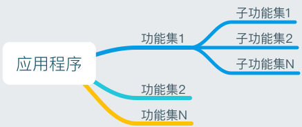

# iOS的MVC框架之控制层的构建(上)

在我前面的两篇文章里面分别对MVC框架中的M层的定义和构建方法进行了深入的介绍和探讨。这篇文章则是想深入的介绍一下我们应该如何去构建控制层。控制层是联系视图层和模型层的纽带。现在也有非常多的文章宣扬所谓的去控制层或者弱化控制层的作用，觉得这部分是一个鸡肋，他会使得应用变得臃肿不堪。那么他是否有存在的必要呢？

一般的应用场景里面，我们都需要将各种界面呈现给用户，然后用户通过某些操作来达到某个目标。从上面的场景中可以提取出呈现、操作、目标三个关键字。要呈现出什么以及要完成什么目标我们必须要通过具体操作才能达成，也就是说是通过操作来驱动界面的不断变化以及服务目标的不断达成，操作是联系界面和目标的纽带。为了表征这种真实的场景，在软件建模和设计实现中也应如此。我想这也就是MVC框架这种应用模型设计的初衷吧。在MVC框架中V负责呈现C负责操作而M则负责目标。而且这种设计还有如下更多的考量：

* 视图界面千变万化，会根据用户的体验不停的升级和优化，甚至同一个功能的前后两个版本都有完全不同的差异，或者某些视图界面会分散到其他视图界面中去，又或原来分散的视图界面又聚合到某个新视图界面中来。也就是说视图呈现部分是变化最大以及持久性最短的一个部分。
* 模型(服务)则相对稳定，他只是提供了某些具体的基础业务服务，而且这些服务更多的是服务水平的升级而非服务的完全改变。因此模型部分是变化最小且持久性最长的一个部分。
* 一般情况下我们对视图界面上的操作控制需要调用多个服务来完成，或者不同的界面上的呈现可能会由同一个服务来支撑。因此我们不能将界面呈现和服务目标进行一对一的强行绑定，我们需要将呈现和模型进行解耦处理。

控制层的引入正是解决了上面的这些矛盾，他将视图和模型的关联减少到最低，同时也是将易变的和不变这种矛盾体进行了化解。控制层就是一个中介者（参考设计模式中的中介者模式）我们应该把具体的操作交给控制层来完成，并且由控制层来驱动视图的呈现和服务的提供。这看来好像是一种最优的解决方案。

### 控制器--功能的划分边界

那么控制层除了具备处理操作以及实现视图和模型之间联系的纽带之外，还应该具有什么特征呢？

应用程序从使用者的角度来看他其实就是能够提供某种能力的功能的集合。每个功能都具有对应的展示效果以及提供对应的服务。而且有些功能又可以细分为更多的小功能。对于开发者来说功能是一种应用纵向的切分。开发者更喜欢将他说成为模块单元或者说是功能。每个功能能够提供一个从界面到业务逻辑的完整单元，而且功能之间一般都比较独立，功能之间通常通过接口来进行交互。这样设计的好处是有利于降低系统内模块之间的依赖耦合性，也有利于程序员之间的分工合作和任务划分。因此无论从使用者还是开发者的角度来看功能划分都是一种非常好的应用程序构造方式。功能的展现在设计上我们可以理解为通过视图来完成，而业务逻辑实现则是由模型层来完成，所以必须要存在一个实体来将这两者关联起来，并且起到统筹和控制的能力。这个实体由控制层的控制器来实现和担当最合适。因此在实践中我们对功能的实现和划分也通常是以控制器为单位来构建的，控制器是工作在控制层。也就是说我们在实现某个功能时通常是为这个功能建立一个对应的控制器来实现的，控制器负责视图的构建和业务模型的调用，而思想下的框架就是经典的MVC框架！

### 控制层在各平台下的实现

目前主流的iOS和Android移动开发平台所提供的都是MVC应用框架，尤其是对于控制层的实现更是几乎提供了相同的能力和方式。两个平台的控制层的实体都是由对应的控制器类来实现的(iOS叫UIViewController, Android叫Activity)。而且这两个平台上都提供了控制器的构建，视图的呈现以及到控制器的销毁的流程方法。这种实现机制是一个非常典型的模板方法设计模式，在基类中定义了一个控制器在生命周期内各环节的调用方法，您只需要在派生类中重载这些方法来完成控制器生命周期内各环节所要完成的动作或者处理的事情。为了处理控制器之间的交互或者调用，系统提供了一个导航栈的管理类。导航栈负责各功能控制器的进入和退出，同时管理着所有的控制器。

> 相对于iOS的UIViewController来说Android的Activity其实对功能封装得更加彻底。Activity具有跨越进程的调用能力，因此作为组件化的能力更加强大，同时控制器和控制器之间的耦合度也非常得低。对于控制器之间的参数传递都是通过序列化和反序列化来实现的。但是这也在某方面成为了一个缺点，为了解决这个问题，Android系统中又提供了一个叫Fragment类，这是一个较Activity而言的轻量级控制器，目的是为了解决某些大功能需要拆解为多个子功能来实现的问题以及解决功能之间的参数传递的问题。  

#### iOS视图控制器生命周期的介绍。

前面大体介绍了控制层中控制器的实现以及控制器的生命周期，同时也介绍了功能和控制器之间的对应关系，控制器是视图和业务模型之间联系的纽带，因此控制器必须要在生命周期内负责视图的构建、管理视图的呈现、处理用户的操作、以及进行业务模型的调用等工作。为了实现这些能力，控制器中采用了一种模板方法的设计模式来解决这个问题。这里面我主要想介绍一下iOS视图控制器为解决这些问题而所做的实现。我们知道iOS中的视图控制器是叫UIViewController。在这个类中定义了很多的方法来描述控制器所处的状态，而每个从视图控制器派生的类都可以重载对应的方法以便在视图控制器的相应状态下进行逻辑的处理。下面列出了常见的几种状态下的方法以及这种状态下我们通常应该要做的事情：

* init
  * 这个是控制器的构造方法

* loadView
  * 在这个方法中完成视图的构造。如果你的视图是由Storyboard或者XIB来构建那么你不需要重载这个方法，但是如果你的视图是通过代码构建的话则应该重载这个方法。控制器的默认实现将会找到关联的Storyboard或者XIB中的视图布局描述信息, 如果找到了则根据布局描述来构建要呈现的视图，如果没有找到则会构建出一个默认的空视图。

* viewDidLoad
  * 这个方法被调用时表示视图已经构建完毕了，一般在这里构建模型层的业务模型对象，以及一些事件的绑定，委托delegate的设置等工作。如果你是通过代码来构建布局时，不建议在这里进行视图布局的构建而应该将构建的代码写在loadView里面去。

* viewWillAppear
  * 视图将要呈现时调用，只有当将一个视图添加到一个窗口UIWindow时视图才会呈现出来，因此这个方法是在将视图添加到窗口前被调用。

* viewDidAppear
  * 视图已经呈现到窗口中，这个方法会在视图添加到窗口后被调用。

* viewWillDisappear
  * 视图将要从窗口中删除时被调用。

* viewDidDisappear
  * 视图已经从窗口中删除时调用。

* dealloc
  * 控制器被销毁前被调用。

### 如何构建您的控制层

如何构建一个控制层是一个非常广泛的命题，需要具体业务具体分析。虽然如此总是还能找到一些共同点和方法论，一个优秀的设计方法，将不会出现所谓的控制器代码膨胀的问题。MVC本身的框架思想非常的优秀，当出现问题时首先要考虑的并不是去替换掉现有的框架而是从设计的角度去优化现有的代码以及逻辑，让整个系统达到一个最优的组合。

#### 1. 功能文件夹的划分

在前面的论述中可以看出视图控制器是功能实现的基本单元，一个视图控制器是一个功能的载体。一个应用中具有多个功能，而一些相似的功能通常组成一个功能集，比如一个应用的注册流程可能会分为好几步；比如说用户体系的各种特性的设置；比如说一个订单的支付部分等等。为了对功能集进行管理，可以将某些功能集下的所有功能放置到一个特定目录中。最终的构成一个应用功能目录树:



通过对功能进行划分管理，有利于功能的检索和增强你应用系统的可理解性。操作系统以及XCODE上的文件夹就是一种非常常见的功能树目录构建方式。在进行功能目录树划分时注意如下几个要点。

* 如果某些功能是一些基本的功能，可能多个其他功能都会用到那么可以将这些功能提炼出来保存到一个特定的文件夹中（文件夹可以命名为Common或者Base之类的）。比如你可以在系统提供的控制器的基础上派生出你自己的控制器基类，然后把这些基类也可以单独的保存到一个文件夹中。
* 最好不要以每个功能单独建立文件夹来管理。有些案例里面会出现每个VC的.h和.m文件都给他建立文件夹，其实这样不可取，因为有可能导致文件夹过多而变得查找定位更加麻烦。我们应该以相似的功能聚集在一起来建立文件夹进行管理。
* 有时候某个功能集可能过于庞大，这时候我们可以对功能集进行再次分类，并建立子文件夹进行管理，文件夹划分不一定是单层树形结构也可以是多层树形结构。
* 在XCODE中可以建立两种文件夹:**真实文件夹(New Group with Folder)和虚拟文件夹(New Group)** 。 这里建议是最好建立虚拟的文件夹，原因是为了后续好管理，因为有时候可能出现控制器文件从一个文件夹移动到另外一个文件夹的情况(功能转移)。如果你建立真实的文件夹的话，那么移动后控制器所在的真实的文件夹就有可能会和你项目工程上的所在的文件夹对应不上的情况。而用虚拟文件夹就不会出现这种情况的发生。
* 功能文件夹的划分方法有很多种，你可以从业务的角度来划分文件夹，也可以从你的应用界面上的展现来划分文件夹。比如一个应用中我们有商品展示体系、支付体系、用户体系，而我们的界面展示可能是底部分为首页、购物车，我的组成的四个Tab界面。这时候你可以按业务来分为商品、支付、用户文件夹，也可以按展示界面来分为首页、购物车、我的文件夹。因此文件夹的划分并没有标准就看你个人的喜好而定了。唯一的要求就是同一个文件夹内的功能要体现出聚合性强的原则，也就是在某一天甚至可以将这部分单独抽离出来构建一个子项目时而不需要进行进行大量的改变。

#### 2. 基本控制器以及派生类。

一个应用总是会有自己独特的设计风格，比如标题栏的文字和字体以及背景。或者我们要对应用进行整体的监控，比如对界面进入退出进行埋点处理。因此我们需要在系统提供的基本控制器UIViewController, UITableviewController, UINavigationController, UICollectionViewController等控制器之上进行派生类的构建，也就是实现某个具体功能的控制器不要从系统的控制器之上派生而应该从派生的控制器基类之上再派生出来。这样我们就可以在我们派生的控制器基类上增加一些具有自己特色的业务逻辑或者界面逻辑，也可以实现某些AOP方面的处理。比如我们可以构建一个UINavigationController的派生基类，这样在进行控制器的push以及pop之前或者之后进行一些特殊处理。 但是这样问题就来了，因为OC语言并不支持多重继承。而我们可能要建立上面四个系统控制器的派生类，并且需要在相似的地方添加同样的代码，比如都要在viewDidLoad中添加一段相似的代码。为了实现这一点，就需要添加四份相同的代码比如：

```
@interface XXXBaseViewController:UIViewController
@end

@implementation  XXXBaseViewController

-(void)helperfn
{
    //..实现特定的扩展功能。
}

-(void) viewDidLoad
{
    [super viewDidLoad];
    [self helperfn];  //调用扩展方法
}

@end

@interface XXXBaseNavigationController: UINavigationController
@end

@implementation  XXXBaseNavigationController

-(void)helperfn
{
    //..实现特定的扩展功能。
}

-(void) viewDidLoad
{
    [super viewDidLoad];
    [self helperfn];  //调用扩展方法
}

@end

//...分别实现的UITableviewController、UICollectionViewController等等都将实现重复的代码。
```

很明显这是一种低效率的解决方案，因为一旦需求变更我们就可能需要对helperfn方法改动四次。怎么解决这种问题呢？我们分为2种场景：

###### 一、 所有的功能扩展中都不需要扩展属性

在这种情况下，因为扩展的方法中都不需要用到对象的实例属性，所以我们可以通过建立分类(Category)的方法来实现这些共有的功能，我们可以为UIViewController建立出一个分类来，并在这个分类中实现共有的方法，然后在每个派生类的特定位置中调用这个共享的分类方法。具体代码如下：

```
@interface UIViewController(XXXExtend)
    
     -(void)helperfn;
@end

@implementation  UIViewController(XXXExtend)

//一份实现
 -(void)helperfn
{
    //实现特定功能。
}

@end

@interface XXXBaseViewController:UIViewController
@end

@implementation  XXXBaseViewController

-(void) viewDidLoad
{
    [super viewDidLoad];
    [self helperfn];  //调用扩展方法
}

@end

@interface XXXBaseNavigationController: UINavigationController
@end

@implementation  XXXBaseNavigationController

-(void) viewDidLoad
{
    [super viewDidLoad];
    [self helperfn];  //调用扩展方法
}

@end

//...分别实现的UITableviewController、UICollectionViewController的派生类。
```

当然你也许觉得上面的方法需要在每个派生类的特定地点都添加一遍代码而感到麻烦，你也可以采用method swizzle的方法来解决上述的问题，你可以在分类的+load方法中实现代码替换。下面是具体的代码实现：

```
@interface UIViewController(XXXExtend)
@end

@implementation UIViewController(XXXExtend)

-(void)helperfn
{
    
}

-(void)viewDidLoadXXXExtend
{
    [self viewDidLoadXXXExtend];
    
    [self helperfn];
}

+(void)load
{
    Method originalMethod = class_getInstanceMethod(self, @selector(viewDidLoad));
    Method swizzledMethod = class_getInstanceMethod(self, @selector(viewDidLoadXXXExtend));
    method_exchangeImplementations(originalMethod, swizzledMethod);
}

@end

@interface XXXBaseViewController:UIViewController
@end

@implementation  XXXBaseViewController

@end

@interface XXXBaseNavigationController: UINavigationController
@end

@implementation  XXXBaseNavigationController
@end

//...分别实现的UITableviewController、UICollectionViewController的派生类。
```

###### 二、有需要扩展属性的情况。

如果你的基类扩展方法中有用到属性的话那么我们知道分类中是不能支持编译时扩展属性的（但是支持运行时扩展属性的增加)。除了用运算时扩展属性的方法外，还可以将共有的方法和属性单独提炼出来让一个辅助类来实现，然后在派生基类的初始化方法中创建这个辅助类，并且后续的一些方法都委托给辅助类来实现。具体的结构设计如下：

```
//Helper.h

@interface Helper:NSObject

@property   id prop1;
@property   id prop2;

-(void)fn1;
-(void)fn2;

-(id)initWithViewController:(UIViewController*)vc;

@end

//Helper.m

@interface Helper()

@property(weak) UIViewController *vc;  //这里一定要定义为弱引用

@end

@implementation Helper

-(id)initWithViewController:(UIViewController*)vc
{
     self = [self init];
     if (self != nil)
    {
           _vc = vc;
    }

   return self;
}

-(void)fn1
 {
      //...
      self.vc.xxxx;  //这里可以访问视图控制器的方法。
 }

@end

..........................................

//XXXBaseViewController.h

@interface XXXBaseViewController:UIViewController

@property id prop1;

@end

//XXXBaseViewController.m

@interface XXXBaseViewController()

   @property(strong) Helper *helper;
@end

@implementation  XXXBaseViewController

-(id)init
{
     self = [super init];
    if (self != nil)
    {
            //在视图控制器的初始化里面初始化一个帮助对象。
           _helper = [[Helper alloc] initWithViewController:self];
    }

   return self;
}

//重写控制器中的属性，并把真实的实现委托给helper来完成
-(void)setProp1:(id)prop1
{
     self.helper.prop1 = prop1;
}

-(id)prop1
{
    return self.helper.prop1;
}

-(void) viewDidLoad
{
    [super viewDidLoad];
    [self.helper fn1];  //调用帮助类的方法。
}

@end

//在你的其他几个派生类中采用同样的机制来处理。
```

从上面可以看出来，辅助类里面设计了一个弱引用指针来指向控制器，而控制器则是强引用辅助类，这样做的目的是为了防止循环引用的发生，而且这种设计模式也是一种在实践中非常经典的方法：有时候我们需要将类A的某些功能委托给类B实现，而B又有可能会在特定的地方访问A的属性，为了防止相互引用而形成死锁导致两个对象都无法被释放，这时候就需要使用强弱引用来解决这个问题。上面借助辅助类来实现的方法可以解决我们的派生类中代码重复的问题。上面的方法缺点就是我们的派生类中需要编写很多重复的、程式化的代码。如何来精简呢？其实我们可以借助接口协议和OC中的forwarding机制来解决这些问题：

```
//Helper.h

@protocol Helper

//请将接口的属性和方法都设置为可选
@optional

 @property   id prop1;
 @property   id prop2;

-(void)fn1;
-(void)fn2;

@end

//真实实现接口的对象
@interface Helper:NSObject<Helper>

@property   id prop1;
@property   id prop2;

-(id)initWithViewController:(UIViewController*)vc;

@end

//Helper.m
@interface Helper()

@property(weak) UIViewController *vc;  //这里一定要定义为弱引用

@end

@implementation Helper

-(id)initWithViewController:(UIViewController*)vc
{
     self = [self init];
     if (self != nil)
    {
           _vc = vc;
    }

   return self;
}

-(void)fn1
 {
      //...
      self.vc.xxxx;  //这里可以访问视图控制器的方法。
 }

-(void)fn2
{
   //...
}

@end

..........................................

//XXXBaseViewController.h

@interface XXXBaseViewController:UIViewController

@end

//XXXBaseViewController.m

//这里实现Helper协议，如果基类的扩展属性可以被外面访问则应该在.h中的类申明里面表明实现了Helper协议
@interface XXXBaseViewController()<Helper>
   @property(strong) Helper *helper;
@end

@implementation  XXXBaseViewController

-(id)init
{
     self = [super init];
    if (self != nil)
    {
            //在视图控制器的初始化里面初始化一个帮助对象。
           _helper = [[Helper alloc] initWithViewController:self];
    }

    return self;
}

-(void) viewDidLoad
{
    [super viewDidLoad];
    [self fn1];  //调用fn1
  
   id *p = self.prop1  //读取属性。

}

//这是实现的关键点，重载这个方法。
-(id)forwardingTargetForSelector:(SEL)aSelector
{
   //判断这个方法是否是协议定义的方法，如果是则将方法的实现者设置为helper对象。
    struct objc_method_description  omd = protocol_getMethodDescription(@protocol(Helper), aSelector, NO, YES);
    if (omd.name != NULL)
    {
        return self.helper;
    }
    
    return [super forwardingTargetForSelector:aSelector];
    
}

@end

//在你的其他几个派生类中采用同样的机制来处理。
```

可以看出我们可以借助OC的forwardingTargetForSelector方法来实现方法调用的转发处理，而不必具体的定义方法的实现。

#### 3.对内和对外的接口定义

面向对象编程的一个主旨思想就是封装，所谓封装就是在进行类的定义和设计时，我们尽可能的暴露出外面可以理解以及需要的接口或者方法，而在内部实现中所用到的中间特性或者私有特性则尽可能的隐藏。尽可能的隐藏复杂的实现细节，而把简单易用的接口暴露给外部使用。比如对于汽车的封装，我们对外暴露的就仅仅是开锁、发动、挂挡、转向等操作，而具体内部的组成、发动机的原理、以及发动机如何驱动行走等细节都不需要开车的人了解。正是面向对象这种封装的特性就使得我们能更加从应用层面去使用某个对象的方法而不需要知道其中的细节。因此我们在类的设计中也要遵循这个设计的思想，把必要的东西暴露给外部，而把实现细节则隐藏在类的内部来完成。这一节所介绍的并不仅仅适用在控制器类的设计上，所有其他系统也是同样适用的。
类的封装实现在不同的语言上所提供的能力是不一样的，这一点非常有意思。向在C/C++/OC这几种语言中，类的声明和类的实现需要在不同的文件里面完成（.h是声明，而.m/.c/.cpp中则是实现）而像Java和Swift等语言则是申明和实现都放在同一文件中完成。在前面的三种语言中因为声明和实现分离，所以我们可以把一些对外暴露的方法和属性放到头文件中申明，而内部的私有属性则放到实现文件中申明和定义。而使用者则只需要引入共有头文件即可。而后面两种语言中因为没有分开，所以在这些语言更倾向于通过接口定义和实现来完成这种共有属性和私有属性分类的机制（您可以看出在Java中大量的使用了接口来完成整个体系架构，以及Swift中也是推崇接口编程这种理念）。

面向对象设计中，类和类之间不可能独立存在，他们之间总是要建立一种关联，这种关联有可能是单向的也有可能是双向的。我们都推崇类和类之间的单向依赖来降低类与类之间的耦合性。这种单向依赖至少在明面上是如此的，也就是类所公开的方法和属性是可以看出来的。但是在实际的内部实现中这种单向依赖可以就会被打破。举一个很常见的例子我们都知道视图控制器UIViewController中有一个view属性来保存控制器所管理的视图，但是我们在视图UIView中却看不见任何关于控制器的属性。这样的表象就是表明视图控制器依赖视图，而视图则不依赖视图控制器，这也是非常符合MVC中三层设计思路的。但实际中是如此吗？ 结果并不是这样的，因为在系统的内部如果某个视图是控制器的根视图的话他可能会具有一些不同的特性以及不同的处理逻辑，因此其实在UIView的内部私有属性中是有一个视图所归属的视图控制器的属性的，这个属性就是:viewDelegate。 并且在UIView上他是定义为了id类型的。

上面的两段描述中我们都提到了对公和对私的方法和属性的申明的问题，可以看出在设计上要按照这个思路去设计我们的类，我们只需要将共有的方法和属性暴露出来，而将私有的方法和属性则隐藏起来。那么怎么来实现这种共有和私有方法的定义实现呢？我们来看下面三个具体的场景：

* 类的某些属性公开某些属性不公开

```
/*一个类里面某些属性公开某些属性不公开的实现可以很简单的通过类的申明和类的扩展来实现*/

//XXXX.h

@interface XXXX
 
//对外公开的属性
 @property  id pubp1;
 @property  id pubp2;

//对外公开的方法
-(void)pubfn1;
-(void)pubfn2;
 
@end

//XXXX.m

//只在内部使用的属性和方法定义在扩展中。
@interface XXXX()

//对内私有的属性
 @property  id prip1;
 @property  id prip2;

//对内私有的方法
-(void)prifn1;
-(void)prifn2;

@end

@implementation  XXXX
@end
```

* 类的某些属性对外暴露的是只读的，但是内部实现确实可以被改变的。这样做的目的是为了访问和使用的安全。

```
//XXXX.h

@interface XXXX
 
//对外公开的属性只读
 @property(readonly)  id pubp1;
 @property(readonly)  id pubp2;
 
@end

//XXXX.m

//只在内部使用的属性和方法定义在扩展中。
@interface XXXX()

//在类的内部这些属性是可读写的
 @property  id pubp1;
 @property  id pubp1;

@end

@implementation  XXXX
@end
```

* 类A和类B之间有关联，A中持有B的实例并公开，而B则有可能在实现中需要用到A的内部的方法或者属性，同时B是不向外暴露对A的持有的情况。因为我们都是通过头文件引用，所以在头文件中看不到这种互相依赖关系，但是内部的实现文件则可以很清楚的看到其中的依赖了。

```
//A.h

@interface A

@property(strong)  B *b;   //A的外部暴露持有B
@property  id others;

-(void) pubfn1;

@end

//A.m

//在A的内部用到了B的prip1, prifn1所以要这里申明一下。
@interface B()

@property  id prip1;
-(void)prifn1;

@end

//内部实现
@interface A()

  @property id prip1;
  -(void)prifn1;

@end

@implementation  A

-(void)pubfn1
{
    //...
    [b prifn1];    //A内部调用B的私有方法
    [b pubfn1];

    id temp = b.prip1;  //内部属性
}

@end

...............................

//B.h

//B的外部并不暴露对A的持有
@interface B

-(void)pubfn1;

@end

//B.m

@interface A()

//因为B内部要用到prifn1所以这里再申明一下。
-(void)prifn1;

@end

@interface B()

//B的内部持有A。这里因为有相互持有所有要有一个是强持有一个是弱持有。
@property(weak) A *a;   

//内部实现的其他
@property id prip1;
-(void)prifn1;

@end

@implementation  B

-(void)pubfn1
{
    [a prifn1];
}

@end
```

#### 4.各种属性的定义以及分类扩展

控制器用来实现对视图对象和业务模型对象的建立以及管理和控制，在实现上控制器会拥有众多视图层对象的属性，以及模型层对象的属性，同时还会拥有自身的一些属性。同时控制器还要在适当的时候对用户的输入进行处理，以及在适当的时候调用业务模型所提供的服务，还要在适当的时候将业务模型提供服务的结果通知给视图进行呈现和更新。因此如何去组织一个控制器的代码布局(此代码布局非视图的界面布局而是源代码的布局)就非常的重要了。如何合理的定义以及放置属性，如何合理的对控制器中的方法进行分类，以及在何时创建视图、在何时创建业务对象，在何时添加和销毁观察者，在类的析构中作如何处理等等这些其实都是有一定的规则和规范的。这一节更像是一份代码规约方面的介绍。我将会从下面几个点来分别阐述。

**(一). 属性的定义顺序和规则**
一个类的设计首要构造的就是属性和成员变量，控制器也无外乎。前面说到控制器管理着视图对象和模型对象，因此我们一般要将视图对象和业务对象作为属性定义在控制器中。这里整理出一下几点：

* 如果控制器中的属性和成员变量只在类内部使用和访问，那么我们应该要将属性定义在控制器的实现文件中的扩展里面，而不要定义在控制器的头文件中，除非这个属性会被外部访问或者设置。比如如下代码：

```
//XXX.m

@interface XXX()

//在扩展中定义内部使用的属性
  @property(nonatomic, weak)  UILabel *label;
  @property(nonatomic, strong)  User *user; 
@end

@implement XXX
@end
```

* 如果控制器中需要访问某个子控件视图那么在定义子控件视图时，属性最好是weak而非strong。这样做的目的一来iOS对于SB或者XIB上的子控件的属性定义都是默认为weak的、二来最主要的原因是有可能控制器中的根视图有可能会在运行时被重新构造（比如说我们要实现一个换肤功能，我们就有可能会重新构造视图控制器中的根视图来实现）这样当控制器中的根视图被销毁时，根视图里面的子视图也应该被销毁，而如果你用strong来定义子视图时就有可能导致子视图的生命周期要长于根视图。另外有可能我们的子控件会采用懒加载的模式来实现根视图中子视图的建立，因此如果你用strong的话就有可能导致子视图不会被重新构建。

* 对于NSString类型的属性来说我们最好将他声明为copy。原因是如果声明为strong或者assign的话，那么对于NSMutableString类型的字符串进行赋值时就有可能会在后续的代码中内容被改变，从而引起异常的问题。比如：

```
NSMutableString *str1 = [@"hello" mutableCopy];
    self.userName =   str1;   //如果userName被申明为strong的话则后续对str1的内容的更改同时也会导致userName的内容的改变！！
```

* 如果你的属性不会涉及到任何多线程访问的场景那么最好不要在属性定义上带上atomic 修饰符。原因是如果带上atomic修饰符的话所有属性的赋值和读取操作都会通过操作系统原子API来进行赋值和读取。

* 不要将状态以及持久数据保存到视图对象中。

* 如果可能最好将控制器中的视图对象属性和模型对象属性分开定义，并且把视图对象属性放在最上面， 控制器本地的属性放在中间，而模型对象属性放在最下面。

下面是一个典型的控制器属性定义的代码示例，仅供大家参考：

```
//XXXViewController.m

@interface XXXViewController()

  //不同层次上的属性分开定义
  
  //视图对象属性放在最上面。
  @property(nonatomic, weak)  UITextField *nameLabel;
  @property(nonatomic, weak)  UITextField *passwordLabel;

//中间定义控制器本身的变量
  @property(nonatomic, copy)  NSString *name;
  @property(nonatomic, assign) BOOL isAgree;

 //底部定义模型对象属性 
@property(nonatomic, strong)  User *user;

@end

@implement XXXViewController
@end
```

**(二). 类中各种方法的分类**
当你的属性定义完毕后，我们就要实现方法了。在一个类的方法中我们有构造和析构的方法、有需要重载的方法、有事件处理的方法、有个委托Delegate或者观察者的方法、还有一些对外公开的方法、以及一些私有辅助的方法。为了便于管理，我们最好能将这些方法进行分类摆放，这样也有利于查找定位，对于一个控制器来说一般就是上面所说的几种方法，一般情况下我们对相同性质的方法放在一块实现，并用一些特定的关键字或者用分类的机制来对控制器中的所有方法进行归类。下面我用两种不同的方式来对方法进行归类处理：

* 通过语法关键字。
* 在OC中我们可以通过 ＃progma mark -- 名称 来便于定位和查找。在实践中控制器类一般都要实现：重写基类的方法、公有方法、事件处理方法、Delegate中的方法、私有方法这几种类型，因此我们可以专门为这些方法定义不同的标签。具体如下：

```
//  XXXViewController.m

@implement XXXViewController

//最开始放构造和析构的方法。这两个方法放在一起就可以清楚的看出我初始化了那些东西，析构了那些东西。
-(instanceType)initXXXXX{}
-(void)dealloc{}

//接下来放重载的方法。对属性set,get重写的方法
-(void)viewDidLoad{}
-(void)viewWillAppear:(BOOL)animated{}
-(void)viewDidAppear:(BOOL)animated{}
-(NSString*)name{}
-(void)setName:(NSString*)name{}

//接下来放共有的方法，也就是控制器类暴露给外面调用的方法。
#pragma mark -- Public Methods
-(void)publicFn1{}
-(void)publicFn2{}

//接下来放事件处理的方法，这些事件处理包括控件的触摸事件，NSNotificationCenter、定时器事件、其他的注册的事件。我个人比较喜欢以handle开头。

#pragma mark -- Handle Methods

-(void)handleAction1:(id)sender{}
-(void)handleAction2:(NSNotification*)noti{}
-(void)handleAction3:(NSTimer*)timer{}

//接下来是放各种Delegate的事件，我们名称都以Delegate协议的名称做标志。

#pragma mark -- UIDataSource

//..这里添加代理的方法。。。

#pragma mark -- UITableViewDelegate

//接下来是存放各种私有方法。

#pragma mark -- Private Methods

-(void)privateFn1{}
-(void)privateFn2{}

@end
```

* 通过分类
* 如果你不想使用#pragma 带标签的形式，那也可以用分类的方式来实现。比如下面的例子：

```
//  XXXViewController.m

@implement XXXViewController

//默认的部分实现，构造和析构方法以及所有从基类重载的方法
-(instanceType)initXXXXX{}
-(void)dealloc{}

//接下来放重载的方法。对属性set,get重写的方法
-(void)viewDidLoad{}
-(void)viewWillAppear:(BOOL)animated{}
-(void)viewDidAppear:(BOOL)animated{}
-(NSString*)name{}
-(void)setName:(NSString*)name{}

@end

//公有方法
@implement XXXViewController(Public)
@end

//事件处理方法
@implement XXXViewController(Handle)
@end

@implement XXXViewController(UIDataSource)
@end
   
@implement XXXViewController(UITableViewDelegate)
@end

@implement XXXViewController(Private)
@end
```

**请阅读：[MVC框架之控制层的构建（下）](https://www.jianshu.com/p/4f7b3c9801f5)**

**欢迎大家访问我的[github地址](https://link.jianshu.com/?t=https%3A%2F%2Fgithub.com%2Fyoungsoft) 和 [简书地址](https://www.jianshu.com/u/3c9287519f58)**

[iOS的MVC框架之控制层的构建(上)](https://www.jianshu.com/p/02d6397436dc)