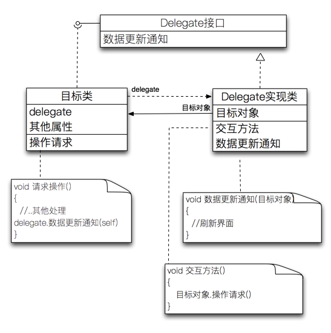
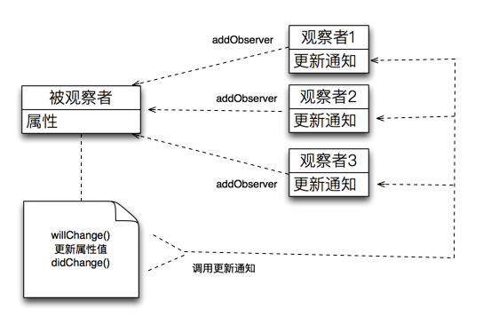
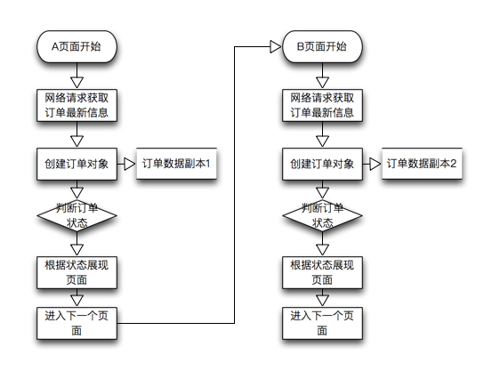
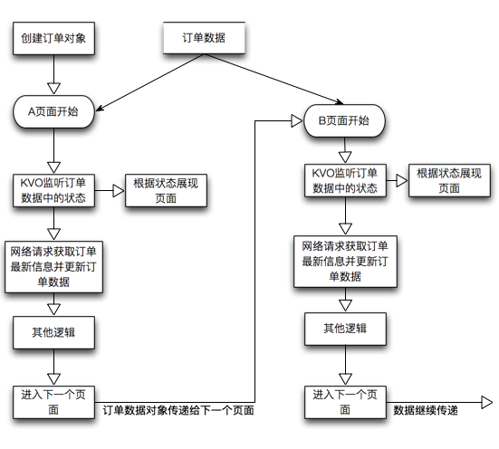

# iOS的MVC框架之模型层的构建

这篇文章是 [论MVVM伪框架结构和MVC中M的实现机制](https://www.jianshu.com/p/33c7e2f3a613#comment-15133290) 的姊妹篇。在前面的文章中更多介绍的是一些理论性质的东西，一些小伙伴在评论中也说希望有一些具体设计实践的例子，以及对一些问题进行了更加深入的交流讨论，因此准备了这篇文章。这篇文章将更多的介绍如何来进行模型层构建。

框架中层次的划分主要是基于角色和职责作为标准，某些具有相同性质的角色和 职责聚合在一起而形成了一个层的概念。MVC框架也是如此，M层负责业务的构建和实现、V层负责展示和进行输入输出交互、C层则负责进行整个系统的协调和控制。说的通俗一点就是V层是我要什么，M层是我有什么，C层则是我怎么去做？

> 在前一篇文章的评论区中还有一些同学提出了用JSON构建的数据模型称为模型层，其实这是一个误区，JSON构建的数据模型只是一种数据结构的描述，他其实并不是一种角色或者是一种职责，因此他并不是MVC中所说的M。严格的说他只是M所操作的数据对象，希望大家能够体会到这一点。  

废话了那么多，回到我们构建模型层的正题里面来，如何来构建一个模型层呢？苹果的开发框架中并没有定义一个标准模式，原因是业务是复杂多样且没有标准可言，只有当某个业务场景是明确时才可能有标准。那么在苹果的SDK框架中除了提供V层和C的 **UIKit.framkework** 框架外，有没有提供一些具体的业务框架呢？

**有！**

我们要举例或者学习如何定义M层架构其实并不需要从其他地方去找，iOS本身的很多业务框架就提供了非常经典的设计思路。比如定位框架 **CoreLocation.framework** 和地图 **MapKit.framework** 框架就实现了经典的MVC中M层的设计模式。我其实主要也是想介绍定位框架是如何来实现M层的。需要注意的是本文并不是要介绍定位库如何使用的，而是介绍这个库是如何实现M层的。

### iOS的定位库CoreLocation.framework对M层的封装实现

#### ◎第一步：业务建模

我们知道CoreLocation.framework是iOS用来进行定位的一个库。定位就是一种具体的业务需求场景。一般的定位需求就是需要随时获取我的当前位置，并且在我的当前位置更新后还需要实时的通知观察使用者；以及需要知道某个位置具体是在哪个国家哪个城市哪个街道等地标信息。有了这些需求后就能进行业务模型的构建了：

* 需要有一个位置类来对位置进行描述。位置里面应该有经纬度值、位置海拔、以及位置方向等信息。
* 需要有一个地标类来描述某个位置是哪个国家、城市、街道等信息。
* 需要有一个位置管理器来获取我当前的位置、以及需要实时的进行位置更新和位置变化的通知。
* 需要有一个地标解析器来根据指定的位置获取到对应的地标数据。

上面就是一个定位业务所应该具有的基本需求，因此我们可以根据这些需求来进行建模：


没错上面你所见到的类图，其实就是苹果定位库的业务模型框架的定义。下面就是主体类的大概定义(节选自CoreLocation.framework的头文件)：

```
//位置类
@interface CLLocation : NSObject <NSCopying, NSSecureCoding>

- (instancetype)initWithLatitude:(CLLocationDegrees)latitude
    longitude:(CLLocationDegrees)longitude;

@property(readonly, nonatomic) CLLocationCoordinate2D coordinate;

@end

//地标类
@interface CLPlacemark : NSObject <NSCopying, NSSecureCoding>

@property (nonatomic, readonly, copy, nullable) CLLocation *location;
@property (nonatomic, readonly, copy, nullable) NSString *locality; 
@property (nonatomic, readonly, copy, nullable) NSString *country; 

@end

//位置管理器类
@interface CLLocationManager : NSObject

@property(assign, nonatomic, nullable) id<CLLocationManagerDelegate> delegate;

@property(readonly, nonatomic, copy, nullable) CLLocation *location;

- (void)startUpdatingLocation;
- (void)stopUpdatingLocation;
@end

//地标解析器类
@interface CLGeocoder : NSObject

- (void)reverseGeocodeLocation:(CLLocation *)location completionHandler:(CLGeocodeCompletionHandler)completionHandler;

@end

//位置更新接口
@protocol CLLocationManagerDelegate<NSObject>

- (void)locationManager:(CLLocationManager *)manager
     didUpdateLocations:(NSArray<CLLocation *> *)locations;

@end
```

#### ◎第二步：属性设计

当类结构和框架确定下来后，接下来我们就需要对类的属性进行设计了。类的属性描述了一个类所具有的特性，正是因为属性值的不同而产生了对象之间的差异。从上面的类图以及业务需求中我们可以知道一个位置类应该具有经度和纬度属性，而一个地标类则应该具有位置、地标所属的国家、城市和街道等信息，而一个位置管理器类则应该具有一个当前位置属性和委托属性。我们知道一个类就是一些属性和操作方法的集合，而 **在实践中并非所有的类中都必须要有属性和方法。怎么来判别那些类需要方法那些类不需要方法呢？一个原则就是从业务分析的角度中找出操作与被操作者。一般被操作者只需要定义属性，它所具有的功能只是对一个个现实事物的抽象；而操作者则通常同时具有属性和操作其他属性的方法，他所具有的功能是负责实现某种能力，以及维护和更新某些数据。** 我们通常把只有属性而没有加工方法的类称之为 **数据模型类** ，而同时具有属性和加工方法的类称之为 **业务类或者为服务类** 。上面的例子中我们可以看出位置类和地标类是属于数据模型类，而位置管理器和地标解析器则是属于业务类。

##### 只读属性

仔细观察上面大部分类的属性的定义都被设置为了只读属性。比如CLLocationManager类中对于当前位置的属性的定义：

```
@property(readonly, nonatomic, copy, nullable) CLLocation *location;
```

这里里面的location属性就是用来表示位置管理器对象的当前位置。我们发现这个属性被定义为了只读，这里为什么要定义为只读呢？原因就是因为我们的位置管理器类的职责就是负责管理当前的位置，同时内部会实时的更新这个当前的位置。而对于外部使用者来说只需要在适当的时候读取这个属性中的数据就可以了。使用者是不需要维护和更新这个位置值的。这种设计机制也给外部使用者明确的传达了一个信息就是外部使用者只要负责读取数据就好了，具体的数据更新则是由提供者来完成。这种设计的思想很清晰的体现了层次分明的概念。而且从编码的角度也能减少属性值的误更新和乱用。另外一个原因就是保护数据的安全性，一个类的属性一旦暴露出去后你就无法控制使用者如何去使用这些属性了，如果使用者不清楚业务逻辑而手动去改写了某个数据模型或者业务模型的属性值时就有可能造成灾难性的后果，所以我们最好还是将数据的更新交给业务提供方而不是业务使用方。

在实践中模型层的类设计最好也遵守这个原则：

* 业务类中的属性设计为只读。使用者只能通过属性来读取数据。而由业务类中的方法内部来更新这些属性的值。
* 数据模型类中的属性定义最好也设置为只读，因为数据模型的建立是在业务类方法内部完成并通过通知或者异步回调的方式交给使用者。而不应该交由使用者来创建和更新。
* 数据模型类一般提供一个带有所有属性的init初始化方法，而初始化后这些属性原则上是不能被再次改变，所以应该设置为只读属性。

上面的设计原则都是基于消费者和生产者理论来构建的，生产者也就是M层负责数据的构建和更新，消费者也就是C层或者V层来负责数据的使用和消费。我们可以通过下面两个例子来体验这种差异化：

* 可读写属性的数据模型

```
//..........................................
  //模型层中用户类的定义 User.h
  @interface User
       @property(nonatomic, copy)  NSString *name;
       @property(nonatomic, assign) BOOL isLogin;
   @end

  //..........................................
  //模型层中用户类的实现User.m
  @implementation User
  @end

//..........................................
//模型层中用户管理器类的定义 UserManager.h
@interface UserManager

   //单例对象
   +(instanceType)sharedInstance;

    //定义当前登录的用户。
    @property(nonatomic, strong) User *currentUser;
  
   //登录方法
    -(void)loginWith:(User*)user;

@end

//..........................................
//模型层中用户管理器类的实现UserManager.m
@implementation UserManager

-(void)loginWith:(User*)user
{
         user.isLogin = YES;
         self.currentUser = user;
}
   
@end

//..........................................
//VC中某个使用登录的场景

-(void)handleLogin:(id)sender
{
      User *user =[User new];
      user.name = @"jack";

      //用jack执行登录成功！！
     [[UserManager sharedInstance] loginWith:user];

    /*因为没有约束，调用者可以任意的修改登录的名字以及登录状态，以及将currentUser变为了nil表示没有用户登录了。
       因为没有属性保护导致使用过程中可能出现不当使用而产生未可知的问题。*/
    user.name = @"bob";
   user.isLogin = NO;
   [UserManager sharedInstance].currentUser = nil;
}
```

2.只读属性的数据模型

```
//..........................................
//模型层中用户类的对外定义.h
 @interface User
       @property(nonatomic, copy, readonly)  NSString *name;
       @property(nonatomic, assign, readonly) BOOL isLogin;
   @end

//..........................................
//模型层中用户类的实现.m
//在内部的扩展中属性重新定义为读写，以便内部修改。
@interface User()
     @property(nonatomic, copy) NSString *name;
     @property(nonatomic, assign) BOOL isLogin;
@end

  @implementation User
  @end  

//..........................................
//模型层中用户管理器类的定义 UserManager.h
@interface UserManager

   //单例对象
   +(instanceType)sharedInstance;

    //定义当前登录的用户。
    @property(nonatomic, strong, readonly) User *currentUser;
  
   //登录方法
    -(void)loginWith:(NSString *)name;

@end

//..........................................
//模型层中用户管理器类的实现UserManager.m

//因为UserManager内部要读写User的属性，因此这里要将这些属性再次申明一下。
@interface User(UsedByUserManager)
    @property(nonatomic, copy) NSString *name;
    @property(nonatomic, assign) BOOL isLogin;
@end

@implementation UserManager
{
    //你也可以这样在内部来定义一个可读写属性。
     User *_currentUser;
}

-(void)loginWith:(NSString*)name
{
      _currentUser = [User new];
      _currentUser.name = name;
     _currentUser.isLogin = YES;
}
@end

..........................................
//VC中某个使用登录的场景

-(void)handleLogin:(id)sender
{
      //用jack执行登录成功！！
     [[UserManager sharedInstance] loginWith:@"jack"];

     //使用者后续都无法对currentUser进行任何修改！只能读取。从而保证了数据的安全性和可靠性。
   
}
```

很明显上面通过只读属性的封装，我们的模型层的头文件代码定义和使用将更加清晰，而且保证了数据和使用的安全性问题。同时上面也介绍了一种属性内外定义差异化的技巧，对外面暴露的尽可能的少和简单，而同一个层次内部则可以放开出很多隐藏的属性和方法。再比如下面的代码：

```
//外部头文件。
  @interface User
        @property(nonatomic, readonly) NSString *name;
        @property(nonatomic, readonly) NSArray  *accounts;
   @end  

 //内部实现文件。
 @interface User()
     @property(nonatomic, copy) NSString *name;
     @property(nonatomic, strong) NSMutableArray  *accounts;

     -(id)initWithName:(NSString*)name;
 @end

@implementation User
   //....
@end
```

#### ◎第三步：方法设计

类的属性设计完成后，接下来就需要考虑类的方法的设计了。一般场景下业务模型所要解决的事情，最终都要走网络向服务器进行访问，或者访问本地数据库。这两种类型的处理都跟IO有关，进行IO的一个问题就是可能会阻塞，如果我们将IO放在主线程的话那么就可能导致主线程被阻塞而不能响应用户的请求了。因此一般情况下我们设计业务类的方法时就不能考虑同步返回以及同步阻塞了。而是要采用调用方法立即返回且数据更新后异步通知的模式了。

上面有说到我们希望的一个功能是位置管理器能够实时的更新当前的位置并通知给使用者，以及地标解析器能够根据输入的位置来解析出一个地标对象。这两个需求都有可能产生阻塞，因此对应的类里面提供的方法就应该采用异步的方式来实现。这里面iOS用到了两种经典的异步通知返回机制：Delegate和Block回调方式。

##### Delegate异步通知方式

来考察一下定位管理器类 **CLLocationManager** 的定义里面的一个属性：

```
@property(assign, nonatomic, nullable) id<CLLocationManagerDelegate> delegate;
```

这个属性指定了一个委托者，也就是说如果某个使用者对象要想实时的接收到位置变化的通知，那么他只需要实现 **CLLocationManagerDelegate** 这个接口协议并赋值给 **CLLocationManager** 对象的delegate即可。我们来看 **CLLocationManagerDelegate** 的部分定义：

```
@protocol CLLocationManagerDelegate<NSObject>

@optional
- (void)locationManager:(CLLocationManager *)manager
     didUpdateLocations:(NSArray<CLLocation *> *)locations API_AVAILABLE(ios(6.0), macos(10.9));

@end
```

可以看出当位置管理器对象更新了当前的位置后就会调用delegate属性所指对象的didUpdateLocations方法来通知对应的使用观察者，然后使用观察者就会根据最新的位置进行某些特定的处理。 但这里还需要解决几个问题？

1. 谁来创建M层的位置管理对象？

答案是： 控制器C。因为控制器是负责协调和使用M层对象的对象，所以C层具有负责创建并持有M层对象的责任，C层也是一个使用观察者。

2. M层如何来实现实时的更新和停止更新？

答案是： 在位置管理器类里面提供了2个方法：

```
/*
 *  startUpdatingLocation
 *  
 *  Discussion:
 *      Start updating locations.
 */
- (void)startUpdatingLocation API_AVAILABLE(watchos(3.0)) __TVOS_PROHIBITED;

/*
 *  stopUpdatingLocation
 *  
 *  Discussion:
 *      Stop updating locations.
 */
- (void)stopUpdatingLocation;
```

位置管理器对象通过这两个方法来实现位置的实时更新启动和停止。也就是说位置的实时更新和停止都是由M层来实现，至于他如何做到的则是一个黑盒，调用者不需要关心任何实现的细节。

3. 谁来负责调用M层提供的那些方法？

答案是： 控制器C层。因为控制器既然负责M层对象的构建，那他当然也是负责M层方法的调用了。

4. 谁来观察M层的数据变化通知并进行相应的处理？

答案是： 控制器C层。因为C层既然负责调用M层所提供的方法，那么他理所当然的也要负责对方法的返回以及更新进行处理。在这里我们的C层控制器需要实现 **CLLocationManagerDelegate** 接口，并赋值给位置管理器对象的delegate属性。

定位管理器的Delegate通知机制你是否有似曾相似的感觉？ 没有错 **UITableView** 也是采用这种机制来实现控制器C和视图V之间的交互的和数据更新的。 **UITableView** 中也指定一个dataSource和delegate对象来进行界面的更新通知处理，同样也提供了一个reloadData的方法来进行界面的更新。

我们知道MVC结构中，C层是负责协调和调度M和V层的一个非常关键的角色。而C和M以及V之间的交互协调方式用的最多的也是通过Delegate这种模式，Delegate这种模式并不局限在M和C之间，同样也可以应用在V和C之间。 **Delegate的本质其实是一种双方之间通信的接口，而通过接口来进行通信则可以最大限度的减少对象之间交互的耦合性。** 下面就是Delegate接口通信的经典框架图：



##### Block异步通知方式

除了用Delegate外，我们还可以用Block回调这种方式来实现方法调用的异步通知处理。标准格式如下：

```
typedef void (^BlockHandler)(id obj, NSError * error);

    返回值 方法名:(参数类型)参数1 ...  其他参数...  回调:(BlockHandler)回调
```

这种方式可以表示为调用了某个方法并指定一个block回调来处理方法的异步返回。采用block方式定义异步方法时一般要符合如下几个规则：

1. BlockHandler的参数确保就是固定的2个：一个是异步方法返回的对象，这个对象可以根据不同的方法而返回不同的对象。一个是NSError对象表示异步访问发生了错误的返回。

2. 将block回调处理作为方法的最后一个参数。

3. 不建议在一个方法中出现2个block回调：一个正确的和一个失败的。比如如下方式：

```
typedef void (^ SuccessfulBlockHandler)(id obj);
typedef void (^ FailedBlockHandler)(NSError *error)

返回值 方法名:(参数类型)参数1 ...  其他参数...  成功回调:(SuccessfulBlockHandler)成功回调  失败回调:(FailedBlockHandler)失败回调
```

如果实现2个block来分别对成功和失败处理有可能会使得代码增多和不必要的冗余代码出现。比如：

```
-(void)ClickHandle:(UIButton*)sender
{
      sender.userInteractionEnabled = NO;
       __weak XXXVC  *weakSelf = self;

      [user login:@"jack"  
       successful:^(id obj){
         if (weakSelf == nil)
            return;

        sender.userInteractionEnabled = YES;

        //处理成功逻辑
      }
          failed:^(NSError *error){
     
            //这里无可避免要添加重复代码。
           if (weakSelf == nil)
              return;
            sender.userInteractionEnabled = YES;

           //处理失败逻辑。
      }];
```

在 **CoreLocation.framework** 中的地标解析器类 **CLGeocoder** 采用的就是block回调这种方式来实现异步通知的。我们来看看类的部分定义：

```
// geocoding handler, CLPlacemarks are provided in order of most confident to least confident
typedef void (^CLGeocodeCompletionHandler)(NSArray< CLPlacemark *> * __nullable placemarks, NSError * __nullable error);

@interface CLGeocoder : NSObject

// reverse geocode requests
- (void)reverseGeocodeLocation:(CLLocation *)location completionHandler:(CLGeocodeCompletionHandler)completionHandler;

@end
```

上面的方法可以看出，当需要从一个 **CLLocation** 位置对象解析得到一个 **CLPlacemark** 地标对象时，需要创建一个 **CLGeocoder** 地标解析器对象，然后调用对应的 `reverseGeocodeLocation` 方法并指定一个block对象来处理这种异步返回通知。具体代码如下：

```
//VC中的某个点击按钮事件：

-(void)ClickHandle:(UIButton*)sender
{
      sender.userInteractionEnabled = NO;
       __weak XXXVC  *weakSelf = self;
    
      //geocoder也可以是XXXVC里面的一个属性，从而可以避免重复建立
      CLGeocoder  *geocoder = [CLGeocoder new];
  
      //假设知道了某个位置对象location
      [geocoder  reverseGeocodeLocation:location 
                      completionHandler:^(NSArray< CLPlacemark *> * placemarks, NSError * error)){
      
          if (weakSelf == nil)
               return;
          sender.userInteractionEnabled = YES;
         if (error == nil)
         {
             //处理placemarks对象
         }
         else
        {
            //处理错误
        }
     }];  
}
```

对于这种在M层对象中某个请求通过block回调来通知调用者进行异步更新的机制是我比较推崇的一个机制。一个原则是只要涉及到M层对象的方法调用都尽可能的走标准block回调这种方式。比如我下面定义的某个类里面有很多方法：

```
@interface  ModelClass
         -(void)fn1:(参数类型)参数  callback:(BlockHandler)callback;
         -(void)fn2:(参数类型)参数  callback:(BlockHandler)callback;
         -(void)fn3:(参数类型)参数  callback:(BlockHandler)callback;
       ...
    @end
```

上面的方法实现和调用机制看起来都很统一，而且是标准化的。这样给使用者非常的易懂和明确的感觉。 这里你有可能会问，如果某个方法并没有任何异步动作我是否也要遵循这种模式呢？

我的答案是：尽可能的遵循统一模式。因为有可能这个方法某天会从同步实现为异步实现。这样当方法由同步实现为异步时我们就需要改动C层的代码，同时还要改动M的方法的定义比如：

原来不带block机制并且fn是同步的实现：

```
//C层的调用
      XXXX *mObj = [XXXX new];
      id retObj = [mObj  fn];
      //处理retObj对象

       .....
      //M层类XXXX的实现

    @implementation XXXX
     -(id)fn{  
         //比如这里面只是访问本地缓存文件，不进行网络请求和异步调用
         return  某个对象;
       } 
    @end
```

一旦需求有变化fn需要由原来的读取本地缓存，改为请求网络并异步调用。那么你的C层就必须需要重新改写代码：

```
XXXX *mObj = [XXXX new];
     [mObj  fn:^(id retObj, NSError *error){
       // 处理retObj对象。
      }];

    .............
   //同时你的M层的XXXX也必须要重新改写：
    @implementation XXXX
       -(void)fn:(BlockHandler)callback
        {  
         //请求网络。并在网络返回后异步调用callback(retObj, error);
        } 
    @end
```

而如果我们开始就设计为标准block方式呢？

```
@implementation XXXX
   -(void)fn:(BlockHandler)callback
    {  
           //读取文件得到retObj
           callback(retObj, nill);      //这里面就直接调用callback方法即可
     } 
    

 ..............................  
//VC调用的方式：
 XXXX *mObj = [XXXX new];
 [mObj  fn:^(id retObj, NSError *error){
       // 处理retObj对象。
 }];
```

上面可以看出一旦fn的处理需要改变为走网络请求时你就会发现，只需要调整XXXX的fn的实现机制即可，而VC控制器中的方法保持不变。这样是不是就达到一种非常好的效果呢？

最后我想说一句的是：到底是否要将M层对象的所有方法都改为异步并加block这种机制并不是绝对的，这个需要根据你的业务场景，以及各种情况来具体处理。

##### Block异步通知和Delegate异步通知的比较

通过上面介绍我们可以看到苹果的核心定位库分别采用了2种方法来实现异步通知。那么这两种有什么优劣以及差异呢？我们又应该在哪种情况下选用哪种方式呢？这里可以归纳几点供大家参考：

* 如果某个类中具有多个方法，而每个方法又实现了不同的功能，并且方法的异步返回的数据和这个方法具有很强的关联性那么就应该考虑使用block而不用Delegate。

* 如果类中的方法的异步方法是那种一次交互就得到一个不同的结果，而且得到的结果和上一次结果没有什么关联。通俗的讲就是一锤子买卖的话，那么就应该考虑使用block而不用Delegate。

* 如果我们调用类中的某个方法，而调用前我们设置了一些上下文，而调用方法后我们又希望根据这个上下文来处理异步返回的结果时，那么就应该考虑使用block而不是Delegate。

* 如果我们调用类里面的某个方法，而返回的结果不需要和上下文进行关联那么就考虑使用Delegate而不用block。

* 如果要实时的观察业务类里面的某个属性的变化时，我们就应该考虑使用Delegate而不是使用block。

* 如果业务类里面的异步通知可能分为好几个步骤那么就考虑使用Delegate而不是使用block。

##### KVO异步通知方式

上面介绍了可以通过使用Delegate和block机制来实现业务逻辑的更新监听以及方法的返回的通知处理。这两种模式其本质上还是一种观察者机制。根据任何事物都有两面性的原则来说，用Delegate和block也是具有一些缺点：

* Delegate的方式必须要事先定义出一个接口协议来，并且调用者和实现者都需要按照这个接口规则来进行通知和数据处理交互，这样无形中就产生了一定的耦合性。也就是二者之间还是具有隐式的依赖形式。不利于扩展和进行完全自定义处理。

* block方式的缺点则是使用不好则会产生循环引用的问题从而产生内存泄露，另外就是用block机制在出错后难以调试以及难以进行问题跟踪。 而且block机制其实也是需要在调用者和实现之间预先定义一个标准的BlockHandler接口来进行交互和处理。block机制还有一个缺陷是会在代码中产生多重嵌套，从而影响代码的美观和可读性。

* Delegate和block方式虽然都是一种观察者实现，但却不是标准和经典的观察者模式。因为 **这两种模式是无法实现多观察者的** 。也就是说当数据更新而进行通知时，只能有一个观察者进行监听和处理，不能实现多个观察者的通知更新处理。

那么如果我们需要实现变化时让多个观察者都能接收并处理呢？答案就是使用KVO或者下面说到的Notification机制。这里我们先说KVO机制。

KVO机制其实也是一种可用于业务调用的通知更新处理机制。这种机制的好处是业务对象和观察者之间已经完全脱离了耦合性，而且数据变化后的通知完全由系统来处理，不需要添加附加的代码和逻辑，而且还可以实现多观察者来同时监听一份数据的变化：



**很可惜目前iOS的定位库不支持KVO这种方式，下面的介绍只是设想假如定位库支持KVO的话应该如何处理的场景。**
还是以iOS的定位库为例。如果在实践中多个VC页面都需要对位置的变化进行监听处理。那么一个方法是我们在每个VC页面都建立一个 **CLLocationManager** 位置管理对象，然后实现对应的 **CLLocationManagerDelegate** 协议，然后调用 `startUpdatingLocation` 进行监听，并在 **CLLocationManagerDelegate** 协议的对应方法 `didUpdateLocations` 中对位置更新的数据进行处理。很明显这里存在的一个问题就是我们需要创建多个 **CLLocationManager** 对象，并且调用多次 `startUpdatingLocation` 。虽然我们不知道 **CLLocationManager** 的实现如何但是总是感觉这种多次调用的机制不是最优的解决方案。我们可以改为建立一个单例的 **CLLocationManager** 对象，并在适当的位置比如 **AppDelegate** 中的 `didFinishLaunchingWithOptions` 里面创建这个单例对象并且调用 `startUpdatingLocation` 方法进行监听。在需要处理实时更新通知的VC页面里面通过KVO的方式来监听单例 **CLLocationManager** 对象的 `location` 属性呢。这样只要进入某个需要监听的页面时就通过KVO的方式来监听这个属性，而退出页面时则取消监听。从而可以完全实现了多观察者这种方式了，这种方式将不再需要定义和实现delegate协议了。具体代码如下：

```
//再次申明的是CCLocationManager是不支持KVO来监听位置变化的，这里只是一个假设支持的话的使用方法。

@interface AppDelegate
    @property(nonatomic, strong)  CLLocationManager *locationManager;
@end

@implementation  AppDelegate

   - (BOOL)application:(UIApplication *)application didFinishLaunchingWithOptions:(NSDictionary *)launchOptions {
        self.locationManager = [CLLocationManager new];
        [self.locationManager  startUpdatingLocation];  //开始监听位置变化
    return YES;
}
@end

//第一个页面
@implementation  VC1

-(void)viewWillAppear:(BOOL)animated
{
     [  [UIApplication sharedApplication].delegate.locationManager  addObserver:self  forKeyPath:@"location" options:NSKeyValueObservingOptionNew context:NULL];
}

-(void)viewWillDisappear:(BOOL)animated
{
      [ [UIApplication sharedApplication].delegate.locationManager  removeObserver:self  forKeyPath:@"location" ];

}

- (void)observeValueForKeyPath:(nullable NSString *)keyPath ofObject:(nullable id)object change:(nullable NSDictionary<NSKeyValueChangeKey, id> *)change context:(nullable void *)context
{
     //这里处理位置变化时的逻辑。
}
@end

//第二个页面
@implementation  VC2

-(void)viewWillAppear:(BOOL)animated
{
     [  [UIApplication sharedApplication].delegate.locationManager  addObserver:self  forKeyPath:@"location" options:NSKeyValueObservingOptionNew context:NULL];
}

-(void)viewWillDisappear:(BOOL)animated
{
      [ [UIApplication sharedApplication].delegate.locationManager  removeObserver:self  forKeyPath:@"location" ];

}

- (void)observeValueForKeyPath:(nullable NSString *)keyPath ofObject:(nullable id)object change:(nullable NSDictionary<NSKeyValueChangeKey, id> *)change context:(nullable void *)context
{
     //这里处理位置变化时的逻辑。
}
@end

//.. 其他页面
```

那么什么场景下我们用KVO这种方式来实现异步通知回调呢？下面是几个总结供大家参考：

1. 某个对象的同一数据更新可能会引起多个依赖这个对象的对象的更新变化处理。

2. 如果某个对象的生命周期要比观察者短则不建议用KVO方式，因为这个有可能会导致系统的崩溃而造成巨大的影响。

3. 某个对象的某种属性具有多种状态，不同的页面在不同状态下的处理逻辑和展现会有差异，而对象的状态是在不停的变化的。这是一个很常见的状态机应用场景。比如一个订单的状态会不停的变化，一个用户的登录状态会不停的变化。很多人在这种具有状态机属性的实现中，都会在进入页面后构建一个对象，然后再从服务器中调用对应的状态获取的方法，然后再根据当前的状态来进行不同的处理。就以一个订单为例：假如我们的应用逻辑里面一次只能处理一个订单，而这个订单又会被不同的页面访问，每个页面都需要根据订单的当前状态进行不同的处理。下面一个例子：



上面的图形中我们可以看出同一个订单对象在不同的页面之间产生了副本，这样状态也就产生了副本。当副本增多时那么我们就需要一种机制来统一更新这些副本中的状态属性，并且根据最新的状态来处理这种变化。很明显因为副本的增多造成维护的困难(数据的不一致性)。那么如何来解决这个问题呢？既然刚才我们的业务场景是一定的时间只能有一个订单，那么我们就应该将这个订单对象改为只有单一存在的模式。我们可以在页面之间互相传递这个订单对象，也可以将这个订单对象设计为单例模式。然后我们再通过KVO的机制来实现当状态变化时所有需要依赖状态的页面都进行处理。



##### Notification异步通知方式

KVO模式实现了一种对属性变化的通知观察机制。而且这种机制由系统来完成，缺点就是他只是对属性的变化进行观察，而不能对某些异步方法调用进行通知处理。而如果我们想要正真的实现观察者模式而不局限于属性呢？答案就是iOS的 **NSNotificationCenter** 。也就是说除了用Delegate，Block 这两种方式来对异步方法进行通知回调外，我们还可以用NSNotificationCenter方式来进行通知回调，并且这种机制是可以实现同时具备多个观察者的应用场景的。

既然通知这种机制那么好，那么为什么不主动推荐呢？答案是这种机制太过于松散了。虽然他解决了多观察者的问题，但是过于松散的结果是给使用者带来了一定的学习成本。我们知道当通过Delegate或者block时来设计业务层方法的回调时，可以很清楚的知道业务调用方法和实现机制的上下文，因为这些东西在代码定义里面就已经固话了，而在使用这些方法时也很清楚的了解应该怎么使用某个方法，如何去调用他最合适。 但是NSNotificationCenter呢？这是完全松散而没有关联上下文的，我们必须额外的去学习和了解哪些业务层的方法需要添加观察者哪些不需要，而且代码中不管在什么时候需要都要在初始化时添加一段代码上去。通知处理逻辑的可读写性以及代码的可读性也比较差。下面是例子代码。

```
@implementation   VC

-(void) viewWillAppear:(BOOL)animated
{
    //这里必须要预先添加一些观察者来处理一些不知道上下文的事件
    [[NSNotificationCenter defaultCenter] addObserver:self selector:@selector(handleA:) name:@"A" object:nil];
    [[NSNotificationCenter defaultCenter] addObserver:self selector:@selector(handleB:) name:@"B" object:nil];
    [[NSNotificationCenter defaultCenter] addObserver:self selector:@selector(handleC:) name:@"C" object:nil];
    
    
    //这里注意的是定位库并不支持通知，这里只是为了演示
    CLLocationManager *locationManager = [CLLocationManager new];
      self.locationManager = locationManager;
    [locationManager startLocationUpdate];

}

-(void)viewWillDisappear:(BOOL)animated
{
   
       [[NSNotificationCenter defaultCenter] removeObserver:self];
       [self.locationManager  stopLocationUpdate];
}

@end

//这里因为没有上下文，所以这个回调就不是很明确到底是做什么的。
-(void)handleA:(NSNotification*)noti
{
}
  
-(void)handleB:(NSNotification*)noti
{
}

-(void)handleC:(NSNotification*)noti
{
}
```

#### 结束语

上面就是对模型层的设计的方法以及应该遵循的一些规则进行了全面介绍，文章以iOS的定位库为蓝本来进行解构介绍，在设计一个业务层时，首先应该要对业务进行仔细的分析和理解，然后构建出一个类结构图，这种静态框架设计好后，就需要对类进行角色和职责划分，哪些应该设计为数据模型类，哪些应该设计为业务类。然后再设计出一个类里面应该具有的属性。最后在设计出类里面所提供的方法，因为模型层所提供的方法大都具有异步属性，因此要选择一个最合适的异步调用通知模型。当然这些都只是我们在进行业务模型层设计时所做的第一步，那么我们的业务模型层内部的实现又应该如何进行设计和编码呢？我将会在后续的日子里面继续撰文来介绍如何一个业务模型层的一些具体方法和实践。敬请期待吧。

下面是一些关联文章的链接：

最后欢迎大家访问我的 [github](https://link.jianshu.com?t=https%3A%2F%2Fgithub.com%2Fyoungsoft) 站点，关注 [欧阳大哥2013](https://www.jianshu.com/u/3c9287519f58) 。

[iOS的MVC框架之模型层的构建](https://www.jianshu.com/p/fce02188edec)