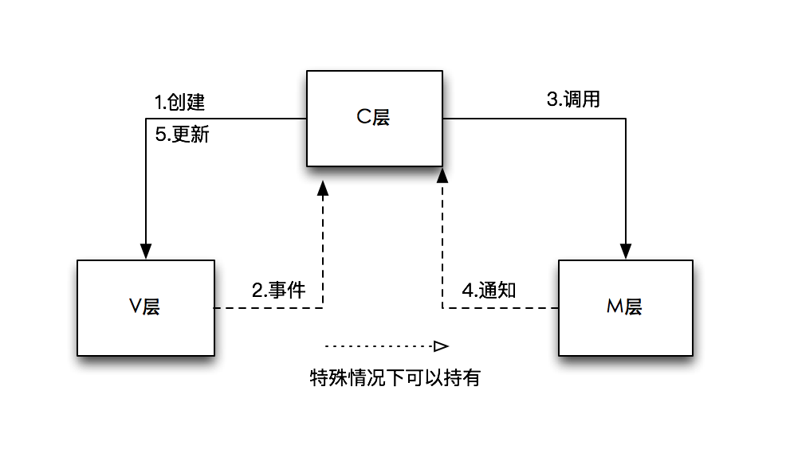
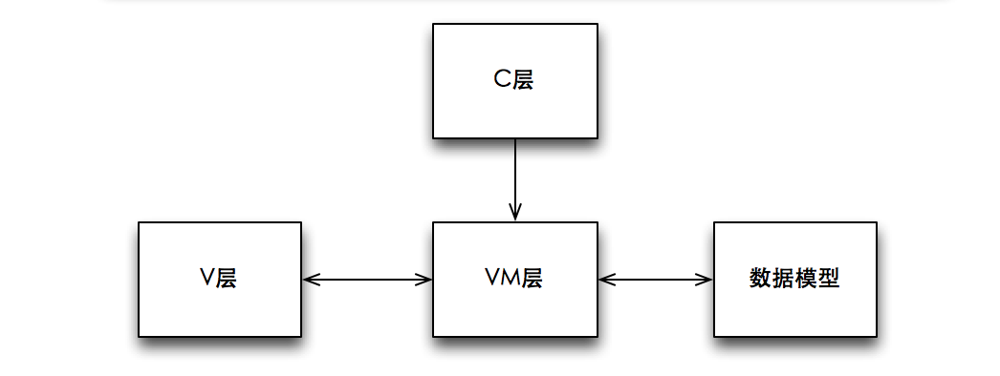
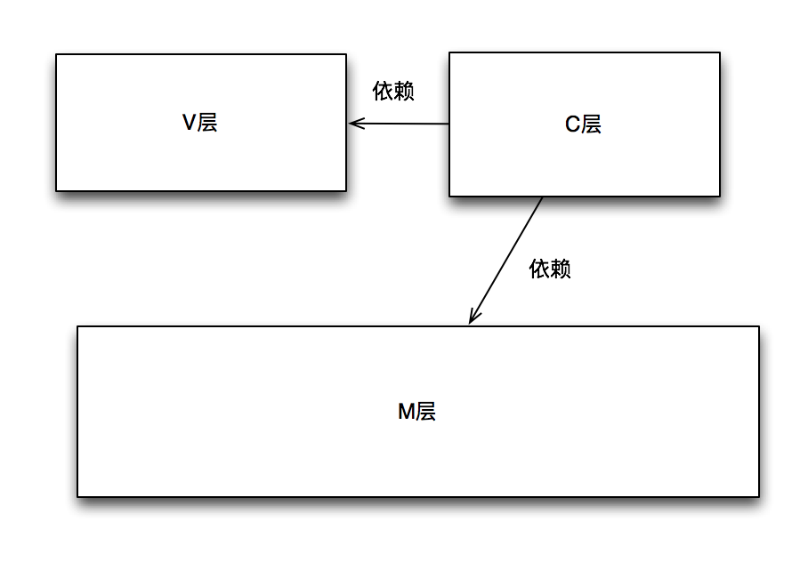
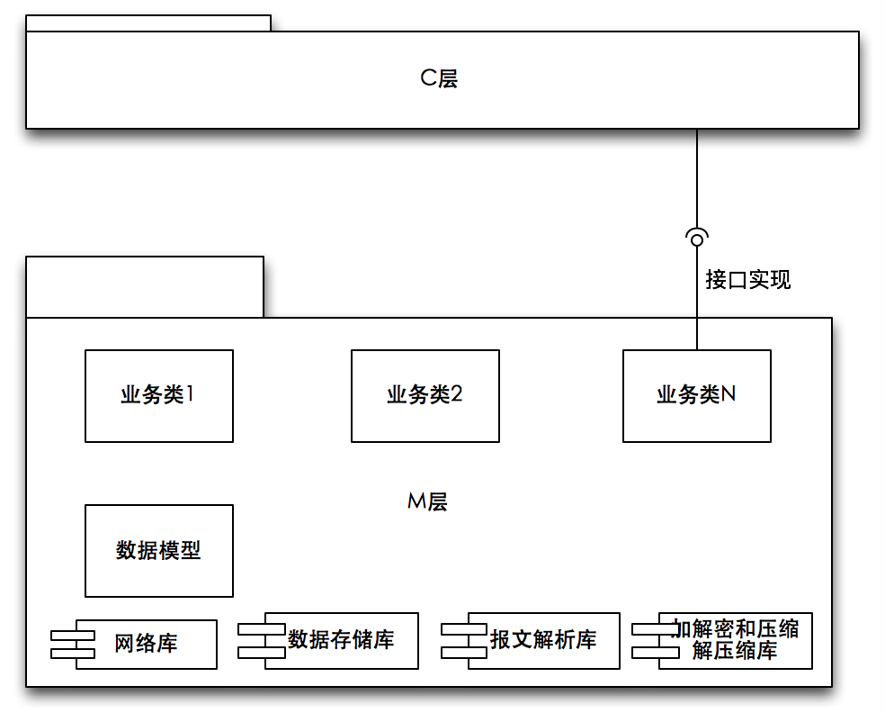
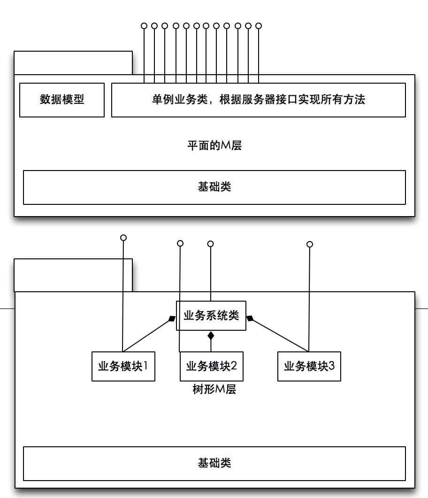
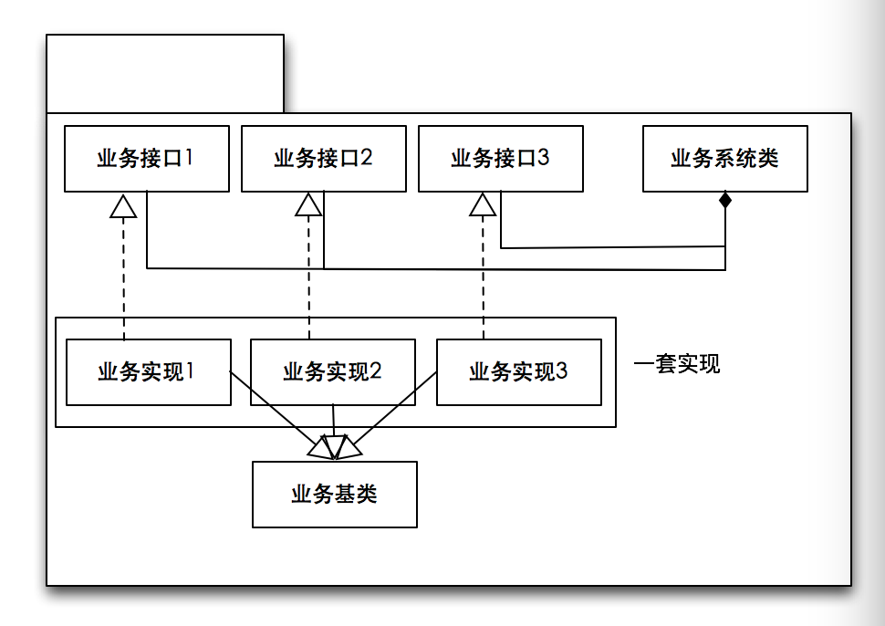

# 论MVVM伪框架结构和MVC中M的实现机制

## 目录

* MVC概论【本文】
* 模型层设计方法【请参考：http://www.jianshu.com/p/fce02188edec】
* 控制层的设计方法【请参考：https://www.jianshu.com/p/02d6397436dc】

一直都有人撰文吹捧MVVM应用开发框架，文章把MVVM说的天花乱坠并且批评包括iOS和android所用的MVC经典框架。这篇文章就是想给那些捧臭脚的人们泼泼冷水，虽然有可能招致骂声一片，但是目的是给那些刚入门的小伙伴一些参考和建议，以免误入歧途。同时也给那些深陷其中不能自拔的小伙伴们敲敲警钟，以免其在错误的道路上越走越远。

**------ MVVM并非框架，而只是简单的文件夹分类 ------**

## MVVM被引入的前因后果

大概是在2010年左右移动端开发火了起来，起初是iOS，Android, WinPhone三个大平台竞争，后来后者退出了角逐，变成了二分天下。从应用体系结构以及为开发者提供的框架体系来看，两个平台都是推出了经典MVC三层结构的开发方式，这三层所代表的意义是模型、视图、控制。这个开发框架的初衷其实也很简单： **视图负责展示和渲染，模型负责业务逻辑的实现，控制负责调度视图的事件以及业务逻辑的调用以及通知视图的刷新通知。** 三部分松散耦合，各司其职。下面是经典的MVC框架结构：



一个很可惜的事实是不管是Android和iOS都只对C和V两部分进行了标准的定义和实现：Android的视图部分的实现是定义了各种控件以及通过XML文件来组装视图布局界面，iOS的视图的实现也是定义了各种控件以及通过XIB或SB来组装视图布局界面； Android的控制部分则是通过Activity来实现，而iOS的控制部分则是通过UIViewController来实现的。而模型部分呢？因为每个应用的业务逻辑和应用场景并不相同，所以两个平台也无法也不能够定义出一个通用的模型层出来，而是把模型层的定义留给了开发者来实现。然而这为我们的开发者在使用MVC框架开发应用时埋下了隐患。

早期的应用开发相对简单，因为没有标准的模型层的定义，而控制层又在工程生成时留下了很多可供开发者写代码的地方，所以很多开发人员就自然而然的将业务逻辑、网络请求、数据库操作、报文拼装和解析等等全部代码都放入了控制层里面去了，根本就不需要什么模型层的定义。 这样随着时间的推移和应用的复杂增加，就出现了 **C层膨胀** 的情况了。一个控制器的代码可能出现了好几千行的场景。于是乎有人就开始找解决方案来为C层瘦身了。又一个很可惜的事实是还没有人去想着抽象出M层，而是用了如下方法来解决问题：

* 客户端和服务器之间交互的数据报文是否可以定义出一个个只有属性而没有方法的数据对象呢？这样在处理和渲染界面时就不需要和原始的XML或者JSON或者其他的格式报文交互了，只要操作数据对象就好了。于是解决方案就是根据客户端和服务器之间交互报文定义出一个个的数据模型，然后再开发出一套XML或者JSON和数据模型之间互转的解析器来。最后将这一个个只有数据而没有方法的对象数据模型统一放到一个地方，然后给他们定义为M模型层 *(呼！终于给出模型层的定义了，但是：Are you kidding me??)* 。这样C层就不会再出现XML或JSON解析以及直接读取报文的代码了！而是把这部分代码挪到模型层了 *(大家来看啊，我终于应用上了MVC框架了！)* 。 好了！瘦身第一步成功。但是但是，问题还在啊，我的业务逻辑还是一大片在C层啊，看来MVC这种框架也不过如此啊！根本没有解决我的问题。不行，我不能再用MVC这种框架来开发我的应用了，我要另找它法，要继续对C层瘦身。

* 我的某个界面和某个业务逻辑是绑定在一块的，这个界面的展示是通过调用某个业务逻辑来实现的，业务逻辑完成后要直接更新这个界面。这种紧密的调用和更新关系根本就不需要C层的介入。因此可以将这部分界面的更新刷新和业务逻辑的调用绑定在一块， 二者结合为一个封闭而独立的整体并形成独立的类。这样把这个类的代码抽离出来了，存放到一个单独的文件夹中。我把这个部分叫什么好呢？对了就叫视图模型层VM吧！视图模型层中的类定义了一个给外部使用的唯一接口来供C层调用。这样我终于把一大部分代码从C层中抽离出来了。我已经成功的实现了C层的进一步瘦身，并抽象出了一个视图模型层了！ *（不过哪里好像不对，视图模型层设计到了视图、模型、视图模型层三方面的交互和耦合）* 不过没有关系，反正我的C层进一步瘦身成功了！我看看还可不可以继续瘦身C层？



* 我的很多视图的事件是在C层中处理的，那我是不是可以把C层的事件处理也拿出来呢？ 干脆就拿出来吧。但是怎么拿出来呢？于是乎我又不停的寻找，终于找到一个叫RAC的东西了，这个东西好啊，他可以负责处理视图的各种事件，以及可以负责连续的网络调用。等等。。。 RAC就是有点晦涩难懂！难以学习，代码难以阅读和调试。怎么办？ 没有关系，只要是能将C层的代码瘦身这些又算什么。。。大不了就是多趟一点坑，多搞几次培训就好了。 嗯！ 就这么办，那我把这部分代码也放入到VM层里面去吧。

* 。。。。呼！！！ C层终于瘦身成功。然后大家看啊，我的C层里面真的是什么代码也没有了。。。 它不再处理视图的事件了，因为事件让RAC给处理了、它也不处理视图的刷新和业务逻辑的调用了因为让视图模型MV给处理掉了、他也不处理数据的解析了因为让模型层给替换掉了。嗯。。。。我要给这种没有C层或者不需要C层的框架起个名字，叫什么好呢？ 就叫：MVVM吧。。。 我的应用可以不要C层了，然后我就奔走相告。将C层无用大白于天下。。

**真的是这样吗？答案是NO！！！**

首先我想说的是一个优秀的框架中各层次的拆分并不是简单的将代码进行归类和划分， **层次的划分是横向的，而模块的划分则是纵向的** 。 这其中涉及到了层次之间的耦合性和职责的划分，以及层与层之间的交互接口定义和方式，同时层内的设计也应该具有高度的内聚性和结构性。而这些设计的要求并没有在所谓的MVVM中体现出来。

MVVM据说是来源于微软的数据视图的双向绑定技术。也就是有一个VM的类来实现数据的变化更新视图，视图的变化更新数据的处理，整个过程不需要再单独编码去处理。这个技术就和早年MFC里面的DDX/DDV技术相似。MVVM只是一种数据绑定技术的变种而不足以称为框架。框架中的层的要素要具有职责和功能的属性。就MVVM中所定义的M只能理解为纯数据。纵观整个iOS和android中的所有系统框架库都没有出现过让一批数据结构组成一个层的概念。即使如所谓的存储层也是数据库和表以及数据库引擎三者的结合体为一层。 其实之所以说控制器膨胀根源在于我们的手写布局视图在控制器中完成这里占用了非常多的代码， 业务处理和实现也在控制器中完成。苹果和Google已经给出了通过SB和XML来实现视图的构建。至于复杂的业务逻辑也完全可以通过拆分为多个子视图控制器或者多个Fragment 来完成。请问如果一个设计的足够好的C层，何来膨胀这么一说！

* 首先要正确的理解MVC中的M是什么？他是数据模型吗？答案是NO。他的正确定义是业务模型。也就是你所有业务数据和业务实现逻辑都应该定义在M层里面，而且业务逻辑的实现和定义应该和具体的界面无关，也就是和视图以及控制之间没有任何的关系，它是可以独立存在的，您甚至可以将业务模型单独编译出一个静态库来提供给第三方或者其他系统使用。在上面经典MVC图中也很清晰的描述了这一点： **控制负责调用模型，而模型则将处理结果发送通知给控制，控制再通知视图刷新** 。因此我们不能将M简单的理解为一个个干巴巴的只有属性而没有方法的数据模型。其实这里面涉及到一个最基本的设计原则，那就是面向对象的基本设计原则：就是什么是类？类应该是一个个具有相同操作和不同属性的对象的抽象。 **我想现在任何一个系统里面都没有出现过一堆只有数据而没有方法的数据模型的集合被定义为一个单独而抽象的模型层来供大家使用吧** 我们不能把一个保存数据模型的文件夹来当做一个层，这并不符合横向切分的规则。所以说MVVM里面的所谓对M层的定义就是一个伪概念。

* 上面我已经说明M层是业务模型层而非数据模型层，业务模型层应该封装所有的业务逻辑的实现，并且和具体视图无关。我们不能将一个视图的展现逻辑绑死在一个业务处理逻辑里面，因为有可能存在一个业务逻辑有多种不同的展现形式，也可能界面展示会随着应用升级而变化，但是业务逻辑是相对稳定的。即使是某个视图确实就跟这个业务是紧密耦合的，也不应该做强耦合绑定。所以上面所谓的VM这种将视图的展示和业务的处理逻辑绑定在一块是非常蹩脚的方式，因为这样的设计方式已经完全背离了系统里面最基本的展示和实现应该分离处理原则。而且这种设计的思维是和分层的理念是背离的。因为他出现了视图和业务的紧耦合和相互双向依赖问题，以及和所谓的M层也要紧耦合的存在。所以说MVVM里面所谓的VM层的定义也是一个伪概念。所谓的VM层这里面只不过是按页面进行的功能拆分而已，根本就谈不上所谓的层的概念。

* 再来说说事件处理。经典的C层设计的目的是负责事件处理和调度，不论是按钮点击还是UITableview的delegate以及ListView的Adapter都最好放在C层来处理，这也是符合C层最本质的定义：就是C层是一个负责调度和控制的模块，它是V层和M层的粘合剂，他的作用就是处理视图的事件，然后调用业务逻辑，然后接收业务逻辑的处理结果通知，然后再通知视图去刷新界面，这就是C层存在的意义。而且系统默认也是按这个方式设计的。而RAC的出现则将这部分的处理给活生生的代替掉了。也就是通过RAC所谓的响应式和触发式这种机制就能实现将事件的调度处理放在任何地方任何时候都能完成。这样做的目的使得我们可以分散和分解代码。但结果出现的问题呢？就是同一个单元调度处理逻辑和功能的构建完全放在了一个地方，但不同的单元逻辑的又分散在不同的地方，无法去分类统一管理和维护。因此你无法一下子就知道某个功能所有调度到底是如何实现以及在哪里实现的。因为 **RAC将功能构建和事件处理完全粘合到一个大的函数体内部，并且是代码套代码的模式，这种方式严重的破坏了面向对象里面的构建和处理分离的设计模式理论** 。更麻烦的是其高昂的学习和维护成本，代码阅读理解困难，以及无处不在的闭包使用。试想一下这个对于一个初学者来说是不是噩梦？，一旦出了问题对于维护和代码调试是不是噩梦？而且使用不当就会出现循环引用的严重问题。这样一来原本C层一个调度总管的职责被RAC来接管后，这些处理将变得分散和无序，当我们要做一些统一的管理比如HOOK和AOP方面的东西时就变得无法下手了。 不可否认的是RAC在处理连续调用以及顺序响应方面有一定的优势。一个例子是我们可能有连续的多个跟服务器的网络请求，这时候用RAC进行这种处理能方便的解决问题。但是我想说的是当存在这种场景时，我们更加应该将这种连续的网络调用在M层内部消化掉，而只给C层提供一个简易而方便的接口，让C层根本不需要关心这种调用的连续性。因此可以说为了把C层的代码给消化掉而引入RAC的机制，不仅没有简化掉系统反而降低了系统的可维护性和可读性。RAC机制根本就不适合用在事件处理中。 **优秀的应用和框架并不在代码的多寡，而是整体系统的代码简单易读，各部分职责分明，容易维护的调试**

**------ MVVM被引入的根本原因是对M层的错误认识所引起的 ------**

### MVC中M层实现的准则

说了那么多，可以总结出所谓的MVVM其实并不是一种所谓的框架或者模式，他只是一个伪框架而已，他只是将功能和处理按文件夹的方式进行了划分，最终的的结果是系统乱成了一锅粥。毫无层次可言，所具有的唯一优点是把C层的代码和功能完全弱化了。其实出现这种设计方法最根本的原因就是没有对M层进行正确的理解定义和拆分。那么我们应该如何正确的来定义和设计M层呢？下面是我个人认为的几个准则(也许跟其他人的理念有出入)：

* 定义的M层中的代码应该和V层和C层完全无关的，也就是M层的对象是不需要依赖任何C层和V层的对象而独立存在的。整个框架的设计最优结构是V层不依赖C层而独立存在，M层不依赖C层和V层独立存在，C层负责关联二者，V层只负责展示，M层持有数据和业务的具体实现，而C层则处理事件响应以及业务的调用以及通知界面更新。三者之间一定要明确的定义为单向依赖，而不应该出现双向依赖。下面是三层的依赖关系图：



**只有当你系统设计的不同部分都是单向依赖时，才可能方便的进行层次拆分以及每个层的功能独立替换。**

* M层要完成对业务逻辑实现的封装，一般业务逻辑最多的是涉及到客户端和服务器之间的业务交互。M层里面要完成对使用的网络协议(HTTP, TCP，其他)、和服务器之间交互的数据格式（XML, JSON,其他)、本地缓存和数据库存储（COREDATA, SQLITE,其他)等所有业务细节的封装，而且这些东西都不能暴露给C层。所有供C层调用的都是M层里面一个个业务类所提供的成员方法来实现。也就是说C层是不需要知道也不应该知道和客户端和服务器通信所使用的任何协议，以及数据报文格式，以及存储方面的内容。这样的好处是客户端和服务器之间的通信协议，数据格式，以及本地存储的变更都不会影响任何的应用整体框架，因为提供给C层的接口不变，只需要升级和更新M层的代码就可以了。比如说我们想将网络请求库从ASI换成AFN就只要在M层变化就可以了，整个C层和V层的代码不变。下面是M层内部层次的定义图：



* 既然我们的应用是一个整体但又分模块，那么业务层内部也应该按功能模块进行结构划分，而不应该简单且平面的按照和服务器之间通信的接口来进行业务层次的平面封装。我相信有不少人都是对M层的封装就是简单的按照和服务器之间的交互接口来简单的封装。下面的两种不同的M层实现的业务封装方式：



我们还可以进一步的对业务逻辑抽象出M层的接口和实现两部分，这样的一个好处是相同的接口可以有不同的实现方式，以及M层可以隐藏非常多的内部数据和方法而不暴露给调用者知道。通过接口和实现分离我们还可以在不改变原来实现的基础上，重新重构业务部分的实现，同时这种模式也很容易MOCK一个测试实现，这样在进行调试时可以很简单的在真实实现和MOCK实现之间切换，而不必每次都和服务器端进行交互调试，从而实现客户端和服务器之间的分别开发和调试。下面是一个升级版本的M层体系结构：



* M层如何和C层交互的问题也需要考虑，因为M层是不需要知道C层和V层的存在的，那么M层在业务处理完毕后如何去通知C层呢？方法有很多种：

	* 我们可以为M层的通知逻辑定义Delegate协议，然后让C层去实现这些协议，然后M层提供一个delegate属性来赋值处理业务通知的对象。
	* 我们也可以定义众多的NSNotification或者事件总线，然后当M层的业务处理完毕后可以发送通知，并且在C层实现通知的处理逻辑。
	* 我们可以用闭包回调或者接口匿名实现对象的形式来实现业务逻辑完成的通知功能。而且可以定义出标准：所有M层对象的方法的最后一个参数都是一个标准的如下格式的block或者接口回调：

```
typedef void (^UICallback)(id obj, NSError * error);
```

这种模式其实在很多系统中有应用到。大家可以参数考苹果的CoreLocation.framework中的地理位置反解析的类CLGeocoder的定义。还有一点的是在AFN以及ASI中的网络请求部分都是把成功和失败的处理分成了2个block回调，但是这里建议在给C层的异步通知回调里面不区分2个block来调用，而是一个block用2个参数来解决。因为有可能我们的处理中不管成功还是失败都可能有部分代码是相似的，如果分开则会出现重复代码的问题。

### MVC中M层实现的简单举例

最后我们以一个简单的用户体系的登录系统来实现一个M层。

1.定义标准的M层异步回调接口：

```
//定义标准的C层回调block。这里面的obj会根据不同对象的方法的返回而有差异。
typedef void (^UICallback)(id obj, NSError * error);

//这里定义标准的数据解析block,这个block供M层内部解析用，不对外暴露
typedef id (^DataParse)(id retData, NSError * error);
```

2.定义所有M层业务类的基类，这样在通用基类里面我们可以做很多处理。比如网络层的统一调用，加解密，压缩解压缩，我们还可以做AOP和HOOK方面的处理。

```
@interface  ModelBase
          
           //定义一个停止请求的方法
           -(void) stopRequest;
           /**
             *定义一个网络请求的唯一入口方法
             * url 请求的URL
             * inParam: 入参
             * outParse: 返回数据解析block，由派生类实现
             * callback: C层通知block
             */
           -(void) startRequest:(NSString*)url  inParam:(id)inParam outParse:(DataParse)outParse  callback:(UICallback)callback;
     @end
```

3.定义一个用户类：

```
@interface  ModelUser:ModelBase
  
        @property(readonly) BOOL isLogin;
        @property(readonly) NSString *name;
       
       //定义登录方法，注意这个登录方法的实现内部可能会连续做N个网络请求，但是我们要求都在login方法内部处理，而不暴露给C层。
       -(void)login:(NSString*)name  password:(NSString*)password   callback:(UICallback)callback;
        //定义退出登录方法
       -(void)logout:(UICallback)callback;
    @end
```

4.定义一个M层总体系统类(可选)，这个类可以是单例对象：

```
@interface ModelSystem:ModelBase
 
     +(ModelSystem*)sharedInstance;

    //聚合用户对象，注意这里是readonly的，也就是C层是不能直接修改用户对象，这样保证了安全，也表明了C层对用户对象的使用权限。
    @property(readonly)  ModelUser *user;  

    //定义其他聚合的模块

    @end
```

5.在C层调用用户登录：

```
@implementation LoginViewController

    -(IBAction)handleLogin:(UIButton*)sender
   {
        sender.userInteractionEnabled = NO;
        __weak LoginViewController  *weakSelf = self;
       [[ModelSystem sharedInstance].user  login:@"aaa" password:@"bbb"  callback:^(ModelUser *user, NSError *error){

        if (weakSelf == nil)
               return;
       sender.userInteractionEnabled = YES;
       if (error == nil)
       {
              //登录成功，页面跳转
       }
       else
      {
            //显示error的错误信息。。
      }}];
         
   }

   @end
```

可以看出上面的C层的部分非常简单明了，代码也易读和容易理解。同时我们还看到了C层跟本不需要知道M层的登录实现到底是如何请求网络的，以及请求了几个网络操作，以及用的什么协议，以及什么数据报文格式，所有的这一切都封装在了M层内部实现了。C层所要做的就是简单的调用M层所提供的方法，然后在callback中通知界面更新即可。整个C层的逻辑也就是几十行就能搞定了。

**具体的模型层设计方法请参考** ： [M层的设计](https://www.jianshu.com/p/fce02188edec)

欢迎大家关注我的 [github](https://link.jianshu.com?t=https%3A%2F%2Fgithub.com%2Fyoungsoft) 地址，关注 **欧阳大哥2013** ，关注我的简书地址： [http://www.jianshu.com/u/3c9287519f58](https://www.jianshu.com/u/3c9287519f58)

[论MVVM伪框架结构和MVC中M的实现机制](https://www.jianshu.com/p/33c7e2f3a613)