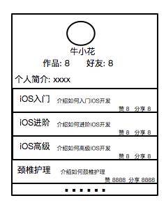
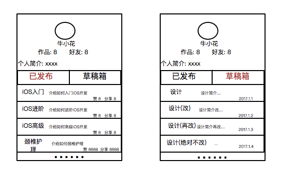
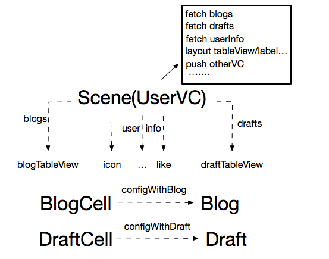
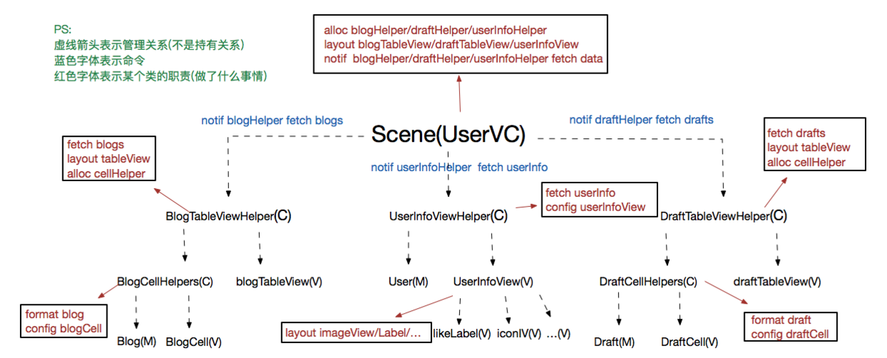
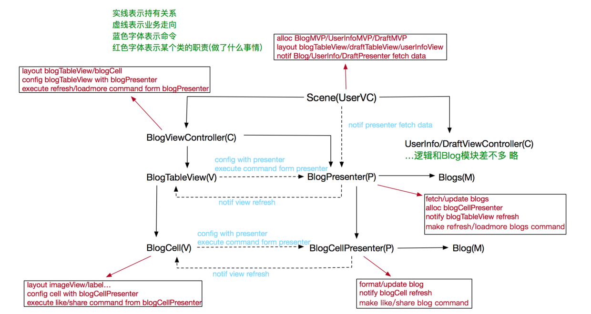

# 杂谈: MVC/MVP/MVVM  

## 前言

本文为回答一位朋友关于MVC/MVP/MVVM架构方面的疑问所写, 旨在介绍iOS下MVC/MVP/MVVM三种架构的设计思路以及各自的优缺点. 全文约五千字, 预计花费阅读时间20 - 30分钟.

## MVC

### MVC的相关概念

MVC最早存在于桌面程序中的, M是指业务数据, V是指用户界面, C则是控制器. 在具体的业务场景中, C作为M和V之间的连接, 负责获取输入的业务数据, 然后将处理后的数据输出到界面上做相应展示, 另外, 在数据有所更新时, C还需要及时提交相应更新到界面展示. 在上述过程中, 因为M和V之间是完全隔离的, 所以在业务场景切换时, 通常只需要替换相应的C, 复用已有的M和V便可快速搭建新的业务场景. MVC因其复用性, 大大提高了开发效率, 现已被广泛应用在各端开发中.

概念过完了, 下面来看看, 在具体的业务场景中MVC/MVP/MVVM都是如何表现的.

### MVC之消失的C层


上图中的页面(业务场景)或者类似页面相信大家做过不少, 各个程序员的具体实现方式可能各不一样, 这里说说我所看到的大多数小白程序员的写法:

```
//UserVC
- (void)viewDidLoad {
    [super viewDidLoad];

    [[UserApi new] fetchUserInfoWithUserId:132 completionHandler:^(NSError *error, id result) {
        if (error) {
            [self showToastWithText:@"获取用户信息失败了~"];
        } else {

            self.userIconIV.image = ...
            self.userSummaryLabel.text = ...
            ...
        }
    }];

    [[userApi new] fetchUserBlogsWithUserId:132 completionHandler:^(NSError *error, id result) {
        if (error) {
            [self showErrorInView:self.tableView info:...];
        } else {

            [self.blogs addObjectsFromArray:result];
            [self.tableView reloadData];
        }
    }];
}
//...略
- (UITableViewCell *)tableView:(UITableView *)tableView cellForRowAtIndexPath:(NSIndexPath *)indexPath {
    BlogCell *cell = [tableView dequeueReusableCellWithIdentifier:@"BlogCell"];
    cell.blog = self.blogs[indexPath.row];
    return cell;
}

- (void)tableView:(UITableView *)tableView didSelectRowAtIndexPath:(NSIndexPath *)indexPath {
    [self.navigationController pushViewController:[BlogDetailViewController instanceWithBlog:self.blogs[indexPath.row]] animated:YES];
}
//...略
```

```
//BlogCell
- (void)setBlog:(Blog)blog {
    _blog = blog;
    
    self.authorLabel.text = blog.blogAuthor;
    self.likeLebel.text = [NSString stringWithFormat:@"赞 %ld", blog.blogLikeCount];
    ...
}
```

小白很快写完了代码, Command+R一跑, 没有问题, 心满意足的做其他事情去了. 后来有一天, 产品要求这个业务需要改动, 用户在看他人信息时是上图中的页面, 看自己的信息时, 多一个草稿箱的展示, 像这样:


于是小白将代码改成这样:

```
//UserVC
- (void)viewDidLoad {
    [super viewDidLoad];

    if (self.userId != LoginUserId) {
        self.switchButton.hidden = self.draftTableView.hidden = YES;
        self.blogTableView.frame = ...
    }

    [[UserApi new] fetchUserI......略
    [[UserApi new] fetchUserBlogsWithUserId:132 completionHandler:^(NSError *error, id result) {
        //if Error...略
        [self.blogs addObjectsFromArray:result];
        [self.blogTableView reloadData];

    }];

    [[userApi new] fetchUserDraftsWithUserId:132 completionHandler:^(NSError *error, id result) {
        //if Error...略
        [self.drafts addObjectsFromArray:result];
        [self.draftTableView reloadData];
    }];
}

- (NSInteger)tableView:(UITableView *)tableView numberOfRowsInSection:(NSInteger)section {
     return tableView == self.blogTableView ? self.blogs.count : self.drafts.count;
}

//...略
- (UITableViewCell *)tableView:(UITableView *)tableView cellForRowAtIndexPath:(NSIndexPath *)indexPath {

    if (tableView == self.blogTableView) {
        BlogCell *cell = [tableView dequeueReusableCellWithIdentifier:@"BlogCell"];
        cell.blog = self.blogs[indexPath.row];
        return cell;
    } else {
        DraftCell *cell = [tableView dequeueReusableCellWithIdentifier:@"DraftCell"];
        cell.draft = self.drafts[indexPath.row];
        return cell;
    }
}

- (void)tableView:(UITableView *)tableView didSelectRowAtIndexPath:(NSIndexPath *)indexPath {
    if (tableView == self.blogTableView) ...
}
//...略
//DraftCell
- (void)setDraft:(draft)draft {
    _draft = draft;
    self.draftEditDate = ...
}
```

```
//BlogCell
- (void)setBlog:(Blog)blog {
    ...同上
}
```

后来啊, 产品觉得用户看自己的页面再加个回收站什么的会很好, 于是程序员又加上一段代码逻辑 , 再后来...

随着需求的变更, UserVC变得越来越臃肿, 越来越难以维护, 拓展性和测试性也极差. 小白也发现好像代码写得有些问题, 但是问题具体出在哪里? 难道这不是MVC吗?

我们将上面的过程用一张图来表示:



通过这张图可以发现, 用户信息页面作为业务场景Scene需要展示多种数据M(Blog/Draft/UserInfo), 所以对应的有多个View(blogTableView/draftTableView/image...), 但是, 每个MV之间并没有一个连接层C, 本来应该分散到各个C层处理的逻辑全部被打包丢到了Scene这一个地方处理, 也就是M-C-V变成了MM...-Scene-...VV, C层就这样莫名其妙的消失了.

另外, 作为V的两个cell直接耦合了M(blog/draft), 这意味着这两个V的输入被绑死到了相应的M上, 复用无从谈起.

最后, 针对这个业务场景的测试异常麻烦, 因为业务初始化和销毁被绑定到了VC的生命周期上, 而相应的逻辑也关联到了和View的点击事件, 测试只能Command+R, 点点点...

### 正确的MVC使用姿势

也许是UIViewController的类名给新人带来了迷惑, 让人误以为VC就一定是MVC中的C层, 又或许是Button, Label之类的View太过简单完全不需要一个C层来配合, 总之, 我工作以来经历的项目中见过太多这样的"MVC". 那么, 什么才是正确的MVC使用姿势呢?

仍以上面的业务场景举例, 正确的MVC应该是这个样子的:


UserVC作为业务场景, 需要展示三种数据, 对应的就有三个MVC, 这三个MVC负责各自模块的数据获取, 数据处理和数据展示, 而UserVC需要做的就是配置好这三个MVC, 并在合适的时机通知各自的C层进行数据获取, 各个C层拿到数据后进行相应处理, 处理完成后渲染到各自的View上, UserVC最后将已经渲染好的各个View进行布局即可, 具体到代码中如下:

```
@interface BlogTableViewHelper : NSObject(UITableViewDelegate, UITableViewDataSource)（识别问题此处圆括号替换尖括号）

+ (instancetype)helperWithTableView:(UITableView *)tableView userId:(NSUInteger)userId;

- (void)fetchDataWithCompletionHandler:(NetworkTaskCompletionHander)completionHander;
- (void)setVCGenerator:(ViewControllerGenerator)VCGenerator;

@end
```

```
@interface BlogTableViewHelper()

@property (weak, nonatomic) UITableView *tableView;
@property (copy, nonatomic) ViewControllerGenerator VCGenerator;

@property (assign, nonatomic) NSUInteger userId;
@property (strong, nonatomic) NSMutableArray *blogs;
@property (strong, nonatomic) UserAPIManager *apiManager;

@end
#define BlogCellReuseIdentifier @"BlogCell"
@implementation BlogTableViewHelper

+ (instancetype)helperWithTableView:(UITableView *)tableView userId:(NSUInteger)userId {
    return [[BlogTableViewHelper alloc] initWithTableView:tableView userId:userId];
}

- (instancetype)initWithTableView:(UITableView *)tableView userId:(NSUInteger)userId {
    if (self = [super init]) {

        self.userId = userId;
        tableView.delegate = self;
        tableView.dataSource = self;
        self.apiManager = [UserAPIManager new];
        self.tableView = tableView;

        __weak typeof(self) weakSelf = self;
        [tableView registerClass:[BlogCell class] forCellReuseIdentifier:BlogCellReuseIdentifier];
        tableView.header = [MJRefreshAnimationHeader headerWithRefreshingBlock:^{//下拉刷新
               [weakSelf.apiManage refreshUserBlogsWithUserId:userId completionHandler:^(NSError *error, id result) {
                    //...略
           }];
        }];
        tableView.footer = [MJRefreshAnimationFooter headerWithRefreshingBlock:^{//上拉加载
                [weakSelf.apiManage loadMoreUserBlogsWithUserId:userId completionHandler:^(NSError *error, id result) {
                    //...略
           }];
        }];
    }
    return self;
}

#pragma mark - UITableViewDataSource && Delegate
//...略
- (NSInteger)tableView:(UITableView *)tableView numberOfRowsInSection:(NSInteger)section {
    return self.blogs.count;
}

- (UITableViewCell *)tableView:(UITableView *)tableView cellForRowAtIndexPath:(NSIndexPath *)indexPath {

    BlogCell *cell = [tableView dequeueReusableCellWithIdentifier:BlogCellReuseIdentifier];
    BlogCellHelper *cellHelper = self.blogs[indexPath.row];
    if (!cell.didLikeHandler) {
        __weak typeof(cell) weakCell = cell;
        [cell setDidLikeHandler:^{
            cellHelper.likeCount += 1;
            weakCell.likeCountText = cellHelper.likeCountText;
        }];
    }
    cell.authorText = cellHelper.authorText;
    //...各种设置
    return cell;
}

- (void)tableView:(UITableView *)tableView didSelectRowAtIndexPath:(NSIndexPath *)indexPath {
    [self.navigationController pushViewController:self.VCGenerator(self.blogs[indexPath.row]) animated:YES];
}

#pragma mark - Utils

- (void)fetchDataWithCompletionHandler:(NetworkTaskCompletionHander)completionHander {

    [[UserAPIManager new] refreshUserBlogsWithUserId:self.userId completionHandler:^(NSError *error, id result) {
        if (error) {
            [self showErrorInView:self.tableView info:error.domain];
        } else {

            for (Blog *blog in result) {
                [self.blogs addObject:[BlogCellHelper helperWithBlog:blog]];
            }
            [self.tableView reloadData];
        }
      completionHandler ? completionHandler(error, result) : nil;
    }];
}
//...略
@end
```

```
@implementation BlogCell
//...略
- (void)onClickLikeButton:(UIButton *)sender {
    [[UserAPIManager new] likeBlogWithBlogId:self.blogId userId:self.userId completionHandler:^(NSError *error, id result) {
        if (error) {
            //do error
        } else {
            //do success
            self.didLikeHandler ? self.didLikeHandler() : nil;
        }
    }];
}
@end
```

```
@implementation BlogCellHelper

- (NSString *)likeCountText {
    return [NSString stringWithFormat:@"赞 %ld", self.blog.likeCount];
}
//...略
- (NSString *)authorText {
    return [NSString stringWithFormat:@"作者姓名: %@", self.blog.authorName];
}
@end
```

Blog模块由BlogTableViewHelper(C), BlogTableView(V), Blogs(C)构成, 这里有点特殊, blogs里面装的不是M, 而是Cell的C层CellHelper, 这是因为Blog的MVC其实又是由多个更小的MVC组成的. M和V没什么好说的, 主要说一下作为C的TableVIewHelper做了什么.

实际开发中, 各个模块的View可能是在Scene对应的Storyboard中新建并布局的, 此时就不用各个模块自己建立View了(比如这里的BlogTableViewHelper), 让Scene传到C层进行管理就行了, 当然, 如果你是纯代码的方式, 那View就需要相应模块自行建立了(比如下文的UserInfoViewController), 这个看自己的意愿, 无伤大雅.

BlogTableViewHelper对外提供获取数据和必要的构造方法接口, 内部根据自身情况进行相应的初始化.

当外部调用fetchData的接口后, Helper就会启动获取数据逻辑, 因为数据获取前后可能会涉及到一些页面展示(HUD之类的), 而具体的展示又是和Scene直接相关的(有的Scene展示的是HUD有的可能展示的又是一种样式或者根本不展示), 所以这部分会以CompletionHandler的形式交由Scene自己处理.

在Helper内部, 数据获取失败会展示相应的错误页面, 成功则建立更小的MVC部分并通知其展示数据(也就是通知CellHelper驱动Cell), 另外, TableView的上拉刷新和下拉加载逻辑也是隶属于Blog模块的, 所以也在Helper中处理.

在页面跳转的逻辑中, 点击跳转的页面是由Scene通过VCGeneratorBlock直接配置的, 所以也是解耦的(你也可以通过didSelectRowHandler之类的方式传递数据到Scene层, 由Scene做跳转, 是一样的).

最后, V(Cell)现在只暴露了Set方法供外部进行设置, 所以和M(Blog)之间也是隔离的, 复用没有问题.

这一系列过程都是自管理的, 将来如果Blog模块会在另一个SceneX展示, 那么SceneX只需要新建一个BlogTableViewHelper, 然后调用一下helper.fetchData即可.

DraftTableViewHelper和BlogTableViewHelper逻辑类似, 就不贴了, 简单贴一下UserInfo模块的逻辑:

```
@implementation UserInfoViewController

+ (instancetype)instanceUserId:(NSUInteger)userId {
    return [[UserInfoViewController alloc] initWithUserId:userId];
}

- (instancetype)initWithUserId:(NSUInteger)userId {
  //    ...略
    [self addUI];
  //    ...略
}

#pragma mark - Action

- (void)onClickIconButton:(UIButton *)sender {
    [self.navigationController pushViewController:self.VCGenerator(self.user) animated:YES];
}

#pragma mark - Utils

- (void)addUI {

    //各种UI初始化 各种布局
    self.userIconIV = [[UIImageView alloc] initWithFrame:CGRectZero];
    self.friendCountLabel = ...
    ...
}

- (void)fetchData {

    [[UserAPIManager new] fetchUserInfoWithUserId:self.userId completionHandler:^(NSError *error, id result) {
        if (error) {
            [self showErrorInView:self.view info:error.domain];
        } else {

            self.user = [User objectWithKeyValues:result];
            self.userIconIV.image = [UIImage imageWithURL:[NSURL URLWithString:self.user.url]];//数据格式化
            self.friendCountLabel.text = [NSString stringWithFormat:@"赞 %ld", self.user.friendCount];//数据格式化
            ...
        }
    }];
}

@end
```

UserInfoViewController除了比两个TableViewHelper多个addUI的子控件布局方法, 其他逻辑大同小异, 也是自己管理的MVC, 也是只需要初始化即可在任何一个Scene中使用.

现在三个自管理模块已经建立完成, UserVC需要的只是根据自己的情况做相应的拼装布局即可, 就和搭积木一样:

```
@interface UserViewController ()

@property (assign, nonatomic) NSUInteger userId;
@property (strong, nonatomic) UserInfoViewController *userInfoVC;

@property (strong, nonatomic) UITableView *blogTableView;
@property (strong, nonatomic) BlogTableViewHelper *blogTableViewHelper;

@end

@interface SelfViewController : UserViewController

@property (strong, nonatomic) UITableView *draftTableView;
@property (strong, nonatomic) DraftTableViewHelper *draftTableViewHelper;

@end

#pragma mark - UserViewController

@implementation UserViewController

+ (instancetype)instanceWithUserId:(NSUInteger)userId {
    if (userId == LoginUserId) {
        return [[SelfViewController alloc] initWithUserId:userId];
    } else {
        return [[UserViewController alloc] initWithUserId:userId];
    }
}

- (void)viewDidLoad {
    [super viewDidLoad];

    [self addUI];

    [self configuration];

    [self fetchData];
}

#pragma mark - Utils(UserViewController)

- (void)addUI {

    //这里只是表达一下意思 具体的layout逻辑肯定不是这么简单的
    self.userInfoVC = [UserInfoViewController instanceWithUserId:self.userId];
    self.userInfoVC.view.frame = CGRectZero;
    [self.view addSubview:self.userInfoVC.view];
    [self.view addSubview:self.blogTableView = [[UITableView alloc] initWithFrame:CGRectZero style:0]];
}

- (void)configuration {

    self.title = @"用户详情";
//    ...其他设置

    [self.userInfoVC setVCGenerator:^UIViewController *(id params) {
        return [UserDetailViewController instanceWithUser:params];
    }];

    self.blogTableViewHelper = [BlogTableViewHelper helperWithTableView:self.blogTableView userId:self.userId];
    [self.blogTableViewHelper setVCGenerator:^UIViewController *(id params) {
        return [BlogDetailViewController instanceWithBlog:params];
    }];
}

- (void)fetchData {

    [self.userInfoVC fetchData];//userInfo模块不需要任何页面加载提示
    [HUD show];//blog模块可能就需要HUD
    [self.blogTableViewHelper fetchDataWithcompletionHandler:^(NSError *error, id result) {
      [HUD hide];
    }];
}

@end

#pragma mark - SelfViewController

@implementation SelfViewController
- (void)viewDidLoad {
    [super viewDidLoad];

    [self addUI];

    [self configuration];

    [self fetchData];
}

#pragma mark - Utils(SelfViewController)

- (void)addUI {
    [super addUI];

    [self.view addSubview:switchButton];//特有部分...
    //...各种设置
    [self.view addSubview:self.draftTableView = [[UITableView alloc] initWithFrame:CGRectZero style:0]];
}

- (void)configuration {
    [super configuration];

    self.draftTableViewHelper = [DraftTableViewHelper helperWithTableView:self.draftTableView userId:self.userId];
    [self.draftTableViewHelper setVCGenerator:^UIViewController *(id params) {
        return [DraftDetailViewController instanceWithDraft:params];
    }];
}

- (void)fetchData {
    [super fetchData];
    [self.draftTableViewHelper fetchData];
}

@end
```

作为业务场景的的Scene(UserVC)做的事情很简单, 根据自身情况对三个模块进行配置(configuration), 布局(addUI), 然后通知各个模块启动(fetchData)就可以了, 因为每个模块的展示和交互是自管理的, 所以Scene只需要负责和自身业务强相关的部分即可. 另外, 针对自身访问的情况我们建立一个UserVC子类SelfVC, SelfVC做的也是类似的事情.

MVC到这就说的差不多了, 对比上面错误的MVC方式, 我们看看解决了哪些问题:

1. 代码复用: 三个小模块的V(cell/userInfoView)对外只暴露Set方法, 对M甚至C都是隔离状态, 复用完全没有问题. 三个大模块的MVC也可以用于快速构建相似的业务场景(大模块的复用比小模块会差一些, 下文我会说明).

2. 代码臃肿: 因为Scene大部分的逻辑和布局都转移到了相应的MVC中, 我们仅仅是拼装MVC的便构建了两个不同的业务场景, 每个业务场景都能正常的进行相应的数据展示, 也有相应的逻辑交互, 而完成这些东西, 加空格也就100行代码左右(当然, 这里我忽略了一下Scene的布局代码).

3. 易拓展性: 无论产品未来想加回收站还是防御塔, 我需要的只是新建相应的MVC模块, 加到对应的Scene即可.

4. 可维护性: 各个模块间职责分离, 哪里出错改哪里, 完全不影响其他模块. 另外, 各个模块的代码其实并不算多, 哪一天即使写代码的人离职了, 接手的人根据错误提示也能快速定位出错模块.

5. 易测试性: 很遗憾, 业务的初始化依然绑定在Scene的生命周期中, 而有些逻辑也仍然需要UI的点击事件触发, 我们依然只能Command+R, 点点点...

### MVC的缺点

可以看到, 即使是标准的MVC架构也并非完美, 仍然有部分问题难以解决, 那么MVC的缺点何在? 总结如下:

1. 过度的注重隔离: 这个其实MV(x)系列都有这缺点, 为了实现V层的完全隔离, V对外只暴露Set方法, 一般情况下没什么问题, 但是当需要设置的属性很多时, 大量重复的Set方法写起来还是很累人的.

2. 业务逻辑和业务展示强耦合: 可以看到, 有些业务逻辑(页面跳转/点赞/分享...)是直接散落在V层的, 这意味着我们在测试这些逻辑时, 必须首先生成对应的V, 然后才能进行测试. 显然, 这是不合理的. 因为业务逻辑最终改变的是数据M, 我们的关注点应该在M上, 而不是展示M的V.

## MVP

MVC的缺点在于并没有区分业务逻辑和业务展示, 这对单元测试很不友好. MVP针对以上缺点做了优化, 它将业务逻辑和业务展示也做了一层隔离, 对应的就变成了MVCP. M和V功能不变, 原来的C现在只负责布局, 而所有的逻辑全都转移到了P层.

对应关系如图所示:


业务场景没有变化, 依然是展示三种数据, 只是三个MVC替换成了三个MVP(图中我只画了Blog模块), UserVC负责配置三个MVP(新建各自的VP, 通过VP建立C, C会负责建立VP之间的绑定关系), 并在合适的时机通知各自的P层(之前是通知C层)进行数据获取, 各个P层在获取到数据后进行相应处理, 处理完成后会通知绑定的View数据有所更新, V收到更新通知后从P获取格式化好的数据进行页面渲染, UserVC最后将已经渲染好的各个View进行布局即可. 另外, V层C层不再处理任何业务逻辑, 所有事件触发全部调用P层的相应命令, 具体到代码中如下:

```
@interface BlogPresenter : NSObject

+ (instancetype)instanceWithUserId:(NSUInteger)userId;

- (NSArray *)allDatas;//业务逻辑移到了P层 和业务相关的M也跟着到了P层
- (void)refreshUserBlogsWithCompletionHandler:(NetworkTaskCompletionHander)completionHandler;
- (void)loadMoreUserBlogsWithCompletionHandler:(NetworkTaskCompletionHander)completionHandler;

@end
```

```
@interface BlogPresenter()

@property (assign, nonatomic) NSUInteger userId;
@property (strong, nonatomic) NSMutableArray *blogs;
@property (strong, nonatomic) UserAPIManager *apiManager;

@end

@implementation BlogPresenter

+ (instancetype)instanceWithUserId:(NSUInteger)userId {
    return [[BlogPresenter alloc] initWithUserId:userId];
}

- (instancetype)initWithUserId:(NSUInteger)userId {
    if (self = [super init]) {
        self.userId = userId;
        self.apiManager = [UserAPIManager new];
        //...略
    }
}

#pragma mark - Interface

- (NSArray *)allDatas {
    return self.blogs;
}
//提供给外层调用的命令
- (void)refreshUserBlogsWithCompletionHandler:(NetworkTaskCompletionHander)completionHandler {

    [self.apiManager refreshUserBlogsWithUserId:self.userId completionHandler:^(NSError *error, id result) {
        if (!error) {

            [self.blogs removeAllObjects];//清空之前的数据
            for (Blog *blog in result) {
                [self.blogs addObject:[BlogCellPresenter presenterWithBlog:blog]];
            }
        }
        completionHandler ? completionHandler(error, result) : nil;
    }];
}
//提供给外层调用的命令
- (void)loadMoreUserBlogsWithCompletionHandler:(NetworkTaskCompletionHander)completionHandler {
    [self.apiManager loadMoreUserBlogsWithUserId:self.userId completionHandler...]
}

@end
```

```
@interface BlogCellPresenter : NSObject

+ (instancetype)presenterWithBlog:(Blog *)blog;

- (NSString *)authorText;
- (NSString *)likeCountText;

- (void)likeBlogWithCompletionHandler:(NetworkTaskCompletionHander)completionHandler;
- (void)shareBlogWithCompletionHandler:(NetworkTaskCompletionHander)completionHandler;
@end
```

```
@implementation BlogCellPresenter

- (NSString *)likeCountText {
    return [NSString stringWithFormat:@"赞 %ld", self.blog.likeCount];
}

- (NSString *)authorText {
    return [NSString stringWithFormat:@"作者姓名: %@", self.blog.authorName];
}
//    ...略
- (void)likeBlogWithCompletionHandler:(NetworkTaskCompletionHander)completionHandler {

    [[UserAPIManager new] likeBlogWithBlogId:self.blogId userId:self.userId completionHandler:^(NSError *error, id result) {
        if (error) {
            //do fail
        } else {
            //do success
            self.blog.likeCount += 1;
        }
        completionHandler ? completionHandler(error, result) : nil;
    }];
}
//    ...略
@end
```

BlogPresenter和BlogCellPresenter分别作为BlogViewController和BlogCell的P层, 其实就是一系列业务逻辑的集合. BlogPresenter负责获取Blogs原始数据并通过这些原始数据构造BlogCellPresenter, 而BlogCellPresenter提供格式化好的各种数据以供Cell渲染, 另外, 点赞和分享的业务现在也转移到了这里.

业务逻辑被转移到了P层, 此时的V层只需要做两件事:

1.监听P层的数据更新通知, 刷新页面展示.

2.在点击事件触发时, 调用P层的对应方法, 并对方法执行结果进行展示.

```
@interface BlogCell : UITableViewCell
@property (strong, nonatomic) BlogCellPresenter *presenter;
@end
```

```
@implementation BlogCell

- (void)setPresenter:(BlogCellPresenter *)presenter {
    _presenter = presenter;
    //从Presenter获取格式化好的数据进行展示
    self.authorLabel.text = presenter.authorText;
    self.likeCountLebel.text = presenter.likeCountText;
//    ...略
}

#pragma mark - Action

- (void)onClickLikeButton:(UIButton *)sender {
    [self.presenter likeBlogWithCompletionHandler:^(NSError *error, id result) {
        if (!error) {//页面刷新
            self.likeCountLebel.text = self.presenter.likeCountText;
        }
//        ...略
    }];
}

@end
```

而C层做的事情就是布局和PV之间的绑定(这里可能不太明显, 因为BlogVC里面的布局代码是TableViewDataSource, PV绑定的话, 因为我偷懒用了Block做通知回调, 所以也不太明显, 如果是Protocol回调就很明显了), 代码如下:

```
@interface BlogViewController : NSObject

+ (instancetype)instanceWithTableView:(UITableView *)tableView presenter:(BlogPresenter)presenter;

- (void)setDidSelectRowHandler:(void (^)(Blog *))didSelectRowHandler;
- (void)fetchDataWithCompletionHandler:(NetworkCompletionHandler)completionHandler;
@end
```

```
@interface BlogViewController ()(UITableViewDataSource, UITabBarDelegate, BlogView)(识别问题此处圆括号替换尖括号使用)

@property (weak, nonatomic) UITableView *tableView;
@property (strong, nonatomic) BlogPresenter presenter;
@property (copy, nonatomic) void(^didSelectRowHandler)(Blog *);

@end

@implementation BlogViewController

+ (instancetype)instanceWithTableView:(UITableView *)tableView presenter:(BlogPresenter)presenter {
    return [[BlogViewController alloc] initWithTableView:tableView presenter:presenter];
}

- (instancetype)initWithTableView:(UITableView *)tableView presenter:(BlogPresenter)presenter {
    if (self = [super init]) {

        self.presenter = presenter;
        self.tableView = tableView;
        tableView.delegate = self;
        tableView.dataSource = self;

        __weak typeof(self) weakSelf = self;
        [tableView registerClass:[BlogCell class] forCellReuseIdentifier:BlogCellReuseIdentifier];
        tableView.header = [MJRefreshAnimationHeader headerWithRefreshingBlock:^{//下拉刷新
            [weakSelf.presenter refreshUserBlogsWithCompletionHandler:^(NSError *error, id result) {
                [weakSelf.tableView.header endRefresh];
                if (!error) {
                    [weakSelf.tableView reloadData];
                }
                //...略
            }];
        }];
        tableView.footer = [MJRefreshAnimationFooter headerWithRefreshingBlock:^{//上拉加载
            [weakSelf.presenter loadMoreUserBlogsWithCompletionHandler:^(NSError *error, id result) {
                [weakSelf.tableView.footer endRefresh];
                if (!error) {
                    [weakSelf.tableView reloadData];
                }
                //...略
            }];
        }];
    }
    return self;
}

#pragma mark - Interface

- (void)fetchDataWithCompletionHandler:(NetworkCompletionHandler)completionHandler {
    [self.presenter refreshUserBlogsWithCompletionHandler:^(NSError *error, id result) {
        if (error) {
            //show error info
        } else {
            [self.tableView reloadData];
        }
        completionHandler ? completionHandler(error, result) : nil;
    }];
}

#pragma mark - UITableViewDataSource && Delegate

- (NSInteger)tableView:(UITableView *)tableView numberOfRowsInSection:(NSInteger)section {
    return self.presenter.allDatas.count;
}

- (UITableViewCell *)tableView:(UITableView *)tableView cellForRowAtIndexPath:(NSIndexPath *)indexPath {

    BlogCell *cell = [tableView dequeueReusableCellWithIdentifier:BlogCellReuseIdentifier];
    BlogCellPresenter *cellPresenter = self.presenter.allDatas[indexPath.row];
    cell.present = cellPresenter;
    return cell;
}

- (void)tableView:(UITableView *)tableView didSelectRowAtIndexPath:(NSIndexPath *)indexPath {
     self.didSelectRowHandler ? self.didSelectRowHandler(self.presenter.allDatas[indexPath.row]) : nil;
}

@end
```

BlogViewController现在不再负责实际的数据获取逻辑, 数据获取直接调用Presenter的相应接口, 另外, 因为业务逻辑也转移到了Presenter, 所以TableView的布局用的也是Presenter.allDatas. 至于Cell的展示, 我们替换了原来大量的Set方法, 让Cell自己根据绑定的CellPresenter做展示. 毕竟现在逻辑都移到了P层, V层要做相应的交互也必须依赖对应的P层命令, 好在V和M仍然是隔离的, 只是和P耦合了, P层是可以随意替换的, M显然不行, 这是一种折中.

最后是Scene, 它的变动不大, 只是替换配置MVC为配置MVP, 另外数据获取也是走P层, 不走C层了(然而代码里面并不是这样的):

```
- (void)configuration {

//    ...其他设置
    BlogPresenter *blogPresenter = [BlogPresenter instanceWithUserId:self.userId];
    self.blogViewController = [BlogViewController instanceWithTableView:self.blogTableView presenter:blogPresenter];
    [self.blogViewController setDidSelectRowHandler:^(Blog *blog) {
        [self.navigationController pushViewController:[BlogDetailViewController instanceWithBlog:blog] animated:YES];
    }];
//    ...略
}

- (void)fetchData {

//        ...略
    [self.userInfoVC fetchData];
    [HUD show];
    [self.blogViewController fetchDataWithCompletionHandler:^(NSError *error, id result) {
        [HUD hide];
    }];
//还是因为懒, 用了Block走C层转发会少写一些代码, 如果是Protocol或者KVO方式就会用self.blogViewController.presenter了
//不过没有关系, 因为我们替换MVC为MVP是为了解决单元测试的问题, 现在的用法完全不影响单元测试, 只是和概念不符罢了.
//        ...略
}
```

上面的例子中其实有一个问题, 即我们假定: 所有的事件都是由V层主动发起且一次性的. 这其实是不成立的, 举个简单的例子: 类似微信语音聊天之类的页面, 点击语音Cell开始播放, Cell展示播放动画, 播放完成动画停止, 然后播放下一条语音.

在这个播放场景中, 如果CellPresenter还是像上面一样仅仅提供一个playWithCompletionHandler的接口是行不通的. 因为播放完成后回调肯定是在C层, C层在播放完成后会发现此时执行播放命令的CellPresenter无法通知Cell停止动画, 即事件的触发不是一次性的. 另外, 在播放完成后, C层遍历到下一个待播放CellPresenterX调用播放接口时, CellPresenterX因为并不知道它对应的Cell是谁, 当然也就无法通知Cell开始动画, 即事件的发起者并不一定是V层.

针对这些非一次性或者其他层发起事件, 处理方法其实很简单, 在CellPresenter加个Block属性就行了, 因为是属性, Block可以多次回调, 另外Block还可以捕获Cell, 所以也不担心找不到对应的Cell. 大概这样:

```
@interface VoiceCellPresenter : NSObject

@property (copy, nonatomic) void(^didUpdatePlayStateHandler)(NSUInteger);

- (NSURL *)playURL;
@end
```

```
@implementation VoiceCell

- (void)setPresenter:(VoiceCellPresenter *)presenter {
    _presenter = presenter;

    if (!presenter.didUpdatePlayStateHandler) {
        __weak typeof(self) weakSelf = self;
        [presenter setDidUpdatePlayStateHandler:^(NSUInteger playState) {
            switch (playState) {
                case Buffering: weakSelf.playButton... break;
                case Playing: weakSelf.playButton... break;
                case Paused: weakSelf.playButton... break;
            }
        }];
    }
}
```

播放的时候, VC只需要保持一下CellPresenter, 然后传入相应的playState调用didUpdatePlayStateHandler就可以更新Cell的状态了.

当然, 如果是Protocol的方式进行的VP绑定, 那么做这些事情就很平常了, 就不写了.

MVP大概就是这个样子了, 相对于MVC, 它其实只做了一件事情, 即分割业务展示和业务逻辑. 展示和逻辑分开后, 只要我们能保证V在收到P的数据更新通知后能正常刷新页面, 那么整个业务就没有问题. 因为V收到的通知其实都是来自于P层的数据获取/更新操作, 所以我们只要保证P层的这些操作都是正常的就可以了. 即我们只用测试P层的逻辑, 不必关心V层的情况.

## MVVM

MVP其实已经是一个很好的架构, 几乎解决了所有已知的问题, 那么为什么还会有MVVM呢?

仍然是举例说明, 假设现在有一个Cell, 点击Cell上面的关注按钮可以是加关注, 也可以是取消关注, 在取消关注时, SceneA要求先弹窗询问, 而SceneB则不做弹窗, 那么此时的取消关注操作就和业务场景强关联, 所以这个接口不可能是V层直接调用, 会上升到Scene层.具体到代码中, 大概这个样子:

```
@interface UserCellPresenter : NSObject

@property (copy, nonatomic) void(^followStateHander)(BOOL isFollowing);
@property (assign, nonatomic) BOOL isFollowing;

- (void)follow;
@end
```

```
@implementation UserCellPresenter

- (void)follow {
    if (!self.isFollowing) {//未关注 去关注
//        follow user
    } else {//已关注 则取消关注

        self.followStateHander ? self.followStateHander(YES) : nil;//先通知Cell显示follow状态
        [[FollowAPIManager new] unfollowWithUserId:self.userId completionHandler:^(NSError *error, id result) {
            if (error) {
                self.followStateHander ? self.followStateHander(NO) : nil;//follow失败 状态回退
            } eles {
                self.isFollowing = YES;
            }
            //...略
        }];
    }
}
@end
```

```
@implementation UserCell

- (void)setPresenter:(UserCellPresenter *)presenter {
    _presenter = presenter;

    if (!_presenter.followStateHander) {
        __weak typeof(self) weakSelf = self;
        [_presenter setFollowStateHander:^(BOOL isFollowing) {
            [weakSelf.followStateButton setImage:isFollowing ? : ...];
        }];
    }
}

- (void)onClickFollowButton:(UIButton *)button {//将关注按钮点击事件上传
    [self routeEvent:@"followEvent" userInfo:@{@"presenter" : self.presenter}];
}

@end
```

```
@implementation FollowListViewController

//拦截点击事件 判断后确认是否执行事件
- (void)routeEvent:(NSString *)eventName userInfo:(NSDictionary *)userInfo {

    if ([eventName isEqualToString:@"followEvent"]) {
        UserCellPresenter *presenter = userInfo[@"presenter"];
        [self showAlertWithTitle:@"提示" message:@"确认取消对他的关注吗?" cancelHandler:nil confirmHandler: ^{
            [presenter follow];
        }];
    }
}

@end
```

```
@implementation UIResponder (Router)

//沿着响应者链将事件上传 事件最终被拦截处理 或者 无人处理直接丢弃
- (void)routeEvent:(NSString *)eventName userInfo:(NSDictionary *)userInfo {
    [self.nextResponder routeEvent:eventName userInfo:userInfo];
}
@end
```

Block方式看起来略显繁琐, 我们换到Protocol看看:

```
@protocol UserCellPresenterCallBack (NSObject)(识别问题此处圆括号替换尖括号)

- (void)userCellPresenterDidUpdateFollowState:(BOOL)isFollowing;

@end

@interface UserCellPresenter : NSObject

@property (weak, nonatomic) id(UserCellPresenterCallBack) view(识别问题此处圆括号替换尖括号);
@property (assign, nonatomic) BOOL isFollowing;

- (void)follow;

@end
```

```
@implementation UserCellPresenter

- (void)follow {
    if (!self.isFollowing) {//未关注 去关注
//        follow user
    } else {//已关注 则取消关注

        BOOL isResponse = [self.view respondsToSelector:@selector(userCellPresenterDidUpdateFollowState)];
        isResponse ? [self.view userCellPresenterDidUpdateFollowState:YES] : nil;
        [[FollowAPIManager new] unfollowWithUserId:self.userId completionHandler:^(NSError *error, id result) {
            if (error) {
                isResponse ? [self.view userCellPresenterDidUpdateFollowState:NO] : nil;
            } eles {
                self.isFollowing = YES;
            }
            //...略
        }];
    }
}
@end
```

```
@implementation UserCell

- (void)setPresenter:(UserCellPresenter *)presenter {

    _presenter = presenter;
    _presenter.view = self;
}

#pragma mark - UserCellPresenterCallBack

- (void)userCellPresenterDidUpdateFollowState:(BOOL)isFollowing {
    [self.followStateButton setImage:isFollowing ? : ...];
}
```

除去Route和VC中Alert之类的代码, 可以发现无论是Block方式还是Protocol方式因为需要对页面展示和业务逻辑进行隔离, 代码上饶了一小圈, 无形中增添了不少的代码量, 这里仅仅只是一个事件就这样, 如果是多个呢? 那写起来真是蛮伤的...

仔细看一下上面的代码就会发现, 如果我们继续添加事件, 那么大部分的代码都是在做一件事情: P层将数据更新通知到V层. Block方式会在P层添加很多属性, 在V层添加很多设置Block逻辑. 而Protocol方式虽然P层只添加了一个属性, 但是Protocol里面的方法却会一直增加, 对应的V层也就需要增加的方法实现.

问题既然找到了, 那就试着去解决一下吧, OC中能够实现两个对象间的低耦合通信, 除了Block和Protocol, 一般都会想到KVO. 我们看看KVO在上面的例子有何表现:

```
@interface UserCellViewModel : NSObject

@property (assign, nonatomic) BOOL isFollowing;

- (void)follow;
@end
```

```
@implementation UserCellViewModel

- (void)follow {
    if (!self.isFollowing) {//未关注 去关注
//        follow user
    } else {//已关注 则取消关注

        self.isFollowing = YES;//先通知Cell显示follow状态
        [[FollowAPIManager new] unfollowWithUserId:self.userId completionHandler:^(NSError *error, id result) {
            if (error) { self.isFollowing = NO; }//follow失败 状态回退
            //...略
        }];
    }
}
@end
```

```
@implementation UserCell
- (void)awakeFromNib {
    @weakify(self);
    [RACObserve(self, viewModel.isFollowing) subscribeNext:^(NSNumber *isFollowing) {
        @strongify(self);
        [self.followStateButton setImage:[isFollowing boolValue] ? : ...];
    };
}
```

代码大概少了一半左右, 另外, 逻辑读起来也清晰多了, Cell观察绑定的ViewModel的isFollowing状态, 并在状态改变时, 更新自己的展示.

三种数据通知方式简单一比对, 相信哪种方式对程序员更加友好, 大家都心里有数, 就不做赘述了.

现在大概一提到MVVM就会想到RAC, 但这两者其实并没有什么联系, 对于MVVM而言RAC只是提供了优雅安全的数据绑定方式, 如果不想学RAC, 自己搞个KVOHelper之类的东西也是可以的. 另外 ,RAC的魅力其实在于函数式响应式编程, 我们不应该仅仅将它局限于MVVM的应用, 日常的开发中也应该多使用使用的.

关于MVVM, 我想说的就是这么多了, 因为MVVM其实只是MVP的绑定进化体, 除去数据绑定方式, 其他的和MVP如出一辙, 只是可能呈现方式是Command/Signal而不是CompletionHandler之类的, 故不做赘述.

## 简单的总结

1. MVC作为老牌架构, 优点在于将业务场景按展示数据类型划分出多个模块, 每个模块中的C层负责业务逻辑和业务展示, 而M和V应该是互相隔离的以做重用, 另外每个模块处理得当也可以作为重用单元. 拆分在于解耦, 顺便做了减负, 隔离在于重用, 提升开发效率. 缺点是没有区分业务逻辑和业务展示, 对单元测试不友好.

2. MVP作为MVC的进阶版, 提出区分业务逻辑和业务展示, 将所有的业务逻辑转移到P层, V层接受P层的数据更新通知进行页面展示. 优点在于良好的分层带来了友好的单元测试, 缺点在于分层会让代码逻辑优点绕, 同时也带来了大量的代码工作, 对程序员不够友好.

3. MVVM作为集大成者, 通过数据绑定做数据更新, 减少了大量的代码工作, 同时优化了代码逻辑, 只是学习成本有点高, 对新手不够友好.

4. MVP和MVVM因为分层所以会建立MVC两倍以上的文件类, 需要良好的代码管理方式.

5. 在MVP和MVVM中, V和P或者VM之间理论上是多对多的关系, 不同的布局在相同的逻辑下只需要替换V层, 而相同的布局不同的逻辑只需要替换P或者VM层. 但实际开发中P或者VM往往因为耦合了V层的展示逻辑退化成了一对一关系(比如SceneA中需要显示"xxx+Name", VM就将Name格式化为"xxx + Name". 某一天SceneB也用到这个模块, 所有的点击事件和页面展示都一样, 只是Name展示为"yyy + Name", 此时的VM因为耦合SceneA的展示逻辑, 就显得比较尴尬), 针对此类情况, 通常有两种办法, 一种是在VM层加状态进而判断输出状态, 一种是在VM层外再加一层FormatHelper. 前者可能因为状态过多显得代码难看, 后者虽然比较优雅且拓展性高, 但是过多的分层在数据还原时就略显笨拙, 大家应该按需选择.

这里随便瞎扯一句, 有些文章上来就说MVVM是为了解决C层臃肿, MVC难以测试的问题, 其实并不是这样的. 按照架构演进顺序来看, C层臃肿大部分是没有拆分好MVC模块, 好好拆分就行了, 用不着MVVM. 而MVC难以测试也可以用MVP来解决, 只是MVP也并非完美, 在VP之间的数据交互太繁琐, 所以才引出了MVVM. 当MVVM这个完全体出现以后, 我们从结果看起源, 发现它做了好多事情, 其实并不是, 它的前辈们付出的努力也并不少!

* 架构那么多, 日常开发中到底该如何选择?

不管是MVC, MVP, MVVM还是MVXXX, 最终的目的在于服务于人, 我们注重架构, 注重分层都是为了开发效率, 说到底还是为了开心. 所以, 在实际开发中不应该拘泥于某一种架构, 根据实际项目出发, 一般普通的MVC就能应对大部分的开发需求, 至于MVP和MVVM, 可以尝试, 但不要强制.

总之, 希望大家能做到: 设计时, 心中有数. 撸码时, 开心就好.

[demo](https://github.com/HeiHuaBaiHua/TMVX)

[杂谈: MVC/MVP/MVVM](http://www.cocoachina.com/articles/18870)