# 深入分析MVC、MVP、MVVM、VIPER

## MVC

### 1、MVC的理想模型

MVC的理想模型如下图所示：

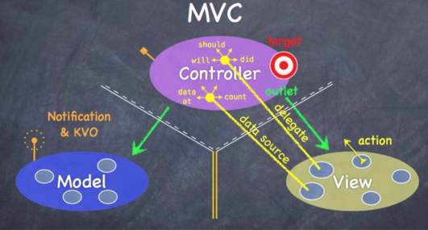

各层的职责如下所示：

* Models： 数据层，负责数据的处理和获取的数据接口层。
* Views： 展示层(GUI)，对于 iOS 来说所有以 UI 开头的类基本都属于这层。
* Controller： 控制器层，它是 Model 和 View 之间的胶水或者说是中间人。一般来说，当用户对 View 有操作时它负责去修改相应 Model；当 Model 的值发生变化时它负责去更新对应 View。

如上图所示，M和View应该是完全隔离的，由C作为中间人来负责二者的交互，同时三者是完全独立分开的，这样可以保证M和V的可测试性和复用性，但是一般由于C都是为特别的应用场景下的M和V做中介者，所以很难复用。

### 2、MVC在iOS里面的实现

但是实际上在iOS里面MVC的实现方式很难做到如上所述的那样，因为由于Apple的规范，一个界面的呈现都需要构建一个viewcontroller，而每个viewcontroller都带有一个根view，这就导致C和V紧密耦合在一起构成了iOS里面的C层，这明显违背了MVC的初衷。

apple里面的MVC真正写起来大概如下图所示：

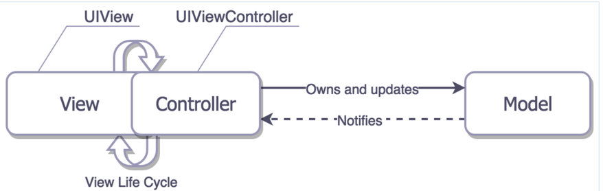

这也是massive controller的由来，具体的下面再讲
那么apple为什么要这么干呢？完整的可以参考下apple对于MVC的解释，下面的引用是我摘自其中一段。简单来说就是iOS里面的viewcontroller其实是view和controller的组合，目的就是为了提高开发效率，简化操作。

[apple mvc 规范](https://developer.apple.com/library/content/documentation/General/Conceptual/CocoaEncyclopedia/Model-View-Controller/Model-View-Controller.html#//apple_ref/doc/uid/TP40010810-CH14-SW14)

> 摘自上面的链接  
> One can merge the MVC roles played by an object, making an object, for example, fulfill both the controller and view roles—in which case, it would be called a view controller. In the same way, you can also have model-controller objects. For some applications, combining roles like this is an acceptable design.  
> A model controller is a controller that concerns itself mostly with the model layer. It “owns” the model; its primary responsibilities are to manage the model and communicate with view objects. Action methods that apply to the model as a whole are typically implemented in a model controller. The document architecture provides a number of these methods for you; for example, an NSDocument object (which is a central part of the document architecture) automatically handles action methods related to saving files.  
> A view controller is a controller that concerns itself mostly with the view layer. It “owns” the interface (the views); its primary responsibilities are to manage the interface and communicate with the model. Action methods concerned with data displayed in a view are typically implemented in a view controller. An NSWindowController object (also part of the document architecture) is an example of a view controller.  

对于简单界面来说，viewcontroller结构确实可以提高开发效率，但是一旦需要构建复杂界面，那么viewcontroller很容易就会出现代码膨胀，逻辑满天飞的问题。

另外我想说一句，apple搞出viewcontroller（VC）这么个玩意初衷可能是好的，写起来方便，提高开发效率嘛。确实应付简单页面没啥问题，但是有一个很大的弊端就是容易把新手代入歧途，认为真正的MVC就是这么干的，导致很多新手都把本来view层的代码都堆到了VC，比如在VC里面构建view、view的显示逻辑，甚至在VC里面发起网络请求。

这也是我当初觉得VC很怪异的一个地方，因为它没办法归类到MVC的任何一层，直到看到了apple文档的那段话，才知道VC原来是个组合体。

下面来谈谈现有iOS架构下MVC各层的职责，这里要注意下，下面的Controller层指的是iOS里面的VC组合体

### 3、iOS的MVC各层职责

> controller层（VC）：  

* 生成view，然后组装view
* 响应View的事件和作为view的代理
* 调用model的数据获取接口，拿到返回数据，处理加工，渲染到view显示
* 处理view的生命周期
* 处理界面之间的跳转

> model层：  

* 业务逻辑封装
* 提供数据接口给controller使用
* 数据持久化存储和读取
* 作为数据模型存储数据

> view层：  

* 界面元素搭建，动画效果，数据展示，
* 接受用户操作并反馈视觉效果

PS:
model层的业务逻辑一般都是和后台数据交互的逻辑，还有一些抽象的业务逻辑，比如格式化日期字符串为NSDateFormatter类型等

### 4、massive controller

从上面的MVC各层职责划分就可以看出来C干了多少事，这还是做了明确的职责划分的情况下，更不用提新手把各种view和model层的功能都堆到C层后的惨不忍睹。

在复杂界面里面的VC代码轻松超过千行，我之间就见过超过5000行代码的VC，找个方法只能靠搜索，分分钟想死的节奏。

造成massive controller的原因的罪魁祸首就是apple的把view和Cotroller组合在一起，让VC同时做view和C的事，导致代码量激增，也违背了MVC原则。

下面来举一个简单的例子，先声明下我下面列举的例子主要来着这篇博客：

>   [杂谈: MVC/MVP/MVVM](http://www.cocoachina.com/ios/20170313/18870.html)  

这篇文章质量很高，对三种模式的讲解比较深入，关键还有例子来做横向对比，这是其他文章没有的。大家可以先看看这篇文章，本文的demo来自这篇文章，但是我按照自己的理解在其基础上做了一些修改，大家可以自己对比下，做出自己的选择。

还有一些图也是借鉴该篇文字，在此感谢作者~

先看两张图：

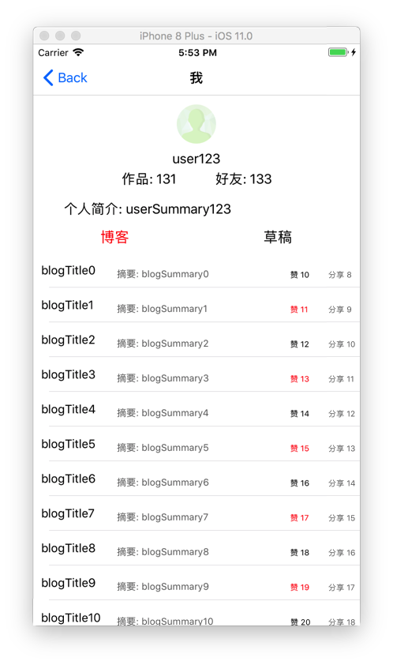

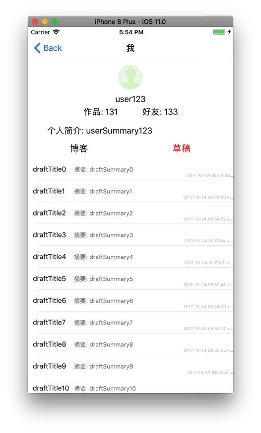

这个界面分为三个部分，顶部的个人信息展示，下面有两张列表，分别展示博客和草稿内容。
我们先来看看一般新手都是怎么实现的

```
//UserVC
- (void)viewDidLoad {
    [super viewDidLoad];

    [[UserApi new] fetchUserInfoWithUserId:132 completionHandler:^(NSError *error, id result) {
        if (error) {
            [self showToastWithText:@"获取用户信息失败了~"];
        } else {

            self.userIconIV.image = ...
            self.userSummaryLabel.text = ...
            ...
        }
    }];

    [[userApi new] fetchUserBlogsWithUserId:132 completionHandler:^(NSError *error, id result) {
        if (error) {
            [self showErrorInView:self.tableView info:...];
        } else {

            [self.blogs addObjectsFromArray:result];
            [self.tableView reloadData];
        }
    }];

    [[userApi new] fetchUserDraftsWithUserId:132 completionHandler:^(NSError *error, id result) {
        //if Error...略
        [self.drafts addObjectsFromArray:result];
        [self.draftTableView reloadData];
    }];

}
//...略
- (UITableViewCell *)tableView:(UITableView *)tableView cellForRowAtIndexPath:(NSIndexPath *)indexPath {

    if (tableView == self.blogTableView) {
        BlogCell *cell = [tableView dequeueReusableCellWithIdentifier:@"BlogCell"];
        cell.blog = self.blogs[indexPath.row];
        return cell;
    } else {
        DraftCell *cell = [tableView dequeueReusableCellWithIdentifier:@"DraftCell"];
        cell.draft = self.drafts[indexPath.row];
        return cell;
    }
}

- (void)tableView:(UITableView *)tableView didSelectRowAtIndexPath:(NSIndexPath *)indexPath {
    if (tableView == self.blogTableView){
        [self.navigationController pushViewController:[BlogDetailViewController instanceWithBlog:self.blogs[indexPath.row]] animated:YES];
    }else{
        [self.navigationController pushViewController:[draftDetailViewController instanceWithdraft:self.drafts[indexPath.row]] animated:YES];

}复制代码
```

```
//DraftCell
- (void)setDraft:(draft)draft {
    _draft = draft;
    self.draftEditDate = ...
}

//BlogCell
- (void)setBlog:(Blog)blog {
    ...同上
}复制代码
```

```
model:

Blog.h
=========
#import <Foundation/Foundation.h>

@interface Blog : NSObject

- (instancetype)initWithBlogId:(NSUInteger)blogId;

@property (copy, nonatomic) NSString *blogTitle;
@property (copy, nonatomic) NSString *blogSummary;
@property (assign, nonatomic) BOOL isLiked;
@property (assign, nonatomic) NSUInteger blogId;
@property (assign, nonatomic) NSUInteger likeCount;
@property (assign, nonatomic) NSUInteger shareCount;
@end

~~~~~~~~~~~~~~~~~~~~~

blog.m
========
#import "Blog.h"

@implementation Blog

@end复制代码
```

如果后续再增加需求，那么userVC的代码就会越来越多，这就是我们上面说的massive controller出现了。维护性和可测试性无从谈起，我们是按照apple的MVC架构写的呀，为什么会出现这种问题呢？

暂且按下不表，我们先看另外一个问题，先把这个问题搞清楚了，对于后续文章的理解大有裨益。

### 5、Model层的误解

我看到很多所谓的MVC的M层实现就如上面所示，只有几个干巴巴的属性。我之前也是一直这么写的，但是我一直觉得有疑惑，觉得这样写的话，怎么可能算的上一个单独的层呢？说是数据模型还差不多。

那么实现正确的M层姿势应该是什么样的呢？
大家具体可以看下面这篇文章，对于M层讲解的非常不错，但是对于文中的MVVM的理解我不敢苟同，大家见仁见智吧

[论MVVM伪框架结构和MVC中M的实现机制](http://www.jianshu.com/p/33c7e2f3a613)

下面的引用也是摘自这篇文章：

> 理解Model层：  
> 首先要正确的理解MVC中的M是什么？他是数据模型吗？答案是NO。他的正确定义是业务模型。也就是你所有业务数据和业务实现逻辑都应该定义在M层里面，而且业务逻辑的实现和定义应该和具体的界面无关，也就是和视图以及控制之间没有任何的关系，它是可以独立存在的，您甚至可以将业务模型单独编译出一个静态库来提供给第三方或者其他系统使用。  
> 在上面经典MVC图中也很清晰的描述了这一点： 控制负责调用模型，而模型则将处理结果发送通知给控制，控制再通知视图刷新。因此我们不能将M简单的理解为一个个干巴巴的只有属性而没有方法的数据模型。  
> 其实这里面涉及到一个最基本的设计原则，那就是面向对象的基本设计原则：就是什么是类？类应该是一个个具有不同操作和不同属性的对象的抽象（类是属性和方法的集合）。 我想现在任何一个系统里面都没有出现过一堆只有数据而没有方法的数据模型的集合被定义为一个单独而抽象的模型层来供大家使用吧。 我们不能把一个保存数据模型的文件夹来当做一个层，这并不符合横向切分的规则。  
> Model层实现的正确姿势：  
>1. 定义的M层中的代码应该和V层和C层完全无关的，也就是M层的对象是不需要依赖任何C层和V层的对象而独立存在的。整个框架的设计最优结构是V层不依赖C层而独立存在，M层不依赖C层和V层独立存在，C层负责关联二者，V层只负责展示，M层持有数据和业务的具体实现，而C层则处理事件响应以及业务的调用以及通知界面更新。三者之间一定要明确的定义为单向依赖，而不应该出现双向依赖
>2. M层要完成对业务逻辑实现的封装，一般业务逻辑最多的是涉及到客户端和服务器之间的业务交互。M层里面要完成对使用的网络协议(HTTP, TCP，其他)、和服务器之间交互的数据格式（XML, JSON,其他)、本地缓存和数据库存储（COREDATA, SQLITE,其他)等所有业务细节的封装，而且这些东西都不能暴露给C层。所有供C层调用的都是M层里面一个个业务类所提供的成员方法来实现。也就是说C层是不需要知道也不应该知道和客户端和服务器通信所使用的任何协议，以及数据报文格式，以及存储方面的内容。这样的好处是客户端和服务器之间的通信协议，数据格式，以及本地存储的变更都不会影响任何的应用整体框架，因为提供给C层的接口不变，只需要升级和更新M层的代码就可以了。比如说我们想将网络请求库从ASI换成AFN就只要在M层变化就可以了，整个C层和V层的代码不变。
>   

文章还给出了实现的例子，我就不粘贴过来了，大家自己过去看看

总结来说：

M层不应该是数据模型，放几个属性就完事了。而应该是承载业务逻辑和数据存储获取的职责一层。

### 6、如何构建构建正确的MVC

现在我们来看看到底该如何在iOS下面构建一个正确的MVC呢？

`首先先达成一个共识：viewcontroller不是C层，而是V和C两层的混合体。` 我们看到在标准的iOS下的MVC实现里面，C层做了大部分事情，大体分为五个部分（见上面MVC各层职责），因为他是两个层的混合，为了给VC减负，我们现在把VC只当做一个view的容器来使用。

这里我要解释下什么叫做view的容器，我们知道apple的VC有一个self.view，所有要显示在界面的上面的view都必须通过addsubview来添加到这个根view上面来。同时VC还控制着view的生命周期。那么我们可不可以把VC看成一个管理各个View的容器？

大家可以看这篇文章加深理解下我上面说的view container的概念：

[iOS应用架构谈 view层的组织和调用方案](https://casatwy.com/iosying-yong-jia-gou-tan-viewceng-de-zu-zhi-he-diao-yong-fang-an.html)

此时VC的职责简化为如下三条职责：

1. 生成子view并添加到自己的self.view上面
2. 管理view的生命周期
3. 通知每个子C去获取数据

前面两点很好理解吧，上面已经讲过了。第三点我们接着往下看

##### 消失的C层

回到我们上面说的第四点的例子，什么原因造成VC的代码越来越臃肿呢？
因为我们对于view和model层的职责都划分的比较清楚，前者负责数据展示，后者负责数据获取，那么那些模棱两可的代码，放在这两层感觉都不合适，就都丢到了VC里面，导致VC日益膨胀。

此时的代码组织如下图所示：

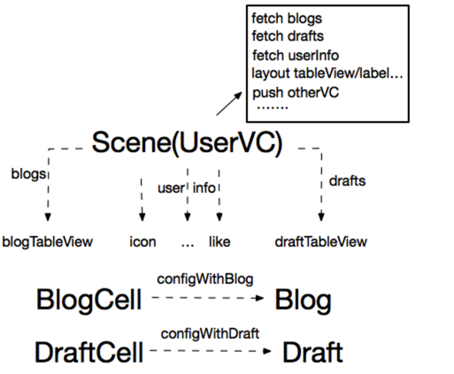

通过这张图可以发现, 用户信息页面（userVC）作为业务场景Scene需要展示多种数据M(Blog/Draft/UserInfo), 所以对应的有多个View(blogTableView/draftTableView/image…), 但是, 每个MV之间并没有一个连接层C, 本来应该分散到各个C层处理的逻辑全部被打包丢到了Scene(userVC)这一个地方处理, 也就是M-C-V变成了MM…-Scene-…VV, C层就这样莫名其妙的消失了.

另外, 作为V的两个cell直接耦合了M(blog/draft), 这意味着这两个V的输入被绑死到了相应的M上, 复用无从谈起.

最后, 针对这个业务场景的测试异常麻烦, 因为业务初始化和销毁被绑定到了VC的生命周期上, 而相应的逻辑也关联到了和View的点击事件, 测试只能Command+R, 点点点…

那么怎么实现正确的MVC呢？

如下图所示，该界面的信息分为三部分：个人信息、博客列表信息、草稿列表信息。我们应该也按照这三部分分成三个小的MVC，然后通过VC拼接组装这三个子MVC来完成整个界面。

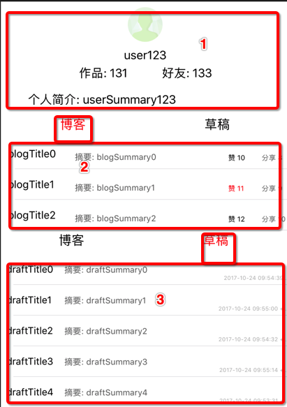

具体代码组织架构如下：

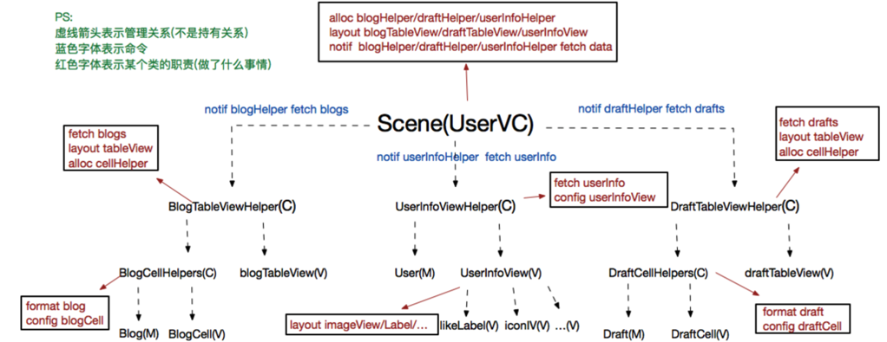


UserVC作为业务场景, 需要展示三种数据, 对应的就有三个MVC, 这三个MVC负责各自模块的数据获取, 数据处理和数据展示, 而UserVC需要做的就是配置好这三个MVC, 并在合适的时机通知各自的C层进行数据获取, 各个C层拿到数据后进行相应处理, 处理完成后渲染到各自的View上, UserVC最后将已经渲染好的各个View进行布局即可

具体的代码见最后的demo里面MVC文件夹。
关于demo的代码，我想说明一点自己的看法：在demo里面网络数据的获取，作者放到了一个单独的文件 `UserAPIManager` 里面。我觉得最好是放在和业务相关的demo里面，因为接口一旦多起来，一个文件很容易膨胀，如果按照业务分为多个文件，那么还不如干脆放在model里面更加清晰。

PS:

图中的blogTableViewHelper对应代码中的blogTableViewController，其他几个helper同样的

此时作为VC的userVC只需要做三件事：

1. 生成子view并添加到自己的self.view上面
2. 管理view的生命周期
3. 通知每个子C去获取数据

userVC的代码大大减少，而且此时逻辑更加清楚，而且因为每个模块的展示和交互是自管理的, 所以userVC只需要负责和自身业务强相关的部分即可。

另外如果需要在另外一个VC上面展示博客列表数据，那么只需要把博客列表的view添加到VC的view上面，然后通过博客列表的controller获取下数据就可以了，这样就达到了复用的目的。

我们通过上面的方法，把userVC里面的代码分到了三个子MVC里面，架构更加清晰明了，对于更加复杂的页面，我们可以做更细致的分解，同时每个子MVC其实还可以拆分成更细的MVC。具体的拆分粒度大家视页面复杂度灵活变通，如果预计到一个页面的业务逻辑后续会持续增加，还不如刚开始就拆分成不同的子MVC去实现。如果只是简单的页面，那么直接把所有的逻辑都写到VC里面也没事。

### 7、MVC优缺点

#### 优点

上面的MVC改造主要是把VC和C加以区分，让MVC成为真正的MVC，而不是让VC当成C来用，经过改造后的MVC对付一般场景应该绰绰有余了。不管界面多复杂，都可以拆分成更小的MVC然后再组装起来。

写代码就是一个不断重构的过程，当项目越来越大，单独功能可以抽离出来作为一个大模块，打包成pod库（这个是组件化相关的知识点，后面我也会写一篇博客）。同时在模块内部你又可以分层拆分。争取做到单一原则，不要在一个类里面啥都往里面堆

总结下MVC的优点有如下几点：

1. 代码复用: 三个小模块的V(cell/userInfoView)对外只暴露Set方法, 对M甚至C都是隔离状态, 复用完全没有问题. 三个大模块的MVC也可以用于快速构建相似的业务场景(大模块的复用比小模块会差一些, 下文我会说明).
2. 代码臃肿: 因为Scene大部分的逻辑和布局都转移到了相应的MVC中, 我们仅仅是拼装MVC的便构建了两个不同的业务场景, 每个业务场景都能正常的进行相应的数据展示, 也有相应的逻辑交互, 而完成这些东西, 加空格也就100行代码左右(当然, 这里我忽略了一下Scene的布局代码).
3. 易拓展性: 无论产品未来想加回收站还是防御塔, 我需要的只是新建相应的MVC模块, 加到对应的Scene即可.
4. 可维护性: 各个模块间职责分离, 哪里出错改哪里, 完全不影响其他模块. 另外, 各个模块的代码其实并不算多, 哪一天即使写代码的人离职了, 接手的人根据错误提示也能快速定位出错模块.
5. 易测试性: 很遗憾, 业务的初始化依然绑定在Scene的生命周期中, 而有些逻辑也仍然需要UI的点击事件触发, 我们依然只能Command+R, 点点点…

#### 缺点

经过上面的改造，MVC架构已经足够清晰了，按照应用场景（一般都是单页面）进行大的拆分，然后在根据业务拆分成小的MVC。不行就接着拆，拆层，拆模块。

但是MVC的最大弊端就是C的代码没法复用，所以能把C层的代码拆出来就尽量拆，我们来看看现在C层的功能还有哪些了

1. 作为View和Model的中介者，从model获取数据，经过数据加工，渲染到view上面显示
2. 响应view的点击事件，然后执行相应的业务逻辑
3. 作为view的代理和数据源
4. 暴露接口给SceneVC来驱动自己获取数据

这就导致一个问题：

业务逻辑和业务展示强耦合: 可以看到, 有些业务逻辑(页面跳转/点赞/分享…)是直接散落在V层的, 这意味着我们在测试这些逻辑时, 必须首先生成对应的V, 然后才能进行测试. 显然, 这是不合理的. 因为业务逻辑最终改变的是数据M, 我们的关注点应该在M上, 而不是展示M的V

举个例子吧，比如demo中的点赞功能代码如下：

```
- (UITableViewCell *)tableView:(UITableView *)tableView cellForRowAtIndexPath:(NSIndexPath *)indexPath {

    BlogCellHelper *cellHelper = self.blogs[indexPath.row];
    BlogTableViewCell *cell = [tableView dequeueReusableCellWithIdentifier:ReuseIdentifier];
    cell.title = cellHelper.blogTitleText;
    cell.summary = cellHelper.blogSummaryText;
    cell.likeState = cellHelper.isLiked;
    cell.likeCountText = cellHelper.blogLikeCountText;
    cell.shareCountText = cellHelper.blogShareCountText;

    //点赞的业务逻辑
    __weak typeof(cell) weakCell = cell;
    [cell setDidLikeHandler:^{
        if (cellHelper.blog.isLiked) {
            [self.tableView showToastWithText:@"你已经赞过它了~"];
        } else {
            [[UserAPIManager new] likeBlogWithBlogId:cellHelper.blog.blogId completionHandler:^(NSError *error, id result) {
                if (error) {
                    [self.tableView showToastWithText:error.domain];
                } else {
                    cellHelper.blog.likeCount += 1;
                    cellHelper.blog.isLiked = YES;
                    //点赞的业务展示
                    weakCell.likeState = cellHelper.blog.isLiked;
                    weakCell.likeCountText = cellHelper.blogTitleText;
                }
            }];
        }
    }];
    return cell;
}复制代码
```

通过代码可以清晰的看到，必须生成cell，然后点击cell上面的点赞按钮，才可以触发点赞的业务逻辑。
但是业务逻辑一般改变的model数据，view只是拿到model的数据进行展示。现在却把这两个原本独立的事情合在一起了。导致业务逻辑没法单独测试了。

下面提到的MVP正是为了解决这一问题而诞生的，我们接着往下看。

- - - -

## MVP

下面关于MVP文字，有部分文字和图片摘抄自该文章，在此感谢作者，之前忘记放上链接，向作者道歉：
[浅谈 MVC、MVP 和 MVVM 架构模式](https://draveness.me/mvx)

### 1、概述

MVC的缺点在于并没有区分业务逻辑和业务展示, 这对单元测试很不友好. MVP针对以上缺点做了优化, 它将业务逻辑和业务展示也做了一层隔离, 对应的就变成了MVCP.

M和V功能不变, 原来的C现在只负责布局, 而所有的业务逻辑全都转移到了P层。P层处理完了业务逻辑，如果要更改view的显示，那么可以通过回调来实现，这样可以减轻耦合，同时可以单独测试P层的业务逻辑

MVP的变种及定义比较多，但是最终广为人知的是Martin Fowler 的发表的关于Presentation Model描述，也就是下面将要介绍的MVP。具体看下面这篇文章：

[Martin Fowler 发表的 Presentation Model 文章](https://www.martinfowler.com/eaaDev/PresentationModel.html)

MVP从视图层中分离了行为（事件响应）和状态（属性，用于数据展示），它创建了一个视图的抽象，也就是presenter层，而视图就是P层的『渲染』结果。P层中包含所有的视图渲染需要的动态信息，包括视图的内容（text、color）、组件是否启用（enable），除此之外还会将一些方法暴露给视图用于某些事件的响应。

### 2、MVP架构和各层职责对比

MVP的架构图如下所示：

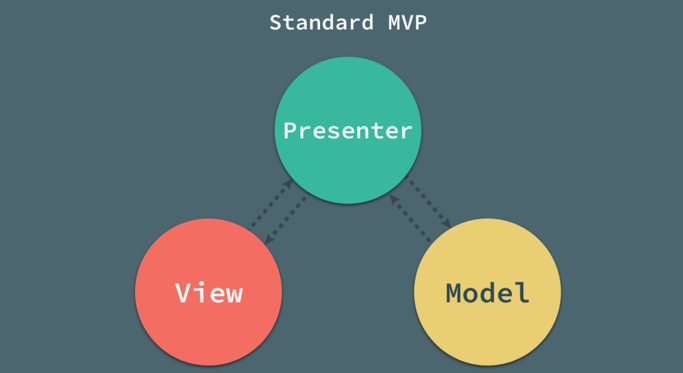

在 MVP 中，Presenter 可以理解为松散的控制器，其中包含了视图的 UI 业务逻辑，所有从视图发出的事件，都会通过代理给 Presenter 进行处理；同时，Presenter 也通过视图暴露的接口与其进行通信。

各层职责如下

> VC层  

* view的布局和组装
* view的生命周期控制
* 通知各个P层去获取数据然后渲染到view上面展示

> controller层  

* 生成view，实现view的代理和数据源
* 绑定view和presenter
* 调用presenter执行业务逻辑

> model层  

* 和MVC的model层类似

> view层  

* 监听P层的数据更新通知, 刷新页面展示.（MVC里由C层负责）
* 在点击事件触发时, 调用P层的对应方法, 并对方法执行结果进行展示.（MVC里由C层负责）
* 界面元素布局和动画
* 反馈用户操作

> Presenter层职责  

* 实现view的事件处理逻辑，暴露相应的接口给view的事件调用
* 调用model的接口获取数据，然后加工数据，封装成view可以直接用来显示的数据和状态
* 处理界面之间的跳转（这个根据实际情况来确定放在P还是C）

我们来分析下View层的职责，其中3、4两点和MVC的view类似，但是1、2两点不同，主要是因为业务逻辑从C转移到了P，那么view的事件响应和状态变化肯定就依赖P来实现了。

这里又有两种不同的实现方式：

1. 让P持有V，P通过V的暴露接口改变V的显示数据和状态，P通过V的事件回调来执行自身的业务逻辑
2. 让V持有P，V通过P的代理回调来改变自身的显示数据和状态，V直接调用P的接口来执行事件响应对应的业务逻辑

第一种方式保持了view的纯粹，只是作为被动view来展示数据和更改状态，但是却导致了P耦合了V，这样业务逻辑和业务展示有糅合到了一起，和上面的MVC一样了。

第二种方式保证了P的纯粹，让P只做业务逻辑，至于业务逻辑引发的数据显示的变化，让view实现对应的代理事件来实现即可。这增加了view的复杂和view对于P的耦合。

Demo中采用了第二种方式，但是demo中的view依赖是具体的presenter，如果是一个view对应多个presenter，那么可以考虑把presenter暴露的方法和属性抽象成protocol。让view依赖抽象而不是具体实现。

### 3、被动式图模式的MVP

目前常见的 MVP 架构模式其实都是它的变种：Passive View 和 Supervising Controller。我们先来开下第一种，也是用的比较多的一种

MVP 的第一个主要变种就是被动视图（Passive View）；顾名思义，在该变种的架构模式中，视图层是被动的，它本身不会改变自己的任何的状态，它只是定义控价的样式和布局，本身是没有任何逻辑的。

然后对外暴露接口，外界通过这些接口来渲染数据到view来显示，所有的状态都是通过 Presenter 来间接改变的（一般都是在view里面实现Presenter的代理来改变的）。这样view可以最大程度被复用，可测试性也大大提高

可以参考这篇文章 [Passive View](https://www.martinfowler.com/eaaDev/PassiveScreen.html)

#### 通信方式

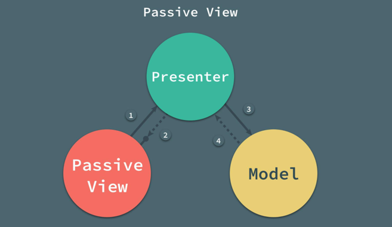

1. 当视图接收到来自用户的事件时，会将事件转交给 Presenter 进行处理；
2. 被动的视图实现presentr的代理，当需要更新视图时 Presenter回调代理来更新视图的内容，这样让presenter专注于业务逻辑，view专注于显示逻辑
3. Presenter 负责对模型进行操作和更新，在需要时取出其中存储的信息；
4. 当模型层改变时，可以将改变的信息发送给观察者 Presenter；

### 4、监督控制器模式的MVP

在监督控制器中，视图层接管了一部分视图逻辑，主要就是同步简单的视图和模型的状态；而监督控制器就需要负责响应用户的输入以及一部分更加复杂的视图、模型状态同步工作。

对于用户输入的处理，监督控制器的做法与标准 MVP 中的 Presenter 完全相同。但是对于视图、模型的数据同步工作，使用类似于下面要讲到MVVM中的双向绑定机制来实现二者的相互映射。

如下图所示：

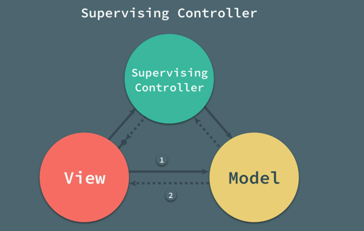


监督控制器中的视图和模型层之间增加了两者之间的耦合，也就增加了整个架构的复杂性。和被动式图的MVP不同的是：视图和模型之间新增了的依赖，就是双向的数据绑定；视图通过声明式的语法与模型中的简单属性进行绑定，当模型发生改变时，会通知其观察者视图作出相应的更新。

通过这种方式能够减轻监督控制器的负担，减少其中简单的代码，将一部分逻辑交由视图进行处理；这样也就导致了视图同时可以被 Presenter 和数据绑定两种方式更新，相比于被动视图，监督控制器的方式也降低了视图的可测试性和封装性。

可以参考这篇文章 [Supervising Controller](https://www.martinfowler.com/eaaDev/SupervisingPresenter.html)

### 5、如何构建正确的MVP

MVC的缺点在于并没有区分业务逻辑和业务展示, 这对单元测试很不友好。 MVP针对以上缺点做了优化, 它将业务逻辑和业务展示也做了一层隔离, 对应的就变成了MVCP。 M和V功能不变, 原来的C现在只负责view的生成和作为view的代理（view的布局依然由SceneVC来完成）, 而所有的业务逻辑全都转移到了P层.

我们用MVP把上面的界面重构一次，架构图如下所示：


业务场景没有变化, 依然是展示三种数据, 只是三个MVC替换成了三个MVP(图中我只画了Blog模块), UserVC负责配置三个MVP(新建各自的VP, 通过VP建立C, C会负责建立VP之间的绑定关系), 并在合适的时机通知各自的P层(之前是通知C层)进行数据获取。

各个P层在获取到数据后进行相应处理, 处理完成后会通知绑定的View数据有所更新, V收到更新通知后从P获取格式化好的数据进行页面渲染, UserVC最后将已经渲染好的各个View进行布局即可.

另外, V层C层不再处理任何业务逻辑, 所有事件触发全部调用P层的相应命令。

具体代码大家看demo就行了，下面我抽出点赞功能来对比分析下MVC和MVP的实现有何不同

#### MVP点赞代码

```
blogViewController.m

//点赞事件
- (UITableViewCell *)tableView:(UITableView *)tableView cellForRowAtIndexPath:(NSIndexPath *)indexPath {

    BlogViewCell *cell = [tableView dequeueReusableCellWithIdentifier:ReuseIdentifier];
    cell.presenter = self.presenter.allDatas[indexPath.row];//PV绑定

    __weak typeof(cell) weakCell = cell;
    [cell setDidLikeHandler:^{
        [weakCell.presenter likeBlogWithCompletionHandler:^(NSError *error, id result) {
            !error ?: [weakCell showToastWithText:error.domain];
        }];
    }];
    return cell;
}

==========================================
BlogCellPresenter.m

- (void)likeBlogWithCompletionHandler:(NetworkCompletionHandler)completionHandler {

    if (self.blog.isLiked) {
        !completionHandler ?: completionHandler([NSError errorWithDomain:@"你已经赞过了哦~" code:123 userInfo:nil], nil);
    } else {

        BOOL response = [self.view respondsToSelector:@selector(blogPresenterDidUpdateLikeState:)];

        self.blog.isLiked = YES;
        self.blog.likeCount += 1;
        !response ?: [self.view blogPresenterDidUpdateLikeState:self];
        [[UserAPIManager new] likeBlogWithBlogId:self.blog.blogId completionHandler:^(NSError *error, id result) {

            if (error) {

                self.blog.isLiked = NO;
                self.blog.likeCount -= 1;
                !response ?: [self.view blogPresenterDidUpdateLikeState:self];
            }

            !completionHandler ?: completionHandler(error, result);
        }];
    }
}

==========================================
BlogViewCell.m

#pragma mark - BlogCellPresenterCallBack

- (void)blogPresenterDidUpdateLikeState:(BlogCellPresenter *)presenter {

    [self.likeButton setTitle:presenter.blogLikeCountText forState:UIControlStateNormal];
    [self.likeButton setTitleColor:presenter.isLiked ? [UIColor redColor] : [UIColor blackColor] forState:UIControlStateNormal];
}

- (void)blogPresenterDidUpdateShareState:(BlogCellPresenter *)presenter {
    [self.shareButton setTitle:presenter.blogShareCountText forState:UIControlStateNormal];
}

#pragma mark - Action

- (IBAction)onClickLikeButton:(UIButton *)sender {
    !self.didLikeHandler ?: self.didLikeHandler();
}

#pragma mark - Setter

- (void)setPresenter:(BlogCellPresenter *)presenter {
    _presenter = presenter;

    presenter.view = self;
    self.titleLabel.text = presenter.blogTitleText;
    self.summaryLabel.text = presenter.blogSummaryText;
    self.likeButton.selected = presenter.isLiked;
    [self.likeButton setTitle:presenter.blogLikeCountText forState:UIControlStateNormal];
    [self.shareButton setTitle:presenter.blogShareCountText forState:UIControlStateNormal];
}复制代码
```

#### MVC的点赞功能

```
blogViewController.m

- (UITableViewCell *)tableView:(UITableView *)tableView cellForRowAtIndexPath:(NSIndexPath *)indexPath {

    BlogCellHelper *cellHelper = self.blogs[indexPath.row];
    BlogTableViewCell *cell = [tableView dequeueReusableCellWithIdentifier:ReuseIdentifier];
    cell.title = cellHelper.blogTitleText;
    cell.summary = cellHelper.blogSummaryText;
    cell.likeState = cellHelper.isLiked;
    cell.likeCountText = cellHelper.blogLikeCountText;
    cell.shareCountText = cellHelper.blogShareCountText;

    //点赞的业务逻辑
    __weak typeof(cell) weakCell = cell;
    [cell setDidLikeHandler:^{
        if (cellHelper.blog.isLiked) {
            [self.tableView showToastWithText:@"你已经赞过它了~"];
        } else {
            [[UserAPIManager new] likeBlogWithBlogId:cellHelper.blog.blogId completionHandler:^(NSError *error, id result) {
                if (error) {
                    [self.tableView showToastWithText:error.domain];
                } else {
                    cellHelper.blog.likeCount += 1;
                    cellHelper.blog.isLiked = YES;
                    //点赞的业务展示
                    weakCell.likeState = cellHelper.blog.isLiked;
                    weakCell.likeCountText = cellHelper.blogTitleText;
                }
            }];
        }
    }];
    return cell;
}

===========================================
BlogViewCell.m

- (IBAction)onClickLikeButton:(UIButton *)sender {
    !self.didLikeHandler ?: self.didLikeHandler();
}

#pragma mark - Interface

- (void)setTitle:(NSString *)title {
    self.titleLabel.text = title;
}

- (void)setSummary:(NSString *)summary {
    self.summaryLabel.text = summary;
}

- (void)setLikeState:(BOOL)isLiked {
    [self.likeButton setTitleColor:isLiked ? [UIColor redColor] : [UIColor blackColor] forState:UIControlStateNormal];
}

- (void)setLikeCountText:(NSString *)likeCountText {
    [self.likeButton setTitle:likeCountText forState:UIControlStateNormal];
}

- (void)setShareCountText:(NSString *)shareCountText {
    [self.shareButton setTitle:shareCountText forState:UIControlStateNormal];
}复制代码
```

从上面的代码对比可以看出来，MVP的代码量比MVC多出来整整一倍，但是MVP在层次上更加清晰，业务逻辑和业务展示彻底分离，让presenter和view可以单独测试，而MVC则把这两者混在一起，没法单独测试。实际项目中大家可以自己根据项目需求来选择。

下面是MVC下点赞的逻辑

```
//点赞的业务逻辑
    __weak typeof(cell) weakCell = cell;
    [cell setDidLikeHandler:^{
        if (cellHelper.blog.isLiked) {
            [self.tableView showToastWithText:@"你已经赞过它了~"];
        } else {
            [[UserAPIManager new] likeBlogWithBlogId:cellHelper.blog.blogId completionHandler:^(NSError *error, id result) {
                if (error) {
                    [self.tableView showToastWithText:error.domain];
                } else {
                    cellHelper.blog.likeCount += 1;
                    cellHelper.blog.isLiked = YES;
                    //点赞的业务展示
                    weakCell.likeState = cellHelper.blog.isLiked;
                    weakCell.likeCountText = cellHelper.blogTitleText;
                }
            }];
        }
    }];复制代码
```

可以看到业务逻辑（改变model数据）和业务展示（改变cell的数据）糅杂在一起，如果我要测试点赞这个业务逻辑，那么就必须生成cell，然后点击cell的按钮，去触发点赞的业务逻辑才可以测试

再看看MVP下的点赞逻辑的实现

```
业务逻辑：
BlogCellPresenter.m

- (void)likeBlogWithCompletionHandler:(NetworkCompletionHandler)completionHandler {

    if (self.blog.isLiked) {
        !completionHandler ?: completionHandler([NSError errorWithDomain:@"你已经赞过了哦~" code:123 userInfo:nil], nil);
    } else {

        BOOL response = [self.view respondsToSelector:@selector(blogPresenterDidUpdateLikeState:)];

        self.blog.isLiked = YES;
        self.blog.likeCount += 1;
        !response ?: [self.view blogPresenterDidUpdateLikeState:self];
        [[UserAPIManager new] likeBlogWithBlogId:self.blog.blogId completionHandler:^(NSError *error, id result) {

            if (error) {

                self.blog.isLiked = NO;
                self.blog.likeCount -= 1;
                !response ?: [self.view blogPresenterDidUpdateLikeState:self];
            }

            !completionHandler ?: completionHandler(error, result);
        }];
    }
}复制代码
```

```
业务展示：
BlogViewCell.m

#pragma mark - BlogCellPresenterCallBack

- (void)blogPresenterDidUpdateLikeState:(BlogCellPresenter *)presenter {

    [self.likeButton setTitle:presenter.blogLikeCountText forState:UIControlStateNormal];
    [self.likeButton setTitleColor:presenter.isLiked ? [UIColor redColor] : [UIColor blackColor] forState:UIControlStateNormal];
}

- (void)blogPresenterDidUpdateShareState:(BlogCellPresenter *)presenter {
    [self.shareButton setTitle:presenter.blogShareCountText forState:UIControlStateNormal];
}复制代码
```

可以看到在MVP里面业务逻辑和业务展示是分在不同的地方实现，那么就可以分开测试二者了，而不想MVC那样想测试下业务逻辑，还必须生成一个view，这不合理，因为业务逻辑改变的model的数据，和view无关。

MVP相对于MVC, 它其实只做了一件事情, 即分割业务展示和业务逻辑. 展示和逻辑分开后, 只要我们能保证V在收到P的数据更新通知后能正常刷新页面, 那么整个业务就没有问题. 因为V收到的通知其实都是来自于P层的数据获取/更新操作, 所以我们只要保证P层的这些操作都是正常的就可以了. 即我们只用测试P层的逻辑, 不必关心V层的情况

- - - -

## MVVM

### 1、概述

MVVM是由微软提出来的，但是这个架构也是在下面这篇文章的基础上发展起来的：

[Martin Fowler 发表的 Presentation Model 文章](https://www.martinfowler.com/eaaDev/PresentationModel.html)

这篇文章上面就提到过，就是MVP的原型，也就是说MVVM其实是在MVP的基础上发展起来的。那么MVVM在MVP的基础上改良了啥呢？答案就是数据绑定，下面会慢慢铺开来讲。网上关于MVVM的定义太多，没有一个统一的说法，有的甚至完全相反。关于权威的MVVM解释，大家可以看下微软的官方文档：

[The MVVM Pattern](https://msdn.microsoft.com/en-us/library/hh848246.aspx)

里面关于MVVM提出的动机，解决的痛点，各层的职责都解释的比较清楚。要追本溯源看下MVVM的前世今生，那么上面的Martin Fowler发表的文章也可以看看

2005 年，John Gossman 在他的博客上公布了 [Introduction to Model/View/ViewModel pattern for building WPF apps](https://blogs.msdn.microsoft.com/johngossman/2005/10/08/introduction-to-modelviewviewmodel-pattern-for-building-wpf-apps/) 一文。MVVM 与 Martin Fowler 所说的 PM 模式其实是完全相同的，Fowler 提出的 PM 模式是一种与平台无关的创建视图抽象的方法，而 Gossman 的 MVVM 是专门用于 WPF 框架来简化用户界面的创建的模式；我们可以认为 MVVM 是在 WPF 平台上对于 PM 模式的实现。

从 Model-View-ViewModel 这个名字来看，它由三个部分组成，也就是 Model、View 和 ViewModel；其中视图模型（ViewModel）其实就是 MVP 模式中的P，在 MVVM 中叫做VM。

#### MVVM架构图：

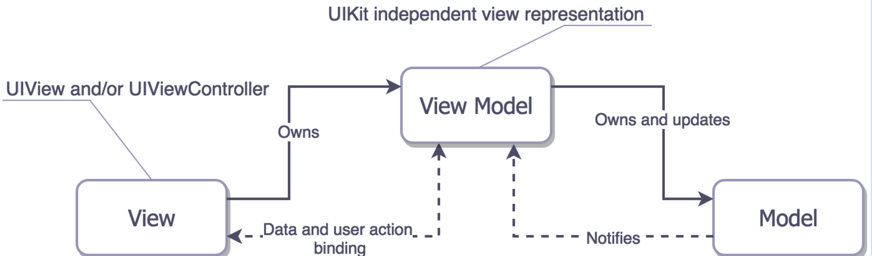

除了我们非常熟悉的 Model、View 和 ViewModel 这三个部分，在 MVVM 的实现中，还引入了隐式的一个 Binder层，这也是MVVM相对MVP的进步，而声明式的数据和命令的绑定在 MVVM 模式中就是通过binder层来完成的，RAC是iOS下binder的优雅实现，当然MVVM没有RAC也完全可以运行。

下图展示了iOS下的MVC是如何拆分成MVVM的：


MVVM和MVP相对于MVC最大的改进在于：P或者VM创建了一个视图的抽象，将视图中的状态和行为抽离出来形成一个新的抽象。这可以把业务逻辑（P/VM）和业务展示(V)分离开单独测试，并且达到复用的目的，逻辑结构更加清晰

### 2、MVVM各层职责

MVVM各层的职责和MVP的类似，VM对应P层，只是在MVVM的View层多了数据绑定的操作

### 3、MVVM相对于MVP做的改进

上面提到过MVVM相对于MVC的改进是对VM/P和view做了双向的数据和命令绑定，那么这么做的好处是什么呢？还是看上面MVP的点赞的例子

MVP的点赞逻辑如下：

点击cell按钮--->调用P的点赞逻辑---->点赞成功后，P改变M的数据--->P回调Cell的代理方法改变cell的显示(点赞成功，赞的个数加1，同时点赞数变红，否则不改变赞的个数也不变色)

上面就是一个事件完整过程，可以看到要通过四步来完成，而且每次都要把P的状态同步到view，当事件多起来的时候，这样写就很麻烦了。那有没有一种简单的机制，让view的行为和状态和P的行为状态同步呢？

答案就是MVVM的binder机制。

点赞的MVP的代码看上面MVP章节即可，我们来看下在MVVM下的点赞如何实现的：

```
BlogCellViewModel.h

- (BOOL)isLiked;
- (NSString *)blogTitleText;
- (NSString *)blogSummaryText;
- (NSString *)blogLikeCount;
- (NSString *)blogShareCount;

- (RACCommand *)likeBlogCommand;

========================================
BlogCellViewModel.m

@weakify(self);
        self.likeBlogCommand = [[RACCommand alloc] initWithSignalBlock:^RACSignal *(id input) {
            @strongify(self);

            RACSubject *subject = [RACSubject subject];
            if (self.isLiked) {

                dispatch_after(dispatch_time(DISPATCH_TIME_NOW, (int64_t)(.5 * NSEC_PER_SEC)), dispatch_get_main_queue(), ^{

                    self.isLiked = NO;
                    self.blogLikeCount = self.blog.likeCount - 1;
                    [subject sendCompleted];
                });
            } else {

                self.isLiked = YES;
                self.blogLikeCount = self.blog.likeCount + 1;
                [[UserAPIManager new] likeBlogWithBlogId:self.blog.blogId completionHandler:^(NSError *error, id result) {

                    if (error) {

                        self.isLiked = NO;
                        self.blogLikeCount = self.blog.likeCount - 1;
                    }
                    error ? [subject sendError:error] : [subject sendCompleted];
                }];
            }
            return subject;
        }];复制代码
```

```
- (void)awakeFromNib {
    [super awakeFromNib];

    //数据绑定操作
    @weakify(self);
    RAC(self.titleLabel, text) = RACObserve(self, viewModel.blogTitleText);
    RAC(self.summaryLabel, text) = RACObserve(self, viewModel.blogSummaryText);
    RAC(self.likeButton, selected) = [RACObserve(self, viewModel.isLiked) ignore:nil];
    [RACObserve(self, viewModel.blogLikeCount) subscribeNext:^(NSString *title) {
        @strongify(self);
        [self.likeButton setTitle:title forState:UIControlStateNormal];
    }];
    [RACObserve(self, viewModel.blogShareCount) subscribeNext:^(NSString *title) {
        @strongify(self);
        [self.shareButton setTitle:title forState:UIControlStateNormal];
    }];

}

- (IBAction)onClickLikeButton:(UIButton *)sender {
    //事件响应
    if (!self.viewModel.isLiked) {
        [[self.viewModel.likeBlogCommand execute:nil] subscribeError:^(NSError *error) {
            [self showToastWithText:error.domain];
        }];
    } else {
        [self showAlertWithTitle:@"提示" message:@"确定取消点赞吗?" confirmHandler:^(UIAlertAction *confirmAction) {
            [[self.viewModel.likeBlogCommand execute:nil] subscribeError:^(NSError *error) {
                [self showToastWithText:error.domain];
            }];
        }];
    }
}复制代码
```

可以看到相对MVP的view触发P的业务逻辑，然后P再回调改变View的显示的操作，使用MVVM的数据绑定来实现让逻辑更加清晰，代码也更少。这就是MVVM相对于MVP的改进之处

- - - -

## VIPER

### 1、概述

前面讲到的几个架构大多脱胎于MVC，但是VIPER和MVC没有啥关系，是一个全新的架构。从一点就可以看出来：前面几个MVX框架在iOS下是无法摆脱Apple的viewcontroller影响的，但是VIPER彻底弱化了VC的概念，让VC变成了真正意义上的View。把VC的职责进行了彻底的拆分，分散到各个子层里面了
下图就是VIPER的架构图

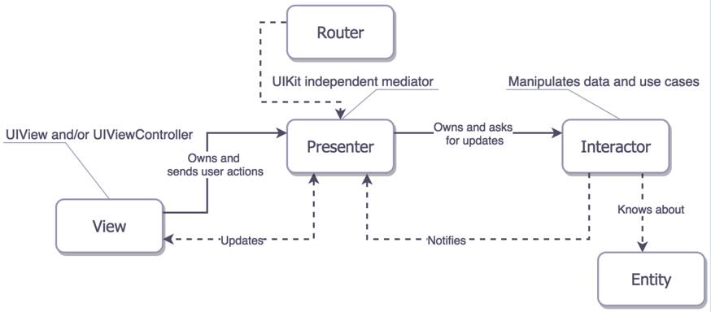

从上面可以看出VIPER应该是所有架构里面职责划分最为明确的，真正做到了SOLID原则。其他架构因为有VC的存在，或多或少都会导致各层的职责划分不明确。但是也由于VIPER的分层过多，并且是唯一一个把界面路由功能单独分离出来放到一个单独的类里面处理，所有的事件响应和界面跳转都需要自己处理，这导致代码复杂度大大增加。

Apple苦心孤诣的给我们搞出一个VC，虽然会导致层次耦合，但是也确实简化了开发流程，而VIPER则是彻底抛弃了VC，重新进行分层，做到了每个模块都可以单独测试和复用，但是也导致了代码过多、逻辑比较绕的问题。

就我个人经验来说，其实只要做好分层和规划，MVC架构足够应付大多数场景。有些文章上来就说MVVM是为了解决C层臃肿, MVC难以测试的问题, 其实并不是这样的. 按照架构演进顺序来看, C层臃肿大部分是没有拆分好MVC模块, 好好拆分就行了, 用不着MVVM。 而MVC难以测试也可以用MVP来解决, 只是MVP也并非完美, 在VP之间的数据交互太繁琐, 所以才引出了MVVM。 而VIPER则是跳出了MVX架构，自己开辟一条新的路。

VIPER是非常干净的架构。它将每个模块与其他模块隔离开来。因此，更改或修复错误非常简单，因为您只需要更新特定的模块。此外，VIPER还为单元测试创建了一个非常好的环境。由于每个模块独立于其他模块，因此保持了低耦合。在开发人员之间划分工作也很简单。
不应该在小项目中使用VIPER，因为MVP或MVC就足够了

关于到底是否应该在项目中使用VIPER，大家可以看下Quora上面的讨论：

[Should I use Viper architecture for my next iOS application, or it is still very new to use?](https://www.quora.com/Should-I-use-Viper-architecture-for-my-next-iOS-application-or-it-is-still-very-new-to-use)

### 2、VIPER各层职责

* Interactor（交互器） - 这是应用程序的主干，因为它包含应用程序中用例描述的业务逻辑。交互器负责从数据层获取数据，并执行特定场景下的业务逻辑，其实现完全独立于用户界面。
* Presenter（展示器） - 它的职责是从用户操作的Interactor获取数据，创建一个Entities实例，并将其传送到View以显示它。
* Entities（实体） - 纯粹的数据对象。不包括数据访问层，因为这是 Interactor 的职责。
* Router（路由） - 负责 VIPER 模块之间的跳转
* View（视图）- 视图的责任是将用户操作发送给演示者，并显示presenter告诉它的任何内容

PS:
数据的获取应该单独放到一个层，而不应该放到Interactor里面

可以看到一个应用场景的所有功能点都被分离成功能完全独立的层，每个层的职责都是单一的。在VIPER架构中，每个块对应于具有特定任务，输入和输出的对象。它与装配线中的工作人员非常相似：一旦工作人员完成其对象上的作业，该对象将传递给下一个工作人员，直到产品完成。

层之间的连接表示对象之间的关系，以及它们彼此传递的信息类型。通过协议给出从一个实体到另一个实体的通信。

这种架构模式背后的想法是隔离应用程序的依赖关系，平衡实体之间的责任分配。基本上，VIPER架构将您的应用程序逻辑分为较小的功能层，每个功能都具有严格的预定责任。这使得更容易测试层之间边界的交互。它适用于单元测试，并使您的代码更可重用。

### 3、VIPER 架构的主要优点

* 简化复杂项目。由于模块独立，VIPER对于大型团队来说真的很好。
* 使其可扩展。使开发人员尽可能无缝地同时处理它
* 代码达到了可重用性和可测试性
* 根据应用程序的作用划分应用程序组件，设定明确的责任
* 可以轻松添加新功能
* 由于您的UI逻辑与业务逻辑分离，因此可以轻松编写自动化测试
* 它鼓励分离使得更容易采用TDD的关注。Interactor包含独立于任何UI的纯逻辑，这使得通过测试轻松开车
* 创建清晰明确的接口，独立于其他模块。这使得更容易更改界面向用户呈现各种模块的方式。
* 通过单一责任原则，通过崩溃报告更容易地跟踪问题
* 使源代码更清洁，更紧凑和可重用
* 减少开发团队内的冲突数量
* 适用SOLID原则
* 使代码看起来类似。阅读别人的代码变得更快。

VIPER架构有很多好处，但重要的是要将其用于大型和复杂的项目。由于所涉及的元素数量，这种架构在启动新的小型项目时会导致开销，因此VIPER架构可能会对无意扩展的小型项目造成过高的影响。因此，对于这样的项目，最好使用别的东西，例如MVC。

### 4、如何构建正确的VIPER

我们来构建一个小的VIPER应用，我不想把上面的demo用VIPER再重写一次了，因为太麻烦了，所以就写一个简单的demo给大家演示下VIPER，但是麻雀虽小五脏俱全，该有的功能都有了。

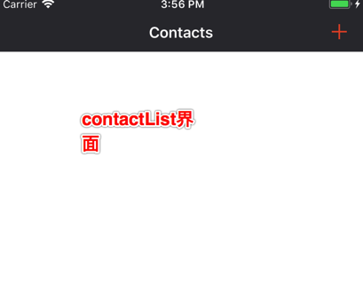

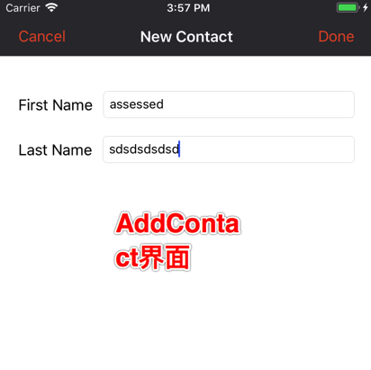

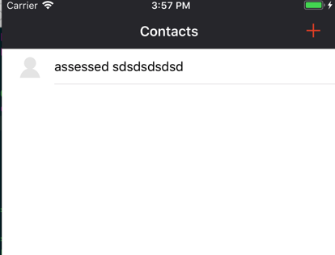

如上图所示，有两个界面contactlist和addcontact，在contactlist的右上角点击添加按钮，跳转到addcontact界面，输入firstname和secondname后点击done按钮，回到contactlist界面，新添加的用户就显示在该界面上了。

先看下项目的架构，如下所示：

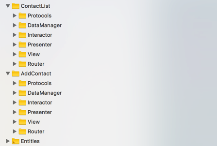

可以看到每个界面都有6个文件夹，还有两个界面公用的Entities文件夹，每个文件夹对应一个分层，除了VIPER的五层之外，每个界面还有两个文件夹：Protocols和DataManager层。

Protocols定义的VIPER的每层需要遵守的协议，每层对外暴露的操作都经过protocol抽象了，这样可以针对抽象编程。DataManager定义的是数据操作，包括从本地和网络获取、存储数据的操作。

下面先来看看Protocols类的实现：

```
import UIKit

/**********************PRESENTER OUTPUT***********************/

// PRESENTER -> VIEW
protocol ContactListViewProtocol: class {
    var presenter: ContactListPresenterProtocol? { get set }
    func didInsertContact(_ contact: ContactViewModel)
    func reloadInterface(with contacts: [ContactViewModel])
}

// PRESENTER -> router
protocol ContactListRouterProtocol: class {
    static func createContactListModule() -> UIViewController
    func presentAddContactScreen(from view: ContactListViewProtocol)
}

//PRESENTER -> INTERACTOR
protocol ContactListInteractorInputProtocol: class {
    var presenter: ContactListInteractorOutputProtocol? { get set }
    var localDatamanager: ContactListLocalDataManagerInputProtocol? { get set }
    func retrieveContacts()
}

/**********************INTERACTOR OUTPUT***********************/

// INTERACTOR -> PRESENTER
protocol ContactListInteractorOutputProtocol: class {
    func didRetrieveContacts(_ contacts: [Contact])
}

//INTERACTOR -> LOCALDATAMANAGER
protocol ContactListLocalDataManagerInputProtocol: class {

    func retrieveContactList() throws -> [Contact]
}

/**********************VIEW OUTPUT***********************/
// VIEW -> PRESENTER
protocol ContactListPresenterProtocol: class {
    var view: ContactListViewProtocol? { get set }
    var interactor: ContactListInteractorInputProtocol? { get set }
    var wireFrame: ContactListRouterProtocol? { get set }
    func viewDidLoad()
    func addNewContact(from view: ContactListViewProtocol)
}复制代码
```

其实从该类中就可以清晰看到VIPER各层之间的数据流向，非常清晰。
然后就是各层去具体实现这些协议了，这里就不贴代码了，大家可以去demo里面看。下面主要讲一下路由层，这是VIPER所独有的，其他的MVX架构都是把路由放到了VC里面做，而VIPER架构因为彻底摒弃了VC，所以把界面之间的路由单独做了一层。

下面来具体看看

#### ContactListRouter

```
import UIKit

class ContactListRouter: ContactListRouterProtocol {

    //生成ContactList的View
    class func createContactListModule() -> UIViewController {
        let navController = mainStoryboard.instantiateViewController(withIdentifier: "ContactsNavigationController")
        if let view = navController.childViewControllers.first as? ContactListView {
            let presenter: ContactListPresenterProtocol & ContactListInteractorOutputProtocol = ContactListPresenter()
            let interactor: ContactListInteractorInputProtocol = ContactListInteractor()
            let localDataManager: ContactListLocalDataManagerInputProtocol = ContactListLocalDataManager()
            let router: ContactListRouterProtocol = ContactListRouter()

            //绑定VIPER各层
            view.presenter = presenter
            presenter.view = view
            presenter.wireFrame = router
            presenter.interactor = interactor
            interactor.presenter = presenter
            interactor.localDatamanager = localDataManager

            return navController
        }
        return UIViewController()
    }

    //导航到AddContact界面
    func presentAddContactScreen(from view: ContactListViewProtocol) {
        guard let delegate = view.presenter as? AddModuleDelegate else {
            return
        }
        let addContactsView = AddContactRouter.createAddContactModule(with: delegate)
        if let sourceView = view as? UIViewController {
            sourceView.present(addContactsView, animated: true, completion: nil)
        }
    }

    static var mainStoryboard: UIStoryboard {
        return UIStoryboard(name: "Main", bundle: Bundle.main)
    }

}复制代码
```

ContactListRouter有三个功能：

1. 生成ContactList的view
2. 绑定ContactList场景下VIPER各层
3. 路由到AddContact界面

第一个功能被APPDelegate调用：

```
func application(_ application: UIApplication, didFinishLaunchingWithOptions launchOptions: [UIApplicationLaunchOptionsKey: Any]?) -> Bool {

        let contactsList = ContactListRouter.createContactListModule()

        window = UIWindow(frame: UIScreen.main.bounds)
        window?.rootViewController = contactsList
        window?.makeKeyAndVisible()

        return true
    }复制代码
```

第二个功能点击ContactList的界面的右上角添加按钮调用：

```
class ContactListView: UIViewController {
    var presenter: ContactListPresenterProtocol?

    //点击添加按钮，调用presenter的对应业务逻辑
    @IBAction func didClickOnAddButton(_ sender: UIBarButtonItem) {
        presenter?.addNewContact(from: self)
    }
}

=================

//presenter实现添加按钮的业务逻辑，调用router的跳转逻辑，调到AddContact界面
class ContactListPresenter: ContactListPresenterProtocol {
    weak var view: ContactListViewProtocol?
    var interactor: ContactListInteractorInputProtocol?
    var router: ContactListRouterProtocol?

    func addNewContact(from view: ContactListViewProtocol) {
        router?.presentAddContactScreen(from: view)
    }

}复制代码
```

同样的AddContact的router层的功能也类似，大家可以自己去领会。从上面的代码可以看到VIPER架构的最大特点就是实现了SOLID原则，每层只做自己的事情，职责划分的非常清楚，自己的任务处理完后就交给下一个层处理。

看完上面的代码是不是觉得这也太绕了吧，是的，我也这么觉得，但是不得不说VIPER的优点也有很多，上面已经列举了。所以如果是中小型的项目，还是用MVX架构吧，如果MVX架构依然hold不住你的每个类都在膨胀，那么试试VIPER你可能会有新的发现。

其实我倒觉得VIPER彻底放弃Apple的VC有点得不偿失，个人还是喜欢用VC来做界面路由，而不是单独搞一个router层去路由，这样既借鉴了VIPER的优点，有兼顾了VC的好处，具体的看最后的demo，我这里就不展开说了，大家做一个对比应该就有了解。

### 5、VIPER参考书籍

[The-Book-of-VIPER](https://github.com/strongself/The-Book-of-VIPER)

号称是唯一一本介绍VIPER的书籍，然而完整版只有俄语的，不过我们有万能的谷歌翻译，只要不是火星文都可以看啦~

### 6、VIPER代码模板生成器

由于VIPER架构的类比较多，还要写一堆模块之间的协议，如果每次都要手写的话，太心累了~ 所以大家可以试试下面的代码生成器，一次生成VIPER的代码模板

[viper-module-generator](https://github.com/pepibumur/viper-module-generator?utm_source=swifting.io&amp;utm_medium=web&amp;utm_campaign=blog%20post)

[Generamba](https://github.com/rambler-digital-solutions/Generamba)

[ViperCode](https://github.com/iSame7/ViperCode?utm_source=swifting.io&amp;utm_medium=web&amp;utm_campaign=blog%20post)

- - - -

## Demo下载

[VIPER-DEMO](http://7xslqw.com1.z0.glb.clouddn.com/VIPER-DEMO.zip)

[MVX架构DEMO](http://7xslqw.com1.z0.glb.clouddn.com/MVC-MVP-MVVM.zip)

[改造后的VIERP Demo](http://7xslqw.com1.z0.glb.clouddn.com/改造后的VIERP.zip)
