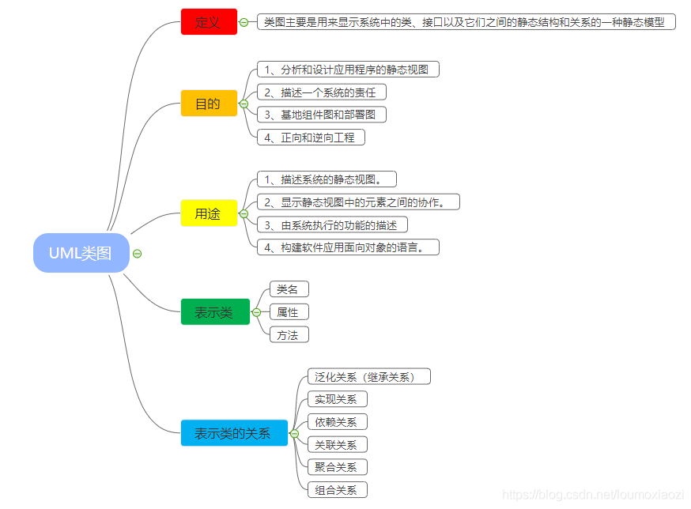
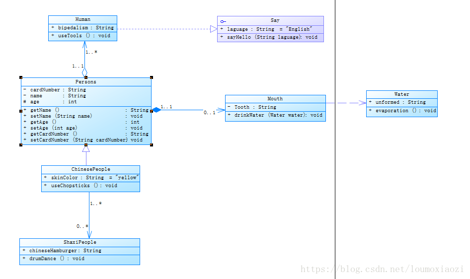
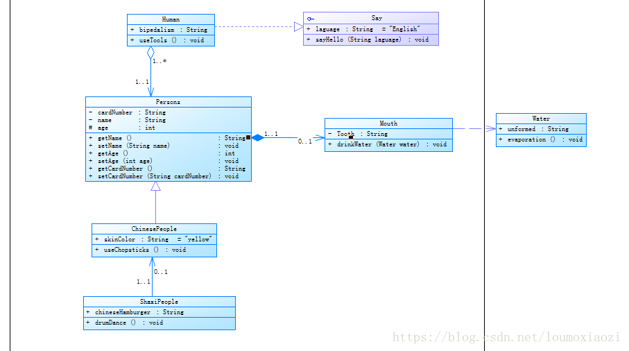
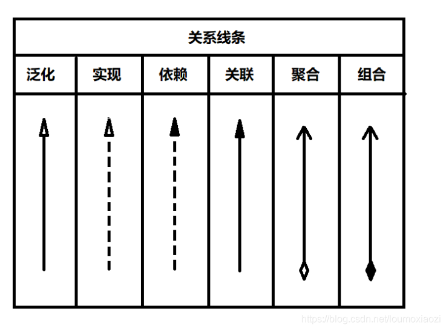
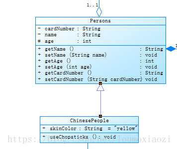
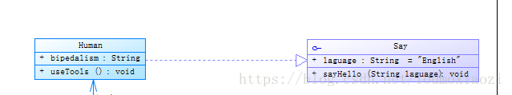
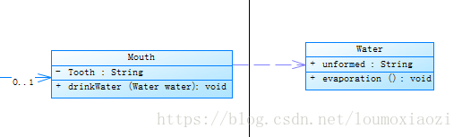
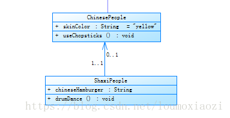
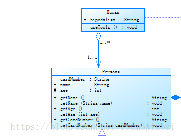
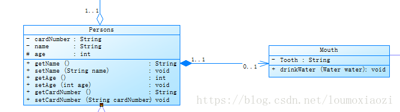

# UML类图详解说明

## 一、 UML类图思维导图



## 二、 详细分析和介绍

下面就从上面的思维导图开始，详细的介绍UML类图！

### 1、 什么是UML，概念是什么？

>UML（Unified Modeling Language）中文统一建模语言，是一种开放的方法，用于说明、可视化、构建和编写一个正在开发的、面向对象的、软件密集系统的制品的开放方法。UML展现了一系列最佳工程实践，这些最佳实践在对大规模，复杂系统进行建模方面，特别是在软件架构层次已经被验证有效。 【维基百科】

>统一建模语言（英语：Unified Modeling Language，缩写 UML）是非专利的第三代建模和规约语言。UML是一种开放的方法，用于说明、可视化、构建和编写一个正在开发的、面向对象的、软件密集系统的制品的开放方法。【维基百科】

UML分为UML模型和UML类图。

区分UML模型和UML图是非常重要的，UML图，包括用例图、协作图、活动图、序列图、部署图、构件图、类图、状态图，是模型中信息的图形表达方式，但是UML模型独立于UML图存在。

### 2、为什么要用UML？类图的作用

UML展现了一系列最佳工程实践，这些最佳实践在对大规模，复杂系统进行建模方面，特别是在软件架构层次已经被验证有效。
类图的作用：

> （1）：在软件工程中，类图是一种静态的结构图，描述了系统的类的集合，类的属性和类之间的关系，可以简化了人们对系统的理解；  
> （2）：类图是系统分析和设计阶段的重要产物，是系统编码和测试的重要模型。  

### 3、 类的UML的介绍和画法？

我们用 PowerDesign 来构建 UML图


类的UML使用包含 **类名、属性、方法名** 以及参数。使用带分割线的长方形表示。




- 一、**类名** 在第一部分 每个类都必须有一个名字，类名是一个字符串，根据java命名规范 类名首字母大写

- 二、**属性** 在第二部分 属性是指类的性质，即类的成员变量。一个类可以有任意多个属性，也可以没有属性。

UML规定属性的表示方式为：

>可见性 名称:类型 [ = 缺省值 ]

1. **可见性：** 表示该属性对于类外的元素而言是否可见，包括公有(public)、私有(private)和受保护(protected)三种，在类图中分别用符号+、-和#表示。 +表示 public属性， - 表示 private属性， # 表示 protected属性
2. **名称：** 表示属性名，用一个字符串表示。
3. **类型：** 表示属性的数据类型，可以是基本数据类型，也可以是用户自定义类型。
4. **缺省值：** 是一个可选项，即属性的初始值。
>   

- 三、 方法(操作) 在第三部分 操作是类的任意一个实例对象都可以使用的行为，是类的成员方法。

UML规定操作的表示方式为：

>可见性 名称(参数列表) [ : 返回类型]

1. **可见性:** 定义与属性的可见性定义相同。
2. **名称:** 即方法名，用一个字符串表示。
3. **参数列表:** 表示方法的参数，其语法与属性的定义相似，参数个数是任意的，多个参数之间用逗号“，”隔开。
4. **返回类型:** 是一个可选项，表示方法的返回值类型，依赖于具体的编程语言，可以是基本数据类型，也可以是用户自定义类型，还可以是空类型(void)，如果是构造方法，则无返回类型。


由于在Java语言中允许出现内部类，因此可能会出现包含四个部分的类图，如图所示：


接口的UML比类多了一个 **圆圈和横线** 其他类似。


现在我们来讲类与类的四种种关系：
- 泛化（Generalization）
- 实现（Realization）
- 依赖（Dependence）
- 关联（Association），其中关联又分为:
  - 关联
  - 聚合（Aggregation）
  - 组合（Composition）。

**表示关系的强弱** ：依赖 < 关联 < 聚合 < 组合 < 泛化（继承）

UML类图关系线条:



- (1). 泛化关系表示类与类之间的继承关系，类和类，接口和接口都可以是继承关系，父类称为基类或者超类，子类称为派生类。子类继承父类实现父类的所有功能，并拥有父类没有的功能！

**UML图**：



**代码**：

```java
public class Persons {

   private String cardNumber;
   
   private String name;
   
   
   protected int age;
   
   /** @pdRoleInfo migr=no name=Mouth assc=组合_Composition mult=0..1 type=Composition */
   public Mouth mouth;
   
   public String getName() {
      return name;
   }
   
   public void setName(String name) {
      this.name=name;
   }
   
   public int getAge() {
      // TODO: implement
      return age;
   }
   
   public void setAge(int age) {
      this.age=age;
   }
   
   public String getCardNumber() {
      return cardNumber;
   }
   
   public void setCardNumber(String cardNumber) {
      this.cardNumber=cardNumber;
   }
}

public class ChinesePeople extends Persons {

   public String skinColor = "yellow";
   
   public ShaxiPeople[] shaxiPeople;
   
   public void useChopsticks() {
      
   }

}
```

- (2). 实现关系就是java中的一个类和接口之间的关系，接口中一般是没有成员变量。所有操作都是抽象的，只有声明没有具体的实现。

**UML图**：



**代码**：

```
public interface Say {
   
   static final String laguage = "English";
   
   void sayHello(String laguage);

}

public class Human implements Say {

	public String bipedalism;

	/** @pdRoleInfo migr=no name=Persons assc=聚合_Aggregation mult=1..1 type=Aggregation */
	public Persons persons;

	public void useTools() {
		
	}

	public void sayHello(String laguage) {

	}

}
```

- (3). 依赖关系是类与类之间最弱的关系，A元素变化会影响B元素，反之不成立。说简单点就是一个类使用了另一个类，这种关系具有临时性特征，一个类的改变由于另一类而受影响。

**解释**

也就是 当类A当中使用了类B，其中类B是作为类A的方法参数、方法中的局部变量、或者静态方法调用。

**UML图**：



**代码**：

```java
public class Water {
	
	public String unformed;

	public void evaporation() {
		
	}

}

public class Mouth {
   
   public String Tooth;
   
   public void drinkWater(Water water) {
      
   }

}
```

- (4). 关联关系表示一个类和另一类有联系，它使一个类知道另一个类的属性和方法，被关联的元素间通常可以被独立的考虑。

> 单向关联表现为：类A当中使用了类B，其中类B是作为类A的成员变量。  
> 双向关联表现为：类A当中使用了类B作为成员变量；同时类B中也使用了类A作为成员变量。  

UML图：



代码：

```java
public class ChinesePeople extends Persons {

   public String skinColor = "yellow";
   
   public void useChopsticks() {
      
   }
}

public class ShaxiPeople {
   public String chineseHamburger;
   
   /** @pdRoleInfo migr=no name=ChinesePeople assc=关联_Association mult=0..1 */
   public ChinesePeople chinesePeople;
   
   public void drumDance() {
      // TODO: implement
   }
}
```

> 1…1 表示另一个类的一个对象只与该类的一个对象有关系 
> 0…* 表示另一个类的一个对象与该类的零个或多个对象有关系 
> 1…* 表示另一个类的一个对象与该类的一个或多个对象有关系  
> 0…1 表示另一个类的一个对象没有或只与该类的一个对象有关系  

- (5). 聚合关系是整体和部分的关系，是一种强的关系，但是部分可以脱离整体而存在。是关联关系的一种。

**解释**

聚合关系是关联关系的一种，耦合度强于关联，他们的代码表现是相同的，仅仅是在语义上有所区别：关联关系的对象间是相互独立的，而聚合关系的对象之间存在着包容关系，他们之间是“整体-个体”的相互关系。

**UML图**：



**代码**：

```java
public class Human implements Say {

	public String bipedalism;	
	
	/** @pdRoleInfo migr=no name=Persons assc=聚合_Aggregation mult=1..1 type=Aggregation */
	public Persons persons;
	
	public void useTools() {
		
	}

	public void sayHello(String laguage) {

	}

}

public class Persons {

   private String cardNumber;
   
   private String name;
    
   protected int age;
   
   /** @pdRoleInfo migr=no name=Mouth assc=组合_Composition mult=0..1 type=Composition */
   public Mouth mouth;
     
   public String getName() {
      return name;
   }
   
   public void setName(String name) {
      this.name=name;
   }
   
   public int getAge() {
      // TODO: implement
      return age;
   }
   
   public void setAge(int age) {
      this.age=age;
   }
   
   public String getCardNumber() {
      return cardNumber;
   }
   
   public void setCardNumber(String cardNumber) {
      this.cardNumber=cardNumber;
   }
   
 }
```

- (6). 组合关系是聚合关系的一种变种，便是了更强的组合关系，它要求整体的对象代表部分对象的生命周期。

**解释**

相比于聚合，组合是一种耦合度更强的关联关系。存在组合关系的类表示“整体-部分”的关联关系，“整体”负责“部分”的生命周期，他们之间是共生共死的；并且“部分”单独存在时没有任何意义。

**UML图**：



**代码**：

```java
public class Mouth {
   
   public String Tooth;
   
   public void drinkWater(Water water) {
      
   }

}

public class Persons {

   private String cardNumber;
   
   private String name;
   
   
   protected int age;
   
   /** @pdRoleInfo migr=no name=Mouth assc=组合_Composition mult=0..1 type=Composition */
   public Mouth mouth;
   
   public String getName() {
      return name;
   }
   
   public void setName(String name) {
      this.name=name;
   }
   
   public int getAge() {
      // TODO: implement
      return age;
   }
   
   public void setAge(int age) {
      this.age=age;
   }
   
   public String getCardNumber() {
      return cardNumber;
   }
   
   public void setCardNumber(String cardNumber) {
      this.cardNumber=cardNumber;
   }
}
```


[一、 UML类图思维导图](https://blog.csdn.net/loumoxiaozi/article/details/81036408)