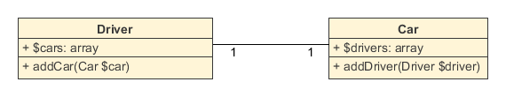
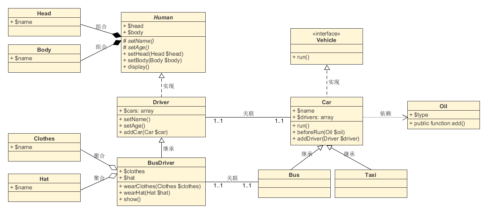

- [UML类图介绍以及关系详解](#uml类图介绍以及关系详解)
  - [1.什么是UML](#1什么是uml)
  - [2.什么是UML类图](#2什么是uml类图)
  - [3.类](#3类)
  - [4.类关系](#4类关系)
    - [4.1.继承](#41继承)
    - [4.2 实现](#42-实现)
    - [4.3 依赖关系](#43-依赖关系)
    - [4.4 关联关系](#44-关联关系)
      - [4.4.1 双向关联](#441-双向关联)
      - [4.4.2 单向关联](#442-单向关联)
      - [4.4.3 自关联](#443-自关联)
      - [4.4.4 多重性关联](#444-多重性关联)
    - [4.5 聚合关系](#45-聚合关系)
    - [4.6 组合关系](#46-组合关系)

# UML类图介绍以及关系详解

## 1.什么是UML
Unified Modeling Language (UML)又称统一建模语言或标准建模语言，是始于1997年一个OMG标准，它是一个支持模型化和软件系统开发的图形化语言，为软件开发的所有阶段提供模型化和可视化支持，包括由需求分析到规格，到构造和配置。
UML规范用来描述建模的概念有，类（对象的）、对象、关联、职责、行为、接口、用例、包、顺序、协作，以及状态。

## 2.什么是UML类图

UML类图是一种结构图，用于描述一个系统的静态结构。类图以反映类结构和类之间关系为目的，用以描述软件系统的结构，是一种静态建模方法。类图中的类，与面向对象语言中的类的概念是对应的。

在系统设计阶段，类图直接引导面向对象的编程语言实现类。类图是生成代码的核心要图。如果类图设计得好，整个系统的代码框架可以有类图自动生成，大大简化了系统编码所耗费的时间。因此，我们进一步:利用类图，使得代码的编写编程一种自动化工作，而整个信息系统的建设中心都可以集中到分析设计上来。

**绘制UML工具**

* 网页版:[https://www.processon.com/](https://www.processon.com/)
* 软件版:PowerDesigner(个人使用)、UMLet、Viso、StartUML

## 3.类

类（Class）是指具有相同属性、方法和关系的对象的抽象，它封装了数据和行为，是面向对象程序设计（OOP）的基础，具有封装性、继承性和多态性等三大特性。在UML中，使用长方形描述一个类的主要构成，长方形垂直地分为三层，以此放置类的 **名称**、**属性** 和 **方法** 。

其中，一般类的类名用正常字体粗体表示，如上图；抽象类名用斜体字粗体，如 ***User*** ；接口则需在名称上方加上 `<<interface>>` 。

属性和方法都需要标注可见性符号， `+` 代表 `public` ， `#` 代表 `protected` （friendly也归入这类）， `-` 代表 `private` 。

另外，还可以用冒号 `:` 表明属性的类型和方法的返回类型，如 `+$name:string`、`+getName():string。`

（1）属性的完整表示方式是这样的：

**可见性  名称 ：类型 [ = 缺省值]**

中括号中的内容表示是可选的。

（2）方法的完整表示方式如下：

**可见性  名称(参数列表) [ ： 返回类型]**

同样，中括号中的内容是可选的。

类图中，需注意以下几点：
- 抽象类或抽象方法用斜体表示
- 如果是接口，则在类名上方加 `<<Interface>>`
- 字段和方法返回值的数据类型非必需
- 静态类或静态方法加下划线

## 4.类关系

类与类之间的关系主要有六种： **继承**、**实现**、**依赖**、**关联**、**聚合**和**组合**这六种关系的箭头表示如下，（继承、实现、依赖和关联四种，其中关联又可以分为关联、聚合和组合三种）

### 4.1.继承

**继承关系** 也称 **泛化关系** （Generalization），用于描述父类与子类之间的关系。父类又称作基类，子类又称作派生类。

继承关系中，子类继承父类的所有功能，父类所具有的属性、方法，子类应该都有。子类中除了与父类一致的信息以外，还包括额外的信息。

【箭头指向】：带三角箭头的实线，箭头指向父类

例如：公交车、出租车和小轿车都是汽车，他们都有名称，并且都能在路上行驶。

### 4.2 实现

**实现关系** （Implementation），主要用来规定 **接口和实现类的关系** 。

**接口** （包括 **抽象类** ）是方法的集合，在实现关系中，类实现了接口，类中的方法实现了接口声明的所有方法。

【箭头指向】：带三角箭头的虚线，箭头指向接口（还有一种棒棒糖表示法，在下面大话设计模式举例中有）

例如：汽车和轮船都是交通工具，而交通工具只是一个可移动工具的抽象概念，船和车实现了具体移动的功能。

### 4.3 依赖关系

依赖关系（Dependence）：假设A类的变化引起了B类的变化，则说名B类依赖于A类。

大多数情况下， **依赖关系体现在某个类的方法使用另一个类的对象作为参数** 。

依赖关系是一种“使用”关系，特定事物的改变有可能会影响到使用该事物的其他事物，在需要表示一个事物使用另一个事物时使用依赖关系。

【代码表现】：局部变量、方法的参数或者对静态方法的调用

【箭头及指向】：带箭头的虚线，指向被使用者

例如：汽车依赖汽油，如果没有汽油，汽车将无法行驶。

### 4.4 关联关系

关联关系（Association）：表示 **一个类的属性保存了对另一个类的一个实例（或多个实例）的引用** 。

关联关系是类与类之间 **最常用** 的一种关系，表示一类对象与另一类对象之间有联系。 **组合、聚合也属于关联关系** ，只是关联关系的类间关系比其他两种要弱。

关联关系有四种： **双向关联**、**单向关联**、**自关联**、**多重数关联** 。

【代码体现】：成员变量

【箭头及指向】：带普通箭头的实心线，指向被拥有者

例如：汽车和司机，一辆汽车对应特定的司机，一个司机也可以开多辆车。

在UML图中，双向的关联可以有 **两个箭头** 或者 **没有箭头** ，单向的关联或自关联有 **一个箭头** 

#### 4.4.1 双向关联

默认情况下，关联是双向的。例如：顾客(Customer)购买商品(Product)并拥有商品，反之，卖出的商品总有某个顾客与之相关联。因此，Customer类和Product类之间具有双向关联关系，如图所示：

#### 4.4.2 单向关联

类的关联关系也可以是单向的，单向关联用带箭头的实线表示。例如：顾客(Customer)拥有地址(Address)，则Customer类与Address类具有单向关联关系，如图所示：

#### 4.4.3 自关联

在系统中可能会存在一些类的属性对象类型为该类本身，这种特殊的关联关系称为自关联。例如：一个节点类(Node)的成员又是节点Node类型的对象，如图所示：

#### 4.4.4 多重性关联

多重性关联关系又称为重数性(Multiplicity)关联关系，表示两个关联对象在数量上的对应关系。在UML中，对象之间的多重性可以直接在关联直线上用一个数字或一个数字范围表示。

对象之间可以存在多种多重性关联关系，常见的多重性表示方式如表所示：

例如：一个界面(Form)可以拥有零个或多个按钮(Button)，但是一个按钮只能属于一个界面，因此，一个Form类的对象可以与零个或多个Button类的对象相关联，但一个Button类的对象只能与一个Form类的对象关联，如图所示：

### 4.5 聚合关系

聚合关系（Aggregation）： **整体和部分的关系，整体与部分可以分开。**

聚合关系也表示类之间整体与部分的关系，成员对象是整体对象的一部分，但是成员对象可以脱离整体对象独立存在。

【代码体现】：成员变量

【箭头及指向】：带空心菱形的实心线，菱形指向整体

例如：公交车司机和工衣、工帽是整体与部分的关系，但是可以分开，工衣、工帽可以穿在别的司机身上，公交司机也可以穿别的工衣、工帽。

### 4.6 组合关系

组合关系（Composition）： **整体与部分的关系，但是整体与部分不可以分开** 。

组合关系表示类之间整体与部分的关系，整体和部分有一致的生存期。一旦整体对象不存在，部分对象也将不存在，是同生共死的关系。

【代码体现】：成员变量

【箭头及指向】：带实心菱形的实线，菱形指向整体

例如：人由头部和身体组成，两者不可分割，共同存在。

各种关系的强弱顺序：

继承 > 实现 > 组合 > 聚合 > 关联 > 依赖

上述关系的完整类图如下：

最后作为复习，我们借鉴《大话设计模式》一书上举例子来通俗且完整的说明：

首先，看动物矩形框，它代表一个类（ *Class* ）。类图分三层，第一层显示类的名称，如果是抽象类，则就用斜体显示。第二层是类的特性，通常就是字段和属性。第三层是类的操作，通常是方法或行为。前面的符号， *+* 表示 *public* ， *-* 表示 *private* ， *#* 表示 *protected* 。

右下角的飞翔，它表示一个接口图，与类图的区别主要是顶端的 `<<interface>>` 显示。第一行是接口名称，第二行是接口方法。

接口还有另一种表示方法，俗称棒棒糖表示法，如下图。唐老鸭是能讲人话的鸭子，实现了讲人话的接口。

接下来的是类与类，类与接口之间的关系了。首先注意动物、鸟、鸭、唐老鸭之间的关系符号。它们都是继承的关系，继承关系用空心三角形 *+* 实线来表示的。

上述所列举的几种鸟中，大雁最能飞，让它实现了飞翔接口。实现接口用空心三角形 + 虚线来表示。

企鹅和气候两个类，企鹅是很特别的鸟，会游不会飞。更重要的是，它与气候有很大的关联。我们不去讨论为什么北极没有企鹅，为什么它们要每年长途跋涉。总之，企鹅需要知道气候的变化，需要了解气候规律。当一个类知道另一个类时，可以用关联（ *association* ）。关联关系用实线箭头来表示。

再来看大雁和雁群这两个类，大雁是群居动物，每只大雁都是属于一个雁群，一个雁群可以有多只大雁。所以它们之间就满足聚合（ *Aggregation* ）关系。聚合表示一种弱的拥有关系，体现的是 *A* 对象可以包含 *B* 对象，但 *B* 对象不是 *A* 对象的一部分。聚合关系用空心的菱形 *+* 实线箭头来表示。

组合（ *Composition* ）是一种强的拥有关系，体现了严格的部分和整体的关系，部分和整体的生命周期一样。在这里鸟和其翅膀就是组合关系，因为它们是部分和整体的关系，并且翅膀和鸟的生命周期是相同的。组合关系用实习的菱形 *+* 实线箭头来表示。另外，你会注意到合成关系的连线两端还有一个数字 *1* 和数字 *2* ，这被称为基数。表明这一端的类可以有几个实例，很显然，一个鸟应该有两只翅膀。如果一个类可能有无数个实例，则就是 *n* 来表示。关系关系、聚合关系也可以有基数的。

动物的几大特征，比如有新陈代谢，能繁殖。而动物要有生命力，需要氧气、水以及食物等。也就是说，动物依赖于氧气和水。他们之间是依赖关系（ *Dependency* ），用虚线箭头来表示。

参考，感谢以下大佬的资料：

[UML类图几种关系的总结](http://www.uml.org.cn/oobject/201609062.asp)

[UML类图详解](https://www.awaimai.com/patterns/uml)

[UML详解之二——类图](https://blog.csdn.net/xx326664162/article/details/50475352)

[五分钟读懂UML类图](https://www.cnblogs.com/shindo/p/5579191.html)

[大话设计模式——UML图](https://blog.csdn.net/bskfnvjtlyzmv867/article/details/73612817)

[深入浅出UML类图](http://www.uml.org.cn/oobject/201211231.asp)

[UML类图介绍以及关系详解 - 程序员大本营](https://www.pianshen.com/article/1059678851/)