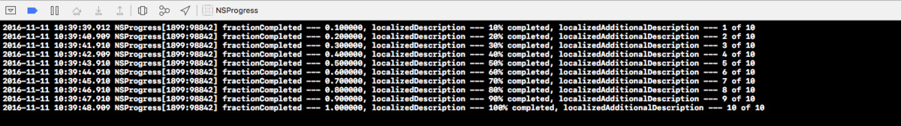
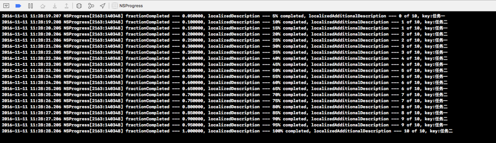
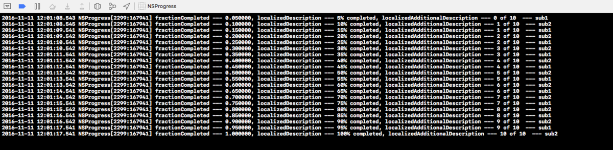

# 进度: NSProgress


#### 简介

* 在iOS7中, 苹果官方添加了新的类NSProgress。用来报告当前某个任务的进度, 或者多个任务的进度和这些任务的总进度等
* NSProgress可以是一个树状结构, 一个节点进度可以有多个子节点, 每一个子节点只有一个父节点, 每一个子节点都有自己独立的进度体系, 并且子节点完成任务后, 会将完成的数量反馈给父节点

#### 基本属性

* totalUnitCount: 总单元, 用来记载某个任务的总单元数 (可以理解为某个任务正常结束时, `需要完成的任务总量` )
* completedUnitCount: 已完成单元数量, 记载某个任务执行过程中已经完成的单元数量 (可以理解为, 某一个任务在执行过程中 `已经完成的任务量` )
* fractionCompleted: 某个任务 `已完成单元量` 占 `总单元量` 的比例
* localizedDescription: 通过 `字符串的形式` 描述 `当前任务完成度`
* localizedAdditionalDescription: 同localizedDescription一样, 用来描述 `当前任务的完成度`

	* 格式: `9 of 10` (总任务量为10, 已完成任务量为9, 即 完成量/总量)

#### 通过基本属性和KVO, 创建简单的单进度报告操作

```
#import "ViewController.h"

@interface ViewController ()

/** 进度 */
@property (nonatomic, strong) NSProgress *progress;

@end

@implementation ViewController

- (void)viewDidLoad {
    [super viewDidLoad];
    
    // 初始化进度对象, 并设置进度总量
    self.progress = [NSProgress progressWithTotalUnitCount:10];
    
    //使用KVO观察fractionCompleted的改变
    [self.progress addObserver:self forKeyPath:@"fractionCompleted" options:(NSKeyValueObservingOptionNew) context:nil];
}

/**
 当点击根视图时触发
 */
- (void)touchesBegan:(NSSet<UITouch *> *)touches withEvent:(UIEvent *)event
{
    //定时器
    NSTimer *timer = [NSTimer timerWithTimeInterval:1 target:self selector:@selector(task:) userInfo:nil repeats:YES];
    //加到当前运行循环
    [[NSRunLoop currentRunLoop] addTimer:timer forMode:NSRunLoopCommonModes];
}

/**
 定时器调用的方法
 */
- (void)task:(NSTimer *)timer
{
    if (self.progress.completedUnitCount >= self.progress.totalUnitCount) {
        [timer invalidate];
        return;
    }
    self.progress.completedUnitCount += 1;
}

/**
 KVO回调方法
 */
- (void)observeValueForKeyPath:(NSString *)keyPath ofObject:(id)object change:(NSDictionary<NSKeyValueChangeKey,id> *)change context:(void *)context
{
    //获取观察的新值
    CGFloat value = [change[NSKeyValueChangeNewKey] doubleValue];
    //打印
    NSLog(@"fractionCompleted --- %f, localizedDescription --- %@, localizedAdditionalDescription --- %@", value, self.progress.localizedDescription, self.progress.localizedAdditionalDescription);
}
@end
```



#### 添加子节点的方法 (IOS9之前)

* `- (void)becomeCurrentWithPendingUnitCount:(int64_t)unitCount`

	* 该方法是用来在当前节点中分出一个子节点, 当子节点完成时, 总的进度完成量自动加上unitCount
	* unitCount: 子节点完成时, 总任务完成的量

* `- (void)resignCurrent`

	* 与 `- (void)becomeCurrentWithPendingUnitCount:(int64_t)unitCount;` 配套使用, 在这两个方法中间需要设置至少一个子节点, 当子节点完成后, 总完成量会自动增加unitCount量, 如果不设置子节点, 那么总任务完成量直接增加unitCount
	* 注意点: 这两个方法成对出现, 并且必须在同一个队列中调用

* 多节点示例代码:

```
#import "ViewController.h"

//继承自NSProgress的类, 添加一个唯一标识key
@interface LTProgress : NSProgress
/** 唯一标识 */
@property (nonatomic, copy) NSString *key;
@end
@implementation LTProgress
@end

@interface ViewController ()

/** 进度 */
@property (nonatomic, strong) NSProgress *progress;

@end

@implementation ViewController

- (void)viewDidLoad {
    [super viewDidLoad];
    
    // 初始化进度对象, 并设置进度总量
    self.progress = [NSProgress progressWithTotalUnitCount:10];
    
    // 分出5个任务量给任务一
    [self.progress becomeCurrentWithPendingUnitCount:5];
    [self subTask:@"任务一"];
    [self.progress resignCurrent];
    
    // 分出5个任务量给任务二
    [self.progress becomeCurrentWithPendingUnitCount:5];
    [self subTask: @"任务二"];
    [self.progress resignCurrent];
}

- (void)subTask:(NSString *)key
{
    // 每个子任务的任务量分为10个单元, 每完成一个任务单元, 总任务完成量加上 5.0 / 10.0 = 0.5的任务单元
    LTProgress *subProgress = (LTProgress *)[LTProgress progressWithTotalUnitCount:10];
    subProgress.key = key;
    NSTimer *timer = [NSTimer scheduledTimerWithTimeInterval:1 target:self selector:@selector(task:) userInfo:@{@"subProgress" : subProgress} repeats:YES];
    [[NSRunLoop currentRunLoop] addTimer:timer forMode:NSRunLoopCommonModes];
}

- (void)task:(NSTimer *)timer
{
    //获取当前的进度
    NSDictionary *userInfo = timer.userInfo;
    LTProgress *subProgress = userInfo[@"subProgress"];
    //当完成量达到总量时停止任务
    if (subProgress.completedUnitCount >= subProgress.totalUnitCount) {
        [timer invalidate];
        return;
    }
    //模仿完成1份
    subProgress.completedUnitCount += 1;
    
    //打印
    NSLog(@"fractionCompleted --- %f, localizedDescription --- %@, localizedAdditionalDescription --- %@, key:%@", self.progress.fractionCompleted, self.progress.localizedDescription, self.progress.localizedAdditionalDescription, subProgress.key);
}

@end
```



* 当一个节点分出两个子节点时, 给每个子节点分配了需要完成的单元量, 只要子节点完成, 总节点的进度就会自动增加对应的节点单元量, 而子节点又可以将这些分配到的单元量重新进行分配

#### iOS9中的优化

* 在IOS9中新增了以下方法, 用来给节点添加子节点, 不用再使用上述两个方法

	* `+ (NSProgress *)progressWithTotalUnitCount:(int64_t)unitCount parent:(NSProgress *)parent pendingUnitCount:(int64_t)portionOfParentTotalUnitCount`
	* `- (void)addChild:(NSProgress *)child withPendingUnitCount:(int64_t)inUnitCount`
	* 可以通过这两个方法直接分出子任务进度

* 示例代码:

```
- (void)viewDidLoad {
    [super viewDidLoad];
    
    // 初始化进度对象, 并设置进度总量
    self.progress = [NSProgress progressWithTotalUnitCount:10];
    
    NSProgress *sub1 = [NSProgress progressWithTotalUnitCount:10 parent:self.progress pendingUnitCount:5];
    NSProgress *sub2 = [NSProgress progressWithTotalUnitCount:10 parent:self.progress pendingUnitCount:5];
    
    NSTimer *timer = [NSTimer scheduledTimerWithTimeInterval:1 target:self selector:@selector(task:) userInfo:@{@"sub1" : sub1, @"sub2" : sub2} repeats:YES];
    [[NSRunLoop currentRunLoop] addTimer:timer forMode:NSRunLoopCommonModes];
}

- (void)task:(NSTimer *)timer
{
    //获取当前的进度
    NSDictionary *userInfo = timer.userInfo;
    NSProgress *sub1 = userInfo[@"sub1"];
    NSProgress *sub2 = userInfo[@"sub2"];
    //当完成量达到总量时停止任务
    if (sub1.completedUnitCount >= sub1.totalUnitCount && sub2.completedUnitCount >= sub2.totalUnitCount) {
        [timer invalidate];
        return;
    }
    //模仿完成1份
    sub1.completedUnitCount += 1;
    NSLog(@"fractionCompleted --- %f, localizedDescription --- %@, localizedAdditionalDescription --- %@  --- sub1", self.progress.fractionCompleted, self.progress.localizedDescription, self.progress.localizedAdditionalDescription);
    
    sub2.completedUnitCount += 1;
    //打印
    NSLog(@"fractionCompleted --- %f, localizedDescription --- %@, localizedAdditionalDescription --- %@  --- sub2", self.progress.fractionCompleted, self.progress.localizedDescription, self.progress.localizedAdditionalDescription);
}
```

* 控制台打印:



* 属性 and 方法

```
// 获取当前线程的进度管理对象根节点
// 注意：当有NSProgress对象调用了becomeCurrentWithPendingUnitCount:方法后，这个方法才能获取到
+ (nullable NSProgress *)currentProgress;

// 创建NSProgress对象, 并设置进度单元的总数
+ (NSProgress *)progressWithTotalUnitCount:(int64_t)unitCount;

// iOS9后使用 创建NSProgress对象, 并设置进度单元的总数
+ (NSProgress *)discreteProgressWithTotalUnitCount:(int64_t)unitCount NS_AVAILABLE(10_11, 9_0);

/**
   iOS9后使用, 创建一个NSProgress对象, 并指定父节点, 当完成时父节点完成单元数量 + portionOfParentTotalUnitCount

   @param unitCount                     任务进度的单元数量
   @param parent                        父节点, 可传入nil
   @param portionOfParentTotalUnitCount 自身完成时, 父节点进度总量增加的值, 即父节点分配的任务量

   @return NSProgress对象, 是parent的子节点
 */
+ (NSProgress *)progressWithTotalUnitCount:(int64_t)unitCount parent:(NSProgress *)parent pendingUnitCount:(int64_t)portionOfParentTotalUnitCount NS_AVAILABLE(10_11, 9_0);

// iOS9后使用, 同上
- (instancetype)initWithParent:(nullable NSProgress *)parentProgressOrNil userInfo:(nullable NSDictionary *)userInfoOrNil NS_DESIGNATED_INITIALIZER;

// 注册为当前线程根节点, 并分配子节点的任务量
- (void)becomeCurrentWithPendingUnitCount:(int64_t)unitCount;

// 取消注册 与注册方法必须同步出现, 必须在同一个线程内
- (void)resignCurrent;

// iOS9后使用, 向一个节点中添加一个子节点
- (void)addChild:(NSProgress *)child withPendingUnitCount:(int64_t)inUnitCount NS_AVAILABLE(10_11, 9_0);

#pragma mark *** Reporting Progress ***
// 进度单元总数
@property int64_t totalUnitCount;

// 进度单元已完成数
@property int64_t completedUnitCount;

// 描述进度 例如: 80% completed
@property (null_resettable, copy) NSString *localizedDescription;

// 描述进度 例如: 2 of 10 (2为已完成单元数量, 10为总单元数量)
@property (null_resettable, copy) NSString *localizedAdditionalDescription;

// 是否可以取消
@property (getter=isCancellable) BOOL cancellable;

// 是否可以暂停
@property (getter=isPausable) BOOL pausable;

// 是否已经取消
@property (readonly, getter=isCancelled) BOOL cancelled;

// 是否已经暂停
@property (readonly, getter=isPaused) BOOL paused;

// 进度取消回调
@property (nullable, copy) void (^cancellationHandler)(void);

// 进度暂停回调
@property (nullable, copy) void (^pausingHandler)(void);

// 进度恢复回调
@property (nullable, copy) void (^resumingHandler)(void) NS_AVAILABLE(10_11, 9_0);

#pragma mark *** Observing and Controlling Progress ***

@property (readonly, getter=isIndeterminate) BOOL indeterminate;

// 进度比例 0 - 1之间
@property (readonly) double fractionCompleted;

// 取消
- (void)cancel;

// 暂停
- (void)pause;

// 恢复
- (void)resume NS_AVAILABLE(10_11, 9_0);
```


[进度: NSProgress](https://www.jianshu.com/p/239084afda5c)