# 由NSString什么时候释放说起

**起因**

最开始只是想试一试写在方法内部的局部变量释放时经不经过autoreleasepool。

例如，下图这样的代码。

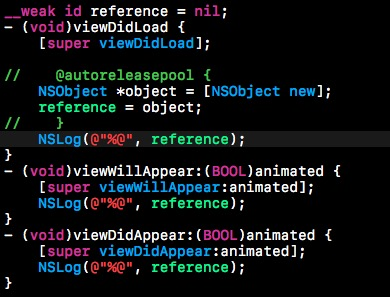
为了不影响对象本身的引用计数影响它的销毁过程，使用一个weak指针，不出所料的，打印出来了如下结果

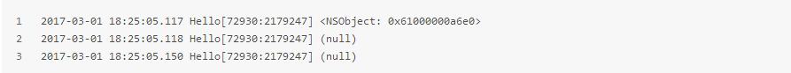
但是这个实验如果换成NSString得到的则是完全不一样的结果。
如下代码

打印出来的结果却是：

这个看上去也很好似乎也很好理解，NSString初始化的时候是存放在常量区的，所以没有释放嘛。

**深入研究**

为了观察对象的释放过程，我们在str赋值的地方加一个断点

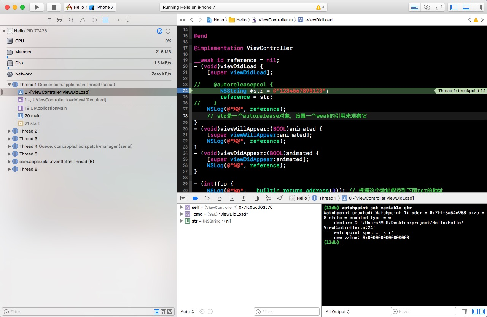
走到该断点的时候通过lldb命令watchpoint set variable str来观察，可以看到str由0x0000000000000000变成0x00000001056b3250。

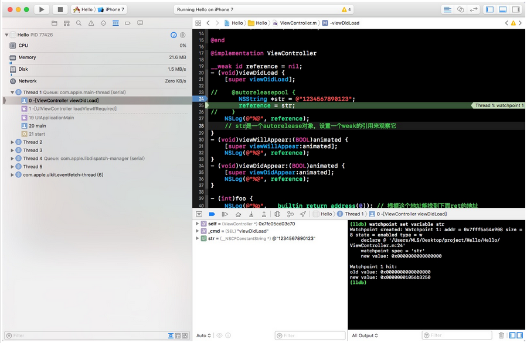
然后一路点击Continue program execution，发现str会变成0x0000000000000000,控制台只打印了一次str的值，也就是说viewwillappear还没有执行，这点跟雷大博客( [Objective-C Autorelease Pool 的实现原理](http://blog.leichunfeng.com/blog/2015/05/31/objective-c-autorelease-pool-implementation-principle/) )中的略不一样，我猜是apple改了。

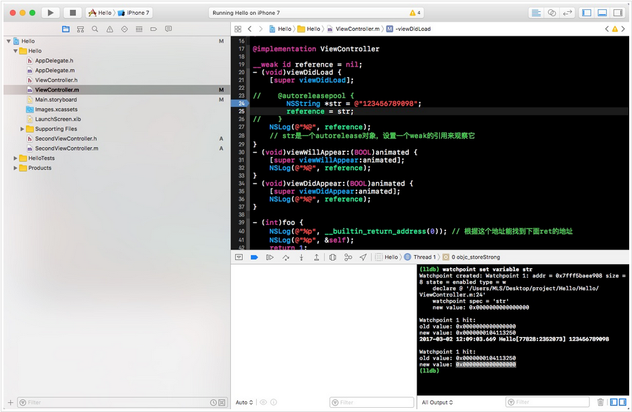
然后看左侧的方法调用栈，会发现这个过程经过了objc_store,AutoreleasePoolPage::pop(void *)等函数通过autoreleasepool释放了。现在修改一下log语句。

看了几个大神之前的博客，大都还打印了retainCount,但是今天这里研究的是arc，就不打印retainCount了。

执行如下代码：

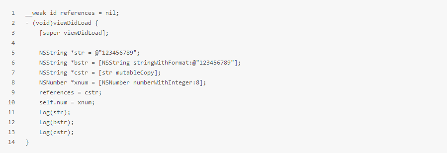
得到打印结果：

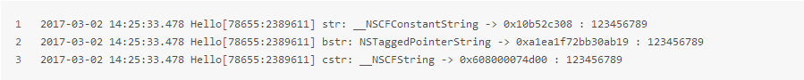
可以看到这里其实是有三种String的,而references指向了cstr，此时在viewWillAppear和viewDidAppear里打印references得到的则是null。

**三种String**

* NSCFConstantString: 字符串常量，放在常量区，对其retain或者release不影响它的引用计数，程序结束后释放。用字面量语法创建出来的string就是这种，所以在出了viewDidLoad方法以后在其他地方也能打印出值，压根就没释放。

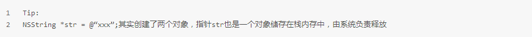

* NSTaggedPointerString: Tagged Point，标签指针，苹果在64位环境下对NSString和NSNumber做的一些优化，简单来说就是把对象的内容存放在了指针里，这样就不需要在堆内存里在开辟一块空间存放对象了，一般用来优化长度较小的内容。关于标签指针的内容可以参考唐巧的介绍：深入理解Tagged Pointer

对于NSString，当非字面量的数字，英文字母字符串的长度小于等于9的时候会自动成为NSTaggedPointerString类型。代码中的bstr如果再加一位或者有中文在里面就是变成NSCFString。而NSTaggedPointerString也是不会释放的，它的内容就在本身的指针里，又没有对象释放个啥啊。所以如果把references的赋值代码改为

在viewWillAppear和viewDidAppear中也是能打印出值来的。

* NSCFString: 这种string就和普通的对象很像了，储存在堆上，有正常的引用计数，需要程序员分配释放。所以references = cstr时，会打印出null，cstr出了方法作用域在runloop结束时就被autoreleasepool释放了。

**stringWithFormat**

到这里还是有问题

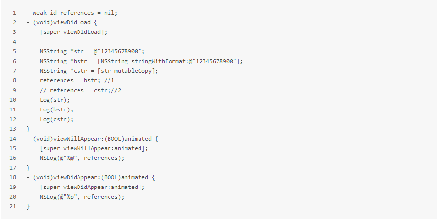
根据以上说法，当string超过10位数时，bstr和cstr都是NSCFString，可是两种情况viewWillAppear和viewDidAppear在打印的结果不一样。

bstr:

cstr:

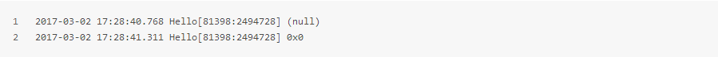
根据太阳神 [黑幕背后的Autorelease](http://blog.sunnyxx.com/2014/10/15/behind-autorelease/) 中的说法，是因为viewWillAppear和viewDidLoad在一个runloop中导致bstr在willappear中能打印出来值。如果真的是这样那cstr讲道理应该也能打印出值来，文章最开始用NSObject做实验时在viewWillAppear时应该也能打印出值来。

所以其实并不是同一个runloop的问题，问题出在stringWithFormat这个工厂方法上。

查资料得知以 alloc, copy, init,mutableCopy和new这些方法打头的方法，返回的都是 retained return value，例如[[NSString alloc] initWithFormat:]，而其他的则是unretained return value，例如 [NSString stringWithFormat:]。对于前者调用者是要负责释放的，对于后者就不需要了。而且对于后者ARC会把对象的生命周期延长，确保调用者能拿到并且使用这个返回值，但是并不一定会使用 autorelease，在worst case 的情况下才可能会使用，因此调用者不能假设返回值真的就在 autorelease pool中。从性能的角度，这种做法也是可以理解的。如果我们能够知道一个对象的生命周期最长应该有多长，也就没有必要使用 autorelease 了，直接使用 release 就可以。如果很多对象都使用 autorelease 的话，也会导致整个 pool 在 drain 的时候性能下降。

>When returning from such a function or method, ARC retains the value at the point of evaluation of the return statement, then leaves all local scopes, and then balances out the retain while ensuring that the value lives across the call boundary. In the worst case, this may involve an autorelease, but callers must not assume that the value is actually in the autorelease pool.
>
>ARC performs no extra mandatory work on the caller side, although it may elect to do something to shorten the lifetime of the returned value.

也就是说通过工程方法得到的string生命周期被延长了，所以才会在viewWillAppear里依然可以打印出来。为了证实这一点，我们换成array来做个实验。

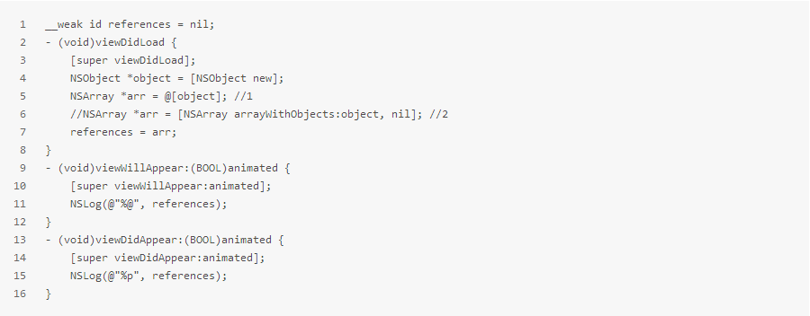
第一种情况通过字面量创建array，打印台输出：

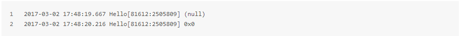
第二种情况通过工厂方法创建，打印台输出:

可以看到通过工厂方法创建的array生命周期确实被延长了。

**总结**

1.方法里的临时变量是会通过autoreleasepool释放的

2.NSCFString跟普通对象一样是可以释放的

3.NSString和NSArray的工厂方法可以延长对象的生命周期(同理，NSDictionary也是一样的，有兴趣的可以试一下)

**参考资料**

[黑幕背后的Autorelease](http://blog.sunnyxx.com/2014/10/15/behind-autorelease/)

[Objective-C Autorelease Pool 的实现原理](http://blog.leichunfeng.com/blog/2015/05/31/objective-c-autorelease-pool-implementation-principle/)

[Objective-C 内存管理——你需要知道的一切](https://segmentfault.com/a/1190000004943276)

[由NSString什么时候释放说起 - CocoaChina_一站式开发者成长社区](http://www.cocoachina.com/articles/18829)