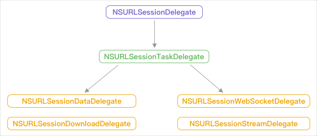
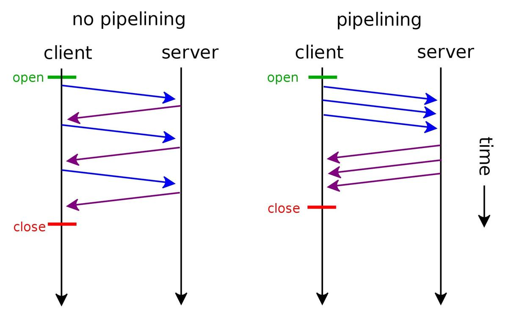
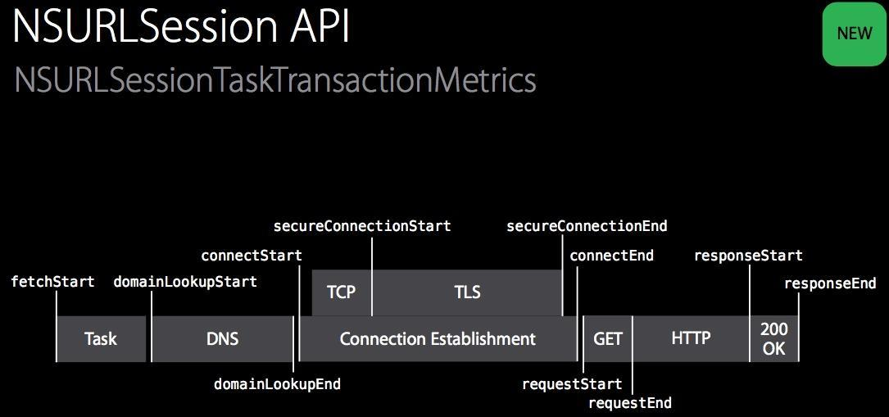
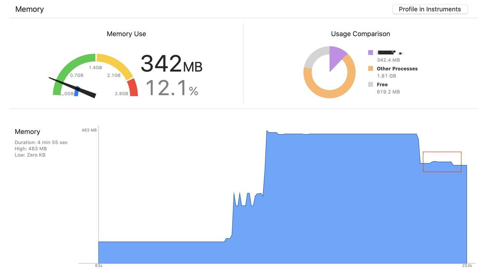
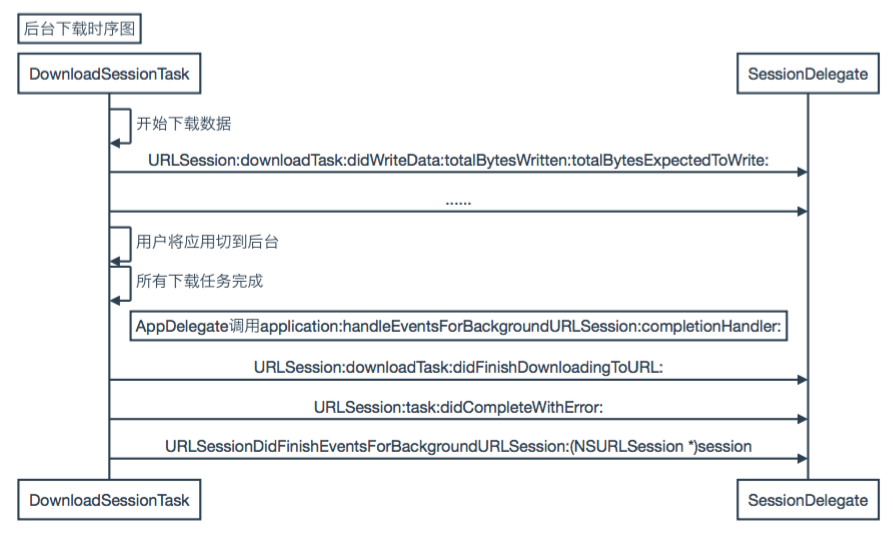

# NSURLSession最全攻略

[<简书 — 刘小壮>](https://www.jianshu.com/p/ac79db251cbf)

### NSURLSession

`NSURLSession` 在 `iOS7` 中推出， `NSURLSession` 的推出旨在替换之前的 `NSURLConnection` ， `NSURLSession` 的使用相对于之前的 `NSURLConnection` 更简单，而且不用处理 `Runloop` 相关的东西。

2015年 `RFC 7540` 标准发布了 `http 2.0` 版本， `http 2.0` 版本中包含很多新的特性，在传输速度上也有很明显的提升。 `NSURLSession` 从 `iOS9.0` 开始，对 `http 2.0` 提供了支持。

`NSURLSession` 由三部分构成：

* NSURLSession：请求会话对象，可以用系统提供的单例对象，也可以自己创建。
* NSURLSessionConfiguration：对 `session` 会话进行配置，一般都采用 `default` 。
* NSURLSessionTask：负责执行具体请求的 `task` ，由 `session` 创建。

`NSURLSession` 有三种方式创建：

```
sharedSession
```

系统维护的一个单例对象，可以和其他使用这个 `session` 的 `task` 共享连接和请求信息。

```
sessionWithConfiguration:
```

在NSURLSession初始化时传入一个NSURLSessionConfiguration，这样可以自定义请求头、cookie等信息。

```
sessionWithConfiguration:delegate:delegateQueue:
```

如果想更好的控制请求过程以及回调线程，需要上面的方法进行初始化操作，并传入 `delegate` 来设置回调对象和回调的线程。

通过 `NSURLSession` 发起一个网络请求也比较简单。

1. 创建一个NSURLSessionConfiguration配置请求。
2. 通过Configuration创建NSURLSession对象。
3. 通过session对象发起网络请求，并获取task对象。
4. 调用[task resume]方法发起网络请求。

```
NSURLSessionConfiguration *config = [NSURLSessionConfiguration defaultSessionConfiguration];
NSURLSession *session = [NSURLSession sessionWithConfiguration:config
                                                      delegate:self
                                                 delegateQueue:[NSOperationQueue mainQueue]];
NSURLSessionDataTask *task = [session dataTaskWithURL:[NSURL URLWithString:@"http://www.baidu.com"]];
[task resume];
```

#### NSURLSessionTask

通过 `NSURLSession` 发起的每个请求，都会被封装为一个 `NSURLSessionTask` 任务，但一般不会直接是 `NSURLSessionTask` 类，而是基于不同任务类型，被封装为其对应的子类。

* NSURLSessionDataTask：处理普通的 `Get`、`Post` 请求。
* NSURLSessionUploadTask：处理上传请求，可以传入对应的上传文件或路径。
* NSURLSessionDownloadTask：处理下载地址，提供断点续传功能的 `cancel` 方法。

主要方法都定义在父类 `NSURLSessionTask` 中，下面是一些关键方法或属性。

* `currentRequest` 

当前正在执行的任务，一般和 `originalRequest` 是一样的，除非发生重定向才会有所区别。

* `originalRequest` 

主要用于重定向操作，用来记录重定向前的请求。

* `taskIdentifier`

当前 `session` 下， `task` 的唯一标示，多个 `session` 之间可能存在相同的标识。

* `priority`

`task` 中可以设置优先级，但这个属性并不代表请求的优先级，而是一个标示。官方已经说明， `NSURLSession` 并没有提供 `API` 可以改变请求的优先级。

* `state`

当前任务的状态，可以通过 `KVO` 的方式监听状态的改变。

* `resume`

开始或继续请求，创建后的 `task` 默认是挂起的，需要手动调用 `resume` 才可以开始请求。

* `suspend`

挂起当前请求。主要是下载请求用的多一些，普通请求挂起后都会重新开始请求。下载请求挂起后，只要不超过 `NSURLRequest` 设置的 `timeout` 时间，调用 `resume` 就是继续请求。

* `cancel`

取消当前请求。任务会被标记为取消，并在未来某个时间调用 `URLSession:task:didCompleteWithError:` 方法。

`NSURLSession` 提供有普通创建 `task` 的方式，创建后可以通过重写代理方法，获取对应的回调和参数。这种方式对于请求过程比较好控制。

```
- (NSURLSessionDataTask *)dataTaskWithRequest:(NSURLRequest *)request;
- (NSURLSessionUploadTask *)uploadTaskWithRequest:(NSURLRequest *)request fromFile:(NSURL *)fileURL;
- (NSURLSessionDownloadTask *)downloadTaskWithRequest:(NSURLRequest *)request;
```

除此之外， `NSURLSession` 也提供了 `block` 的方式创建 `task` ，创建方式简单如 `AFN` ，直接传入 `URL` 或 `NSURLRequest` ，即可直接在 `block` 中接收返回数据。和普通创建方式一样， `block` 的创建方式创建后默认也是 `suspend` 的状态，需要调用 `resume` 开始任务。

`completionHandler` 和 `delegate` 是互斥的， `completionHandler` 的优先级大于 `delegate` 。相对于普通创建方法， `block` 方式更偏向于面向结果的创建，可以直接在 `completionHandler` 中获取返回结果，但不能控制请求过程。

```
- (NSURLSessionDataTask *)dataTaskWithURL:(NSURL *)url completionHandler:(void (^)(NSData * _Nullable data, NSURLResponse * _Nullable response, NSError * _Nullable error))completionHandler;
- (NSURLSessionUploadTask *)uploadTaskWithRequest:(NSURLRequest *)request fromData:(nullable NSData *)bodyData completionHandler:(void (^)(NSData * _Nullable data, NSURLResponse * _Nullable response, NSError * _Nullable error))completionHandler;
- (NSURLSessionDownloadTask *)downloadTaskWithURL:(NSURL *)url completionHandler:(void (^)(NSURL * _Nullable location, NSURLResponse * _Nullable response, NSError * _Nullable error))completionHandler;
```

可以通过下面的两个方法，获取当前 `session` 对应的所有 `task` ，方法区别在于回调的参数不同。以 `getTasksWithCompletionHandler` 为例，在 `AFN` 中的应用是用来获取当前 `session` 的 `task` ，并将 `AFURLSessionManagerTaskDelegate` 的回调都置为 `nil` ，以防止崩溃。

```
- (void)getTasksWithCompletionHandler:(void (^)(NSArray<NSURLSessionDataTask *> *dataTasks, NSArray<NSURLSessionUploadTask *> *uploadTasks, NSArray<NSURLSessionDownloadTask *> *downloadTasks))completionHandler;

- (void)getAllTasksWithCompletionHandler:(void (^)(NSArray<__kindof NSURLSessionTask *> *tasks))completionHandler);
```

#### delegateQueue

在初始化 `NSURLSession` 时可以指定线程，如果不指定线程，则 `completionHandler` 和 `delegate` 的回调方法，都会在子线程中执行。

如果初始化 `NSURLSession` 时指定了 `delegateQueue` ，则回调会在指定的队列中执行，如果指定的是 `mainQueue` ，则回调在主线程中执行，这样就避免了切换线程的问题。

```
[NSURLSession sessionWithConfiguration:config delegate:self delegateQueue:nil];
```

#### delegate

对于 `NSURLSession` 的代理方法这里就不详细列举了，方法命名遵循苹果一贯见名知意的原则，用起来很简单。这里介绍一下 `NSURLSession` 的代理继承结构。



`NSURLSession` 中定义了一系列代理，并遵循上面的继承关系。根据继承关系和代理方法的声明，如果执行某项任务，只需要遵守其中的某个代理即可。

例如执行上传或普通 `Post` 请求，则遵守 `NSURLSessionDataDelegate` ，执行下载任务则遵循 `NSURLSessionDownloadDelegate` ，父级代理定义的都是公共方法。

#### 请求重定向

`HTTP` 协议中定义了例如301等重定向状态码，通过下面的代理方法，可以处理重定向任务。发生重定向时可以根据 `response` 创建一个新的 `request` ，也可以直接用系统生成的 `request` ，并在 `completionHandler` 回调中传入，如果想终止这次重定向，在 `completionHandler` 传入 `nil` 即可。

```
- (void)URLSession:(NSURLSession *)session
              task:(NSURLSessionTask *)task
willPerformHTTPRedirection:(NSHTTPURLResponse *)response
        newRequest:(NSURLRequest *)request
 completionHandler:(void (^)(NSURLRequest *))completionHandler
{
    NSURLRequest *redirectRequest = request;

    if (self.taskWillPerformHTTPRedirection) {
        redirectRequest = self.taskWillPerformHTTPRedirection(session, task, response, request);
    }

    if (completionHandler) {
        completionHandler(redirectRequest);
    }
}
```

### NSURLSessionConfiguration

#### 创建方式

`NSURLSessionConfiguration` 负责对 `NSURLSession` 初始化时进行配置，通过 `NSURLSessionConfiguration` 可以设置请求的 `Cookie`、密钥、缓存、请求头等参数，将网络请求的一些配置参数从 `NSURLSession` 中分离出来。

```
NSURLSessionConfiguration *config = [NSURLSessionConfiguration defaultSessionConfiguration];
NSURLSession *session = [NSURLSession sessionWithConfiguration:config
                                                      delegate:self
                                                 delegateQueue:[NSOperationQueue mainQueue]];
```

`NSURLSessionConfiguration` 提供三种初始化方法，下面是请求的方法的一些解释。

```
@property (class, readonly, strong) NSURLSessionConfiguration *defaultSessionConfiguration;
```

`NSURLSessionConfiguration` 提供 `defaultSessionConfiguration` 的方式创建，但这并不是单例方法，而是类方法，创建的是不同对象。通过这种方式创建的 `configuration` ，并不会共享 `cookie`、`cache`、密钥等，而是不同 `configuration` 都需要单独设置。

这块网上很多人理解都是错的，并没有真的在项目里使用或者没有留意过，如和其他人有出入，以我为准。

```
@property (class, readonly, strong) NSURLSessionConfiguration *ephemeralSessionConfiguration;
```

创建临时的 `configuration` ，通过这种方式创建的对象，和普通的对象主要区别在于 `URLCache`、`URLCredentialStorage`、`HTTPCookieStorage` 上面。同样的， `Ephemeral` 也不是单例方法，而只是类方法。

```
URLCredentialStorage
Ephemeral <__NSCFMemoryURLCredentialStorage: 0x600001bc8320>

HTTPCookieStorage
Ephemeral <NSHTTPCookieStorage cookies count:0>
```

如果对 `Ephemeral` 方式创建的 `config` 进行打印的话，可以看到变量类型明显区别于其他类型，并且在打印信息前面会有 `Ephemeral` 的标示。通过 `Ephemeral` 的方式创建的 `config` ，不会产生持久化信息，可以很好保护请求的数据安全性。

```
+ (NSURLSessionConfiguration *)backgroundSessionConfigurationWithIdentifier:(NSString *)identifier;
```

`identifier` 方式一般用于恢复之前的任务，主要用于下载。如果一个下载任务正在进行中，程序被 `kill` 调，可以在程序退出之前保存 `identifier` 。下次进入程序后通过 `identifier` 恢复之前的任务，系统会将 `NSURLSession` 及 `NSURLSessionConfiguration` 和之前的下载任务进行关联，并继续之前的任务。

#### timeout

```
timeoutIntervalForRequest
```

设置 `session` 请求间的超时时间，这个超时时间并不是请求从开始到结束的时间，而是两个数据包之间的时间间隔。当任意请求返回后这个值将会被重置，如果在超时时间内未返回则超时。单位为秒，默认为60秒。

```
timeoutIntervalForResource
```

资源超时时间，一般用于上传或下载任务，在上传或下载任务开始后计时，如果到达时间任务未结束，则删除资源文件。单位为秒，默认时间是七天。

#### 资源共享

如果是相同的 `NSURLSessionConfiguration` 对象，会共享请求头、缓存、`cookie`、`Credential` ，通过 `Configuration` 创建的 `NSURLSession` ，也会拥有对应的请求信息。

```
@property (nullable, copy) NSDictionary *HTTPAdditionalHeaders;
```

公共请求头，默认是空的，设置后所有经 `Confuguration` 配置的 `NSURLSession` ，请求头都会带有设置的信息。

```
@property (nullable, retain) NSHTTPCookieStorage *HTTPCookieStorage;
```

`HTTP` 请求的 `Cookie` 管理器。如果是通过 `sharedSession` 或 `backgroundConfiguration` 创建的 `NSURLSession` ，默认使用 `sharedHTTPCookieStorage` 的 `Cookie` 数据。如果不想使用 `Cookie` ，则直接设置为 `nil` 即可，也可以手动设置为自己的 `CookieStorage` 。

```
@property (nullable, retain) NSURLCredentialStorage *URLCredentialStorage;
```

证书管理器。如果是通过 `sharedSession` 或 `backgroundConfiguration` 创建的 `NSURLSession` ，默认使用 `sharedCredentialStorage` 的证书。如果不想使用证书，可以直接设置为 `nil` ，也可以自己创建证书管理器。

```
@property (nullable, retain) NSURLCache *URLCache;
```

请求缓存，如果不手动设置的话为 `nil` ，对于 `NSURLCache` 这个类我没有研究过，不太了解。

#### 缓存处理

在 `NSURLRequest` 中可以设置 `cachePolicy` 请求缓存策略，这里不对具体值做详细描述，默认值为 `NSURLRequestUseProtocolCachePolicy` 使用缓存。

`NSURLSessionConfiguration` 可以设置处理缓存的对象，我们可以手动设置自定义的缓存对象，如果不设置的话，默认使用系统的 `sharedURLCache` 单例缓存对象。经过 `configuration` 创建的 `NSURLSession` 发出的请求， `NSURLRequest` 都会使用这个 `NSURLCache` 来处理缓存。

```
@property (nullable, retain) NSURLCache *URLCache;
```

`NSURLCache` 提供了 `Memory` 和 `Disk` 的缓存，在创建时需要为其分别指定 `Memory` 和 `Disk` 的大小，以及存储的文件位置。使用 `NSURLCache` 不用考虑磁盘空间不够，或手动管理内存空间的问题，如果发生内存警告系统会自动清理内存空间。但是 `NSURLCache` 提供的功能非常有限，项目中一般很少直接使用它来处理缓存数据，还是用数据库比较多。

```
[[NSURLCache alloc] initWithMemoryCapacity:30 * 1024 * 1024 
                              diskCapacity:30 * 1024 * 1024 
                              directoryURL:[NSURL URLWithString:filePath]];
```

使用 `NSURLCache` 还有一个好处，就是可以由服务端来设置资源过期时间，在请求服务端后，服务端会返回 `Cache-Control` 来说明文件的过期时间。 `NSURLCache` 会根据 `NSURLResponse` 来自动完成过期时间的设置。

#### 最大连接数

限制 `NSURLSession` 的最大连接数，通过此方法创建的 `NSURLSession` 和服务端的最大连接数量不会超出这里设置的数量。苹果为我们设置的 `iOS` 端默认为4， `Mac` 端默认为6。

```
@property NSInteger HTTPMaximumConnectionsPerHost;
```

### 连接复用

`HTTP` 是基于传输层协议 `TCP` 的，通过 `TCP` 发送网络请求都需要先进行三次握手，建立网络请求后再发送数据，请求结束时再经历四次挥手。 `HTTP1.0` 开始支持 `keep-alive` ， `keep-alive` 可以保持已经建立的链接，如果是相同的域名，在请求连接建立后，后面的请求不会立刻断开，而是复用现有的连接。从 `HTTP1.1` 开始默认开启 `keep-alive` 。

请求是在请求头中设置下面的参数，服务器如果支持 `keep-alive` 的话，响应客户端请求时，也会在响应头中加上相同的字段。

```
Connection: Keep-Alive
```

如果想断开 `keep-alive` ，可以在请求头中加上下面的字段，但一般不推荐这么做。

```
Connection: Close
```

如果通过 `NSURLSession` 来进行网络请求的话，需要使用同一个 `NSURLSession` 对象，如果创建新的 `session` 对象则不能复用之前的链接。 `keep-alive` 可以保持请求的连接，苹果允许在 `iOS` 上最大保持有4个连接， `Mac` 则是6个连接。

### pipeline



在 `HTTP1.1` 中，基于 `keep-alive` ，还可以将请求进行管线化。和相同后端服务， `TCP` 层建立的链接，一般都需要前一个请求返回后，后面的请求再发出。但 `pipeline` 就可以不依赖之前请求的响应，而发出后面的请求。

`pipeline` 依赖客户端和服务器都有实现，服务端收到客户端的请求后，要按照先进先出的顺序进行任务处理和响应。 `pipeline` 依然存在之前非 `pipeline` 的问题，就是前面的请求如果出现问题，会阻塞当前连接影响后面的请求。

`pipeline` 对于请求大文件并没有提升作用，只是对于普通请求速度有提升。在 `NSURLSessionConfiguration` 中可以设置 `HTTPShouldUsePipelining` 为 `YES` ，开启管线化，此属性默认为 `NO` 。

### NSURLSessionTaskMetrics

在日常开发过程中，经常遇到页面加载太慢的问题，这很大一部分原因都是因为网络导致的。所以，查找网络耗时的原因并解决，就是一个很重要的任务了。苹果对于网络检查提供了 `NSURLSessionTaskMetrics` 类来进行检查， `NSURLSessionTaskMetrics` 是对应 `NSURLSessionTaskDelegate` 的，每个task结束时都会回调下面的方法，并且可以获得一个 `metrics` 对象。

```
- (void)URLSession:(NSURLSession *)session 
              task:(NSURLSessionTask *)task 
didFinishCollectingMetrics:(NSURLSessionTaskMetrics *)metrics;
```

`NSURLSessionTaskMetrics` 可以很好的帮助我们分析网络请求的过程，以找到耗时原因。除了这个类之外， `NSURLSessionTaskTransactionMetrics` 类中承载了更详细的数据。

```
@property (copy, readonly) NSArray<NSURLSessionTaskTransactionMetrics *> *transactionMetrics;
```

`transactionMetrics` 数组中每一个元素都对应着当前 `task` 的一个请求，一般数组中只会有一个元素，如果发生重定向等情况，可能会存在多个元素。

```
@property (copy, readonly) NSDateInterval *taskInterval;
```

`taskInterval` 记录了当前 `task` 从开始请求到最后完成的总耗时， `NSDateInterval` 中包含了 `startDate`、`endDate` 和 `duration` 耗时时间。

```
@property (assign, readonly) NSUInteger redirectCount;
```

`redirectCount` 记录了重定向次数，在进行下载请求时一般都会进行重定向，来保证下载任务能由后端最合适的节点来处理。

#### NSURLSessionTaskTransactionMetrics

`NSURLSessionTaskTransactionMetrics` 中的属性都是用来做统计的，功能都是记录某个值，并没有逻辑上的意义。所以这里就对一些主要的属性做一下解释，基本涵盖了大部分属性，其他就不管了。

这张图是我从网上扒下来的，标示了 `NSURLSessionTaskTransactionMetrics` 的属性在请求过程中处于什么位置。



```
// 请求对象
@property (copy, readonly) NSURLRequest *request;
// 响应对象，请求失败可能会为nil
@property (nullable, copy, readonly) NSURLResponse *response;
// 请求开始时间
@property (nullable, copy, readonly) NSDate *fetchStartDate;
// DNS解析开始时间
@property (nullable, copy, readonly) NSDate *domainLookupStartDate;
// DNS解析结束时间，如果解析失败可能为nil
@property (nullable, copy, readonly) NSDate *domainLookupEndDate;
// 开始建立TCP连接时间
@property (nullable, copy, readonly) NSDate *connectStartDate;
// 结束建立TCP连接时间
@property (nullable, copy, readonly) NSDate *connectEndDate;
// 开始TLS握手时间
@property (nullable, copy, readonly) NSDate *secureConnectionStartDate;
// 结束TLS握手时间
@property (nullable, copy, readonly) NSDate *secureConnectionEndDate;
// 开始传输请求数据时间
@property (nullable, copy, readonly) NSDate *requestStartDate;
// 结束传输请求数据时间
@property (nullable, copy, readonly) NSDate *requestEndDate;
// 接收到服务端响应数据时间
@property (nullable, copy, readonly) NSDate *responseStartDate;
// 服务端响应数据传输完成时间
@property (nullable, copy, readonly) NSDate *responseEndDate;
// 网络协议，例如http/1.1
@property (nullable, copy, readonly) NSString *networkProtocolName;
// 请求是否使用代理
@property (assign, readonly, getter=isProxyConnection) BOOL proxyConnection;
// 是否复用已有连接
@property (assign, readonly, getter=isReusedConnection) BOOL reusedConnection;
// 资源标识符，表示请求是从Cache、Push、Network哪种类型加载的
@property (assign, readonly) NSURLSessionTaskMetricsResourceFetchType resourceFetchType;
// 本地IP
@property (nullable, copy, readonly) NSString *localAddress;
// 本地端口号
@property (nullable, copy, readonly) NSNumber *localPort;
// 远端IP
@property (nullable, copy, readonly) NSString *remoteAddress;
// 远端端口号
@property (nullable, copy, readonly) NSNumber *remotePort;
// TLS协议版本，如果是http则是0x0000
@property (nullable, copy, readonly) NSNumber *negotiatedTLSProtocolVersion;
// 是否使用蜂窝数据
@property (readonly, getter=isCellular) BOOL cellular;
```

下面是我发起一个 `http` 的下载请求，统计得到的数据。设备是 `Xcode` 模拟器，网络环境是 `WiFi` 。

```
(Request) <NSURLRequest: 0x600000c80380> { URL: http://vfx.mtime.cn/Video/2017/03/31/mp4/170331093811717750.mp4 }
(Response) <NSHTTPURLResponse: 0x600000ed9420> { URL: http://vfx.mtime.cn/Video/2017/03/31/mp4/170331093811717750.mp4 } { Status Code: 200, Headers {
    "Accept-Ranges" =     (
        bytes
    );
    Age =     (
        1063663
    );
    "Ali-Swift-Global-Savetime" =     (
        1575358696
    );
    Connection =     (
        "keep-alive"
    );
    "Content-Length" =     (
        20472584
    );
    "Content-Md5" =     (
        "YM+JxIH9oLH6l1+jHN9pmQ=="
    );
    "Content-Type" =     (
        "video/mp4"
    );
    Date =     (
        "Tue, 03 Dec 2019 07:38:16 GMT"
    );
    EagleId =     (
        dbee142415764223598843838e
    );
    Etag =     (
        "\"60CF89C481FDA0B1FA975FA31CDF6999\""
    );
    "Last-Modified" =     (
        "Fri, 31 Mar 2017 01:41:36 GMT"
    );
    Server =     (
        Tengine
    );
    "Timing-Allow-Origin" =     (
        "*"
    );
    Via =     (
        "cache39.l2et2[0,200-0,H], cache6.l2et2[3,0], cache16.cn548[0,200-0,H], cache16.cn548[1,0]"
    );
    "X-Cache" =     (
        "HIT TCP_MEM_HIT dirn:-2:-2"
    );
    "X-M-Log" =     (
        "QNM:xs451;QNM3:71"
    );
    "X-M-Reqid" =     (
        "m0AAAP__UChjzNwV"
    );
    "X-Oss-Hash-Crc64ecma" =     (
        12355898484621380721
    );
    "X-Oss-Object-Type" =     (
        Normal
    );
    "X-Oss-Request-Id" =     (
        5DE20106F3150D38305CE159
    );
    "X-Oss-Server-Time" =     (
        130
    );
    "X-Oss-Storage-Class" =     (
        Standard
    );
    "X-Qnm-Cache" =     (
        Hit
    );
    "X-Swift-CacheTime" =     (
        2592000
    );
    "X-Swift-SaveTime" =     (
        "Sun, 15 Dec 2019 15:05:37 GMT"
    );
} }
(Fetch Start) 2019-12-15 15:05:59 +0000
(Domain Lookup Start) 2019-12-15 15:05:59 +0000
(Domain Lookup End) 2019-12-15 15:05:59 +0000
(Connect Start) 2019-12-15 15:05:59 +0000
(Secure Connection Start) (null)
(Secure Connection End) (null)
(Connect End) 2019-12-15 15:05:59 +0000
(Request Start) 2019-12-15 15:05:59 +0000
(Request End) 2019-12-15 15:05:59 +0000
(Response Start) 2019-12-15 15:05:59 +0000
(Response End) 2019-12-15 15:06:04 +0000
(Protocol Name) http/1.1
(Proxy Connection) NO
(Reused Connection) NO
(Fetch Type) Network Load
(Request Header Bytes) 235
(Request Body Transfer Bytes) 0
(Request Body Bytes) 0
(Response Header Bytes) 866
(Response Body Transfer Bytes) 20472584
(Response Body Bytes) 20472584
(Local Address) 192.168.1.105
(Local Port) 63379
(Remote Address) 219.238.20.101
(Remote Port) 80
(TLS Protocol Version) 0x0000
(TLS Cipher Suite) 0x0000
(Cellular) NO
(Expensive) NO
(Constrained) NO
(Multipath) NO
```

### FAQ

#### NSURLSession的delegate为什么是强引用？

在初始化 `NSURLSession` 对象并设置代理后，代理对象将会被强引用。根据苹果官方的注释来看，这个强持有并不会一直存在，而是在调用 `URLSession:didBecomeInvalidWithError:` 方法后，会将 `delegate` 释放。

通过调用 `NSURLSession` 的 `invalidateAndCancel` 或 `finishTasksAndInvalidate` 方法，即可将强引用断开并执行 `didBecomeInvalidWithError:` 代理方法，执行完成后 `session` 就会无效不可以使用。也就是只有在 `session` 无效时，才可以解除强引用的关系。

有时候为了保证连接复用等问题，一般不会轻易将 `session` 会话 `invalid` ，所以最好不要直接使用 `NSURLSession` ，而是要对其进行一次二次封装，使用 `AFN3.0` 的原因之一也在于此。

### NSURLSession的上传下载

#### 表单上传

客户端有时候需要给服务端上传大文件，进行大文件肯定不能全都加载到内存里，一口气都传给服务器。进行大文件上传时，一般都会对需要上传的文件进行分片，分片后逐个文件进行上传。需要注意的是，分片上传和断点续传并不是同一个概念，上传并不支持断点续传。

进行分片上传时，需要对本地文件进行读取，我们使用 `NSFileHandle` 来进行文件读取。 `NSFileHandle` 提供了一个偏移量的功能，我们可以将 `handle` 的当前读取位置 `seek` 到上次读取的位置，并设置本次读取长度，读取的文件就是我们指定文件的字节。

```
- (NSData *)readNextBuffer {
    if (self.maxSegment <= self.currentIndex) {
        return nil;
    }
    
    if(!self.fileHandler){
        NSString *filePath = [self uploadFile];
        NSFileHandle *fileHandle = [NSFileHandle fileHandleForReadingAtPath:filePath];
        self.fileHandler = fileHandle;
    }
    [self.fileHandler seekToFileOffset:(self.currentIndex) * self.segmentSize];
    NSData *data = [self.fileHandler readDataOfLength:self.segmentSize];
    return data;
}
```

上传文件现在主流的方式，都是采取表单上传的方式，也就是 `multipart/from-data` ， `AFNetworking` 对表单上传也有很有的支持。表单上传需要遵循下面的格式进行上传， `boundary` 是一个16进制字符串，可以是任何且唯一的。 `boundary` 的功能用来进行字段分割，区分开不同的参数部分。

`multipart/from-data` 规范定义在 [rfc2388](https://links.jianshu.com/go?to=https%3A%2F%2Fwww.ietf.org%2Frfc%2Frfc2388.txt) ，详细字段可以看一下规范。

```
--boundary
 Content-Disposition: form-data; name="参数名"
 参数值
 --boundary
 Content-Disposition:form-data;name=”表单控件名”;filename=”上传文件名”
 Content-Type:mime type
 要上传文件二进制数据
 --boundary--
```

拼接上传文件基本上可以分为下面三部分，上传参数、上传信息、上传文件。并且通过 `UTF-8` 格式进行编码，服务端也采用相同的解码方式，则可以获得上传文件和信息。需要注意的是，换行符数量是固定的，这都是固定的协议格式，不要多或者少，会导致服务端解析失败。

```
- (NSData *)writeMultipartFormData:(NSData *)data 
                        parameters:(NSDictionary *)parameters {
    if (data.length == 0) {
        return nil;
    }
    
    NSMutableData *formData = [NSMutableData data];
    NSData *lineData = [@"\r\n" dataUsingEncoding:NSUTF8StringEncoding];
    NSData *boundary = [kBoundary dataUsingEncoding:NSUTF8StringEncoding];
    
    // 拼接上传参数
    [parameters enumerateKeysAndObjectsUsingBlock:^(id key, id obj, BOOL *stop) {
        [formData appendData:boundary];
        [formData appendData:lineData];
        NSString *thisFieldString = [NSString stringWithFormat:@"Content-Disposition: form-data; name=\"%@\"\r\n\r\n%@", key, obj];
        [formData appendData:[thisFieldString dataUsingEncoding:NSUTF8StringEncoding]];
        [formData appendData:lineData];
    }];
    
    // 拼接上传信息
    [formData appendData:boundary];
    [formData appendData:lineData];
    NSString *thisFieldString = [NSString stringWithFormat:@"Content-Disposition: form-data; name=\"%@\"; filename=\"%@\"\r\nContent-Type: %@", @"name", @"filename", @"mimetype"];
    [formData appendData:[thisFieldString dataUsingEncoding:NSUTF8StringEncoding]];
    [formData appendData:lineData];
    [formData appendData:lineData];
    
    // 拼接上传文件
    [formData appendData:data];
    [formData appendData:lineData];
    [formData appendData: [[NSString stringWithFormat:@"--%@--\r\n", kBoundary] dataUsingEncoding:NSUTF8StringEncoding]];
    
    return formData;
}
```

除此之外，表单提交还需要设置请求头的 `Content-Type` 和 `Content-Length` ，否则会导致请求失败。其中 `Content-Length` 并不是强制要求的，要看后端的具体支持情况。

设置请求头时，一定要加上 `boundary` ，这个 `boundary` 和拼接上传文件的 `boundary` 需要是同一个。服务端从请求头拿到 `boundary` ，来解析上传文件。

```
NSString *headerField = [NSString stringWithFormat:@"multipart/form-data; charset=utf-8; boundary=%@", kBoundary];
[request setValue:headerField forHTTPHeaderField:@"Content-Type"];

NSUInteger size = [[[NSFileManager defaultManager] attributesOfItemAtPath:uploadPath error:nil] fileSize];
headerField = [NSString stringWithFormat:@"%lu", size];
[request setValue:headerField forHTTPHeaderField:@"Content-Length"];
```

随后我们通过下面的代码创建 `NSURLSessionUploadTask` ，并调用 `resume` 发起请求，实现对应的代理回调即可。

```
// 发起网络请求
NSURLSessionUploadTask *uploadTask = [self.backgroundSession uploadTaskWithRequest:request fromData:fromData];
[uploadTask resume];
    
// 请求完成后调用，无论成功还是失败
- (void)URLSession:(NSURLSession *)session
              task:(NSURLSessionTask *)task
didCompleteWithError:(NSError *)error {
    
}

// 更新上传进度，会回调多次
- (void)URLSession:(NSURLSession *)session
              task:(NSURLSessionTask *)task
   didSendBodyData:(int64_t)bytesSent
    totalBytesSent:(int64_t)totalBytesSent
totalBytesExpectedToSend:(int64_t)totalBytesExpectedToSend {
    
}

// 数据接收完成回调
- (void)URLSession:(NSURLSession *)session
          dataTask:(NSURLSessionDataTask *)dataTask
    didReceiveData:(NSData *)data {
    
}

// 处理后台上传任务，当前session的上传任务结束后会回调此方法。
- (void)URLSessionDidFinishEventsForBackgroundURLSession:(NSURLSession *)session {
    
}
```

但是，如果你认为这就完成一个上传功能了，too young too simple~

#### 后台上传

如果通过 `fromData` 的方式进行上传，并不支持后台上传。如果想实现后台上传，需要通过 `fromFile` 的方式上传文件。不止如此， `fromData` 还有其他坑。

```
- (NSURLSessionUploadTask *)uploadTaskWithRequest:(NSURLRequest *)request fromData:(NSData *)bodyData;
- (NSURLSessionUploadTask *)uploadTaskWithRequest:(NSURLRequest *)request fromFile:(NSURL *)fileURL;
```

#### 内存占用

我们发现通过 `fromData:` 的方式上传文件，内存涨上去之后一直不能降下来，无论是直接使用 `NSURLSession` 还是 `AFNetworking` ，都是这样的。小文件还好，不是很明显，如果是几百MB的大文件很明显就会有一个内存峰值，而且涨上去就不会降下来。WTF？

上传有两种方式上传，如果我们把 `fromData:` 的上传改为 `fromFile:` ，就可以解决内存不下降的问题。所以，我们可以把 `fromData:` 的上传方式，理解为 `UIImage` 的 `imageNamed` 的方法，上传后 `NSData` 文件会保存在内存中，不会被回收。而 `fromFile:` 的方式是从本地加载文件，并且上传完成后可以被回收。而且如果想支持后台上传，就必须用 `fromFile:` 的方式进行上传。

OK，那找到问题我们就开干，改变之前的上传逻辑，改为 `fromFile:` 的方式上传。

```
// 将分片写入到本地
NSString *filePath = [NSString stringWithFormat:@"%@/%ld", [self segmentDocumentPath], currentIndex];
BOOL write = [formData writeToFile:filePath atomically:YES];

// 创建分片文件夹
- (NSString *)segmentDocumentPath {
    NSString *documentName = [fileName md5String];
    NSString *filePath = [[SVPUploadCompressor compressorPath] stringByAppendingPathComponent:documentName];
    BOOL needCreateDirectory = YES;
    BOOL isDirectory = NO;
    if ([[NSFileManager defaultManager] fileExistsAtPath:filePath isDirectory:&isDirectory]) {
        if (isDirectory) {
            needCreateDirectory = NO;
        } else {
            [[NSFileManager defaultManager] removeItemAtPath:filePath error:nil];
        }
    }
    
    if (needCreateDirectory) {
        [[NSFileManager defaultManager] createDirectoryAtPath:filePath
                                  withIntermediateDirectories:YES
                                                   attributes:nil
                                                        error:nil];
    }
    return filePath;
}
```

因为要通过 `fromFile:` 方法传一个本地分片的路径进去，所以需要预先对文件进行分片，并保存在本地。在分片的同时，还需要拼接 `boundary` 信息。

所以我们在上传任务开始前，先对文件进行分片并拼接信息，然后将分片文件写入到本地。为了方便管理，我们基于具有唯一性的文件名进行 `MD5` 来创建分片文件夹，分片文件命名通过下标来命名，并写入到本地。文件上传完成后，直接删除整个文件夹即可。当然，这些文件操作都是在异步线程中完成的，防止影响UI线程。



我们用一个400MB的视频测试上传，我们可以从上图看出，圈红部分是我们上传文件的时间。将上传方式改为 `fromFile:` 后，上传文件的峰值最高也就是在10MB左右徘徊，这对于iPhone6这样的低内存老年机来说，是相当友好的，不会导致低端设备崩溃或者卡顿。

#### 动态分片

用户在上传时网络环境会有很多情况， `WiFi`、4G、弱网等很多情况。如果上传分片太大可能会导致失败率上升，分片文件太小会导致网络请求太多，产生太多无用的 `boundary`、`header`、数据链路等资源的浪费。

为了解决这个问题，我们采取的是动态分片大小的策略。根据特定的计算策略，预先使用第一个分片的上传速度当做测速分片，测速分片的大小是固定的。根据测速的结果，对其他分片大小进行动态分片，这样可以保证分片大小可以最大限度的利用当前网速。

```
if ([Reachability reachableViaWiFi]) {
    self.segmentSize = 500 * 1024;
} else if ([Reachability reachableViaWWAN]) {
    self.segmentSize = 300 * 1024;
}
```

当然，如果觉得这种分片方式太过复杂，也可以采取一种阉割版的动态分片策略。即根据网络情况做判断，如果是 `WiFi` 就固定某个分片大小，如果是流量就固定某个分片大小。然而这种策略并不稳定，因为现在很多手机的网速比 `WiFi` 还快，我们也不能保证 `WiFi` 都是百兆光纤。

#### 并行上传

上传的所有任务如果使用的都是同一个 `NSURLSession` 的话，是可以保持连接的，省去建立和断开连接的消耗。在 `iOS` 平台上， `NSURLSession` 支持对一个 `Host` 保持4个连接，所以，如果我们采取并行上传，可以更好的利用当前的网络。

并行上传的数量在 `iOS` 平台上不要超过4个，最大连接数是可以通过 `NSURLSessionConfiguration` 设置的，而且数量最好不要写死。同样的，应该基于当前网络环境，在上传任务开始的时候就计算好最大连接数，并设置给 `Configuration` 。

经过我们的线上用户数据分析，在线上环境使用并行任务的方式上传，上传速度相较于串行上传提升四倍左右。计算方式是每秒文件上传的大小。

```
iPhone串行上传：715 kb/s
iPhone并行上传：2909 kb/s
```

#### 队列管理

分片上传过程中可能会因为网速等原因，导致上传失败。失败的任务应该由单独的队列进行管理，并且在合适的时机进行失败重传。

例如对一个500MB的文件进行分片，每片是300KB，就会产生1700多个分片文件，每一个分片文件就对应一个上传任务。如果在进行上传时，一口气创建1700多个 `uploadTask` ，尽管 `NSURLSession` 是可以承受的，也不会造成一个很大的内存峰值。但是我觉得这样并不太好，实际上并不会同时有这么多请求发出。

```
/// 已上传成功片段数组
@property (nonatomic, strong) NSMutableArray *successSegments;
/// 待上传队列的数组
@property (nonatomic, strong) NSMutableArray *uploadSegments;
```

所以在创建上传任务时，我设置了一个最大任务数，就是同时向 `NSURLSession` 发起的请求不会超过这个数量。需要注意的是，这个最大任务数是我创建 `uploadTask` 的任务数，并不是最大并发数，最大并发数由 `NSURLSession` 来控制，我不做干预。

我将待上传任务都放在 `uploadSegments` 中，上传成功后我会从待上传任务数组中取出一条或多条，并保证同时进行的任务始终不超过最大任务数。失败的任务理论上来说也是需要等待上传的，所以我把失败任务也放在 `uploadSegments` 中，插入到队列最下面，这样就保证了待上传任务完成后，继续重试失败任务。

成功的任务我放在 `successSegments` 中，并且始终保持和 `uploadSegments` 没有交集。两个队列中保存的并不是 `uploadTask` ，而是分片的索引，这也就是为什么我给分片命名的时候用索引当做名字的原因。当 `successSegments` 等于分片数量时，就表示所有任务上传完成。

### 文件下载

`NSURLSession` 是在单独的进程中运行，所以通过此类发起的网络请求，是独立于应用程序运行的，即使App挂起、`kill` 也不会停止请求。在下载任务时会比较明显，即便App被 `kill` 下载任务仍然会继续，并且允许下次启动App使用这次的下载结果或继续下载。

和上传代码一样，创建下载任务很简单，通过 `NSURLSession` 创建一个 `downloadTask` ，并调用 `resume` 即可开启一个下载任务。

```
NSURLSessionConfiguration *config = [NSURLSessionConfiguration defaultSessionConfiguration];
NSURLSession *session = [NSURLSession sessionWithConfiguration:config 
                                                      delegate:self 
                                                 delegateQueue:[NSOperationQueue mainQueue]];

NSURL *url = [NSURL URLWithString:@"http://vfx.mtime.cn/Video/2017/03/31/mp4/170331093811717750.mp4"];
NSURLRequest *request = [[NSURLRequest alloc] initWithURL:url];
NSURLSessionDownloadTask *downloadTask = [session downloadTaskWithRequest:request];
[downloadTask resume];
```

我们可以调用 `suspend` 将下载任务挂起，随后调用 `resume` 方法继续下载任务， `suspend` 和 `resume` 需要是成对的。但是 `suspend` 挂起任务是有超时的，默认为60s，如果超时系统会将 `TCP` 连接断开，我们再调用 `resume` 是失效的。可以通过 `NSURLSessionConfiguration` 的 `timeoutIntervalForResource` 来设置上传和下载的资源耗时。 `suspend` 只针对于下载任务，其他任务挂起后将会重新开始。

下面两个方法是下载比较基础的方法，分别用来接收下载进度和下载完的临时文件地址。 `didFinishDownloadingToURL:` 方法是 `required` ，当下载结束后下载文件被写入在 `Library/Caches` 下的一个临时文件，我们需要将此文件移动到自己的目录，临时目录在未来的一个时间会被删掉。

```
// 从服务器接收数据，下载进度回调
- (void)URLSession:(NSURLSession *)session downloadTask:(NSURLSessionDownloadTask *)downloadTask
             didWriteData:(int64_t)bytesWritten
        totalBytesWritten:(int64_t)totalBytesWritten
totalBytesExpectedToWrite:(int64_t)totalBytesExpectedToWrite {
    CGFloat progress = (CGFloat)totalBytesWritten / (CGFloat)totalBytesExpectedToWrite;
    self.progressView.progress = progress;
}

// 下载完成后回调
- (void)URLSession:(NSURLSession *)session downloadTask:(NSURLSessionDownloadTask *)downloadTask
didFinishDownloadingToURL:(NSURL *)location {
    
}
```

#### 断点续传

`HTTP` 协议支持断点续传操作，在开始下载请求时通过请求头设置 `Range` 字段，标示从什么位置开始下载。

```
Range:bytes=512000-
```

服务端收到客户端请求后，开始从512kb的位置开始传输数据，并通过 `Content-Range` 字段告知客户端传输数据的起始位置。

```
Content-Range:bytes 512000-/1024000
```

`downloadTask` 任务开始请求后，可以调用 `cancelByProducingResumeData:` 方法可以取消下载，并且可以获得一个 `resumeData` ， `resumeData` 中存放一些断点下载的信息。可以将 `resumeData` 写到本地，后面通过这个文件可以进行断点续传。

```
NSString *library = NSSearchPathForDirectoriesInDomains(NSLibraryDirectory, NSUserDomainMask, YES).firstObject;
NSString *resumePath = [library stringByAppendingPathComponent:[self.downloadURL md5String]];
[self.downloadTask cancelByProducingResumeData:^(NSData * _Nullable resumeData) {
    [resumeData writeToFile:resumePath atomically:YES];
}];
```

在创建下载任务前，可以判断当前任务有没有之前待恢复的任务，如果有的话调用 `downloadTaskWithResumeData:` 方法并传入一个 `resumeData` ，可以恢复之前的下载，并重新创建一个 `downloadTask` 任务。

```
NSString *library = NSSearchPathForDirectoriesInDomains(NSLibraryDirectory, NSUserDomainMask, YES).firstObject;
NSString *resumePath = [library stringByAppendingPathComponent:[self.downloadURL md5String]];
NSData *resumeData = [[NSData alloc] initWithContentsOfFile:resumePath];
self.downloadTask = [self.session downloadTaskWithResumeData:resumeData];
[self.downloadTask resume];
```

通过 `suspend` 和 `resume` 这种方式挂起的任务， `downloadTask` 是同一个对象，而通过 `cancel` 然后 `resumeData` 恢复的任务，会创建一个新的 `downloadTask` 任务。

当调用 `downloadTaskWithResumeData:` 方法恢复下载后，会回调下面的方法。回调参数 `fileOffset` 是上次文件的下载大小， `expectedTotalBytes` 是预估的文件总大小。

```
- (void)URLSession:(NSURLSession *)session downloadTask:(NSURLSessionDownloadTask *)downloadTask
 didResumeAtOffset:(int64_t)fileOffset
expectedTotalBytes:(int64_t)expectedTotalBytes;
```

#### 后台下载

通过 `backgroundSessionConfigurationWithIdentifier` 方法创建后台上传或后台下载类型的 `NSURLSessionConfiguration` ，并且设置一个唯一标识，需要保证这个标识在不同的 `session` 之间的唯一性。后台任务只支持 `http` 和 `https` 的任务，其他协议的任务并不支持。

```
NSURLSessionConfiguration *config = [NSURLSessionConfiguration backgroundSessionConfigurationWithIdentifier:@"identifier"];
[NSURLSession sessionWithConfiguration:config delegate:self delegateQueue:[NSOperationQueue mainQueue]];
```

通过 `backgroundSessionConfigurationWithIdentifier` 方法创建的 `NSURLSession` ，请求任务将会在系统的单独进程中进行，因此即使App进程被 `kill` 也不受影响，依然可以继续执行请求任务。如果程序被系统 `kill` 调，下次启动并执行 `didFinishLaunchingWithOptions` 可以通过相同的 `identifier` 创建 `NSURLSession` 和 `NSURLSessionConfiguration` ，系统会将新创建的 `NSURLSession` 和单独进程中正在运行的 `NSURLSession` 进行关联。

在程序启动并执行 `didFinishLaunchingWithOptions` 方法时，按照下面方法创建 `NSURLSession` 即可将新创建的 `Session` 和之前的 `Session` 绑定，并自动开始执行之前的下载任务。恢复之前的任务后会继续执行 `NSURLSession` 的代理方法，并执行后面的任务。

```
- (BOOL)application:(UIApplication *)application didFinishLaunchingWithOptions:(NSDictionary *)launchOptions {
    
    NSURLSessionConfiguration *config = [NSURLSessionConfiguration backgroundSessionConfigurationWithIdentifier:@"identifier"];
    [NSURLSession sessionWithConfiguration:config delegate:self delegateQueue:[NSOperationQueue mainQueue]];
    
    return YES;
}
```

当应用进入到后台时，可以继续下载，如果客户端没有开启 `Background Mode` ，则不会回调客户端进度。下次进入前台时，会继续回调新的进度。

如果在后台下载完成，则会通过 `AppDelegate` 的回调方法通知应用来刷新UI。由于下载是在一个单独的进程中完成的，即便业务层代码会停止执行，但下载的回调依然会被调用。在回调时，允许用户处理业务逻辑，以及刷新UI。

调用此方法后可以开始刷新UI，调用 `completionHandler` 表示刷新结束，所以上层业务要做一些控制逻辑。 `didFinishDownloadingToURL` 的调用时机会比此方法要晚，依然在那个方法里可以判断下载文件。由于项目中可能会存在多个下载任务，所以需要通过 `identifier` 对下载任务进行区分。

```
- (void)application:(UIApplication *)application handleEventsForBackgroundURLSession:(NSString *)identifier completionHandler:(void (^)(void))completionHandler {
    ViewController *vc = (ViewController *)self.window.rootViewController;
    vc.completionHandler = completionHandler;
}
```

需要注意的是，如果存在多个相同名字的 `identifier` 任务，则创建的 `session` 会将同名的任务都继续执行。 `NSURLSessionConfiguration` 还提供下面的属性，在 `session` 下载任务完成时是否启动App，默认为 `YES` ，如果设置为 `NO` 则后台下载会受到影响。

```
@property BOOL sessionSendsLaunchEvents;
```

后台下载过程中会设计到一系列的代理方法调用，下面是调用顺序。



#### 视频文件下载

现在很多视频类App都有视频下载的功能，视频下载肯定不会是单纯的把一个mp4下载下来就可以，这里就讲一下视频下载相关的知识。

1. 视频地址一般都是从服务端获取的，所以需要先请求接口获取下载地址。这个地址可以是某个接口就已经请求下来的，也可以是某个固定格式拼接的。
2. 现在有很多视频App都是有免流服务的，例如腾讯大王卡、蚂蚁宝卡之类的，免流服务的本质就是对 `m3u8`、`ts`、`mp4` 地址重新包一层，请求数据的时候直接请求运营商给的地址，运营商对数据做了一个中转操作。
3. 以流视频 `m3u8` 为例，有了免流地址，先下载 `m3u8` 文件。这个文件一般都是加密的，下载完成后客户端会对 `m3u8` 文件进行 `decode` ，获取到真正的 `m3u8` 文件。
4. `m3u8` 文件本质上是 `ts` 片段的集合，视频播放播的还是 `ts` 片段。随后对 `m3u8` 文件进行解析，获取到 `ts` 片段地址，并将 `ts` 下载地址转成免流地址后逐个下载，也可以并行下载。
5. `m3u8` 文件下载后会以固定格式存在文件夹下，文件夹对应被缓存的视频。 `ts` 片命名以数字命名，例如 `0.ts` ，下标从0开始。
6. 所有 `ts` 片段下载完成后，生成本地 `m3u8` 文件。
7. `m3u8` 文件分为远端和本地两种，远端的就是正常下载的地址，本地 `m3u8` 文件是在播放本地视频的时候传入。格式和普通 `m3u8` 文件差不多，区别在于 `ts` 地址是本地地址，例如下面的地址。

```
#EXTM3U
#EXT-X-TARGETDURATION:30
#EXT-X-VERSION:3
#EXTINF:9.28,
0.ts
#EXTINF:33.04,
1.ts
#EXTINF:30.159,
2.ts
#EXTINF:23.841,
3.ts
#EXT-X-ENDLIST
```

##### m3u8文件

`HLS(Http Live Streaming)` 是苹果推出的流媒体协议，其中包含两部分， `m3u8` 文件和 `ts` 文件。使用 `ts` 文件的原因是因为多个 `ts` 可以无缝拼接，并且单个 `ts` 可以单独播放。而 `mp4` 由于格式原因，被分割的 `mp4` 文件单独播放会导致画面撕裂或者音频缺失的问题。如果单独下载多个 `mp4` 文件，播放时会导致间断的问题。

`m3u8` 是 `Unicode` 版本的 `m3u` ，是苹果推出的一种视频格式，是一个基于 `HTTP` 的流媒体传输协议。 `m3u8` 协议将一个媒体文件切为多个小文件，并利用 `HTTP` 协议进行数据传输，小文件所在的资源服务器路径存储在 `.m3u8` 文件中。客户端拿到 `m3u8` 文件，即可根据文件中资源文件的路径，分别下载不同的文件。

`m3u8` 文件必须是 `utf-8` 格式编码的，在文件中以 `#EXT` 开头的是标签，并且大小写敏感。以#开头的其他字符串则都会被认为是注释。 `m3u8` 分为点播和直播，点播在第一次请求 `.m3u8` 文件后，将下载下来的 `ts` 片段进行顺序播放即可。直播则需要过一段时间对 `.m3u8` 文件进行一个增量下载，并继续下载后续的 `ts` 文件。

`m3u8` 中有很多标签，下面是项目中用到的一些标签或主要标签。将 `mp4` 或者 `flv` 文件进行切片很简单，直接用 `ffmpeg` 命令切片即可。

`#EXTM3U`

`#EXT-X-ENDLIST`

`#EXT-X-VERSION`

`#EXT-X-TARGETDURATION`

`#EXTINF`

如果没有 `#EXT` 或#开头的，一般都是 `ts` 片段下载地址。路径可以是绝对路径，也可以是相对路径，我们项目里使用的是绝对路径。但相对路径数据量会相对比较小，只不过看视频的人网速不会太差。

下面是相对路径地址，文件中只有 `segment1.ts` ，则表示相对于 `m3u8` 的路径，也就是下面的路径。

```
https://data.vod.itc.cn/m3u8
https://data.vod.itc.cn/segment1.ts
```

#### 常见错误

```
A background URLSession with identifier backgroundSession already exists
```

如果重复后台已经存在的下载任务，会提示这个错误。需要在页面退出或程序退出时，调用 `finishTasksAndInvalidate` 方法将任务 `invalidate` 。

```
[[NSNotificationCenter defaultCenter] addObserver:self
                                             selector:@selector(willTerminateNotification)
                                                 name:UIApplicationWillTerminateNotification
                                               object:nil];
                                               
- (void)willTerminateNotification {
    [self.session getAllTasksWithCompletionHandler:^(NSArray<__kindof NSURLSessionTask *> * _Nonnull tasks) {
        if (tasks.count) {
            [self.session finishTasksAndInvalidate];
        }
    }];
}
```

[NSURLSession最全攻略](https://www.jianshu.com/p/ac79db251cbf)