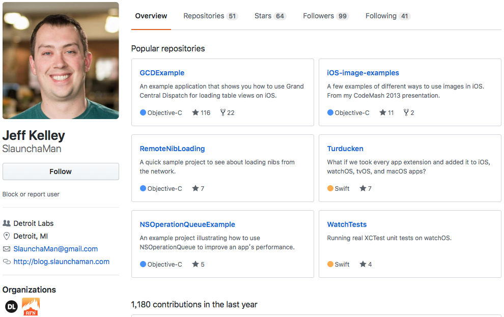
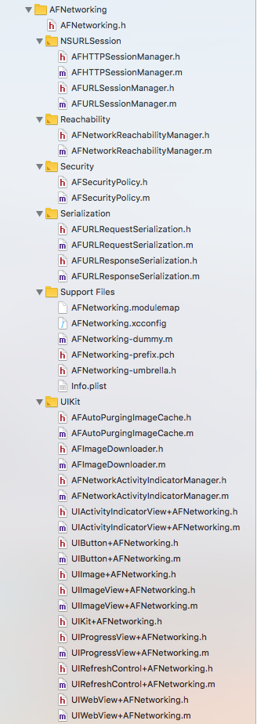
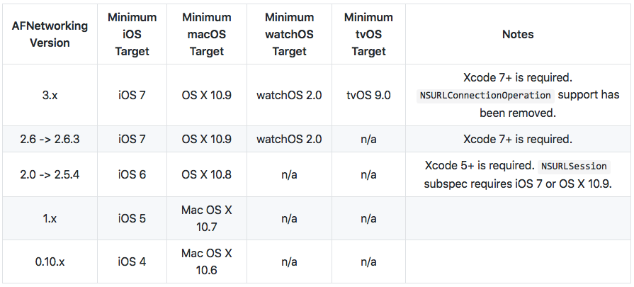
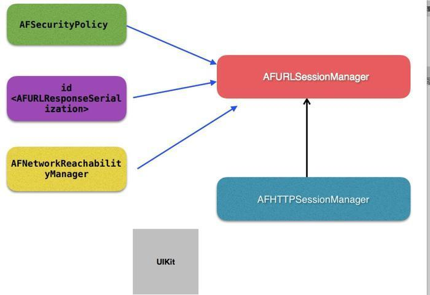

# AFNetworking源码探究（一） —— 基本介绍

## 前言

> 我们做APP发起网络请求，都离不开一个非常有用的框架   [AFNetworking](https://link.jianshu.com?t=https%3A%2F%2Fgithub.com%2FAFNetworking%2FAFNetworking) ，可以说这个框架的知名度已经超过了苹果的底层网络请求部分，很多人可能不知道苹果底层是如何发起网络请求的，但是一定知道 `AFNetworking` ，接下来几篇我们就一起详细的解析一下这个框架。  

## 整体了解


首先我们就看一下AFN在GitHub中的地址 —— [AFN](https://link.jianshu.com?t=https%3A%2F%2Fgithub.com%2FAFNetworking%2FAFNetworking)

下面是AFN的一个作者



下面看一下框架的基本结构



## 安装

安装有两种方式 `CocoaPods` 和 `Carthage`

*  CocoaPods

使用CocoaPods，用下面命令安装CocoaPods

```
$ gem install cocoapods
```

> 构建 `AFNetworking 3.0.0+` 需要 `CocoaPods 0.39.0+` 版本  

按照下面方式修改Podfile

```
source 'https://github.com/CocoaPods/Specs.git'
platform :ios, '8.0'

target 'TargetName' do
pod 'AFNetworking', '~> 3.0'
end
```

运行下面代码，安装

```
$ pod install
```

* Carthage

使用 [Homebrew](https://link.jianshu.com?t=http%3A%2F%2Fbrew.sh%2F) 以及下面的命令行安装Carthage

```
$ brew update
$ brew install carthage
```

在Cartfile文件中，指定要集成到xcode项目中的AFN版本

```
github "AFNetworking/AFNetworking" ~> 3.0
```

运行 `carthage` 构建库，并将构建好的 `AFNetworking.framework` 拖动到xcode的项目中。



## 详细架构

下面我们就看一下AFN的详细架构。

### NSURLSession

* `AFURLSessionManager`
* `AFHTTPSessionManager`

### Serialization

* `<AFURLRequestSerialization>`
  * `AFHTTPRequestSerializer`
  * `AFJSONRequestSerializer`
  * `AFPropertyListRequestSerializer`

* `<AFURLResponseSerialization>`
  * `AFHTTPResponseSerializer`
  * `AFJSONResponseSerializer`
  * `AFXMLParserResponseSerializer`
  * `AFXMLDocumentResponseSerializer` *(macOS)*
  * `AFPropertyListResponseSerializer`
  * `AFImageResponseSerializer`
  * `AFCompoundResponseSerializer`

### Additional Functionality

* `AFSecurityPolicy`
* `AFNetworkReachabilityManager`

也可以参考下面的图





## 使用

### 1. AFURLSessionManager

`AFURLSessionManager` 基于遵循 `<NSURLSessionTaskDelegate>，<NSURLSessionDataDelegate>，<NSURLSessionDownloadDelegate>` 和 `<NSURLSessionDelegate>` 的指定 `NSURLSessionConfiguration` 对象创建和管理 `NSURLSession` 对象。

**Creating a Download Task - 创建一个Download Task**

```
NSURLSessionConfiguration *configuration = [NSURLSessionConfiguration defaultSessionConfiguration];
AFURLSessionManager *manager = [[AFURLSessionManager alloc] initWithSessionConfiguration:configuration];

NSURL *URL = [NSURL URLWithString:@"http://example.com/download.zip"];
NSURLRequest *request = [NSURLRequest requestWithURL:URL];

NSURLSessionDownloadTask *downloadTask = [manager downloadTaskWithRequest:request progress:nil destination:^NSURL *(NSURL *targetPath, NSURLResponse *response) {
    NSURL *documentsDirectoryURL = [[NSFileManager defaultManager] URLForDirectory:NSDocumentDirectory inDomain:NSUserDomainMask appropriateForURL:nil create:NO error:nil];
    return [documentsDirectoryURL URLByAppendingPathComponent:[response suggestedFilename]];
} completionHandler:^(NSURLResponse *response, NSURL *filePath, NSError *error) {
    NSLog(@"File downloaded to: %@", filePath);
}];
[downloadTask resume];
```

**Creating an Upload Task - 创建一个Upload Task**

```
NSURLSessionConfiguration *configuration = [NSURLSessionConfiguration defaultSessionConfiguration];
AFURLSessionManager *manager = [[AFURLSessionManager alloc] initWithSessionConfiguration:configuration];

NSURL *URL = [NSURL URLWithString:@"http://example.com/upload"];
NSURLRequest *request = [NSURLRequest requestWithURL:URL];

NSURL *filePath = [NSURL fileURLWithPath:@"file://path/to/image.png"];
NSURLSessionUploadTask *uploadTask = [manager uploadTaskWithRequest:request fromFile:filePath progress:nil completionHandler:^(NSURLResponse *response, id responseObject, NSError *error) {
    if (error) {
        NSLog(@"Error: %@", error);
    } else {
        NSLog(@"Success: %@ %@", response, responseObject);
    }
}];
[uploadTask resume];
```

**Creating an Upload Task for a Multi-Part Request, with Progress - 为具有进度的多部分请求创建上传任务**

```
NSMutableURLRequest *request = [[AFHTTPRequestSerializer serializer] multipartFormRequestWithMethod:@"POST" URLString:@"http://example.com/upload" parameters:nil constructingBodyWithBlock:^(id<AFMultipartFormData> formData) {
        [formData appendPartWithFileURL:[NSURL fileURLWithPath:@"file://path/to/image.jpg"] name:@"file" fileName:@"filename.jpg" mimeType:@"image/jpeg" error:nil];
    } error:nil];

AFURLSessionManager *manager = [[AFURLSessionManager alloc] initWithSessionConfiguration:[NSURLSessionConfiguration defaultSessionConfiguration]];

NSURLSessionUploadTask *uploadTask;
uploadTask = [manager
              uploadTaskWithStreamedRequest:request
              progress:^(NSProgress * _Nonnull uploadProgress) {
                  // This is not called back on the main queue.
                  // You are responsible for dispatching to the main queue for UI updates
                  dispatch_async(dispatch_get_main_queue(), ^{
                      //Update the progress view
                      [progressView setProgress:uploadProgress.fractionCompleted];
                  });
              }
              completionHandler:^(NSURLResponse * _Nonnull response, id  _Nullable responseObject, NSError * _Nullable error) {
                  if (error) {
                      NSLog(@"Error: %@", error);
                  } else {
                      NSLog(@"%@ %@", response, responseObject);
                  }
              }];

[uploadTask resume];
```

**Creating a Data Task - 创建数据任务**

```
NSURLSessionConfiguration *configuration = [NSURLSessionConfiguration defaultSessionConfiguration];
AFURLSessionManager *manager = [[AFURLSessionManager alloc] initWithSessionConfiguration:configuration];

NSURL *URL = [NSURL URLWithString:@"http://httpbin.org/get"];
NSURLRequest *request = [NSURLRequest requestWithURL:URL];

NSURLSessionDataTask *dataTask = [manager dataTaskWithRequest:request completionHandler:^(NSURLResponse *response, id responseObject, NSError *error) {
    if (error) {
        NSLog(@"Error: %@", error);
    } else {
        NSLog(@"%@ %@", response, responseObject);
    }
}];
[dataTask resume];
```

### 2. Request Serialization

请求序列化器从URL字符串创建请求，将参数编码为查询字符串或HTTP正文。

```
NSString *URLString = @"http://example.com";
NSDictionary *parameters = @{@"foo": @"bar", @"baz": @[@1, @2, @3]};
```

**Query String Parameter Encoding - 查询字符串参数编码**

```
[[AFHTTPRequestSerializer serializer] requestWithMethod:@"GET" URLString:URLString parameters:parameters error:nil];
```

```
GET http://example.com?foo=bar&baz[]=1&baz[]=2&baz[]=3
```

**URL Form Parameter Encoding - URL表单参数编码**

```
[[AFHTTPRequestSerializer serializer] requestWithMethod:@"POST" URLString:URLString parameters:parameters error:nil];
```

```
POST http://example.com/
Content-Type: application/x-www-form-urlencoded

foo=bar&baz[]=1&baz[]=2&baz[]=3
```

**JSON Parameter Encoding - JSON参数编码**

```
[[AFJSONRequestSerializer serializer] requestWithMethod:@"POST" URLString:URLString parameters:parameters error:nil];
```

```
POST http://example.com/
Content-Type: application/json

{"foo": "bar", "baz": [1,2,3]}
```

### 3. Network Reachability Manager

`AFNetworkReachabilityManager` 监控域的可达性，以及WWAN和WiFi网络接口的地址。

* 不要使用Reachability来确定是否应发送原始请求。
  * 你应该尝试发送它。
* 您可以使用Reachability来确定何时应该自动重试请求。
  * 虽然它可能仍然失败，但是连接可用的可达性通知是重试某件事的好时机。
* 网络可达性是确定请求失败原因的有用工具。
  * 在网络请求失败后，告诉用户他们处于离线状态比向他们提供更加技术性但准确的错误（如“请求超时”）要好。

可以参考 [WWDC 2012 session 706, "Networking Best Practices.](https://link.jianshu.com?t=https%3A%2F%2Fdeveloper.apple.com%2Fvideos%2Fplay%2Fwwdc2012-706%2F)

**Shared Network Reachability**

```
[[AFNetworkReachabilityManager sharedManager] setReachabilityStatusChangeBlock:^(AFNetworkReachabilityStatus status) {
    NSLog(@"Reachability: %@", AFStringFromNetworkReachabilityStatus(status));
}];

[[AFNetworkReachabilityManager sharedManager] startMonitoring];
```

### 4. Security Policy

`AFSecurityPolicy` 通过安全连接评估针对固定的 `X.509` 证书和公钥的服务器信任。

将固定的SSL证书添加到您的应用程序有助于防止中间人攻击和其他漏洞。 强烈建议处理敏感客户数据或财务信息的应用程序通过HTTPS连接路由所有通信，并配置启用 `SSL pinning` 。

**Allowing Invalid SSL Certificates - 允许无效的SSL证书**

```
AFHTTPSessionManager *manager = [AFHTTPSessionManager manager];
manager.securityPolicy.allowInvalidCertificates = YES; // not recommended for production
```

## 单元测试

`AFNetworking` 在Tests子目录中包含一套单元测试。 这些测试可以运行，只需在您想测试的平台框架上执行测试操作即可。

[AFNetworking源码探究（一） —— 基本介绍](https://www.jianshu.com/p/02488365cff6)