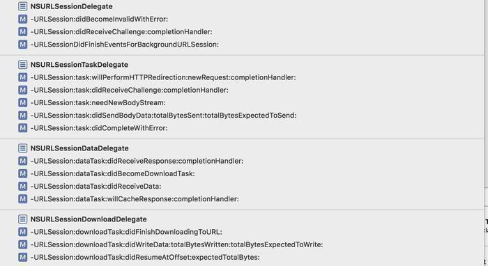
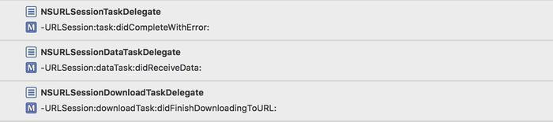

# AFNetworking源码探究（四） —— GET请求实现之代理转发思想（一）

## 回顾

上一篇主要包括 `AFURLSessionManagerTaskDelegate` 代理为任务设置进度和 `AFURLSessionManager` 为任务添加通知监听。这一篇主要说一下自定义类 `AFURLSessionManagerTaskDelegate` 和 `AFURLSessionManager` 中有关代理的 `转发逻辑` ，这一篇的重点就在于这个 `转发逻辑` 思想的理解，代码的意义其次，读完你就会感到大神写代码的高质量。

## 重写respondsToSelector方法

主要对应下面这端代码。

```
- (BOOL)respondsToSelector:(SEL)selector {
    if (selector == @selector(URLSession:task:willPerformHTTPRedirection:newRequest:completionHandler:)) {
        return self.taskWillPerformHTTPRedirection != nil;
    } else if (selector == @selector(URLSession:dataTask:didReceiveResponse:completionHandler:)) {
        return self.dataTaskDidReceiveResponse != nil;
    } else if (selector == @selector(URLSession:dataTask:willCacheResponse:completionHandler:)) {
        return self.dataTaskWillCacheResponse != nil;
    } else if (selector == @selector(URLSessionDidFinishEventsForBackgroundURLSession:)) {
        return self.didFinishEventsForBackgroundURLSession != nil;
    }

    return [[self class] instancesRespondToSelector:selector];
}
```

重写 `respondsToSelector` 的作用就是判断NSURLSession那几个代理是否能响应，如果响应了就去调用。复写了selector的方法，这几个方法是在本类有实现的，但是如果外面的Block没赋值的话，则返回NO，相当于没有实现。

这样如果没实现这些我们自定义的Block也不会去回调这些代理。因为本身某些代理，只执行了这些自定义的Block，如果Block都没有赋值，那我们调用代理也没有任何意义。

## block的属性和值的设置

上面说到了block下面我们看一下定义的block的属性。

```
@property (readwrite, nonatomic, copy) AFURLSessionDidBecomeInvalidBlock sessionDidBecomeInvalid;
@property (readwrite, nonatomic, copy) AFURLSessionDidReceiveAuthenticationChallengeBlock sessionDidReceiveAuthenticationChallenge;
@property (readwrite, nonatomic, copy) AFURLSessionDidFinishEventsForBackgroundURLSessionBlock didFinishEventsForBackgroundURLSession;
@property (readwrite, nonatomic, copy) AFURLSessionTaskWillPerformHTTPRedirectionBlock taskWillPerformHTTPRedirection;
@property (readwrite, nonatomic, copy) AFURLSessionTaskDidReceiveAuthenticationChallengeBlock taskDidReceiveAuthenticationChallenge;
@property (readwrite, nonatomic, copy) AFURLSessionTaskNeedNewBodyStreamBlock taskNeedNewBodyStream;
@property (readwrite, nonatomic, copy) AFURLSessionTaskDidSendBodyDataBlock taskDidSendBodyData;
@property (readwrite, nonatomic, copy) AFURLSessionTaskDidCompleteBlock taskDidComplete;
@property (readwrite, nonatomic, copy) AFURLSessionDataTaskDidReceiveResponseBlock dataTaskDidReceiveResponse;
@property (readwrite, nonatomic, copy) AFURLSessionDataTaskDidBecomeDownloadTaskBlock dataTaskDidBecomeDownloadTask;
@property (readwrite, nonatomic, copy) AFURLSessionDataTaskDidReceiveDataBlock dataTaskDidReceiveData;
@property (readwrite, nonatomic, copy) AFURLSessionDataTaskWillCacheResponseBlock dataTaskWillCacheResponse;
@property (readwrite, nonatomic, copy) AFURLSessionDownloadTaskDidFinishDownloadingBlock downloadTaskDidFinishDownloading;
@property (readwrite, nonatomic, copy) AFURLSessionDownloadTaskDidWriteDataBlock downloadTaskDidWriteData;
@property (readwrite, nonatomic, copy) AFURLSessionDownloadTaskDidResumeBlock downloadTaskDidResume;
```

```
typedef void (^AFURLSessionDidBecomeInvalidBlock)(NSURLSession *session, NSError *error);
typedef NSURLSessionAuthChallengeDisposition (^AFURLSessionDidReceiveAuthenticationChallengeBlock)(NSURLSession *session, NSURLAuthenticationChallenge *challenge, NSURLCredential * __autoreleasing *credential);

typedef NSURLRequest * (^AFURLSessionTaskWillPerformHTTPRedirectionBlock)(NSURLSession *session, NSURLSessionTask *task, NSURLResponse *response, NSURLRequest *request);
typedef NSURLSessionAuthChallengeDisposition (^AFURLSessionTaskDidReceiveAuthenticationChallengeBlock)(NSURLSession *session, NSURLSessionTask *task, NSURLAuthenticationChallenge *challenge, NSURLCredential * __autoreleasing *credential);
typedef void (^AFURLSessionDidFinishEventsForBackgroundURLSessionBlock)(NSURLSession *session);

typedef NSInputStream * (^AFURLSessionTaskNeedNewBodyStreamBlock)(NSURLSession *session, NSURLSessionTask *task);
typedef void (^AFURLSessionTaskDidSendBodyDataBlock)(NSURLSession *session, NSURLSessionTask *task, int64_t bytesSent, int64_t totalBytesSent, int64_t totalBytesExpectedToSend);
typedef void (^AFURLSessionTaskDidCompleteBlock)(NSURLSession *session, NSURLSessionTask *task, NSError *error);

typedef NSURLSessionResponseDisposition (^AFURLSessionDataTaskDidReceiveResponseBlock)(NSURLSession *session, NSURLSessionDataTask *dataTask, NSURLResponse *response);
typedef void (^AFURLSessionDataTaskDidBecomeDownloadTaskBlock)(NSURLSession *session, NSURLSessionDataTask *dataTask, NSURLSessionDownloadTask *downloadTask);
typedef void (^AFURLSessionDataTaskDidReceiveDataBlock)(NSURLSession *session, NSURLSessionDataTask *dataTask, NSData *data);
typedef NSCachedURLResponse * (^AFURLSessionDataTaskWillCacheResponseBlock)(NSURLSession *session, NSURLSessionDataTask *dataTask, NSCachedURLResponse *proposedResponse);

typedef NSURL * (^AFURLSessionDownloadTaskDidFinishDownloadingBlock)(NSURLSession *session, NSURLSessionDownloadTask *downloadTask, NSURL *location);
typedef void (^AFURLSessionDownloadTaskDidWriteDataBlock)(NSURLSession *session, NSURLSessionDownloadTask *downloadTask, int64_t bytesWritten, int64_t totalBytesWritten, int64_t totalBytesExpectedToWrite);
typedef void (^AFURLSessionDownloadTaskDidResumeBlock)(NSURLSession *session, NSURLSessionDownloadTask *downloadTask, int64_t fileOffset, int64_t expectedTotalBytes);
typedef void (^AFURLSessionTaskProgressBlock)(NSProgress *);

typedef void (^AFURLSessionTaskCompletionHandler)(NSURLResponse *response, id responseObject, NSError *error);
```

下面看一下这些属性的值的设定。在.h文件中有接口，并在.m中是实现，这里就举一个例子，如下：

```
/**
 Sets a block to be executed when the managed session becomes invalid, as handled by the `NSURLSessionDelegate` method `URLSession:didBecomeInvalidWithError:`.

 @param block A block object to be executed when the managed session becomes invalid. The block has no return value, and takes two arguments: the session, and the error related to the cause of invalidation.
 */
- (void)setSessionDidBecomeInvalidBlock:(nullable void (^)(NSURLSession *session, NSError *error))block;

- (void)setSessionDidBecomeInvalidBlock:(void (^)(NSURLSession *session, NSError *error))block {
    self.sessionDidBecomeInvalid = block;
}
```

这么做的目的是为了我们这些用户使用起来方便，调用set方法去设置这些Block，能很清晰的看到Block的各个参数与返回值。

## 代理转发思想

我先整体和大家说一下AFN中有关代理的转发逻辑。

`AFURLSessionManager` 中是有关NSURLSession的代理，主要包含下面的几个代理的实现。



上面的几个代理是什么关系，相信看过我写的SDWebImage的源码分析的应该很清楚，他们是继承的关系，就不多说了。而 `AFURLSessionManagerTaskDelegate` 实现了三个代理方法。



`AFUrlSessionManager` 对这一大堆代理做了一些公共的处理，而转发到AF自定义代理的3条，则负责把每个task对应的数据回调出去。

那么是如何转发过去的呢，简单的调用就是这样的。

```
- (void)URLSession:(NSURLSession *)session
              task:(NSURLSessionTask *)task
didCompleteWithError:(NSError *)error
{
    AFURLSessionManagerTaskDelegate *delegate = [self delegateForTask:task];

    // delegate may be nil when completing a task in the background
    if (delegate) {
        [delegate URLSession:session task:task didCompleteWithError:error];

        [self removeDelegateForTask:task];
    }

    if (self.taskDidComplete) {
        self.taskDidComplete(session, task, error);
    }
}
```

通过 `[delegate URLSession:session task:task didCompleteWithError:error];` 就转发了过去。这里首先就是从字典中找到该任务对应的代理 `AFURLSessionManagerTaskDelegate` 对象，然后就是转发到自定义代理中。

大家如果读过SDWebImage的源码的话，就应该明白，那里也用到了代理的转发，可见，这种转发思想有它的优点，值得我们去学习。

## 后记

> 本篇文章主要介绍了一种代理的转发思想，从 `NSURLSession` 原生的代理转发代理到 `AFURLSessionManagerTaskDelegate` 自定义的代理中。这一篇最主要的就是学习和掌握这种思想。  

[AFNetworking源码探究（四） —— GET请求实现之代理转发思想（一）](https://www.jianshu.com/p/5ce01b7ce979)