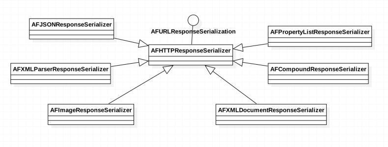
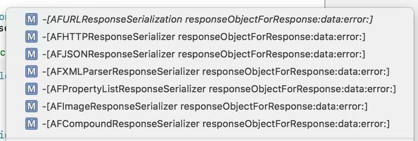

# AFNetworking源码探究（十） —— 数据解析之数据解析架构的分析（一）

## 回顾 

我们先看一下我们前几篇都做了什么，前几篇以GET请求为例，详述发起网络请求的过程，然后，讲述了 `AFURLSessionManager` 中实现的NSURLSession的几个苹果原生的代理。最后，讲述了 `AFURLSessionManagerTaskDelegate` 中的三个转发的代理。从这篇开始讲述从网络请求回数据的解析。

本篇主要讲述AFN中response数据解析的架构处理。

## 数据解析的类和协议

关于数据解析的类和接口，都存在 `AFURLResponseSerialization` 这个文件中，我们首先看一下这个文件中有多少类，以及它们是什么关系的。

* `@protocol AFURLResponseSerialization <NSObject, NSSecureCoding, NSCopying>`
* `@interface AFHTTPResponseSerializer : NSObject <AFURLResponseSerialization>`
* `@interface AFJSONResponseSerializer : AFHTTPResponseSerializer`
* `@interface AFXMLParserResponseSerializer : AFHTTPResponseSerializer`
* `@interface AFXMLDocumentResponseSerializer : AFHTTPResponseSerializer`
* `@interface AFPropertyListResponseSerializer : AFHTTPResponseSerializer`
* `@interface AFImageResponseSerializer : AFHTTPResponseSerializer`
* `@interface AFCompoundResponseSerializer : AFHTTPResponseSerializer`

一共这么多的类和协议，看到这里很清楚了吧，父类是 `AFHTTPResponseSerializer` ，遵守协议 `AFURLResponseSerialization` ，其他的类都继承这个父类，可以看这张图更清晰些。

## 数据解析的架构设计

AFN中对数据解析的架构是如何进行设计的呢？

从大的方面来讲，就是一个父类继承协议，其他类继承这个父类，根据解析数据类型不同，都实现了它们父类遵守的协议，进行数据解析。

这个架构，大家是可以进行学习和了解的。

## 后记

> 本篇主要介绍了AFN中数据解析文件AFURLResponseSerialization的类和协议，介绍了他们之间的关系，并分析了进行数据解析的架构。  

[AFNetworking源码探究（十） —— 数据解析之数据解析架构的分析（一）](https://www.jianshu.com/p/c42101184934)