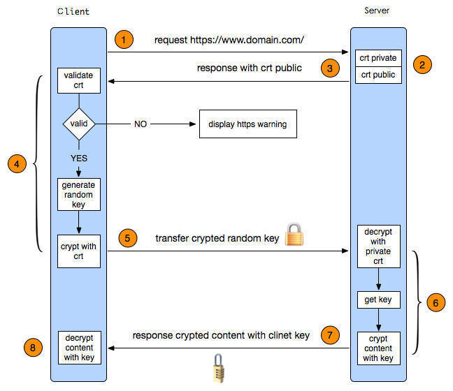

# AFNetworking源码探究（十三） —— AFSecurityPolicy与安全认证 （一）

## 回顾

前面讲述了AFN中数据的解析机制，这一篇看一下AFN与HTTPS认证。

## HTTPS

以下内容来自 [百度](https://link.jianshu.com?t=https%3A%2F%2Fbaike.baidu.com%2Fitem%2Fhttps%2F285356%3Ffr%3Daladdin)

HTTPS（全称： `Hyper Text Transfer Protocol over Secure Socket Layer` ），是以安全为目标的 [HTTP](https://link.jianshu.com?t=https%3A%2F%2Fbaike.baidu.com%2Fitem%2FHTTP) 通道，简单讲是HTTP的安全版。即HTTP下加入SSL层，HTTPS的安全基础是SSL，因此加密的详细内容就需要SSL。 它是一个URI scheme（抽象标识符体系），句法类同 [http](https://link.jianshu.com?t=https%3A%2F%2Fbaike.baidu.com%2Fitem%2Fhttp):体系。用于安全的HTTP数据传输。https:URL表明它使用了HTTP，但HTTPS存在不同于HTTP的默认 [端口](https://link.jianshu.com?t=https%3A%2F%2Fbaike.baidu.com%2Fitem%2F%25E7%25AB%25AF%25E5%258F%25A3) 及一个加密/身份验证层（在HTTP与TCP之间）。这个系统的最初研发由 [网景](https://link.jianshu.com?t=https%3A%2F%2Fbaike.baidu.com%2Fitem%2F%25E7%25BD%2591%25E6%2599%25AF) 公司(Netscape)进行，并内置于其浏览器Netscape Navigator中，提供了身份验证与加密 [通讯](https://link.jianshu.com?t=https%3A%2F%2Fbaike.baidu.com%2Fitem%2F%25E9%2580%259A%25E8%25AE%25AF) 方法。

### 1. HTTP和HTTPS区别

超文本传输协议HTTP协议被用于在Web浏览器和网站服务器之间传递信息。HTTP协议以明文方式发送内容，不提供任何方式的数据加密，如果攻击者截取了Web浏览器和网站服务器之间的传输报文，就可以直接读懂其中的信息，因此HTTP协议不适合传输一些敏感信息，比如信用卡号、密码等。

为了解决HTTP协议的这一缺陷，需要使用另一种协议：安全套接字层超文本传输协议HTTPS。为了数据传输的安全，HTTPS在HTTP的基础上加入了SSL协议，SSL依靠证书来验证服务器的身份，并为浏览器和服务器之间的通信加密。

HTTPS和HTTP的区别主要为以下四点：

* https协议需要到ca申请证书，一般免费证书很少，需要交费。
* http是 [超文本传输协议](https://link.jianshu.com?t=https%3A%2F%2Fbaike.baidu.com%2Fitem%2F%25E8%25B6%2585%25E6%2596%2587%25E6%259C%25AC%25E4%25BC%25A0%25E8%25BE%2593%25E5%258D%258F%25E8%25AE%25AE) ，信息是明文传输，https 则是具有 [安全性](https://link.jianshu.com?t=https%3A%2F%2Fbaike.baidu.com%2Fitem%2F%25E5%25AE%2589%25E5%2585%25A8%25E6%2580%25A7) 的 [ssl](https://link.jianshu.com?t=https%3A%2F%2Fbaike.baidu.com%2Fitem%2Fssl) 加密传输协议。
* http和https使用的是完全不同的连接方式，用的端口也不一样，前者是80，后者是443。
* http的连接很简单，是无状态的；HTTPS协议是由SSL+HTTP协议构建的可进行加密传输、身份认证的 [网络协议](https://link.jianshu.com?t=https%3A%2F%2Fbaike.baidu.com%2Fitem%2F%25E7%25BD%2591%25E7%25BB%259C%25E5%258D%258F%25E8%25AE%25AE) ，比http协议安全。

### 2. 解决问题

* 信任主机的问题

* 通讯过程中的数据的泄密和被篡改

### 3. SSL

SSL( `Secure Sockets Layer` 安全套接层),及其继任者传输层安全(Transport Layer Security，TLS)是为网络通信提供安全及数据完整性的一种安全协议。TLS与SSL在传输层对网络连接进行加密。

SSL ( `Secure Socket Layer` )为Netscape所研发，用以保障在Internet上数据传输之安全，利用 [数据加密](https://link.jianshu.com?t=https%3A%2F%2Fbaike.baidu.com%2Fitem%2F%25E6%2595%25B0%25E6%258D%25AE%25E5%258A%25A0%25E5%25AF%2586) (Encryption)技术，可确保数据在网络上之传输过程中不会被截取及窃听。

SSL协议位于 [TCP/IP协议](https://link.jianshu.com?t=https%3A%2F%2Fbaike.baidu.com%2Fitem%2FTCP%252FIP%25E5%258D%258F%25E8%25AE%25AE) 与各种应用层协议之间，为 [数据通讯](https://link.jianshu.com?t=https%3A%2F%2Fbaike.baidu.com%2Fitem%2F%25E6%2595%25B0%25E6%258D%25AE%25E9%2580%259A%25E8%25AE%25AF) 提供安全支持。SSL协议可分为两层：SSL记录协议（ `SSL Record Protocol` ）：它建立在可靠的传输协议（如TCP）之上，为高层协议提供 [数据封装](https://link.jianshu.com?t=https%3A%2F%2Fbaike.baidu.com%2Fitem%2F%25E6%2595%25B0%25E6%258D%25AE%25E5%25B0%2581%25E8%25A3%2585)、压缩、加密等基本功能的支持。SSL握手协议（ `SSL Handshake Protocol` ）：它建立在SSL记录协议之上，用于在实际的数据传输开始前，通讯双方进行身份认证、协商加密算法、交换加密密钥等。

**SSL协议提供的服务主要有哪些**

* 认证用户和服务器，确保数据发送到正确的 [客户机](https://link.jianshu.com?t=https%3A%2F%2Fbaike.baidu.com%2Fitem%2F%25E5%25AE%25A2%25E6%2588%25B7%25E6%259C%25BA) 和服务器
* 加密数据以防止数据中途被窃取
* 维护数据的完整性，确保数据在传输过程中不被改变。

**SSL协议的工作流程**

* 服务器认证阶段：

	* 客户端向服务器发送一个开始信息“Hello”以便开始一个新的会话连接；
	* 服务器根据客户的信息确定是否需要生成新的主密钥，如需要则服务器在响应客户的“Hello”信息时将包含生成主密钥所需的信息；
	* 客户根据收到的服务器响应信息，产生一个主密钥，并用服务器的 [公开密钥加密](https://link.jianshu.com?t=https%3A%2F%2Fbaike.baidu.com%2Fitem%2F%25E5%2585%25AC%25E5%25BC%2580%25E5%25AF%2586%25E9%2592%25A5%25E5%258A%25A0%25E5%25AF%2586) 后传给服务器；
	* 服务器恢复该主密钥，并返回给客户一个用主密钥认证的信息，以此让 [客户认证](https://link.jianshu.com?t=https%3A%2F%2Fbaike.baidu.com%2Fitem%2F%25E5%25AE%25A2%25E6%2588%25B7%25E8%25AE%25A4%25E8%25AF%2581) 服务器。

* 用户认证阶段：

	* 在此之前，服务器已经通过了 [客户认证](https://link.jianshu.com?t=https%3A%2F%2Fbaike.baidu.com%2Fitem%2F%25E5%25AE%25A2%25E6%2588%25B7%25E8%25AE%25A4%25E8%25AF%2581) ，这一阶段主要完成对客户的认证。经认证的服务器发送一个提问给客户，客户则返回（ [数字](https://link.jianshu.com?t=https%3A%2F%2Fbaike.baidu.com%2Fitem%2F%25E6%2595%25B0%25E5%25AD%2597) ）签名后的提问和其公开密钥，从而向服务器提供认证。

从SSL 协议所提供的服务及其工作流程可以看出，SSL协议运行的基础是商家对 [消费者](https://link.jianshu.com?t=https%3A%2F%2Fbaike.baidu.com%2Fitem%2F%25E6%25B6%2588%25E8%25B4%25B9%25E8%2580%2585) 信息保密的承诺，这就有利于商家而不利于消费者。在 [电子商务](https://link.jianshu.com?t=https%3A%2F%2Fbaike.baidu.com%2Fitem%2F%25E7%2594%25B5%25E5%25AD%2590%25E5%2595%2586%25E5%258A%25A1) 初级阶段，由于运作电子商务的企业大多是信誉较高的大公司，因此这问题还没有充分暴露出来。但随着电子商务的发展，各中小型公司也参与进来，这样在 [电子支付](https://link.jianshu.com?t=https%3A%2F%2Fbaike.baidu.com%2Fitem%2F%25E7%2594%25B5%25E5%25AD%2590%25E6%2594%25AF%25E4%25BB%2598) 过程中的单一认证问题就越来越突出。虽然在SSL3.0中通过 [数字签名](https://link.jianshu.com?t=https%3A%2F%2Fbaike.baidu.com%2Fitem%2F%25E6%2595%25B0%25E5%25AD%2597%25E7%25AD%25BE%25E5%2590%258D) 和 [数字证书](https://link.jianshu.com?t=https%3A%2F%2Fbaike.baidu.com%2Fitem%2F%25E6%2595%25B0%25E5%25AD%2597%25E8%25AF%2581%25E4%25B9%25A6) 可实现浏览器和Web服务器双方的身份验证，但是SSL协议仍存在一些问题，比如，只能提供交易中客户与服务器间的双方认证，在涉及多方的电子交易中，SSL协议并不能协调各方间的安全传输和信任关系。在这种情况下，Visa和MasterCard两大 [信用卡](https://link.jianshu.com?t=https%3A%2F%2Fbaike.baidu.com%2Fitem%2F%25E4%25BF%25A1%25E7%2594%25A8%25E5%258D%25A1) 公组织制定了SET协议，为网上信用卡支付提供了全球性的标准。

### 4. 握手过程

为了便于更好的认识和理解SSL 协议，这里着重介绍SSL 协议的握手协议。SSL 协议既用到了公钥加密技术又用到了对称加密技术，对称加密技术虽然比公钥加密技术的速度快，可是公钥加密技术提供了更好的 [身份认证技术](https://link.jianshu.com?t=https%3A%2F%2Fbaike.baidu.com%2Fitem%2F%25E8%25BA%25AB%25E4%25BB%25BD%25E8%25AE%25A4%25E8%25AF%2581%25E6%258A%2580%25E6%259C%25AF) 。SSL 的握手协议非常有效的让客户和服务器之间完成相互之间的身份认证，其主要过程如下：

①客户端的 [浏览器](https://link.jianshu.com?t=https%3A%2F%2Fbaike.baidu.com%2Fitem%2F%25E6%25B5%258F%25E8%25A7%2588%25E5%2599%25A8) 向服务器传送客户端SSL 协议的 [版本号](https://link.jianshu.com?t=https%3A%2F%2Fbaike.baidu.com%2Fitem%2F%25E7%2589%2588%25E6%259C%25AC%25E5%258F%25B7) ，加密算法的种类，产生的随机数，以及其他服务器和客户端之间通讯所需要的各种信息。

②服务器向客户端传送SSL 协议的版本号，加密算法的种类，随机数以及其他相关信息，同时服务器还将向客户端传送自己的证书。

③客户利用服务器传过来的信息验证服务器的合法性，服务器的合法性包括：证书是否过期，发行 [服务器证书](https://link.jianshu.com?t=https%3A%2F%2Fbaike.baidu.com%2Fitem%2F%25E6%259C%258D%25E5%258A%25A1%25E5%2599%25A8%25E8%25AF%2581%25E4%25B9%25A6) 的CA 是否可靠，发行者证书的公钥能否正确解开服务器证书的“发行者的数字签名”，服务器证书上的 [域名](https://link.jianshu.com?t=https%3A%2F%2Fbaike.baidu.com%2Fitem%2F%25E5%259F%259F%25E5%2590%258D) 是否和服务器的实际域名相匹配。如果合法性验证没有通过，通讯将断开；如果合法性验证通过，将继续进行第四步。

④用户端随机产生一个用于后面通讯的“对称密码”，然后用服务器的公钥（服务器的公钥从步骤②中的服务器的证书中获得）对其加密，然后将加密后的“预主密码”传给服务器。

⑤如果服务器要求客户的身份认证（在握手过程中为可选），用户可以建立一个随机数然后对其进行数据签名，将这个含有签名的随机数和客户自己的证书以及加密过的“预主密码”一起传给服务器。

⑥如果服务器要求客户的身份认证，服务器必须检验客户证书和签名随机数的合法性，具体的合法性验证过程包括：客户的证书使用日期是否有效，为客户提供证书的CA 是否可靠，发行CA 的公钥能否正确解开客户证书的发行CA 的数字签名，检查客户的证书是否在证书废止列表（CRL）中。检验如果没有通过，通讯立刻中断；如果验证通过，服务器将用自己的私钥解开加密的“预主密码”，然后执行一系列步骤来产生主 [通讯密码](https://link.jianshu.com?t=https%3A%2F%2Fbaike.baidu.com%2Fitem%2F%25E9%2580%259A%25E8%25AE%25AF%25E5%25AF%2586%25E7%25A0%2581) （客户端也将通过同样的方法产生相同的主通讯密码）。

⑦服务器和客户端用相同的主密码即“通话密码”，一个 [对称密钥](https://link.jianshu.com?t=https%3A%2F%2Fbaike.baidu.com%2Fitem%2F%25E5%25AF%25B9%25E7%25A7%25B0%25E5%25AF%2586%25E9%2592%25A5) 用于SSL 协议的安全 [数据通讯](https://link.jianshu.com?t=https%3A%2F%2Fbaike.baidu.com%2Fitem%2F%25E6%2595%25B0%25E6%258D%25AE%25E9%2580%259A%25E8%25AE%25AF) 的加解密 [通讯](https://link.jianshu.com?t=https%3A%2F%2Fbaike.baidu.com%2Fitem%2F%25E9%2580%259A%25E8%25AE%25AF) 。同时在SSL 通讯过程中还要完成数据通讯的完整性，防止数据通讯中的任何变化。

⑧ [客户端](https://link.jianshu.com?t=https%3A%2F%2Fbaike.baidu.com%2Fitem%2F%25E5%25AE%25A2%25E6%2588%25B7%25E7%25AB%25AF) 向 [服务器](https://link.jianshu.com?t=https%3A%2F%2Fbaike.baidu.com%2Fitem%2F%25E6%259C%258D%25E5%258A%25A1%25E5%2599%25A8) 端发出信息，指明后面的数据通讯将使用的步骤⑦中的主密码为 [对称密钥](https://link.jianshu.com?t=https%3A%2F%2Fbaike.baidu.com%2Fitem%2F%25E5%25AF%25B9%25E7%25A7%25B0%25E5%25AF%2586%25E9%2592%25A5) ，同时通知服务器客户端的握手过程结束。

⑨服务器向客户端发出信息，指明后面的数据通讯将使用的步骤⑦中的主密码为对称密钥，同时通知客户端服务器端的握手过程结束。

⑩SSL 的握手部分结束，SSL 安全通道的数据通讯开始，客户和服务器开始使用相同的对称密钥进行数据通讯，同时进行通讯完整性的检验。

### 5. SSL证书包含的信息

* 证书版本号，不同版本的证书 [格式](https://link.jianshu.com?t=https%3A%2F%2Fbaike.baidu.com%2Fitem%2F%25E6%25A0%25BC%25E5%25BC%258F) 不同
* `Serial Number` 　序列号，同一身份验证机构签发的证书序列号唯一
* `Algorithm Identifier` 　签名 [算法](https://link.jianshu.com?t=https%3A%2F%2Fbaike.baidu.com%2Fitem%2F%25E7%25AE%2597%25E6%25B3%2595) ，包括必要的参数Issuer 身份验证机构的标识信息
* `Period of Validity` 　有效期
* `Subject` 　证书持有人的标识信息
* `Subject’s Public Key` 　证书持有人的公钥
* `Signature` 　身份验证机构对证书的签名
* 证书的格式　 认证中心所发放的证书均遵循X.509 V3 标准，其基本格式如下：
* 证书版本号 `（Certificate Format Version）`
  * 含义：用来指定证书格式采用的X.509 版本号。
* 证书序列号 `（Certificate Serial Number）`

	* 含义：用来指定证书的唯一序列号，以标识CA 发出的所有公钥证书。

* 签名 `（Signature）` 算法标识 `（Algorithm Identifier）`
  * 用来指定 CA 签发证书所用的签名算法。
* 签发此证书的 CA 名称（Issuer ）

	* 含义：用来指定签发证书的 CA 的X.500 唯一名称（DN，Distinguished Name）。

* 证书有效期（Validity Period）起始日期（notBefore） 终止日期（notAfter）
  * 用来指定证书起始日期和终止日期。 
* 用户名称（Subject）

	* 含义：用来指定证书用户的X.500 唯一名称（DN，Distinguished Name）。

* 用户公钥信息 `（Subject Public Key Information）` 算法（algorithm） 算法标识（Algorithm　Identifier）用户公钥（subject　Public　Key）
  * 含义：用来标识公钥使用的算法，并包含公钥本身。
* 证书扩充部分（扩展域）（Extensions）
  * 用来指定额外信息。

X.509 V3 证书的扩充部分（扩展域）及实现方法如下：

* CA 的公钥标识 `（Authority　Key　Identifier）`
* 公钥标识（SET 未使用） `（Key　Identifier）`
* 签发证书者证书的签发者的甄别名 `（Certificate　Issuer）`
* 签发证书者证书的序列号 `（Certificate Serial Number）`

X.509 V3 证书的扩充部分（扩展域）及实现CA 的公钥标识（Authority　Key　Identifier）

* 公钥标识（SET 未使用）（Key　Identifier）
* 签发证书者证书的签发者的甄别名（Certificat签发证书者证书的序列号（Certificate Serial Number）

	* 含义：CA 签名证书所用的 [密钥](https://link.jianshu.com?t=https%3A%2F%2Fbaike.baidu.com%2Fitem%2F%25E5%25AF%2586%25E9%2592%25A5) 对的唯一标识用户的公钥标识（Subject　Key　Identifier）
	* 含义：用来标识与证书中公钥相关的特定密钥进行解密。

* 证书中的公钥用途 `（Key　Usage）`
  * 含义：用来指定公钥用途。
* 用户的私钥有效期 `（Private　Key　Usage　Period）` 起始日期 `（Note　Before）` 终止日期 `（Note　After）`
  * 含义：用来指定用户签名私钥的起始日期和终止日期。
* CA 承认的证书政策列表 `（Certificate Policies）`

	* 含义：用来指定用户证书所适用的政策，证书政策可由对象 [标识符](https://link.jianshu.com?t=https%3A%2F%2Fbaike.baidu.com%2Fitem%2F%25E6%25A0%2587%25E8%25AF%2586%25E7%25AC%25A6) 表示。

* 用户的代用名 `（Substitutional　Name）`
    * 含义：用来指定用户的代用名。
* CA 的代用名 `（Issuer　Alt　Name）`
  * 含义：用来指定 CA 的代用名。
* 基本制约 `（Basic　Constraints）`

	* 含义：用来表明证书用户是最终用户还是CA。 在SET 系统中有一些私有扩充部分（扩展域）Hashed　Root　Key 含义：只在 [根证书](https://link.jianshu.com?t=https%3A%2F%2Fbaike.baidu.com%2Fitem%2F%25E6%25A0%25B9%25E8%25AF%2581%25E4%25B9%25A6) 中使用，用于 [证书更新](https://link.jianshu.com?t=https%3A%2F%2Fbaike.baidu.com%2Fitem%2F%25E8%25AF%2581%25E4%25B9%25A6%25E6%259B%25B4%25E6%2596%25B0) 时进行回溯。

* 证书类型 `（Certificate　Type）`
  * 含义：用来区别不同的实体。该项是必选的。
* 商户数据 `（Merchant　Data）`
  * 含义：包含支付网关需要的所有商户信息。
* 持卡人证书需求 `（Card　Cert　Required）`

	* 含义：显示支付网关是否支持与没有证书的持卡人进行交易。

* SET 扩展 `（SETExtensions）`

	* 含义：列出支付网关支持的支付命令的 SET 信息扩展。

* CRL 数据定义版本 `（Version）`
  * 含义：显示 CRL 的版本号。
* CRL 的签发者 `（Issuer）`
  * 含义：指明签发 CRL 的CA 的甄别名。

CRL 发布时间 `（this　Update）` 预计下一个 CRL 更新时间 `（Next　Update）` 撤销证书信息目录 `（Revoked　Certificates）` CRL 扩展 `（CRL　Extension）` CA 的公钥标识 `（Authority　Key　Identifier）` CRL 号 `（CRL　Number）`

**SSL证书种类**

`CFCA，GlobalSign，VeriSign ，Geotrust ，Thawte` 。

* 域名型 https 证书 `（DVSSL）` ：信任等级一般，只需验证网站的真实性便可颁发证书保护网站；
* 企业型 https 证书 `（OVSSL）` ：信任等级强，须要验证企业的身份，审核严格，安全性更高；
* 增强型 https 证书 `（EVSSL）` ：信任等级最高，一般用于银行证券等金融机构，审核严格，安全性最高，同时可以激活绿色网址栏。

## HTTPS的认证过程

这个认证过程可以参考下图



* 客户端发起HTTPS请求
  * 直接请求，连接服务器的443端口
* 服务端的配置

	* 采用HTTPS协议的服务器必须要有一套数字证书，可以自己制作，也可以向组织申请。区别就是自己颁发的证书需要客户端验证通过，才可以继续访问，而使用受信任的公司申请的证书则不会弹出提示页面。这套证书其实就是一对公钥和私钥。

* 传送证书
  * 这个证书其实就是公钥
* 客户端解析证书

	* 这部分工作是有客户端的TLS/SSL来完成的，首先会验证公钥是否有效，比如颁发机构，过期时间等等，如果发现异常，则会弹出一个警告框，提示证书存在问题。如果证书没有问题，那么就生成一个随机值。然后用证书对该随机值进行加密。

* 传送加密信息

	* 这部分传送的是用证书加密后的随机值，目的就是让服务端得到这个随机值，以后客户端和服务端的通信就可以通过这个随机值来进行加密解密了。

* 服务端解密信息

	* 服务端用私钥解密后，得到了客户端传过来的随机值(私钥)，然后把内容通过该值进行对称加密。所谓对称加密就是，将信息和私钥通过某种算法混合在一起，这样除非知道私钥，不然无法获取内容。

* 传输加密后的信息

	* 这部分信息是服务端用私钥加密后的信息，可以在客户端被还原。

* 客户端解密信息

	* 客户端用之前生成的私钥解密服务段传过来的信息，于是获取了解密后的内容。

这里将流程总结一下：就是用户发起请求，服务器响应后返回一个证书，证书中包含一些基本信息和公钥。用户拿到证书后，去验证这个证书是否合法，不合法，则请求终止。合法则生成一个随机数，作为对称加密的密钥，用服务器返回的公钥对这个随机数加密。然后返回给服务器。服务器拿到加密后的随机数，利用私钥解密，然后再用解密后的随机数（对称密钥），把需要返回的数据加密，加密完成后数据传输给用户。最后用户拿到加密的数据，用一开始的那个随机数（对称密钥），进行数据解密。整个过程完成。

### 2. 双向认证

双向认证，相对于单向认证也很简单。仅仅多了服务端验证客户端这一步。感兴趣的可以看看这篇： [Https单向认证和双向认证。](https://link.jianshu.com/?t=http://blog.csdn.net/duanbokan/article/details/50847612)

## AFSecurityPolicy和认证

AFN是靠着 `AFSecurityPolicy` 这个类保证数据安全的，调用下面方法用来验证是否信任服务器。

```
[self.securityPolicy evaluateServerTrust:challenge.protectionSpace.serverTrust forDomain:challenge.protectionSpace.host])
```

看一下AFN中的接口

```
/*!
    @typedef SecTrustRef
    @abstract CFType used for performing X.509 certificate trust evaluations.
    // 执行X.509证书信任评估，其实就是一个容器，装了服务器端需要验证的证书的基本信息、
    公钥等等，不仅如此，它还可以装一些评估策略，还有客户端的锚点证书，
    这个客户端的证书，可以用来和服务端的证书去匹配验证的
 */
typedef struct CF_BRIDGED_TYPE(id) __SecTrust *SecTrustRef;

/**
 Whether or not the specified server trust should be accepted, based on the security policy.

 This method should be used when responding to an authentication challenge from a server.

 @param serverTrust The X.509 certificate trust of the server.
 @param domain The domain of serverTrust. If `nil`, the domain will not be validated. // 服务器域名

 @return Whether or not to trust the server.
 */
- (BOOL)evaluateServerTrust:(SecTrustRef)serverTrust
                  forDomain:(nullable NSString *)domain;
```

根据安全策略是否接受指定的服务器信任。 响应来自服务器的身份验证质询时应使用此方法。

大家还记得这个代理方法吗？

```
- (void)URLSession:(NSURLSession *)session
didReceiveChallenge:(NSURLAuthenticationChallenge *)challenge
 completionHandler:(void (^)(NSURLSessionAuthChallengeDisposition disposition, NSURLCredential *credential))completionHandler
{
    //挑战处理类型为 默认
    /*
     NSURLSessionAuthChallengePerformDefaultHandling：默认方式处理
     NSURLSessionAuthChallengeUseCredential：使用指定的证书
     NSURLSessionAuthChallengeCancelAuthenticationChallenge：取消挑战
     */
    NSURLSessionAuthChallengeDisposition disposition = NSURLSessionAuthChallengePerformDefaultHandling;
    __block NSURLCredential *credential = nil;

    // sessionDidReceiveAuthenticationChallenge是自定义方法，用来如何应对服务器端的认证挑战

    if (self.sessionDidReceiveAuthenticationChallenge) {
        disposition = self.sessionDidReceiveAuthenticationChallenge(session, challenge, &credential);
    } else {
         // 此处服务器要求客户端的接收认证挑战方法是NSURLAuthenticationMethodServerTrust
        // 也就是说服务器端需要客户端返回一个根据认证挑战的保护空间提供的信任（即challenge.protectionSpace.serverTrust）产生的挑战证书。
       
        // 而这个证书就需要使用credentialForTrust:来创建一个NSURLCredential对象
        if ([challenge.protectionSpace.authenticationMethod isEqualToString:NSURLAuthenticationMethodServerTrust]) {
            
            // 基于客户端的安全策略来决定是否信任该服务器，不信任的话，也就没必要响应挑战
            if ([self.securityPolicy evaluateServerTrust:challenge.protectionSpace.serverTrust forDomain:challenge.protectionSpace.host]) {
                // 创建挑战证书（注：挑战方式为UseCredential和PerformDefaultHandling都需要新建挑战证书）
                credential = [NSURLCredential credentialForTrust:challenge.protectionSpace.serverTrust];
                // 确定挑战的方式
                if (credential) {
                    //证书挑战  设计policy,none，则跑到这里
                    disposition = NSURLSessionAuthChallengeUseCredential;
                } else {
                    disposition = NSURLSessionAuthChallengePerformDefaultHandling;
                }
            } else {
                //取消挑战
                disposition = NSURLSessionAuthChallengeCancelAuthenticationChallenge;
            }
        } else {
            //默认挑战方式
            disposition = NSURLSessionAuthChallengePerformDefaultHandling;
        }
    }
    //完成挑战
    if (completionHandler) {
        completionHandler(disposition, credential);
    }
}
```

这个方法是如何进行接受挑战的

* 首先指定了HTTPS为默认的认证方式。
* 判断有没有自定义Block:`sessionDidReceiveAuthenticationChallenge` ，有的话，使用我们自定义Block,生成一个认证方式，并且可以给credential赋值，即我们需要接受认证的证书。然后直接调用 `completionHandler` ，去根据这两个参数，执行系统的认证。
* 如果没有自定义Block，我们判断如果服务端的认证方法要求是 `NSURLAuthenticationMethodServerTrust` ，则只需要验证服务端证书是否安全（即https的单向认证，这是AF默认处理的认证方式，其他的认证方式，只能由我们自定义Block的实现）
* 接着我们就执行了 `AFSecurityPolicy` 相关的上面的方法 `- (BOOL)evaluateServerTrust:(SecTrustRef)serverTrust forDomain:(nullable NSString *)domain` ，关于这个方法，AF默认的处理是，如果这行返回NO、说明AF内部认证失败，则取消HTTPS认证，即取消请求。返回YES则进入if块，用服务器返回的一个 `serverTrust` 去生成了一个认证证书。（注：这个 `serverTrust` 是服务器传过来的，里面包含了服务器的证书信息，是用来我们本地客户端去验证该证书是否合法用的，后面会更详细的去讲这个参数）然后如果有证书，则用证书认证方式，否则还是用默认的验证方式。最后调用 `completionHandler` 传递认证方式和要认证的证书，去做系统根证书验证。也可以这么理解：这里 `securityPolicy` 存在的作用就是，使得在系统底层自己去验证之前，AF可以先去验证服务端的证书。如果通不过，则直接越过系统的验证，取消HTTPS的网络请求。否则，继续去走系统根证书的验证。

### 2. AFSecurityPolicy实例化

先看一下该类的实例化

```
AFSecurityPolicy *policy = [AFSecurityPolicy defaultPolicy];

+ (instancetype)defaultPolicy {
    AFSecurityPolicy *securityPolicy = [[self alloc] init];
    securityPolicy.SSLPinningMode = AFSSLPinningModeNone;

    return securityPolicy;
}
```

这里有一个很重要的属性就是 `SSLPinningMode` ，先看一下这个枚举

```
typedef NS_ENUM(NSUInteger, AFSSLPinningMode) {
    AFSSLPinningModeNone,    //不验证
    AFSSLPinningModePublicKey,  //只验证公钥
    AFSSLPinningModeCertificate,  // 验证证书
};
```

下面我们看一下类AFSecurityPolicy的几个属性

```
/**
 The criteria by which server trust should be evaluated against the pinned SSL certificates. Defaults to `AFSSLPinningModeNone`.
 */
// 验证模式 这个枚举值上面讲述过
@property (readonly, nonatomic, assign) AFSSLPinningMode SSLPinningMode;

/**
 The certificates used to evaluate server trust according to the SSL pinning mode. 

  By default, this property is set to any (`.cer`) certificates included in the target compiling AFNetworking. Note that if you are using AFNetworking as embedded framework, no certificates will be pinned by default. Use `certificatesInBundle` to load certificates from your target, and then create a new policy by calling `policyWithPinningMode:withPinnedCertificates`.
 
 Note that if pinning is enabled, `evaluateServerTrust:forDomain:` will return true if any pinned certificate matches.
 */
// 可以去匹配服务端证书验证的证书
@property (nonatomic, strong, nullable) NSSet <NSData *> *pinnedCertificates;

/**
 Whether or not to trust servers with an invalid or expired SSL certificates. Defaults to `NO`.
 */
// 是否支持非法的证书（例如自签名证书）
@property (nonatomic, assign) BOOL allowInvalidCertificates;

/**
 Whether or not to validate the domain name in the certificate's CN field. Defaults to `YES`.
 */
// 是否去验证证书域名是否匹配
@property (nonatomic, assign) BOOL validatesDomainName;
```

## 后记

> 本篇主要讲述了HTTPS认证原理以及 `AFSecurityPolicy` 的实例化。  

[AFNetworking源码探究（十三） —— AFSecurityPolicy与安全认证 （一）](https://www.jianshu.com/p/5258dbe60685)