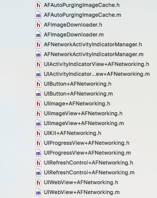

# AFNetworking源码探究（十八） —— UIKit相关之AFNetworkActivityIndicatorManager（一）

## 回顾

上一篇主要讲述了 `_AFURLSessionTaskSwizzling` 用于方法交换，接下来几篇讲述AFN与UIKit相关的部分。

## UIKit相关的类

下面我们看一下UIKit相关的类。



可以看见还是很多关于UIKit的类，都是在原类上的扩展。下面我们就看一下这几个相关的类。

## AFNetworkActivityIndicatorManager

这个就是网络请求时候上面旋转的小菊花。


### 1. 使用

```
#import "AFNetworkActivityIndicatorManager.h"

[[AFNetworkActivityIndicatorManager sharedManager] setEnabled:YES];
```

`AFNetworkActivityIndicatorManager` 管理状态栏中网络活动指示器的状态。 启用后，它将侦听指示会话任务已启动或完成的通知，并相应地启动或停止对指示器进行动画处理。 活动请求的数量增加和减少很像堆栈或信号量，只要该数量大于零，活动指示器就会动画。

当您的应用程序完成启动时，您应该启用 `AFNetworkActivityIndicatorManager` 的共享实例。 在AppDelegate应用程序中： `didFinishLaunchingWithOptions：` 你可以用下面的代码来完成：

```
[[AFNetworkActivityIndicatorManager sharedManager] setEnabled：YES];
```

通过为 `sharedManager` 设置 `enabled` 为 `YES` ，当请求开始和结束时，网络活动指示器将自动显示并隐藏。 你不需要自己调用 `incrementActivityCount` 或 `decrementActivityCount` 。

### 2. 指示器的状态

下面看一下指示器的几个状态。

```
typedef NS_ENUM(NSInteger, AFNetworkActivityManagerState) {
    //没有请求
    AFNetworkActivityManagerStateNotActive,
    //请求延迟开始
    AFNetworkActivityManagerStateDelayingStart,
    //请求进行中
    AFNetworkActivityManagerStateActive,
    //请求延迟结束
    AFNetworkActivityManagerStateDelayingEnd
};
```

这里包括四个状态，包括请求、结束、延迟开始和延迟结束。这里可能延迟开始和延迟结束大家需要注意下。如果一个请求时间很短，那么菊花很可能闪一下就结束了。如果很多请求过来，那么菊花会不停的闪啊闪，这显然并不是我们想要的效果。所以设置了这两个状态参数，在一个请求开始的时候，延迟一会在去转菊花，如果在这延迟时间内，请求结束了，那么我就不需要去转菊花了。但是一旦转菊花开始，哪怕很短请求就结束了，我们还是会去转一个时间再去结束，这时间就是延迟结束的时间。

### 3. 初始化方法

下面看一下初始化方法。

```
+ (instancetype)sharedManager {
    static AFNetworkActivityIndicatorManager *_sharedManager = nil;
    static dispatch_once_t oncePredicate;
    dispatch_once(&oncePredicate, ^{
        _sharedManager = [[self alloc] init];
    });

    return _sharedManager;
}

- (instancetype)init {
    self = [super init];
    if (!self) {
        return nil;
    }
    //设置状态为没有request活跃
    self.currentState = AFNetworkActivityManagerStateNotActive;
    //开始下载通知
    [[NSNotificationCenter defaultCenter] addObserver:self selector:@selector(networkRequestDidStart:) name:AFNetworkingTaskDidResumeNotification object:nil];
    //挂起通知
    [[NSNotificationCenter defaultCenter] addObserver:self selector:@selector(networkRequestDidFinish:) name:AFNetworkingTaskDidSuspendNotification object:nil];
    //完成通知
    [[NSNotificationCenter defaultCenter] addObserver:self selector:@selector(networkRequestDidFinish:) name:AFNetworkingTaskDidCompleteNotification object:nil];
    //开始延迟
    self.activationDelay = kDefaultAFNetworkActivityManagerActivationDelay;
    //结束延迟
    self.completionDelay = kDefaultAFNetworkActivityManagerCompletionDelay;
    return self;
}

// 延迟时间设置
static NSTimeInterval const kDefaultAFNetworkActivityManagerActivationDelay = 1.0;
static NSTimeInterval const kDefaultAFNetworkActivityManagerCompletionDelay = 0.17;
```

初始化方法里面有三个通知监听，监听了三个通知，用来监听当前正在进行的网络请求的状态。

下面我们就看这两个通知方法的实现。

```
//请求开始
- (void)networkRequestDidStart:(NSNotification *)notification {
    
    if ([AFNetworkRequestFromNotification(notification) URL]) {
        //增加请求活跃数
        [self incrementActivityCount];
    }
}

//请求结束
- (void)networkRequestDidFinish:(NSNotification *)notification {
    //AFNetworkRequestFromNotification(notification)返回这个通知的request,用来判断request是否是有效的
    if ([AFNetworkRequestFromNotification(notification) URL]) {
        //减少请求活跃数
        [self decrementActivityCount];
    }
}
```

还记得我前面说过的，活动指示器是如何出现的吗？活动请求的数量增加和减少很像堆栈或信号量，只要该数量大于零，活动指示器就会动画。

下面看一下活动指示器活动请求数量的增加还是减少数量的计算。

```
//请求开始
- (void)networkRequestDidStart:(NSNotification *)notification {
    
    if ([AFNetworkRequestFromNotification(notification) URL]) {
        //增加请求活跃数
        [self incrementActivityCount];
    }
}

//请求结束
- (void)networkRequestDidFinish:(NSNotification *)notification {
    //AFNetworkRequestFromNotification(notification)返回这个通知的request,用来判断request是否是有效的
    if ([AFNetworkRequestFromNotification(notification) URL]) {
        //减少请求活跃数
        [self decrementActivityCount];
    }
}
```

```
//增加请求活跃数
- (void)incrementActivityCount {
    
    //活跃的网络数+1，并手动发送KVO
    [self willChangeValueForKey:@"activityCount"];
    @synchronized(self) {
        _activityCount++;
    }
    [self didChangeValueForKey:@"activityCount"];

    //主线程去做
    dispatch_async(dispatch_get_main_queue(), ^{
        [self updateCurrentStateForNetworkActivityChange];
    });
}

//减少请求活跃数
- (void)decrementActivityCount {
    [self willChangeValueForKey:@"activityCount"];
    @synchronized(self) {
#pragma clang diagnostic push
#pragma clang diagnostic ignored "-Wgnu"
        _activityCount = MAX(_activityCount - 1, 0);
#pragma clang diagnostic pop
    }
    [self didChangeValueForKey:@"activityCount"];

    dispatch_async(dispatch_get_main_queue(), ^{
        [self updateCurrentStateForNetworkActivityChange];
    });
}
```

后面需要用下面的方法判断是否是活跃的

```
//判断是否活跃
- (BOOL)isNetworkActivityOccurring {
    @synchronized(self) {
        return self.activityCount > 0;
    }
}
```

下面看一个类的核心方法。

```
// 设置当前小菊花状态

- (void)setCurrentState:(AFNetworkActivityManagerState)currentState {
    @synchronized(self) {
        if (_currentState != currentState) {
            //KVO
            [self willChangeValueForKey:@"currentState"];
            _currentState = currentState;
            switch (currentState) {
                //如果为不活跃
                case AFNetworkActivityManagerStateNotActive:
                    //取消两个延迟用的timer
                    [self cancelActivationDelayTimer];
                    [self cancelCompletionDelayTimer];
                    //设置小菊花不可见
                    [self setNetworkActivityIndicatorVisible:NO];
                    break;
                case AFNetworkActivityManagerStateDelayingStart:
                    //开启一个定时器延迟去转菊花
                    [self startActivationDelayTimer];
                    break;
                    //如果是活跃状态
                case AFNetworkActivityManagerStateActive:
                    //取消延迟完成的timer
                    [self cancelCompletionDelayTimer];
                    //开始转菊花
                    [self setNetworkActivityIndicatorVisible:YES];
                    break;
                    //延迟完成状态
                case AFNetworkActivityManagerStateDelayingEnd:
                    //开启延迟完成timer
                    [self startCompletionDelayTimer];
                    break;
            }
        }
        [self didChangeValueForKey:@"currentState"];
    }
}
```

这里重写了状态的setter方法，这里根据当前状态，是否需要开始执行一个延迟开始或者延迟完成，又或者是否需要取消这两个延迟。

## 后记

> 本篇主要介绍了 `AFNetworkActivityIndicatorManager` 这个与UIKit相关的类，后面会继续带着大家看后面的几个类。  

[AFNetworking源码探究（十八） —— UIKit相关之AFNetworkActivityIndicatorManager（一）](https://www.jianshu.com/p/a47966c1a1e6)