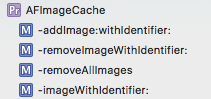
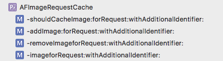

# AFNetworking源码探究（二十六） —— UIKit相关之AFAutoPurgingImageCache缓存（九）

## 回顾

上一篇主要讲述了 `UIRefreshControl+AFNetworking` 这个分类，将刷新状态和任务状态进行了绑定和同步。这一篇主要讲述 `AFAutoPurgingImageCache` 有关的缓存。

## 接口API

按照老惯例，我们还是先看一下接口API文档。这个接口文档包括三个部分，两个协议一个类。

* 协议 `AFImageCache`
* 协议 `AFImageRequestCache`
* 类 `AFAutoPurgingImageCache`

### 1. AFImageCache

这个协议包括四个方法



```
/**
 Adds the image to the cache with the given identifier.

 @param image The image to cache.
 @param identifier The unique identifier for the image in the cache.
 */
- (void)addImage:(UIImage *)image withIdentifier:(NSString *)identifier;

/**
 Removes the image from the cache matching the given identifier.

 @param identifier The unique identifier for the image in the cache.

 @return A BOOL indicating whether or not the image was removed from the cache.
 */
- (BOOL)removeImageWithIdentifier:(NSString *)identifier;

/**
 Removes all images from the cache.

 @return A BOOL indicating whether or not all images were removed from the cache.
 */
- (BOOL)removeAllImages;

/**
 Returns the image in the cache associated with the given identifier.

 @param identifier The unique identifier for the image in the cache.

 @return An image for the matching identifier, or nil.
 */
- (nullable UIImage *)imageWithIdentifier:(NSString *)identifier;
```

该协议定义了包括加入、移除、获取缓存中的图片。

### 2. AFImageRequestCache

该协议包含下面几个方法，这里注意这个协议继承自协议 `AFImageCache` 。

```
@protocol AFImageRequestCache <AFImageCache>

/**
 Asks if the image should be cached using an identifier created from the request and additional identifier.
 
 @param image The image to be cached.
 @param request The unique URL request identifing the image asset.
 @param identifier The additional identifier to apply to the URL request to identify the image.
 
 @return A BOOL indicating whether or not the image should be added to the cache. YES will cache, NO will prevent caching.
 */
- (BOOL)shouldCacheImage:(UIImage *)image forRequest:(NSURLRequest *)request withAdditionalIdentifier:(nullable NSString *)identifier;

/**
 Adds the image to the cache using an identifier created from the request and additional identifier.

 @param image The image to cache.
 @param request The unique URL request identifing the image asset.
 @param identifier The additional identifier to apply to the URL request to identify the image.
 */
- (void)addImage:(UIImage *)image forRequest:(NSURLRequest *)request withAdditionalIdentifier:(nullable NSString *)identifier;

/**
 Removes the image from the cache using an identifier created from the request and additional identifier.

 @param request The unique URL request identifing the image asset.
 @param identifier The additional identifier to apply to the URL request to identify the image.
 
 @return A BOOL indicating whether or not all images were removed from the cache.
 */
- (BOOL)removeImageforRequest:(NSURLRequest *)request withAdditionalIdentifier:(nullable NSString *)identifier;

/**
 Returns the image from the cache associated with an identifier created from the request and additional identifier.

 @param request The unique URL request identifing the image asset.
 @param identifier The additional identifier to apply to the URL request to identify the image.

 @return An image for the matching request and identifier, or nil.
 */
- (nullable UIImage *)imageforRequest:(NSURLRequest *)request withAdditionalIdentifier:(nullable NSString *)identifier;

@end
```

根据请求和标识对图像进行是否需要缓存、加入到缓存或者移除缓存等进行操作。



### 3. AFAutoPurgingImageCache

这个是这个类的接口，大家注意下这个类遵循协议 `AFImageRequestCache` 。

```
/**
 The `AutoPurgingImageCache` in an in-memory image cache used to store images up to a given memory capacity. When the memory capacity is reached, the image cache is sorted by last access date, then the oldest image is continuously purged until the preferred memory usage after purge is met. Each time an image is accessed through the cache, the internal access date of the image is updated.
 */
@interface AFAutoPurgingImageCache : NSObject <AFImageRequestCache>

/**
 The total memory capacity of the cache in bytes.
 */
// 内存缓存总的字节数
@property (nonatomic, assign) UInt64 memoryCapacity;

/**
 The preferred memory usage after purge in bytes. During a purge, images will be purged until the memory capacity drops below this limit.
 */
// 以字节为单位清除后的首选内存使用情况。 在清除过程中，图像将被清除，直到内存容量降至此限制以下。
@property (nonatomic, assign) UInt64 preferredMemoryUsageAfterPurge;

/**
 The current total memory usage in bytes of all images stored within the cache.
 */
// 当前所有图像内存缓存使用的总的字节数
@property (nonatomic, assign, readonly) UInt64 memoryUsage;

/**
 Initialies the `AutoPurgingImageCache` instance with default values for memory capacity and preferred memory usage after purge limit. `memoryCapcity` defaults to `100 MB`. `preferredMemoryUsageAfterPurge` defaults to `60 MB`.
// 初始化，memoryCapcity为100M，preferredMemoryUsageAfterPurge为60M

 @return The new `AutoPurgingImageCache` instance.
 */
- (instancetype)init;

/**
 Initialies the `AutoPurgingImageCache` instance with the given memory capacity and preferred memory usage
 after purge limit.

 @param memoryCapacity The total memory capacity of the cache in bytes.
 @param preferredMemoryCapacity The preferred memory usage after purge in bytes.

 @return The new `AutoPurgingImageCache` instance.
 */
- (instancetype)initWithMemoryCapacity:(UInt64)memoryCapacity preferredMemoryCapacity:(UInt64)preferredMemoryCapacity;

@end
```

内存中图像缓存中的 `AutoPurgingImageCache` 用于存储图像到给定内存容量。 达到内存容量时，图像缓存按上次访问日期排序，然后最旧的图像不断清除，直到满足清除后的首选内存使用量。 每次通过缓存访问图像时，图像的内部访问日期都会更新。

## AFAutoPurgingImageCache接口及初始化

从接口描述中我们可以看出来，类的初始化规定了内存总的使用量以及清楚以后的内存最优大小。

```
- (instancetype)init {
    return [self initWithMemoryCapacity:100 * 1024 * 1024 preferredMemoryCapacity:60 * 1024 * 1024];
}

- (instancetype)initWithMemoryCapacity:(UInt64)memoryCapacity preferredMemoryCapacity:(UInt64)preferredMemoryCapacity {
    if (self = [super init]) {
        self.memoryCapacity = memoryCapacity;
        self.preferredMemoryUsageAfterPurge = preferredMemoryCapacity;
        self.cachedImages = [[NSMutableDictionary alloc] init];

        NSString *queueName = [NSString stringWithFormat:@"com.alamofire.autopurgingimagecache-%@", [[NSUUID UUID] UUIDString]];
        self.synchronizationQueue = dispatch_queue_create([queueName cStringUsingEncoding:NSASCIIStringEncoding], DISPATCH_QUEUE_CONCURRENT);

        [[NSNotificationCenter defaultCenter]
         addObserver:self
         selector:@selector(removeAllImages)
         name:UIApplicationDidReceiveMemoryWarningNotification
         object:nil];

    }
    return self;
}
```

我们看一下这个初始化方法中都做了什么事情

* 设置缓存图像的字典

```
self.cachedImages = [[NSMutableDictionary alloc] init];
```

* 常见和UUID关联的并发队列

```
NSString *queueName = [NSString stringWithFormat:@"com.alamofire.autopurgingimagecache-%@", [[NSUUID UUID] UUIDString]];
self.synchronizationQueue = dispatch_queue_create([queueName cStringUsingEncoding:NSASCIIStringEncoding], DISPATCH_QUEUE_CONCURRENT);
```

* 增加移除所有图像的通知

```
[[NSNotificationCenter defaultCenter]
         addObserver:self
         selector:@selector(removeAllImages)
         name:UIApplicationDidReceiveMemoryWarningNotification
         object:nil];
```

```
- (BOOL)removeAllImages {
    __block BOOL removed = NO;
    dispatch_barrier_sync(self.synchronizationQueue, ^{
        if (self.cachedImages.count > 0) {
            [self.cachedImages removeAllObjects];
            self.currentMemoryUsage = 0;
            removed = YES;
        }
    });
    return removed;
}
```

这里就是在上面生成的队列中，清空数组，重置一些属性值。

## AFCachedImage接口及初始化

这里我们就看一下 `AFCachedImage` 的接口及初始化。

```
@interface AFCachedImage : NSObject

@property (nonatomic, strong) UIImage *image;
@property (nonatomic, strong) NSString *identifier;
@property (nonatomic, assign) UInt64 totalBytes;
@property (nonatomic, strong) NSDate *lastAccessDate;
@property (nonatomic, assign) UInt64 currentMemoryUsage;

@end

- (instancetype)initWithImage:(UIImage *)image identifier:(NSString *)identifier {
    if (self = [self init]) {
        self.image = image;
        self.identifier = identifier;

        CGSize imageSize = CGSizeMake(image.size.width * image.scale, image.size.height * image.scale);
        CGFloat bytesPerPixel = 4.0;
        CGFloat bytesPerSize = imageSize.width * imageSize.height;
        self.totalBytes = (UInt64)bytesPerPixel * (UInt64)bytesPerSize;
        self.lastAccessDate = [NSDate date];
    }
    return self;
}
```

这个初始化方法里面初始化图像的字节数，并更新上次获取数据的时间。

## 协议方法的实现

### 1. AFImageCache协议的实现

**将图像根据标识添加到内存**

```
- (void)addImage:(UIImage *)image withIdentifier:(NSString *)identifier;
```

```
- (void)addImage:(UIImage *)image withIdentifier:(NSString *)identifier {
    dispatch_barrier_async(self.synchronizationQueue, ^{
        AFCachedImage *cacheImage = [[AFCachedImage alloc] initWithImage:image identifier:identifier];

        AFCachedImage *previousCachedImage = self.cachedImages[identifier];
        if (previousCachedImage != nil) {
            self.currentMemoryUsage -= previousCachedImage.totalBytes;
        }

        self.cachedImages[identifier] = cacheImage;
        self.currentMemoryUsage += cacheImage.totalBytes;
    });

    dispatch_barrier_async(self.synchronizationQueue, ^{
        if (self.currentMemoryUsage > self.memoryCapacity) {
            UInt64 bytesToPurge = self.currentMemoryUsage - self.preferredMemoryUsageAfterPurge;
            NSMutableArray <AFCachedImage*> *sortedImages = [NSMutableArray arrayWithArray:self.cachedImages.allValues];
            NSSortDescriptor *sortDescriptor = [[NSSortDescriptor alloc] initWithKey:@"lastAccessDate"
                                                                           ascending:YES];
            [sortedImages sortUsingDescriptors:@[sortDescriptor]];

            UInt64 bytesPurged = 0;

            for (AFCachedImage *cachedImage in sortedImages) {
                [self.cachedImages removeObjectForKey:cachedImage.identifier];
                bytesPurged += cachedImage.totalBytes;
                if (bytesPurged >= bytesToPurge) {
                    break ;
                }
            }
            self.currentMemoryUsage -= bytesPurged;
        }
    });
}
```

这里用到了两个阻塞

* 第一个阻塞

```
dispatch_barrier_async(self.synchronizationQueue, ^{
    AFCachedImage *cacheImage = [[AFCachedImage alloc] initWithImage:image identifier:identifier];

    AFCachedImage *previousCachedImage = self.cachedImages[identifier];
    if (previousCachedImage != nil) {
        self.currentMemoryUsage -= previousCachedImage.totalBytes;
    }

    self.cachedImages[identifier] = cacheImage;
    self.currentMemoryUsage += cacheImage.totalBytes;
});
```

这里的作用其实很清楚，就是先根据image和identify实例化 `AFCachedImage` 对象。然后在字典中根据identifier查看是否有 `AFCachedImage` 对象，如果有的话，那么就减小当前使用内存的值。并将前面实例化的 `AFCachedImage` 对象存入字典中，并增加当前使用内存的值。

* 第二个阻塞

```
dispatch_barrier_async(self.synchronizationQueue, ^{
    if (self.currentMemoryUsage > self.memoryCapacity) {
        UInt64 bytesToPurge = self.currentMemoryUsage - self.preferredMemoryUsageAfterPurge;
        NSMutableArray <AFCachedImage*> *sortedImages = [NSMutableArray arrayWithArray:self.cachedImages.allValues];
        NSSortDescriptor *sortDescriptor = [[NSSortDescriptor alloc] initWithKey:@"lastAccessDate"
                                                                       ascending:YES];
        [sortedImages sortUsingDescriptors:@[sortDescriptor]];

        UInt64 bytesPurged = 0;

        for (AFCachedImage *cachedImage in sortedImages) {
            [self.cachedImages removeObjectForKey:cachedImage.identifier];
            bytesPurged += cachedImage.totalBytes;
            if (bytesPurged >= bytesToPurge) {
                break ;
            }
        }
        self.currentMemoryUsage -= bytesPurged;
    }
});
```

这里完成的功能是，首先判断如果当前内存使用量大于内存总量，那么就需要清理了，这里需要计算需要清理多少内存，就是当前内存值 - 最优内存值。然后 `sortedImages` 实例化字典中所有的图片，并对这些图片进行按照时间的排序，遍历这个排序后的数组，逐一从字典中移除，终止条件就是移除的字节数大于上面计算的要清除的字节数值。最后，更新下当前内存使用的值。

**根据指定标识将图像移出内存**

```
- (BOOL)removeImageWithIdentifier:(NSString *)identifier;
```

```
- (BOOL)removeImageWithIdentifier:(NSString *)identifier {
    __block BOOL removed = NO;
    dispatch_barrier_sync(self.synchronizationQueue, ^{
        AFCachedImage *cachedImage = self.cachedImages[identifier];
        if (cachedImage != nil) {
            [self.cachedImages removeObjectForKey:identifier];
            self.currentMemoryUsage -= cachedImage.totalBytes;
            removed = YES;
        }
    });
    return removed;
}
```

这个还是很好理解的，在定义的并行队列中，取出 `identifier` 对应的 `AFCachedImage` 对象，然后从字典中移除，并更新当前内存的值。

**从内存中移除所有的图像**

```
- (BOOL)removeAllImages;
```

```
- (BOOL)removeAllImages {
    __block BOOL removed = NO;
    dispatch_barrier_sync(self.synchronizationQueue, ^{
        if (self.cachedImages.count > 0) {
            [self.cachedImages removeAllObjects];
            self.currentMemoryUsage = 0;
            removed = YES;
        }
    });
    return removed;
}
```

其实就是一句话，清空字典，更新当前内存使用值。

**根据指定的标识符从内存中获取图像**

```
- (nullable UIImage *)imageWithIdentifier:(NSString *)identifier;
```

```
- (nullable UIImage *)imageWithIdentifier:(NSString *)identifier {
    __block UIImage *image = nil;
    dispatch_sync(self.synchronizationQueue, ^{
        AFCachedImage *cachedImage = self.cachedImages[identifier];
        image = [cachedImage accessImage];
    });
    return image;
}
```

```
- (UIImage*)accessImage {
    self.lastAccessDate = [NSDate date];
    return self.image;
}
```

其实就是从字典中取值，并更新上次获取图像的时间。

### 2. AFImageRequestCache协议的实现

**根据请求和标识符将图像加入到内存**

```
- (void)addImage:(UIImage *)image forRequest:(NSURLRequest *)request withAdditionalIdentifier:(nullable NSString *)identifier;
```

```
- (void)addImage:(UIImage *)image forRequest:(NSURLRequest *)request withAdditionalIdentifier:(NSString *)identifier {
    [self addImage:image withIdentifier:[self imageCacheKeyFromURLRequest:request withAdditionalIdentifier:identifier]];
}
```

```
- (NSString *)imageCacheKeyFromURLRequest:(NSURLRequest *)request withAdditionalIdentifier:(NSString *)additionalIdentifier {
    NSString *key = request.URL.absoluteString;
    if (additionalIdentifier != nil) {
        key = [key stringByAppendingString:additionalIdentifier];
    }
    return key;
}
```

这里其实是调用上面我们讲过的那个根据identifier取出 `AFCachedImage` 对象的那个方法。不过下面这个identifier是通过调用下面这个方法生成的。

**根据请求和标识符将图像移出内存**

```
- (BOOL)removeImageforRequest:(NSURLRequest *)request withAdditionalIdentifier:(nullable NSString *)identifier;
```

```
- (BOOL)removeImageforRequest:(NSURLRequest *)request withAdditionalIdentifier:(NSString *)identifier {
    return [self removeImageWithIdentifier:[self imageCacheKeyFromURLRequest:request withAdditionalIdentifier:identifier]];
}
```

这个，就是还是利用那个生成indentifier的方法，获取identify，然后调用前面我们讲过的方法移除对应的图像。

**根据请求和标识符获取内存中图像**

```
- (nullable UIImage *)imageforRequest:(NSURLRequest *)request withAdditionalIdentifier:(nullable NSString *)identifier;
```

```
- (nullable UIImage *)imageforRequest:(NSURLRequest *)request withAdditionalIdentifier:(NSString *)identifier {
    return [self imageWithIdentifier:[self imageCacheKeyFromURLRequest:request withAdditionalIdentifier:identifier]];
}
```

这个，就是还是利用那个生成indentifier的方法，获取identify，然后调用前面我们讲过的方法获取对应的图像。

**是否将图像缓存到内存**

```
- (BOOL)shouldCacheImage:(UIImage *)image forRequest:(NSURLRequest *)request withAdditionalIdentifier:(nullable NSString *)identifier;
```

```
- (BOOL)shouldCacheImage:(UIImage *)image forRequest:(NSURLRequest *)request withAdditionalIdentifier:(nullable NSString *)identifier {
    return YES;
}
```

这里就是写死的，默认就是需要进行缓存。

## 后记

> 本篇主要讲述了关于图像缓存方面的内容，包括使用标识符或者请求进行图像相关的缓存操作。  
