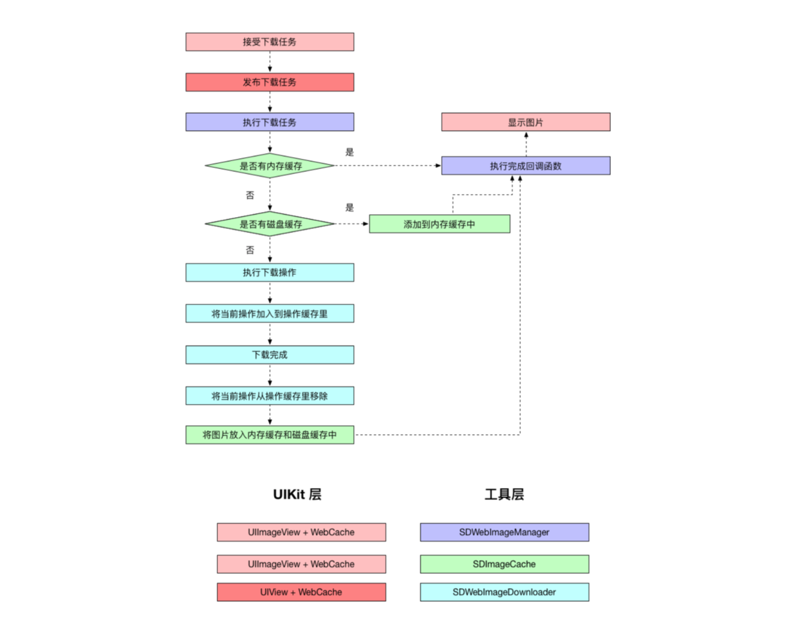

# SDWebImage 源码解析

相信对于广大的iOS开发者，对 [SDWebImage](https://github.com/rs/SDWebImage) 并不会陌生，这个框架通过给UIImageView和UIButton添加分类，实现一个异步下载图片并且支持缓存的功能。整个框架的接口非常简洁，每个类的分工都很明确，是很值得大家学习的。

在使用这个框架的时候，只需要提供一个下载的url和占位图就可以在回调里拿到下载后的图片：

```
[imageview sd_setImageWithURL:[NSURL URLWithString:@"pic.jpg"] placeholderImage:[UIImage imageNamed:@"placeholder"] completed:^(UIImage * _Nullable image, NSError * _Nullable error, SDImageCacheType cacheType, NSURL * _Nullable imageURL) {
        
        imageview.image = image;
        NSLog(@"图片加载完成");
        
}];
```

而且我们还可以不设置占位图片，也可以不使用回调的block，非常灵活:

```
//图片下载完成后直接显示下载后的图片
[imageview sd_setImageWithURL:[NSURL URLWithString:@"pic.jpg"]];
```

在最开始先简单介绍这个框架：

这个框架的核心类是 `SDWebImageManger` ，在外部有 `UIImageView+WebCache` 和 `UIButton+WebCache` 为下载图片的操作提供接口。内部有 `SDWebImageManger` 负责处理和协调 `SDWebImageDownloader` 和 `SDWebImageCache` ： `SDWebImageDownloader` 负责具体的下载任务， `SDWebImageCache` 负责关于缓存的工作：添加，删除，查询缓存。

首先我们大致看一下这个框架的调用流程图：


从这个流程图里可以大致看出，该框架分为两个层：UIKit层（负责接收下载参数）和工具层（负责下载操作和缓存）。

OK～基本流程大概清楚了，我们看一下每个层具体实现吧～

- - - -

## UIKit层

该框架最外层的类是 `UIImageView +WebCache` ，我们将图片的URL，占位图片直接给这个类。下面是这个类的公共接口：

```
// ==============  UIImageView + WebCache.h ============== //
- (void)sd_setImageWithURL:(nullable NSURL *)url;

- (void)sd_setImageWithURL:(nullable NSURL *)url
          placeholderImage:(nullable UIImage *)placeholder;

- (void)sd_setImageWithURL:(nullable NSURL *)url
          placeholderImage:(nullable UIImage *)placeholder
                   options:(SDWebImageOptions)options;

- (void)sd_setImageWithURL:(nullable NSURL *)url
                 completed:(nullable SDExternalCompletionBlock)completedBlock;

- (void)sd_setImageWithURL:(nullable NSURL *)url
          placeholderImage:(nullable UIImage *)placeholder
                 completed:(nullable SDExternalCompletionBlock)completedBlock;

- (void)sd_setImageWithURL:(nullable NSURL *)url
          placeholderImage:(nullable UIImage *)placeholder
                   options:(SDWebImageOptions)options
                 completed:(nullable SDExternalCompletionBlock)completedBlock;

- (void)sd_setImageWithURL:(nullable NSURL *)url
          placeholderImage:(nullable UIImage *)placeholder
                   options:(SDWebImageOptions)options
                  progress:(nullable SDWebImageDownloaderProgressBlock)progressBlock
                 completed:(nullable SDExternalCompletionBlock)completedBlock;
复制代码
```

可以看出，这个类提供的接口非常灵活，可以根据我们自己的需求来调用其中某一个方法，而这些方法到最后都会走到：

```
// ==============  UIView+ WebCache.m ============== //
- (void)sd_setImageWithURL:(nullable NSURL *)url
          placeholderImage:(nullable UIImage *)placeholder
                   options:(SDWebImageOptions)options
                  progress:(nullable SDWebImageDownloaderProgressBlock)progressBlock
                 completed:(nullable SDExternalCompletionBlock)completedBlock;
复制代码
```

而这个方法里面，调用的是 `UIView+WebCache` 分类的：

```
// ==============  UIView+ WebCache.m ============== //
- (void)sd_internalSetImageWithURL:(nullable NSURL *)url
                  placeholderImage:(nullable UIImage *)placeholder
                           options:(SDWebImageOptions)options
                      operationKey:(nullable NSString *)operationKey
                     setImageBlock:(nullable SDSetImageBlock)setImageBlock
                          progress:(nullable SDWebImageDownloaderProgressBlock)progressBlock
                         completed:(nullable SDExternalCompletionBlock)completedBlock;
复制代码
```

> 为什么不是UIImageView+WebCache而要上一层到UIView的分类里呢？ 因为SDWebImage框架也支持UIButton的下载图片等方法，所以需要在它们的父类：UIView里面统一一个下载方法。  

简单看一下这个方法的实现（省略的代码用...代替）：

```
// ==============  UIView+ WebCache.m ============== //

    //valid key：UIImageView || UIButton
    NSString *validOperationKey = operationKey ?: NSStringFromClass([self class]);
    //UIView+WebCacheOperation 的 operationDictionary
    //下面这行代码是保证没有当前正在进行的异步下载操作, 使它不会与即将进行的操作发生冲突
    [self sd_cancelImageLoadOperationWithKey:validOperationKey];
    

    //添加临时的占位图（在不延迟添加占位图的option下）
    if (!(options & SDWebImageDelayPlaceholder)) {
        dispatch_main_async_safe(^{
            [self sd_setImage:placeholder imageData:nil basedOnClassOrViaCustomSetImageBlock:setImageBlock];
        });
    }
    
    //如果url存在
    if (url) {
       
       ...
        __weak __typeof(self)wself = self;

       //SDWebImageManager下载图片
        id <SDWebImageOperation> operation = [SDWebImageManager.sharedManager loadImageWithURL:url options:options progress:progressBlock completed:^(UIImage *image, NSData *data, NSError *error, SDImageCacheType cacheType, BOOL finished, NSURL *imageURL) {
          
            ...
            //dispatch_main_sync_safe : 保证block能在主线程进行
            dispatch_main_async_safe(^{
                
                if (!sself) {
                    return;
                }
               
                if (image && (options & SDWebImageAvoidAutoSetImage) && completedBlock) {
                     //image，而且不自动替换 placeholder image
                    completedBlock(image, error, cacheType, url);
                    return;
                    
                } else if (image) {
                    //存在image，需要马上替换 placeholder image
                    [sself sd_setImage:image imageData:data basedOnClassOrViaCustomSetImageBlock:setImageBlock];
                    [sself sd_setNeedsLayout];
                
                } else {                    
                    //没有image，在图片下载完之后显示 placeholder image
                    if ((options & SDWebImageDelayPlaceholder)) {
                        [sself sd_setImage:placeholder imageData:nil basedOnClassOrViaCustomSetImageBlock:setImageBlock];
                        [sself sd_setNeedsLayout];
                    }
                }
                
                if (completedBlock && finished) {
                    completedBlock(image, error, cacheType, url);
                }
            });
        }];
        
        //在操作缓存字典（operationDictionary）里添加operation，表示当前的操作正在进行
        [self sd_setImageLoadOperation:operation forKey:validOperationKey];
        
    } else {
        //如果url不存在，就在completedBlock里传入error（url为空）
        dispatch_main_async_safe(^{
            [self sd_removeActivityIndicator];
            if (completedBlock) {
                NSError *error = [NSError errorWithDomain:SDWebImageErrorDomain code:-1 userInfo:@{NSLocalizedDescriptionKey : @"Trying to load a nil url"}];
                completedBlock(nil, error, SDImageCacheTypeNone, url);
            }
        });
    }
```

> 值得一提的是，在这一层，使用一个字典`operationDictionary`专门用作存储操作的缓存，随时添加，删除操作任务。
>而这个字典是`UIView+WebCacheOperation`分类的关联对象，它的存取方法使用运行时来操作：

```objc
 // ==============  UIView+WebCacheOperation.m ============== //
 //获取关联对象：operations（用来存放操作的字典）
- (SDOperationsDictionary *)operationDictionary {
    SDOperationsDictionary *operations = objc_getAssociatedObject(self, &loadOperationKey);
    //存放操作的字典
    if (operations) {
        return operations;
    }
    
    //如果没有，就新建一个
    operations = [NSMutableDictionary dictionary];
    
    objc_setAssociatedObject(self, &loadOperationKey, operations, OBJC_ASSOCIATION_RETAIN_NONATOMIC);
    return operations;
}
```

> 为什么不直接在 `UIImageView+WebCache` 里直接关联这个对象呢？我觉得这里作者应该是遵从面向对象的 **单一职责原则（SRP：Single responsibility principle）** ，就连类都要履行这个职责，何况分类呢？这里作者专门创造一个分类 `UIView+WebCacheOperation` 来管理操作缓存（字典）。

到这里， `UIKit` 层上面的东西都讲完了，现在开始正式讲解工具层。

## 工具层

上文提到过， `SDWebImageManager` 同时管理 `SDImageCache` 和 `SDWebImageDownloader` 两个类，它是这一层的 **老大哥** 。在下载任务开始的时候， `SDWebImageManager` 首先访问 `SDImageCache` 来查询是否存在缓存，如果有缓存，直接返回缓存的图片。如果没有缓存，就命令 `SDWebImageDownloader` 来下载图片，下载成功后，存入缓存，显示图片。以上是 `SDWebImageManager` 大致的工作流程。

在详细讲解 `SDWebImageManager` 是如何下载图片之前，我们先看一下这个类的几个重要的属性：

```
// ==============  SDWebImageManager.h ============== //
@property (strong, nonatomic, readwrite, nonnull) SDImageCache *imageCache;//管理缓存
@property (strong, nonatomic, readwrite, nonnull) SDWebImageDownloader //下载器*imageDownloader;
@property (strong, nonatomic, nonnull) NSMutableSet<NSURL *> *failedURLs;//记录失效url的名单
@property (strong, nonatomic, nonnull) NSMutableArray<SDWebImageCombinedOperation *> *runningOperations;//记录当前正在执行的操作
复制代码
```

`SDWebImageManager` 下载图片的方法只有一个：

```
[SDWebImageManager.sharedManager loadImageWithURL:options:progress:completed:]
复制代码
```

看一下这个方法的具体实现：

```
// ==============  SDWebImageManager.m ============== //
- (id <SDWebImageOperation>)loadImageWithURL:(nullable NSURL *)url
                                     options:(SDWebImageOptions)options
                                    progress:(nullable SDWebImageDownloaderProgressBlock)progressBlock
                                   completed:(nullable SDInternalCompletionBlock)completedBlock {
     ...                             
    //在SDImageCache里查询是否存在缓存的图片
    operation.cacheOperation = [self.imageCache queryCacheOperationForKey:key done:^(UIImage *cachedImage, NSData *cachedData, SDImageCacheType cacheType) {
        
        ...
        //（没有缓存图片） || （即使有缓存图片，也需要更新缓存图片） || （代理没有响应imageManager:shouldDownloadImageForURL:消息，默认返回yes，需要下载图片）|| （imageManager:shouldDownloadImageForURL:返回yes，需要下载图片）
        if ((!cachedImage || options & SDWebImageRefreshCached) && (![self.delegate respondsToSelector:@selector(imageManager:shouldDownloadImageForURL:)] || [self.delegate imageManager:self shouldDownloadImageForURL:url])) {
            
            //1. 存在缓存图片 && 即使有缓存图片也要下载更新图片
            if (cachedImage && options & SDWebImageRefreshCached) {
                [self callCompletionBlockForOperation:weakOperation completion:completedBlock image:cachedImage data:cachedData error:nil cacheType:cacheType finished:YES url:url];
            }

            // 2. 如果不存在缓存图片
            ...
            
            //开启下载器下载
            //subOperationToken 用来标记当前的下载任务，便于被取消
            SDWebImageDownloadToken *subOperationToken = [self.imageDownloader downloadImageWithURL:url options:downloaderOptions progress:progressBlock completed:^(UIImage *downloadedImage, NSData *downloadedData, NSError *error, BOOL finished) {
                __strong __typeof(weakOperation) strongOperation = weakOperation;
                if (!strongOperation || strongOperation.isCancelled) {
                    // 1. 如果任务被取消，则什么都不做，避免和其他的completedBlock重复
                
                } else if (error) {
                    
                    //2. 如果有错误
                    //2.1 在completedBlock里传入error
                    [self callCompletionBlockForOperation:strongOperation completion:completedBlock error:error url:url];

							//2.2 在错误url名单中添加当前的url
                    if (   error.code != NSURLErrorNotConnectedToInternet
                        && error.code != NSURLErrorCancelled
                        && error.code != NSURLErrorTimedOut
                        && error.code != NSURLErrorInternationalRoamingOff
                        && error.code != NSURLErrorDataNotAllowed
                        && error.code != NSURLErrorCannotFindHost
                        && error.code != NSURLErrorCannotConnectToHost) {
                        
                       @synchronized (self.failedURLs) {
                            [self.failedURLs addObject:url];
                        }
                    }
                }
                else {
                    
                    //3. 下载成功
                    //3.1 如果需要下载失败后重新下载，则将当前url从失败url名单里移除
                    if ((options & SDWebImageRetryFailed)) {
                        @synchronized (self.failedURLs) {
                            [self.failedURLs removeObject:url];
                        }
                    }
                    
                    //3.2 进行缓存
                    BOOL cacheOnDisk = !(options & SDWebImageCacheMemoryOnly);

                   
                    if (options & SDWebImageRefreshCached && cachedImage && !downloadedImage) {
                    
                        //（即使缓存存在，也要刷新图片） && 缓存图片 && 不存在下载后的图片：不做操作
                                           
                    } else if (downloadedImage && (!downloadedImage.images || (options & SDWebImageTransformAnimatedImage)) && [self.delegate respondsToSelector:@selector(imageManager:transformDownloadedImage:withURL:)]) {
                        
          //（下载图片成功 && （没有动图||处理动图） && （下载之后，缓存之前处理图片）               dispatch_async(dispatch_get_global_queue(DISPATCH_QUEUE_PRIORITY_HIGH, 0), ^{
                            UIImage *transformedImage = [self.delegate imageManager:self transformDownloadedImage:downloadedImage withURL:url];

                            if (transformedImage && finished) {
                                BOOL imageWasTransformed = ![transformedImage isEqual:downloadedImage];
                                // pass nil if the image was transformed, so we can recalculate the data from the image
                                //缓存图片
                                [self.imageCache storeImage:transformedImage imageData:(imageWasTransformed ? nil : downloadedData) forKey:key toDisk:cacheOnDisk completion:nil];
                            }
                            //将图片传入completedBlock
                            [self callCompletionBlockForOperation:strongOperation completion:completedBlock image:transformedImage data:downloadedData error:nil cacheType:SDImageCacheTypeNone finished:finished url:url];
                        });
                    } else {
                        
                        //(图片下载成功并结束)
                        if (downloadedImage && finished) {
                            [self.imageCache storeImage:downloadedImage imageData:downloadedData forKey:key toDisk:cacheOnDisk completion:nil];
                        }
                        
                        [self callCompletionBlockForOperation:strongOperation completion:completedBlock image:downloadedImage data:downloadedData error:nil cacheType:SDImageCacheTypeNone finished:finished url:url];
                    }
                }

					 //如果完成，从当前运行的操作列表里移除当前操作
                if (finished) {
                    [self safelyRemoveOperationFromRunning:strongOperation];
                }
            }];
            
            //取消的block
            operation.cancelBlock = ^{
            
                //取消当前的token
                [self.imageDownloader cancel:subOperationToken];
                __strong __typeof(weakOperation) strongOperation = weakOperation;
                //从当前运行的操作列表里移除当前操作
                [self safelyRemoveOperationFromRunning:strongOperation];
            };
        
        } else if (cachedImage) {
            
            //存在缓存图片
            __strong __typeof(weakOperation) strongOperation = weakOperation;
            
            //调用完成的block
            [self callCompletionBlockForOperation:strongOperation completion:completedBlock image:cachedImage data:cachedData error:nil cacheType:cacheType finished:YES url:url];
            
            //删去当前的的下载操作（线程安全）
            [self safelyRemoveOperationFromRunning:operation];
        
        } else {
            
            //没有缓存的图片，而且下载被代理终止了
            __strong __typeof(weakOperation) strongOperation = weakOperation;
           
            // 调用完成的block
            [self callCompletionBlockForOperation:strongOperation completion:completedBlock image:nil data:nil error:nil cacheType:SDImageCacheTypeNone finished:YES url:url];
            
            //删去当前的下载操作
            [self safelyRemoveOperationFromRunning:operation];
        }
    }];

    return operation;                                                             
}
复制代码
```

看完了 `SDWebImageManager` 的回调处理，我们分别看一下 `SDImageCache` 和 `SDWebImageDownloader` 内部具体是如何工作的。首先看一下 `SDImageCache` ：

### SDImageCache

#### 属性

```
// ==============  SDImageCache.m ============== //
@property (strong, nonatomic, nonnull) NSCache *memCache;//内存缓存
@property (strong, nonatomic, nonnull) NSString *diskCachePath;//磁盘缓存路径
@property (strong, nonatomic, nullable) NSMutableArray<NSString *> *customPaths;//
@property (SDDispatchQueueSetterSementics, nonatomic, nullable) dispatch_queue_t //ioQueue唯一子线程;
复制代码
```

#### 核心方法：查询缓存

```
// ==============  SDImageCache.m ============== //
- (nullable NSOperation *)queryCacheOperationForKey:(nullable NSString *)key done:(nullable SDCacheQueryCompletedBlock)doneBlock {
   
    if (!key) {
        if (doneBlock) {
            doneBlock(nil, nil, SDImageCacheTypeNone);
        }
        return nil;
    }
		
    //================查看内存的缓存=================//
    UIImage *image = [self imageFromMemoryCacheForKey:key];
    
    // 如果存在，直接调用block，将image，data，CaheType传进去
    if (image) {
    
        NSData *diskData = nil;
        
        //如果是gif，就拿到data，后面要传到doneBlock里。不是gif就传nil
        if ([image isGIF]) {
            diskData = [self diskImageDataBySearchingAllPathsForKey:key];
        }
        
        if (doneBlock) {
            doneBlock(image, diskData, SDImageCacheTypeMemory);
        }
        
        //因为图片有缓存可供使用，所以不用实例化NSOperation，直接范围nil
        return nil;
    }

    //================查看磁盘的缓存=================//
    NSOperation *operation = [NSOperation new];
    
    //唯一的子线程：self.ioQueue
    dispatch_async(self.ioQueue, ^{
        
        if (operation.isCancelled) {
            // 在用之前就判断operation是否被取消了，作者考虑的非常严谨
            return;
        }

        @autoreleasepool {
            
            NSData *diskData = [self diskImageDataBySearchingAllPathsForKey:key];
            UIImage *diskImage = [self diskImageForKey:key];
            
            if (diskImage && self.config.shouldCacheImagesInMemory) {
                
                // cost 被用来计算缓存中所有对象的代价。当内存受限或者所有缓存对象的总代价超过了最大允许的值时，缓存会移除其中的一些对象。
                NSUInteger cost = SDCacheCostForImage(diskImage);
                
                //存入内存缓存中
                [self.memCache setObject:diskImage forKey:key cost:cost];
            }

            if (doneBlock) {
                dispatch_async(dispatch_get_main_queue(), ^{
                    doneBlock(diskImage, diskData, SDImageCacheTypeDisk);
                });
            }
        }
    });

    return operation;
}
复制代码
```

### SDWebImageDownloader

#### 属性

```
// ==============  SDWebImageDownloader.m ============== //
@property (strong, nonatomic, nonnull) NSOperationQueue *downloadQueue;//下载队列
@property (weak, nonatomic, nullable) NSOperation *lastAddedOperation;//最后添加的下载操作
@property (assign, nonatomic, nullable) Class operationClass;//操作类
@property (strong, nonatomic, nonnull) NSMutableDictionary<NSURL *, SDWebImageDownloaderOperation *> *URLOperations;//操作数组
@property (strong, nonatomic, nullable) SDHTTPHeadersMutableDictionary *HTTPHeaders;//HTTP请求头
@property (SDDispatchQueueSetterSementics, nonatomic, nullable) dispatch_queue_t barrierQueue;//用来阻塞前面的下载线程（串行化）
复制代码
```

#### 核心方法：下载图片

```
// ==============  SDWebImageDownloader.m ============== //
- (nullable SDWebImageDownloadToken *)downloadImageWithURL:(nullable NSURL *)url
                                                   options:(SDWebImageDownloaderOptions)options
                                                  progress:(nullable SDWebImageDownloaderProgressBlock)progressBlock
                                                 completed:(nullable SDWebImageDownloaderCompletedBlock)completedBlock {
    __weak SDWebImageDownloader *wself = self;

    return [self addProgressCallback:progressBlock completedBlock:completedBlock forURL:url createCallback:^SDWebImageDownloaderOperation *{
        
        __strong __typeof (wself) sself = wself;
        
        NSTimeInterval timeoutInterval = sself.downloadTimeout;
        if (timeoutInterval == 0.0) {
            timeoutInterval = 15.0;
        }

        // In order to prevent from potential duplicate caching (NSURLCache + SDImageCache) we disable the cache for image requests if told otherwise
        
        //创建下载请求
        NSMutableURLRequest *request = [[NSMutableURLRequest alloc] initWithURL:url cachePolicy:(options & SDWebImageDownloaderUseNSURLCache ? NSURLRequestUseProtocolCachePolicy : NSURLRequestReloadIgnoringLocalCacheData) timeoutInterval:timeoutInterval];
        request.HTTPShouldHandleCookies = (options & SDWebImageDownloaderHandleCookies);
        request.HTTPShouldUsePipelining = YES;
        if (sself.headersFilter) {
            request.allHTTPHeaderFields = sself.headersFilter(url, [sself.HTTPHeaders copy]);
        }
        else {
            request.allHTTPHeaderFields = sself.HTTPHeaders;
        }
        
        //创建下载操作：SDWebImageDownloaderOperation用于请求网络资源的操作，它是一个 NSOperation 的子类
        SDWebImageDownloaderOperation *operation = [[sself.operationClass alloc] initWithRequest:request inSession:sself.session options:options];
        operation.shouldDecompressImages = sself.shouldDecompressImages;
        
        //url证书
        if (sself.urlCredential) {
            operation.credential = sself.urlCredential;
        } else if (sself.username && sself.password) {
            operation.credential = [NSURLCredential credentialWithUser:sself.username password:sself.password persistence:NSURLCredentialPersistenceForSession];
        }
        
        //优先级
        if (options & SDWebImageDownloaderHighPriority) {
            operation.queuePriority = NSOperationQueuePriorityHigh;
        } else if (options & SDWebImageDownloaderLowPriority) {
            operation.queuePriority = NSOperationQueuePriorityLow;
        }

        //在下载队列里添加下载操作，执行下载操作
        [sself.downloadQueue addOperation:operation];
        
        //如果后进先出
        if (sself.executionOrder == SDWebImageDownloaderLIFOExecutionOrder) {
            // Emulate LIFO execution order by systematically adding new operations as last operation's dependency
            //addDependency:参数opertaion倍添加到NSOperationQueue后，只有等该opertion结束后才能执行其他的operation，实现了后进先出
            [sself.lastAddedOperation addDependency:operation];
            sself.lastAddedOperation = operation;
        }

        return operation;
    }];
}
复制代码
```

这里面还有一个 `addProgressCallback: progressBlock: completedBlock: forURL: createCallback:` 方法，用来保存 `progressBlock` 和 `completedBlock` 。我们看一下这个方法的实现：

```
// ==============  SDWebImageDownloader.m ============== //
- (nullable SDWebImageDownloadToken *)addProgressCallback:(SDWebImageDownloaderProgressBlock)progressBlock
                                           completedBlock:(SDWebImageDownloaderCompletedBlock)completedBlock
                                                   forURL:(nullable NSURL *)url
                                           createCallback:(SDWebImageDownloaderOperation *(^)())createCallback {

    // url 用来作为回调字典的key，如果为空，立即返回失败 
    if (url == nil) {
        if (completedBlock != nil) {
            completedBlock(nil, nil, nil, NO);
        }
        return nil;
    }

    __block SDWebImageDownloadToken *token = nil;

    //串行化前面所有的操作
    dispatch_barrier_sync(self.barrierQueue, ^{
    
        	//当前下载操作中取出SDWebImageDownloaderOperation实例
        SDWebImageDownloaderOperation *operation = self.URLOperations[url];
        
        if (!operation) {
        //如果没有，就初始化它
            operation = createCallback();
            self.URLOperations[url] = operation;
            __weak SDWebImageDownloaderOperation *woperation = operation;
            
            operation.completionBlock = ^{
              SDWebImageDownloaderOperation *soperation = woperation;
              if (!soperation) return;
              if (self.URLOperations[url] == soperation) {
                  [self.URLOperations removeObjectForKey:url];
              };
            };
        }
        id downloadOperationCancelToken = [operation addHandlersForProgress:progressBlock completed:completedBlock];
        //这里 downloadOperationCancelToken 默认是一个字典，存放 progressBlock 和 completedBlock
        token = [SDWebImageDownloadToken new];
        token.url = url;
        token.downloadOperationCancelToken = downloadOperationCancelToken;
    });

    return token;
}

复制代码
```

这里真正保存两个block的方法是 `addHandlersForProgress: completed:` 

```
- (nullable id)addHandlersForProgress:(nullable SDWebImageDownloaderProgressBlock)progressBlock
                            completed:(nullable SDWebImageDownloaderCompletedBlock)completedBlock {
    //实例化一个SDCallbacksDictionary，存放一个progressBlock 和 completedBlock
    SDCallbacksDictionary *callbacks = [NSMutableDictionary new];
    if (progressBlock) callbacks[kProgressCallbackKey] = [progressBlock copy];
    if (completedBlock) callbacks[kCompletedCallbackKey] = [completedBlock copy];
    dispatch_barrier_async(self.barrierQueue, ^{
        //添加到缓存中 self.callbackBlocks
        [self.callbackBlocks addObject:callbacks];
    });
    return callbacks;
}

复制代码
```

到这里 `SDWebImage` 的核心方法都讲解完毕了，其他没有讲到的部分以后会慢慢添加上去。

## 最后看一下一些比较零散的知识点：

---

#### 1. 运行时存取关联对象：

**存：**

```
objc_setAssociatedObject(self, &loadOperationKey, operations, OBJC_ASSOCIATION_RETAIN_NONATOMIC);
//将operations对象关联给self，地址为&loadOperationKey，语义是OBJC_ASSOCIATION_RETAIN_NONATOMIC。
复制代码
```

**取：**

```
SDOperationsDictionary *operations = objc_getAssociatedObject(self, &loadOperationKey);
//将operations对象通过地址&loadOperationKey从self里取出来
复制代码
```

#### 2. 数组的写操作需要加锁（多线程访问，避免覆写）

```
//给self.runningOperations加锁
//self.runningOperations数组的添加操作
    @synchronized (self.runningOperations) {
        [self.runningOperations addObject:operation];
    }

//self.runningOperations数组的删除操作
- (void)safelyRemoveOperationFromRunning:(nullable SDWebImageCombinedOperation*)operation {
    @synchronized (self.runningOperations) {
        if (operation) {
            [self.runningOperations removeObject:operation];
        }
    }
}
复制代码
```

#### 3. 确保在主线程的宏：

```
dispatch_main_async_safe(^{
 				 //将下面这段代码放在主线程中
            [self sd_setImage:placeholder imageData:nil basedOnClassOrViaCustomSetImageBlock:setImageBlock];
        });

//宏定义：
＃define dispatch_main_async_safe(block)\
    if (strcmp(dispatch_queue_get_label(DISPATCH_CURRENT_QUEUE_LABEL), dispatch_queue_get_label(dispatch_get_main_queue())) == 0) {\
        block();\
    } else {\
        dispatch_async(dispatch_get_main_queue(), block);\
    }
＃endif
复制代码
```

#### 4. 设置不能为nil的参数

```
- (nonnull instancetype)initWithCache:(nonnull SDImageCache *)cache downloader:(nonnull SDWebImageDownloader *)downloader {
    if ((self = [super init])) {
        _imageCache = cache;
        _imageDownloader = downloader;
        _failedURLs = [NSMutableSet new];
        _runningOperations = [NSMutableArray new];
    }
    return self;
}
复制代码
```

> 如果在参数里添加了nonnull关键字，那么编译器就可以检查传入的参数是否为nil，如果是，则编译器会有警告

#### 5. 容错，强制转换类型

```
if ([url isKindOfClass:NSString.class]) {
        url = [NSURL URLWithString:(NSString *)url];
}
复制代码
```

> 在传入的参数为NSString时（但是方法参数要求是NSURL），自动转换为NSURL  

- - - -

[SDWebImage 源码解析](https://juejin.im/post/6844903541031567367)