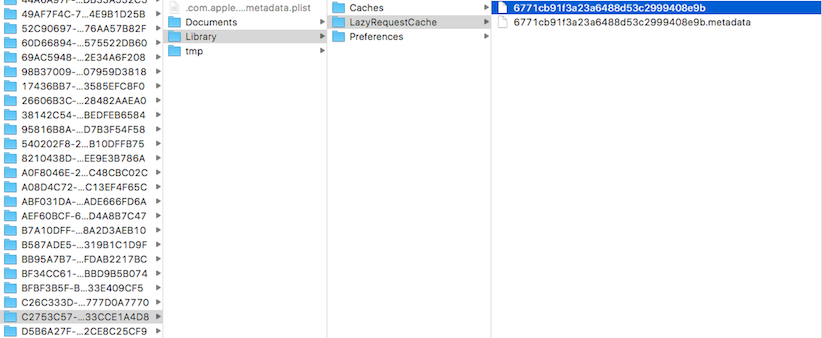

   

# YTKNetwork源码解析

对于iOS开发者来说，就算是没有用过 [YTKNetwork框架](https://github.com/yuantiku/YTKNetwork) ，应该也见过，听过了。它是猿题库技术团队开源的一个网络请求框架，内部封装了AFNetworking。它把每个请求实例化，管理它的生命周期，也可以管理多个请求。

在正式讲解源码之前，我会先讲一下该框架所用的架构和设计模式。我总觉得对架构和设计有一定的了解的话，会有助于对源码的理解。

## 1. 架构


先上图：


> 在这里简单说明一下：  

1. YTKNetwork框架将每一个请求实例化，YTKBaseRequest是所有请求类的基类，YTKRequest是它的子类。所以如果我们想要发送一个请求，则需要创建并实例化一个继承于YTKRequest的自定义的请求类（CustomRequest）并发送请求。
2. YTKNetworkAgent是一个单例，负责管理所有的请求类（例如CustomRequest）。当CustomRequest发送请求以后，会把自己放在YTKNetworkAgent持有的一个字典里，让其管理自己。
3. 我们说YTKNetwork封装了AFNetworking，实际上是YTKNetworkAgent封装了AFNetworking，由它负责AFNetworking请求的发送和AFNetworking的回调处理。所以如果我们想更换一个第三方网络请求库，就可以在这里更换一下。而YTKRequest更多的是只是负责缓存的处理。
4. YTKNetworkConfig与YTKPriviate的具体职能现在不做介绍，会在后文给出。

OK，现在我们知道了YTKNetwork中类与类之间的关系以及关键类的大致职能，接下来我会告诉你YTKNetwork为什么会采用这种关系来架构，以及采用这种架构会有什么好处。

## 2. 设计模式

YTKNetwork框架采用的设计模式是 **命令模式（Command Pattern）** 。

首先看一下命令模式的定义：

> 命令模式将请求封装成对象，以便使用不同的请求，队列或者日志来参数化其他对象。命令模式也支持可撤销的操作。 摘自：   [《Head First 设计模式》](https://www.amazon.cn/Head-First%E8%AE%BE%E8%AE%A1%E6%A8%A1%E5%BC%8F-%E5%BC%97%E9%87%8C%E6%9B%BC/dp/B0011FBU34/ref=sr_1_1?ie=UTF8&amp;qid=1500104908&amp;sr=8-1&amp;keywords=head+first+%E8%AE%BE%E8%AE%A1%E6%A8%A1%E5%BC%8F)  

看一下命令模式的类图：


图中英文的含义：

| 英文 | 中文 |
| --- | --- |
| Command | 抽象命令类 |
| ConcreteCommand | 命令类的实现类（子类）|
|Invoker | 调用者 |  
| Receiver | 命令接收者（执行者) |   
| Client | 客户端 |

详细介绍一下：

1. 命令模式的本质是对命令的封装，将发出命令的责任和执行命令的责任分割开。
2. 命令模式允许请求的一方和接收的一方独立开来，使得请求的一方不必知道接收请求的一方的接口，更不必知道请求是怎么被接收，以及操作是否被执行、何时被执行，以及是怎么被执行的。

可能还是觉得有点抽象，在这里举一个 [《Head First 设计模式》](https://www.amazon.cn/Head-First%E8%AE%BE%E8%AE%A1%E6%A8%A1%E5%BC%8F-%E5%BC%97%E9%87%8C%E6%9B%BC/dp/B0011FBU34/ref=sr_1_1?ie=UTF8&amp;qid=1500104908&amp;sr=8-1&amp;keywords=head+first+%E8%AE%BE%E8%AE%A1%E6%A8%A1%E5%BC%8F) 里的例子，一个客人在餐厅点餐的过程：

1. 你将点的菜写在订单里，交给了服务员。
2. 服务员将订单交给厨师。
3. 厨师做好菜之后将做好的菜交给服务员。
4. 最后服务员把菜递给你。

在这里，命令就好比是订单，而你是命令的发起者。你的命令（订单）通过服务员（调用者）交给了命令的执行者（厨师）。 所以至于这道菜具体是谁做，怎么做，你是不知道的，你做的只是发出命令和接受结果。而且对于餐厅来说，厨师是可以随便换的，而你可能对此一无所知。反过来，厨师只需要好好把菜做好，至于是谁点的菜也不需要他考虑。

结合上面命令模式的类图以及餐厅点餐的例子，我们来理清一下YTKNetwork内部的职能

| 场景 | Command | ConcreteCommand | Invoker |Receiver | Client |
| :-: | :-: | :-: | :-: | :-: | :-: |     
| 餐厅 | 空白订单 | 填入菜名的订单 | 服务员 | 厨师 | 客人 |  
| YTKNetwork | YTKBaseRequest | CustomRequest | YTKNetworkAgent | AFNetworking |  ViewController/ViewModel |

可以看到，YTKNetwork对命令模式的实现是很符合其设计标准的，它将请求的发起者和接收者分离开来(中间隔着调用者)，可以让我们随时更换接受者。

另外，因为封装了请求，我们既可以管理单个请求，也可以同时管理多个请求，甚至实现琏式请求的发送。关于多个请求的发送，我们也可以想象在餐厅里，你可以在吃的过程中还想起来要吃别的东西，例如点心，饮料之类的，你就可以填多个订单（当然也可以写在一起）交给服务员。

相信到这里，大家应该对YTKNetwork的设计与架构有了足够的认识了，下面进入到真正的源码解析，我们结合一下它的代码来看一下YTKNetwork是如何实现和管理网络请求的。

## 3. 源码解析

在真正讲解源码之前，我先详细说一下各个类的职责:

### 3.1 责任介绍

| 类名 | 职责 |
| --- | --- |
| YTKBaseRequest | 所有请求类的基类。持有NSURLSessionTask实例，responseData，responseObject，error等重要数据，提供一些需要子类实现的与网络请求相关的方法，处理回调的代理和block，命令YTKNetworkAgent发起网络请求。|
| YTKRequest | YTKBaseRequest的子类。负责缓存的处理：请求前查询缓存；请求后写入缓存。|
| YTKNetworkConfig | 被YTKRequest和YTKNetworkAgent访问。负责所有请求的全局配置，例如baseUrl和CDNUrl等等。|
| YTKNetworkPrivate | 提供JSON验证，appVersion等辅助性的方法；给YTKBaseRequest增加一些分类。|
| YTKNetworkAgent | 真正发起请求的类。负责发起请求，结束请求，并持有一个字典来存储正在执行的请求。|
| YTKBatchRequest | 可以发起批量请求，持有一个数组来保存所有的请求类。在请求执行后遍历这个数组来发起请求，如果其中有一个请求返回失败，则认定本组请求失败。|
| YTKBatchRequestAgent | 负责管理多个YTKBatchRequest实例，持有一个数组来保存YTKBatchRequest。支持添加和删除YTKBatchRequest实例。|
| YTKChainRequest | 可以发起链式请求，持有一个数组来保存所有的请求类。当某个请求结束后才能发起下一个请求，如果其中有一个请求返回失败，则认定本请求链失败。|
| YTKChainRequestAgent | 负责管理多个YTKChainRequestAgent实例，持有一个数组来保存YTKChainRequest。支持添加和删除YTKChainRequest实例。|

OK，现在知道了YTKNetwork内部的责任分配，下面我们先从单个请求的全部流程（配置，发起，结束）来看一下YTKNetwork都做了什么。

### 3.2 单个请求

#### 3.2.1 单个请求的配置

[官方的教程](https://github.com/yuantiku/YTKNetwork/blob/master/Docs/BasicGuide_cn.md) 建议我们将请求的全局配置是在AppDelegate.m文件里，设定baseUrl以及cdnUrl等参数。

```
- (BOOL)application:(UIApplication *)application 
   didFinishLaunchingWithOptions:(NSDictionary *)launchOptions
{
   YTKNetworkConfig *config = [YTKNetworkConfig sharedConfig];
   config.baseUrl = @"http://yuantiku.com";
   config.cdnUrl = @"http://fen.bi";
}
```

> **CDN**
> 全称:Content Delivery Network或Content Ddistribute Network，即内容分发网络
>
>**基本思路：**
>尽可能避开互联网上有可能影响数据传输速度和稳定性的瓶颈和环节，使内容传输的更快、更稳定。通过在网络各处放置节点服务器所构成的在现有的互联网基础之上的一层智能虚拟网络，CDN系统能够实时地根据网络流量和各节点的连接、负载状况以及到用户的距离和响应时间等综合信息将用户的请求重新导向离用户最近的服务节点上。


如果我们需要新建一个注册的请求，则需要创建一个继承于YTKRequest的注册接口的类RegisterApi，并将针对该请求参数配置好：

```
// RegisterApi.h
#import "YTKRequest.h"

@interface RegisterApi : YTKRequest

- (id)initWithUsername:(NSString *)username password:(NSString *)password;

@end

// RegisterApi.m
#import "RegisterApi.h"

@implementation RegisterApi {
    NSString *_username;
    NSString *_password;
}

//初始化的时候将两个参数值传入
- (id)initWithUsername:(NSString *)username password:(NSString *)password {
    self = [super init];
    if (self) {
        _username = username;
        _password = password;
    }
    return self;
}

//需要和baseUrl拼接的地址
- (NSString *)requestUrl {
    // “ http://www.yuantiku.com ” 在 YTKNetworkConfig 中设置，这里只填除去域名剩余的网址信息
    return @"/iphone/register";
}

//请求方法，某人是GET
- (YTKRequestMethod)requestMethod {
    return YTKRequestMethodPOST;
}

//请求体
- (id)requestArgument {
    return @{
        @"username": _username,
        @"password": _password
    };
}

@end
复制代码
```

现在我们知道如何配置全局的参数和针对某个请求的参数了，接下来看一下单个请求是如何发起的。

#### 3.2.2 单个请求的发起

还是刚才的注册API，在实例化以后，直接调用 `startWithCompletionBlockWithSuccess:failure` 方法（或 `start` 方法）就可以发起它：

```
//LoginViewController.m
- (void)loginButtonPressed:(id)sender {
    NSString *username = self.UserNameTextField.text;
    NSString *password = self.PasswordTextField.text;
    if (username.length > 0 && password.length > 0) {
        RegisterApi *api = [[RegisterApi alloc] initWithUsername:username password:password];
        [api startWithCompletionBlockWithSuccess:^(YTKBaseRequest *request) {
            // 你可以直接在这里使用 self
            NSLog(@"succeed");
        } failure:^(YTKBaseRequest *request) {
            // 你可以直接在这里使用 self
            NSLog(@"failed");
        }];
    }
}
复制代码
```

上面是以block的形式回调，YTKNetwork也支持代理的回调：

```
//LoginViewController.m
- (void)loginButtonPressed:(id)sender {
    NSString *username = self.UserNameTextField.text;
    NSString *password = self.PasswordTextField.text;
    if (username.length > 0 && password.length > 0) {
        RegisterApi *api = [[RegisterApi alloc] initWithUsername:username password:password];
        api.delegate = self;
        [api start];
    }
}

- (void)requestFinished:(YTKBaseRequest *)request {
    NSLog(@"succeed");
}

- (void)requestFailed:(YTKBaseRequest *)request {
    NSLog(@"failed");
}
复制代码
```

有两点需要注意的是：

1. 必须给自定义请求类（RegisterApi）调用 `startWithCompletionBlockWithSuccess:failure` 方法（或 `start` 方法），才能真正发起请求。
2. 在同时设置了回调代理和回调block的情况下，首先回调的是回调代理方法，然后再走回调block。

知道了YTKRequest请求是如何在外部发起的，我们现在从 `startWithCompletionBlockWithSuccess:failure` 方法开始，来看一下YTKNetwork都做了什么：

首先来到YTKBaseRequest类（因为最早是由它定义的该方法）：

```
//YTKBaseRequest.m
//传入成功和失败的block,并保存起来
- (void)startWithCompletionBlockWithSuccess:(YTKRequestCompletionBlock)success
                                    failure:(YTKRequestCompletionBlock)failure {
    //保存成功和失败的回调block，便于将来调用
    [self setCompletionBlockWithSuccess:success failure:failure];
    //发起请求
    [self start];
}

//保存成功和失败的block
- (void)setCompletionBlockWithSuccess:(YTKRequestCompletionBlock)success
                              failure:(YTKRequestCompletionBlock)failure {
    self.successCompletionBlock = success;
    self.failureCompletionBlock = failure;
}
复制代码
```

当保存完成功和失败的block以后，调用 `start` 方法，于是来到了YTKRequest类（注意，虽然YTKBaseRequest也实现了 `start` 方法，但是由于YTKRequest类是它的子类并也实现了 `start` 方法，所以这里最先走的是YTKRequest类的 `start` 方法）：

```
//YTKRequest.m
- (void)start {
    
    //1. 如果忽略缓存 -> 请求
    if (self.ignoreCache) {
        [self startWithoutCache];
        return;
    }

    //2. 如果存在下载未完成的文件 -> 请求
    if (self.resumableDownloadPath) {
        [self startWithoutCache];
        return;
    }

    //3. 获取缓存失败 -> 请求
    if (![self loadCacheWithError:nil]) {
        [self startWithoutCache];
        return;
    }

    //4. 到这里，说明一定能拿到可用的缓存，可以直接回调了（因为一定能拿到可用的缓存，所以一定是调用成功的block和代理）
    _dataFromCache = YES;

    dispatch_async(dispatch_get_main_queue(), ^{
        
        //5. 回调之前的操作
        //5.1 缓存处理
        [self requestCompletePreprocessor];
        
        //5.2 用户可以在这里进行真正回调前的操作
        [self requestCompleteFilter];
        
        YTKRequest *strongSelf = self;
        
        //6. 执行回调
        //6.1 请求完成的代理
        [strongSelf.delegate requestFinished:strongSelf];
        
        //6.2 请求成功的block
        if (strongSelf.successCompletionBlock) {
            strongSelf.successCompletionBlock(strongSelf);
        }
        
        //7. 把成功和失败的block都设置为nil，避免循环引用
        [strongSelf clearCompletionBlock];
    });
}
复制代码
```

我们之前说过YTKRequest负责缓存的相关处理，所以在上面这个 `start` 方法里，它做的是请求之前缓存的查询和检查工作:

* 如果忽略缓存，或者缓存获取失败，调用 `startWithoutCache` 方法（参考1-3的情况），发起请求。
* 如果能成功获取到缓存，则直接回调（参考4-7的情况）。

我们来看一下每一步的具体实现：

1. `ignoreCache` 属性是用户手动设置的，如果用户强制忽略缓存，则无论是否缓存是否存在，直接发送请求。
2. `resumableDownloadPath` 是断点下载路径，如果该路径不为空，说明有未完成的下载任务，则直接发送请求继续下载。
3. `loadCacheWithError：` 方法验证了加载缓存是否成功的方法（返回值为YES，说明可以加载缓存；反之亦然），看一下具体实现：

```
//YTKRequest.m
- (BOOL)loadCacheWithError:(NSError * _Nullable __autoreleasing *)error {
    
    // 缓存时间小于0，则返回（缓存时间默认为-1，需要用户手动设置，单位是秒）
    if ([self cacheTimeInSeconds] < 0) {
        if (error) {
            *error = [NSError errorWithDomain:YTKRequestCacheErrorDomain code:YTKRequestCacheErrorInvalidCacheTime userInfo:@{ NSLocalizedDescriptionKey:@"Invalid cache time"}];
        }
        return NO;
    }

    // 是否有缓存的元数据，如果没有，返回错误
    if (![self loadCacheMetadata]) {
        if (error) {
            *error = [NSError errorWithDomain:YTKRequestCacheErrorDomain code:YTKRequestCacheErrorInvalidMetadata userInfo:@{ NSLocalizedDescriptionKey:@"Invalid metadata. Cache may not exist"}];
        }
        return NO;
    }

    // 有缓存，再验证是否有效
    if (![self validateCacheWithError:error]) {
        return NO;
    }

    // 有缓存，而且有效，再验证是否能取出来
    if (![self loadCacheData]) {
        if (error) {
            *error = [NSError errorWithDomain:YTKRequestCacheErrorDomain code:YTKRequestCacheErrorInvalidCacheData userInfo:@{ NSLocalizedDescriptionKey:@"Invalid cache data"}];
        }
        return NO;
    }

    return YES;
}
复制代码
```

先讲一下什么是元数据：元数据是指数据的数据，在这里描述了缓存数据本身的一些特征：包括版本号，缓存时间，敏感信息等等， 稍后会做详细介绍。

我们来看一下上面关于缓存的元数据的获取方法： `loadCacheMetadata` 方法

```
//YTKRequest.m
- (BOOL)loadCacheMetadata {
    
    NSString *path = [self cacheMetadataFilePath];
    NSFileManager * fileManager = [NSFileManager defaultManager];
    if ([fileManager fileExistsAtPath:path isDirectory:nil]) {
        @try {
            //将序列化之后被保存在磁盘里的文件反序列化到当前对象的属性cacheMetadata
            _cacheMetadata = [NSKeyedUnarchiver unarchiveObjectWithFile:path];
            return YES;
        } @catch (NSException *exception) {
            YTKLog(@"Load cache metadata failed, reason = %@", exception.reason);
            return NO;
        }
    }
    return NO;
}
复制代码
```

cacheMetadata（YTKCacheMetadata） 是当前reqeust类用来保存缓存元数据的属性。 YTKCacheMetadata类被定义在YTKRequest.m文件里面：

```
//YTKRequest.m
@interface YTKCacheMetadata : NSObject<NSSecureCoding>

@property (nonatomic, assign) long long version;
@property (nonatomic, strong) NSString *sensitiveDataString;
@property (nonatomic, assign) NSStringEncoding stringEncoding;
@property (nonatomic, strong) NSDate *creationDate;
@property (nonatomic, strong) NSString *appVersionString;

@end
复制代码
```

它描述的是缓存的版本号，敏感信息，创建时间，app版本等信息，并支持序列化处理，可以保存在磁盘里。 因此， `loadCacheMetadata` 方法的目的是将之前被序列化保存的缓存元数据信息反序列化，赋给自身的 `cacheMetadata` 属性上。

现在获取了缓存的元数据并赋给了自身的cacheMetadata属性上，那么接下来就要逐一验证元数据里的各项信息是否符合要求，在下面的validateCacheWithError：里面验证：

```
//YTKRequest.m
- (BOOL)validateCacheWithError:(NSError * _Nullable __autoreleasing *)error {
    
    // 是否大于过期时间
    NSDate *creationDate = self.cacheMetadata.creationDate;
    NSTimeInterval duration = -[creationDate timeIntervalSinceNow];
    if (duration < 0 || duration > [self cacheTimeInSeconds]) {
        if (error) {
            *error = [NSError errorWithDomain:YTKRequestCacheErrorDomain code:YTKRequestCacheErrorExpired userInfo:@{ NSLocalizedDescriptionKey:@"Cache expired"}];
        }
        return NO;
    }

    // 缓存的版本号是否符合
    long long cacheVersionFileContent = self.cacheMetadata.version;
    if (cacheVersionFileContent != [self cacheVersion]) {
        if (error) {
            *error = [NSError errorWithDomain:YTKRequestCacheErrorDomain code:YTKRequestCacheErrorVersionMismatch userInfo:@{ NSLocalizedDescriptionKey:@"Cache version mismatch"}];
        }
        return NO;
    }
    
    // 敏感信息是否符合
    NSString *sensitiveDataString = self.cacheMetadata.sensitiveDataString;
    NSString *currentSensitiveDataString = ((NSObject *)[self cacheSensitiveData]).description;
    if (sensitiveDataString || currentSensitiveDataString) {
        // If one of the strings is nil, short-circuit evaluation will trigger
        if (sensitiveDataString.length != currentSensitiveDataString.length || ![sensitiveDataString isEqualToString:currentSensitiveDataString]) {
            if (error) {
                *error = [NSError errorWithDomain:YTKRequestCacheErrorDomain code:YTKRequestCacheErrorSensitiveDataMismatch userInfo:@{ NSLocalizedDescriptionKey:@"Cache sensitive data mismatch"}];
            }
            return NO;
        }
    }
    
    // app的版本是否符合
    NSString *appVersionString = self.cacheMetadata.appVersionString;
    NSString *currentAppVersionString = [YTKNetworkUtils appVersionString];
    if (appVersionString || currentAppVersionString) {
        if (appVersionString.length != currentAppVersionString.length || ![appVersionString isEqualToString:currentAppVersionString]) {
            if (error) {
                *error = [NSError errorWithDomain:YTKRequestCacheErrorDomain code:YTKRequestCacheErrorAppVersionMismatch userInfo:@{ NSLocalizedDescriptionKey:@"App version mismatch"}];
            }
            return NO;
        }
    }
    return YES;
}
复制代码
```

如果每项元数据信息都能通过，再在 `loadCacheData` 方法里面验证缓存是否能被取出来：

```
//YTKRequest.m
- (BOOL)loadCacheData {
    
    NSString *path = [self cacheFilePath];
    NSFileManager *fileManager = [NSFileManager defaultManager];
    NSError *error = nil;

    if ([fileManager fileExistsAtPath:path isDirectory:nil]) {
        NSData *data = [NSData dataWithContentsOfFile:path];
        _cacheData = data;
        _cacheString = [[NSString alloc] initWithData:_cacheData encoding:self.cacheMetadata.stringEncoding];
        switch (self.responseSerializerType) {
            case YTKResponseSerializerTypeHTTP:
                // Do nothing.
                return YES;
            case YTKResponseSerializerTypeJSON:
                _cacheJSON = [NSJSONSerialization JSONObjectWithData:_cacheData options:(NSJSONReadingOptions)0 error:&error];
                return error == nil;
            case YTKResponseSerializerTypeXMLParser:
                _cacheXML = [[NSXMLParser alloc] initWithData:_cacheData];
                return YES;
        }
    }
    return NO;
}
复制代码
```

如果通过了最终的考验，则说明当前请求对应的缓存是符合各项要求并可以被成功取出，也就是可以直接进行回调了。

当确认缓存可以成功取出后，手动设置 `dataFromCache` 属性为 YES，说明当前的请求结果是来自于缓存，而没有通过网络请求。

然后在真正回调之前做了如下处理：

```
//YTKRequest.m：
- (void)start{

    ....

    //5. 回调之前的操作
    //5.1 缓存处理
    [self requestCompletePreprocessor];

    //5.2 用户可以在这里进行真正回调前的操作
    [self requestCompleteFilter];

    ....
}

复制代码
```

5.1： `requestCompletePreprocessor` 方法:

```
//YTKRequest.m：
- (void)requestCompletePreprocessor {
    
    [super requestCompletePreprocessor];

    //是否异步将responseData写入缓存（写入缓存的任务放在专门的队列ytkrequest_cache_writing_queue进行）
    if (self.writeCacheAsynchronously) {
        
        dispatch_async(ytkrequest_cache_writing_queue(), ^{
            //保存响应数据到缓存
            [self saveResponseDataToCacheFile:[super responseData]];
        });
        
    } else {
        //保存响应数据到缓存
        [self saveResponseDataToCacheFile:[super responseData]];
    }
}
复制代码
```

```
//YTKRequest.m：
//保存响应数据到缓存
- (void)saveResponseDataToCacheFile:(NSData *)data {
    
    if ([self cacheTimeInSeconds] > 0 && ![self isDataFromCache]) {
        if (data != nil) {
            @try {
                // New data will always overwrite old data.
                [data writeToFile:[self cacheFilePath] atomically:YES];

                YTKCacheMetadata *metadata = [[YTKCacheMetadata alloc] init];
                metadata.version = [self cacheVersion];
                metadata.sensitiveDataString = ((NSObject *)[self cacheSensitiveData]).description;
                metadata.stringEncoding = [YTKNetworkUtils stringEncodingWithRequest:self];
                metadata.creationDate = [NSDate date];
                metadata.appVersionString = [YTKNetworkUtils appVersionString];
                [NSKeyedArchiver archiveRootObject:metadata toFile:[self cacheMetadataFilePath]];
                
            } @catch (NSException *exception) {
                YTKLog(@"Save cache failed, reason = %@", exception.reason);
            }
        }
    }
}
复制代码
```

> 我们可以看到, `requestCompletePreprocessor` 方法的任务是将响应数据保存起来，也就是做缓存。但是，缓存的保存有两个条件，一个是需要 `cacheTimeInSeconds` 方法返回正整数（缓存时间，单位是秒，后续会详细说明）；另一个条件是 `isDataFromCache` 方法返回NO。 但是我们知道，如果缓存可用，就会将这个属性设置为YES，所以走到这里的时候，就不做缓存了。  

接着看下5.2： `requestCompleteFilter` 方法则是需要用户自己提供具体实现的，专门作为回调成功之前的一些处理：

```
//YTKBaseRequest.m
- (void)requestCompleteFilter {
}

复制代码
```

到这里，回调之前的处理都结束了，下面来看一下在缓存可用的情况下的回调：

```
//YTKRequest.m
- (void)start{
   
    ...

    YTKRequest *strongSelf = self;
        
    //6. 执行回调
    //6.1 请求完成的代理
    [strongSelf.delegate requestFinished:strongSelf];
        
    //6.2 请求成功的block
    if (strongSelf.successCompletionBlock) {
         strongSelf.successCompletionBlock(strongSelf);
    }
        
    //7. 把成功和失败的block都设置为nil，避免循环引用
    [strongSelf clearCompletionBlock];
}

复制代码
```

我们可以看到 ，这里面同时存在两种回调：代理的回调和block的回调。先执行的是代理的回调，然后执行的是block的回调。而且在回调结束之后，YTKNetwork会帮助我们清空回调的block：

```
//YTKBaseRequest.m
- (void)clearCompletionBlock {
    // 清空请求结束的block，避免循环引用
    self.successCompletionBlock = nil;
    self.failureCompletionBlock = nil;
}
复制代码
```

> 注意，在用户同时实现了代理和block的情况下，二者都会被调用。  

到这里，我们了解了YTKNetwork在网络请求之前是如何验证缓存，以及在缓存有效的情况下是如何回调的。

反过来，如果缓存无效（或忽略缓存）时，需要立即请求网络。那么我们现在来看一看在这个时候YTKNetwork都做了什么：

仔细看一下上面的 `start` 方法，我们会发现，如果缓存不满足条件时，会直接调用 `startWithoutCache` 方法：

```
//YTKRequest.m
- (void)start{

    //1. 如果忽略缓存 -> 请求
    if (self.ignoreCache) {
        [self startWithoutCache];
        return;
    }

    //2. 如果存在下载未完成的文件 -> 请求
    if (self.resumableDownloadPath) {
        [self startWithoutCache];
        return;
    }

    //3. 获取缓存失败 -> 请求
    if (![self loadCacheWithError:nil]) {
        [self startWithoutCache];
        return;
    }
 
    ......
}
复制代码
```

那么在 `startWithoutCache` 方法里都做了什么呢？

```
//YTKRequest.m
- (void)startWithoutCache {
    
    //1. 清除缓存
    [self clearCacheVariables];
    
    //2. 调用父类的发起请求
    [super start];
}

//清除当前请求对应的所有缓存
- (void)clearCacheVariables {
    _cacheData = nil;
    _cacheXML = nil;
    _cacheJSON = nil;
    _cacheString = nil;
    _cacheMetadata = nil;
    _dataFromCache = NO;
}
复制代码
```

在这里，首先清除了关于缓存的所有数据，然后调用父类的 `start` 方法:

```
//YTKBaseRequest.m:
- (void)start {
    
    //1. 告诉Accessories即将回调了（其实是即将发起请求）
    [self toggleAccessoriesWillStartCallBack];

    //2. 令agent添加请求并发起请求，在这里并不是组合关系，agent只是一个单例
    [[YTKNetworkAgent sharedAgent] addRequest:self];
}
复制代码
```

第一步里的Accessories是一些遵从代理的对象。这个代理定义了一些用来追踪请求状况的方法。它被定义在了YTKBaseRequest.h文件里：

```
//用来跟踪请求的状态的代理。
@protocol YTKRequestAccessory <NSObject>

@optional

///  Inform the accessory that the request is about to start.
///
///  @param request The corresponding request.
- (void)requestWillStart:(id)request;

///  Inform the accessory that the request is about to stop. This method is called
///  before executing `requestFinished` and `successCompletionBlock`.
///
///  @param request The corresponding request.
- (void)requestWillStop:(id)request;

///  Inform the accessory that the request has already stoped. This method is called
///  after executing `requestFinished` and `successCompletionBlock`.
///
///  @param request The corresponding request.
- (void)requestDidStop:(id)request;

@end
复制代码
```

所以只要某个对象遵从了这个代理，就可以追踪到请求将要开始，将要结束，已经结束的状态。

接着看一下第二步：YTKNetworkAgent把当前的请求对象添加到了自己身上并发送请求。来看一下它的具体实现：

```
//YTKNetworkAgent.m
- (void)addRequest:(YTKBaseRequest *)request {
    
    //1. 获取task
    NSParameterAssert(request != nil);

    NSError * __autoreleasing requestSerializationError = nil;

    //获取用户自定义的requestURL
    NSURLRequest *customUrlRequest= [request buildCustomUrlRequest];
    
    if (customUrlRequest) {
        
        __block NSURLSessionDataTask *dataTask = nil;
        //如果存在用户自定义request，则直接走AFNetworking的dataTaskWithRequest:方法
        dataTask = [_manager dataTaskWithRequest:customUrlRequest completionHandler:^(NSURLResponse * _Nonnull response, id  _Nullable responseObject, NSError * _Nullable error) {
            //响应的统一处理
            [self handleRequestResult:dataTask responseObject:responseObject error:error];
        }];
        request.requestTask = dataTask;
        
    } else {
        
        //如果用户没有自定义url，则直接走这里
        request.requestTask = [self sessionTaskForRequest:request error:&requestSerializationError];
        
    }

    //序列化失败，则认定为请求失败
    if (requestSerializationError) {
        //请求失败的处理
        [self requestDidFailWithRequest:request error:requestSerializationError];
        return;
    }

    NSAssert(request.requestTask != nil, @"requestTask should not be nil");

    // 优先级的映射
    // !!Available on iOS 8 +
    if ([request.requestTask respondsToSelector:@selector(priority)]) {
        switch (request.requestPriority) {
            case YTKRequestPriorityHigh:
                request.requestTask.priority = NSURLSessionTaskPriorityHigh;
                break;
            case YTKRequestPriorityLow:
                request.requestTask.priority = NSURLSessionTaskPriorityLow;
                break;
            case YTKRequestPriorityDefault:
                /*!!fall through*/
            default:
                request.requestTask.priority = NSURLSessionTaskPriorityDefault;
                break;
        }
    }

    // Retain request
    YTKLog(@"Add request: %@", NSStringFromClass([request class]));
    
    //2. 将request放入保存请求的字典中，taskIdentifier为key，request为值
    [self addRequestToRecord:request];
    
    //3. 开始task
    [request.requestTask resume];
}
复制代码
```

这个方法挺长的，但是请不要被吓到，它总共分为三个部分：

* 第一部分是获取当前请求对应的task并赋给request的 `requestTask` 属性（以后提到的request，都为用户自定义的当前请求类的实例）。
* 第二部分是把request放入专门用来保存请求的字典中，key为taskIdentifier。
* 第三部分是启动task。

下面我来依次讲解每个部分：

**第一部分：获取当前请求对应的task并赋给request** ：

```
//YTKNetworkAgent.m
- (void)addRequest:(YTKBaseRequest *)request {

  ...

  if (customUrlRequest) {
        
        __block NSURLSessionDataTask *dataTask = nil;
        //如果存在用户自定义request，则直接走AFNetworking的dataTaskWithRequest:方法
        dataTask = [_manager dataTaskWithRequest:customUrlRequest completionHandler:^(NSURLResponse * _Nonnull response, id  _Nullable responseObject, NSError * _Nullable error) {
            //统一处理请求响应
            [self handleRequestResult:dataTask responseObject:responseObject error:error];
        }];
        request.requestTask = dataTask;
        
    } else {
        
        //如果用户没有自定义url，则直接走这里
        request.requestTask = [self sessionTaskForRequest:request error:&requestSerializationError];
        
    }

  ...
}
复制代码
```

在这里判断了用户是否自定义了request：

1. 如果是，则直接调用AFNetworking的dataTaskWithRequest:方法。
2. 如果不是，则调用YTKRequest自己的生成task的方法。

第一种情况就不说了，因为AF帮我们做好了。在这里看一下第二种情况， `sessionTaskForRequest: error :` 方法内部：

```
//YTKNetworkAgent.m
//根据不同请求类型，序列化类型，和请求参数来返回NSURLSessionTask
- (NSURLSessionTask *)sessionTaskForRequest:(YTKBaseRequest *)request error:(NSError * _Nullable __autoreleasing *)error {
    
    //1. 获得请求类型（GET，POST等）
    YTKRequestMethod method = [request requestMethod];

    //2. 获得请求url
    NSString *url = [self buildRequestUrl:request];

    //3. 获得请求参数
    id param = request.requestArgument;
    AFConstructingBlock constructingBlock = [request constructingBodyBlock];
    
    //4. 获得request serializer
    AFHTTPRequestSerializer *requestSerializer = [self requestSerializerForRequest:request];

    //5. 根据不同的请求类型来返回对应的task
    switch (method) {
            
        case YTKRequestMethodGET:
            
            if (request.resumableDownloadPath) {
                //下载任务
                return [self downloadTaskWithDownloadPath:request.resumableDownloadPath requestSerializer:requestSerializer URLString:url parameters:param progress:request.resumableDownloadProgressBlock error:error];
                
            } else {
                //普通get请求
                return [self dataTaskWithHTTPMethod:@"GET" requestSerializer:requestSerializer URLString:url parameters:param error:error];
            }
            
        case YTKRequestMethodPOST:
            //POST请求
            return [self dataTaskWithHTTPMethod:@"POST" requestSerializer:requestSerializer URLString:url parameters:param constructingBodyWithBlock:constructingBlock error:error];
            
        case YTKRequestMethodHEAD:
            //HEAD请求
            return [self dataTaskWithHTTPMethod:@"HEAD" requestSerializer:requestSerializer URLString:url parameters:param error:error];
            
        case YTKRequestMethodPUT:
            //PUT请求
            return [self dataTaskWithHTTPMethod:@"PUT" requestSerializer:requestSerializer URLString:url parameters:param error:error];
            
        case YTKRequestMethodDELETE:
            //DELETE请求
            return [self dataTaskWithHTTPMethod:@"DELETE" requestSerializer:requestSerializer URLString:url parameters:param error:error];
            
        case YTKRequestMethodPATCH:
            //PATCH请求
            return [self dataTaskWithHTTPMethod:@"PATCH" requestSerializer:requestSerializer URLString:url parameters:param error:error];
    }
}

复制代码
```

从这个方法最后的switch语句可以看出，这个方法的作用是返回当前request的NSURLSessionTask的实例。而且最终生成NSURLSessionTask实例的方法都是通过 `dataTaskWithHTTPMethod:requestSerializer:URLString:parameters:error:` 这个私有方法来实现的。在讲解这个关键的私有方法之前，先来逐步讲解一下这个私有方法需要的每个参数的获取方法：

1. 获得请求类型（GET，POST等）：

```
//YTKNetworkAgent.m
- (NSURLSessionTask *)sessionTaskForRequest:(YTKBaseRequest *)request error:(NSError * _Nullable __autoreleasing *)error {

  ...
  YTKRequestMethod method = [request requestMethod];
  ...

}
复制代码
```

`requestMethod` 方法最初在YTKBaseRequest里面已经实现了，默认返回了YTKRequestMethodGET。

它的枚举类型在YTKBaseRequest.h里面定义：

```
//YTKBaseRequest.h
///  HTTP Request method.
typedef NS_ENUM(NSInteger, YTKRequestMethod) {
    YTKRequestMethodGET = 0,
    YTKRequestMethodPOST,
    YTKRequestMethodHEAD,
    YTKRequestMethodPUT,
    YTKRequestMethodDELETE,
    YTKRequestMethodPATCH,
};
复制代码
```

用户可以根据实际的需求在自定义request类里面重写这个方法：

```
//RegisterAPI.m
- (YTKRequestMethod)requestMethod {
    return YTKRequestMethodPOST;
}
复制代码
```

2.获得请求url：

```
//YTKNetworkAgent.m
- (NSURLSessionTask *)sessionTaskForRequest:(YTKBaseRequest *)request error:(NSError * _Nullable __autoreleasing *)error {

  ...
  NSString *url = [self buildRequestUrl:request];
  ...

}

//返回当前请求url
- (NSString *)buildRequestUrl:(YTKBaseRequest *)request {
   
    NSParameterAssert(request != nil);

    //用户自定义的url（不包括在YTKConfig里面设置的base_url）
    NSString *detailUrl = [request requestUrl];
    NSURL *temp = [NSURL URLWithString:detailUrl];
    
    // 存在host和scheme的url立即返回正确
    if (temp && temp.host && temp.scheme) {
        return detailUrl;
    }
    
    // 如果需要过滤url，则过滤
    NSArray *filters = [_config urlFilters];
    for (id<YTKUrlFilterProtocol> f in filters) {
        detailUrl = [f filterUrl:detailUrl withRequest:request];
    }

    NSString *baseUrl;
    if ([request useCDN]) {
        //如果使用CDN，在当前请求没有配置CDN地址的情况下，返回全局配置的CDN
        if ([request cdnUrl].length > 0) {
            baseUrl = [request cdnUrl];
        } else {
            baseUrl = [_config cdnUrl];
        }
    } else {
        //如果使用baseUrl，在当前请求没有配置baseUrl，返回全局配置的baseUrl
        if ([request baseUrl].length > 0) {
            baseUrl = [request baseUrl];
        } else {
            baseUrl = [_config baseUrl];
        }
    }
    // 如果末尾没有/，则在末尾添加一个／
    NSURL *url = [NSURL URLWithString:baseUrl];

    if (baseUrl.length > 0 && ![baseUrl hasSuffix:@"/"]) {
        url = [url URLByAppendingPathComponent:@""];
    }

    return [NSURL URLWithString:detailUrl relativeToURL:url].absoluteString;
}
复制代码
```

3.获得请求参数

```
//YTKNetworkAgent.m
- (NSURLSessionTask *)sessionTaskForRequest:(YTKBaseRequest *)request error:(NSError * _Nullable __autoreleasing *)error {

   ...
      //获取用户提供的请求参数
    id param = request.requestArgument;

    //获取用户提供的构造请求体的block（默认是没有的）
    AFConstructingBlock constructingBlock = [request constructingBodyBlock];

   ...

}

复制代码
```

在这里，requestArgument是一个get方法，需要用户自己定义请求体，例如在RegisterAPI里面就定义了两个请求参数：

```
//RegisterApi.m
- (id)requestArgument {
    return @{
        @"username": _username,
        @"password": _password
    };
}
复制代码
```

4.获得request serializer

```
//YTKNetworkAgent.m
- (NSURLSessionTask *)sessionTaskForRequest:(YTKBaseRequest *)request error:(NSError * _Nullable __autoreleasing *)error {

   ...
   
   //4. 获得request serializer
   AFHTTPRequestSerializer *requestSerializer = [self requestSerializerForRequest:request];

   ...

}

- (AFHTTPRequestSerializer *)requestSerializerForRequest:(YTKBaseRequest *)request {
    
    AFHTTPRequestSerializer *requestSerializer = nil;
    
    //HTTP or JSON
    if (request.requestSerializerType == YTKRequestSerializerTypeHTTP) {
        requestSerializer = [AFHTTPRequestSerializer serializer];
    } else if (request.requestSerializerType == YTKRequestSerializerTypeJSON) {
        requestSerializer = [AFJSONRequestSerializer serializer];
    }

    //超时时间
    requestSerializer.timeoutInterval = [request requestTimeoutInterval];
    
    //是否允许数据服务
    requestSerializer.allowsCellularAccess = [request allowsCellularAccess];

    //如果当前请求需要验证
    NSArray<NSString *> *authorizationHeaderFieldArray = [request requestAuthorizationHeaderFieldArray];
    if (authorizationHeaderFieldArray != nil) {
        [requestSerializer setAuthorizationHeaderFieldWithUsername:authorizationHeaderFieldArray.firstObject
                                                          password:authorizationHeaderFieldArray.lastObject];
    }

    //如果当前请求需要自定义 HTTPHeaderField
    NSDictionary<NSString *, NSString *> *headerFieldValueDictionary = [request requestHeaderFieldValueDictionary];
    if (headerFieldValueDictionary != nil) {
        for (NSString *httpHeaderField in headerFieldValueDictionary.allKeys) {
            NSString *value = headerFieldValueDictionary[httpHeaderField];
            [requestSerializer setValue:value forHTTPHeaderField:httpHeaderField];
        }
    }
    return requestSerializer;
}
复制代码
```

上面这个方法通过传入的request实例，根据它的一些配置（用户提供）来获取AFHTTPRequestSerializer的实例。

到现在为止，获取NSURLSessionTask实例的几个参数都拿到了，剩下的就是调用 `dataTaskWithHTTPMethod:requestSerializer:URLString:parameters:error:` 方法来获取NSURLSessionTask实例了。我们来看一下这个方法的具体实现：

```
//YTKNetworkAgent.m
- (NSURLSessionDataTask *)dataTaskWithHTTPMethod:(NSString *)method
                               requestSerializer:(AFHTTPRequestSerializer *)requestSerializer
                                       URLString:(NSString *)URLString
                                      parameters:(id)parameters
                                           error:(NSError * _Nullable __autoreleasing *)error {
    return [self dataTaskWithHTTPMethod:method requestSerializer:requestSerializer URLString:URLString parameters:parameters constructingBodyWithBlock:nil error:error];
}

//最终返回NSURLSessionDataTask实例
- (NSURLSessionDataTask *)dataTaskWithHTTPMethod:(NSString *)method
                               requestSerializer:(AFHTTPRequestSerializer *)requestSerializer
                                       URLString:(NSString *)URLString
                                      parameters:(id)parameters
                       constructingBodyWithBlock:(nullable void (^)(id <AFMultipartFormData> formData))block
                                           error:(NSError * _Nullable __autoreleasing *)error {
    NSMutableURLRequest *request = nil;

    //根据有无构造请求体的block的情况来获取request
    if (block) {
        request = [requestSerializer multipartFormRequestWithMethod:method URLString:URLString parameters:parameters constructingBodyWithBlock:block error:error];
    } else {
        request = [requestSerializer requestWithMethod:method URLString:URLString parameters:parameters error:error];
    }

    //获得request以后来获取dataTask
    __block NSURLSessionDataTask *dataTask = nil;
    dataTask = [_manager dataTaskWithRequest:request
                           completionHandler:^(NSURLResponse * __unused response, id responseObject, NSError *_error) {
                               //响应的统一处理
                               [self handleRequestResult:dataTask responseObject:responseObject error:_error];
                           }];

    return dataTask;
}
复制代码
```

这两个方法，上面的方法调用了下面的来获取最终的NSURLSessionDataTask实例。

OK，现在我们已经知道了NSURLSessionDataTask实例是如何获取的，再来看一下在 `addRequest：` 方法里接下来做的是对序列化失败的处理：

```
//YTKNetworkAgent.m
- (void)addRequest:(YTKBaseRequest *)request {

   ...
   
  //序列化失败
    if (requestSerializationError) {
        //请求失败的处理
        [self requestDidFailWithRequest:request error:requestSerializationError];
        return;
    }

   ...

}
   
复制代码
```

requestDidFailWithRequest:方法专门处理请求失败的情况，因为它被包含在统一处理请求回调的方法中，所以在稍后会在讲解统一处理请求回调的方法的时候再详细讲解这个方法。

继续往下走，到了优先级的映射部分：

```
//YTKNetworkAgent.m
- (void)addRequest:(YTKBaseRequest *)request {

   ...
   
    // 优先级的映射
    // !!Available on iOS 8 +
    if ([request.requestTask respondsToSelector:@selector(priority)]) {
        switch (request.requestPriority) {
            case YTKRequestPriorityHigh:
                request.requestTask.priority = NSURLSessionTaskPriorityHigh;
                break;
            case YTKRequestPriorityLow:
                request.requestTask.priority = NSURLSessionTaskPriorityLow;
                break;
            case YTKRequestPriorityDefault:
                /*!!fall through*/
            default:
                request.requestTask.priority = NSURLSessionTaskPriorityDefault;
                break;
        }
    }

   ...

}
   
复制代码
```

requestPriority是YTKBaseRequest的一个枚举属性，它的枚举在YTKBaseRequest.h里面被定义：

```
typedef NS_ENUM(NSInteger, YTKRequestPriority) {
    YTKRequestPriorityLow = -4L,
    YTKRequestPriorityDefault = 0,
    YTKRequestPriorityHigh = 4,
};
复制代码
```

在这里，将用户设置的YTKRequestPriority映射到NSURLSessionTask的priority上。

到这里，我们拿到了task的实例并设置好了优先级，紧接着就是 `addRequest:` 方法里的第二个部分： YTKNetworkAgent将request实例放在了一个字典中，保存起来：

**第二部分：把request放入专门用来保存请求的字典中，key为taskIdentifier：**

```
//YTKNetworkAgent.m
- (void)addRequest:(YTKBaseRequest *)request {

   ...

   ...
   
  //将request实例放入保存请求的字典中，taskIdentifier为key，request为值
  [self addRequestToRecord:request];

   ...

}

- (void)addRequestToRecord:(YTKBaseRequest *)request {
    
    //加锁
    Lock();
    _requestsRecord[@(request.requestTask.taskIdentifier)] = request;
    Unlock();
}

#define Lock() pthread_mutex_lock(&_lock)
#define Unlock() pthread_mutex_unlock(&_lock)
复制代码
```

> 可以看到，在添加前和添加后是进行了加锁和解锁的处理的。而且request实例被保存的时候，将其task的identifier作为key来保存。  

在当前的request被保存以后，就到了最后一步，正式发起请求：

**第三部分：启动task**

```
//YTKNetworkAgent.m
- (NSURLSessionTask *)sessionTaskForRequest:(YTKBaseRequest *)request error:(NSError * _Nullable __autoreleasing *)error {

   ...
   
   [request.requestTask resume];

   ...

}

复制代码
```

到现在为止，我们了解了YTKNetwork里面，一个请求开始之前做的事情：查找可用缓存，生成NSURLSessionTask实例，获取url，requestSerializer，将request放到YTKNetworkAgent的一个字典里等等（详细流程会在稍后给出）。

那么接下来我们看一下YTKNetwork是如何处理请求的回调的。

眼尖的同学们可能会注意到，在获取NSURLSessionTask实例的时候，出现了两次“响应的统一处理”的注释，大家可以搜索这个注释就可以找到这个方法： `handleRequestResult:responseObject:error:` 。这个方法负责的是对请求回调的处理，当然包括了成功和失败的情况。我们来看一下在这个方法里都做了什么：

```
//YTKNetworkAgent.m
//统一处理请求结果，包括成功和失败的情况
- (void)handleRequestResult:(NSURLSessionTask *)task responseObject:(id)responseObject error:(NSError *)error {
    
    //1. 获取task对应的request
    Lock();
    YTKBaseRequest *request = _requestsRecord[@(task.taskIdentifier)];
    Unlock();

    //如果不存在对应的request，则立即返回
    if (!request) {
        return;
    }

    。。。

    //2. 获取request对应的response
    request.responseObject = responseObject;
    
    //3. 获取responseObject，responseData和responseString
    if ([request.responseObject isKindOfClass:[NSData class]]) {
        
       //3.1 获取 responseData
        request.responseData = responseObject;
        
        //3.2 获取responseString
        request.responseString = [[NSString alloc] initWithData:responseObject encoding:[YTKNetworkUtils stringEncodingWithRequest:request]];

         //3.3 获取responseObject（或responseJSONObject）
        //根据返回的响应的序列化的类型来得到对应类型的响应
        switch (request.responseSerializerType)
        {
            case YTKResponseSerializerTypeHTTP:
                // Default serializer. Do nothing.
                break;
                
            case YTKResponseSerializerTypeJSON:
                request.responseObject = [self.jsonResponseSerializer responseObjectForResponse:task.response data:request.responseData error:&serializationError];
                request.responseJSONObject = request.responseObject;
                break;
                
            case YTKResponseSerializerTypeXMLParser:
                request.responseObject = [self.xmlParserResponseSerialzier responseObjectForResponse:task.response data:request.responseData error:&serializationError];
                break;
        }
    }
    
    //4. 判断是否有错误，将错误对象赋值给requestError，改变succeed的布尔值。目的是根据succeed的值来判断到底是进行成功的回调还是失败的回调
    if (error) {
        //如果该方法传入的error不为nil
        succeed = NO;
        requestError = error;
        
    } else if (serializationError) {
        //如果序列化失败了
        succeed = NO;
        requestError = serializationError;
        
    } else {
        
        //即使没有error而且序列化通过，也要验证request是否有效
        succeed = [self validateResult:request error:&validationError];
        requestError = validationError;
    }

    //5. 根据succeed的布尔值来调用相应的处理
    if (succeed) {
        //请求成功的处理
        [self requestDidSucceedWithRequest:request];
    } else {
        
        //请求失败的处理
        [self requestDidFailWithRequest:request error:requestError];
    }

     //6. 回调完成的处理
    dispatch_async(dispatch_get_main_queue(), ^{
        //6.1 在字典里移除当前request
        [self removeRequestFromRecord:request];
         //6.2 清除所有block
        [request clearCompletionBlock];
    });
}
复制代码
```

简单讲解一下上面的代码：

* 首先通过task的identifier值从YTKNetworkAgent保存的字典里获取对应的请求。
* 然后将获得的responseObject进行处理，将处理后获得的responseObject，responseData和responseString赋值给当前的请求实例request。
* 再根据这些值的获取情况来判断最终回调的成败（改变succeed的值）。
* 最后根据succeed的值来进行成功和失败的回调。

这里先重点介绍一下是如何判断json的有效性的：

```
//YTKNetworkAgent.m
//判断code是否符合范围和json的有效性
- (BOOL)validateResult:(YTKBaseRequest *)request error:(NSError * _Nullable __autoreleasing *)error {
    
    //1. 判断code是否在200~299之间
    BOOL result = [request statusCodeValidator];
    
    if (!result) {
        if (error) {
            *error = [NSError errorWithDomain:YTKRequestValidationErrorDomain code:YTKRequestValidationErrorInvalidStatusCode userInfo:@{NSLocalizedDescriptionKey:@"Invalid status code"}];
        }
        return result;
    }
    
    //2. result 存在的情况判断json是否有效
    id json = [request responseJSONObject];
    id validator = [request jsonValidator];
    
    if (json && validator) {
        //通过json和validator来判断json是否有效
        result = [YTKNetworkUtils validateJSON:json withValidator:validator];
        
        //如果json无效
        if (!result) {
            if (error) {
                *error = [NSError errorWithDomain:YTKRequestValidationErrorDomain code:YTKRequestValidationErrorInvalidJSONFormat userInfo:@{NSLocalizedDescriptionKey:@"Invalid JSON format"}];
            }
            return result;
        }
    }
    return YES;
}
复制代码
```

在这里，首先，用 `statusCodeValidator` 方法判断响应的code是否在正确的范围:

```
//YTKBaseReqiest.m
- (BOOL)statusCodeValidator {
    NSInteger statusCode = [self responseStatusCode];
    return (statusCode >= 200 && statusCode <= 299);
}
- (NSInteger)responseStatusCode {
    return self.response.statusCode;
}
复制代码
```

然后再判断json的有效性：见demo中，判断某个字段的类型是否和给定的一致。

```
//YTKNetworkUtils.m
//判断json的有效性
+ (BOOL)validateJSON:(id)json withValidator:(id)jsonValidator {
    if ([json isKindOfClass:[NSDictionary class]] &&
        [jsonValidator isKindOfClass:[NSDictionary class]]) {
        NSDictionary * dict = json;
        NSDictionary * validator = jsonValidator;
        BOOL result = YES;
        NSEnumerator * enumerator = [validator keyEnumerator];
        NSString * key;
        while ((key = [enumerator nextObject]) != nil) {
            id value = dict[key];
            id format = validator[key];
            if ([value isKindOfClass:[NSDictionary class]]
                || [value isKindOfClass:[NSArray class]]) {
                result = [self validateJSON:value withValidator:format];
                if (!result) {
                    break;
                }
            } else {
                if ([value isKindOfClass:format] == NO &&
                    [value isKindOfClass:[NSNull class]] == NO) {
                    result = NO;
                    break;
                }
            }
        }
        return result;
    } else if ([json isKindOfClass:[NSArray class]] &&
               [jsonValidator isKindOfClass:[NSArray class]]) {
        NSArray * validatorArray = (NSArray *)jsonValidator;
        if (validatorArray.count > 0) {
            NSArray * array = json;
            NSDictionary * validator = jsonValidator[0];
            for (id item in array) {
                BOOL result = [self validateJSON:item withValidator:validator];
                if (!result) {
                    return NO;
                }
            }
        }
        return YES;
    } else if ([json isKindOfClass:jsonValidator]) {
        return YES;
    } else {
        return NO;
    }
}
复制代码
```

注意，YTKNetworkUtils这个类是在YTKNetworkPirvate里面定义的，YTKNetworkPirvate里面有一些工具类的方法，在后面还会遇到。

在验证返回的JSON数据是否有效以后，就可以进行回调了：

```
//YTKNetworkAgent.m
- (void)handleRequestResult:(NSURLSessionTask *)task responseObject:(id)responseObject error:(NSError *)error {

    ...
    //5. 根据succeed的布尔值来调用相应的处理
    if (succeed) {
        //请求成功的处理
        [self requestDidSucceedWithRequest:request];
    } else {
        
        //请求失败的处理
        [self requestDidFailWithRequest:request error:requestError];
    }

    //6. 回调完成的处理
    dispatch_async(dispatch_get_main_queue(), ^{
        //6.1 在字典里移除当前request
        [self removeRequestFromRecord:request];
         //6.2 清除所有block
        [request clearCompletionBlock];
    });

    ...

}
复制代码
```

我们先来分别看一下请求成功的处理和失败的处理：

请求成功的处理：

```
//YTKNetworkAgent.m
//请求成功：主要负责将结果写入缓存&回调成功的代理和block
- (void)requestDidSucceedWithRequest:(YTKBaseRequest *)request {
    
    @autoreleasepool {
        //写入缓存 
        [request requestCompletePreprocessor];
    }
    
    dispatch_async(dispatch_get_main_queue(), ^{
        
        //告诉Accessories请求就要停止了
        [request toggleAccessoriesWillStopCallBack];
        
        //在真正的回调之前做的处理,用户自定义
        [request requestCompleteFilter];

        //如果有代理，则调用成功的代理
        if (request.delegate != nil) {
            [request.delegate requestFinished:request];
        }
        
        //如果传入了成功回调的代码，则调用
        if (request.successCompletionBlock) {
            request.successCompletionBlock(request);
        }
        
        //告诉Accessories请求已经结束了
        [request toggleAccessoriesDidStopCallBack];
    });
}
复制代码
```

我么可以看到，在请求成功以后，第一个做的是写入缓存，我们来看一下 `requestCompletePreprocessor` 方法的实现：

```
//YTKRequest.m
- (void)requestCompletePreprocessor {
    
    [super requestCompletePreprocessor];

    //是否异步将responseData写入缓存（写入缓存的任务放在专门的队列进行）
    if (self.writeCacheAsynchronously) {
        
        dispatch_async(ytkrequest_cache_writing_queue(), ^{
            //写入缓存文件
            [self saveResponseDataToCacheFile:[super responseData]];
        });
        
    } else {
         //写入缓存文件
        [self saveResponseDataToCacheFile:[super responseData]];
    }
}

//写入缓存文件
- (void)saveResponseDataToCacheFile:(NSData *)data {
    
    if ([self cacheTimeInSeconds] > 0 && ![self isDataFromCache]) {
        if (data != nil) {
            @try {
                // 1. 保存request的responseData到cacheFilePath
                [data writeToFile:[self cacheFilePath] atomically:YES];

                // 2. 保存request的metadata到cacheMetadataFilePath
                YTKCacheMetadata *metadata = [[YTKCacheMetadata alloc] init];
                metadata.version = [self cacheVersion];
                metadata.sensitiveDataString = ((NSObject *)[self cacheSensitiveData]).description;
                metadata.stringEncoding = [YTKNetworkUtils stringEncodingWithRequest:self];
                metadata.creationDate = [NSDate date];
                metadata.appVersionString = [YTKNetworkUtils appVersionString];
                [NSKeyedArchiver archiveRootObject:metadata toFile:[self cacheMetadataFilePath]];
                
            } @catch (NSException *exception) {
                YTKLog(@"Save cache failed, reason = %@", exception.reason);
            }
        }
    }
}
复制代码
```

首先看一下写入缓存操作的执行条件：当 `cacheTimeInSeconds` 方法返回大于0并且 `isDataFromCache` 为NO的时候会进行写入缓存。

`cacheTimeInSeconds` 方法返回的是缓存保存的时间，它最初定义在YTKBaseRquest里面，默认返回是-1：

```
//YTKBaseRequest.m
- (NSInteger)cacheTimeInSeconds {
    return -1;
}
复制代码
```

所以说YTKNetwork默认是不进行缓存的，如果用户需要做缓存，则需要在自定义的request类里面返回一个大于0的整数，这个整数的单位是秒。

`isDataFromCache` 属性在上面讲解发送请求部分里的查询缓存的步骤里有介绍。在这里再强调一下： `isDataFromCache` 的默认值是NO。在请求发起之前，- 查询缓存的时候：

* 如果发现缓存不可用（或忽略缓存），则立即发送请求，这个时候，isDataFromCache的值不做更改，仍然是NO。
* 如果发现缓存可用（在不忽略缓存的情况下），就要将isDataFromCache属性设置为YES，说明将不需要发送请求，直接在里获取数据了。

即是说，如果发送了请求，则 `isDataFromCache` 一定是NO的，那么在上面这个判断里面，(!isDataFromCache)就一定为YES了。

因此，如果用户设置了缓存保存的时间，在请求返回成功后，就会写入缓存。

我们接着往下看，对于缓存，YTKNetwork保存的是两种缓存： 第一种是纯粹的NSData类型的实例。第二种是描述当前NSData实例的元数据YTKCacheMetadata的实例，从它的属性来看，分为这几种：

1. 缓存的版本，默认返回为0，用户可以自定义。
2. 敏感数据，类型为id，默认返回nil，用户可以自定义。
3. NSString的编码格式，在YTKNetworkPrivate内的YTKNetworkUtils实现。
4. 元数据的创建时间。
5. app的版本号，在YTKNetworkPrivate内的YTKNetworkUtils实现。

在将元数据的实例的这些属性都被赋值以后，将元数据实例序列化写入磁盘中。保存的路径通过 `cacheMetadataFilePath` 方法获取。

现在知道了YTKRequest的缓存内容，我们来看一下这两种缓存的位置：

```
//YTKRequest.m
//纯NSData数据缓存的文件名
- (NSString *)cacheFileName {
    NSString *requestUrl = [self requestUrl];
    NSString *baseUrl = [YTKNetworkConfig sharedConfig].baseUrl;
    id argument = [self cacheFileNameFilterForRequestArgument:[self requestArgument]];
    NSString *requestInfo = [NSString stringWithFormat:@"Method:%ld Host:%@ Url:%@ Argument:%@",
                             (long)[self requestMethod], baseUrl, requestUrl, argument];
    NSString *cacheFileName = [YTKNetworkUtils md5StringFromString:requestInfo];
    return cacheFileName;
}

//纯NSData数据的缓存位置
- (NSString *)cacheFilePath {
    NSString *cacheFileName = [self cacheFileName];
    NSString *path = [self cacheBasePath];
    path = [path stringByAppendingPathComponent:cacheFileName];
    return path;
}

//元数据的缓存位置
- (NSString *)cacheMetadataFilePath {
    NSString *cacheMetadataFileName = [NSString stringWithFormat:@"%@.metadata", [self cacheFileName]];
    NSString *path = [self cacheBasePath];
    path = [path stringByAppendingPathComponent:cacheMetadataFileName];
    return path;
}

//创建用户保存所有YTKNetwork缓存的文件夹
- (NSString *)cacheBasePath {
    
    //获取全路径
    NSString *pathOfLibrary = [NSSearchPathForDirectoriesInDomains(NSLibraryDirectory, NSUserDomainMask, YES) objectAtIndex:0];
    NSString *path = [pathOfLibrary stringByAppendingPathComponent:@"LazyRequestCache"];

    // YTKCacheDirPathFilterProtocol定义了用户可以自定义存储位置的代理方法
    NSArray<id<YTKCacheDirPathFilterProtocol>> *filters = [[YTKNetworkConfig sharedConfig] cacheDirPathFilters];
    if (filters.count > 0) {
        for (id<YTKCacheDirPathFilterProtocol> f in filters) {
            path = [f filterCacheDirPath:path withRequest:self];
        }
    }
    
    //创建文件夹
    [self createDirectoryIfNeeded:path];
    return path;
}
复制代码
```

可以看出，纯NSData数据缓存的文件名包含了请求方法（GET,POST..），baseURL，requestURL，请求参数拼接的字符串再进行md5加密而成。

而元数据的的文件名则在纯NSData数据缓存的文件名后面加上了.metadata后缀。

为了更形象地看到这两种缓存，我将缓存的保存时间设置为200秒之后再请求一次，然后打开文件夹找到了它们：



而且我们也确认了保存所有YTKNetwork缓存的文件夹的名字为LazyRequestCache。

OK，现在我们知道了在请求成功回调后的缓存写入，接下来看一下是如何回调的：

```
//YTKNetworkAgent.m
- (void)handleRequestResult:(NSURLSessionTask *)task responseObject:(id)responseObject error:(NSError *)error {

    ...
    YTKRequest *strongSelf = self;

    //6. 执行回调
    //6.1 请求完成的代理
    [strongSelf.delegate requestFinished:strongSelf];

    //6.2 请求成功的block
    if (strongSelf.successCompletionBlock) {
        strongSelf.successCompletionBlock(strongSelf);
    }

    //7. 把成功和失败的block都设置为nil，避免循环引用
    [strongSelf clearCompletionBlock];
}
复制代码
```

我们可以看到,代理的回调是先于block的回调的。而且在block回调结束以后，会立即调用 `clearCompletionBlock` 方法将block清空。该方法的实现是在YTKBaseRequest里：

```
//YTKBaseRequest.m
- (void)clearCompletionBlock {
    // 清空请求结束的block，避免循环引用
    self.successCompletionBlock = nil;
    self.failureCompletionBlock = nil;
}
复制代码
```

现在我们知道了请求成功的处理，那么再来看一下请求失败时的处理：

```
//YTKNetworkAgent.m
//请求失败
- (void)requestDidFailWithRequest:(YTKBaseRequest *)request error:(NSError *)error {
    
    request.error = error;
    YTKLog(@"Request %@ failed, status code = %ld, error = %@",
           NSStringFromClass([request class]), (long)request.responseStatusCode, error.localizedDescription);

    // 储存未完成的下载数据
    NSData *incompleteDownloadData = error.userInfo[NSURLSessionDownloadTaskResumeData];
    if (incompleteDownloadData) {
        [incompleteDownloadData writeToURL:[self incompleteDownloadTempPathForDownloadPath:request.resumableDownloadPath] atomically:YES];
    }

    // Load response from file and clean up if download task failed.
    //如果下载任务失败，则取出对应的响应文件并清空
    if ([request.responseObject isKindOfClass:[NSURL class]]) {
        NSURL *url = request.responseObject;
        
        //isFileURL：是否是文件，如果是，则可以再isFileURL获取；&&后面是再次确认是否存在改url对应的文件
        if (url.isFileURL && [[NSFileManager defaultManager] fileExistsAtPath:url.path]) {
            
            //将url的data和string赋给request
            request.responseData = [NSData dataWithContentsOfURL:url];
            request.responseString = [[NSString alloc] initWithData:request.responseData encoding:[YTKNetworkUtils stringEncodingWithRequest:request]];

            [[NSFileManager defaultManager] removeItemAtURL:url error:nil];
        }
        
        //清空request
        request.responseObject = nil;
    }

    
    @autoreleasepool {
        //请求失败的预处理，YTK没有定义，需要用户定义
        [request requestFailedPreprocessor];
    }
    
    dispatch_async(dispatch_get_main_queue(), ^{
        
        //告诉Accessories请求就要停止了
        [request toggleAccessoriesWillStopCallBack];
        
        //在真正的回调之前做的处理
        [request requestFailedFilter];

        //如果有代理，就调用代理
        if (request.delegate != nil) {
            [request.delegate requestFailed:request];
        }
        
        //如果传入了失败回调的block代码，就调用block
        if (request.failureCompletionBlock) {
            request.failureCompletionBlock(request);
        }
        
        //告诉Accessories请求已经停止了
        [request toggleAccessoriesDidStopCallBack];
    });
}

复制代码
```

在这个方法里，首先判断了当前任务是否为下载任务，如果是，则储存当前已经下载好的data到 `resumableDownloadPath` 里面。而如果下载任务失败，则将其对应的在本地保存的路径上的文件清空。

到这里，我已经把单个请求从配置，发送，响应，回调的步骤都讲解完了。为了帮助大家理解整个过程，这里提供了整个的流程图：


我们说YTKNetworkAgent是请求的发送者，既然有发送，也就会有取消等操作，这就不得不提它的另外两个接口：

```
//YTKNetworkAgent.h
///  取消某个request
- (void)cancelRequest:(YTKBaseRequest *)request;

///  取消所有添加的request
- (void)cancelAllRequests;
复制代码
```

首先我们看下取消某个request这个方法的实现：

```
//YTKNetworkAgent.m
///  取消某个request
- (void)cancelRequest:(YTKBaseRequest *)request {

    NSParameterAssert(request != nil);
    //获取request的task，并取消
    [request.requestTask cancel];
    //从字典里移除当前request
    [self removeRequestFromRecord:request];
    //清理所有block
    [request clearCompletionBlock];
}

//从字典里移除某request
- (void)removeRequestFromRecord:(YTKBaseRequest *)request {
    
    //加锁
    Lock();
    [_requestsRecord removeObjectForKey:@(request.requestTask.taskIdentifier)];
    YTKLog(@"Request queue size = %zd", [_requestsRecord count]);
    Unlock();
}
复制代码
```

取消所有在字典里添加的request：

```
//YTKNetworkAgent.m
- (void)cancelAllRequests {
    Lock();
    NSArray *allKeys = [_requestsRecord allKeys];
    Unlock();
    if (allKeys && allKeys.count > 0) {
        NSArray *copiedKeys = [allKeys copy];
        for (NSNumber *key in copiedKeys) {
            Lock();
            YTKBaseRequest *request = _requestsRecord[key];
            Unlock();
            //stop每个请求
            [request stop];
        }
    }
}
复制代码
```

这个stop方法是在YTKBaseRequest里面定义的：

```
//YTKBaseRequest.m
- (void)stop {
    
    //告诉Accessories将要回调了
    [self toggleAccessoriesWillStopCallBack];
    
    //清空代理
    self.delegate = nil;
    
    //调用agent的取消某个request的方法
    [[YTKNetworkAgent sharedAgent] cancelRequest:self];
    
    //告诉Accessories回调完成了
    [self toggleAccessoriesDidStopCallBack];
}
复制代码
```

OK，看到这里，相信你对YTKNetwork单个请求的流程有了比较好的了解了，下面我们来看一下YTKNetwork的高级功能：批量请求和链式请求。

### 3.3 批量请求和链式请求

YTKNetwork支持的批量请求有两种：

1. 批量请求：多个请求几乎同时发起。
2. 链式请求：当前个请求结束后才能发起下一个请求。

其实无论是批量请求，还是链式请求，我们都可以想到很可能是用一个数组将这些请求管理了起来。那么具体是如何实现的呢？

我们首先来看一下YTKNetwork是如何实现批量请求的。

#### 3.3.1 批量请求

YTKNetwork 使用YTKBatchRequest类来发送无序的批量请求，它需要用一个含有YTKRequest子类的数组来初始化，并将这个数组保存起来赋给它的 `_requestArray` 实例变量：

```
//YTKBatchRequest.m
- (instancetype)initWithRequestArray:(NSArray<YTKRequest *> *)requestArray {
    self = [super init];
    if (self) {
        
        //保存为属性
        _requestArray = [requestArray copy];

        //批量请求完成的数量初始化为0
        _finishedCount = 0;
        
        //类型检查，所有元素都必须为YTKRequest或的它的子类，否则强制初始化失败
        for (YTKRequest * req in _requestArray) {
            if (![req isKindOfClass:[YTKRequest class]]) {
                YTKLog(@"Error, request item must be YTKRequest instance.");
                return nil;
            }
        }
    }
    return self;
}
复制代码
```

初始化以后，我们就可以调用 `start` 方法来发起当前YTKBatchRequest实例所管理的所有请求了：

```
//YTKBatchRequest.m
//batch请求开始
- (void)startWithCompletionBlockWithSuccess:(void (^)(YTKBatchRequest *batchRequest))success
                                    failure:(void (^)(YTKBatchRequest *batchRequest))failure {
    [self setCompletionBlockWithSuccess:success failure:failure];
    [self start];
}

//设置成功和失败的block
- (void)setCompletionBlockWithSuccess:(void (^)(YTKBatchRequest *batchRequest))success
                              failure:(void (^)(YTKBatchRequest *batchRequest))failure {
    self.successCompletionBlock = success;
    self.failureCompletionBlock = failure;
}

- (void)start {
    
    //如果batch里第一个请求已经成功结束，则不能再start
    if (_finishedCount > 0) {
        YTKLog(@"Error! Batch request has already started.");
        return;
    }
    
    //最开始设定失败的request为nil
    _failedRequest = nil;
    
    //使用YTKBatchRequestAgent来管理当前的批量请求
    [[YTKBatchRequestAgent sharedAgent] addBatchRequest:self];
    [self toggleAccessoriesWillStartCallBack];
    
    //遍历所有request，并开始请求
    for (YTKRequest * req in _requestArray) {
        req.delegate = self;
        [req clearCompletionBlock];
        [req start];
    }
}
复制代码
```

在这里，我们可以看出： 1.在至少完成了其中一个请求以后，调用当前YTKBatchRequest实例的 `start` 方法会立即返回，否则可以无限制start。 2.YTKBatchRequest的实例是需要在发起请求之前，要被添加在YTKBatchRequestAgent里的数组里：

```
//YTKBatchRequestAgent.m
- (void)addBatchRequest:(YTKBatchRequest *)request {
    @synchronized(self) {
        [_requestArray addObject:request];
    }
}
复制代码
```

3.因为是批量发送请求，所以在这里是遍历YTKBatchRequest实例的 `_requestArray` 并逐一发送请求。因为已经封装好了单个的请求，所以在这里直接start就好了。

发起请求以后，在每个请求回调的代理方法里，来判断这次批量请求是否成功。

YTKRequest子类成功的回调：

```
//YTKBatchRequest.m
#pragma mark - Network Request Delegate
- (void)requestFinished:(YTKRequest *)request {
    
    //某个request成功后，首先让_finishedCount + 1
    _finishedCount++;
    
    //如果_finishedCount等于_requestArray的个数，则判定当前batch请求成功
    if (_finishedCount == _requestArray.count) {
        
        //调用即将结束的代理
        [self toggleAccessoriesWillStopCallBack];
        
        //调用请求成功的代理
        if ([_delegate respondsToSelector:@selector(batchRequestFinished:)]) {
            [_delegate batchRequestFinished:self];
        }
        
        //调用批量请求成功的block
        if (_successCompletionBlock) {
            _successCompletionBlock(self);
        }
        
        //清空成功和失败的block
        [self clearCompletionBlock];
        
        //调用请求结束的代理
        [self toggleAccessoriesDidStopCallBack];
        
        //从YTKBatchRequestAgent里移除当前的batch
        [[YTKBatchRequestAgent sharedAgent] removeBatchRequest:self];
    }
}
复制代码
```

我们可以看到，在某个请求的回调成功以后，会让成功计数+1。在+1以后，如果成功计数和当前批量请求数组里元素的个数相等，则判定当前批量请求成功，并进行当前批量请求的成功回调。

接下来我们看一下某个请求失败的处理：

YTKReques子类失败的回调：

```
//YTKBatchRequest.m
- (void)requestFailed:(YTKRequest *)request {
    
    _failedRequest = request;
    
    //调用即将结束的代理
    [self toggleAccessoriesWillStopCallBack];
    
    //停止batch里所有的请求
    for (YTKRequest *req in _requestArray) {
        [req stop];
    }
    
    //调用请求失败的代理
    if ([_delegate respondsToSelector:@selector(batchRequestFailed:)]) {
        [_delegate batchRequestFailed:self];
    }
    
    //调用请求失败的block
    if (_failureCompletionBlock) {
        _failureCompletionBlock(self);
    }
    
    //清空成功和失败的block
    [self clearCompletionBlock];

    //调用请求结束的代理
    [self toggleAccessoriesDidStopCallBack];
    
    //从YTKBatchRequestAgent里移除当前的batch
    [[YTKBatchRequestAgent sharedAgent] removeBatchRequest:self];
}
复制代码
```

在这里不难看出，当前批量请求里面只要有一个request失败了，则判定当前批量请求失败。 而当前批量请求失败的回调（代理和block）会传入这个失败的request的实例。而且这个失败的request会先被赋给_failedRequest这个实例变量里。

总的来说，YTKBatchRequest类用一个数组来保存当前批量请求所要处理的所有request实例。而且用一个成功计数来判定当前批量请求整体是否成功。而当前批量请求的失败则是由这些request实例里面第一个失败的实例导致的：只要有一个request回调失败了，则立即停止其他的所有请求并调用当前批量请求的失败回调。

现在讲完了批量请求的处理，我们接下来看一下链式请求的处理。

#### 3.3.2 链式请求

和批量请求类似，处理链式请求的类是YTKChainRequest，并且用YTKChainRequestAgent单例来管理YTKChainRequest的实例。

但是和批量请求不同的是，YTKChainRequest实例的初始化是不需要传入一个含有request的数组的：

```
//YTKChainRequest.m
- (instancetype)init {
    
    self = [super init];
    if (self) {
        
        //下一个请求的index
        _nextRequestIndex = 0;
        
        //保存链式请求的数组
        _requestArray = [NSMutableArray array];
        
        //保存回调的数组
        _requestCallbackArray = [NSMutableArray array];
        
        //空回调，用来填充用户没有定义的回调block
        _emptyCallback = ^(YTKChainRequest *chainRequest, YTKBaseRequest *baseRequest) {
            // do nothing
        };
    }
    return self;
}
复制代码
```

但是它提供了添加和删除request的接口：

```
//YTKChainRequest.m
//在当前chain添加request和callback
- (void)addRequest:(YTKBaseRequest *)request callback:(YTKChainCallback)callback {
    
    //保存当前请求
    [_requestArray addObject:request];
    
    if (callback != nil) {
        [_requestCallbackArray addObject:callback];
    } else {
        //之所以特意弄一个空的callback，是为了避免在用户没有给当前request的callback传值的情况下，造成request数组和callback数组的不对称
        [_requestCallbackArray addObject:_emptyCallback];
    }
}
复制代码
```

注意，在给YTKChainRequest实例添加request实例的同时，还可以传入回调的block。当然也可以不传，但是为了保持request数组和callback数组的对称性（因为回调的时候是需要根据request数组里的index来获取callback数组里对应的callback的），YTKNetwork给我们提供了一个空的block。

我们接着看一下链式请求的发起：

```
//YTKChainRequest.m
- (void)start {
    //如果第1个请求已经结束，就不再重复start了
    if (_nextRequestIndex > 0) {
        YTKLog(@"Error! Chain request has already started.");
        return;
    }
    //如果请求队列数组里面还有request，则取出并start
    if ([_requestArray count] > 0) {
        [self toggleAccessoriesWillStartCallBack];
        //取出当前request并start
        [self startNextRequest];
        //在当前的_requestArray添加当前的chain（YTKChainRequestAgent允许有多个chain）
        [[YTKChainRequestAgent sharedAgent] addChainRequest:self];
    } else {
        YTKLog(@"Error! Chain request array is empty.");
    }
}
复制代码
```

我们可以看到，YTKChainRequest用 `_nextRequestIndex` 来保存下一个请求的index，它的默认值是0。而它的值的累加是在当前请求结束后，发起下面的请求之前进行的。所以说，如果已经完成了请求队列里的第一个请求，就无法在启动当前的请求队列了，会立即返回。

这里 `startNextRequest` 方法比较重要：在判断请求队列数组里面还有request的话，就会调用这个方法：

```
//YTKChainRequest.m
- (BOOL)startNextRequest {
    if (_nextRequestIndex < [_requestArray count]) {
        YTKBaseRequest *request = _requestArray[_nextRequestIndex];
        _nextRequestIndex++;
        request.delegate = self;
        [request clearCompletionBlock];
        [request start];
        return YES;
    } else {
        return NO;
    }
}
复制代码
```

这个方法有两个作用：

1. 第一个作用是判断是否能进行下一个request（如果index 大于或等于 request数组的count的话就不能在request数组里取出request，因为会造成数组越界）
2. 第二个作用是如果可以进行下一个request，则发起该request。并将 `_nextRequestIndex` +1。

所以和批量请求不同的是，链式请求的请求队列是可以变动的，用户可以无限制地添加请求。只要请求队列里面有请求存在，则YTKChainRequest就会继续发送它们。

现在我们知道了YTKChainRequest的发送，接下来看一下回调部分:

和YTKBatchRequest相同的是，YTKChainRequest也实现了YTKRequest的代理：

```
//某个request请求成功的代理的实现
//YTKChainRequest.m
- (void)requestFinished:(YTKBaseRequest *)request {
    
    //1. 取出当前的request和callback，进行回调
    NSUInteger currentRequestIndex = _nextRequestIndex - 1;
    YTKChainCallback callback = _requestCallbackArray[currentRequestIndex];
    callback(self, request);//注意：这个回调只是当前request的回调，而不是当前chain全部完成的回调。当前chain的回调在下面
    
    //2. 如果不能再继续请求了，说明当前成功的request已经是chain里最后一个request，也就是说当前chain里所有的回调都成功了，即这个chain请求成功了。
    if (![self startNextRequest]) {
        [self toggleAccessoriesWillStopCallBack];
        if ([_delegate respondsToSelector:@selector(chainRequestFinished:)]) {
            [_delegate chainRequestFinished:self];
            [[YTKChainRequestAgent sharedAgent] removeChainRequest:self];
        }
        [self toggleAccessoriesDidStopCallBack];
    }
}

复制代码
```

我们可以看到，在某个request回调成功以后，会根据当前请求的index（_nextRequestIndex-1）来获取其对应的block并调用。接着，再调用 `startNextRequest` 方法来判断当前的YTKChainRequest的请求队列里面是否还有其他的请求了：

* 如果没有了，则调用当前YTKChainRequest的最终成功的回调。
* 如果还有，则发起接下来的request（按顺序）。

接下来我们再看一下某个request失败的代理的实现：

```
//YTKChainRequest.m
//某个reqeust请求失败的代理
- (void)requestFailed:(YTKBaseRequest *)request {
    
    //如果当前 chain里的某个request失败了，则判定当前chain失败。调用当前chain失败的回调
    [self toggleAccessoriesWillStopCallBack];
    if ([_delegate respondsToSelector:@selector(chainRequestFailed:failedBaseRequest:)]) {
        [_delegate chainRequestFailed:self failedBaseRequest:request];
        [[YTKChainRequestAgent sharedAgent] removeChainRequest:self];
    }
    [self toggleAccessoriesDidStopCallBack];
}
复制代码
```

如果当前的request请求失败了，则判定当前链式请求是失败的，则立即调用当前链式请求的失败回调。

现在我们知道了链式请求的请求和回调，再来看一下链式请求的终止：

```
//YTKChainRequest.m
//终止当前的chain
- (void)stop {

    //首先调用即将停止的callback
    [self toggleAccessoriesWillStopCallBack];

    //然后stop当前的请求，再清空chain里所有的请求和回掉block
    [self clearRequest];

    //在YTKChainRequestAgent里移除当前的chain
    [[YTKChainRequestAgent sharedAgent] removeChainRequest:self];

    //最后调用已经结束的callback
    [self toggleAccessoriesDidStopCallBack];
}
复制代码
```

这个 `stop` 方法是可以在外部调用的，所以用户可以随时终止当前链式请求的进行。它首先调用 `clearReuqest` 方法，将当前request停止，再将请求队列数组和callback数组清空。

```
//YTKChainRequest.m
- (void)clearRequest {
    //获取当前请求的index
    NSUInteger currentRequestIndex = _nextRequestIndex - 1;
    if (currentRequestIndex < [_requestArray count]) {
        YTKBaseRequest *request = _requestArray[currentRequestIndex];
        [request stop];
    }
    [_requestArray removeAllObjects];
    [_requestCallbackArray removeAllObjects];
}
复制代码
```

然后在YTKChainRequestAgent单例里面，将自己移除掉。

## 4. 最后的话

不知不觉写了好多，请原谅我一如既往啰嗦的风格~

阅读这个框架的源码我的收获是：加深了对命令模式，对Block的理解，知道了一个网络请求都需要什么元素组成，知道了网络缓存该怎么设计，也知道了链式请求怎么设计等等。

我还记得当初听说YTKNetwork能发起链式请求的时候觉得毫无思路的感觉，不过现在应该没什么问题了。

所以说多阅读源码对技术水平的提升是很有帮助的，除了能增多对本语言API的了解，其实更有意义的是它能让你接触到一些新的设计和解决问题的办法，这些都是脱离某个语言本身的东西，也是作为一名程序员所必不可少的东西。

希望这篇文章能对读者们有所帮助~

- - - -

本文已经同步到我的个人博客： [YTKNetwork源码解析](https://knightsj.github.io/2017/07/18/YTKNetwork%E6%BA%90%E7%A0%81%E8%A7%A3%E6%9E%90/)


