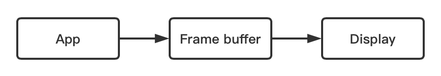
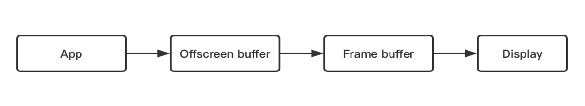
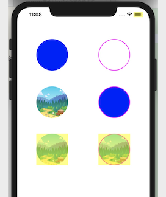
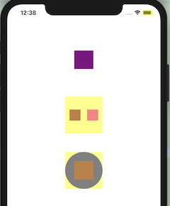
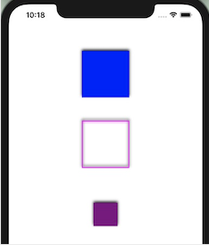
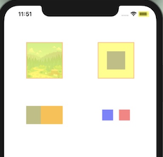
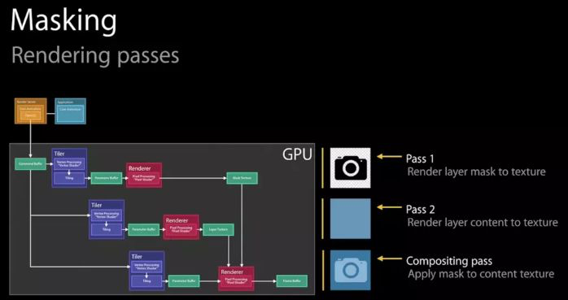
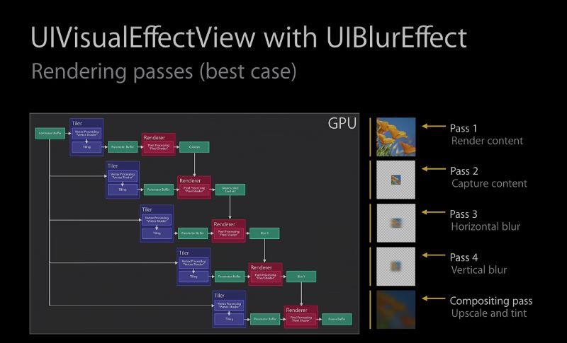

# iOS 离屏渲染

离屏渲染，作为一个高频的iOS面试题，最近在对图形学的接触中，又碰到了，索性今天来次深入剖析，彻底掌握其原理。

### 一、离屏渲染的定义

一般的图像渲染流程中，Core Animation将界面内容分解成一个个图层并存入图层树，GPU遵循”画家算法“由远即近来对图层树中的每一个图层进行渲染，并将渲染结果依次存入 **帧缓存区** （ `Frame Buffer` ）中。



这个过程中，每一层被渲染完并提交到帧缓存区后，图层数据会被清空，所以就需要 **保证单次遍历就能完成每一个图层的渲染** 。但是在有些场景中，由于图层渲染的有序性，一些图层不能被一次性渲染完，后面还需要再回过头来继续渲染，这时候就不能直接将这一层的渲染结果存入帧缓存区，需要另外开辟一块内存空间进行存放，等图层完全渲染后，再将渲染结果存入帧缓存区中。这块新开辟的内存，称为 **离屏缓存区** （ `Offscreen Buffer` ）。

在渲染过程中开辟了离屏缓存区的图形渲染，称为 **离屏渲染** 。



### 二、触发离屏渲染的场景

离屏渲染产生的原因，是因在渲染过程中需要开辟离屏缓存区，来暂存渲染后的图层。iOS中能触发离屏渲染的场景主要有以下几个：

##### 1. cornerRadius + masksToBounds

开发中经常使用 `cornerRadius` 和 `masksToBounds` 这两个方法来设置layer的圆角和裁剪，先来看下这两个方法的定义：

* cornerRadius

绘制图层背景的圆角时使用的半径，当值设置为大于0.0时，会在图层背景上绘制圆角，仅适用于图层的背景颜色和边框，不影响背景图片和子图层。

* masksToBounds

当此属性的值为YES时，Core Animation将创建一个隐式剪贴蒙版，该蒙版与图层的边界匹配并包括圆角效果，所有的子图层都会按照这个蒙版进行裁剪。

要知道，设置 `cornerRadius` 和 `masksToBounds` 不一定会触发离屏渲染，那什么情况下会触发呢？这里直接给出结论： **设置layer的圆角和裁剪后，如果在渲染过程中layer（包含子layer）会被分解成2个及以上的需要被渲染的图层时，就会触发离屏渲染。**

原因猜想（若有误，请指正）：
GPU会先对layer的每个图层遍历渲染，然后再统一裁剪，所以在每一层渲染完后，需要先放入离屏缓存区暂存。

接下来通过对CALayer设置圆角和裁剪的不同案例来验证结论。

1.1 首先通过设置CALayer属性来验证，这里主要设置backgroundColor，边框以及contents属性，下面创建了6个案例来对比分析：

* A：只设置backGroundColor
* B：只设置边框
* C：只设置contents
* D：同时设置backgroundColor + 边框
* E：同时设置background + contents
* F：同时设置边框 + contents

```
注：代码太长，只附上主要步骤。且各layer除了设置属性外，还设置了圆角和裁剪。

//A：只设置backGroundColor
layerA.backgroundColor = [UIColor blueColor].CGColor;

//B：只设置边框
layerB.borderColor = [UIColor magentaColor].CGColor;
layerB.borderWidth = 2.f;

//C：只设置contents
layerC.contents = (__bridge id _Nullable)([UIImage imageNamed:@"screen"].CGImage);

//D：同时设置backgroundColor + 边框
layerD.backgroundColor = [UIColor blueColor].CGColor;
layerD.borderColor = [UIColor magentaColor].CGColor;
layerD.borderWidth = 2.f;

//E：同时设置background + contents
layerE.backgroundColor = [UIColor blueColor].CGColor;
layerE.contents = (__bridge id _Nullable)([UIImage imageNamed:@"screen"].CGImage);

//F：同时设置边框 + contents
layerF.borderColor = [UIColor magentaColor].CGColor;
layerF.borderWidth = 2.f;
layerF.contents = (__bridge id _Nullable)([UIImage imageNamed:@"screen"].CGImage);
```

打开模拟器的离屏渲染调试（Debug --> Color Off-Screen Rendered），看到结果如下图（黄色表示已触发离屏渲染）：



从结果可以看到，上述6个案例中，只有E、F触发了离屏渲染，其余4个均未触发。分析原因：

A、B、C案例：单独设置backgroundColor、边框或contents后，layer只被分解生成了一个需要渲染的图层（backgroundColor/边框 对应于背景图层，contents对应于内容图层），在图层被渲染完后不需要暂存，可以直接裁剪，所以不触发离屏渲染。

D、E、F案例：因为backgroundColor和边框都是作用于背景图层的，所以D案例只生成一个背景图层，不需要暂存，所以不触发。而同时设置了backgroundColor和contents，或同时设置边框和contents，会生成两个需要被渲染的图层--背景图层和内容图层，这时候就需要暂存到离屏缓存区，等待后面统一裁剪。

1.2 通过添加子layer来验证，这里也创建了三个案例对比验证：

* G：只添加一个子layer
* H：添加两个子layer
* I：设置backgroundColor + 添加一个子layer

```
注：代码太长，只附上主要步骤。父layer设置了圆角和裁剪，子layer没有进行代码外的设置。

//G：只添加一个子layer
subG.backgroundColor = [UIColor  purpleColor].CGColor;
[layerG addSublayer:subG];

//H：添加两个子layer
subH1.backgroundColor = [UIColor  purpleColor].CGColor;
[layerH addSublayer:subH1];
subH2.backgroundColor = [UIColor  magentaColor].CGColor;
[layerH addSublayer:subH2];

//I：设置一个属性 + 添加一个子layer
layerI.backgroundColor = [UIColor blueColor].CGColor;
subI.backgroundColor = [UIColor  purpleColor].CGColor;
[layerI addSublayer:subI];
```

结果如下图所示：



从结果得知，只有G案例没触发离屏渲染，原因和之前一样，G案例由于父layer没有进行任何可视化设置，因此只生成了一个子layer的背景图层，不需要暂存，所以没触发。H案例两个子layer的背景图层都需要渲染，需要暂存，I案例父layer和子layer的背景图层都需要渲染，也需要暂存，所以H案例和I案例都触发了离屏渲染。

##### Shadow

先创建三个案例来展示给layer设置阴影的效果：

* A：只设置backGroundColor
* B：只设置边框
* C：添加一个子layer

```
注：代码太长，只附上主要步骤，layer的shadowColor设置为黑色。

//A：只设置backgroundColor
layerA.backgroundColor = [UIColor blueColor].CGColor;

//B：只设置边框
layerB.borderColor = [UIColor magentaColor].CGColor;
layerB.borderWidth = 2.f;

//I：添加一个子layer
subLayer.backgroundColor = [UIColor  purpleColor].CGColor;
[layerC addSublayer:subLayer];
```

阴影效果如下：



从案例效果可得知，阴影是作用在layer（包括子layer）所有内容的”非透明区域“。打开模拟器的离屏渲染调试，可以看到这三个案例都触发了离屏渲染：


因为阴影是在layer所有子图层的最下方，根据画家算法最先被渲染，但阴影效果是作用于layer的非透明区域，所以需要先暂存，等渲染完所有子图层后，再回过头来绘制阴影效果。

##### group opacity

组透明， 当layer（包含子layer）被分解生成的所有渲染图层中存在叠加的情况，此时设置layer的opacity值在（0, 1）之间，就会触发离屏渲染。这里也创建4个案例进行验证：

* A：设置layer的边框和contents
* B：设置layer的边框，再添加一个有背景色的子layer
* C：在layer添加两个有部分区域重合的子layer
* D：在layer上添加两个不重合的的子layer

```
注：代码太长，只附上主要步骤，layer的opacity设置为0.5。

//A：设置layer的边框和contents
layerA.borderColor = [UIColor magentaColor].CGColor;
layerA.borderWidth = 2.f;
layerA.contents = (__bridge id _Nullable)([UIImage imageNamed:@"screen"].CGImage);

//B：设置父layer的边框，添加一个有背景色的子layer
layerB.borderColor = [UIColor magentaColor].CGColor;
layerB.borderWidth = 2.f;
subB.backgroundColor = [UIColor blueColor].CGColor;
[layerB addSublayer:subB];

//C：添加两个有部分区域重合的子layer
subC1.backgroundColor = [UIColor  blueColor].CGColor;
[layerC addSublayer:subC1];
subC2.backgroundColor = [UIColor  redColor].CGColor;
[layerC addSublayer:subC2];

//D：添加两个不重合的的子layer
subD1.backgroundColor = [UIColor  blueColor].CGColor;
[layerD addSublayer:subD1];
subD2.backgroundColor = [UIColor  redColor].CGColor;
[layerD addSublayer:subD2];
```

离屏渲染结果如下图所示：



从结果可知，只有D案例没有触发离屏渲染，因为A、B、C三个案例都存在渲染图层的叠加，A是背景图层和内容图层叠加，B是背景图层和子layer的图层叠加，C是两个子layer图层的叠加。

这是因为在一般情况下，设置了layer的opacity后，透明度会作用于每一个图层，在渲染过程中会遍历完成每一层的透明度设置。但当打开了layer的组透明后，如果 **当layer的各图层中存在图层叠加的情况** ，渲染过程中会先将所有图层渲染完后，再整体设置透明度，这就需要暂存，所以会触发离屏渲染。从iOS7开始，group opacity会默认打开，可以通过设置 `allowsGroupOpacity = NO` 来手动关闭，可以看看对于C案例打开

##### mask

遮罩，mask是应用在layer和其所有子layer的组合之上的，触发离屏渲染的原因也是一样，需要先渲染完所有图层，再进行处理，所以需要暂存。



##### UIBlurEffect

毛玻璃效果，同样无法通过一次遍历完成渲染，他需要多次对content进行处理，需要暂存，因此会触发离屏渲染。



##### shouldRasterize

由于离屏缓存区在渲染过程中具有暂存功能，所以除上述特定场景外，如果有些开发场景需要主动使用，比如 **想让某个layer的渲染结果可以在下一帧继续被使用** ，则可以通过设置layer的 `shouldRasterize = YES` 来触发。shouldRasterize是Apple提供给开发者用来主动触发离屏渲染的属性，在使用中需要注意以下几点：

1. 如果layer不需要被复用，就没必要打开光栅化。
2. 如果layer不是静态的，需要被频繁修改，比如处于动画之中，也没必要打开，因为这样layer的渲染结果不能被复用，每一帧都要重新渲染。
3. 离屏渲染缓存区内容有时间限制，在100ms时间内如果没被使用，就会被丢弃。
4. 离屏渲染缓存空间有限，不能超过屏幕总像素的2.5倍大小，否则会失效。

### 三、离屏渲染的优缺点

* 缺点

	1. 需要额外开辟新的离屏缓存区，占用GPU内存空间。
	2. 需要频繁切换上下文环境，会对性能造成很大影响。在界面内容的渲染中，有的layer可以一次渲染完存入帧缓存区中，有的layer会触发离屏渲染，需要先暂存到离屏缓存区，渲染完后再存入帧缓存区，在这个过程中，就需要频繁切换 frame buffer 和 offscreen buffer 的上下文环境。

* 优点
* 在渲染过程中提供图层暂存功能，可以满足一些特定开发场景。

### 四、总结

在layer的渲染过程中，若无法通过一次遍历完成所有图层的渲染，就会触发离屏渲染。本质是在渲染过程中开辟了一些新的离屏缓存区（Offscreen buffer），来暂时储存这些图层。离屏渲染对性能造成很大开销，开发中应尽量避免，但在有些场景下，如果需要复用layer的渲染结果，可以通过打开layer的 `shouldRasterize` 来主动触发。

参考：
[关于iOS离屏渲染的深入研究](https://links.jianshu.com/go?to=https%3A%2F%2Fzhuanlan.zhihu.com%2Fp%2F72653360)

扩展阅读：
[iOS 图形渲染流程](https://www.jianshu.com/p/cfb08dc42a4e)

[iOS 离屏渲染](https://www.jianshu.com/p/7f4dd757dc5f)