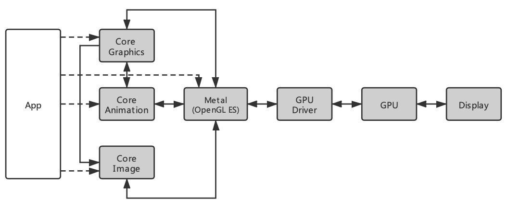

# iOS 图形渲染流程

`iOS` 开发中，经常创建很多视图控件来进行界面布局，那这些视图控件是怎么显示到屏幕上的呢？其实在设置了 UIView 的相关属性后，是经过了一个 **图形渲染** 流程，才最终可以在屏幕上成像。本文主要介绍两部分内容：

* 介绍 `iOS` 相关图形渲染框架。
* 详述 `Core Animation Pipeline` 的工作原理。

#### 一、图形渲染技术栈

下图所示为iOS图形渲染技术栈，App使用 `Core Grapics`、`Core Animation`、`Core Image` 等框架来绘制可视化内容。这些框架需要通过 `Metal` （iOS12之前是通过 `OpenGL ES` ）来调用GPU进行绘制，最后将绘制好的内容显示在屏幕上。

先来简单认识下这些渲染框架：

* UIKit

`UIKit` 是iOS的基础视图框架，可以用来构建和管理界面可视化内容，响应用户交互事件。

`UIKit` 自身并不具备在屏幕成像的能力，其主要负责 **对用户交互事件的响应** （后面有时间再补一篇事件的传递和响应）。

`UIKit` 中的每一个视图控件内部都有一个关联的 CALayer（后面有时间补一篇UIView和CALayer的联系），对视图控件的任何布局设置，本质上都是对其关联的CALayer进行操作。CALayer是App界面可视化内容的载体。

`UIKit` 只支持iOS。

* Core Aniamtion

`Core Animation` 在开发中经常被用来实现动画效果，本质上是一个复合引擎，主要功能包含： **渲染**、**构建** 和 **实现动画** 。它的职责是尽可能快地组合屏幕上不同的可视内容，这个组合过程是将这些内容分解成一个个独立的图层，并存储在一个叫做 **图层树** 的体系之中。和UIKit不同，Core Animation是直接作用于CALayer的。

`Core Animation` 支持iOS和macOS。

* Core Graphics

`Core Graphics` 是一个基于 `Quartz 2D` 的高级绘图引擎，提供大量的 **低层次**、**轻量级** 的2D渲染API。可以用来处理基于路径的绘图，转换，颜色管理，离屏渲染，图案，渐变和阴影，图像数据管理，图像创建，图像遮罩以及PDF文档的生成和解析。

`Core Graphics` 支持iOS和macOS，在Mac OS X中，Core Graphics 还包括用于处理显示硬件，低级用户输入事件和窗口系统的服务。

* Core Graphics

`Core Image` 是iOS5中引入的一个图片处理框架，里面提供了很多强大高效的图像处理功能。Core Image 可以用来十分轻松地实现 **滤镜** 以及 **图像识别** 等功能。

* OpenGL ES

`OpenGL ES` （OpenGL for Embedded Systems），是OpenGL三维图形API的⼦集，针对⼿机、Pad和游戏主机等嵌⼊式设备⽽设计，去除了许多不必要和性能较低的API接⼝。在 Metal 推出之前，iOS相关渲染框架都是基于 OpenGL ES 的。

* Metal

`Metal` 是Apple在WWDC 2014上为游戏开发者推出的新技术框架 ，只支持Apple相关平台。和OpenGL相比，Metal 能够为3D图像提高10倍的渲染性能。从iOS12开始，渲染框架底层都是基于 Metal 实现的。

* GPU

`GPU` （Graphics Processing Unit），是一种可进行绘图、运算的专用微处理器，它的 **高度并行结构** 使其在大块数据并行处理的算法中比通用 CPU 更有效。

#### 二、Core Animation Pipeline

前面提到过，对UIKit中视图控件的任何布局设置，本质上都是对其关联的CALayer进行操作，而对CALayer的属性设置都是通过在图层的内容或几何图形上启动不同的动画来进行的（即通过Core Animation来完成）。

因此，屏幕上的可视内容都是需要先经过Core Animation分解成不同的图层并生成图层树， 然后再对这些图层树进行渲染，最终显示到屏幕上，这个过程被称为 `Core Animation Pipeline` （Core Animation流水线）。

上图描绘了 `Core Animation` 流水线的大概流程：App处理完事件，由Core Animation将渲染任务及相关数据提交给Render Server。Render Server生成渲染指令后，再调用GPU渲染，最后由iOS的图像设备进行显示。

接下来，详细介绍 `Core Animation` 流水线中每个阶段负责处理的任务：

##### 1. Application

在这个阶段，App响应用户事件后（如点击操作、滑动列表等），若需要更新界面内容，会通过 `CPU` 完成对显示内容的计算，如：布局计算、图片解码、图像绘制等。在完成对显示内容的计算之后，App将间接通过 `UIKit` 或直接通过 `Core Animation` 来更新 **图层树** ，最后将图层编码后的数据提交给 `Render Server` 。主要经历了下面两个步骤：

###### 1.1 Handle Events

App响应事件，并进行处理。

###### 1.2 Commit Transaction

这个阶段细分成下面4步：

* Layout

构建视图，包括： `layoutSubviews` 方法的重载， `addSubview`: 方法填充子视图等。CPU在这里完成 **视图布局** 的相关计算。

* Display

绘制视图，本质是绘制位图，设置最终成像的图元数据。重载 `drawRect` 方法可以完成自定义视图的绘制。CPU在这里完成 **图像绘制** 的相关计算。

* Prepare

这个步骤会做一些额外的 `Core Animation` 工作，比如 **图像解码** 和 **图像转换** 。CPU会在这里对View里的图片进行解码，若CPU不支持该图片格式，则会先进行图像转换，再解码。

* Commit

将图层进行编码打包，并提交给 `Render Server` 。由于图层是以树的结构存在，所以打包操作会递归执行。

##### 2. Render Server

`Render Server` ，即 **渲染服务器** ，主要完成两个任务：

* Decode

解码，将传入的图层信息进行解析并反序列化成 **渲染树** （ `render tree` )。

* Draw Calls

根据渲染树中图层的相关设置属性来生成相应的渲染指令( `Metal` 或 `OpenGL ES` )，并将渲染相关信息传给GPU。

##### 3. GPU

`GPU` 接收到 `Render Server` 传来的渲染信息后，会在收到显示器发送新的 `VSync` 信号后才进行渲染，并将渲染结果输出到帧缓冲区（即显存）。

##### 4. Display

在接受到显示器发出的新的 `VSync` 信号后， **视频控制器** 会逐行读取帧缓冲区中的数据，再经过一定的数模转换传递给显示器显示。这个阶段的详情步骤可阅读 [iOS 屏幕图像显示原理](https://www.jianshu.com/p/91d5cf01187c) 。

#### 三、总结

综上可知，App界面内容显示到屏幕上的流程如下：

1. `App` 响应交互事件，如：用户的点击操作，需要更新界面布局。
2. `App` 通过 `CPU` 完成对显示内容的计算，如：布局计算、图片解码、图像绘制等。在完成计算后，App更新图层树，并将图层树进行编码打包，然后将数据提交给 `Render Server` 。
3. `Render Server` 将图层数据解码后，生成相应的渲染指令，然后将渲染信息传给 `GPU` 。
4. `GPU` 完成渲染后会将渲染结果存入帧缓存区，再由视频控制器逐行读取数据，经由数模转换后将图像显示在屏幕上。

#### 参考

[1. iOS 图像渲染原理](https://links.jianshu.com/go?to=http%3A%2F%2Fchuquan.me%2F2018%2F09%2F25%2Fios-graphics-render-principle%2F)
[2. 深入理解 iOS Rendering Process](https://links.jianshu.com/go?to=https%3A%2F%2Flision.me%2Fios-rendering-process%2F)
[3. Getting Pixels onto the Screen](https://links.jianshu.com/go?to=https%3A%2F%2Fwww.objc.io%2Fissues%2F3-views%2Fmoving-pixels-onto-the-screen%2F) ， [中文版（iOS 开发：绘制像素到屏幕）](https://links.jianshu.com/go?to=https%3A%2F%2Fsegmentfault.com%2Fa%2F1190000000390012)
[4. Core Animation Programming Guide](https://links.jianshu.com/go?to=https%3A%2F%2Fdeveloper.apple.com%2Flibrary%2Farchive%2Fdocumentation%2FCocoa%2FConceptual%2FCoreAnimation_guide%2FCoreAnimationBasics%2FCoreAnimationBasics.html%23%2F%2Fapple_ref%2Fdoc%2Fuid%2FTP40004514-CH2-SW20)

#### 扩展阅读

[iOS 屏幕图像显示原理](https://www.jianshu.com/p/91d5cf01187c) 。

[iOS 图形渲染流程](https://www.jianshu.com/p/cfb08dc42a4e)