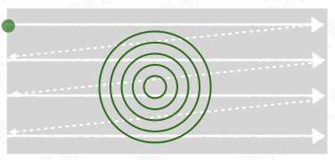
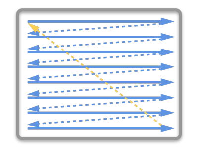
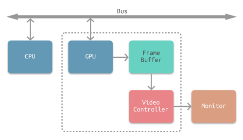
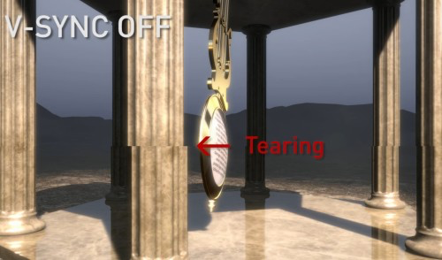
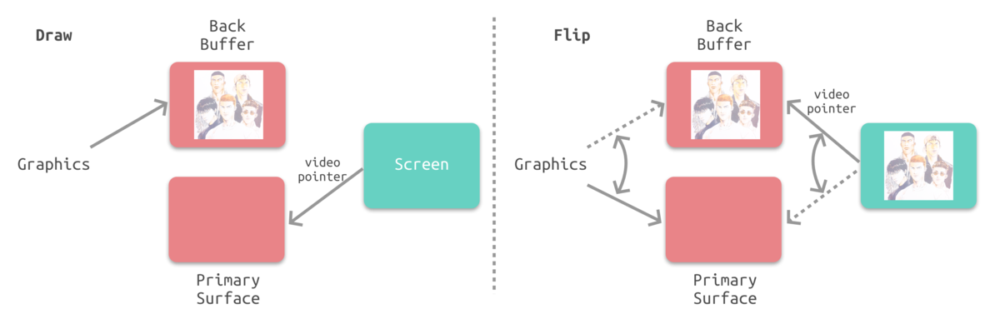
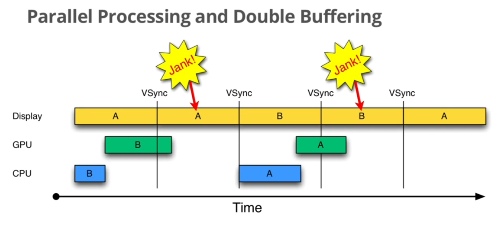
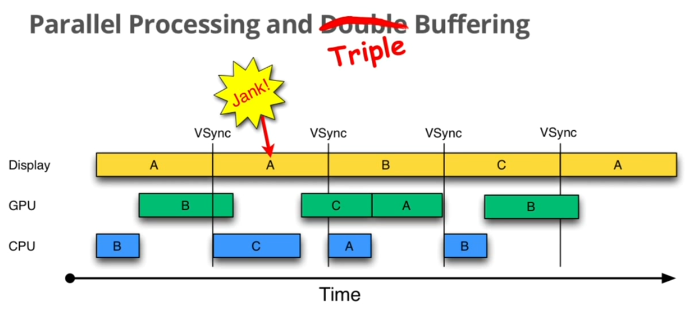

# iOS 屏幕图像显示原理

在 [图形渲染流程](https://www.jianshu.com/p/cfb08dc42a4e) 一文中可知，GPU完成渲染后会将渲染结果提交到帧缓存区，再由视频控制器逐行读取数据，然后经由数模转换后将图像显示在屏幕上。在这个过程中，iOS设备具体是怎么操作的呢？接下来会详细介绍iOS场景下屏幕图像的显示原理，文章主要包括以下几个部分：

* 显示器原理
* CPU，GPU以及显示器的协作方式
* iOS屏幕显示机制

#### 一、显示器原理

先了解一下显示器的刷新原理，目前显示器大体分为 **CRT显示器** 和 **液晶显示器** 这两个种类。

##### 1. CRT显示器

CRT显示器是靠电子束激发屏幕内的荧光粉来显示图像的，屏幕上的每个像素里都有红绿蓝三种颜色的荧光粉，通过电压驱动电子枪发射三束电子束，分别轰击在像素里的三种颜色荧光粉上，通过调节电压大小来改变荧光粉的明暗，通过调节电压方向来改变电子束击打屏幕的位置，从而显示出完成的图像。

电子枪的扫描方式分为 **随机扫描方式** 和 **光栅扫描方式** 。早期的CRT显示器都是随机扫描方式，不过现在基本都是光栅扫描方式。

* 随机扫描方式如下图所示，电子束的移动方式是随机的，按照显示命令用画线的方式绘出图形。

* 光栅扫描方式入下图所示，是从上至下逐行扫描整个屏幕的。

##### 2. 液晶显示器

液晶是一种介于固体和液体之间的特殊物质，常态下呈液态，光线可以顺利透过。给液晶通电，会改变它的分子排列，再配合偏振光片，就可以改变它的透光性。

液晶显示器的工作原理就是通过改变加给液晶单元的电压，改变液晶单元的透光性，再配合滤光片，就可以在屏幕上显示画面。

现在基本以液晶显示器为主，苹果设备也都是液晶显示屏。两种显示器的工作原理虽不同，但是屏幕画面刷新一致的，都是从上到下逐行刷新的。

##### 3.显示器屏幕刷新原理。

液晶显示器和CRT显示器的屏幕显示原理差不多，下面以CRT显示器的扫描过程来介绍（没办法，液晶的资料太难找...orz）。

如图所示，CRT 的电子枪从上到下逐行扫描，扫描完成后显示器就呈现一帧画面，随后电子枪回到初始位置继续下一次扫描。为了把显示器的显示过程和系统的视频控制器进行同步，显示器（或者其他硬件）会用 **硬件时钟** 产生一系列的定时信号。

* HSync：当电子枪换到新的一行，准备进行扫描时，显示器会发出一个水平同步信号，简称 `HSync` （horizonal synchronization）。
* VSync：当一帧画面绘制完成后，电子枪回复到原位，准备画下一帧前，显示器会发出一个垂直同步信号，简称 `VSync` （vertical synchronization）。

显示器通常以“固定频率“进行刷新，这个刷新率就是 `VSync` 信号产生的频率。
iOS设备的屏幕刷新频率是每秒60帧，平均每16.67ms发出一个 `VSync` 。

#### 二、CPU，GPU以及显示器的协作方式

从图形渲染流程一文中可知，CPU、GPU、显示器是以下图这种方式协同工作的。CPU 计算好显示内容提交到 GPU，GPU 渲染完成后将渲染结果放入帧缓冲区，视频控制器收到 `VSync` 信号后逐行读取帧缓冲区的数据，再经过一定的数模转换传递给显示器显示。

如果这个过程中只有一个缓冲区且没有引入 `VSync` ，不仅在帧缓冲区的读取和刷新上有比较大的效率问题，还会在屏幕画面呈现上出问题。先来介绍两个概念：

* 屏幕刷新频率： `Refresh Rate` 或 `Scanning Frequency` ，单位hz，是指设备刷新屏幕的频率。
* 帧率： `Frame Rate` ，单位 fps，是指 GPU 生成帧的速率。

单缓存，GPU 向缓存区中写入数据，视频控制器从缓存区中取图像数据后显示，理想的情况是帧率和屏幕刷新频率相等，每绘制一帧，屏幕就显示一帧。而实际情况是，如果没有同步机制，当帧率大于屏幕刷新频率时，视屏控制器刚逐行读取完第2帧的上半部分时，GPU 已经完成第3帧的渲染并提交到缓存区中，视屏控制器会继续读取第三帧的下半部，这样会造成画面撕裂。

为了解决单缓存的效率问题以及画面撕裂问题，一般会引入 `双缓存区` 和 `VSync` 。

#### 三、iOS屏幕刷新机制

为了解决单缓存区的问题，iOS设备在这个过程中采取了如下图所示的 **双缓存区+VSync** 机制：

1. GPU 会预先渲染好一帧放入一个缓存区内（前帧缓存）。
2. 在显示器发出 `VSync` 后，视频控制器的指针会指向前帧缓存区并开始读取，GPU开始渲染下一帧，并将渲染结果放入另一个缓存区（后帧缓存）。
3. 在显示器发出新的 `VSync` 后，视频控制器的指针会指向后帧缓存区并开始读取，GPU开始渲染下一帧，并将渲染结果放入前帧缓存区。

* 双缓存和VSync造成的问题

由上文可知，每一帧画面要先经过CPU计算，再经过GPU渲染，最后存入缓存区供视频控制器读取。由于垂直同步的机制，如果在一个 `VSync` 时间内，CPU 或者 GPU 没有完成内容提交，则那一帧就会被丢弃，而这时显示屏会保留之前的内容不变，也就造成界面卡顿。如下图所示，A、B代表两个缓存区。

* 三缓存

为了降低双缓存造成界面卡顿的几率，有些设备（如安卓设备）会引入三缓存+VSync机制，但iOS设备一直都是双缓存+垂直同步机制。

如上图所示，三缓存区的工作原理同双缓冲类似，只是多了一个 Back Buffer（图中的缓存区C）。三缓存区只是能降低界面卡顿的几率，并不能解决这个问题。

### 参考

[1. iOS 保持界面流畅的技巧](https://links.jianshu.com/go?to=https%3A%2F%2Fblog.ibireme.com%2F2015%2F11%2F12%2Fsmooth_user_interfaces_for_ios%2F)
[2. 计算机那些事(8)——图形图像渲染原理](https://links.jianshu.com/go?to=http%3A%2F%2Fchuquan.me%2F2018%2F08%2F26%2Fgraphics-rending-principle-gpu%2F)

### 扩展阅读

[iOS 图形渲染流程](https://www.jianshu.com/p/cfb08dc42a4e)

[iOS 屏幕图像显示原理](https://www.jianshu.com/p/91d5cf01187c)