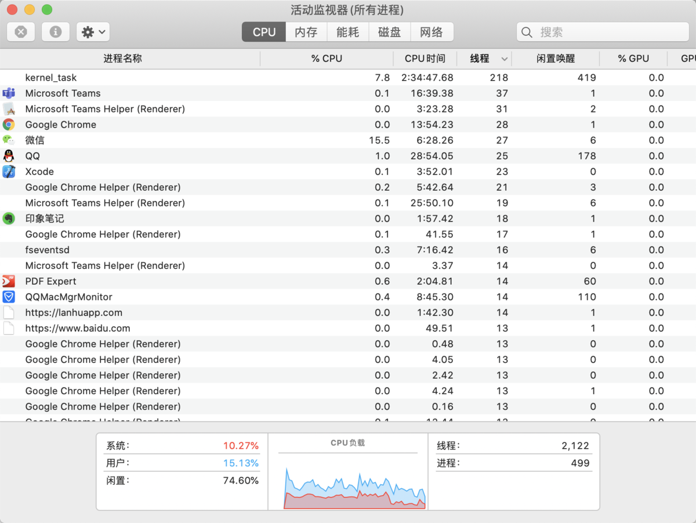
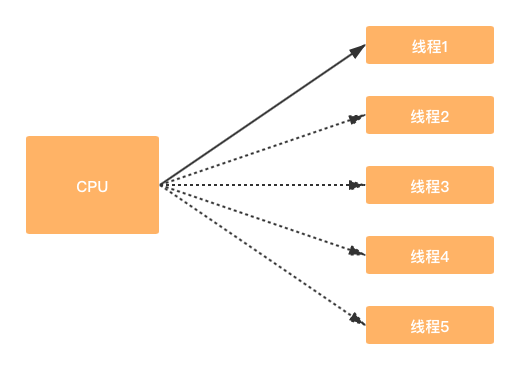
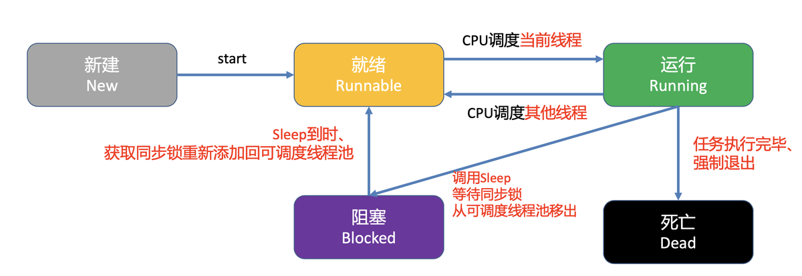
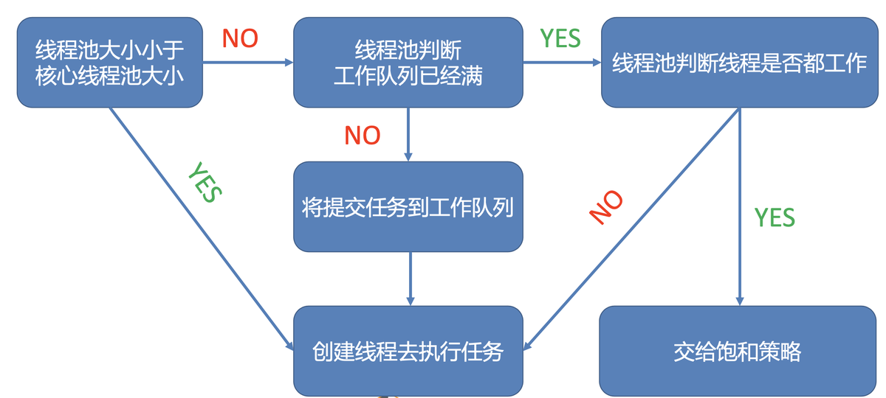
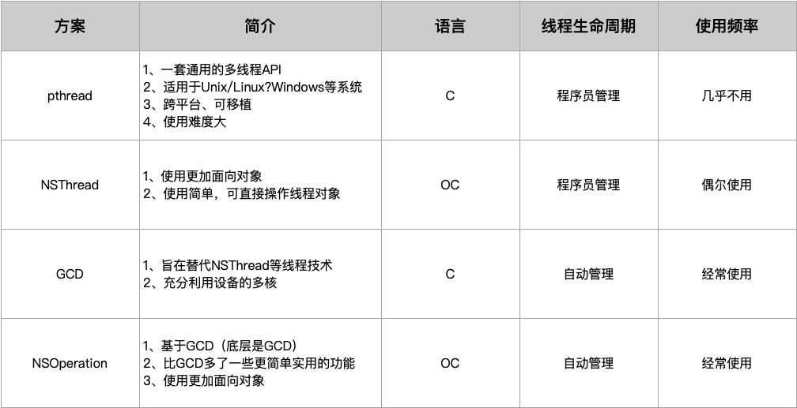
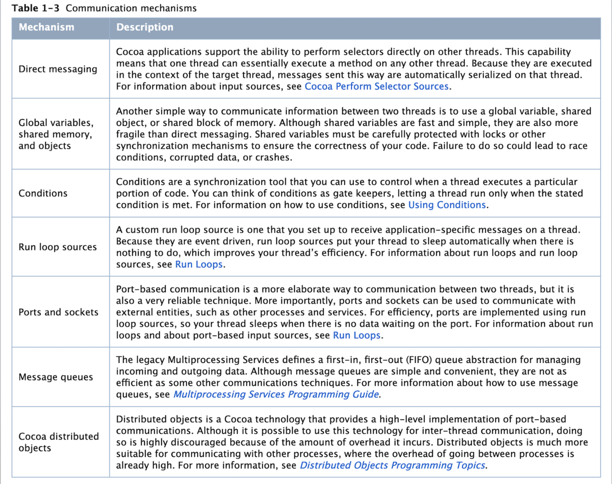

# 多线程的作用和原理

在iOS开发中，经常使用多线程来处理一些耗时任务，在学习多线程的实际运用前，需要先了解 `线程`、`进程` 以及 `多线程` 的原理和概念

## 一、线程和进程

### 1. 进程

* iOS开发是单进程的，所以一般来说， 一个应用程序就是一个进程 。
* 进程之间是相互独立的，每个进程都有独立的内存空间和资源。
* ⼀个进程崩溃后，在保护模式下不会对其他进程产⽣影响。

### 2. 线程

* 线程是进程的基本执⾏单元，进程的所有任务都必须在线程中执⾏。
* 一个进程⾄少要有⼀条线程，程序启动会默认开启⼀条线程，这条线程被称为主线程或UI线程。
* 线程没有自己的内存空间，同⼀进程的线程共享本进程的地址空间和资源。
* 线程不能独⽴执⾏，必须依存在进程中，⼀个线程崩溃整个进程都会死掉。

### 3. Mac上的进程和线程示例

如下图所示，在Mac上，通过“活动监视器”可以查看系统中所开启的所有进程，以及每个进程中运行的线程数。可以看到，每个应用程序都是一个进程，每个进程中会含有多条线程。



### 4. 线程和Runloop的关系

* **Rrunloop与线程是⼀⼀对应的** ，⼀个Runloop对应⼀个核⼼的线程，为什么说是核⼼的，是因为Runloop是可以嵌套的，但是核⼼的只能有⼀个，他们的关系保存在⼀个全局的字典⾥。
* **Runloop是来管理线程的** ，当线程的Runloop被开启后，线程会在执⾏完任务后进⼊休眠状态，有了任务就会被唤醒去执⾏任务。
* Runloop在第⼀次获取时被创建，在线程结束时被销毁。
* 对于主线程来说，Runloop在程序⼀启动就默认创建好了。
* 对于⼦线程来说，Runloop是懒加载的，只有当我们使⽤的时候才会创建，所以在⼦线程⽤定时器要注意：确保⼦线程的Runloop被创建，不然定时器不会回调。

## 二、多线程

### 1. 多线程的作用

进程的任务必须要在线程中执行，程序启动后，所有任务会默认在主线程中执行。如果某个任务比较耗时，就会阻塞主线程，导致程序卡顿，这时就需要再创建一个子线程来处理这个耗时任务，来缓解主线程的压力。相比单线程，多线程的优缺点如下：

> **优点** 
> 1. 能适当提⾼程序的执⾏效率； 
> 2. 能适当提⾼资源的利⽤率（CPU，内存）；  
> 3. 线程上的任务执⾏完成后，线程会⾃动销毁。  
> 
> **缺点** 
> 1. 开启线程需要占⽤⼀定的内存空间（默认情况下，每⼀个线程都占 512 KB），线程越多，占⽤的内存空间越大，程序性能就越低。 
> 2. 任务需要由CPU调度线程来执行，线程越多，CPU 在调⽤线程上的开销就越⼤，每个线程被调度的次数会降低，线程的执⾏效率也会降低。  
> 3. 程序设计更加复杂，⽐如线程间的通信、多线程的数据共享。  

### 2. 多线程的原理

**一个进程的全部任务，是需要通过CPU调度线程来进行处理的** 。当进程中存在多个线程时，CPU会在极短的时间间隔内快速调度不同的线程来处理这些任务，这个时间间隔也被称为『 **时间片** 』。

CPU分为『 **单核CPU** 』和『 **多核CPU** 』，它们调度线程的能力也有所不同：

* `单核CPU` ：同⼀时间，CPU 只能调度1个线程。
* `多核CPU` ：同一时间，CPU可以调度多个线程。

虽然这些线程实际上并不是同时执行，但由于CPU调度线程的时间足够快，也就造成了多线程”同时“执⾏的效果。



### 3. 多线程的生命周期

多线程的生命周期分为5个状态： `新建` ， `就绪` ， `运行` ， `阻塞` ， `死亡` ，流程如下图所示：



* `新建` ：创建一个线程。
* `就绪` ：线程创建后，调用 `start` 方法，就会被添加到『 **可调度线程池** 』，等待CPU调度，此时为 `就绪` 状态（Runnable）。
* `运行` ：线程被CPU调度后，会被移出『 **可调度线程池** 』，成为 `运行` 状态（Running）。
* `阻塞` ：线程变为运行状态后，可能会遇到一些情况比如： `线程sleep、同步锁` ，导致不能立即执行，变为 `阻塞` 状态。此时线程会休眠（互斥锁会休眠，自旋锁会忙等轮询），等到同步锁或者线程sleep结束后，会再被添加回『 **可调度线程池** 』，又变为 `就绪` 状态。
* `死亡` ：线程变为运行状态后，若没有遇到同步锁或线程sleep，就被立即执行，执行完后，线程结束，会被销毁，即成为 `死亡` 状态。如果线程被提前终止执行，比如调用 `exit` 方法退出执行，也会被销毁变为 `死亡` 状态。

### 4. 线程池原理



线程池的处理逻辑如图所示，先来认识三个概念：

* `corePoolSize` ：核心线程池大小，即线程池的基本大小。
* `maximumPool` ：线程池的最大大小。
* `keepAliveTime` ：线程池中超过 `corePoolSize` 数目的空闲线程的最大存活时间。

当一个新任务到来时，线程池的处理逻辑如下：

* **step1：判断当前线程池大小是否小于核心线程池大小** 。
  * `Yes` ：创建线程去执行任务。
  * `No` ：进入step2。

* **step2：判断线程池工作队列是否已满** 。
  * `Yes` ：进入step3。
  * `No` ：提交任务到工作队列，等待CPU调度线程执行。

* **step3：判断线程池中的线程数是否小于最大数量** 。
  * `Yes` ：创建新的线程来执行任务。
  * `No` ：进入step4。

* **step4：交给`饱和策略` 处理** ，主要有以下四种处理方案：
	* `AbortPolicy` ：直接抛出 `RejectedExecutionExeception` 异常来阻⽌系统正常运⾏。
	* `CallerRunsPolicy` ：将任务回退到调⽤者。
	* `DisOldestPolicy` ：丢掉等待最久的任务。
	* `DisCardPolicy` ：直接丢弃任务。

### 5. 线程安全问题

线程共享进程的地址空间和资源，因此当多个线程同时访问一块资源时，容易引发数据安全问题。为了保证多线程的数据读写安全，一般会对线程进行加锁处理，分为『 **互斥锁** 』和『 **自旋锁** 』两种。这两种锁均能 **保证锁内的代码，同⼀时间，只有⼀条线程能够执⾏** 。

#### 互斥锁

* 当线程遇到互斥锁时，会变为 **休眠** 状态，等锁里的线程执行完，才会被唤醒然后添加到『 **可调度线程池** 』，再等待CPU调动执行。
* 互斥锁有这几种： `@synchronized`, `NSLock`, `pthread_mutex`, `NSConditionLock`, `NSCondition`, `NSRecursiveLock` 。

#### 自旋锁

* 当线程遇到自旋锁时，不会休眠，会变为 **忙等待（busy waiting）** 的状态，并轮询检查锁是否可用，等锁里的线程执行完任务，会立即开始执行。
* 自旋锁有这几种： `atomic`, `OSSpinLock`, `dispatch_semaphore_t` 。

> 一般来说，当锁里的任务能较短时间处理完，使用自旋锁性能更好。反之，使用互斥锁。  

#### atomic & nonatomic

`atomic` 和 `nonatomic` 都是用来修斯属性的， `atomic` 表示原子属性， `nonatomic` 表示非原子属性，它们的区别在于：

* `atomic` 针对多线程设计的，实际是在属性的 `setter` 方法里加了一个自旋锁，保证同⼀时间只有⼀个线程能够写⼊，使其修饰的属性只能多读单写。虽然能保证线程安全，但需要消耗大量的资源。
* `nonatomic` 修饰的属性是可以多读多写的，不保证线程安全，但效率高。
* 在iOS开发中，属性默认是 `atomic` 修饰的，但是建议都声明为 `nonatomic` ，因为效率相差近10倍。

## 三、多线程的实现方案

在iOS中，多线程实现方式主要有这四种： `pthread`、`NSThread`、`GCD`、`NSOperation` ，如图所示：



由于 `pthread` 现在已几乎不用了，这里就只介绍另外三种方案的用法了。下面是对一个耗时任务分别以单线程和多线程处理来作示例：

### 耗时任务阻塞主线程

```
- (void)viewDidLoad {
    [super viewDidLoad];

    // Do any additional setup after loading the view.
    
    //task1
    NSLog(@" ==== task1");
    
    //task2
    [self threadTest];
    
    //task3
    NSLog(@" ==== task3");
}

//耗时任务
- (void)threadTest{
  
    NSLog(@" ==== begin task2");
    NSInteger count = 50000;
    for (NSInteger i = 0; i < count; i++) {

        NSInteger num = I;
        NSLog(@" ==== num = %ld", num);
    }
    NSLog(@" ==== end task2");
}

//打印结果
2020-11-05 16:10:40.577616+0800 Test[71508:23639447]  ==== task1
2020-11-05 16:10:40.577703+0800 Test[71508:23639447]  ==== begin task2
2020-11-05 16:10:48.117782+0800 Test[71508:23639447]  ==== end task2
2020-11-05 16:10:48.117894+0800 Test[71508:23639447]  ==== task3
```

这个例子中，主线程中有task1、task2、task3这三个任务需要执行（这里暂把task2当成一个任务），其中task2是个耗时任务，需要执行8s，而task3其实并不依赖task2的执行结果，但还是需要等待task2结束后才开始执行，所以对于task3来说，task2造成了线程阻塞。像这种情况，完全可以创建一个子线程来执行task2，这样主线程可以立即执行task3，不用再耗时等待了。

### 多线程处理任务

```
//分别用三种方式创建子线程来处理task2
 -(void)performThreadTest{
    
    //1.NSThread
    [NSThread detachNewThreadSelector:@selector(threadTest) toTarget:self withObject:nil];
    
    //2.GCD
    dispatch_async(dispatch_get_global_queue(0, 0), ^{

        [self threadTest];
    });

    //3.NSOperation
    [[[NSOperationQueue alloc] init] addOperationWithBlock:^{
        
        [self threadTest];
    }];
}

//打印结果
2020-11-05 16:12:03.541448+0800 Test[71597:23651072]  ==== task1
2020-11-05 16:12:03.541570+0800 Test[71597:23651072]  ==== task3
2020-11-05 16:12:03.545564+0800 Test[71597:23651434]  ==== begin task2
2020-11-05 16:12:12.445006+0800 Test[71597:23651434]  ==== end task2
```

从打印结果可知，在子线程中执行task2，这样主线程就不会被阻塞，可以立即执行task3。所以， **当进程中存在耗时任务时，创建子线程来执行这个耗时任务，可以缓解主线程的压力，防止线程被阻塞，提高任务的处理效率** 。

## 四、线程间通讯

在iOS中，线程间的通讯主要有下图所示的几种方式，详情可查阅苹果开发文档 [Threading Programming Guide](https://links.jianshu.com/go?to=https%3A%2F%2Fdeveloper.apple.com%2Flibrary%2Farchive%2Fdocumentation%2FCocoa%2FConceptual%2FMultithreading%2FAboutThreads%2FAboutThreads.html%23%2F%2Fapple_ref%2Fdoc%2Fuid%2F10000057i-CH6-SW25) 。



* `直接消息传递` ：通过 `performSelector` 的一系列方法，可以实现由某一线程指定在另外的线程上执行任务。因为任务的执行上下文是目标线程，这种方式发送的消息将会自动的被序列化。

* `全局变量、共享内存块和对象` ：在两个线程之间传递信息的另一种简单方法是使用全局变量，共享对象或共享内存块。尽管共享变量既快速又简单，但是它们比直接消息传递更脆弱。必须使用锁或其他同步机制仔细保护共享变量，以确保代码的正确性。 否则可能会导致竞争状况，数据损坏或崩溃。

* `条件执行` ：条件是一种同步工具，可用于控制线程何时执行代码的特定部分。您可以将条件视为关守，让线程仅在满足指定条件时运行。

* `Runloop sources` ：一个自定义的 Runloop source 配置可以让一个线程上收到特定的应用程序消息。由于 Runloop source 是事件驱动的，因此在无事可做时，线程会自动进入睡眠状态，从而提高了线程的效率。

* `Ports and sockets` ：基于端口的通信是在两个线程之间进行通信的一种更为复杂的方法，但它也是一种非常可靠的技术。更重要的是，端口和套接字可用于与外部实体（例如其他进程和服务）进行通信。为了提高效率，使用 Runloop source 来实现端口，因此当端口上没有数据等待时，线程将进入睡眠状态。需要注意的是，端口通讯需要将端口加入到主线程的Runloop中，否则不会走到端口回调方法。

* `消息队列` ：传统的多处理服务定义了先进先出（FIFO）队列抽象，用于管理传入和传出数据。尽管消息队列既简单又方便，但是它们不如其他一些通信技术高效。

* `Cocoa 分布式对象` ：分布式对象是一种 Cocoa 技术，可提供基于端口的通信的高级实现。尽管可以将这种技术用于线程间通信，但是强烈建议不要这样做，因为它会产生大量开销。分布式对象更适合与其他进程进行通信，尽管在这些进程之间进行事务的开销也很高。

[iOS原理 多线程1 -- 多线程的作用和原理](https://www.jianshu.com/p/cbd833bbcd00)