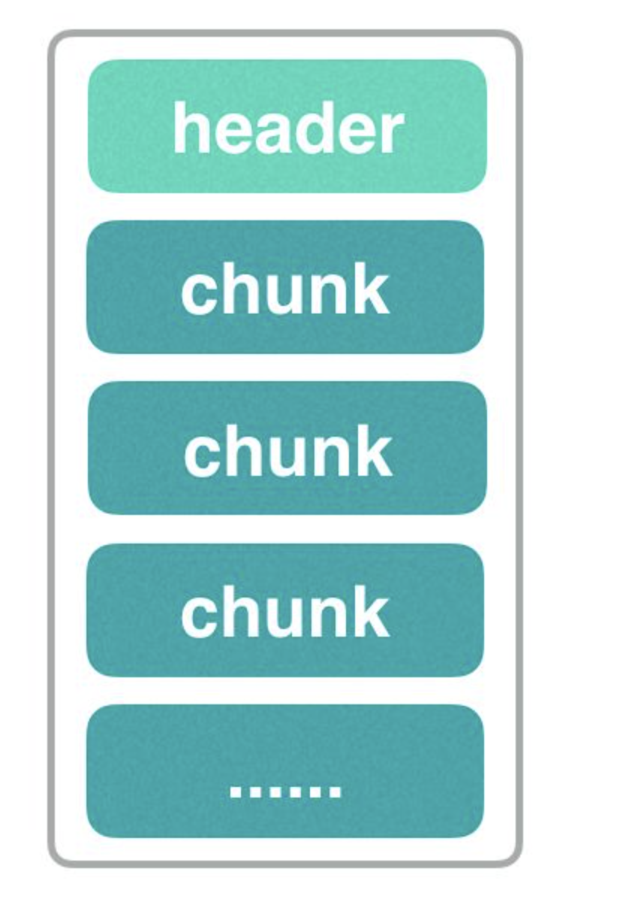
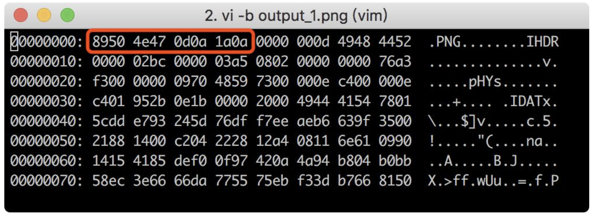
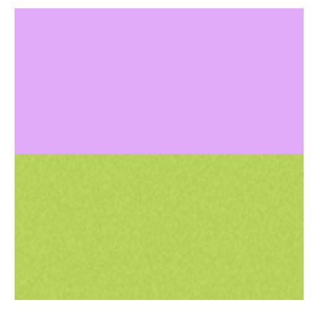
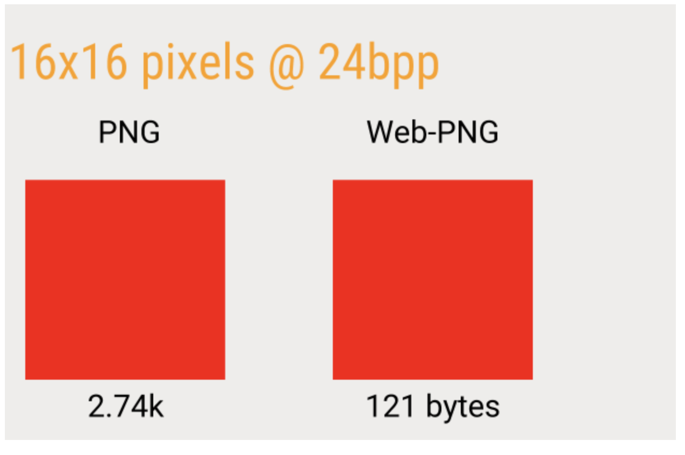

     

# png图片压缩原理解析

## 什么是PNG

PNG的全称叫便携式网络图型（Portable Network Graphics）是目前最流行的网络传输和展示的图片格式，原因有如下几点：

无损压缩：PNG图片采取了基于LZ77派生算法对文件进行压缩，使得它压缩比率更高，生成的文件体积更小，并且不损失数据。

体积小：它利用特殊的编码方法标记重复出现的数据，使得同样格式的图片，PNG图片文件的体积更小。网络通讯中因受带宽制约，在保证图片清晰、逼真的前提下，优先选择PNG格式的图片。

支持透明效果：PNG支持对原图像定义256个透明层次，使得图像的边缘能与任何背景平滑融合，这种功能是GIF和JPEG没有的。

## PNG类型

PNG图片主要有三个类型，分别为 PNG 8 / PNG 24 / PNG 32。

PNG8：PNG 8中的8，其实指的是8bits（一个字节），相当于用2^8（2的8次方）大小来存储一张图片的颜色种类，2^8等于256，也就是说PNG 8能存储256种颜色，一张图片如果颜色种类很少，将它设置成PNG 8得图片类型是非常适合的。

PNG24：PNG 24中的24，相当于3乘以8 等于 24，就是用三个8bits分别去表示 R（红）、G（绿）、B（蓝）。R(0~255),G(0~255),B(0~255)，可以表达256乘以256乘以256=16777216种颜色的图片，这样PNG 24就能比PNG 8表示色彩更丰富的图片。但是所占用的空间相对就更大了。

PNG32：PNG 32中的32，相当于PNG 24 加上 8bits的透明颜色通道，就相当于R（红）、G（绿）、B（蓝）、A（透明）。R(0~255),G(0~255),B(0~255),A(0~255)。比PNG 24多了一个A（透明），也就是说PNG 32能表示跟PNG 24一样多的色彩，并且还支持256种透明的颜色，能表示更加丰富的图片颜色类型。

## PNG图片数据结构

PNG图片的数据结构其实跟http请求的结构很像，都是一个数据头，后面跟着很多的数据块，如下图所示：

如果你用vim的查看编码模式打开一张png图片，会是下面这个样子：

这一堆十六进制编码的含义：

89504e470d0a1a0a：这个是PNG图片的头，所有的PNG图片的头都是这一串编码，图片软件通过这串编码判定这个文件是不是PNG格式的图片。

0000000d：是iHDR数据块的长度，为13。

49484452：是数据块的type,为IHDR，之后紧跟着是data。

000002bc：是图片的宽度。

000003a5：是高度。

以此类推，每一段十六进制编码就代表着一个特定的含义。下面其他的就不一一分析了，太多了，小伙伴们自己去查吧。

## 什么样的PNG图片更适合压缩

常规的png图片，颜色越单一，颜色值越少，压缩率就越大，比如下面这张图：

它仅仅由红色和绿色构成，如果用0代表红色，用1代表绿色，那用数字表示这张图就是下面这个样子：

00000000000000000

00000000000000000

00000000000000000

1111111111111111111111111

1111111111111111111111111

1111111111111111111111111

我们可以看到，这张图片是用了大量重复的数字，我们可以将重复的数字去掉，直接用数组形式的[0, 1]就可以直接表示出这张图片了，仅仅用两个数字，就能表示出一张很大的图片，这样就极大的压缩了一张png图片。

所以！颜色越单一，颜色值越少，颜色差异越小的png图片，压缩率就越大，体积就越小。

## PNG的压缩

PNG图片的压缩，分两个阶段：

预解析（Prediction）：这个阶段就是对png图片进行一个预处理，处理后让它更方便后续的压缩。比如就是一个女神，在化妆前，会先打底，先涂乳液和精华，方便后续上妆、美白、眼影、打光等等。

压缩（Compression）：执行Deflate压缩，该算法结合了 LZ77 算法和 Huffman 算法对图片进行编码。

### 预解析（Prediction）

png图片用差分编码（Delta encoding）对图片进行预处理，处理每一个的像素点中每条通道的值，差分编码主要有几种：

* 不过滤

* X-A

* X-B

* X-(A+B)/2(又称平均值)

* Paeth推断（这种比较复杂）

假设，一张png图片如下:

这张图片是一个红色逐渐增强的渐变色图，它的红色从左到右逐渐加强，映射成数组的值为[1,2,3,4,5,6,7,8]，使用X-A的差分编码的话，那就是:

[2-1=1, 3-2=1, 4-3=1, 5-4=1, 6-5=1, 7-6=1, 8-7=1]

得到的结果为

[1,1,1,1,1,1,1]

最后的[1,1,1,1,1,1,1]这个结果出现了大量的重复数字，这样就非常适合进行压缩。

这就是为什么渐变色图片、颜色值变化不大并且颜色单一的图片更容易压缩的原理。

差分编码的目的，就是尽可能的将png图片数据值转换成一组重复的、低的值，这样的值更容易被压缩。

最后还要注意的是，差分编码处理的是每一个的像素点中每条颜色通道的值，R（红）、G（绿）、B（蓝）、A（透明）四个颜色通道的值分别进行处理。

### 压缩（Compression）

压缩阶段会将预处理阶段得到的结果进行Deflate压缩，它由 Huffman 编码 和 LZ77压缩构成。

如前面所说，Deflate压缩会标记图片所有的重复数据，并记录数据特征和结构，会得到一个压缩比最大的png图片 编码数据。

Deflate是一种压缩数据流的算法. 任何需要流式压缩的地方都可以用。

还有就是我们前面说过，一个png图片，是由很多的数据块构成的，但是数据块里面的一些信息其实是没有用的，比如用Photoshop保存了一张png图片，图片里就会有一个区块记录“这张图片是由photshop创建的”，很多类似这些信息都是无用的，如果用photoshop的“导出web格式”就能去掉这些无用信息。导出web格式前后对比效果如下图所示：

可以看到，导出web格式，去除了很多无用信息后，图片明显小了很多。

[png图片压缩原理解析](https://www.cnblogs.com/luov/p/10953981.html)