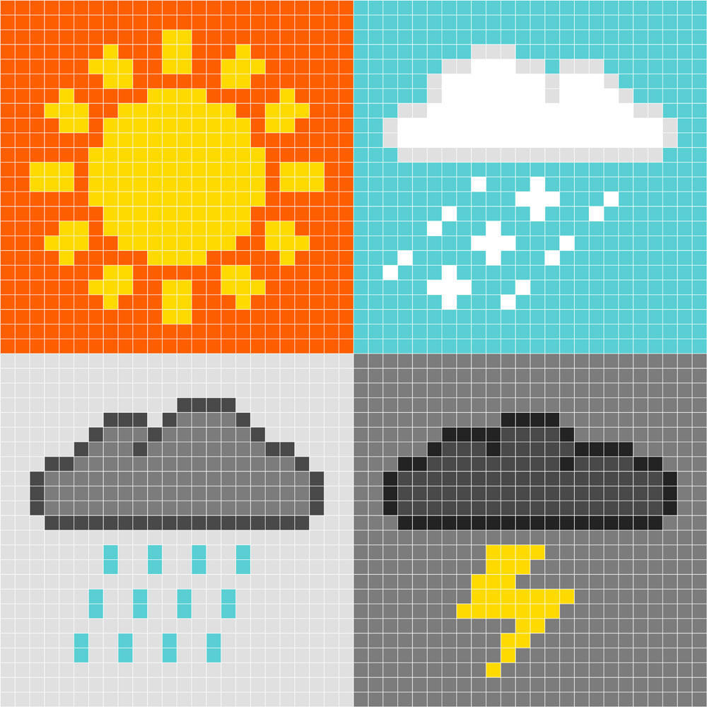
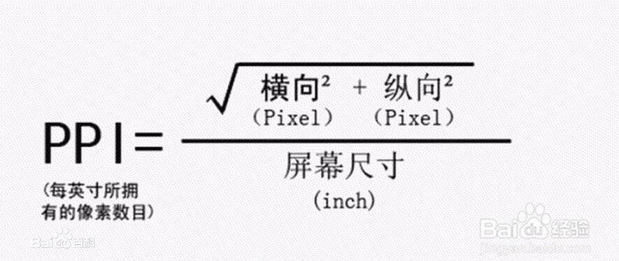
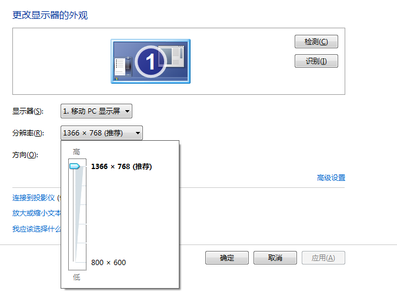

# （全解析）屏幕尺寸，分辨率，像素，PPI之间到底什么关系？ | 人人都是产品经理

今天我给大家来讲讲这几个咱们经常打交道的词到底啥意思，以及他们之间到底有什么关系。这篇文章是我花了一个下午从N多篇文章里提炼出的一个白话版，保证让你看得懂。

咱们从手机开始说起吧。先上一张图，给大家看看关于手机屏幕方面的一些参数。红框内的三个参数，大家一定都不陌生，我也不陌生。不过讲真的，就在不久前，我连手机的屏幕尺寸到底是怎么算出来的都不知道。下面我们开始慢慢讲。

### 屏幕（主屏）尺寸是什么，怎么算？

下面这张图是华为荣耀7的尺寸图，图上写的是5.2英寸。那么这个5.2英寸到底是怎么算出来的呢？在说这个问题之前，我们先进行一下单位的换算。我们平时是不用英寸这个单位的，我们用的是毫米，厘米，米这些单位。那么英寸和毫米，厘米之间怎样的换算关系呢？我也不知道，所以我百度了一下。

1英寸（inch）=2.54厘米（cm）

原来一英寸相当于我们的2.54厘米这么长。现在让我们回到5.2英寸到底是怎么算出来的这个问题。一开始呢，我觉得可能是手机屏幕的面积有这么大吧，后来我百度了英寸之后，才发现自己有多愚蠢。因为英寸是长度单位，面积的表示要用面积单位，英寸显然不可以表示面积。从这一点，就否认了我的想法。

其实，我们所说的这个5.2英寸是手机屏幕对角线的长度。

我这么一说，有点数学常识的人就知道手机的屏幕尺寸是怎么算的了吧。没错，就是那个勾股定理了，知道手机屏幕的长和宽，然后利用勾股定理，就可以算出斜边的长了。还有个更简单的方法，只要用尺子量一下它的对角线是多少厘米，然后再换算成英寸就搞定了。

### 分辨率又是什么鬼？

华为荣耀7的分辨率是1920PX*1080PX。那么，这个分辨率又是怎么回事呢？可能大家注意了，1920和1080后面都跟了PX的字样，这个PX就是我们很熟悉的像素了，这个像素咱们后面讲，现在你只要明白，像素是分辨率的单位就好了。

在讲解分辨率之前，我们要明白一个概念。在我们手机上呈现的一条线，一个面，一张图像都是由最小的单位像素来表示的，你也可以简单理解为是由一个个小方块组成的。看看下面这张图你就明白了。

所以呢，分辨率1920px*1080px的意思就是，在这个华为荣耀7的5.2英寸屏幕上，在竖向的高度上有1920个像素块，在横向的宽度上有1080个像素块。

### 下面来讲讲啥是分辨率比？

你可能注意到了，手机的屏幕是个长方形，高是1920px，宽是1080px。你稍计算就会发现，这个高和宽的比例是16:9的。说到16:9这个比例，经常看视频的同学一定就不陌生了。手机屏幕有各种分辨率比，这个比你也可以看作是手机屏幕的尺寸比。根据百度百科显示，手机分辨率之所以表示成1920px*1080px这种形式，也是为了方便表示手机屏幕的大小。这里的大小，应该指的就是手机屏幕的尺寸吧。其实，告诉你一个手机的分辨率，你真的就能计算出手机屏幕的尺寸吗？那么，还差什么条件才能计算出手机屏幕的尺寸呢？

### 什么是屏幕像素密度？

屏幕像素密度，即每英寸屏幕所拥有的像素数，英文简称PPI。在读到这个每英寸屏幕时，我曾经深深的疑惑，这个每英寸是不是每平方英寸的简称呢？事实证明，我还是太年轻，这个英寸跟之前手机屏幕的尺寸一样，也是对角线的长度。所以，我们可以这么理解屏幕像素密度，即在一个对角线长度为1英寸的正方形内所拥有的像素数。说到这里，大家可能还是有些疑惑的，没事，接着看下面。

### 屏幕像素密度，分辨率，屏幕尺寸的关系是什么？

这三个专业名词之间，有着非常严谨的关系。为啥说严谨呢，因为这三者之间，有一个公式可以表示。

这个公式真是简单明了，把很多疑问都给我们解决了。我们还是拿华为荣耀7手机为例，我们知道它的尺寸为5.2英寸，分辨率为1920px*1080px（1920px就是公式里的纵向，1080px就是公式里的横向了）。你不信的话就用公式算一下，最后得出的PPI，是不是就是424ppi。我算了一下，结果是423.6359942465958，懂得四舍五入的同学就知道424是个近似值了。

### 像素的大小是固定的吗？

我先这么说一句，像素是没有实际的物理尺寸的。为啥呢，按照惯例，举个例子。

上面的这两张图，第一张是苹果6手机的屏幕参数，第二张还是出镜率最高的华为荣耀7的屏幕参数。大家注意看，这两个手机的分辨率都是1920px*1080px。但是，苹果手机的屏幕尺寸比华为荣耀7小了0.2英寸。又一个但是，苹果手机的屏幕像素密度（PPI）却比华为荣耀7高了45个PPI，也就是每英寸像素个数多了45个。这说明了啥？说明了同样的一英寸的长度，苹果手机用469个ppi来显示，华为只用了424个ppi来显示。你能告诉我哪个手机的显示效果更加精细吗？同样是一英寸，同样都是像素，为啥苹果手机一英寸有469个像素，华为只有424个呢？我们知道，英寸是长度单位，它有固定的物理尺寸。那么问题就只能出在了像素身上。这说明，像素这个东西，在苹果手机上变小了。所以，像素这个东西，就像金箍，能变大能变小。

### 电脑屏幕可以调分辨率，难道是通过调整它的像素大小实现的？

你错啦，要是这么简单，我写这篇文章有个卵用？其实类，在同一个设备上，它的像素个数是固定的，这是厂商在出厂时就设置好了的。只有不同的设备之间，才有像素大小的区别。既然在同一个设备上，像素点数早就设定好了，那电脑上可以调整分辨率是怎么回事？我再怎么调，像素点数还是那么多啊。

人家系统给你推荐的是1366px * 768px的分辨率，你知道意味着什么吗？没错，微软在这块屏幕上竖向设置了768个像素，横向设置了1366个像素。再怎么拉扯，这个数字是不会变了。那么，为啥我还能调整分辨率呢？我要是调整到800px * 600px，按照定义，竖向就是600个像素，横向就是800个像素了啊。其实呢，你把分辨率调成800 * 600，系统就会分配给你80 0* 600个有效像素个数，也就是真实的色彩块。其他的个数呢，就由系统自作主张，通过一系列运算给你一个模拟色彩块，填充成正好1366 * 768个色彩块。这些拿来充数的像素块，和真实的像素块放到一起。就好比一个正规军，里面掺了很多杂牌军一样，只能是队伍不好带了。

### PPI大的手机显示效果就越精细吗？

要回答这个问题，就要先明白，一个像素到底包含了什么？一个像素其实就是一个色彩块，你不信的话，就去前面看看那张风雨雷电图。同样的一英寸，苹果手机能展示469个色彩，华为只能展示424个色彩，当然是苹果手机的显示效果更好了。也就是苹果6在出厂时，早就在屏幕上设置了同样个数更小的像素块，也就意味着可以显示更多的色彩。

> 屏幕的清晰程度其实是分辨率和尺寸大小共同决定，用ppi指数衡量屏幕清晰程度更加准确。  

**屏幕尺寸固定，分辨率越高，PPI就越高吗？**

废话，看公式啊。

**分辨率固定，屏幕尺寸大了，PPI是不是就少了？**

废话，看公式啊。还有，苹果6和荣耀7的例子还很鲜活的摆在这呢。

**PPI不变，屏幕尺寸变大，分辨率是不是也会变大？**

废话，看公式啊。

[（全解析）屏幕尺寸，分辨率，像素，PPI之间到底什么关系？ | 人人都是产品经理](http://www.woshipm.com/ucd/198774.html)