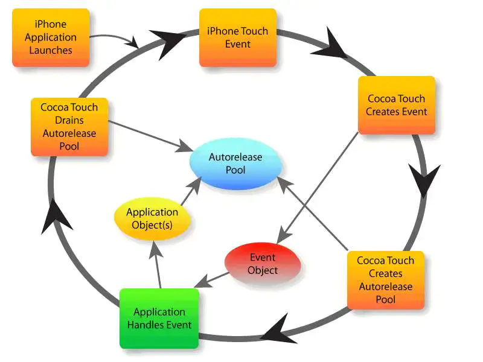
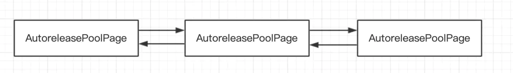
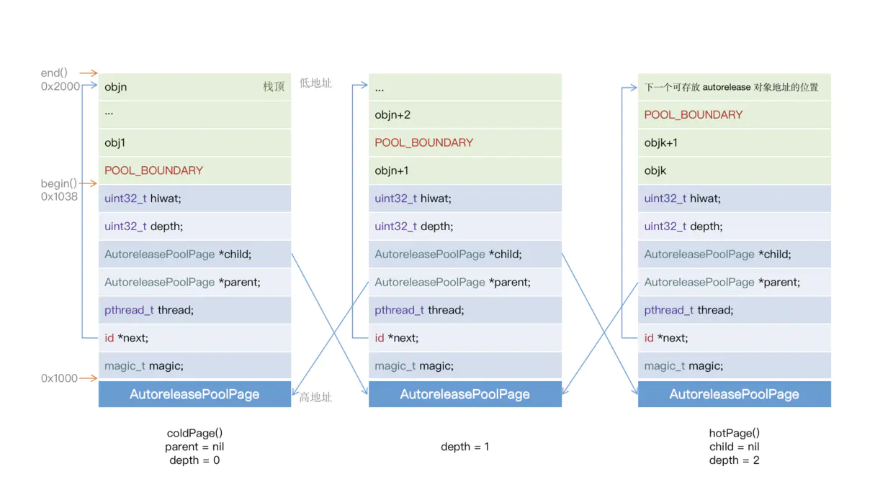
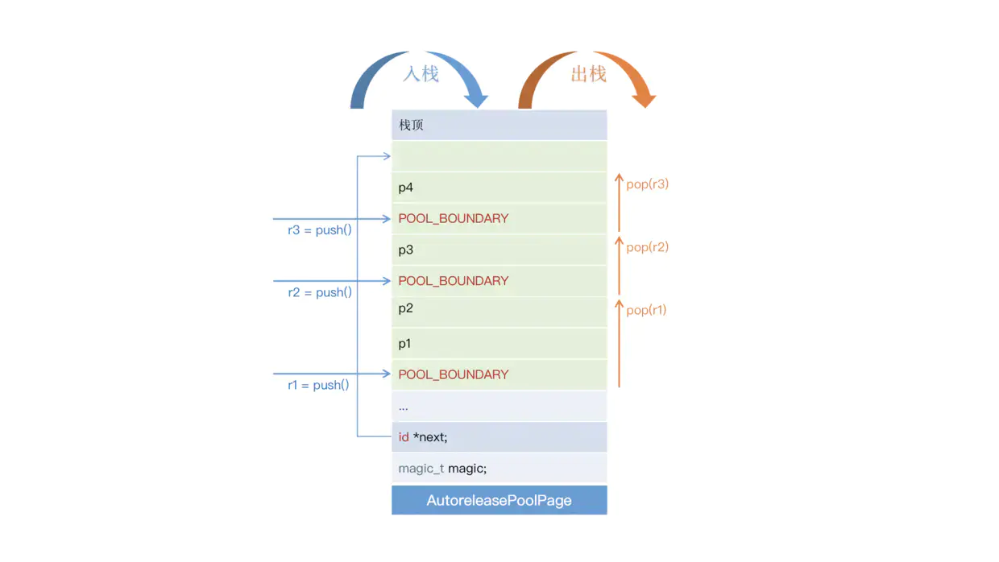
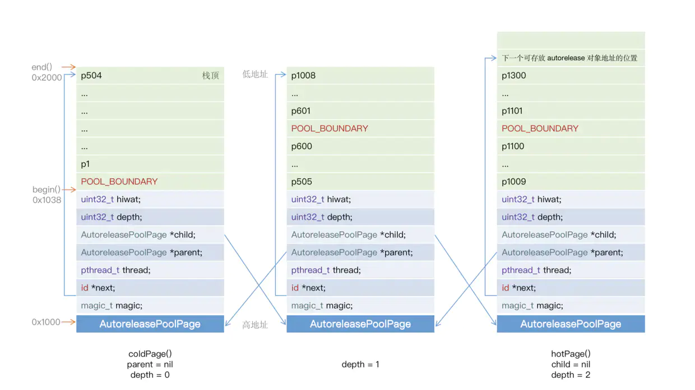
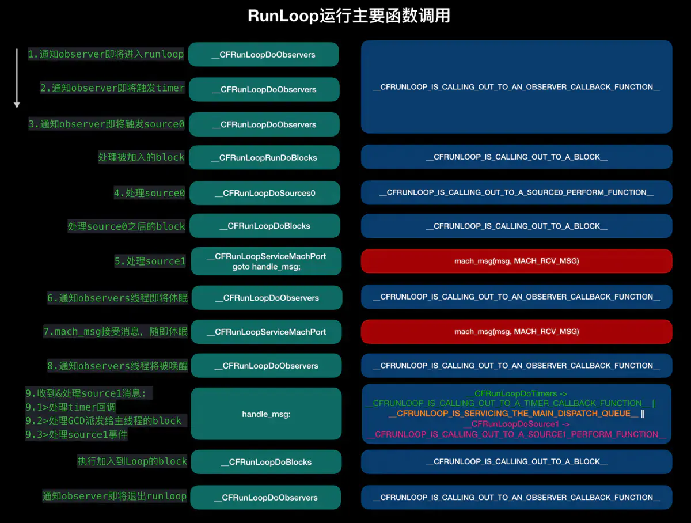

# iOS底层学习 - 内存管理之Autoreleasepool

> 有关内存管理的相关优化方案和引用计数的相关原理，我们已经了解，本章来讲解在内存管理中的另一个方案Autoreleasepool  

传送门☞ [iOS底层学习 - 内存管理之内存管理方案](https://juejin.im/post/6844904181615034376)

传送门☞ [iOS底层学习 - 内存管理之weak原理探究](https://juejin.im/post/6844904051029573645)

## 初探Autoreleasepool

### Autoreleasepool作用

通过之前章节的学习，我们知道在 `ARC` 下，LLVM编译器会自动帮我们生产 `retain`、`release` 和 `autorelease` 等代码，减少了在 `MRC` 下的工作量。调用 `autorelease` 会将该对象添加进自动释放池中，它会在一个恰当的时刻自动给对象调用 `release` ，所以 `autorelease` 相当于延迟了对象的释放。

但是在 `ARC` 下， `autorelease` 方法已被禁用，我们可以使用 `__autoreleasing` 修饰符修饰对象将对象注册到自动释放池中。

### Autoreleasepool创建

* 在 `MRC` 下，可以使用 `NSAutoreleasePool` 或者 `@autoreleasepool` 。建议使用 `@autoreleasepool` ，苹果说它比 `NSAutoreleasePool` 快大约六倍。

```objc
NSAutoreleasePool *pool = [[NSAutoreleasePool alloc] init];
// Code benefitting from a local autorelease pool.
[pool release];
```

* 而在ARC下，已经禁止使用 `NSAutoreleasePool` 类创建自动释放池，只能使用 `@autoreleasepool。`

```objc
@autoreleasepool { 
	// Code benefitting from a local autorelease pool.
}
```

> The Application Kit creates an autorelease pool on the main thread at the beginning of every cycle of the event loop, and drains it at the end, thereby releasing any autoreleased objects generated while processing an event. If you use the Application Kit, you therefore typically don’t have to create your own pools. If your application creates a lot of temporary autoreleased objects within the event loop, however, it may be beneficial to create “local” autorelease pools to help to minimize the peak memory footprint.  

以上是苹果对自动释放池的一段介绍，其意思为： `AppKit` 和 `UIKit` 框架在事件循环( `RunLoop` )的每次循环开始时，在主线程创建一个自动释放池，并在每次循环结束时销毁它，在销毁时释放自动释放池中的所有 `autorelease` 对象。通常情况下我们 **不需要手动创建** 自动释放池，但是如果我们在循环中创建了很多临时的 `autorelease` 对象，则手动创建自动释放池来管理这些对象可以很大程度地减少内存峰值。



## Autoreleasepool原理探究

### Autoreleasepool底层结构

我们知道在 `main` 函数中，会创建一个 `@autoreleasepool {}` 对象，那么其底层的结构是怎样的呢？

```objc
int main(int argc, const char * argv[]) {
	@autoreleasepool {} 
	return 0;
}
```

我们还是使用 `clang -rewrite-objc main.m` 命令，转换为C++代码查看。通过以下代码，我们可以发现转换后 `@autoreleasepool` 主要做了以下几点：

* `@autoreleasepool` 底层是创建了一个 `__AtAutoreleasePool` 结构体对象；
* 在创建 `__AtAutoreleasePool` 结构体时会在构造函数中调用 `objc_autoreleasePoolPush()` 函数，并返回一个 `atautoreleasepoolobj` ( **POOL_BOUNDARY** 存放的内存地址，下面会讲到)；
* 在释放 `__AtAutoreleasePool` 结构体时会在析构函数中调用 `objc_autoreleasePoolPop()` 函数，并将 `atautoreleasepoolobj` 传入。

```objc
struct __AtAutoreleasePool {
  __AtAutoreleasePool() {atautoreleasepoolobj = objc_autoreleasePoolPush();}
  ~__AtAutoreleasePool() {objc_autoreleasePoolPop(atautoreleasepoolobj);}
  void * atautoreleasepoolobj;
};

int main(int argc, const char * argv[]) {
    /* @autoreleasepool */ { __AtAutoreleasePool __autoreleasepool; }
    return 0;
}
```

### AutoreleasePoolPage底层结构

首先来看 `AutoreleasePoolPage` 的相关源码，其几个成员变量的含义如下：

* magic：用来校验 `AutoreleasePoolPage` 的结构是否完整。
* *next：next指向的是下一个 `AutoreleasePoolPage` 中下一个为空的内存地址（新来的对象会存储到next处），初始化时指向 **begin()** 。
* thread：保存了当前页所在的线程( **一个`AutoreleasePoolPage` 属于一个线程，一个线程中可以有多个 `AutoreleasePoolPage`** )。
* *parent：指向父节点，第一个parent节点为nil。
* *child：指向子节点，最后一个child节点为nil。
* depth：代表深度，从0开始，递增+1。
* hiwat：代表high water Mark **最大入栈数** 。
* SIZE：AutoreleasePoolPage的大小，值为 `PAGE_MAX_SIZE`,4096个字节,其中 `56` 个字节用来存储自己的变量，剩下的 `4040` 个字节用来存储要释放的对象，也就是最多 `505` 个对象。
* **POOL_BOUNDARY** ：

	* 只是nil的别名。前世叫做 `POOL_SENTINEL` ，称为 **哨兵对象** 或者 **边界对象** ；
	* `POOL_BOUNDARY` 用来区分不同的自动释放池，以解决自动释放池嵌套的问题
	* 每当创建一个自动释放池，就会调用 `push()` 方法将一个 `POOL_BOUNDARY` 入栈，并返回其存放的内存地址；
	* 当往自动释放池中添加 `autorelease` 对象时，将 `autorelease` 对象的内存地址入栈，它们前面 **至少有一个** `POOL_BOUNDARY` ；
	* 当销毁一个自动释放池时，会调用 `pop()` 方法并传入一个 `POOL_BOUNDARY` ，会从自动释放池中最后一个对象开始，依次给它们发送 `release` 消息，直到遇到这个 `POOL_BOUNDARY` 。

```objc
class AutoreleasePoolPage;
struct AutoreleasePoolPageData
{
	magic_t const magic;
	__unsafe_unretained id *next;
	pthread_t const thread;
	AutoreleasePoolPage * const parent;
	AutoreleasePoolPage *child;
	uint32_t const depth;
	uint32_t hiwat;

	AutoreleasePoolPageData(__unsafe_unretained id* _next, pthread_t _thread, AutoreleasePoolPage* _parent, uint32_t _depth, uint32_t _hiwat)
		: magic(), next(_next), thread(_thread),
		  parent(_parent), child(nil),
		  depth(_depth), hiwat(_hiwat)
	{
	}
};

----------------------------------------------------------------------------------

class AutoreleasePoolPage : private AutoreleasePoolPageData
{
	friend struct thread_data_t;

public:
	static size_t const SIZE =
#if PROTECT_AUTORELEASEPOOL
		PAGE_MAX_SIZE;  // must be multiple of vm page size
#else
		PAGE_MIN_SIZE;  // size and alignment, power of 2
#endif
    
private:
	static pthread_key_t const key = AUTORELEASE_POOL_KEY;
	static uint8_t const SCRIBBLE = 0xA3;  // 0xA3A3A3A3 after releasing
	static size_t const COUNT = SIZE / sizeof(id);

    // EMPTY_POOL_PLACEHOLDER is stored in TLS when exactly one pool is 
    // pushed and it has never contained any objects. This saves memory 
    // when the top level (i.e. libdispatch) pushes and pops pools but 
    // never uses them.
#   define EMPTY_POOL_PLACEHOLDER ((id*)1)

#   define POOL_BOUNDARY nil

    // SIZE-sizeof(*this) bytes of contents follow
    ......
}
```

> /***********************************************************************  
> Autorelease pool implementation  
> A thread's autorelease pool is a stack of pointers.  
> Each pointer is either an object to release, or POOL_BOUNDARY which is an autorelease pool boundary.  
> A pool token is a pointer to the POOL_BOUNDARY for that pool. When the pool is popped, every object hotter than the sentinel is released.  
> The stack is divided into a doubly-linked list of pages. Pages are added and deleted as necessary.  
> Thread-local storage points to the hot page, where newly autoreleased objects are stored.  
> **********************************************************************/  

翻译如下

> 一个线程的自动释放池是一个指针的堆栈结构。  
>
> 每个指针代表一个需要释放的对象或者POOL_BOUNDARY(自动释放池边界)  
>
> 一个 pool token 就是这个 pool 所对应的 POOL_BOUNDARY 的内存地址。当这个 pool 被 pop 的时候，所有内存地址在 pool token 之后的对象都会被 release。 这个堆栈被划分成了一个以 page 为结点的双向链表。pages 会在必要的时候动态地增加或删除。  
>
> Thread-local storage（线程局部存储）指向 hot page ，即最新添加的 autoreleased 对象所在的那个 page 。  

通过上面对成员变量的解析和上方官方的注释，我们可以知道 `AutoreleasePoolPage` 底层结构如下：

1. `AutoreleasePoolPage` 是以栈为结点通过双向链表的形式组合而成；遵循先进后出规则，整个自动释放池由一系列的 `AutoreleasePoolPage` 组成的，而 `AutoreleasePoolPage` 是以双向链表的形式连接起来。
2. 自动释放池与线程一一对应；
3. 每个 `AutoreleasePoolPage` 对象占用 `4096` 字节内存，其中 `56` 个字节用来存放它内部的成员变量，剩下的空间（4040个字节）用来存放autorelease对象的地址。要注意的是第一页只有504个对象，因为在创建page的时候会在 `next` 的位置插入1个 `POOL_SENTINEL` 。
4. `POOL_BOUNDARY` 为哨兵对象，入栈时插入，出栈时释放对象到此传入的哨兵对象

该图表示 `AutoreleasePoolPage` 的双向列表结构 



该图表示 `AutoreleasePoolPage` 的双向列表和栈结构 


### AutoreleasePoolPage::push()原理

首先我们看 `objc_autoreleasePoolPush` 的源码，发现其内部就是调用了 `AutoreleasePoolPage` 的 `push()` 方法。

```objc
void * objc_autoreleasePoolPush(void)
{ 
	return AutoreleasePoolPage::push();
}
```

来到 `AutoreleasePoolPage` 内部的 `push()` 方法，其中 `slowpath` 表示很少会走到，是底部的容错处理，所以最终会走到 `autoreleaseFast` 方法中

```
static inline void *push() 
    {
        id *dest;
        if (slowpath(DebugPoolAllocation)) {
            // Each autorelease pool starts on a new pool page.
            dest = autoreleaseNewPage(POOL_BOUNDARY);
        } else {
            dest = autoreleaseFast(POOL_BOUNDARY);
        }
        ASSERT(dest == EMPTY_POOL_PLACEHOLDER || *dest == POOL_BOUNDARY);
        return dest;
    }

```

查看 `autoreleaseFast` 源码，先是调用了 `hotPage()`,`hotPage()` 方法就是用来获得新创建的未满的Page。其内部主要是判断逻辑：

* 如果当前 Page 存在且未满，走 `page->add(obj)` 将 autorelease 对象入栈，即添加到当前 Page 中
* 如果当前 Page 存在但已满,走 `autoreleaseFullPage`,创建一个新的 Page，并将 autorelease 对象添加进去
* 如果当前 Page 不存在，即还没创建过 Page,创建第一个 Page，并将 autorelease 对象添加进去

```objc
    static inline id *autoreleaseFast(id obj)
    {
        AutoreleasePoolPage *page = hotPage(); // 双向链表中的最后一个 Page
        if (page && !page->full()) {// 如果当前 Page 存在且未满
            return page->add(obj);      // 将 autorelease 对象入栈，即添加到当前 Page 中；
        } else if (page) { // 如果当前 Page 存在但已满
            return autoreleaseFullPage(obj, page); // 创建一个新的 Page，并将 autorelease 对象添加进去
        } else {// 如果当前 Page 不存在，即还没创建过 Page
            return autoreleaseNoPage(obj);      // 创建第一个 Page，并将 autorelease 对象添加进去
        }
    }

```

#### page->full()

首先我们来看一下，如何判断当前page是否是满状态的。

* `begin` 的地址为：Page自己的地址+Page对象的大小56个字节；
* `end` 的地址为：Page自己的地址+4096个字节；
* `empty` ：判断Page是否为空的条件是next地址是不是等于begin；
* `full` ：判断Page是否已满的条件是next地址是不是等于end（栈顶）。

我们知道 `next` 指向的是下一个 `AutoreleasePoolPage` 中下一个为空的内存地址，新对象会存在 `next`,如果此时 `next` 指向 `end` 则代表当前 `AutoreleasePoolPage` 已满。

```objc
id * begin() {
    return (id *) ((uint8_t *)this+sizeof(*this));
}

id * end() {
    return (id *) ((uint8_t *)this+SIZE);
}

bool empty() {
    return next == begin();
}

bool full() { 
    return next == end();
}

```

#### page->add(obj)

当page没有存满时，会调用此方法，内部的原理非常简单，就是一个压栈的操作，并将 `next` 指针指向这个对象的下一个位置，然后将该对象的位置返回。

```objc
id *add(id obj)
{
    assert(!full());
    unprotect();
    id *ret = next;  // faster than `return next-1` because of aliasing
    *next++ = obj;
    protect();
    return ret;
}

```

#### autoreleaseFullPage(obj, page)

如果当前 Page 存在但已满,会调用此方法。其内部实现的主要方法就是一个 `do..while` 循环，主要实现了一下的逻辑

* 由于page是链表结构，所以通过循环查找 `page->child`
* 一级级判断是否 `page->full()`
* 如果到最后一个page都是满的，那么就新 `new` 一个 `AutoreleasePoolPage`
* 如果有不满的，或者新创建的，调用 `setHotPage(page)` 将当前页设置为活跃
* 最后将对象通过 `page->add` 压栈

```objc
id *autoreleaseFullPage(id obj, AutoreleasePoolPage *page)
    {
        // The hot page is full. 
        // Step to the next non-full page, adding a new page if necessary.
        // Then add the object to that page.
        ASSERT(page == hotPage());
        ASSERT(page->full()  ||  DebugPoolAllocation);

        do {
            if (page->child) page = page->child;
            else page = new AutoreleasePoolPage(page);
        } while (page->full());

        setHotPage(page);
        return page->add(obj);
    }

```

#### autoreleaseNoPage(obj)

当没有page时，会走到此方法，其主要逻辑如下：

* 先会判断是否有空的自动释放池存在，如果没有会通过 `setEmptyPoolPlaceholder()` 生成一个占位符，表示一个空的自动释放池
* 创建第一个 `Page` ，设置它为 `hotPage`
* 将一个 `POOL_BOUNDARY` 添加进Page中，并返回 `POOL_BOUNDARY` 的下一个位置。
* 插入第一个对象

```objc
id *autoreleaseNoPage(id obj)
    {
        // "No page" could mean no pool has been pushed
        // or an empty placeholder pool has been pushed and has no contents yet
        ASSERT(!hotPage());

        bool pushExtraBoundary = false;
        if (haveEmptyPoolPlaceholder()) {
            // We are pushing a second pool over the empty placeholder pool
            // or pushing the first object into the empty placeholder pool.
            // Before doing that, push a pool boundary on behalf of the pool 
            // that is currently represented by the empty placeholder.
            pushExtraBoundary = true;
        }
        else if (obj != POOL_BOUNDARY  &&  DebugMissingPools) {
            // We are pushing an object with no pool in place, 
            // and no-pool debugging was requested by environment.
            _objc_inform("MISSING POOLS: (%p) Object %p of class %s "
                         "autoreleased with no pool in place - "
                         "just leaking - break on "
                         "objc_autoreleaseNoPool() to debug", 
                         objc_thread_self(), (void*)obj, object_getClassName(obj));
            objc_autoreleaseNoPool(obj);
            return nil;
        }
        else if (obj == POOL_BOUNDARY  &&  !DebugPoolAllocation) {
            // We are pushing a pool with no pool in place,
            // and alloc-per-pool debugging was not requested.
            // Install and return the empty pool placeholder.
            return setEmptyPoolPlaceholder();
        }

        // We are pushing an object or a non-placeholder'd pool.

        // Install the first page.
        AutoreleasePoolPage *page = new AutoreleasePoolPage(nil);
        setHotPage(page);
        
        // Push a boundary on behalf of the previously-placeholder'd pool.
        if (pushExtraBoundary) {
            page->add(POOL_BOUNDARY);
        }
        
        // Push the requested object or pool.
        return page->add(obj);
    }

```

### AutoreleasePoolPage::pop(ctxt)原理

看完对象入栈的实现，我们再来看一下出栈的实现。

首先pop的入参 `token` 即为 `POOL_BOUNDARY` 对应在Page中的地址。当销毁自动释放池时，会从从自动释放池的中的最后一个入栈的autorelease对象开始，依次给它们发送一条 `release` 消息，直到遇到这个 `POOL_BOUNDARY`,具体的步骤如下：

* 判断 `token` 是不是 `EMPTY_POOL_PLACEHOLDER` ，是的话就清空这个自动释放池
* 如果不是的话，就通过 `pageForPointer(token)` 拿到 `token` 所在的 `Page`
* 通过 `page->releaseUntil(stop)` 将自动释放池中的 `autorelease` 对象全部释放，传参 `stop` 即为 `POOL_BOUNDARY` 的地址
* 判断当前Page是否有子Page，有的话就销毁

```objc
static inline void pop(void *token) 
{
    AutoreleasePoolPage *page;
    id *stop;

    if (token == (void*)EMPTY_POOL_PLACEHOLDER) {
        // Popping the top-level placeholder pool.
        if (hotPage()) {
            // Pool was used. Pop its contents normally.
            // Pool pages remain allocated for re-use as usual.
            pop(coldPage()->begin());
        } else {
            // Pool was never used. Clear the placeholder.
            setHotPage(nil);
        }
        return;
    }

    page = pageForPointer(token);
    stop = (id *)token;
    if (*stop != POOL_BOUNDARY) {
        if (stop == page->begin()  &&  !page->parent) {
            // Start of coldest page may correctly not be POOL_BOUNDARY:
            // 1. top-level pool is popped, leaving the cold page in place
            // 2. an object is autoreleased with no pool
        } else {
            // Error. For bincompat purposes this is not 
            // fatal in executables built with old SDKs.
            return badPop(token);
        }
    }

    if (PrintPoolHiwat) printHiwat();

    page->releaseUntil(stop);

    // memory: delete empty children
    if (DebugPoolAllocation  &&  page->empty()) {
        // special case: delete everything during page-per-pool debugging
        AutoreleasePoolPage *parent = page->parent;
        page->kill();
        setHotPage(parent);
    } else if (DebugMissingPools  &&  page->empty()  &&  !page->parent) {
        // special case: delete everything for pop(top) 
        // when debugging missing autorelease pools
        page->kill();
        setHotPage(nil);
    } 
    else if (page->child) {
        // hysteresis: keep one empty child if page is more than half full
        if (page->lessThanHalfFull()) {
            page->child->kill();
        }
        else if (page->child->child) {
            page->child->child->kill();
        }
    }
}
```

#### pageForPointer(token)

该方法，主要是通过token来拿到当前所在的page。主要实现原理是将指针token与页面的大小(4096)取模，可以得到当前指针的 **偏移量** 。然后将指针的地址减偏移量便可以得到首地址。即该page的地址

```
static AutoreleasePoolPage *pageForPointer(uintptr_t p) { AutoreleasePoolPage *result; uintptr_t offset = p % SIZE; ASSERT(offset >= sizeof(AutoreleasePoolPage)); result = (AutoreleasePoolPage *)(p - offset); result->fastcheck(); return result;
} 复制代码
```

#### page->releaseUntil(stop)

pop()方法中释放autorelease对象的过程在releaseUntil()方法中，下面来看一下这个方法的实现：

* `releaseUntil()` 方法其实就是通过一个 `while` 循环
* 从 `hotPage` 开始，一直释放，直到 `stop`,即传入的 `POOL_BOUNDARY`
* 最后设置释放完的当前page为 `hotPage`

```objc
void releaseUntil(id *stop) 
{
    // Not recursive: we donot want to blow out the stack 
    // if a thread accumulates a stupendous amount of garbage
    
    while (this->next != stop) {
        // Restart from hotPage() every time, in case -release 
        // autoreleased more objects
        AutoreleasePoolPage *page = hotPage();

        // fixme I think this `while` can be `if`, but I canot prove it
        while (page->empty()) {
            page = page->parent;
            setHotPage(page);
        }

        page->unprotect();
        id obj = *--page->next;  // next指针是指向最后一个对象的后一个位置，所以需要先减1
        memset((void*)page->next, SCRIBBLE, sizeof(*page->next));
        page->protect();

        if (obj != POOL_BOUNDARY) {
            objc_release(obj);
        }
    }

    setHotPage(this);

#if DEBUG
    // we expect any children to be completely empty
    for (AutoreleasePoolPage *page = child; page; page = page->child) {
        assert(page->empty());
    }
#endif
}


```

#### page->kill()

`kill` 方法删除双向链表中的每一个的page,找到当前 `page` 的 `child` 方向尾部 `page` ，然后反向挨着释放并且把其 `parent` 节点的 `child` 指针置空。

```objc
void kill() 
{
    // Not recursive: we donot want to blow out the stack 
    // if a thread accumulates a stupendous amount of garbage
    AutoreleasePoolPage *page = this;
    // 找到链表最末尾的page
    while (page->child) page = page->child;

    AutoreleasePoolPage *deathptr;
    // 循环删除每一个page
    do {
        deathptr = page;
        page = page->parent;
        if (page) {
            page->unprotect();
            page->child = nil;
            page->protect();
        }
        delete deathptr;
    } while (deathptr != this);
}
```

## Autoreleasepool嵌套探究

准备：

* 由于ARC环境下不能调用autorelease等方法，所以需要将工程切换为MRC环境。
* 使用 `extern void _objc_autoreleasePoolPrint(void);` 方法来打印autoreleasePool的相关信息

### 单个page嵌套

```objc
int main(int argc, const char * argv[]) {
    _objc_autoreleasePoolPrint();             // print1
    @autoreleasepool { //r1 = push()
        _objc_autoreleasePoolPrint();         // print2
        NSObject *p1 = [[[NSObject alloc] init] autorelease];
        NSObject *p2 = [[[NSObject alloc] init] autorelease];
        _objc_autoreleasePoolPrint();         // print3
        @autoreleasepool { //r2 = push()
            NSObject *p3 = [[[NSObject alloc] init] autorelease];
            _objc_autoreleasePoolPrint();     // print4
            @autoreleasepool { //r3 = push()
                NSObject *p4 = [[[NSObject alloc] init] autorelease];
                _objc_autoreleasePoolPrint(); // print5
            } //pop(r3)
            _objc_autoreleasePoolPrint();     // print6
        } //pop(r2)
        _objc_autoreleasePoolPrint();         // print7
    } //pop(r1)
    _objc_autoreleasePoolPrint();             // print8
    return 0;
}

```

打印结果过如下，通过打印结果，我们可以印证上面原理的探索，其主要的进出栈流程如下图所示，且作用域只在 `@autoreleasepool {}` 之间，超过之后就全部调用pop释放



```objc
objc[12943]: ##############
objc[12943]: AUTORELEASE POOLS for thread 0x11aee5dc0
objc[12943]: 0 releases pending.
objc[12943]: ##############
objc[12943]: ##############
objc[12943]: AUTORELEASE POOLS for thread 0x11aee5dc0
objc[12943]: 0 releases pending.
objc[12943]: [0x1] ................ PAGE (placeholder)
objc[12943]: [0x1] ################ POOL (placeholder)
objc[12943]: ##############
objc[12943]: ##############
objc[12943]: AUTORELEASE POOLS for thread 0x11aee5dc0
objc[12943]: 3 releases pending.
objc[12943]: [0x7f924480b000] ................ PAGE (hot) (cold)
objc[12943]: [0x7f924480b038] ################ POOL 0x7f924480b038
objc[12943]: [0x7f924480b040] 0x600001b34070 NSObject
objc[12943]: [0x7f924480b048] 0x600001b34080 NSObject
objc[12943]: ##############
objc[12943]: ##############
objc[12943]: AUTORELEASE POOLS for thread 0x11aee5dc0
objc[12943]: 5 releases pending.
objc[12943]: [0x7f924480b000] ................ PAGE (hot) (cold)
objc[12943]: [0x7f924480b038] ################ POOL 0x7f924480b038
objc[12943]: [0x7f924480b040] 0x600001b34070 NSObject
objc[12943]: [0x7f924480b048] 0x600001b34080 NSObject
objc[12943]: [0x7f924480b050] ################ POOL 0x7f924480b050
objc[12943]: [0x7f924480b058] 0x600001b34090 NSObject
objc[12943]: ##############
objc[12943]: ##############
objc[12943]: AUTORELEASE POOLS for thread 0x11aee5dc0
objc[12943]: 7 releases pending.
objc[12943]: [0x7f924480b000] ................ PAGE (hot) (cold)
objc[12943]: [0x7f924480b038] ################ POOL 0x7f924480b038
objc[12943]: [0x7f924480b040] 0x600001b34070 NSObject
objc[12943]: [0x7f924480b048] 0x600001b34080 NSObject
objc[12943]: [0x7f924480b050] ################ POOL 0x7f924480b050
objc[12943]: [0x7f924480b058] 0x600001b34090 NSObject
objc[12943]: [0x7f924480b060] ################ POOL 0x7f924480b060
objc[12943]: [0x7f924480b068] 0x600001b2c030 NSObject
objc[12943]: ##############
objc[12943]: ##############
objc[12943]: AUTORELEASE POOLS for thread 0x11aee5dc0
objc[12943]: 5 releases pending.
objc[12943]: [0x7f924480b000] ................ PAGE (hot) (cold)
objc[12943]: [0x7f924480b038] ################ POOL 0x7f924480b038
objc[12943]: [0x7f924480b040] 0x600001b34070 NSObject
objc[12943]: [0x7f924480b048] 0x600001b34080 NSObject
objc[12943]: [0x7f924480b050] ################ POOL 0x7f924480b050
objc[12943]: [0x7f924480b058] 0x600001b34090 NSObject
objc[12943]: ##############
objc[12943]: ##############
objc[12943]: AUTORELEASE POOLS for thread 0x11aee5dc0
objc[12943]: 3 releases pending.
objc[12943]: [0x7f924480b000] ................ PAGE (hot) (cold)
objc[12943]: [0x7f924480b038] ################ POOL 0x7f924480b038
objc[12943]: [0x7f924480b040] 0x600001b34070 NSObject
objc[12943]: [0x7f924480b048] 0x600001b34080 NSObject
objc[12943]: ##############
objc[12943]: ##############
objc[12943]: AUTORELEASE POOLS for thread 0x11aee5dc0
objc[12943]: 0 releases pending.
objc[12943]: [0x7f924480b000] ................ PAGE (hot) (cold)
objc[12943]: ############## 复制代码
```

### 多个page嵌套

```objc
int main(int argc, const char * argv[]) {
    @autoreleasepool { //r1 = push()
        for (int i = 0; i < 600; i++) {
            NSObject *p = [[[NSObject alloc] init] autorelease];
        }
        @autoreleasepool { //r2 = push()
            for (int i = 0; i < 500; i++) {
                NSObject *p = [[[NSObject alloc] init] autorelease];
            }
            @autoreleasepool { //r3 = push()
                for (int i = 0; i < 200; i++) {
                    NSObject *p = [[[NSObject alloc] init] autorelease];
                }
                _objc_autoreleasePoolPrint();
            } //pop(r3)
        } //pop(r2)
    } //pop(r1)
    return 0;
}


```

可以看到打印结果如下：根据原理的探究，我们知道每个page除了第一页是504个对象外，其他最多存储505个对象，当一个page满了时候，会创建一个新的page，并且每个page之间是以 `栈` 为结点通过 `双向链表` 的形式组合而成。其主要流程如下图所示




```objc
objc[69731]: ##############
objc[69731]: AUTORELEASE POOLS for thread 0x1000aa5c0
objc[69731]: 1303 releases pending. //当前自动释放池中有1303个对象（3个POOL_BOUNDARY和1300个NSObject实例）
objc[69731]: [0x100806000] ................ PAGE (full) (cold) /* 第一个PAGE，full代表已满，cold代表coldPage */
objc[69731]: [0x100806038] ################ POOL 0x100806038 //POOL_BOUNDARY
objc[69731]: [0x100806040] 0x10182a040 NSObject //p1
objc[69731]: [0x100806048] ..................... //...
objc[69731]: [0x100806ff8] 0x101824e40 NSObject //p504
objc[69731]: [0x102806000] ................ PAGE (full) /* 第二个PAGE */
objc[69731]: [0x102806038] 0x101824e50 NSObject //p505
objc[69731]: [0x102806040] ..................... //...
objc[69731]: [0x102806330] 0x101825440 NSObject //p600
objc[69731]: [0x102806338] ################ POOL 0x102806338 //POOL_BOUNDARY
objc[69731]: [0x102806340] 0x101825450 NSObject //p601
objc[69731]: [0x102806348] ..................... //...
objc[69731]: [0x1028067e0] 0x101825d90 NSObject //p1008
objc[69731]: [0x102804000] ................ PAGE (hot) /* 第三个PAGE，hot代表hotPage */
objc[69731]: [0x102804038] 0x101826dd0 NSObject //p1009
objc[69731]: [0x102804040] ..................... //...
objc[69731]: [0x102804310] 0x101827380 NSObject //p1100
objc[69731]: [0x102804318] ################ POOL 0x102804318 //POOL_BOUNDARY
objc[69731]: [0x102804320] 0x101827390 NSObject //p1101
objc[69731]: [0x102804328] ..................... //...
objc[69731]: [0x102804958] 0x10182b160 NSObject //p1300
objc[69731]: ##############
复制代码
```

## @autorelease与RunLoop

### @autorelease与RunLoop关系

关于RunLoop的相关知识，可以查看文章☞ [iOS底层学习 - 深入RunLoop](https://juejin.im/post/6844903973665636360)

其中主要的的RunLoop运行流程如下图所示



而且通过打印 `[NSRunLoop currentRunLoop]`,可以发现其中有 `_wrapRunLoopWithAutoreleasePoolHandler()` 代表的相关AutoreleasePool的回调。

```
<CFRunLoopObserver 0x6000024246e0 [0x7fff8062ce20]>{valid = Yes, activities = 0xa0, repeats = Yes, order = 2147483647, callout = _wrapRunLoopWithAutoreleasePoolHandler (0x7fff48c1235c), context = <CFArray 0x600001b7afd0 [0x7fff8062ce20]>{type = mutable-small, count = 1, values = (0 : <0x7fc18f80e038>)}}
<CFRunLoopObserver 0x600002424640 [0x7fff8062ce20]>{valid = Yes, activities = 0x1, repeats = Yes, order = -2147483647, callout = _wrapRunLoopWithAutoreleasePoolHandler (0x7fff48c1235c), context = <CFArray 0x600001b7afd0 [0x7fff8062ce20]>{type = mutable-small, count = 1, values = (0 : <0x7fc18f80e038>)}}
复制代码
```

那么，RunLoop和AutoreleasePool的主要关系如下

* `kCFRunLoopEntry` ：在 **即将进入** RunLoop时，会自动创建一个 `__AtAutoreleasePool` 结构体对象，并调用 `objc_autoreleasePoolPush()` 函数。
* `kCFRunLoopBeforeWaiting` ：在RunLoop **即将休眠** 时，会自动销毁一个 `__AtAutoreleasePool` 对象，调用 `objc_autoreleasePoolPop()` 。然后创建一个新的 `__AtAutoreleasePool对象` ，并调用 `objc_autoreleasePoolPush()` 。
* `kCFRunLoopBeforeExit`，在 **即将退出RunLoop** 时，会自动销毁最后一个创建的 `__AtAutoreleasePool` 对象，并调用 `objc_autoreleasePoolPop()` 。

## main函数变化分析

了解了他们之间的关系，我们可以通过main函数，来分析一下

```objc
// Xcode 11
int main(int argc, char * argv[]) {
    NSString * appDelegateClassName;
    @autoreleasepool {
        // Setup code that might create autoreleased objects goes here.
        appDelegateClassName = NSStringFromClass([AppDelegate class]);
    }
    return UIApplicationMain(argc, argv, nil, appDelegateClassName);
}
--------------------------------------------------------------------------------
// Xcode 旧版本
int main(int argc, char * argv[]) {
    @autoreleasepool {
        return UIApplicationMain(argc, argv, nil, NSStringFromClass([AppDelegate class]));
    }
}

```

我们知道 `@autoreleasepool {}` 的作用域只在其大括号之间，而且 `UIApplicationMain` 主线程会创建主RunLoop，通过上面的探究，我们知道在创建RunLoop的时候，也会对应的创建 `AutoreleasePool` 。其中使用 `autorelease` 修饰的对象都会添加到RunLoop创建的自动释放池中。

所以Xcode 11和之前版本的区别，主要就是Xcode 11将 `@autoreleasepool {}` 提前，这可以保证 `@autoreleasepool` 中的 `autorelease` 对象在程序启动后立即释放。而之前的版本是在主线程RunLoop创建的自动释放池的外层的，意味着程序结束后main函数中的 `@autoreleasepool` 中的 `autorelease` 对象才会释放。

## @autoreleasepool使用规则

在平时的开发中，我们一般是不需要使用 `@autoreleasepool{}` 的，但是以下几种情况可以使用

* 如果你编写的程序不是基于 UI 框架的，比如说命令行工具；
* 如果你编写的循环中创建了 **大量的临时对象** ，你可以在循环内使用 `@autoreleasepool` 在下一次迭代之前处理这些对象。在循环中使用@autoreleasepool有助于减少应用程序的最大内存占用。
* 如果你创建了 **辅助线程** 。一旦线程开始执行，就必须创建自己的@autoreleasepool；否则，你的应用程序将存在内存泄漏。

使用 `__autorelease` 修饰的对象，会被系统自动加入RunLoop创建的自动释放池中，随RunLoop生命周期释放。

## 总结

* Autoreleasepool目前通过@autoreleasepool{}来创建，可以再适当的时机对对象调用 `release` ，保证了对象的延迟释放
* AutoreleasePoolPage底层结构

	* AutoreleasePoolPage是以 **栈** 为结点通过 **双向链表** 的形式组合而成；遵循先进后出规则，整个自动释放池由一系列的 `AutoreleasePoolPage` 组成的，而 `AutoreleasePoolPage` 是以 **双向链表** 的形式连接起来。
	* 自动释放池与线程一一对应；
	* 调用 `objc_autoreleasePoolPush()` 来入栈，调用 `objc_autoreleasePoolPop()` 来出栈
	* 使用 `POOL_BOUNDARY` 哨兵对象来作为出入栈的标志位

		* 只是nil的别名。前世叫做POOL_SENTINEL，称为 **哨兵对象** 或者边界对象；
		* POOL_BOUNDARY用来区分不同的自动释放池，以解决 **自动释放池嵌套** 的问题
		* 每当创建一个自动释放池，就会调用 `push()` 方法将一个 `POOL_BOUNDARY` 入栈，并返回其存放的内存地址；
		* 当往自动释放池中添加 `autorelease对象` 时，将autorelease对象的内存地址入栈，它们前面至少有一个 `POOL_BOUNDARY` ；
		* 当销毁一个自动释放池时，会调用 `pop()` 方法并传入一个 `POOL_BOUNDARY` ，会从自动释放池中最后一个对象开始，依次给它们发送 `release` 消息，直到遇到这个 `POOL_BOUNDARY` 。

	* 每个AutoreleasePoolPage对象占用 `4096` 字节内存，其中 `56个` 字节用来存放它内部的成员变量，剩下的空间（ `4040个字节` ）用来存放autorelease对象的地址。要注意的是 `第一页只有504个对象` ，因为在创建page的时候会在next的位置插入1个POOL_BOUNDARY。

* push()原理

	1. 调用了hotPage()获得新创建的未满的Page
	2. 当前 Page 存在且未满,走 `page->add(obj)`,将 autorelease 对象入栈，并将next指针指向这个对象的下一个位置，然后将该对象的位置返回
	3. 当前 Page 存在但已满，走 `autoreleaseFullPage`,循环查找page->child并判断是否已满，都已满则创建新的AutoreleasePoolPage，并将 autorelease 对象入栈，设置HotPage
	4. 当没有page时，走 `autoreleaseNoPage`,先会判断是否有空的自动释放池存在并生成占位符，然后创建一个新page并设置HotPage，依次插入POOL_BOUNDARY和autorelease 对象入栈

* pop()原理

	1. 判断token是不是EMPTY_POOL_PLACEHOLDER，是的话就清空这个自动释放池
	2. 如果不是的话，就通过pageForPointer(token)拿到token所在的Page
	3. 通过page->releaseUntil(stop)将自动释放池中的autorelease对象全部释放，传参stop即为POOL_BOUNDARY的地址
	4. 判断当前Page是否有子Page，有的话就销毁

* @autorelease与RunLoop

	* `kCFRunLoopEntry` ：在即将进入RunLoop时，会自动创建一个__AtAutoreleasePool结构体对象，并调用objc_autoreleasePoolPush()函数。
	* `kCFRunLoopBeforeWaiting` ：在RunLoop即将休眠时，会自动销毁一个__AtAutoreleasePool对象，调用objc_autoreleasePoolPop()。然后创建一个新的__AtAutoreleasePool对象，并调用objc_autoreleasePoolPush()。
	* `kCFRunLoopBeforeExit` ，在即将退出RunLoop时，会自动销毁最后一个创建的__AtAutoreleasePool对象，并调用objc_autoreleasePoolPop()。

[iOS - 聊聊 autorelease 和 @autoreleasepool](https://juejin.im/post/6844904094503567368#heading-0)

[iOS内存管理二：自动释放池autoreleasepool](https://juejin.im/post/6844904105429696520#heading-15)

[iOS 底层拾遗：AutoreleasePool](https://juejin.im/post/6844903965444800525)

[iOS底层学习 - 内存管理之Autoreleasepool](https://juejin.cn/post/6844904197003935751)