# iOS 方法调用 消息发送 objc_msgSend
**方法调用的本质是消息发送**

### 1、方法调用的内部实现

`main` 函数中有一个 `LGPerson` 类的实例对象 `person` ，调用其对象方法 `sayHi`

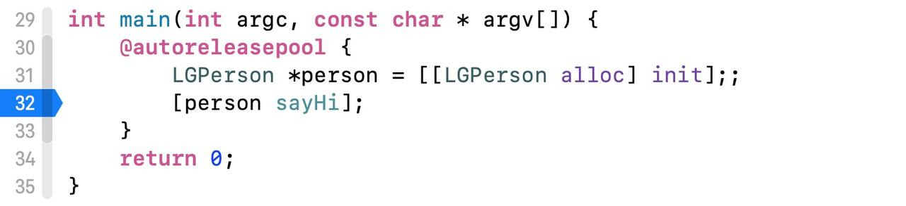

打开查看汇编

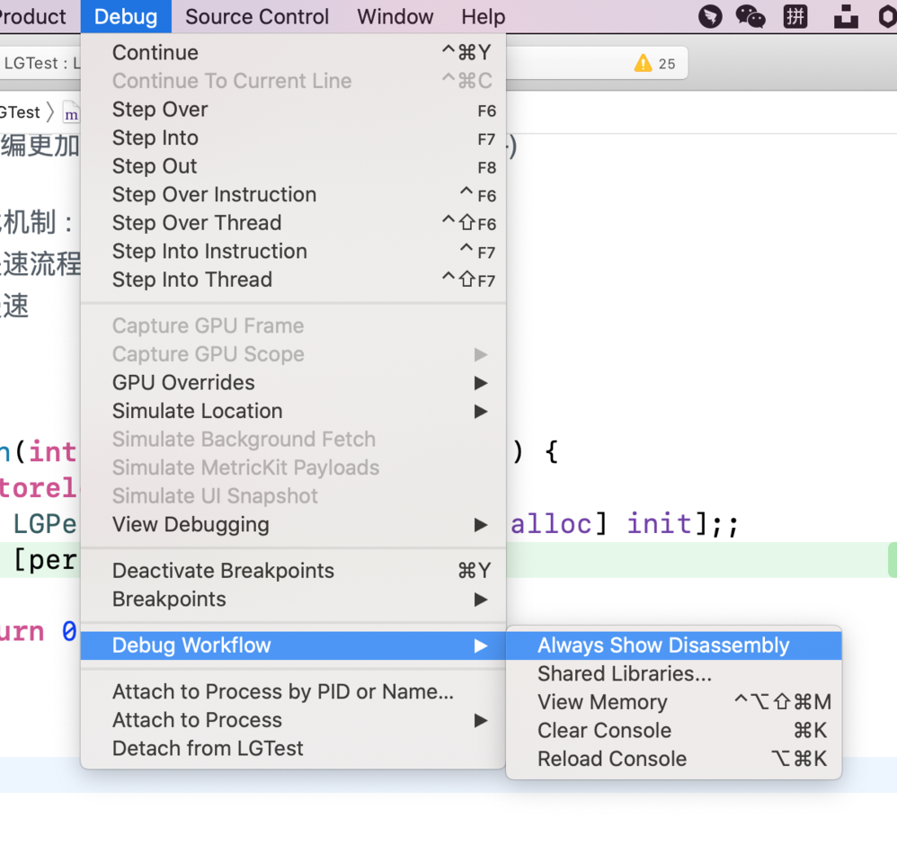

可以看到第18行 `sayHi` 被存入了rsi寄存器。17行好像还把什么存进了rax寄存器。打印出来看看，是一个 `LGperson` 对象。

存储完了在第20行调用了 `objc_msgSend` 方法！ 

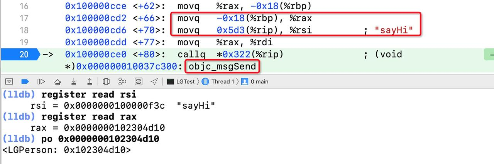

### 2、objc_msgSend 消息发送方法

我们来看看 `objc_msgSend` 是怎么定义的。第一个参数是 `id` 类型的消息处理者、第二个是 `SEL` 类型的方法表示。如果有需要的话后面还会跟上其他参数。这和上面的汇编代码流程对上了！ 

其实 `[person sayHi]` 等同于 `objc_msgSend(person, @selector(sayHi))` 。

`objc_msgSend` 的内部实现如下，其中最重要的就是 `CacheLookup NORMAL` 。 

### 3、`CacheLookup` 快速查找

我们来看看 `CacheLookup` 的定义。

在方法缓存里查找， `CacheLookup` 有3种参数 `NORMAL`、`GETIMP`、`LOOKUP` 。

当方法执行完成后如果找到了就会调用或者返回 `IMP` ，找不到的话就会执行 `CacheMiss` 。

这个时候我们还不知道 `CacheLookup` 后面的参数有什么用，带着这个问题继续看 

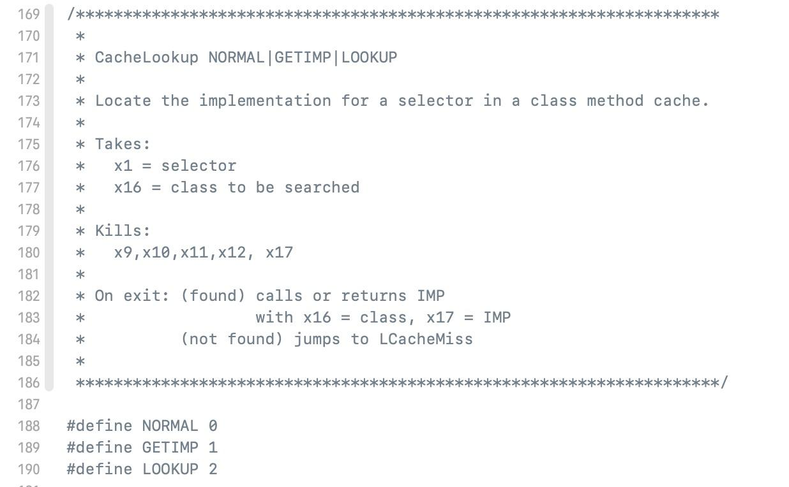

`CacheLookup` 的内部实现如下，我们需要关注的是 `CheckMiss` 和 `CacheHit` 方法。 

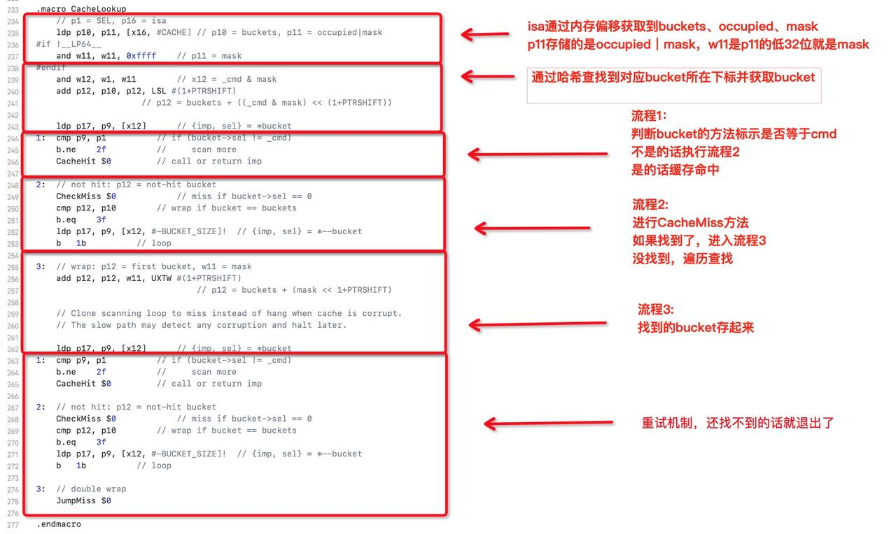

### 4、`CacheHit`

如果顺利在流程1就找到方法实现，会触发 `CacheHit` 。这时候我们看见了刚刚 `CacheLookup` 后面的参数，原来在这里用！至此方法就成功执行了。 

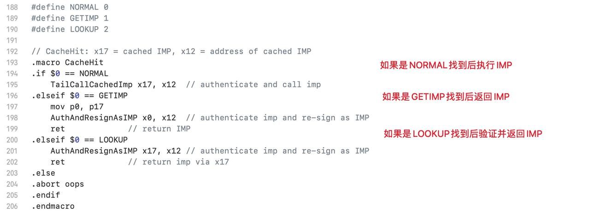

### 5、`CheckMiss`

如果在流程1中没有找到方法实现，也就是类的方法缓存中并没有该方法。这时就会触发 `CacheMiss` 。 `CacheLookup` 后面的参数在也用到了！为 `NORMAL` 时会调用 `__objc_msgSend_uncached` 方法 

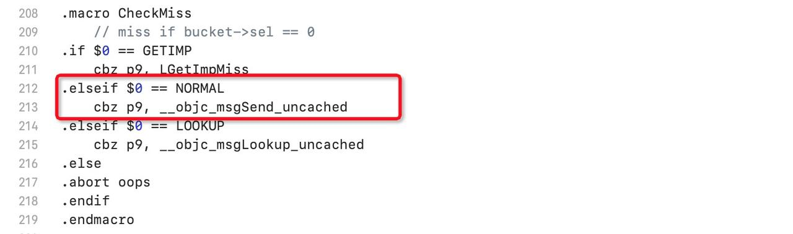

来看看 `__objc_msgSend_uncached` 又做了什么。很简单，缓存找不到就去方法列表里面查找 

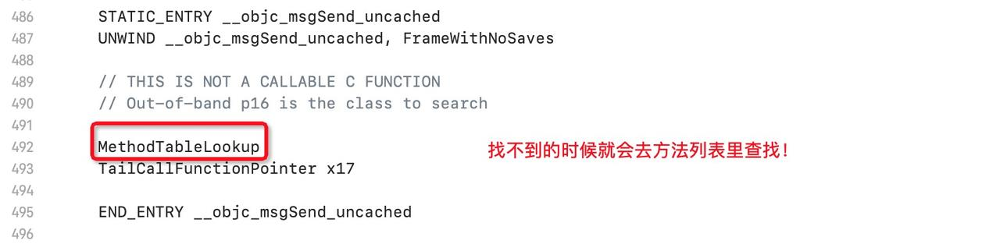

看汇编是真的痛苦，但是我们只要关注重点代码就可以了。这里这么长的一段，也就 `bl __class_lookupMethodAndLoadCache3` 这一行是关键。 `receiver`、`selector` 都存好了，就执行 `_class_lookupMethodAndLoadCache3` 函数 

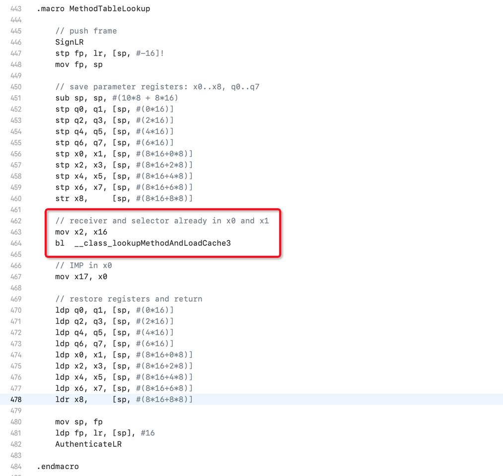

`_class_lookupMethodAndLoadCache3` 又是什么？很幸福终于回来了，不用啃汇编了！调用 `lookUpImpOrForward` 方法。 

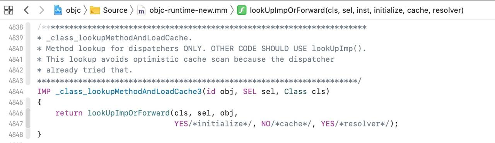
### 6、`lookUpImpOrForward` 慢速查找

`lookUpImpOrForward` 方法其实是开启了慢速查找流程，查找完自身方法缓存和方法列表以后会逐级向上对父类的方法缓存和方法列表进行查找。如果最后都无法找到方法实现，就会进入消息转发流程！

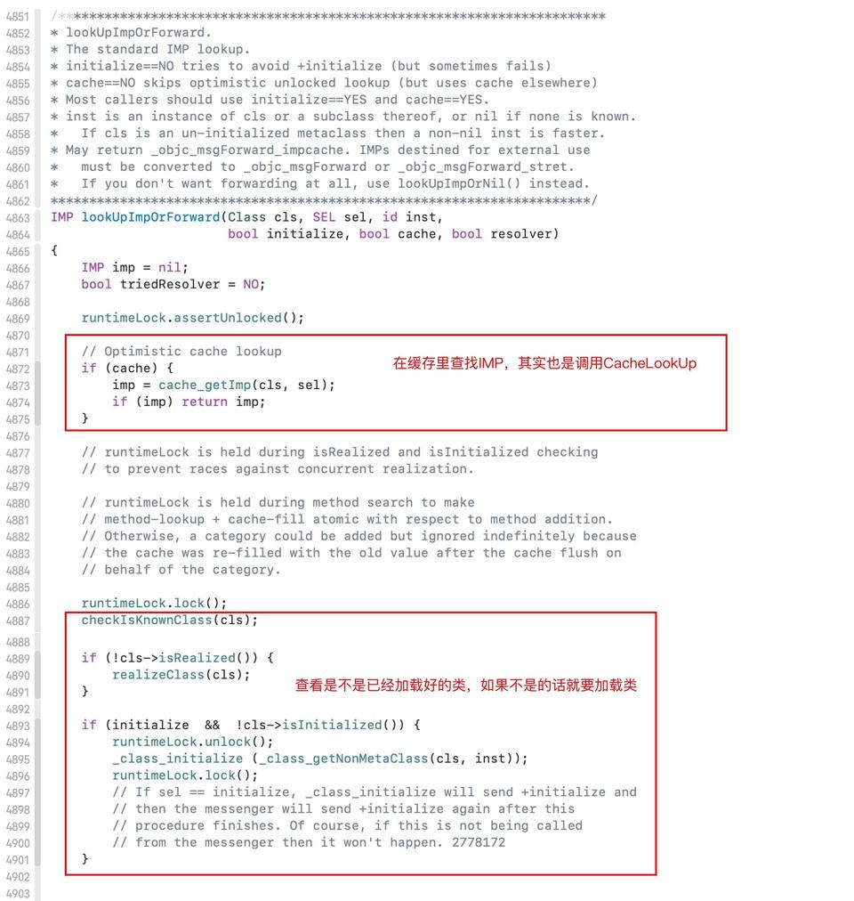

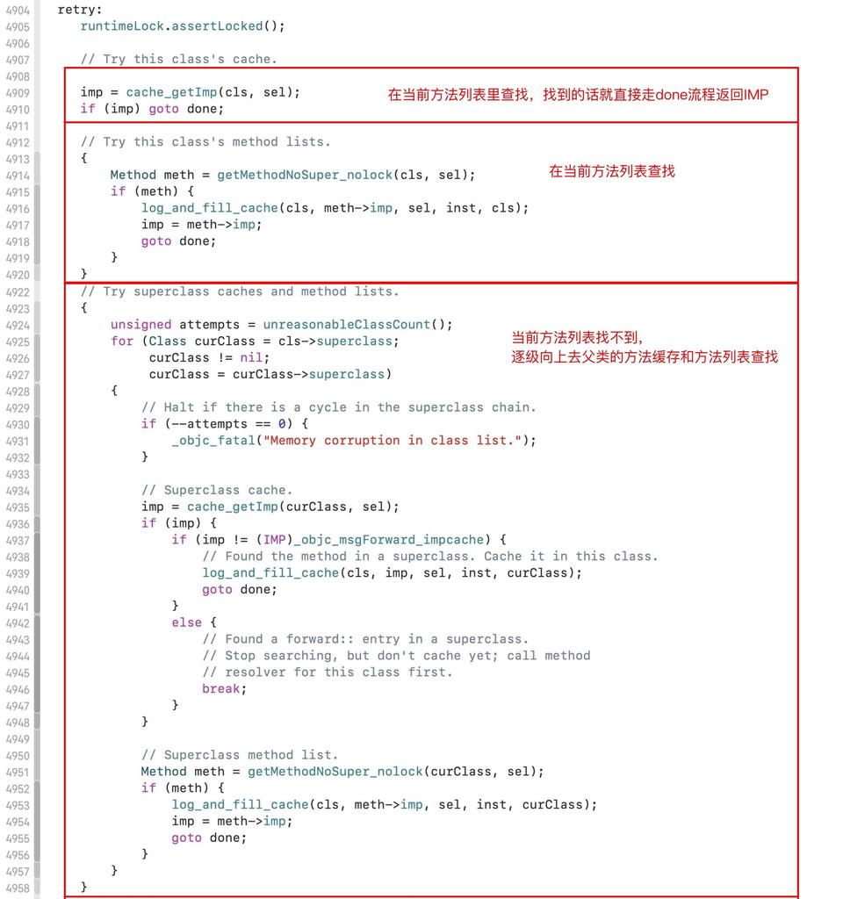

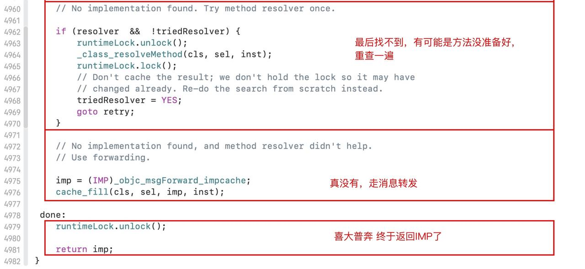

### 7、总结

**方法调用的本质是消息发送。**

底层执行了 `objc_msgSend` 函数，默认且必要参数是方法的执行者和方法的标示个。如果该方法有其他参数则添加在这两个参数后面。

看完了 `objc_msgSend` 的实现我们会有一些疑问，为什么 `objc_msgSend` 要用汇编实现呢？首要的原因是C语言函数没办法保留未知参数并跳转到任意一个函数指针，C语言没有这个特性。其次就是 `objc_msgSend` 是一个必须要快的流程，使用汇编效率高速度快。

方法调用前要进行方法查找，方法查找流程分为快速方法查找和慢速方法查找两部分。

快速方法查找会先在类的方法缓存中查找是否有目标方法，有则执行没有则进入方法列表查找。

如果在方法列表中找到了该方法会直接执行。找不到则开启慢速方法查找流程 `lookUpImpOrForward` 。慢速方法查找会逐级向上，往父类的方法缓存和方法列表里查找该方法。找到了返回该方法实现 `IMP` ，找不到的话会进入消息转发流程。

流程图如下：

* 方法调用 objc_msgSend

	* 快速查找CacheLookup

		* CacheHit
		* CacheMiss

			* __objc_msgSend_uncached
			* _class_lookupMethodAndLoadCache3
			* 慢速查找 lookUpImpOrForward

[iOS 方法调用 消息发送 objc_msgSend](https://juejin.cn/post/6844904137650339847)