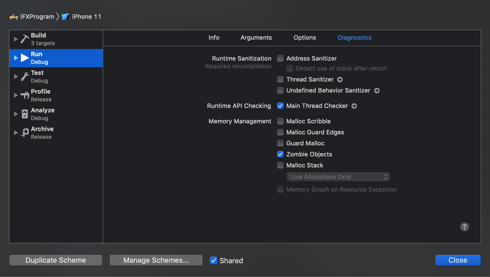

# iOS内存管理

## 1.1 iOS内存管理模式
对于面向过程的C语言而言，内存的申请和释放都由开发者手动管理。

在面向对象语言中，内存管理通常会由模型机制来完成，常见的有垃圾回收和引用计数两种内存管理模型。OC采用引用计数的内存管理模型。

### 1.1.1 关于内存消耗和引用计数

在iOS程序中，内存通常被分成如下5个区域。

* 栈区：存储局部变量，在作用域结束后内存会被回收
* 堆区：存储OC对象，需要开发者手动申请和释放
* BSS区：用来存储未初始化的全局变量和静态变量
* 数据区：用来存储已经初始化的全局变量、静态变量和常量
* 代码段：加载代码

除了堆区需要开发者手动进行内存管理外，其他区都由系统自动进行回收。

引用计数是OC语言提供的内存管理技术，每个对象都由一个retainCount属性。

### 1.1.2 MRC内存管理

原则：

* 谁持有对象，谁负责释放，不是自己持有的不能释放。
当对象不再被需要时，需要主动释放。

### 1.1.3 关于ARC

ARC是Xcode编译器的功能，就是在编译时帮助开发者将retain和release这样的方法补上。

在ARC中，编译器自动帮助我们进行retain的添加，开发者唯一要做的是使用指针指向这个对象，当指针被置空或者被指向新值时，原来的对象会被release一次。同样，对于自己生成的对象，当其离开作用域时，编译器也会为其添加一个release操作。

在ARC中，有几个修饰关键字非常重要，分别是__strong、__weak、__unsafe_unretained、__autoreleasing。我们使用的指针默认都是使用__strong关键字修饰的。

__strong修饰符通常用来对变量进行强引用，主要有以下三个作用：

* 使用__strong修饰的变量如果是自己生成的，则会被添加进自动释放池，在作用域结束后，会被release一次。
* 使用__strong修饰的变量如果不是自己生成的，则会被强引用，即会被持有使其引用计数增加1，在离开作用域后会被release一次。
* 使用__strong修饰的变量指针如果重新赋值或者被设置为nil，则变量会被release一次。

__weak修饰符通常用来对变量进行弱引用，其最大的用途是避免ARC环境下的循环引用问题。其作用如下：

* 被__weak修饰的变量仅提供弱引用，不会使其引用计数增加。变量对象如果是自己生成的，则会被添加到自动释放池，会在离开作用域时被release一次，如果不是自己生成的，则在离开作用域后，不会进行release操作。
* 被__weak修饰的变量指针，变量如果失效，则指针会被自动置为nil，这是一种比较安全的设计方式，大量减少野指针造成的异常。

__unsafe_unretained这个修饰符是不安全的，和上面__weak修饰符相比，这个修饰符的作用也是对变量进行弱引用，不同的是，当变量对象失效时，其指针不会被设置为nil。

__autorelease这个修饰符和自动释放池有关。

在使用ARC时，上面介绍的4个修饰符非常重要，此外还要牢记如下几条原则：

* 不能使用retain、release、autorelease方法，不能访问retainCount属性。
* 不能调用dealloc方法，可以覆写dealloc方法，但是在实现中不可调用父类的delloc方法。
* 不能使用NSAutoreleasePool，可以使用@autoreleasepool代替。
* 对象型变量不能作为C语言的结构体。

### 1.1.4 属性修饰符

### 1.1.5 ARC与MRC进行混编

在ARC项目中进行MRC的混编，首先需要确定项目环境为ARC，需要注意将Objective-C Automatic Reference Counting 选项设置为yes。

如果有某些文件需要使用MRC环境进行编译，则可以在工程的Build Phases选项中的Compile Sources区域找到对应的文件，双击添加`-fno-objc-arc`。

在MRC项目中，也可以通过类似的方法来对个别文件进行ARC混编，添加`-fobjc-arc`即可。

## 1.2 自动释放内存

### 1.2.1关于autorelease方法

release方法的作用是对当前对象进行一次释放操作，returnCount减一，内存的释放需要当引用计数被降为0时进行。

autorelease和release起到了一样的效果，只是release的效果被延迟。把使用了autorelease方法的对象称为自动释放对象，自动释放对象的内存管理是交给自动释放池处理。

### 1.2.2自动释放池

@autoreleasepool{}就是我们所说的自动释放池。

### 1.2.3系统维护的自动释放池

iOS系统在运行应用程序时，会自动创建一些线程，每一个线程都默认拥有自动释放池。还有一点需要额外注意，在每次执行事件循环时，都会将其自动释放池清空。

系统的自动释放池会在每次事件循环结束后清空，但是如果在大量的循环中生成自动释放对象，则有可能会导致内存消耗瞬间增长。进行如下修改后，内存的增长会平缓很多，这是我们常使用自动释放池进行的内存优化方法。
```
- (void)viewDidLoad {
    [super viewDidLoad];
    for (int i = 0; i < 10000; i++) {
        @autoreleasepool{
            UIView *view = [UIView new];
        }
    }
}
```

## 1.3 杜绝内存泄漏

### 1.3.1 Block与循环引用

使用弱引用指针即可。

```
__weak typeof(self) weakSelf = self;
self.myBlock = ^Bool (int param){
    NSLog@(@"%@",weakSelf);
    return YES;
}
```

### 1.3.2 代理与循环引用

使用weak关键字

```
@protocol MyDelegate<NSObject>
- (void)myEvent;
@end

@interface MyVC : UIViewController

@property(nonatomic, weak) id<MyDelegate> delegate;
@end
```

### 1.3.3 定时器（NSTimer）引起的内存泄漏

* 需要手动调用invalidate方法来使定时器失效。
* 使用类方法。
* 使用代理对象。

## 1.4 关于“对象”对象

当一个对象被释放后，如果其指针没有置空，则这个指针就变成了野指针，此时这个指针指向的就是“僵尸”对象。

### 1.4.1 捕获“僵尸”对象


在MRC下，一个常见的“僵尸”对象问题是过早地调用了release
```
NSObject *obj = [[NSObject alloc] init];
[obj release];
NSLog(@"%@",obj);
```

Xcode提供了一个工具可以帮助我们捕获”僵尸“对象：在Xcode工具栏中选择Product菜单，选择其中Scheme菜单下的Edit Scheme子菜单，在Run窗口中勾选Zombie Object选项。



### 1.4.2 处理“僵尸”对象

在ARC中，使用__strong和__weak修饰的变量指针在对象释放后会被自动设置为nil，这就大大减少了野指针的问题。我们也可以借助OC的消息机制来规避所有的“僵尸”对象问题。

### 1.5.2 Foundation和CoreFoundation框架混用

## 1.6 扩展：关于id与void*

### 1.6.1 关于id类型

id是OC中定义的一种泛型，它可以表示任何对象类型。其包含三层含义：

1. 作为参数或返回值
2. id类型的参数不会进行类型检查
3. id\<protocol>是一种优雅的编程方式

### 1.6.2 关于void和void*

void大多数时候用来表示“空”，而void *则完全不同，它所描述的实际上是任意类型的指针。

在ARC环境下编译器是不允许直接将id与void *进行转换，需要使用桥接方式进行转换。