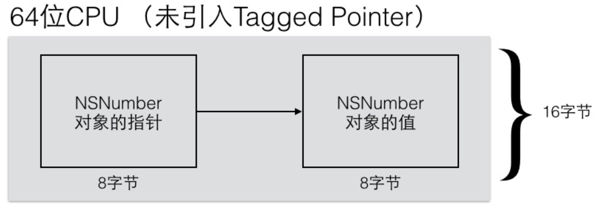
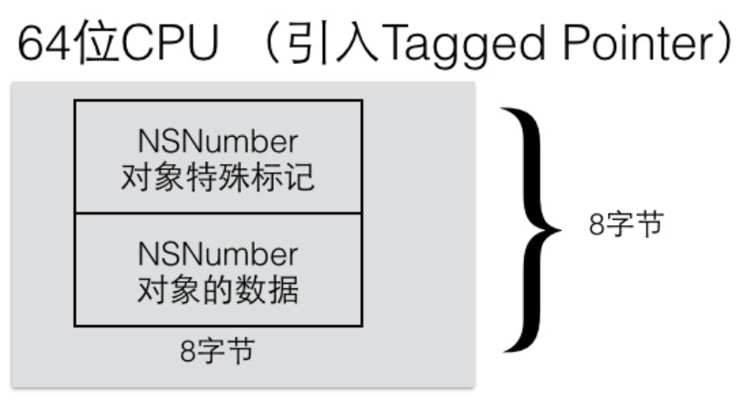
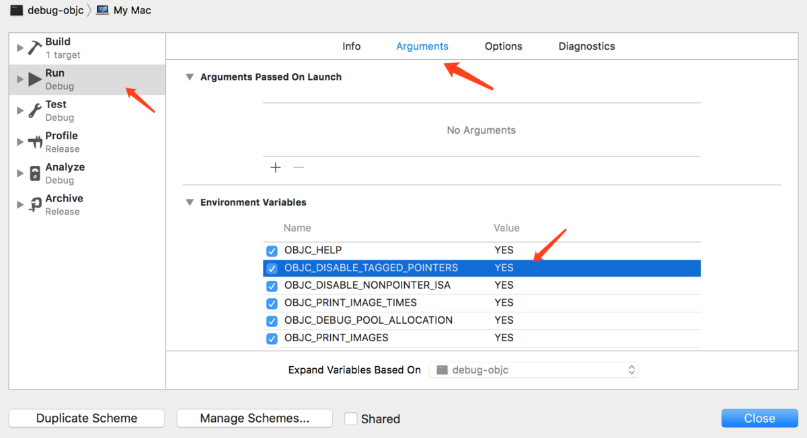

# iOS引用计数管理之揭秘计数存储

## 预备知识

要说清楚这个问题，我们需要先来了解下面的三个知识点。

调试环境如下。

```
macOS：10.13.4；
XCode：9.4；
调试设备：My Mac。
```

### Tagged Pointer

这个玩意的详细解释在 [这里](https://links.jianshu.com/go?to=https%3A%2F%2Fjuejin.im%2Fpost%2F58fe0c6561ff4b006671e789) ，简单的说64位系统下，对于值小（多小？后面有讲解）的对象指针本身已经存了值的内容了，而不用去指向一个地址再去取这个地址所存对象的值；相信你也知道了，如果是Tagged Pointer的话就少了创建对象的操作。

```
我们也可以在WWDC2013的《Session 404 Advanced in Objective-C》视频中，看到苹果对于Tagged Pointer特点的介绍：
1：Tagged Pointer专门用来存储小的对象，例如NSNumber和NSDate
2：Tagged Pointer指针的值不再是地址了，而是真正的值。所以，实际上它不再是一个对象了，它只是一个披着对象皮的普通变量而已。所以，它的内存并不存储在堆中，也不需要malloc和free。
3：在内存读取上有着3倍的效率，创建时比以前快106倍。
```





我们来测试一下。

```
NSLog(@"%p",@(@(1).intValue));//0x127
NSLog(@"%p",@(@(2).intValue));//0x227
由此可知int类型的tag为27，因为去掉27后0x1 = 1，0x2 = 2，正好是值。

NSLog(@"%p",@(@(1).doubleValue));//0x157
NSLog(@"%p",@(@(2).doubleValue));//0x257
由此可知double类型的tag为57，因为去掉27后0x1 = 1，0x2 = 2，正好是值。

明显0x127、0x257不是一个地址，所以@(1)、@(2)也不是一个对象，只是一个普通变量。
```

既然是Tagged Pointer那肯定得有一个tag，经过测试发现值类型不一样所具有的tag也会相对不一样。

```
为什么说相对，因为测试发现unsigned long和long long具有相同的tag值37。
当然其他类型也有一样的。
```

什么时候NSNumber对象Tagged Pointer失效呢？那就是当值和tag加起来占用的字节数要超过地址长度(8字节64位)时会失效：

```
为什么说要超过，而不是超过，这个我也比较纠结，具体的看看下面的例子。
```

这里针对double类型来举个例子，其他类型的结果可能稍有不同，因为上面说到tag有不同的值，所占用二进制位长度会不一样。

```
int 17：10001，5位；
long long 37：100101，6位；
double 57：111001，6位。
...
```

这样64减去已占用的tag位，剩下的位来表示值，所能表示的范围也不一样。

```
double pow(double, double)返回的是double类型的值。

NSLog(@"%p",@(pow(2, 55) - 3));//0x7ffffffffffffc57
57是double类型的tag，0x7ffffffffffffc57去掉tag剩下的是0x7ffffffffffffc = 
pow(2, 55) - 3 = 36028797018963964；二进制表示为0...0(9个)1...1(53个)00(2个)。
关于这里为什么要-3这就是我比较纠结的原因，因为二进制表示后面还有2个0啊，还可以多表示3啊；
系统这么做肯定有自己的考虑，也许是我理解错了，希望你来指正。

NSLog(@"%p",@(pow(2, 55) - 2));//0x6030002c50c0
这个单纯就是一个地址了，没有57这个tag了，里面并没有存值的内容，所以Tagged Pointer失效了。

从这个例子可以知道tag占用8位，64 - 55 = 9，9 - 1 = 8，因为第一位是来做符号位表示正负数的；
上面我们测试出来57占用6个二进制位，为什么这里值最长占用56二进制长度呢，我也不知道。

关于Tagged Pointer是否启用，你也可以通过下面的语句来打印，这个语句是runtime源码中的。
NSNumber *number = @(pow(2, 55) - 3);
NSLog(@"%d",((uintptr_t)number & 1UL) == 1UL);//true
number = @(pow(2, 55) - 2);
NSLog(@"%d",((uintptr_t)number & 1UL) == 1UL);//false
```

目前我所知的系统中可以启用Tagged Pointer的类对象有：NSDate、NSNumber、NSString，上面我们只举例了NSNumber，你可以自己下来试试另外的。
当然了你可以在环境变量中设置OBJC_DISABLE_TAGGED_POINTERS=YES强制不启用Tagged Pointer，环境变量我们可以添加很多东西的，具体的你可以看看runtime源码的objc-env.h文件。



不启用Tagged Pointer

这样runtime就会做相应的处理了。
不启用后上面的例子就会得到这样的结果，也就表示关闭成功了。

```
NSLog(@"%p",@(pow(2, 55) - 3));//0x6030002ccbc0
NSLog(@"%p",@(pow(2, 55) - 2));//0x6030002ccc50

NSNumber *number = @(pow(2, 55) - 3);
NSLog(@"%d",((uintptr_t)number & 1UL) == 1UL);//false
number = @(pow(2, 55) - 2);
NSLog(@"%d",((uintptr_t)number & 1UL) == 1UL);//false
```

### Non-pointer isa

我们一直认为实例对象的isa都指向类对象，甚至还看到这样的源码。

```
typedef struct objc_object *id
struct objc_object {
    Class _Nonnull isa;
}
```

其实这是之前版本的代码了，现在版本的代码早就变了。

```
struct objc_object {
private:
    isa_t isa;
  ...
}
```

所以实例对象的isa都指向类对象这样的说法不对。
现在实例对象的isa是一个isa_t联合体，里面存了很多其他的东西，相信你也猜到了引用计数也在其中；如果该实例对象启用了Non-pointer，那么会对isa的其他成员赋值，否则只会对cls赋值。

```
union isa_t {
  Class cls;
  ...
  (还有很多其他的成员，包括引用计数数量)
}
```

对象是否不启用Non-pointer目前有这么几个判断条件，这些都可以在runtime源码objc-runtime-new.m中找到逻辑。

```
1：包含swift代码；
2：sdk版本低于10.11；
3：runtime读取image时发现这个image包含__objc_rawisa段；
4：开发者自己添加了OBJC_DISABLE_NONPOINTER_ISA=YES到环境变量中；
5：某些不能使用Non-pointer的类，GCD等；
6：父类关闭。
```

我们自己新建一个Person类，通过OBJC_DISABLE_NONPOINTER_ISA=YES/NO来看看isa结构体的具体内容，设置方法上面有截图。

```
设置了OBJC_DISABLE_NONPOINTER_ISA不一定就使用Non-pointer了，因为上面说到了还有其他条件会关闭Non-pointer。
所以我们自己创建一个Person类继承自NSObject，这样只通过在环境变量中设置OBJC_DISABLE_NONPOINTER_ISA
就可以控制Person对象是否启用Non-pointer，因为我们排除了除4之外的其他条件。
```

### 不使用Non-pointer的isa

```
isa_t isa = {
    Class class = Person;
    uintptr_t bits = 4294976320;
    struct {
        uintptr_t nonpointer = 0;
        uintptr_t has_assoc  = 0;
        uintptr_t has_cxx_dtor = 0;
        uintptr_t shiftcls = 536872040; 
        uintptr_t magic = 0;
        uintptr_t weakly_referenced = 0;
        uintptr_t deallocating = 0;
        uintptr_t has_sidetable_rc = 0;
        uintptr_t extra_rc = 0;
    }
}
其实可以简化为
isa_t isa = {
    Class class = Person;
}
因为源码中显示不使用Non-pointer则只对isa的class赋值了，其他的都是默认值，而且除了class其他成员也不会在源码中被使用到。
```

### 使用Non-pointer的isa

```
isa_t isa = {
    Class class = Person;
    uintptr_t bits = 8303516107940673;
    struct {
        uintptr_t nonpointer = 1;
        uintptr_t has_assoc  = 0;
        uintptr_t has_cxx_dtor = 0;
        uintptr_t shiftcls = 536872040; 
        uintptr_t magic = 59;
        uintptr_t weakly_referenced = 0;
        uintptr_t deallocating = 0;
        uintptr_t has_sidetable_rc = 0;
        uintptr_t extra_rc = 0;
    }
}
extra_rc就是存的引用计数，nonpointer = 1表示启用Non-pointer。
```

isa的赋值是在alloc方法调用时，内部会进入initIsa()方法，你可以进去看一看有啥不同之处。

```
objc_object::initIsa(Class cls, bool nonpointer, bool hasCxxDtor) { 
    if (!nonpointer) {
        isa.cls = cls;
    } else {
        isa_t newisa(0);
        ......
        (成员赋值)
        ......
        isa = newisa;
    }
}
```

### SideTable

散列表，这是一个比较重要的数据结构，相信你也猜到了这个和对象引用计数有关；如果该对象不是Tagged Pointer且关闭了Non-pointer，那该对象的引用计数就使用SideTable来存。我们先来看一下SideTable结构体定义，至于怎么被使用的且听我慢慢道来。

```
struct SideTable {
    //锁
    spinlock_t slock;
    //强引用相关
    RefcountMap refcnts;
    //弱引用相关
    weak_table_t weak_table;
      ...
}
```

启动应用后，我们第一次看到SideTable其实是在runtime读取image的时候。

```
void map_images_nolock(unsigned mhCount, const char* const mhPaths[],
                  const struct mach_header *const mhdrs[]) {
    ...
    static bool firstTime = YES;
    if (firstTime) {
        AutoreleasePoolPage::init();
        SideTableInit();
    }
    ...  
}
static void SideTableInit() {
    new (SideTableBuf)StripedMap<SideTable>();
}
```

map_images_nolock会多次调用，因为ImageLoader一批加载很多个image到内存，然后通知runtime去读取这一批image，没错这时候runtime开始从image中处理类了；SideTableInit()方法只会执行一次。SideTableInit内部用到了SideTableBuf，SideTableBuf的定义如下。

```
alignas(StripedMap<SideTable>) static uint8_t
    SideTableBuf[sizeof(StripedMap<SideTable>)];
sizeof(StripedMap<SideTable>) = 4096；
alignas(StripedMap<SideTable>)是字节对齐的意思，表示让数组中每一个元素的起始位置对齐到4096的倍数，也可以说是对数组/数组第一个元素对齐，也把数组中每一个元素都变成了4096大小，能理解吧。
所以这句话就简化为static uint8_t SideTableBuf[4096]，也就是定义了一个4096大小类型为uint8_t的数组，每一个元素大小为4096，名字为SideTableBuf;

现在来理解SideTableInit()中的new (SideTableBuf)StripedMap<SideTable>()。你会发现这句话没有
任何意思（这里确实不太了解，可能是做了啥事情。。。），你注释后一样可以正常运行。因为上面那句话已经初始化SideTableBuf了，怎么说？看下面。

在SideTableBuf定义上方有这样的一段注释。
We cannot use a C++ static initializer to initialize SideTables because
libc calls us before our C++ initializers run. We also don't want a global 
pointer to this struct because of the extra indirection.
Do it the hard way.
我来翻译一下：我们不能用C++静态初始化方法去初始化SideTables，
因为C++初始化方法运行之前libc就会调用我们；我们同样不想用一个全局的指针去指向SideTables，
因为需要额外的代价。但是没办法我们只能这样。
看不懂没关系，下面就是答案。

什么是C++ static initializer呢，我们依然可以在runtime源码中找到答案。在objc-os.mm中有这样的代码。
size_t count;
Initializer *inits = getLibobjcInitializers(&_mh_dylib_header, &count);
for (size_t i = 0; i < count; i++) {
    inits[i]();
}
是的，这个就是在调用C++的initializer了，这个操作在map_images_nolock之前执行，也就是这时候还没有执行SideTableInit()。

我们打印出其中一个方法名。
......
libobjc.A.dylib`defineLockOrder() at objc-os.mm:674
......
然后我们去defineLockOrder()方法中打个断点，跟踪一波。
__attribute__((constructor)) static void defineLockOrder() {
    ......
    SideTableLocksPrecedeLock(&crashlog_lock);
    ......
}
void SideTableLocksPrecedeLock(const void *newlock) {
    SideTables().precedeLock(newlock);
}
然后会进入这个方法。
static StripedMap<SideTable>& SideTables() {
    return *reinterpret_cast<StripedMap<SideTable>*>(SideTableBuf);
}
你会发现这里已经在使用SideTableBuf了，说明SideTableBuf肯定提前被赋值了。而我们刚才说了SideTableInit()方法调用是C++的initializer调用之后，这也就是注释说的内容。
白话文翻译一下：通过SideTableInit()来初始化SideTable是不对的，因为在SideTableInit()之前会先执行C++的initializer，而在那个时候就已经用到SideTable了，所以我们才用静态全局变量来初始化SideTable，文件被加载就会初始化。
```

你会在runtime源码中经常看到这样的代码，其实刚才说到：C++的initializer调用阶段也用到了。

```
SideTable &table = SideTables()[this];
static StripedMap<SideTable>& SideTables() {
    return *reinterpret_cast<StripedMap<SideTable>*>(SideTableBuf);
}
```

所以我们很有必要理解这句话什么意思。StripedMap是一个模版类，熟悉C++的应该非常熟悉这个，来看看StripedMap<SideTable>会生成怎样的一个类。

```
//简化版本，宏啥的都替换了
class StripedMap {
    //存SideTable的结构体
    struct PaddedT {
        SideTable value;
    };
    PaddedT array[64];
    //取得p的哈希值，p就是实例对象的地址
    static unsigned int indexForPointer(const void *p) {
        uintptr_t addr = reinterpret_cast<uintptr_t>(p);
        return ((addr >> 4) ^ (addr >> 9)) % 64;
    }
public:
    T& operator[] (const void *p) { 
        return array[indexForPointer(p)].value; 
    }
    const T& operator[] (const void *p) const { 
        return const_cast<StripedMap< SideTable >>(this)[p]; 
    }
    ...
}
```

这样一来就很清晰了，StripedMap里面有一个PaddedT数组，StripedMap重载了[]符号，根据参数的哈希值取PaddedT数组的内容，数组里存的就是SideTable。
现在来理解reinterpret_cast什么意思。

```
reinterpret_cast：转换一个指针为其它类型的指针等，我们没必要去深究，这样理解就够了。
```

所以

```
SideTable &table = SideTables()[this];
static StripedMap<SideTable>& SideTables() {
    return *reinterpret_cast<StripedMap<SideTable>*>(SideTableBuf);
}
意思就是：将SideTableBuf转换为StripedMap<SideTable>*类型并返回，也就
是把SideTableBuf当成StripedMap使用，这也是为什么要写
alignas(StripedMap<SideTable>)的原因，这样SideTableBuf数组每一个元素都正好
对应一个StripedMap<SideTable>对象。
```

这里要特别注意了，会有哈希冲突吗？

```
我们创建两个不同的类Person和Car，打印一下通过indexForPointer得到的哈希值。
哈希值计算公式：((addr >> 4) ^ (addr >> 9)) % 64；addr就是实例对象的地址。这个公式岁随便写的吧，看不出啥端倪。

Person *one = [[Person alloc] init];
NSLog(@"%p",one);//0x60200000bf30 105690555268912
indexForPointer(105690555268912) = 44;

Car *two = [[Car alloc] init];
NSLog(@"%p",two);//0x6030002c9710 105759277618960
indexForPointer(105759277618960) = 58;

计算出来的哈希值确实是不一样的，我们可以手动更改哈希算法把哈希值都设置为1，看看程序是否能正常运行。
也就是更改这个方法。
static unsigned int indexForPointer(const void *p) {
      return 1;
}

然后我们打印one和two的retainCount看是否正确。
[one retain];
NSLog(@"%d",[one retainCount]);//2 
[two retain];
NSLog(@"%d",[two retainCount]);//2
看来都没问题，那么系统是怎么解决哈希冲突并成功的进行存取值的呢？我们下面讲。
```

## 进入正题

下面我们就开始看看对象的引用计数到底存哪里了。我先把判断优先级写一下。

```
1：对象是否是Tagged Pointer对象；
2：对象是否启用了Non-pointer；
3：对象未启用Non-pointer。
```

满足1则不判断2，依次类推。

### Tagged Pointer对象

retain时。

```
id objc_object::rootRetain(bool tryRetain, bool handleOverflow) {
    if (isTaggedPointer()) return (id)this;
    ...
}
```

release时。

```
bool  objc_object::rootRelease(bool performDealloc, bool handleUnderflow) {
    if (isTaggedPointer()) return false;
    ...
}
```

retainCount时。

```
uintptr_t objc_object::rootRetainCount() {
    if (isTaggedPointer()) return (uintptr_t)this;
    ...
}
```

由此可见对于Tagged Pointer对象，并没有任何的引用计数操作，引用计数数量也只是单纯的返回自己地址罢了。

### 开启了Non-pointer

retain时。

```
id objc_object::rootRetain(bool tryRetain, bool handleOverflow) {
    ...
    //其实就是对isa的extra_rc变量进行+1，前面说到isa会存很多东西
    addc(newisa.bits, 1, 0, &carry);
    ...
}
```

release时。

```
bool  objc_object::rootRelease(bool performDealloc, bool handleUnderflow) {
    ...
    //其实就是对isa的extra_rc变量进行-1
    subc(newisa.bits, 1, 0, &carry);
    ...
}
```

retainCount时。

```
uintptr_t objc_object::rootRetainCount() {
    ...
    //其实就是获取isa的extra_rc值再+1，alloc新建一个对象时bits.extra_rc为0并不是1，这个要注意。
    uintptr_t rc = 1 + bits.extra_rc;
    ...
}
```

如果对象开启了Non-pointer，那么引用计数是存在isa中的，引用计数超过255将附加SideTable辅助存储。
更新：看网络上该系列文章时发现自己漏了一个细节，那就是extra_rc是有存储限制，经过测试为255，如果超过255将会附加SideTable辅助存储。详细解释看 [这里](https://www.jianshu.com/p/18c3e88dfbf1) 。

### 未开启Non-pointer isa

这个是最麻烦的，因为要用到SideTable，里面一大堆逻辑；我们拿上面的Person举例，请记住对象的地址。
retain时。

```
id objc_object::rootRetain(bool tryRetain, bool handleOverflow) {
    ...
   sidetable_retain();
    ...
}
id objc_object::sidetable_retain() {
    SideTable& table = SideTables()[this];
}
```

在这里不得不讲清楚SideTable的内部实现了，如果不讲清楚则没办法继续看代码。

```
SideTable中有三个结构体。
spinlock_t：锁，这个就不用说了，一个支持多线程环境运行的库肯定得考虑这个；
weak_table_t：weak表就是这个，用来处理弱引用的，不过本文不讲；
RefcountMap：引用表，引用计数就是这个存的，这个要好好的说明白。

RefcountMap的定义：
typedef objc::DenseMap<DisguisedPtr<objc_object>,size_t,true> RefcountMap;
又臭又长，本来想把类展开出来的，但是发现类会非常的大，而且很难懂；所以我这里讲一下逻辑就可以了，你感兴趣可以深入看看。
当我们第一次通过SideTables()[this]取得table时，这个table中refcnts内容是空的。
（我们省略spinlock_t和weak_table_t）：
SideTable table = {
    ...
    RefcountMap refcnts = {  
        BucketT *Buckets = NULL;
        unsigned NumEntries = 0;
        unsigned NumTombstones = 0;
        unsigned NumBuckets = 0;
    }
    ...
}
接下来程序会执行size_t &refcntStorage = table.refcnts[this];这句话是在干嘛呢？
RefcountMap继承自DenseMapBase，DenseMapBase中重载了[]操作符，所以会进入[]，下面的代码是我展开后的部分代码，方便理解。
class DenseMapBase {
    ...
    //目的很明确，就是取得一个pair<DisguisedPtr<objc_object>, size_t>
    size_t &operator[](DisguisedPtr<objc_object> &&Key) {
        pair<DisguisedPtr<objc_object>, size_t> &reslut = FindAndConstruct(Key);
        return reslut.second;
    }
    ...
}
这里要注意一个细节，因为我们传进来的是this，而这里是用DisguisedPtr<objc_object>来接收的。
所以会触发DisguisedPtr的初始化方法，所以this被转成了下面的对象。
class DisguisedPtr Key =  {
    uintptr_t  value = 18446638383154282704;
}
下面来看FindAndConstruct()做了什么。
pair<DisguisedPtr<objc_object>, size_t>& FindAndConstruct(const DisguisedPtr<objc_object> &Key) {
    //先定义一个用于接收结果的pair对象，关于pair我们肯定很熟悉了，相当于字典的一个key-value对，
    //pair.first就是实例对象地址转换成的DisguisedPtr< objc_object >类，pair.second就是这个对象的引用计数数量。
    pair<DisguisedPtr<objc_object>, size_t> *TheBucket = nil;
    //如果找到了直接返回，因为TheBucket会在LookupBucketFor中被赋值
    if (LookupBucketFor(Key, TheBucket))
        return *TheBucket;
    //没有找到，就插入一个
    return *InsertIntoBucket(Key, ValueT(), TheBucket);
}
//看看能不能找到key对于的pair<DisguisedPtr<objc_object>, size_t>
bool LookupBucketFor(const LookupKeyT &Val,
                             const BucketT *&FoundBucket) const {
    const  pair<DisguisedPtr<objc_object>, size_t> *BucketsPtr = getBuckets();
    const unsigned NumBuckets = getNumBuckets();
    ......  
    （代码还是不贴出来了，我相信你也不想看，总结起来就是从buckets()中找到该实例对象对应的pair<DisguisedPtr<objc_object>, size_t>）
}
总结：
1：取table时我们知道了对象的哈希值是可能一样的，如果哈希值一样那么会得到相同的table；
2：相同的table又会根据对象转换成的DisguisedPtr<objc_object>对象在buckets中去取pair<DisguisedPtr<objc_object>, size_t>对；如果没有就会插入一条；
插入到buckets哪个位置呢？哈希算法如下。
static inline uint32_t ptr_hash(uint64_t key) {
    key ^= key >> 4;
    key *= 0x8a970be7488fda55;//这个是随意写的吧，没发现啥特别的
    key ^= __builtin_bswap64(key);
    return (uint32_t)key;
}
为此我依然做了一个测试，我把ptr_hash的值都返回1，模拟哈希冲突。
static inline uint32_t ptr_hash(uint64_t key) {
    return (uint32_t)1;
}
然后我们打印one和two的retainCount看是否正确。
[one retain];
NSLog(@"%d",[one retainCount]);//2 
[two retain];
NSLog(@"%d",[two retainCount]);//2
经过测试依然是正确的，说明内部会解决哈希冲突，也说明了这个哈希算法并不能产生唯一的值。这也就解决了
上面留下的问题，获取table的时候没有解决哈希冲突，而是在查找pair对的时候有解决哈希冲突，方法就是
找到下一个可用的位置，这也是很常见的哈希冲突解决方法；另外一个方法是用链表存所有哈希值一样的value，不过系统在这里并没有用这种方法。
3：这个buckets的大小是会动态改变的，这也是
RefcountMap refcnts = {  
    BucketT *Buckets = NULL;
    unsigned NumEntries = 0;
    unsigned NumTombstones = 0;
    unsigned NumBuckets = 0;
}中后三个变量的作用；装逼点的说法就是让数组具有伸缩性，提前处理一些临界值情况。
```

所以我们可以把refcnts中的Buckets看成一个数组，根据对象地址产生的哈希值和哈希冲突算法肯定能在Buckets中找到其对应的pair；我们接着往下走。

```
id objc_object::sidetable_retain() {
    ...
    //取得该实例对象在该table中对应pair<DisguisedPtr<objc_object>, size_t>对中size_t的引用，默认值为0。
    size_t &refcntStorage = table.refcnts[this];
    //SIDE_TABLE_RC_PINNED的值在64位系统为1<<63，也就是pow(2,63)
    if ((refcntStorage & SIDE_TABLE_RC_PINNED) == false) {
        //SIDE_TABLE_RC_ONE的值为4，为什么要以4为单位，我不知道，估计是控制最大引用计数的值吧。
        refcntStorage += SIDE_TABLE_RC_ONE;
    }
    return (id)this;
}

我们知道了refcntStorage值最大为pow(2,63)-4，因为再加refcntStorage & SIDE_TABLE_RC_PINNED就为false了。
而引用计数最大为(pow(2,63) - 4) >> 2  + 1 = pow(2,61) = 2305843009213693952，为什么要+1？后面会说。

还是需要数据说话，不然有人不相信。
unsigned long number = SIDE_TABLE_RC_PINNED;//pow(2,63)
unsigned long first = (unsigned long)pow(2, 63) - 4;
unsigned long second = (unsigned long)pow(2, 63);
unsigned long max = first >> 2;
unsigned long max111 = (unsigned long)pow(2, 61);
(lldb) po second & number
9223372036854775808
(lldb) po first & number
0
(lldb) po max
2305843009213693951
(lldb) po max111
2305843009213693952
```

retain我们就说完了，其实release也是这样的逻辑。
release时。

```
前面的逻辑一样，拿到实例对象对应的pair。
uintptr_t objc_object::sidetable_release(bool performDealloc) {
    ...
    //迭代器，it指向的就是pair<DisguisedPtr<objc_object>, size_t>
    RefcountMap::iterator it = table.refcnts.find(this);
    ...
    //SIDE_TABLE_RC_ONE = 4
    it->second -= SIDE_TABLE_RC_ONE;
    ...
}
```

retainCount时。

```
uintptr_t objc_object::sidetable_retainCount() {
    SideTable& table = SideTables()[this];
    //这就是上面为什么说要+1的原因
    size_t refcnt_result = 1;
    //迭代器，it指向的就是pair<DisguisedPtr<objc_object>, size_t>
    RefcountMap::iterator it = table.refcnts.find(this);
    if (it != table.refcnts.end()) {
        //SIDE_TABLE_RC_SHIFT = 2
        refcnt_result += it->second >> SIDE_TABLE_RC_SHIFT;
    }
    ...
}
```

## 总结

这篇文章主要是讲了引用计数存在哪里，这只是庞大的引用计数管理中一个小的细节；引用计数管理还有其他的问题，比如。

```
1：系统怎么存weak变量，什么时候把weak变量置为nil的？
2：autorelease、autoreleasepool以及RunLoop怎么合作的？
3：ARC相对于MRC多出了什么内容？
......
```

后面有时间我会写成文章的。

[iOS引用计数管理之揭秘计数存储](https://www.jianshu.com/p/17817e6efaf5)