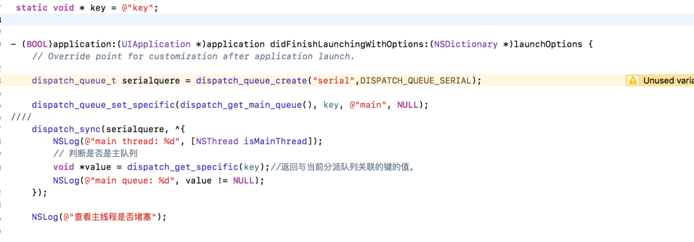

# 『ios』主线程 和 主队列的关系，绝对安全的UI操作，主线程中一定是主队列？




## 一直想搞清楚主线程和主队列的关系。

其实我一直带着这么几个问题。 
1. 主线程中的任务一定在主队列中执行吗？ 
2. 如何保证一定在主线程中执行？
3. 如何保证既在主线程中执行又在主队列中执行？

**下面我们带着这几个问题来看下面的文章**。

先来认识这几个方法

```
//给指定的队列设置标识
dispatch_queue_set_specific(dispatch_queue_t queue, const void *key,
        void *_Nullable context, dispatch_function_t _Nullable destructor);
queue：需要关联的queue，不允许传入NULL。
key：唯一的关键字。
context：要关联的内容，可以为NULL。
destructor：释放context的函数，当新的context被设置时，destructor会被调用

//获取当前所在队列的标识，根据唯一的key取出当前queue的context，如果当前queue没有key对应的context，则去queue的target queue取，取不着返回NULL，如果对全局队列取，也会返回NULL。
dispatch_get_specific(key)
//获取指定队列的标识
dispatch_queue_get_specific(dispatch_queue_t queue, const void *key);
```

## 第一种情况

```
    char *key = "key";
//给主队列设置标识
    dispatch_queue_set_specific(dispatch_get_main_queue(), key, @"main", NULL);
//放到同步队列中 全局并发队列中
    dispatch_sync(dispatch_get_global_queue(0, 0), ^{
        NSLog(@"main thread: %d", [NSThread isMainThread]);
        // 判断是否是主队列
        void *value = dispatch_get_specific(key);//返回与当前分派队列关联的键的值。
        NSLog(@"main queue: %d", value != NULL);
    });
```

打印的结果：

```
main thread: 1 //是主线程
main queue: 0 //不是主队列
```

分析：不是主队列是因为 在全局并发队列中，但是在全局并发队列中，为何又在主线程执行呢？经过查阅资料发现，苹果是为了性能，所以在主线程执行，线程切换是耗性能的。

### 第二种情况

```
//异步加入到全局并发队列中
 dispatch_async(dispatch_get_global_queue(0, 0), ^{
//异步加入到主队列中
        dispatch_async(dispatch_get_main_queue(), ^{
            NSLog(@"main thread: %d", [NSThread isMainThread]);
            NSLog(@"%@",[NSThread currentThread]);
            // 判断是否是主队列
            void *value = dispatch_get_specific(key);//返回与当前分派队列关联的键的值。
            NSLog(@"main queue: %d", value != NULL);
        });
    });
    NSLog(@"dispatch_main会堵塞主线程");
    dispatch_main();
    NSLog(@"查看是否堵塞主线程");
```

打印结果：

```
dispatch_main会堵塞主线程
main thread: 0  //不是主线程
<NSThread: 0x600000b73b80>{number = 3, name = (null)}//不是主线程
main queue: 1   //是主队列
```

分析：明明是在dispatch_get_main_queue()中，为何不是在主线程执行呢？是不是很颠覆三观？原因再 dispatch_main()这个函数。这个函数的作用，经过查阅资料和读文档获取：

```
/*!
 * @function dispatch_main
 *
 * @abstract
 * Execute blocks submitted to the main queue.
 * 执行提交给主队列的任务blocks
 *
 * @discussion
 * This function "parks" the main thread and waits for blocks to be submitted
 * 
 * to the main queue. This function never returns.
 * 
 * Applications that call NSApplicationMain() or CFRunLoopRun() on the
 * main thread do not need to call dispatch_main().
 *
 */
API_AVAILABLE(macos(10.6), ios(4.0))
DISPATCH_EXPORT DISPATCH_NOTHROW DISPATCH_NORETURN
void
dispatch_main(void);
这个函数会阻塞主线程并且等待提交给主队列的任务blocks完成，这个函数永远不会返回.
这个方法会阻塞主线程，然后在其它线程中执行主队列中的任务，这个方法永远不会返回（意思会卡住主线程）.
```

也就是说，把主队列中的任务在其他线程中执行。所以用了dispatch_get_main_queue也不一定是主线程的。
加上这个

```
-(void)touchesBegan:(NSSet<UITouch *> *)touches withEvent:(UIEvent *)event{
    NSLog(@"1");
}
```

我们会发现打印这句话

```
Attempting to wake up main runloop, but the main thread as exited. This message will only log once. Break on _CFRunLoopError_MainThreadHasExited to debug.
```

这就完全验证了dispatch_main()的作用。退出主线程，让其他线程来执行主线程的任务。

当我们把dispatch_main()注释掉之后。上面那段代码的打印

```
dispatch_main会堵塞主线程
查看是否堵塞主线程
 main thread: 1 //是主线程
 <NSThread: 0x600001596b80>{number = 1, name = main}//是主线程
main queue: 1//是主队列
```

**经过上面几种情况的分析，到底我们需要怎么搞才能确定是保证线程安全的呢？**

我查阅了sdwebimage 3.8版本和 4.4.2版本，发现了两种不同的写法

## 3.8版本

```
#define dispatch_main_sync_safe(block)\
    if ([NSThread isMainThread]) {\
        block();\
    } else {\
        dispatch_sync(dispatch_get_main_queue(), block);\
    }

#define dispatch_main_async_safe(block)\
    if ([NSThread isMainThread]) {\
        block();\
    } else {\
        dispatch_async(dispatch_get_main_queue(), block);\
    }
```

## 4.4.2版本

```
#ifndef dispatch_queue_async_safe
#define dispatch_queue_async_safe(queue, block)\
    if (dispatch_queue_get_label(DISPATCH_CURRENT_QUEUE_LABEL) == dispatch_queue_get_label(queue)) {\
        block();\
    } else {\
        dispatch_async(queue, block);\
    }
#endif

#ifndef dispatch_main_async_safe
#define dispatch_main_async_safe(block) dispatch_queue_async_safe(dispatch_get_main_queue(), block)
#endif
```

那么到底上面两个版本哪个版本才是最安全的呢？
既然sdwebImage最新版本换了方式，那么肯定，4.2.2是最安全的。

3.8版本是我们平时通常使用的版本，那么对于4.2.2又如何解释呢？
[iOS UI 操作在主线程不一定安全？](https://www.jianshu.com/p/cb3dbeaa8b18)
通过这篇文章我了解了不少东西。

第一种方案

```
static void *mainQueueKey = "mainQueueKey";
        dispatch_queue_set_specific(dispatch_get_main_queue(), mainQueueKey, &mainQueueKey, NULL);
        if (dispatch_get_specific(mainQueueKey)) {
            // do something in main queue
            //通过这样判断，就可以真正保证(我们在不主动搞事的情况下)，任务一定是放在主队列中的
        } else {
            // do something in other queue
        }
```

第二种方案 ，sdwebImage的方案

```
//获取主队列名
    const char *main_queue_name = dispatch_queue_get_label(dispatch_get_main_queue());
    const char *other_queue_name = "other_queue_name";
    NSLog(@"\nmain_queue_name====%s", main_queue_name);
    //创建一个和主队列名字一样的串行队列
    dispatch_queue_t customSerialQueue = dispatch_queue_create(other_queue_name, DISPATCH_QUEUE_SERIAL);
    if (strcmp(dispatch_queue_get_label(customSerialQueue), dispatch_queue_get_label(dispatch_get_main_queue())) == 0) {
        //名字一样
        NSLog(@"\ncutomSerialQueue is main queue");
        dispatch_async(customSerialQueue, ^{
            //将更新UI的操作放到这个队列
            if ([NSThread isMainThread]) {
                NSLog(@"i am mainThread ");
            }
      
            NSLog(@"\nUI Action Finished");
        });
        
    } else {
        //名字不一样
        NSLog(@"cutomSerialQueue is main queue");
                NSLog(@"main thread: %d", [NSThread isMainThread]);
                // 判断是否是主队列
                void *value = dispatch_get_specific(key);//返回与当前分派队列关联的键的值。
                NSLog(@"main queue: %d", value != NULL);
        
    }
```

总结：我们都知道主队列是串行队列，所以串行队列肯定不会开辟新的线程，也就是说主队列一定会是在主线程执行。 对于更新UI这种操作，要保证在主线程执行，也就是要保证在主队列执行。 1.主线程中的任务一定在主队列中执行吗？ 不是。 2.如何保证一定在主线程中执行？ 只要保证在主队列中执行就可以了。 3.如何保证既在主线程中执行又在主队列中执行？

保证在主队列中就会及在主线程又在主队列。

[『ios』主线程 和 主队列的关系，绝对安全的UI操作，主线程中一定是主队列？](https://www.jianshu.com/p/a110d5038a2d?utm_campaign=hugo&utm_medium=reader_share&utm_content=note&utm_source=weixin-friends)