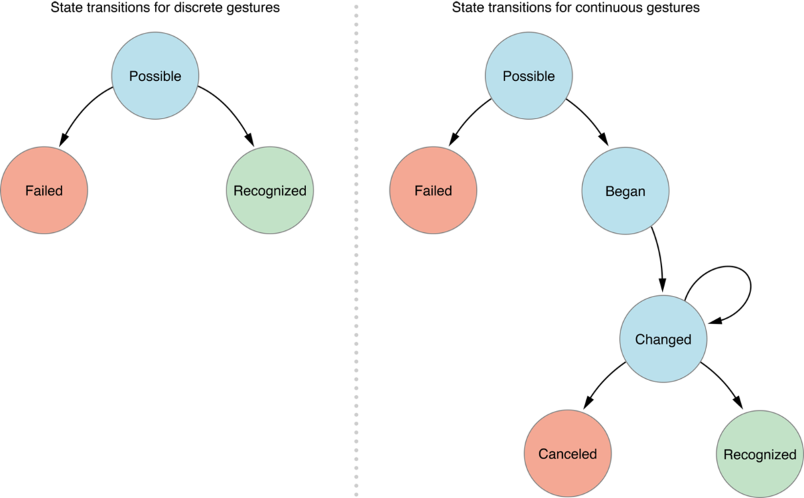
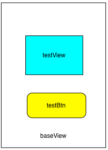
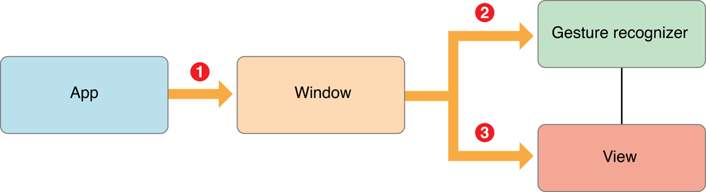

# iOS点击事件和手势冲突

## 1 问题场景

### 1.1 单击事件响应出现问题

父视图上添加了一个UITabelView和一个UIButton。

在parentView上添加了UITapGestureRecognizer之后，subview中的UITableView实例无法正常响应点击事件了，但UIButton实例仍可以正常工作。

这是怎么回事呢？

解决链接： [iOS触摸](https://links.jianshu.com/go?to=http%3A%2F%2Fblog.gocy.tech%2F2016%2F11%2F19%2FiOS-touch-handling%2F)

2、使用TableView写了一个登陆界面，帐号和密码两个Cell中加入了TextField。

由于想在TableView的空白处，点击时收起键盘，所以给self.view 添加一个UITapGestureRecognizer来识别手势。

然后发生了一个奇怪的现象，点击cell 无法选中,也就是tableView 的 didSelectRowAtIndexPath没有反应了！

解决链接： [didSelectRowAtIndexPath失效](https://links.jianshu.com/go?to=http%3A%2F%2Fblog.csdn.net%2Fmengxiangone%2Farticle%2Fdetails%2F42740917)

以上两个场景问题。都已经有解决方案了。但是，底层到底是为什么会有点击事件的响应冲突呢？

这一切的原因都是因为： **对于UITapGestureRecognizer认识不够深刻** 。

先写下几个结论，后面慢慢解释：（此处只讨论 **单击tap事件** ）

> 1、**手势响应是大哥，点击事件响应链是小弟。** 单击手势优先于UIView的事件响应。大部分冲突，都是因为 **优先级** 没有搞清楚。  
> 2、单击事件 **优先传递** 给手势响应大哥，如果大哥识别成功，就会直接取消事件的响应链传递。  
> 识别成功时候，手势响应大哥拥有垄断权力。  
> 如果大哥 **识别失败** 了，触摸事件会继续走传递链，传递给响应链小弟处理。  
> 3、手势识别是需要时间的。  

手势识别有一个状态机的变化。在possible状态的时候，单击事件 也可能已经传递给响应链小弟了。

## 2 关于事件的几个概念

在具体讲解上面三个结论之前。先简要的介绍一下 iOS 里面与事件相关的几个概念 

### 2.1 UITouch

当你用一根手指触摸屏幕时, 会创建一个与之关联的UITouch对象,

一个手指第一次点击屏幕，就会生成一个UITouch对象，到手指离开时销毁。


### 2.2 UIEvent —— 如来神掌

一个UIEvent 事件定义为:**第一个手指开始触摸屏幕到最后一个手指离开屏幕。**

一个UIEvent对象实际上对应多个UITouch对象。

### 2.3 UIResponder — 响应对象

在iOS中不是任何对象都能处理事件, 只有 **继承了UIResponder的对象** 才能接收并处理事件,我们称为 **响应者对象** 。

**UIApplication,UIViewController,UIView** 都继承自UIResponder,因此他们都是响应者对象, 都能够接收并处理事件。

也就是说iOS中 **所有的UIView** 一旦成为响应者对象，都是可以响应单击的触摸事件的。

本文不详细介绍 [响应链传递及响应](https://www.jianshu.com/p/f55b613b564e) 的知识了。

重点放在—— **单击事件，手势识别和响应链之间的纠缠** 。

### 2.4 手势识别 UIGestureRecognizer

手势是Apple提供的更高级的事件处理技术，可以完成更多更复杂的触摸事件，比如旋转、滑动、长按等。基类是UIGestureRecognizer。

UIGestureRecognizer同UIResponder一样也有四个方法

```objc
//UIGestureRecognizer
- (void)touchesBegan:(NSSet<UITouch *> *)touches withEvent: (nullable UIEvent *)event;
- (void)touchesMoved:(NSSet<UITouch *> *)touches withEvent:(nullable UIEvent *)event;
- (void)touchesEnded:(NSSet<UITouch *> *)touches withEvent:(nullable UIEvent *)event;
- (void)touchesCancelled:(NSSet<UITouch *> *)touches withEvent:(nullable UIEvent *)event;
```

需要注意的是UIGestureRecognizer，是有状态的变化的。同一个手势是有具有多个状态的变化的，会形成一个 **有限状态机** 。

如下图：



左侧是非连续手势(比如 **单击** )的状态机，右侧是连续手势(比如滑动)的状态机。

- 所有的手势的开始状态都是UIGestureRecognizerStatePossible。

- 非连续的手势要么识别成功(UIGestureRecognizerStateRecognized)，要么识别失败(UIGestureRecognizerStateFailed)。

- 连续的手势识别到第一个手势时，变成UIGestureRecognizerStateBegan，然后变成UIGestureRecognizerStateChanged，并且不断地在这个状态下循环，当用户最后一个手指离开view时，变成UIGestureRecognizerStateEnded，

- 当然如果手势不再符合它的模式的时候，状态也可能变成UIGestureRecognizerStateCancelled。

## 3 手势识别与事件响应混用

**重点来了。**

iOS处理触屏事件，分为两种方式：

1. 高级事件处理：利用UIKit提供的各种用户控件或者手势识别器来处理事件。

2. 低级事件处理：在UIView的子类中重写触屏回调方法，直接处理触屏事件。

>   

这两种方式会在，单击触摸事件的时候得到使用。

触摸事件 **可以通过响应链来传递与处理** ，也可以 **被绑定在view上的手势识别和处理** 。那么这两个一起用会出现什么问题？

如果回答了这个问题，就可以说清楚，开篇的两个问题了。

此处的DEMO例子参考。 [iOS点击事件和手势冲突](https://links.jianshu.com/go?to=http%3A%2F%2Fwww.zhimengzhe.com%2FIOSkaifa%2F234074.html)

下面开始例子的讲解。Demo链接： [testTap](https://links.jianshu.com/go?to=https%3A%2F%2Fgithub.com%2Fwuxiaopei%2FtestTapDemo.git)

图片：



图中baseView 有两个subView，分别是testView和testBtn。我们在baseView和testView都重载touchsBegan:withEvent、touchsEnded:withEvent、 touchsMoved:withEvent、touchsCancelled:withEvent方法，并且在baseView上添加单击手势，action名为tapAction，给testBtn绑定action名为testBtnClicked。

主要代码如下：

``` objc
//baseView
- (void)viewDidLoad {
    [super viewDidLoad];
    UITapGestureRecognizer *tap = [[UITapGestureRecognizer alloc] initWithTarget:self action:@selector(tapAction)];
    [self.view addGestureRecognizer:tap];
    ...
    [_testBtn addTarget:self action:@selector(testBtnClicked) forControlEvents:UIControlEventTouchUpInside];
｝

- (void)touchesBegan:(NSSet<UITouch *> *)touches withEvent:(UIEvent *)event {
    NSLog(@"=========> base view touchs Began");
}
- (void)touchesMoved:(NSSet<UITouch *> *)touches withEvent:(UIEvent *)event {
     NSLog(@"=========> base view touchs Moved");
}
- (void)touchesEnded:(NSSet<UITouch *> *)touches withEvent:(UIEvent *)event {
     NSLog(@"=========> base view touchs Ended");
}
- (void)touchesCancelled:(NSSet<UITouch *> *)touches withEvent:(UIEvent *)event {
     NSLog(@"=========> base view touchs Cancelled");
}
- (void)tapAction {
     NSLog(@"=========> single Tapped");
}
- (void)testBtnClicked {
     NSLog(@"=========> click testbtn");
}
//test view
- (void)touchesBegan:(NSSet<UITouch *> *)touches withEvent:(UIEvent *)event {
    NSLog(@"=========> test view touchs Began");
}
- (void)touchesMoved:(NSSet<UITouch *> *)touches withEvent:(UIEvent *)event {
    NSLog(@"=========> test view touchs Moved");
}
- (void)touchesEnded:(NSSet<UITouch *> *)touches withEvent:(UIEvent *)event {
    NSLog(@"=========> test view touchs Ended");
}
- (void)touchesCancelled:(NSSet<UITouch *> *)touches withEvent:(UIEvent *)event {
    NSLog(@"=========> test view touchs Cancelled");
}
```

情景A ：单击baseView，输出结果为：

```
=========> base view touchs Began
=========> single Tapped
=========> base view touchs Cancelled
```

情景B ：单击testView，输出结果为：

```
=========> test view touchs Began
=========> single Tapped
=========> test view touchs Cancelled
```

情景C ：单击testBtn, 输出结果为：

```
=========> click testbtn
```

情景D ：按住testView，过5秒后或更久释放，输出结果为：

```
=========> test view touchs Began
=========> test view touchs Ended
```

### 3.1 情景A和B

情景A和B，都是在单击之后， **既响应了手势的tap 事件** ，也让 **响应链方法** 执行了。为什么两个响应都执行了呢？

看看开发文档，就应该可以理解了。

> Gesture Recognizers Get the First Opportunity to Recognize a Touch.  
>
>A window delays the delivery of touch objects to the view so that the gesture recognizer can analyze the touch first. During the delay, if the gesture recognizer recognizes a touch gesture, then the window never delivers the touch object to the view, and also cancels any touch objects it previously sent to the view that were part of that recognized sequence.

Google翻译：

> 手势识别器获得识别触摸的第一个机会。  
> 
> 一个窗口延迟将触摸对象传递到视图，使得手势识别器可以首先分析触摸。 在延迟期间，如果手势识别器识别出触摸手势，则窗口不会将触摸对象传递到视图，并且还将先前发送到作为识别的序列的一部分的视图的任何触摸对象取消。  

图片：



触摸事件首先传递到手势上，如果手势识别成功，就会取消事件的继续传递，否则，事件还是会被响应链处理。具体地，系统维持了与响应链关联的所有手势，事件首先发给这些手势，然后再发给响应链。

这样可以解释情景A和B了。

首先，我们的单击事件，是有有手势识别这个大哥来优先获取。只不过，手势识别是需要一点时间的。在手势还是Possible 状态的时候，事件传递给了响应链的第一个响应对象（baseView 或者 testView）。

这样自然就去调用了，响应链UIResponder的 **touchsBegan:withEvent** 方法，之后手势识别成功了，就会去cancel之前传递到的所有响应对象，于是就会调用它们的 **touchsCancelled:withEvent:** 方法。

### 3.2 情境C

好了，情景A和B都可以解释明白了。但是，请注意，按这样的解释为什么情景C没有触发响应链的方法呢？

这里可以说是事件响应的 **一个特例** 。

iOS 开发文档里这样说：

> In iOS 6.0 and later, default control actions prevent overlapping gesture recognizer behavior. For example, the default action for a button is a single tap. If you have a single tap gesture recognizer attached to a button’s parent view, and the user taps the button, then the button’s action method receives the touch event instead of the gesture recognizer. This applies only to gesture recognition that overlaps the default action for a control, which includes:  
>
>A single finger single tap on a UIButton, UISwitch, UISegmentedControl, UIStepper,and UIPageControl.A single finger swipe on the knob of a UISlider, in a direction parallel to the slider.A single finger pan gesture on the knob of a UISwitch, in a direction parallel to the switch.

Google 翻译为：

> 在iOS 6.0及更高版本中，默认控制操作可防止重叠的手势识别器行为。 例如，按钮的默认操作是单击。 如果您有一个单击手势识别器附加到按钮的父视图，并且用户点击按钮，则按钮的动作方法接收触摸事件而不是手势识别器。 这仅适用于与控件的默认操作重叠的手势识别，其中包括：  
>
>**单个手指单击UIButton，UISwitch，UISegmentedControl，UIStepper和UIPageControl.**
>
>单个手指在UISlider的旋钮上滑动，在平行于滑块的方向上。在UISwitch的旋钮上的单个手指平移手势 与开关平行的方向。

所以呢，在情境C，里面testBtn的 默认action，获取了事件响应，不会把事件传递给父视图baseView，自然就不会触发，baseView的tap 事件了。

### 3.3 情境D

在情景D中，由于长按住testView不释放，tap手势就会识别失败，因为长按就已经不是单击事件了。手势识别失败之后，就可以继续正常传递给testView处理。

所以，只有响应链的方法触发了。

## 4 实际开发遇到的问题解决

基本的开发目标，不让父视图的手势识别干扰子视图UIView的点击事件响应或者说响应链的正常传递。

一般都会是重写UIGestureRecognizerDelegate中的- (BOOL)gestureRecognizer:(UIGestureRecognizer *)gestureRecognizer shouldReceiveTouch:(UITouch *)touch方法。

```
- (BOOL)gestureRecognizer:(UIGestureRecognizer *)gestureRecognizer shouldReceiveTouch:(UITouch *)touch  
{  
     // 若为UITableViewCellContentView（即点击了tableViewCell），
    if ([NSStringFromClass([touch.view class]) isEqualToString:@"UITableViewCellContentView"]) {  
    // cell 不需要响应 父视图的手势，保证didselect 可以正常
        return NO;  
    }  
    //默认都需要响应
    return  YES;  
}
```

1、[iOS开发中让子视图不响应父视图的手势识别器](https://www.jianshu.com/p/8404aa9b8d88)

2、[iOS单击响应，UIControl](https://links.jianshu.com/go?to=http%3A%2F%2Fblog.gocy.tech%2F2016%2F11%2F19%2FiOS-touch-handling%2F)

3、[didSelectRowAtIndexPath失效](https://links.jianshu.com/go?to=http%3A%2F%2Fblog.csdn.net%2Fmengxiangone%2Farticle%2Fdetails%2F42740917)

4、以上例子的Demo链接： [testTap](https://links.jianshu.com/go?to=https%3A%2F%2Fgithub.com%2Fwuxiaopei%2FtestTapDemo.git);

## 小结

复习一下结论：

（此处只讨论 **单击tap事件** ）

* 1、**手势响应是大哥，点击事件响应链是小弟。** 单击手势优先于UIView的事件响应。大部分冲突，都是因为 **优先级** 没有搞清楚。  

* 2、单击事件 **优先传递** 给手势响应大哥，如果大哥识别成功，就会直接取消事件的响应链传递。  

* 识别成功时候，手势响应大哥拥有垄断权力。（在斗地主里面叫做：吃肉淘汤。）  

* 如果大哥 **识别失败** 了，触摸事件会继续走传递链，传递给响应链小弟处理。  

* 3、手势识别是需要时间的。手势识别有一个状态机的变化。在possible状态的时候，单击事件 **也可能已经传递给响应链小弟了** 。  


[iOS点击事件和手势冲突](https://www.jianshu.com/p/53e03e558cbd)