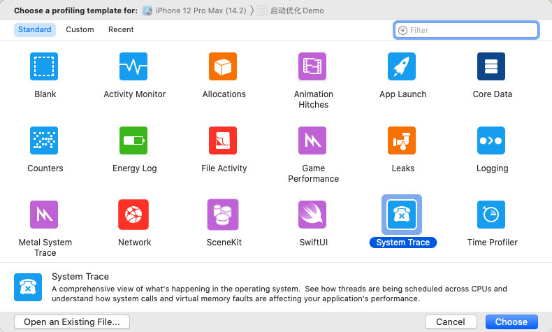
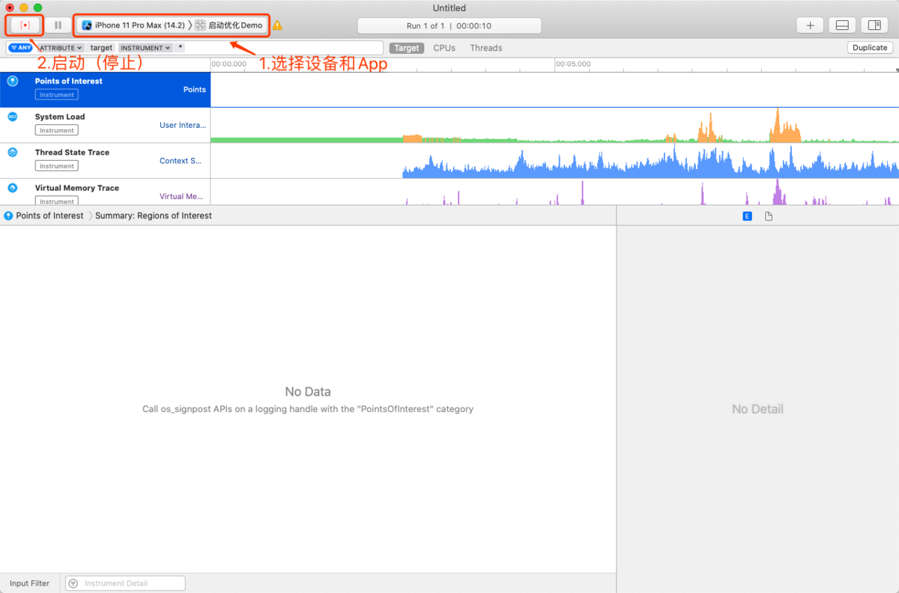
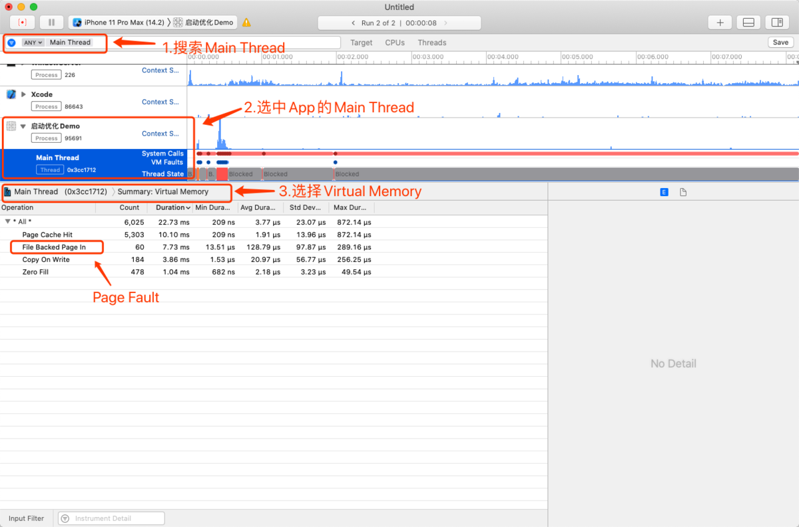
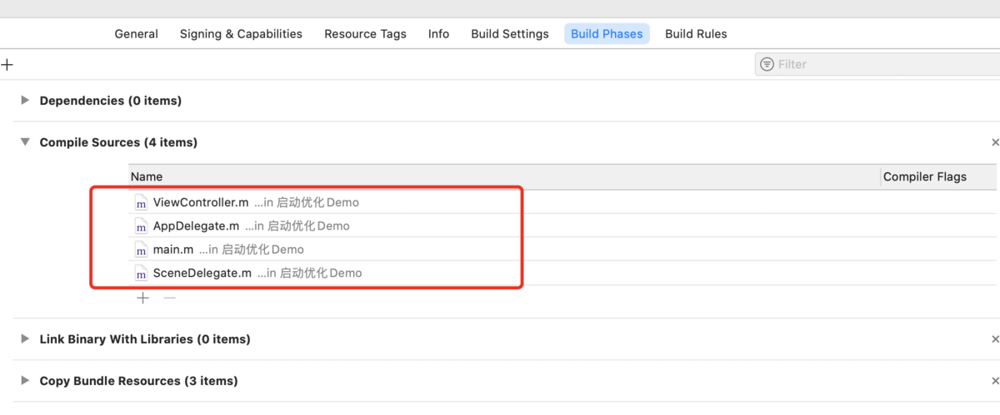
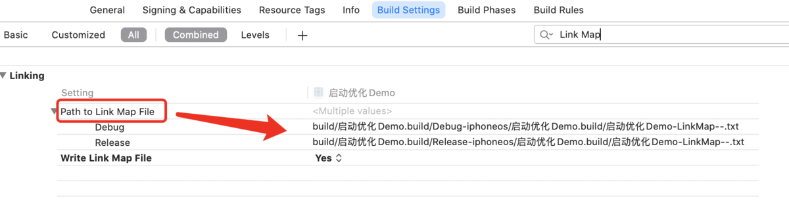
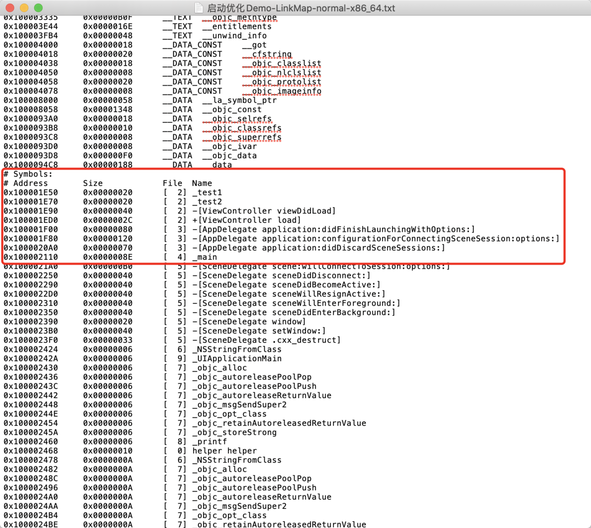
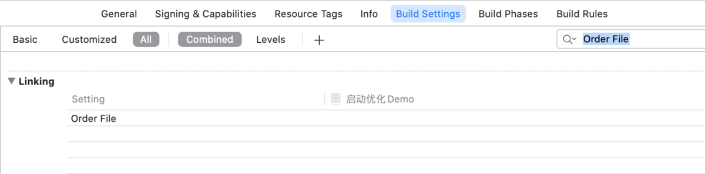
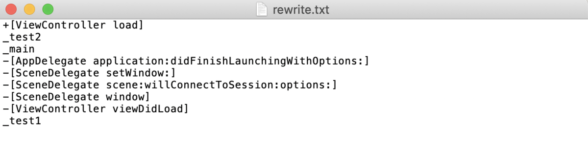
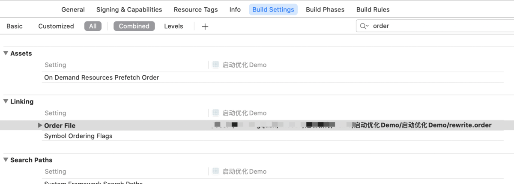
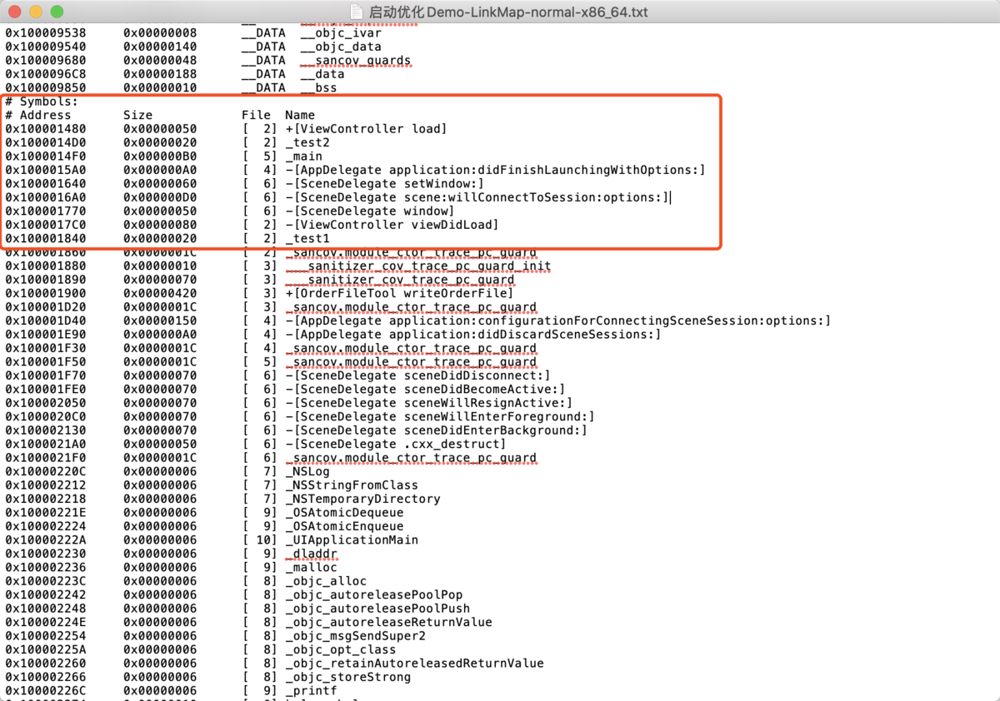

# iOS原理 App的启动优化2：二进制重排

在 [iOS原理 App的启动优化1：优化建议](https://www.jianshu.com/p/7f1a26ea133d) 一文中已经介绍了启动优化的相关概念，我们知道，通过二进制重排可以减少App的启动时间，提高程序的启动性能。

## 二进制重排原理

`CPU` 访问进程数据时，先访问数据对应的虚拟内存 `page` ，通过虚拟内存地址找到其对应的物理内存地址，再通过物理地址访问到物理内存上的数据。如果对应的物理内存地址不存在，说明这部分数据没有加载到物理内存中，此时会触发 `缺页中断（Page Fault）` 。

> 物理内存和虚拟内存的详细介绍可阅读 [iOS原理 物理内存&虚拟内存](https://www.jianshu.com/p/1be410e012ac)  

### Page Fault

`Page Fault` 会中断当前进程，需要先将访问的数据加载到物理内存中，再让 `CPU` 访问。而通过App Store渠道分发的App， `Page Fault` 还会进行签名验证，所以每一个 `Page Fault` 都会带来一定的耗时。

如果启动过程中触发大量的 `Page Fault` 就会降低启动性能，延长启动时间。通过 `System Trace` 可以查看App在启动过程中触发的 `Page Fault` 次数：

* 找到 `Xcode` -> `Open Developer Tool` -> `Instruments` ，选择并打开 `System Trace` 。



* 选择设备和App，启动 `System Trace` ，在App打开第一个界面后停止 `System Trace` 。



* 搜索 `Main Thread` ，选择 `Virtual Memory` ， `File Backed Page In` 即表示 `Page Fault` 。



可以看到，启动过程中触发了60次 `Page Fault` ，总共耗时7.73ms。这个案例Demo只是新建的一个空项目，一般来说，工作项目会触发上千次 `Page Fault` ，就拿微信来说，触发次数达到2600多次，耗时接近700ms。因此， **减少启动过程中`Page Fault` 的触发次数，就能缩短启动时间，提高启动性能，而这就可以通过『二进制重排』来实现** 。

## 二进制重排实现方式

App启动过程中会调用一些方法和函数， `CPU` 需要访问相关数据。这时， **通过修改代码在二进制文件的布局，将启动时刻调用的方法和函数的二进制符号，排列在一起，确保在一个虚拟内存`page` 中，这样就从多个 `Page Fault` 减少为一个 `Page Fault` ，这就是二进制重排** 。

修改方法和函数二进制符号的布局，需要通过 `Linkmap`、`ld` 以及 `Clang插桩` 来实现。

### 1. Linkmap

`Linkmap` 是iOS编译过程的中间产物，记录了二进制文件的布局，需要在Xcode中找到 `Target` -> `Build Settings` -> `Write Link Map File` ，并设置为 `Yes` 来开启。

`Linkmap` 主要包括三大部分：

* `Object Files` 生成二进制用到的link单元的路径和文件编号
* `Sections` 记录Mach-O每个Segment/section的地址范围
* `Symbols` 按顺序记录每个符号的地址范围

编译器在生成二进制代码的时候，默认按照链接的Object File(.o)顺序写文件，按照Object File内部的函数顺序写函数，因此 **方法和函数编译后的二进制符号，默认先按照`.o文件（Object File）` 的链接顺序，再按照文件里的编写顺序来排列** 。

以案例Demo为例，查看编译后方法和函数在 `Linkmap` 里面的排列顺序。

* 在 `ViewController` 里编写几个方法和函数

```objc
#import "ViewController.h"

@interface ViewController ()

@end

@implementation ViewController

void test1(){
    
    printf("1");
}

void test2(){
    
    printf("2");
}

- (void)viewDidLoad {
    [super viewDidLoad];
    // Do any additional setup after loading the view.
    
    test1();
}

+(void)load{
    
    printf("3");
    test2();
}

@end
```

* 查看 `.o文件（Object File）` 链接顺序，顺序可以任意改变。



* `Command + B` 编译Demo，根据路径找到 `Link Map File`



* 打开文件，查看方法和函数编译后的二进制符号在文件中的排列顺序



从 `Link Map File` 里的布局情况可以印证，方法和函数编译后的二进制符号，是先按照 `.o文件（Object File）` 的链接顺序，再按照文件里的编写顺序来排列。由于启动过程中调用的方法和函数可能存在于不同的类里，它们编译后的符号默认在二进制文件里分散排列，调用时就会触发大量的 `Page Fault` 。

##### 2. ld

`ld` 是Xcode使用的链接器，写入其参数 `order_file` 中的符号，会按照写入顺序排列在二进制文件中符号区域的顶部。因此，在Xcode中，通过 `Target` -> `Build Settings` -> `Order File` 来配置一个后缀为 `.order` 的文件路径，并在这个 `order` 文件中，将启动过程中调用的方法和函数以符号格式写在里面，在项目编译后，这些符号就会按照文件里的顺序排列在二进制文件中。若 `order` 文件中的符号对应的方法实际不存在， `ld` 则会忽略这些符号。



##### 3. Clang插桩

`Clang插桩` ，即批量 `hook` ，借助 `SanitizerCoverage（llvm内置的一个简单的代码覆盖率检测）` ，实现100%符号覆盖，获取到所有的 `swift`、`OC`、`C`、`block函数` 。

> Clang插桩覆盖的官方文档 : [clang 自带代码覆盖工具](https://links.jianshu.com/go?to=http%3A%2F%2Fclang.llvm.org%2Fdocs%2FSanitizerCoverage.html) 。  

实现步骤如下：

* **Step1：开启SanitizerCoverage**

	* 方法一：找到 `Target` -> `Build Settings` -> `Other C Flags` ，添加 `-fsanitize-coverage=func,trace-pc-guard` ，如果是swift项目，还需在 `Other Swift Flags` 中加入 `-sanitize-coverage=func` 和 `-sanitize=undefined`

	* 方法二：通过 `podfile` 来配置参数

```
post_install do |installer|
 installer.pods_project.targets.each do |target|
   target.build_configurations.each do |config|
     config.build_settings['OTHER_CFLAGS'] = '-fsanitize-coverage=func,trace-pc-guard'
     config.build_settings['OTHER_SWIFT_FLAGS'] = '-sanitize-coverage=func -sanitize=undefined'
   end
 end
end
```

* **Step2：重写下面两个函数，捕获所有调用的方法、函数以及block**

**`__sanitizer_cov_trace_pc_guard_init` 函数**

```
/**
 *   start：是一个指针，指向无符号int类型，4个字节，相当于一个数组的起始位置，即符号的起始位置。
 *   stop：标记的最后的地址，通过stop的地址-4，获取到最后一个符号的真实地址，真实地址里的值就代表这符号的总数。
 */
void __sanitizer_cov_trace_pc_guard_init(uint32_t *start, uint32_t *stop) {}
```

这个是初始化函数，可以获取到所有符号（方法、函数、block、属性）的数量。在捕获方法和函数时，这个函数里面可以不做任何处理。

**`__sanitizer_cov_trace_pc_guard` 函数**

```
/**
 *  这个方法可以捕获所有调用的方法、函数以及block
 *  guard：哨兵，告知是第几次被调用
 */
void __sanitizer_cov_trace_pc_guard(uint32_t *guard) {}
```

这个函数可以捕获所有调用的方法、函数以及block。每当调用一个方法、函数或者block，都会执行一次这个函数，在这里面，通过 `__builtin_return_address(0)` 可以拿到当前调用的方法（/函数/block）的地址，再通过 `Dl_info` 可以拿到方法地址和方法名。

## 二进制重排的案例Demo

通过上面的学习可知，二进制重排的实现步骤如下：

* 通过 `Clang插桩` 获取启动时刻调用的全部 `方法、函数、block` 。
* 将 `方法、函数、block` 以符号的格式写入 `Order` 文件
* 配置 `Order` 文件。

接下来通过案例Demo来详细讲解实现步骤，在案例中把 `Clang插桩` 相关代码封装在一个文件中，方便后续使用。

* **Step1：新建一个`OrderFileTool` 工具类，所有捕获符号的相关代码均在这里面实现** 。

由于 `__sanitizer_cov_trace_pc_guard` 函数执行太频繁，所以在函数里面只保存调用函数的地址，后面再统一解析。因此，打算用单向链表来保存这些地址，考虑到线程安全，决定用 `原子队列OSQueueHead` 来保存。捕获的代码逻辑如下：

```
#import "OrderFileTool.h"
#import <dlfcn.h>
#import <libkern/OSAtomic.h>
#include <stdlib.h>

@implementation OrderFileTool

//原子队列，保证多线程下的写入安全
static OSQueueHead symbolQueue = OS_ATOMIC_QUEUE_INIT;

//定义符号结构体，链表的节点
typedef struct {
    void *pc;
    void *next;
}SYNode;

//初始化，里面不做任何处理
void __sanitizer_cov_trace_pc_guard_init(uint32_t *start, uint32_t *stop) {}

//捕获方法、函数、block，这里只保存地址，不做解析处理
void __sanitizer_cov_trace_pc_guard(uint32_t *guard) {

    //1.获取方法、函数、block的地址
    /**
     *   __builtin_return_address：返回函数的地址
     *   0：表示返回当前函数的地址
     *   1：表示返回当前函数调用者的地址
     */
    void *PC = __builtin_return_address(0);

    //2.创建node
    //将地址赋值给node结构体里的pc指针
    SYNode *node = malloc(sizeof(SYNode));
    *node = (SYNode){PC, NULL};

    //3.加入队列
    //将node添加到队列中，并将下一个node的地址赋值给当前node结构体里的next指针
    OSAtomicEnqueue(&symbolQueue, node, offsetof(SYNode, next));
}

+(void)writeOrderFile{

    //创建一个符号数组
    NSMutableArray *mArr = [NSMutableArray array];

    //while循环获取所有符号
    while (YES) {

        //取出节点
        SYNode *node = OSAtomicDequeue(&symbolQueue, offsetof(SYNode, next));
        if(node==NULL){

            break;
        }

        //解析PC，获取符号
        Dl_info info;
        dladdr(node->pc, &info);
        NSString *name = @(info.dli_sname);
        //如果不是OC方法，需要在前面加上_
        BOOL isObjC = [name hasPrefix:@"-["]||[name hasPrefix:@"+["];
        NSString *symbol = isObjC?name:[@"_" stringByAppendingString:name];
        //去重判断，如果符号存在，就不添加
        if(![mArr containsObject:symbol]){

            //队列的存储是反序的，所以这里逆序保存在数组中，当然，不逆序也不影响
            [mArr insertObject:symbol atIndex:0];
        }
    }

    //这里要去掉自己本身
    NSString *currentFunc = @"+[OrderFileTool writeOrderFile]";
    if([mArr containsObject:currentFunc]){

        [mArr removeObject:currentFunc];
    }

    //将数组转换成字符串，并写入Order文件
    NSString *symbolStr = [mArr componentsJoinedByString:@"\n"];
    NSLog(@" ===== symbolStr = \n%@", symbolStr);
    //写入文件
    NSString *filePath = [NSTemporaryDirectory() stringByAppendingPathComponent:@"rewrite.order"];
    NSData *fileContents = [symbolStr dataUsingEncoding:NSUTF8StringEncoding];
    BOOL success = [[NSFileManager defaultManager] createFileAtPath:filePath contents:fileContents attributes:nil];
    if (success) {

        NSLog(@" ==== rewrite success：%@", filePath);
    }
}

@end
```

这里就实现了整个逻辑，只需要在外部调用 `+(void)writeOrderFile` 方法就可完成所有符号的捕获，并写入到 `order` 文件。

* **Step2：开启`SanitizerCoverage` ，在程序启动结束后执行捕获方法** 。

一般来说，在首界面的 `ViewDidLoad` 方法里执行就能捕获到程序启动过程的所有符号。这里也是在案例Demo的 `ViewController.m` 文件里执行。

```
#import "ViewController.h"
#import "OrderFileTool.h"

@interface ViewController ()

@end

@implementation ViewController

void test1(){
  
    printf("1");
}

void test2(){
  
    printf("2");
}

- (void)viewDidLoad {
    [super viewDidLoad];
    // Do any additional setup after loading the view.
  
    test1();
  
    //获取启动过程所有方法和函数的符号
    [OrderFileTool writeOrderFile];
}

+(void)load{
  
    printf("3");
    test2();
}

@end
```

通过输出的Order文件路径，找到文件并改成 `.txt` 后缀打开，可以看到符号的排列顺序如下：



可以看到，启动过程的最后一个函数 `test1` 的符号排在最后一个，至此，完成了所有符号的捕获。

* **Step3：配置`Order` 文件，然后 `Command + B` 编译** 。

将生成的 `rewrite.order` 文件添加到项目中，再在 `Target` -> `Build Settings` -> `Order File` 中配置 `order文件` 的路径，然后编译。



查看编译后新生成的 `LinkMap File` 。



可以看到，启动过程的方法和函数符号，均按照 `order` 文件里的顺序排列在一起，并置于二进制文件前面。至此，整个二进制重排的过程就完成了。

> 温馨提示：获取到启动过程的全部符号后，就关掉 `SanitizerCoverage` ，并删除 `OrderFileTool` 工具类，若以后App启动相关业务发生变更后，再重新排列一次就可以了。  

#### 推荐阅读

[1. iOS原理 App的启动优化1：优化建议](https://www.jianshu.com/p/7f1a26ea133d)
[2. 抖音研发实践：基于二进制文件重排的解决方案 APP启动速度提升超15%](https://links.jianshu.com/go?to=https%3A%2F%2Fmp.weixin.qq.com%2Fs%2FDrmmx5JtjG3UtTFksL6Q8Q)
[3. Clang插桩覆盖的官方文档](https://links.jianshu.com/go?to=http%3A%2F%2Fclang.llvm.org%2Fdocs%2FSanitizerCoverage.html)
[4. iOS调优 | 深入理解Link Map File](https://www.jianshu.com/p/52e0dee35830)

[iOS原理 App的启动优化2：二进制重排](https://www.jianshu.com/p/8d7f22a11c71)