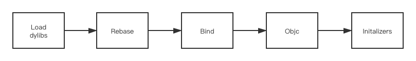
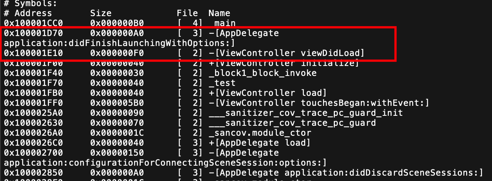
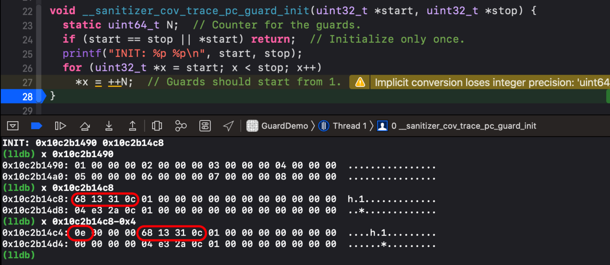
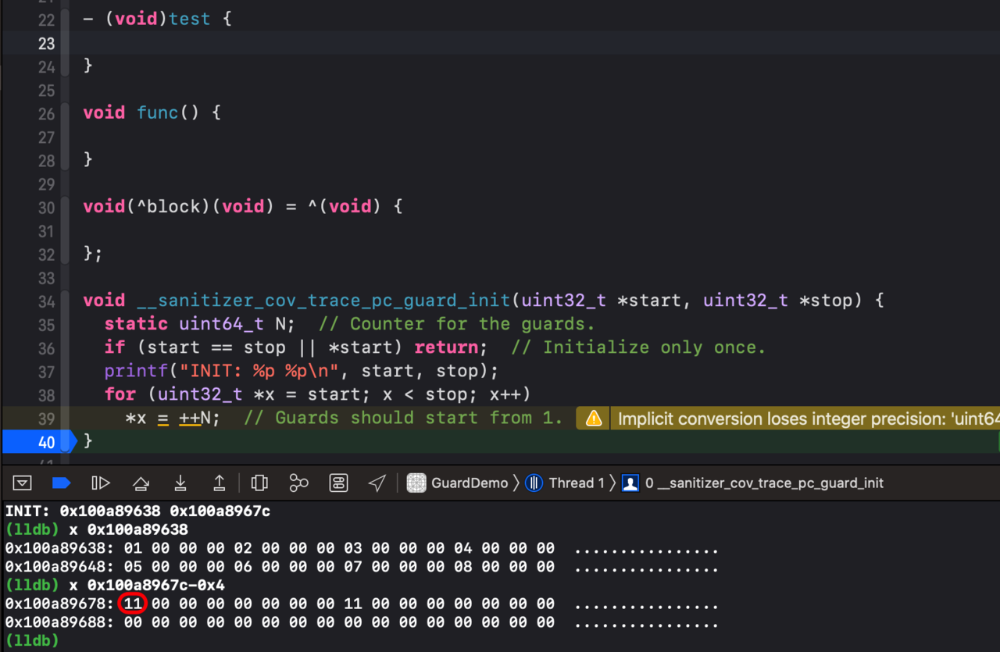
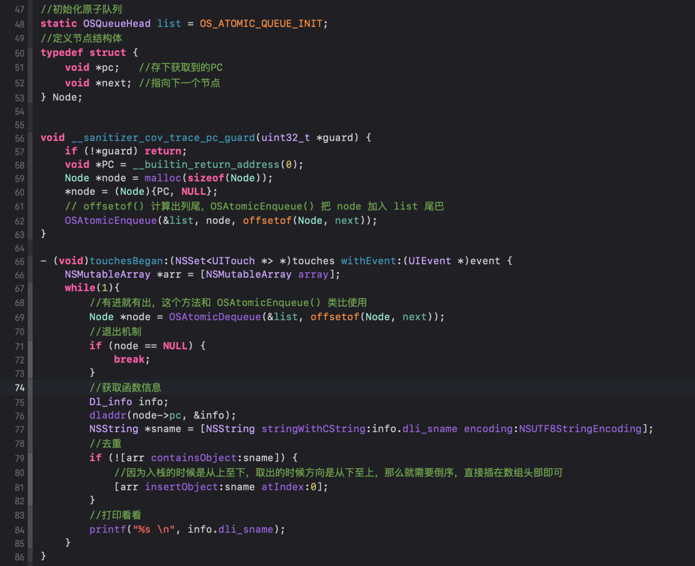

- [检测启动时间](#检测启动时间)
  - [冷启动和热启动](#冷启动和热启动)
  - [启动时间的组成](#启动时间的组成)
    - [t1阶段： `pre-main`](#t1阶段-pre-main)
    - [t2阶段](#t2阶段)
  - [Xcode 测量 `pre-main` 时间](#xcode-测量-pre-main-时间)
    - [`DYLD_PRINT_STATISTICS`](#dyld_print_statistics)
    - [加载 `dylib`](#加载-dylib)
    - [rebase/bind](#rebasebind)
    - [Objc setup](#objc-setup)
    - [initalizer time](#initalizer-time)
  - [`DYLD_PRINT_STATISTICS_DETAILS`](#dyld_print_statistics_details)
  - [优化思路](#优化思路)
- [内存管理](#内存管理)
  - [内存浪费](#内存浪费)
  - [虚拟内存](#虚拟内存)
  - [地址翻译](#地址翻译)
  - [Page Fault](#page-fault)
  - [灵活内存管理](#灵活内存管理)
  - [解决安全问题](#解决安全问题)
  - [为什么进行二进制重排](#为什么进行二进制重排)
- [二进制重排](#二进制重排)
  - [重排目的](#重排目的)
  - [查看 Page Falut](#查看-page-falut)
  - [Link Map File](#link-map-file)
  - [order_file](#order_file)
    - [设置 `order_file`](#设置-order_file)
    - [编写 `order_file`](#编写-order_file)
  - [自动生成 `order_file`](#自动生成-order_file)
  - [编译期插桩](#编译期插桩)
- [编译期插桩and获取方法符号](#编译期插桩and获取方法符号)
  - [相关概念](#相关概念)
  - [怎么找到插桩方法](#怎么找到插桩方法)
  - [代码覆盖率检测工具（SanitizerCoverage）](#代码覆盖率检测工具sanitizercoverage)
  - [通过看守者跟踪 （Tracing PCs with guards）](#通过看守者跟踪-tracing-pcs-with-guards)
  - [具体实现](#具体实现)
    - [添加设置](#添加设置)
    - [添加方法](#添加方法)
    - [__sanitizer_cov_trace_pc_guard_init](#__sanitizer_cov_trace_pc_guard_init)
    - [Block 、 C函数](#block--c函数)
    - [Swift 混编处理](#swift-混编处理)
  - [__sanitizer_cov_trace_pc_guard](#__sanitizer_cov_trace_pc_guard)
  - [获取方法地址](#获取方法地址)
  - [获取方法符号](#获取方法符号)
- [收集符号and生成OrderFile](#收集符号and生成orderfile)
  - [前言](#前言)
  - [收集符号](#收集符号)
    - [Focus 1 多线程](#focus-1-多线程)
    - [Focus 2 处理While循环](#focus-2-处理while循环)
    - [Focus 3 处理load函数](#focus-3-处理load函数)
    - [Focus 3 缺失的符号处理](#focus-3-缺失的符号处理)
    - [Focus 4 处理 `c函数` 和 `block` 的符号](#focus-4-处理-c函数-和-block-的符号)
  - [生成 Order File](#生成-order-file)
- [实战](#实战)
  - [效果对比](#效果对比)
  - [步骤一：添加 Build Setting 设置](#步骤一添加-build-setting-设置)
  - [步骤二：添加代码](#步骤二添加代码)
  - [步骤三：取出 order file](#步骤三取出-order-file)
  - [步骤四：设置 order file](#步骤四设置-order-file)
  - [步骤五：编译代码](#步骤五编译代码)

## 检测启动时间

### 冷启动和热启动

* 冷启动：指 `APP` 被后台 `kill` 后重新启动 `APP` ，这种启动方式叫做冷启动。
* 热启动： `APP` 的状态由 `running` 切换为 `suspend` ， `APP` 没有被 `kill` 仍然在后台运行。再次把 `APP` 切换到前台，这种启动方式叫热启动。

### 启动时间的组成

* 启动时间的划分可以把 `main()` 函数作为关键点分割成两块
* `t1` 阶段， `main()` 之前的处理所需时间，称为 `pre-main`
* `t2` 阶段， `main()` 及 `main()` 之后处理所需时间


#### t1阶段： `pre-main`



#### t2阶段

`t2` 阶段耗时的主要是业务代码

推荐 [BLStopwatch](https://github.com/beiliao-mobile/BLStopwatch) ，这个工具可以打点统计业务耗时

本部分优化根据各自业务需求自行处理

### Xcode 测量 `pre-main` 时间

通过添加环境变量可以获取到 `pre-main` 阶段的时间 


#### `DYLD_PRINT_STATISTICS`

`Xcode` 中提供了测量 `pre-main` 的时间 `Edit scheme -> Run -> Auguments` 添加环境变量 `DYLD_PRINT_STATISTICS` ， `value` 设为 `YES` 。 


启动以后可以看到启动时长


#### 加载 `dylib`

分析每个 `dylib` （大部分是系统的），找到其 `Mach-O` 文件，打开并读取验证有效性；找到代码签名注册到内核，最后对 `dylib` 的每个 `segment` 调用 `mmap()` 。

在 `dylib` 的加载过程中系统为了安全考虑引入了 `ASLR` （ `Address Space Layout Randomization` ）技术和代码签名。

`ASLR` 技术：镜像 `Image`、可执行文件、`dylib`、`bundle` 在加载的时候会在其指向的地址（ `preferred_address` ）前面添加一个随机数偏差（ `slide` ），防止应用内部地址被定位。

#### rebase/bind

`dylib` 加载完成之后，它们处于相互独立的状态，需要绑定起来。

`Rebase` 将镜像读入内存，修正镜像内部的指针，性能消耗主要在 `IO` 。

`Bind` 是查询符号表，设置指向镜像外部的指针，性能消耗主要在 `CPU` 计算。

#### Objc setup

`runtime` 会维护一张类名与类的方法列表的全局表。

* 读取所有类，将类对象其注册到这个全局表中（ `class registration` ）
* 读取所有分类，把分类加载到类对象中（ `category registration` ）
* 检查 `selector` 的唯一性（ `selector uniquing` ）

#### initalizer time

这部分其实就是 `load` 方法的耗时

### `DYLD_PRINT_STATISTICS_DETAILS`

还可以获取更详细的时间，添加环境变量 `DYLD_PRINT_STATISTICS_DETAILS` ， `value` 设为 `YES` 。


### 优化思路

* 移除不需要用到的动态库，尽量使用系统库，且苹果建议数量控制在 **6** 个以下
* 移除不需要用到的类；合并功能类似的类和扩展；经测试 **20000** 个类会增加约 **800毫秒**
* 尽量进行懒加载，尽量避免在 `load()` 方法里执行操作，把操作推迟到 `initialize()` 方法

[iOS App启动优化（一）：检测启动时间](https://juejin.cn/post/6844904165773328392)

## 内存管理

内存是分页管理的，映射表不能以字节为单位，是 **以页为单位** 。

* `Linux` 以 `4K` 为一页
* `macOS` 以 `4K` 为一页
* `iOS` 以 `16K` 一页

终端输入

```
pageSize
```


返回的就是 `4 * 1024 = 4096` 

### 内存浪费

早期的计算机不断启动应用，到达一定数量以后会报错，应用无法正常运行，必须先关闭前面的部分应用才能继续开启。

这是因为早期计算机没有虚拟地址，一旦加载都会 **全部加载到内存中** 。一旦物理内存不够了，那么应用就无法继续开启。

应用在内存中的排序都是顺序排列的，这样进程只需要把自己的地址尾部往后偏移一点就能访问到别的进程中的内存地址，相当不安全。


### 虚拟内存

用户使用时并不会使用到全部内存，如果 `App` 一启动就全部加载到内存中会浪费很多内存空间。 **虚拟内存技术** 的出现就是为了解决这个内存浪费问题。

`App` 启动后会认为自己已经获取到整个 `App` 运行所需的内存空间，但实际上并没有在物理内存上为他申请那么大的空间，只是生成了一张 **虚拟内存和物理内存关联的表** 。


### 地址翻译

当 `App` 需要使用某一块虚拟内存的地址时，会通过这张表查询该虚拟地址是否已经在物理内存中申请了空间。

* 如果已经申请了则通过表的记录访问物理内存地址，
* 如果没有申请则申请一块物理内存空间并记录在表中（ `Page Fault` ）。

这个通过进程映射表映射到不同的物理内存空间的操作叫 **地址翻译** ，这个过程需要 `CPU` 和操作系统配合。

### Page Fault

当数据未在物理内存会进行下列操作

* 系统阻塞该进程
* 将磁盘中对应 `Page` 的数据加载到内存
* 把虚拟内存指向物理内存

上述行为就就是 `Page Fault`

### 灵活内存管理

虽然解决了浪费问题，但是万一物理内存空间全都被申请了呢？还是有可能产生内存不足的情况的，为保证当前 `App` 的正常使用，数据加载遵循以下原则：

* 如果有空闲内存空间就放空的内存空间中
* 如果没有就覆盖其他进程的数据
* 具体覆盖由操作系统处理

### 解决安全问题

空间问题已经解决了，但是安全问题是怎么解决的呢？

在dylib的加载过程中系统为了安全考虑引入了 `ASLR` （ `Address Space Layout Randomization` ）技术和代码签名。

ASLR技术：镜像 `Image`、可执行文件、`dylib`、`bundle` 在加载的时候会在其指向的地址（ `preferred_address` ）前面添加一个随机数偏差（ `slide` ），防止应用内部地址被定位。

### 为什么进行二进制重排

虚拟内存技术会产生缺页中断（ `Page Fault` ），这个过程是个耗时操作。

每页耗时也有很大差距，1微秒到0.8毫秒不等。

使用过程中对这点耗时感觉不明显，但是启动时加载大量数据，如果产生大量缺页中断（ `Page Fault` ），时间叠加后用户会有明显感知。

如果我们把所有启动时候的代码都放在一页或者两页，这样就很大程度减少了启动时的缺页中断（ `Page Fault` ）从而优化启动速度，这就是二进制重排。

[iOS App启动优化（二）：物理内存和虚拟内存](https://juejin.cn/post/6844904165966086152)

## 二进制重排

### 重排目的

二进制重排就是为了减少启动时的缺页异常 `Page Fault` 从而减少启动时间


### 查看 Page Falut


我们可以看到图中项目的 `Page Fault` 数量并不多，这是因为当前项目是一个demo，代码和文件都极少。当代码多起来的话， `Page Fault的` 数量和加载耗时都会随着代码增加而增加。

**二进制重排** 可以很好优化这个问题，其中心思想是重新排列 **方法符号的顺序** ， 使启动的相关方法排在最前面从而减少启动 `Page Falut` 的数量。

我们先来看看原来的符号顺序，这需要用到 **链接映射文件** `Link Map File` 。

### Link Map File

* Link Map File 是什么？
* Link Map File 怎么获取？
* Link Map File 有什么用？

**请移步 [Link Map File 文件说明](https://juejin.im/post/6844904168096792583)**


`Link Map File` 里可以看到方法符号的排序。知道了原来的符号排序，开发者怎么去设置自己想要的顺序呢？

### order_file

`Xcode` 提供了排列符号的设置给开发者，设置 `order_file` 即可。苹果也一直身体力行， `objc` 源码就采用了二进制重排优化。

#### 设置 `order_file`

在根目录生成 `link.order` 文件，这里面就是方法符号的排序


`Target -> Build Setting -> Linking -> Order File` 设置 `order file` 的路径 


#### 编写 `order_file`

虽然知道了可以通过设置 `.order` 文件调整符号的位置，但是并不知道怎么编写 `order_file` 。下载 `objc-750源码` （ [源码下载地址](https://juejin.im/post/6844904133032411149) ），查看其 `order_file` 。


打开 `libobjc.order` ，原来只需要填写符号即可。 


`Link Map File` 现实原来是先加载 `AppDelegate application:didFinishLaunchingWithOptions:` 后加载 `[ViewController viewDidLoad]` 


编写一下 `link.order` 试试 


`command + K` 后 `command + B` 再查看一下 `Link Map File` ，顺序已经换过来了 



一个个方法写进去很容易出现笔误，那么当这个文件里面出现异常的时候编译会出问题吗？


再编译一下查看一下 `Link Map File` ，编译没有出现问题，不存在的方法直接被忽略掉了，没有出现在文件中。 


### 自动生成 `order_file`

全手写一定是不可取的，想实现自动化就要解决下列问题：

* 保证不遗漏方法
* 保证方法符号正确
* 保证方法符号顺序正确

解决方案可见 [《抖音研发实践：基于二进制文件重排的解决方案 APP启动速度提升超15%》](https://mp.weixin.qq.com/s/Drmmx5JtjG3UtTFksL6Q8Q)

抖音团队使用的是 **静态扫描+运行时trace的方案** ， 能够覆盖到80%～90%的符号。但是上述的方法也存在性能瓶颈

* initialize hook不到
* 部分block hook不到
* C++通过寄存器的间接函数调用静态扫描不出来

为了解决这个瓶颈，我打算尝试一下在文末提到的 **编译期插桩**

### 编译期插桩

顾名思义，编译插桩就是在代码编译期间修改已有的代码或者生成新代码。

[iOS App启动优化（三）：二进制重排](https://juejin.cn/post/6844904168201666574)

## 编译期插桩and获取方法符号

### 相关概念

编译器插桩就是在代码编译期间修改已有的代码或生成新代码。

编译期时，在每一个函数内部二进制源数据添加 `hook` 代码来实现全局 `hook` 效果。

编译期插桩会涉及关于 `LLVM` 的内容，但是对代码具体实现影响不大，想了解相关概念可以看看

[LLVM及编译过程](https://juejin.im/post/6844904163076210702)

[编译LLVM](https://juejin.im/post/6844904163256565774)

### 怎么找到插桩方法

说白了我们要跟踪到 **每个方法的执行** ，从而获取到启动时 **方法执行的顺序** ，然后再按照这个顺序去编写 `order file` 。

跟踪的具体实现会用到 `clang` 的 `SanitizerCoverage` ，这是什么东西？？

遇到事情不要慌，先打开文档看一看 ～ [clang文档](http://clang.llvm.org/docs/SanitizerCoverage.html#id2)

**文档很重要** ，万一里面有 `demo` 呢？

### 代码覆盖率检测工具（SanitizerCoverage）


`LLVM` 具有内置的简单代码覆盖率检测工具（ `SanitizerCoverage` ）  

* 它可以在函数，块、边缘级别插入用户定义函数并提供回调
* 它可以实现了简单的可视化覆盖率报告

### 通过看守者跟踪 （Tracing PCs with guards）


文档是个好东西～里面就有 `example` 。 


没明白怎么用？问题不大～

### 具体实现

#### 添加设置

`Target -> Build Setting -> Custom Complier Flags -> Other C Flags` 添加 `-fsanitize-coverage=trace-pc-guard` 


#### 添加方法

我是在 `viewController` 里面进行的，把这两个方法复制进去

```objc
void __sanitizer_cov_trace_pc_guard_init(uint32_t *start,
                                         uint32_t *stop) {
  static uint64_t N;  // Counter for the guards.
  if (start == stop || *start) return;  // Initialize only once.
  printf("INIT: %p %p\n", start, stop);
  for (uint32_t *x = start; x < stop; x++)
    *x = ++N;  // Guards should start from 1.
}

void __sanitizer_cov_trace_pc_guard(uint32_t *guard) {
  if (!*guard) return;
  void *PC = __builtin_return_address(0);
  char PcDescr[1024];
  printf("guard: %p %x PC %s\n", guard, *guard, PcDescr);
}

```

执行代码看一看


#### __sanitizer_cov_trace_pc_guard_init

这是什么...没看懂，还是打个断点看一看吧


`start` 里面存的是一堆序号， `stop` 里面会不会也是序号呢？

看看 `stop` 验证一下，发现里面的并不是序号，这就尴尬了...

思考了一会发现想知道最后一个序号，应该把 `stop` 地址往前移动了再查看！ 


向前挪4个字节看看



真找到了， `start` 和 `stop` 中间是 `01 ～ 0e` ，十进制的 `1～14` 。

这会不会是函数的序号呢？给他安排个函数试试看


`0e` 变成了 `0f` ，真的增加了一个。 

#### Block 、 C函数

看到这里可能觉得～ `hook` 一下都能拿到这有啥了不起。来点新花样

* 添加一个 block
* 添加一个 c函数



`0xf + 2 = 0x11` ，数量增加了2～验证成功 

但是还不够，我万一是混编咋办呢？得添加个 `swfit` 函数试试。 


#### Swift 混编处理

`Target -> Build Setting -> Custom Complier Flags -> Other Swift Flags` 添加

* `-sanitize-coverage=func`
* `-sanitize=undefined`


运行代码，输出地址


数量一下子增加到了 `0x1a` ，我猜测生成文件同时生成了不少自带方法，那么我们屏蔽掉刚刚新建的 `block`、`c函数`、`oc函数` 看看数量是否变成 `1a - 0x3` 即可。 


`1a - 0x3 = 0x17` 验证成功 

### __sanitizer_cov_trace_pc_guard

上述 `guard_init` 方法里面可以获取到所有方法的数量，那么肯定也有办法获取方法具体的相关信息。重点就是接下来要分析的 `__sanitizer_cov_trace_pc_guard` 。

添加点击方法，调用一下刚刚添加的方法


运行代码，点击屏幕两次


每次点击最终输出 `test` ， 以此为界可以看到每次点击会进入 `guard方法` 8次，在 `[ViewController touchesBegan:withEvent:]` 断点查看一下。


可以看到在调用方法的时候插入了 `__sanitizer_cov_trace_pc_guard` 方法。

这里其实是方法内部代码执行的第一句，在此之前的代码行是在栈平衡和准备寄存器数据。

### 获取方法地址

在执行了 `__sanitizer_cov_trace_pc_guard` 后断点，读取一下 `lr` 寄存器的内容


这里可以看到lr里面存储的是 `[ViewController touchesBegan:withEvent:]` 。

这就太神奇了，难道重新执行了一次吗？不是的，如果重新执行就会陷入死循环，很明显代码并没有。

函数嵌套时，跳转函数 `bl` 会保存下一条指令的地址在 `X30` ，也就是 `lr` 寄存器。

`funcA` 调用了 `funcB` ，在汇编里面会被翻译成 `bl + 0x????` ， 该指令会首先将下一条汇编指令的地址保存在 `x30` 寄存器， 然后在跳转到 `bl` 后面传递的指定地址去执行。

`bl` 跳转到某个地址的原理就是修改 `pc` 寄存器的值来指向到要跳转的地址。

而且实际上 `funcB` 中也会对 `x29`、`x30` 寄存器的值做保护，防止子函数跳转其他函数覆盖 `x30` 的值。

当 `funcB` 执行返回指令 `ret` 时 , 会读取 `x30` 的地址跳回去, 就返回到上一层函数的下一步。


所以在这里其实是执行了 `__sanitizer_cov_trace_pc_guard` 后返回到了原来 `[ViewController touchesBegan:withEvent:]` 的首行。

也就是说，我们可以在 `__sanitizer_cov_trace_pc_guard` 函数里面拿到原方法的地址！来看看是怎么做到的。


重点在这个 `__builtin_return_address` 函数，它的作用其实就是去读取 `x30` 中所存储的要返回时下一条指令的地址。那么这个 `PC` 就是我们要的方法地址！

### 获取方法符号

导入头文件

```
#import <dlfcn.h>
```

`dlfcn.h` 中有一个 `dladdr()` 方法，可以通过函数内部地址找到函数符号。

该方法需要用到结构体 `Dl_info` ，里面还有一些其他信息～


获取到一个个 `Dl_info` ，打印出来看看。 


`sname` 我们要的方法符号了，而且顺序正是调用函数的顺序！

到这里通过编译器插桩获取方法符号已经成功了，那马上到项目写 `order file` 就大功告成了？

[iOS App启动优化（四）：编译期插桩 && 获取方法符号](https://juejin.cn/post/6844904170139418631)


## 收集符号and生成OrderFile

### 前言

没看过前四篇的胖友们不用担心，在这里直接贴上 `demo` 的当前主要代码

主要做了以下几件事情：

* 声明了一个 `block`、一个c函数 `func()`、一个oc函数 `-(void)test`、一个 `Swift` 编写的含有类方法 `swiftTest` 的类
* 在 `touchesBegan:withEvent:` 方法中调用了 `-(void)test` ， `-(void)test` 里面把上述方法嵌套调用，最终会打印字符串 `test`
* 添加编译期插桩的相关方法 `__sanitizer_cov_trace_pc_guard_init` 和 `__sanitizer_cov_trace_pc_guard`
* 通过编译期插桩的相关方法获取到方法符号等信息，详见代码


### 收集符号

#### Focus 1 多线程

启动的相关方法可能在不同的线程执行，如果我们用一个数组直接收集这些符号，会出现线程问题。

听到多线程问题立马想到锁，但是这里因为锁耗费性能比较多所以不推荐使用。建议使用原子队列解决这个问题。

**原子队列是栈结构** ，通过 **队列结构 + 原子性** 保证顺序。

导入头文件

```
#import <libkern/OSAtomic.h>
复制代码
```



启动的时候方法执行， `__sanitizer_cov_trace_pc_guard` 获取到的 `PC` 会作为结构体 `Node` 的成员变量以链表的形式存储下来。

当我们点击屏幕时， `touchesBegan:withEvent:` 里面会倒序取出节点，通过节点内的成员变量 `pc` 生成 `Dl_info` ，再从 `info` 中读取方法符号。通过去重判断后插入到方法符号数组 `arr` 的头部，使最终记录的方法执行顺序是正序。

执行一下代码看看


这时候尴尬了，一直在 `-[ViewController touchesBegan:withEvent:]` 里死循环。 

#### Focus 2 处理While循环

断点看汇编


`__sanitizer_cov_trace_pc_guard` 竟然在反复横跳？

文档里说 `__sanitizer_cov_trace_pc_guard` 会在每个边缘级别插入，那么每执行一次 `while` 循环应该算是一次边界！

**解决方案：** 修改为只 `hook` 函数， `Target -> Build Setting -> Custom Complier Flags -> Other C Flags` 修改为 `-fsanitize-coverage=func,trace-pc-guard`


再次运行代码


这个时候，我们已经获取到了正确的方法符号。

#### Focus 3 处理load函数

在当前类添加 `load` 方法后执行看输出，发现 `load` 并没有被打印。

`load` 方法调用时插入的 `__sanitizer_cov_trace_pc_guard` 参数 `guard` 为0，默认的函数实现会直接 `return` ，导致无法捕获到 `load` 。


屏蔽掉 `__sanitizer_cov_trace_pc_guard` 中的 `if (!*guard) return;` 即可


成功收集到了启动相关的所有方法符号。

#### Focus 3 缺失的符号处理

我们看到输出的函数符号里面缺少了之前声明的函数（ `test`、`func`、`swiftTest` ）和 `block` ，这是因为我没有去调用他们。

**只有被调用的函数才会被`__sanitizer_cov_trace_pc_guard` 捕获** 。

在 `viewDidLoad` 里面调用一下 


#### Focus 4 处理 `c函数` 和 `block` 的符号

生成 `Order File` 前还需要对 `c函数` 和 `block` 做特殊处理。

在 `objc-750` 的 `order file` 看到这两种符号都是以下划线 "_" 开头的。而我们获取到的是没有下划线的，所以要拼接上去。


### 生成 Order File

生成 `Order File` 就是把上面加工好的方法符号集合拼接成字符串并写入文件。

记得移除掉点击触发的 `touchesBegan:withEvent:` 的符号。


看一下我们的 `Order File`


完美～ 只要把 `Order File` 放入工程目录并设置好路径，就完完整整的实现了启动优化～

[iOS App启动优化（五）：收集符号 && 生成 Order File](https://juejin.cn/post/6844904170495934477)


## 实战

### 效果对比

优化前


优化后


### 步骤一：添加 Build Setting 设置

`Target -> Build Setting -> Custom Complier Flags ->`

`Other C Flags` 添加

* `-fsanitize-coverage=func,trace-pc-guard`

`Other Swift Flags` 添加

* `-sanitize-coverage=func`
* `-sanitize=undefined`

### 步骤二：添加代码

添加到启动最早的那个 `ViewController` 即可。

```objc
#import "dlfcn.h"
#import <libkern/OSAtomic.h>
```

```objc
void __sanitizer_cov_trace_pc_guard_init(uint32_t *start, uint32_t *stop) {
     static uint64_t N;  // Counter for the guards.
     if (start == stop || *start) return;  // Initialize only once.
     printf("INIT: %p %p\n", start, stop);
     for (uint32_t *x = start; x < stop; x++)
       *x = ++N;  // Guards should start from 1.
}


//初始化原子队列
static OSQueueHead list = OS_ATOMIC_QUEUE_INIT;
//定义节点结构体
typedef struct {
    void *pc;   //存下获取到的PC
    void *next; //指向下一个节点
} Node;


void __sanitizer_cov_trace_pc_guard(uint32_t *guard) {
     void *PC = __builtin_return_address(0);
     Node *node = malloc(sizeof(Node));
     *node = (Node){PC, NULL};
     // offsetof() 计算出列尾，OSAtomicEnqueue() 把 node 加入 list 尾巴
     OSAtomicEnqueue(&list, node, offsetof(Node, next));
}

- (void)touchesBegan:(NSSet<UITouch *> *)touches withEvent:(UIEvent *)event {
     NSMutableArray *arr = [NSMutableArray array];
     while(1){
         //有进就有出，这个方法和 OSAtomicEnqueue() 类比使用
         Node *node = OSAtomicDequeue(&list, offsetof(Node, next));
         //退出机制
         if (node == NULL) {
             break;
         }
         //获取函数信息
         Dl_info info;
         dladdr(node->pc, &info);
         NSString *sname = [NSString stringWithCString:info.dli_sname encoding:NSUTF8StringEncoding];
         printf("%s \n", info.dli_sname);
         //处理c函数及block前缀
         BOOL isObjc = [sname hasPrefix:@"+["] || [sname hasPrefix:@"-["];
         //c函数及block需要在开头添加下划线
         sname = isObjc ? sname: [@"_" stringByAppendingString:sname];
         
         //去重
         if (![arr containsObject:sname]) {
             //因为入栈的时候是从上至下，取出的时候方向是从下至上，那么就需要倒序，直接插在数组头部即可
             [arr insertObject:sname atIndex:0];
         }
     }
       
     //去掉 touchesBegan 方法 启动的时候不会用到这个
     [arr removeObject:[NSString stringWithFormat:@"%s",__FUNCTION__]];
     //数组合成字符串
     NSString * funcStr = [arr  componentsJoinedByString:@"\n"];
     //写入文件
     NSString * filePath = [NSTemporaryDirectory() stringByAppendingPathComponent:@"link.order"];
     NSData * fileContents = [funcStr dataUsingEncoding:NSUTF8StringEncoding];
     NSLog(@"%@", filePath);
     [[NSFileManager defaultManager] createFileAtPath:filePath contents:fileContents attributes:nil];
}
```

### 步骤三：取出 order file

* 在步骤二的代码 `NSLog(@"%@", filePath);` 断点
* 如果页面无法触发点击， `viewDidLoad` 里面调用 `touchesBegan:withEvent:` 也可以
* 运行代码后记录 `link.order` 的路径
* `Finder` 前往路径取出 `order file`

### 步骤四：设置 order file

* 把 `link.order` 的路径放到工程根目录
* `Target -> Build Setting -> Linking -> Order File` 设置路径


### 步骤五：编译代码

* 把步骤一 `order file` 的设置还原
* 把步骤二添加代码删除
* `clean` 以后编译代码

[iOS App启动优化（六）：实用党直接看这里](https://juejin.cn/post/6844904174287585287)