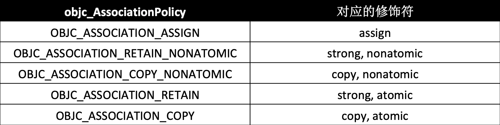
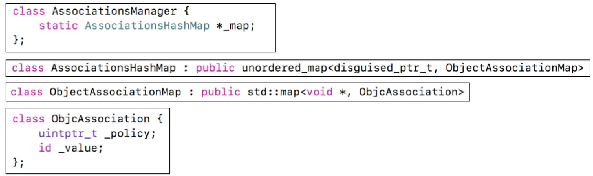

# 6、关联对象

## 6.1 如何实现给分类“添加成员变量”？

默认情况下，因为分类底层结构的限制，不能添加成员变量到分类中。但可以通过关联对象来间接实现
关联对象提供了以下API:
1. 添加关联对象

```
void objc_setAssociatedObject(id object, const void * key, id value, objc_AssociationPolicy policy)
```

2. 获得关联对象

```
id objc_getAssociatedObject(id object, const void * key
```

3. 移除所有的关联对象

```
void objc_removeAssociatedObjects(id object)
```

## 6.2 key的常见用

```
static (const) void *MyKey = &MyKey;
objc_setAssociatedObject(obj, MyKey, value, OBJC_ASSOCIATION_RETAIN_NONATOMIC)
objc_getAssociatedObject(obj, MyKey)

static (const) char MyKey;
objc_setAssociatedObject(obj, &MyKey, value, OBJC_ASSOCIATION_RETAIN_NONATOMIC)
objc_getAssociatedObject(obj, &MyKey)

使用属性名作为key（同一个常量地址相同）
objc_setAssociatedObject(obj, @"property", value, OBJC_ASSOCIATION_RETAIN_NONATOMIC);
objc_getAssociatedObject(obj, @"property");

使用get方法的@selecor作为key（或者_cmd（和@selector(方法名)等效）
objc_setAssociatedObject(obj, @selector(getter), value, OBJC_ASSOCIATION_RETAIN_NONATOMIC)
objc_getAssociatedObject(obj, @selector(getter))

注意：
加static是为了让外部无法通过extern访问。static限制作用域。
加const是为了和函数的参数类型一致，加不加都行。
```

## 6.3 objc_AssociationPolicy



* 注意：没有弱引用（weak）,弱引用相关用assign，如果访问已经释放了的对象，会造成崩溃（对象释放之后，weak会将指针置为nil，assign不会，会出现坏内存访问的崩溃）。
* 如果关联对象释放了，会将AssociationsHashMap中object对象对应的disguised_ptr_t和ObjectAssociationMap键值对移除。

## 6.4 关联对象的原理

实现关联对象技术的核心对象有

* AssociationsManager
* AssociationsHashMap
* ObjectAssociationMap
* ObjcAssociation

objc4源码解读：objc-references.mm


