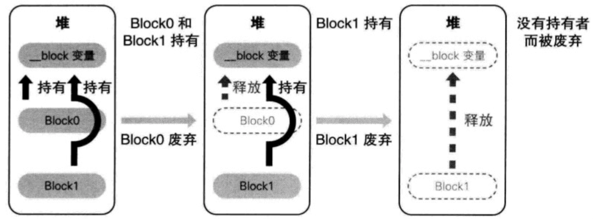
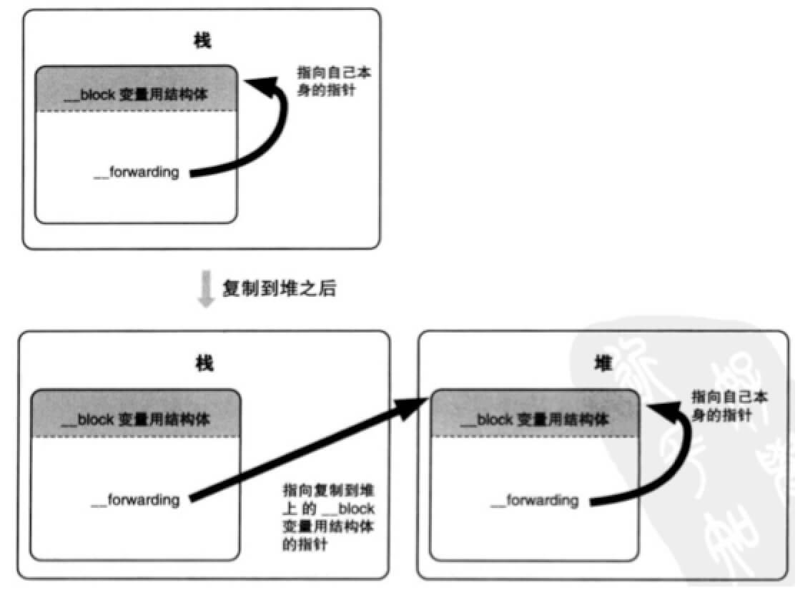
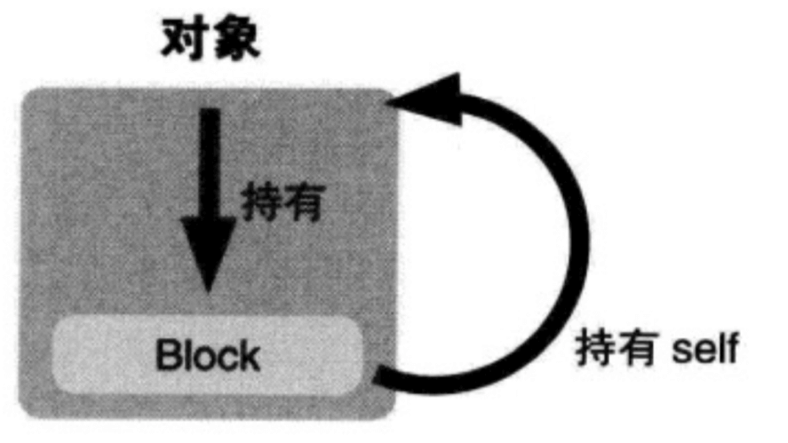
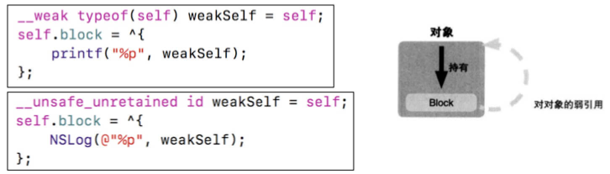
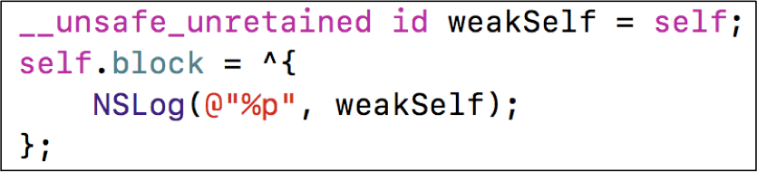
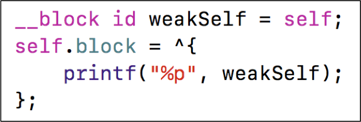

# 7、Block
## 7.1 block的本质

* block本质上也是一个OC对象，它内部也有个isa指针
* 是封装了函数调用以及函数调用环境的OC对象
* block的底层结构如图所示


```
^{
    NSLog(@"this is a block");
};

执行
^{
    NSLog(@"this is a block");
}();

将block赋值给一个变量
void (^block)(void) = ^{
    NSLog(@"this is a block");
}
执行
block();


```

## 7.2 block的变量捕获（capture）

* 变量的分类
    * 局部变量
        * auto
        * static
        * register
    * 全局变量

* 为了保证block内部能够正常访问外部的变量，block有个变量捕获机制


* 局部变量block会捕获（由于局部变量作用域，可能访问的时候变量已经释放，所以需要在block中保存），全局变量block不会捕获。

* block会捕获self。（self是oc方法的默认参数，是局部变量，oc代码转成c++代码，方法转成函数都会带两个默认参数：Class *self，SEL _cmd）

* 属性、成员变量block会捕获self，需要通过self才能访问到（属性：self.name，成员变量self->_name）


```
main.m中block的简化执行代码：
// 定义block变量
int a = 10;
static b = 20;
void (*block)(void) = &__main_block_impl_0(
                                            __main_block_func_0,
                                            &__main_block_desc_0_DATA,
                                            a,
                                            &b
                                            );

// 执行block内部的代码
block->FuncPtr(block);

其中
//结构体名称__main为调用block的方法名
struct __main_block_impl_0 {
  struct __block_impl impl;
  struct __main_block_desc_0* Desc;
  int a;
  int *b;
  // 构造函数（类似于OC的init方法），返回结构体对象
  // a(_a) 将_a的值赋值给a
  __main_block_impl_0(void *fp, struct __main_block_desc_0 *desc,  int _a, int *_b, int flags=0) : a(_a), b(_b) {
    impl.isa = &_NSConcreteStackBlock;
    impl.Flags = flags;
    impl.FuncPtr = fp;
    Desc = desc;
  }
};

// 封装了block执行逻辑的函数
static void __main_block_func_0(struct __main_block_impl_0 *__cself) {
            int a = __cself->a; 
            int *b = __cself->b;
            
            NSLog((NSString *)&__NSConstantStringImpl__var_folders_2r__m13fp2x2n9dvlr8d68yry500000gn_T_main_fd2a14_mi_0, a, (*b));
        }

static struct __main_block_desc_0 {
  size_t reserved;
  size_t Block_size;
} __main_block_desc_0_DATA = { 0, sizeof(struct __main_block_impl_0)};
```

## 7.3 block的类型
block有3种类型，可以通过调用class方法或者isa指针查看具体类型，最终都是继承自NSBlock类型

```
__NSGlobalBlock__ : __NSGlobalBlock : NSBlock : NSObject(通过[block class],[[block class] superclass],[[[block class] superclass] superclass],[[[[block class] superclass] superclass] superclass]查看)

block的类型以运行时为准，clang转的只能作为参考
```

* __NSGlobalBlock__ （ _NSConcreteGlobalBlock ）
* __NSStackBlock__ （ _NSConcreteStackBlock ）
* __NSMallocBlock__ （ _NSConcreteMallocBlock ）


```
越往下内存地址越大

int a = 10;
- (void)test {
    int b = 20;
    NSObject *o = [[NSObject allock] init];

    NSLog(@"数据区域：a %p",&a);
    NSLog(@"栈：b %p",&b);
    NSLog(@"堆：o %p",o);

    //打印类对象存放地址，看看和哪个区域接近，就可猜测存放位置
    NSLog(@"未知区域：x %p",[NSObject class]);
}
```


```
ARC下block捕获auto变量仍是stackblock，会自动对block进行copy操作，要想观察block类型需要在MRC环境下。
如果block是StackBlock，离开作用域block会被释放，再访问block会出现未知的错误。
GlobalBlock、MallocBlock调用copy类型不变，StackBlock调用copy变成MallocBlock。
MRC下对block进行copy，需要调用release释放block。

- (void)test {
    int age = 10;
    void(^block)(void) = [^{
        NSLog(@"age is %d",age);
    } copy];

    [block release];
}
```

每一种类型的block调用copy后的结果如下所示


## 7.4 block的copy

在ARC环境下，编译器会根据情况自动将栈上的block复制到堆上，比如以下情况

* block作为函数返回值时
* 将block赋值给__strong指针时
* block作为Cocoa API中方法名含有usingBlock的方法参数时
* block作为GCD API的方法参数时

MRC下block属性的建议写法
```
@property (copy, nonatomic) void (^block)(void);
```

ARC下block属性的建议写法

```
@property (strong, nonatomic) void (^block)(void);
@property (copy, nonatomic) void (^block)(void);
```

## 7.5 对象类型的auto变量

当block内部访问了对象类型的auto变量时

* 如果block是在栈上，将不会对auto变量产生强引用
* 如果block被拷贝到堆上
    * 会调用block内部的copy函数
    * copy函数内部会调用_Block_object_assign函数
    * _Block_object_assign函数会根据auto变量的修饰符（__strong、__weak、__unsafe_unretained）做出相应的操作，形成强引用（retain）或者弱引用
* 如果block从堆上移除
    * 会调用block内部的dispose函数
    * dispose函数内部会调用_Block_object_dispose函数
    * _Block_object_dispose函数会自动释放引用的auto变量（release）


```
typedef void (^MJBlock)(void);

int main(int argc, const char * argv[]) {
    @autoreleasepool {
        MJBlock block;
        {
            MJPerson *person = [[MJPerson alloc] init];
            person.age = 10;
            
//            __weak MJPerson *weakPerson = person;
            int age = 10;
            block = ^{
                NSLog(@"---------%d", person.age);
            };
        }
        NSLog(@"------");
    }
    return 0;
}
转化成c++代码
int main(int argc, const char * argv[]) {
    /* @autoreleasepool */ { __AtAutoreleasePool __autoreleasepool; 
        MJBlock block;

        {
            MJPerson *person = ((MJPerson *(*)(id, SEL))(void *)objc_msgSend)((id)((MJPerson *(*)(id, SEL))(void *)objc_msgSend)((id)objc_getClass("MJPerson"), sel_registerName("alloc")), sel_registerName("init"));
            ((void (*)(id, SEL, int))(void *)objc_msgSend)((id)person, sel_registerName("setAge:"), 10);


            int age = 10;
            block = ((void (*)())&__main_block_impl_0((void *)__main_block_func_0, &__main_block_desc_0_DATA, person, 570425344));
        }

        NSLog((NSString *)&__NSConstantStringImpl__var_folders_2r__m13fp2x2n9dvlr8d68yry500000gn_T_main_c41e64_mi_1);
    }
    return 0;
}

struct __main_block_impl_0 {
  struct __block_impl impl;
  struct __main_block_desc_0* Desc;
  MJPerson *__strong person;
  __main_block_impl_0(void *fp, struct __main_block_desc_0 *desc, MJPerson *__strong _person, int flags=0) : person(_person) {
    impl.isa = &_NSConcreteStackBlock;
    impl.Flags = flags;
    impl.FuncPtr = fp;
    Desc = desc;
  }
};

struct __block_impl {
  void *isa;
  int Flags;
  int Reserved;
  void *FuncPtr;
};

static struct __main_block_desc_0 {
  size_t reserved;
  size_t Block_size;
  void (*copy)(struct __main_block_impl_0*, struct __main_block_impl_0*);
  void (*dispose)(struct __main_block_impl_0*);
} __main_block_desc_0_DATA = { 0, sizeof(struct __main_block_impl_0), __main_block_copy_0, __main_block_dispose_0};

static void __main_block_copy_0(struct __main_block_impl_0*dst, struct __main_block_impl_0*src) {_Block_object_assign((void*)&dst->person, (void*)src->person, 3/*BLOCK_FIELD_IS_OBJECT*/);}

static void __main_block_dispose_0(struct __main_block_impl_0*src) {_Block_object_dispose((void*)src->person, 3/*BLOCK_FIELD_IS_OBJECT*/);}

static void __main_block_func_0(struct __main_block_impl_0 *__cself) {
  MJPerson *__strong person = __cself->person; // bound by copy

                NSLog((NSString *)&__NSConstantStringImpl__var_folders_2r__m13fp2x2n9dvlr8d68yry500000gn_T_main_c41e64_mi_0, ((int (*)(id, SEL))(void *)objc_msgSend)((id)person, sel_registerName("age")));
            }

```


## 7.6 __weak问题解决

在使用clang转换OC为C++代码时，可能会遇到以下问题

>cannot create __weak reference in file using manual reference

解决方案：支持ARC、指定运行时系统版本，比如

>xcrun -sdk iphoneos clang -arch arm64 -rewrite-objc -fobjc-arc -fobjc-runtime=ios-8.0.0 main.m

## 7.7 __block修饰符


* 注意 只有在需要修改auto变量的时候再添加__block。尽量不要使用，加了之后编译的代码复杂。

```
typedef void (^MJBlock)(void);

int main(int argc, const char * argv[]) {
    @autoreleasepool {
        
        __block int age = 10;
        
        MJBlock block = ^{
            age = 20;
            NSLog(@"age is %d", age);
        };

        /*
        NSLog(@"age的地址 %p",&age);
        __block int age底层转换成struct __Block_byref_age_0 age。
        这个age的地址是struct __Block_byref_age_0中成员变量age的地址而不是，结构体的地址
        隐藏的底层实现。

        struct __main_block_impl_0 *blockImpl = (__bridge struct __main_block_impl_0 *)block;

        p/x blockImpl->age
        p/x blockImpl->age->age
        （将block转成结构体，打印地址对比可知）
        */
        
        block();
    }
    return 0;
}

转成c++
int main(int argc, const char * argv[]) {
    /* @autoreleasepool */ { __AtAutoreleasePool __autoreleasepool; 

        __attribute__((__blocks__(byref))) __Block_byref_age_0 age = {
            (void*)0,
            (__Block_byref_age_0 *)&age,
             0, 
             sizeof(__Block_byref_age_0), 
             10
             };

        MJBlock block = ((void (*)())&__main_block_impl_0(
            (void *)__main_block_func_0, 
            &__main_block_desc_0_DATA, 
            (__Block_byref_age_0 *)&age, 
            570425344//flag
            ));

        ((void (*)(__block_impl *))((__block_impl *)block)->FuncPtr)((__block_impl *)block);

    }
    return 0;
}

struct __main_block_impl_0 {
  struct __block_impl impl;
  struct __main_block_desc_0* Desc;
  __Block_byref_age_0 *age; // by ref
  __main_block_impl_0(void *fp, struct __main_block_desc_0 *desc, __Block_byref_age_0 *_age, int flags=0) : age(_age->__forwarding) {
    impl.isa = &_NSConcreteStackBlock;
    impl.Flags = flags;
    impl.FuncPtr = fp;
    Desc = desc;
  }
};

struct __block_impl {
  void *isa;
  int Flags;
  int Reserved;
  void *FuncPtr;
};

static struct __main_block_desc_0 {
  size_t reserved;
  size_t Block_size;
  void (*copy)(struct __main_block_impl_0*, struct __main_block_impl_0*);
  void (*dispose)(struct __main_block_impl_0*);
} __main_block_desc_0_DATA = { 0, sizeof(struct __main_block_impl_0), __main_block_copy_0, __main_block_dispose_0};

static void __main_block_copy_0(struct __main_block_impl_0*dst, struct __main_block_impl_0*src) {_Block_object_assign((void*)&dst->age, (void*)src->age, 8/*BLOCK_FIELD_IS_BYREF*/);}

static void __main_block_dispose_0(struct __main_block_impl_0*src) {_Block_object_dispose((void*)src->age, 8/*BLOCK_FIELD_IS_BYREF*/);}

static void __main_block_func_0(struct __main_block_impl_0 *__cself) {
  __Block_byref_age_0 *age = __cself->age; // bound by ref

            (age->__forwarding->age) = 20;
            NSLog((NSString *)&__NSConstantStringImpl__var_folders_wy_w7fw9cz93q584fpvsjv4g2z00000gn_T_main_43afa8_mi_0, (age->__forwarding->age));
        }

struct __Block_byref_age_0 {
  void *__isa;
__Block_byref_age_0 *__forwarding;
 int __flags;
 int __size;
 int age;
};
```

## 7.8 __block的内存管理

* 当block在栈上时，并不会对__block变量产生强引用
* 当block被copy到堆时
    * 会调用block内部的copy函数
    * copy函数内部会调用_Block_object_assign函数
    * _Block_object_assign函数会对__block变量形成强引用（retain）


* 当block从堆中移除时
    * 会调用block内部的dispose函数
    * dispose函数内部会调用_Block_object_dispose函数
    * _Block_object_dispose函数会自动释放引用的__block变量（release)



## 7.9 __block的__forwarding指针

如果栈上的block进行copy会复制到堆上，同时将引用的__block变量复制到堆上，__forwarding指针，保证不管访问堆、栈哪个__block变量，最终修改的都是堆上的__block变量。



## 7.10 对象类型的auto变量、__block变量
* 当block在栈上时，对它们都不会产生强引用
* 当block拷贝到堆上时，都会通过copy函数来处理它们

```
__block变量（假设变量名叫做a）
_Block_object_assign((void*)&dst->a, (void*)src->a, 8/*BLOCK_FIELD_IS_BYREF*/);

对象类型的auto变量（假设变量名叫做p）
_Block_object_assign((void*)&dst->p, (void*)src->p, 3/*BLOCK_FIELD_IS_OBJECT*/);
```

* 当block从堆上移除时，都会通过dispose函数来释放它们

```
__block变量（假设变量名叫做a）
_Block_object_dispose((void*)src->a, 8/*BLOCK_FIELD_IS_BYREF*/);

对象类型的auto变量（假设变量名叫做p）
_Block_object_dispose((void*)src->p, 3/*BLOCK_FIELD_IS_OBJECT*/);
```

* 区别

```
block在堆上
对象类型的auto变量，会根据__strong/__weak _Block_object_assign决定是强引用还是弱引用。
__block变量，_Block_object_assign都是强引用。
```


## 7.11 被__block修饰的对象类型

* 当__block变量在栈上时，不会对指向的对象产生强引用
* 当__block变量被copy到堆时
    * 会调用__block变量内部的copy函数
    * copy函数内部会调用_Block_object_assign函数
    * _Block_object_assign函数会根据所指向对象的修饰符（__strong、__weak、__unsafe_unretained）做出相应的操作，形成强引用（retain）或者弱引用（注意：这里仅限于ARC时会retain，MRC时不会retain）
* 如果__block变量从堆上移除
    * 会调用__block变量内部的dispose函数
    * dispose函数内部会调用_Block_object_dispose函数
    * _Block_object_dispose函数会自动释放指向的对象（release）

## 7.12 循环引用问题



```
__weak typeof(self) weakSelf = self;
self.block = ^{
    __strong typeof(weakSelf) strongSelf = weakSelf;
    NSLog(@"age is %d",strongSelf.age);
}
加了__weak变量可能会在block调用之前已经释放，block内部是弱引用，可能无法访问到，需要用__strong保证weak变量在funcPtr未执行之前不会被释放。__strong也不是必须要加，如果weakself在block调用之前不会被释放，可以不加，加了也没问题。
```

### 7.12.1 解决循环引用问题 - ARC

* 用__weak、__unsafe_unretained解决



* 用__block解决（必须要调用block）


### 7.12.2 解决循环引用问题 - MRC

* 用__unsafe_unretained解决



* 用__block解决



## 面试题

### 1、block的原理是怎样的？本质是什么？

```
封装了函数调用以及调用环境的OC对象
```

### 2、__block的作用是什么？有什么使用注意点？

### 3、block的属性修饰词为什么是copy？使用block有哪些使用注意？

```
block一旦没有进行copy操作，就不会在堆上
使用注意：循环引用问题
```

### 4、block在修改NSMutableArray，需不需要添加__block？

```
__block是为了解决无法修改auto变量的问题。如果在block内部只是使用arr，比如添加元素，是不需要添加__block的，如果是block内重新生成一个NSArray，并赋值给block之前的auto变量，这个auto变量需要添加__block。
```
