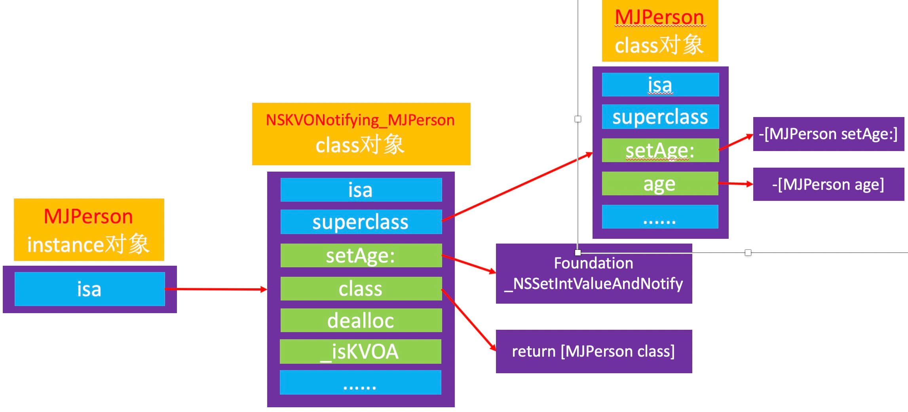
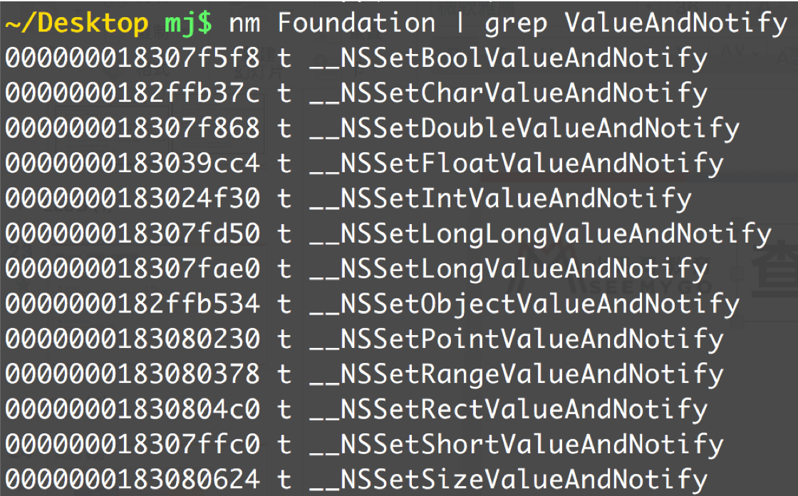

# 3、KVO

>KVO的全称是Key-Value Observing，俗称“键值监听”，可以用于监听某个对象属性值的改变


```
@interface ViewController ()
@property (strong, nonatomic) MJPerson *person1;
@property (strong, nonatomic) MJPerson *person2;
@end

@implementation ViewController

- (void)viewDidLoad {
    [super viewDidLoad];
    
    self.person1 = [[MJPerson alloc] init];
    self.person1.age = 1;
    self.person1.height = 11;
    
    self.person2 = [[MJPerson alloc] init];
    self.person2.age = 2;
    self.person2.height = 22;
    
    // 给person1对象添加KVO监听
    NSKeyValueObservingOptions options = NSKeyValueObservingOptionNew | NSKeyValueObservingOptionOld;
    [self.person1 addObserver:self forKeyPath:@"age" options:options context:@"123"];
    [self.person1 addObserver:self forKeyPath:@"height" options:options context:@"456"];
}

- (void)touchesBegan:(NSSet<UITouch *> *)touches withEvent:(UIEvent *)event
{
    self.person1.age = 20;
    self.person2.age = 20;
    
    self.person1.height = 30;
    self.person2.height = 30;
}

- (void)dealloc {
    [self.person1 removeObserver:self forKeyPath:@"age"];
    [self.person1 removeObserver:self forKeyPath:@"height"];
}

// 当监听对象的属性值发生改变时，就会调用
- (void)observeValueForKeyPath:(NSString *)keyPath ofObject:(id)object change:(NSDictionary<NSKeyValueChangeKey,id> *)change context:(void *)context
{
    NSLog(@"监听到%@的%@属性值改变了 - %@ - %@", object, keyPath, change, context);
}

```

## 3.1 未使用KVO监听的对象


## 3.2 使用了KVO监听的对象



## 3.3 查看_NSSet*AndNotify的存在

```
@interface MJPerson : NSObject
@property (assign, nonatomic) int age;
@end

@implementation MJPerson

- (void)setAge:(int)age
{
    _age = age;
    
    NSLog(@"setAge:");
}

//- (int)age
//{
//    return _age;
//}

- (void)willChangeValueForKey:(NSString *)key
{
    [super willChangeValueForKey:key];
    
    NSLog(@"willChangeValueForKey");
}

- (void)didChangeValueForKey:(NSString *)key
{
    NSLog(@"didChangeValueForKey - begin");
    
    [super didChangeValueForKey:key];
    
    NSLog(@"didChangeValueForKey - end");
}

//ViewController
- (void)viewDidLoad {
    [super viewDidLoad];
    
    self.person1 = [[MJPerson alloc] init];
    self.person1.age = 1;
    
    self.person2 = [[MJPerson alloc] init];
    self.person2.age = 2;
    
    
//    NSLog(@"person1添加KVO监听之前1 - %@ %@",
//          object_getClass(self.person1),
//          object_getClass(self.person2));

//    NSLog(@"person1添加KVO监听之前2 - %p %p",
//          [self.person1 methodForSelector:@selector(setAge:)],
//          [self.person2 methodForSelector:@selector(setAge:)]);
    
    // 给person1对象添加KVO监听
    NSKeyValueObservingOptions options = NSKeyValueObservingOptionNew | NSKeyValueObservingOptionOld;
    [self.person1 addObserver:self forKeyPath:@"age" options:options context:@"123"];
    
//    NSLog(@"person1添加KVO监听之后1 - %@ %@",
//          object_getClass(self.person1),
//          object_getClass(self.person2));
//    NSLog(@"person1添加KVO监听之后2 - %p %p",
//          [self.person1 methodForSelector:@selector(setAge:)],
//          [self.person2 methodForSelector:@selector(setAge:)]);
//
//
//    NSLog(@"类对象 - %@ %@",
//          object_getClass(self.person1),  // self.person1.isa
//          object_getClass(self.person2)); // self.person2.isa
//    NSLog(@"类对象 - %p %p",
//          object_getClass(self.person1),  // self.person1.isa
//          object_getClass(self.person2)); // self.person2.isa
//
//    NSLog(@"元类对象 - %@ %@",
//          object_getClass(object_getClass(self.person1)), // self.person1.isa.isa
//          object_getClass(object_getClass(self.person2))); // self.person2.isa.isa
//    NSLog(@"元类对象 - %p %p",
//          object_getClass(object_getClass(self.person1)), // self.person1.isa.isa
//          object_getClass(object_getClass(self.person2))); // self.person2.isa.isa

//Log查看方法
persion1添加KVO监听之前2 - 0x1065687c0 0x1065687c0
persion1添加KVO监听之后2 - 0x1069189e4 0x1065687c0

p (IMP)0x1065687c0
(IMP) $0 0x00... (Interview01`-[MJPerson setAge:] at MJPerson.m13)

p (IMP)0x1069189e4
(IMP) $1 0x00... (Foundation`_NSSetIntValueAndNotify)
    
}

类对象 - NSKVONotifying_MJPerson MJPersion
元类对象 - NSKVONotifying_MJPerson MJPersion

- (void)touchesBegan:(NSSet<UITouch *> *)touches withEvent:(UIEvent *)event
{
    // NSKVONotifying_MJPerson是使用Runtime动态创建的一个类，是MJPerson的子类
    // self.person1.isa == NSKVONotifying_MJPerson
    [self.person1 setAge:21];
    
    // self.person2.isa = MJPerson
//    [self.person2 setAge:22];
}

- (void)dealloc {
    [self.person1 removeObserver:self forKeyPath:@"age"];
}

// 当监听对象的属性值发生改变时，就会调用
- (void)observeValueForKeyPath:(NSString *)keyPath ofObject:(id)object change:(NSDictionary<NSKeyValueChangeKey,id> *)change context:(void *)context
{
    NSLog(@"监听到%@的%@属性值改变了 - %@ - %@", object, keyPath, change, context);
}

```




## 3.4 _NSSet*ValueAndNotify的内部实现


```
调用willChangeValueForKey:
调用原来的setter实现
调用didChangeValueForKey:
didChangeValueForKey:内部会调用observer的observeValueForKeyPath:ofObject:change:context:方法
```

### 3.5 KVO子类的内部方法
 ```
 通过runtime获取方法类表。就知道有下面方法
 - (void)printMethodNamesOfClass:(Class)cls {
    unsigned int count;
    // 获得方法数组
    Method *methodList = class_copyMethodList(cls, &count);
    
    // 存储方法名
    NSMutableString *methodNames = [NSMutableString string];
    
    // 遍历所有的方法
    for (int i = 0; i < count; i++) {
        // 获得方法
        Method method = methodList[i];
        // 获得方法名
        NSString *methodName = NSStringFromSelector(method_getName(method));
        // 拼接方法名
        [methodNames appendString:methodName];
        [methodNames appendString:@", "];
    }
    
    // 释放
    free(methodList);
    
    // 打印方法名
    NSLog(@"%@ %@", cls, methodNames);
}

 @implementation NSKVONotifying_MJPerson

- (void)setAge:(int)age
{
    _NSSetIntValueAndNotify();
}

// 屏幕内部实现，隐藏了NSKVONotifying_MJPerson类的存在
- (Class)class
{
    return [MJPerson class];
}

- (void)dealloc
{
    // 收尾工作
}

- (BOOL)_isKVOA
{
    return YES;
}

@end
 ```

 ## 面试题
 
 * iOS用什么方式实现对一个对象的KVO？(KVO的本质是什么？)

```
利用RuntimeAPI动态生成一个子类，并且让instance对象的isa指向这个全新的子类
当修改instance对象的属性时，会调用Foundation的_NSSetXXXValueAndNotify函数
willChangeValueForKey:
父类原来的setter
didChangeValueForKey:
内部会触发监听器（Oberser）的监听方法( observeValueForKeyPath:ofObject:change:context:）
```

* 如何手动触发KVO？

```
手动调用willChangeValueForKey:和didChangeValueForKey:
```

* 直接修改成员变量会触发KVO么？

```
不会触发KVO
```