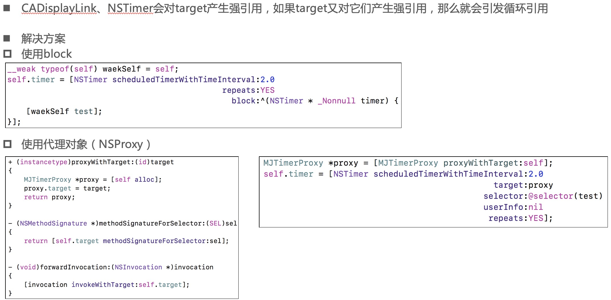
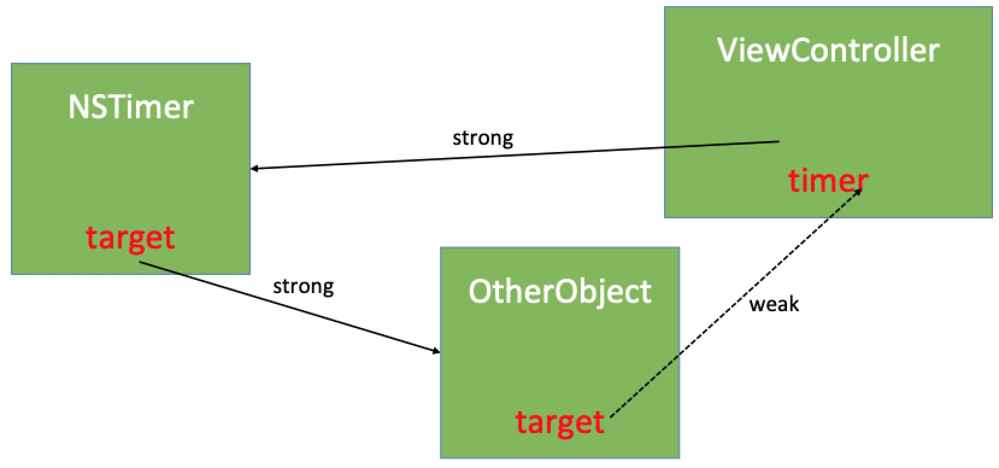
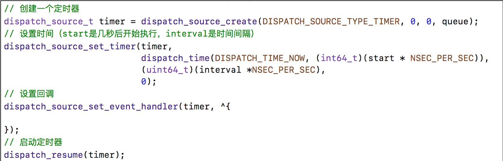
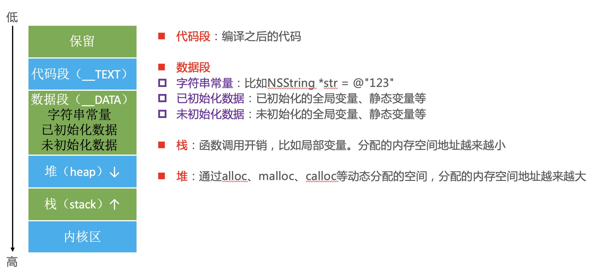
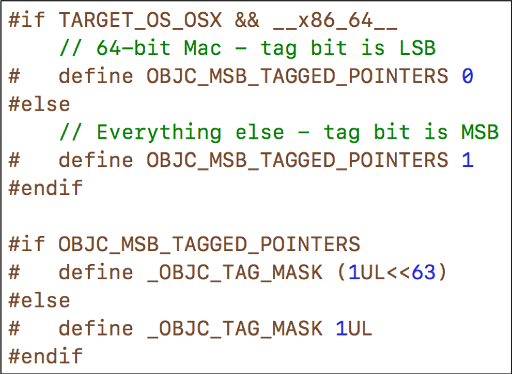
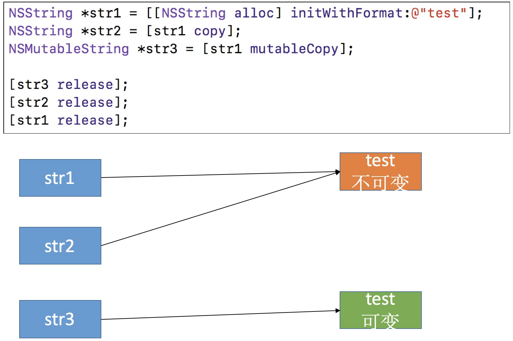
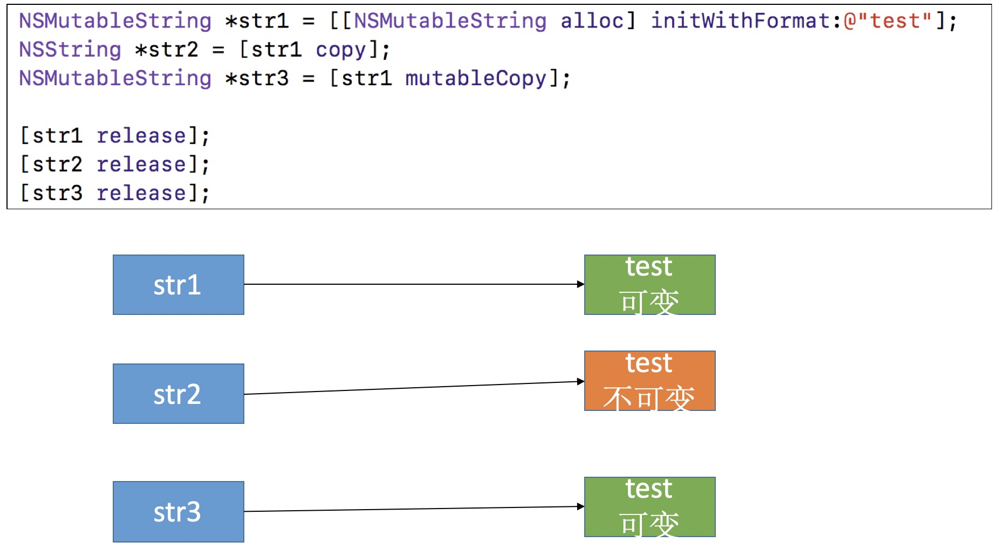
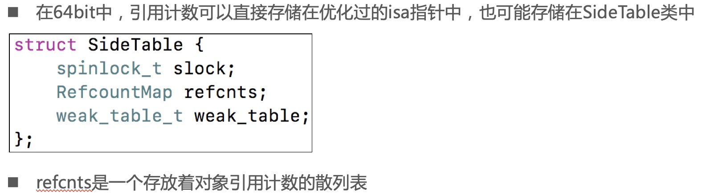
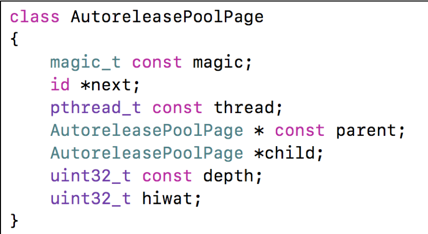

# 11、内存管理
## 11.1 定时器
### 11.1.1 CADisplayLink、NSTimer使用注意

CADisplayLink、NSTimer会强引用target，如果target再强引用CADisplayLink、NSTimer会导致循环引用。解决办法引入一个中间对象，改为弱引用。如下图所示。NSProxy对象如果发现方法找不到直接进入消息转发流程，所以中间对象用继承自NSProxy的对象最合适，效率高。

### 11.1.2 GCD定时器
* NSTimer依赖于RunLoop，如果RunLoop的任务过于繁重，可能会导致NSTimer不准时
* 而GCD的定时器会更加准时

## 11.2 内存布局

### 11.2.1 iOS程序的内存布局

### 11.2.2 Tagged Pointer
从64bit开始，iOS引入了Tagged Pointer技术，用于优化NSNumber、NSDate、NSString等小对象的存储

在没有使用Tagged Pointer之前， NSNumber等对象需要动态分配内存、维护引用计数等，NSNumber指针存储的是堆中NSNumber对象的地址值

使用Tagged Pointer之后，NSNumber指针里面存储的数据变成了：Tag + Data，也就是将数据直接存储在了指针中

当指针不够存储数据时，才会使用动态分配内存的方式来存储数据

objc_msgSend能识别Tagged Pointer，比如NSNumber的intValue方法，直接从指针提取数据，节省了以前的调用开销

如何判断一个指针是否为Tagged Pointer？
iOS平台，最高有效位是1（第64bit）
Mac平台，最低有效位是1

### 11.2.3 判断是否为Tagged Pointer

## 11.3 对象的内存管理

### 11.3.1 OC对象的内存管理
在iOS中，使用引用计数来管理OC对象的内存

一个新创建的OC对象引用计数默认是1，当引用计数减为0，OC对象就会销毁，释放其占用的内存空间

调用retain会让OC对象的引用计数+1，调用release会让OC对象的引用计数-1

内存管理的经验总结
当调用alloc、new、copy、mutableCopy方法返回了一个对象，在不需要这个对象时，要调用release或者autorelease来释放它
想拥有某个对象，就让它的引用计数+1；不想再拥有某个对象，就让它的引用计数-1

可以通过以下私有函数来查看自动释放池的情况
extern void _objc_autoreleasePoolPrint(void);

### 11.3.2 copy和mutableCopy

### 11.3.3 引用计数的存储

### 11.3.4 dealloc
当一个对象要释放时，会自动调用dealloc，接下的调用轨迹是

dealloc
_objc_rootDealloc
rootDealloc
object_dispose
objc_destructInstance、free

## 11.4 自动释放池

### 11.4.1 自动释放池
自动释放池的主要底层数据结构是：__AtAutoreleasePool、AutoreleasePoolPage

调用了autorelease的对象最终都是通过AutoreleasePoolPage对象来管理的

源码分析
clang重写@autoreleasepool
objc4源码：NSObject.mm

### 11.4.2 AutoreleasePoolPage的结构

调用push方法会将一个POOL_BOUNDARY入栈，并且返回其存放的内存地址

调用pop方法时传入一个POOL_BOUNDARY的内存地址，会从最后一个入栈的对象开始发送release消息，直到遇到这个POOL_BOUNDARY

id *next指向了下一个能存放autorelease对象地址的区域  

### 11.4.3 Runloop和Autorelease
iOS在主线程的Runloop中注册了2个Observer
第1个Observer监听了kCFRunLoopEntry事件，会调用objc_autoreleasePoolPush()
第2个Observer
监听了kCFRunLoopBeforeWaiting事件，会调用objc_autoreleasePoolPop()、objc_autoreleasePoolPush()
监听了kCFRunLoopBeforeExit事件，会调用objc_autoreleasePoolPop()

