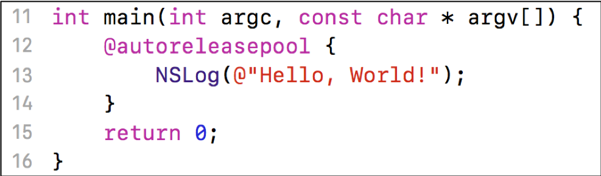
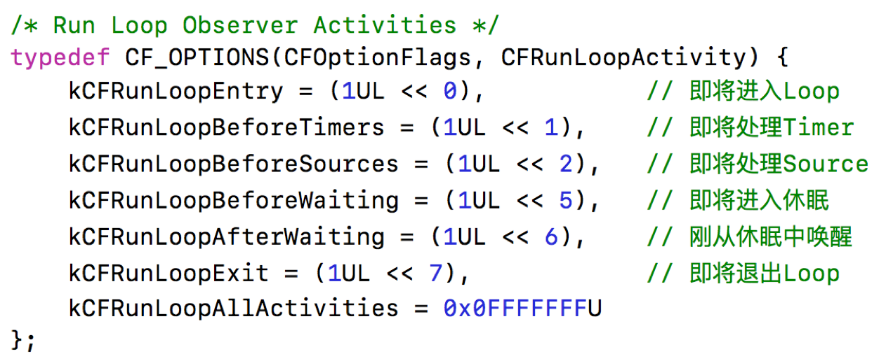
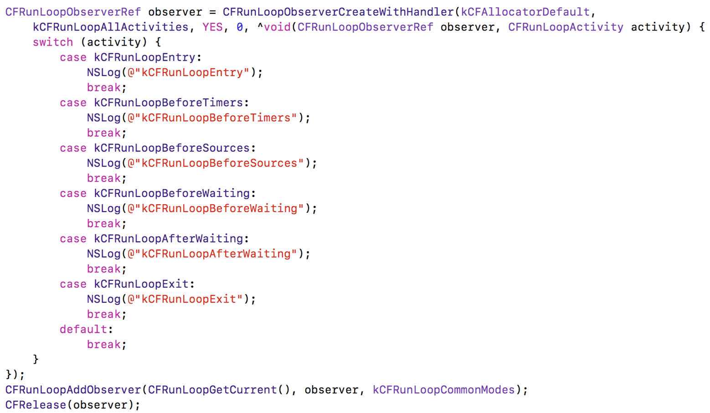
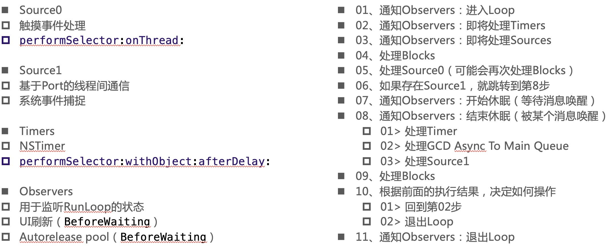
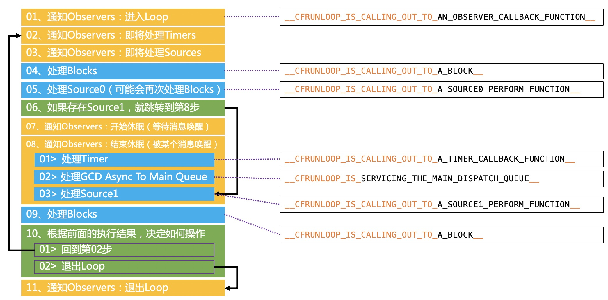

# 9、RunLoop

## 9.1 简介

### 9.1.1 什么是RunLoop

* 顾名思义
  * 运行循环
  * 在程序运行过程中循环做一些事情
* 应用范畴
  * 定时器（Timer）、PerformSelector
  * GCD Async Main Queue
  * 事件响应、手势识别、界面刷新
  * 网络请求
  * AutoreleasePool

### 9.1.2 如果没有RunLoop



* 执行完第13行代码后，会即将退出程序

### 9.1.3 如果有了RunLoop


程序并不会马上退出，而是保持运行状态

* RunLoop的基本作用
  * 保持程序的持续运行
  * 处理App中的各种事件（比如触摸事件、定时器事件等）
  * 节省CPU资源，提高程序性能：该做事时做事，该休息时休息
  * ......

## 9.2 RunLoop对象

* iOS中有2套API来访问和使用RunLoop
  * Foundation：NSRunLoop
  * Core Foundation：CFRunLoopRef

* NSRunLoop和CFRunLoopRef都代表着RunLoop对象
  * NSRunLoop是基于CFRunLoopRef的一层OC包装
  * CFRunLoopRef是开源的。[CFRunLoopRef](https://opensource.apple.com/tarballs/CF/
)

### 9.2.1 RunLoop与线程

* 每条线程都有唯一的一个与之对应的RunLoop对象

* RunLoop保存在一个全局的Dictionary里，线程作为key，RunLoop作为value

* 线程刚创建时并没有RunLoop对象，RunLoop会在第一次获取它时创建（调用[NSRunLoop CurrentRunLoop]或者CFRunLoopGetCurrent()）

* RunLoop会在线程结束时销毁

* 主线程的RunLoop已经自动获取（创建），子线程默认没有开启RunLoop

### 9.2.2 获取RunLoop对象

* Foundation
  * [NSRunLoop currentRunLoop]; // 获得当前线程的RunLoop对象
  * [NSRunLoop mainRunLoop]; // 获得主线程的RunLoop对象

* Core Foundation
  * CFRunLoopGetCurrent(); // 获得当前线程的RunLoop对象
  * CFRunLoopGetMain(); // 获得主线程的RunLoop对象

## 9.3 Mode

### 9.3.1 RunLoop相关的类


>_commonModes放的是NSRunLoopCommonModes表示的modes即NSDefaultRunLoopMode、UITrackingRunLoopMode两个，当模式为commonModes就去_commonModes查找。_commonModelItems为标记为NSRunLoopCommonModes的对象。

### 9.3.2 CFRunLoopModeRef

* CFRunLoopModeRef代表RunLoop的运行模式

* 一个RunLoop包含若干个Mode，每个Mode又包含若干个Source0/Source1/Timer/Observer

* RunLoop启动时只能选择其中一个Mode，作为currentMode

* 如果需要切换Mode，只能退出当前Loop，再重新选择一个Mode进入
  * 不同组的Source0/Source1/Timer/Observer能分隔开来，互不影响

* 如果Mode里没有任何Source0/Source1/Timer/Observer，RunLoop会立马退出

* 常见的2种Mode
  * kCFRunLoopDefaultMode（NSDefaultRunLoopMode）：App的默认Mode，通常主线程是在这个Mode下运行

  * UITrackingRunLoopMode：界面跟踪 Mode，用于 ScrollView 追踪触摸滑动，保证界面滑动时不受其他 Mode 影响

>lldb命令 bt可以打印隐藏的函数调用栈。

### 9.3.3 CFRunLoopObserverRef



### 9.3.4 添加Observer监听RunLoop的所有状态



## 9.4 RunLoop的运行逻辑





* 04中的block  CFRunLoopPerformBlock(`CFRunLoopRef rl`,`CFTypeRef mode`,`^(void)block`)
* 新建一个Single View App项目。在ViewController添加touchBegin方法，在方法中添加一个断点，运行点击屏幕，来到断点。lldb中执行bt命名，就可以看到被xcode影藏的详细调用栈，找到runloop入口函数CFRunLoopRunSpecific，然后去上面的runloop源码中搜索。
* 07休眠，通过mach_msg调用内核api让当前线程休眠，不做任何事情。while(1)虽然也阻塞线程，但是线程一直在循环执行，没有真正的休眠。

* 休眠原理


```
...
在ViewController上添加一个UITextView，并滑动UITextView
...
switch(activity) {
    case kcfRunLoopEntry: {
        CFRunLoopMode mode = CFRunLoopCopyCurrentMode(CFRunLoopGetCurrent());
        NSLog(@"kCFRunLoopEntry - %@",mode);
        break;
    }
    case kCFRunLoopExit: {
        CFRunLoopMode mode = CFRunLoopCopyCurrentMode(CFRunLoopGetCurrent());
        NSLog(@"kCFRunLoopExit - %@",mode);
        break;
    }
}
观察UITextView=滚动过程mode切换。滚动时为UITrackingRunLoopMode，停止滚动为kCFRunLoopDefaultMode
```

## 9.5 RunLoop在实际开中的应用

* 控制线程生命周期（线程保活）

```
@interface MJThread : NSThread
@end
#import "MJThread.h"
@implementation MJThread
- (void)dealloc
{
    NSLog(@"%s", __func__);
}
@end

#import "ViewController.h"
#import "MJThread.h"

@interface ViewController ()
@property (strong, nonatomic) MJThread *thread;
@property (assign, nonatomic, getter=isStoped) BOOL stopped;
@end

@implementation ViewController

- (void)viewDidLoad {
    [super viewDidLoad];
    
    __weak typeof(self) weakSelf = self;
    
    self.stopped = NO;
    self.thread = [[MJThread alloc] initWithBlock:^{
        NSLog(@"%@----begin----", [NSThread currentThread]);
        
        // 往RunLoop里面添加Source\Timer\Observer
        [[NSRunLoop currentRunLoop] addPort:[[NSPort alloc] init] forMode:NSDefaultRunLoopMode];
        while (!weakSelf.isStoped) {
            [[NSRunLoop currentRunLoop] runMode:NSDefaultRunLoopMode beforeDate:[NSDate distantFuture]];
        }
        
        NSLog(@"%@----end----", [NSThread currentThread]);
        
        // NSRunLoop的run方法是无法停止的，它专门用于开启一个永不销毁的线程（NSRunLoop）
        //        [[NSRunLoop currentRunLoop] run];
        /*
         it runs the receiver in the NSDefaultRunLoopMode by repeatedly invoking runMode:beforeDate:.
         In other words, this method effectively begins an infinite loop that processes data from the run loop’s input sources and timers
         */
        
    }];
    [self.thread start];
}

- (void)touchesBegan:(NSSet<UITouch *> *)touches withEvent:(UIEvent *)event
{
    [self performSelector:@selector(test) onThread:self.thread withObject:nil waitUntilDone:NO];
}

// 子线程需要执行的任务
- (void)test
{
    NSLog(@"%s %@", __func__, [NSThread currentThread]);
}

- (IBAction)stop {
    // 在子线程调用stop
    [self performSelector:@selector(stopThread) onThread:self.thread withObject:nil waitUntilDone:NO];
    //waitUntilDone=NO不会等待子线程执行完直接返回。点击返回按钮，控制器销毁，delloc中调用stop，不等stopThread执行就直接结束stop，控制器销毁，然后执行stopThread中的方法，因为控制器已经销毁，会出现坏内存访问的崩溃。需要将这个参数改为YES。等子线程中的执行完，delloc才能执行完，在释放控制器。

}

// 用于停止子线程的RunLoop
- (void)stopThread
{
    // 设置标记为NO
    self.stopped = YES;
    
    // 停止RunLoop
    CFRunLoopStop(CFRunLoopGetCurrent());
    NSLog(@"%s %@", __func__, [NSThread currentThread]);
}

- (void)dealloc
{
    NSLog(@"%s", __func__);
    
    [self stop];
}

@end
```

* 解决NSTimer在滑动时停止工作的问题

```
static int count = 0;
NSTimer *timer = [NSTimer timerWithTimeInterval:1.0 repeats:YES block:^(NSTimer * _Nonnull timer) {
    NSLog(@"%d", ++count);
}];
//    [[NSRunLoop currentRunLoop] addTimer:timer forMode:NSDefaultRunLoopMode];
//    [[NSRunLoop currentRunLoop] addTimer:timer forMode:UITrackingRunLoopMode];
    
// NSDefaultRunLoopMode、UITrackingRunLoopMode才是真正存在的模式
// NSRunLoopCommonModes并不是一个真的模式，它只是一个标记
// timer能在_commonModes数组中存放的模式下工作
[[NSRunLoop currentRunLoop] addTimer:timer forMode:NSRunLoopCommonModes];
```

* 监控应用卡顿
* 性能优化

## 面试题

### 1、讲讲 RunLoop，项目中有用到吗？

### 2、runloop内部实现逻辑？

### 3、runloop和线程的关系？

### 4、timer 与 runloop 的关系？

### 5、程序中添加每3秒响应一次的NSTimer，当拖动tableview时timer可能无法响应要怎么解决？

### 6、runloop 是怎么响应用户操作的， 具体流程是什么样的？

### 7、说说runLoop的几种状态

### 8、runloop的mode作用是什么？